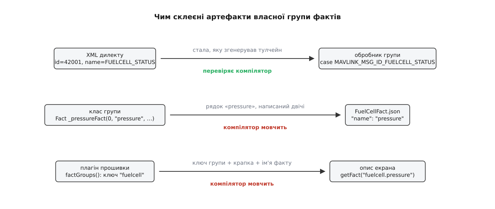
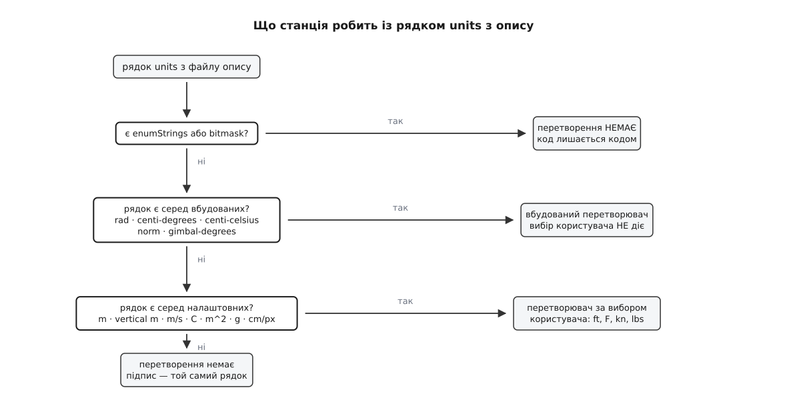

# ⚙️ Власна група фактів: від байтів свого повідомлення до цифри на екрані

Тут зібрано весь код, який треба написати, щоб поле власного MAVLink-повідомлення стало показником у наземній станції — з підписом, одиницями, прочерком замість сміття й розумним темпом оновлення. Виходить близько ста п'ятдесяти рядків, розкладених на чотири артефакти, причому найцікавіше в цій задачі не код, а те, що ці чотири артефакти зв'язані між собою **рядками**, яких компілятор не звіряє.

## Умова

Апарат несе водневий паливний елемент замість акумулятора. Модуль елемента звітує власним повідомленням, якого немає в жодному відомому дилекті (англ. *dialect* — говірка; тут — набір описів повідомлень, з якого генерують бібліотеку розбору):

```xml
<message id="42001" name="FUELCELL_STATUS">
  <description>Стан водневого паливного елемента.</description>
  <field type="uint32_t" name="time_boot_ms" units="ms">Час від старту модуля.</field>
  <field type="uint16_t" name="pressure" units="cbar">Тиск у балоні. UINT16_MAX — датчик не відповідає.</field>
  <field type="int16_t"  name="temperature" units="cdegC">Температура стека. INT16_MAX — немає даних.</field>
  <field type="uint16_t" name="power" units="dW">Віддана потужність.</field>
  <field type="uint8_t"  name="capacity_remaining" units="%">Лишок палива. UINT8_MAX — невідомо.</field>
  <field type="uint8_t"  name="state">Режим елемента: 0 спокій, 1 прогрів, 2 робота, 3 охолодження, 4 відмова.</field>
  <field type="uint16_t" name="faults">Бітова маска несправностей.</field>
</message>
```

На екрані пілота має з'явитися рядок «215.0 bar · 58.2 C · 812 W · 74 %», у режимі — слово «Робота», а не число 2, а коли датчик тиску мовчить — прочерк, а не 655.35. Сервісний інженер хоче ту саму групу значень на своїй сторінці, але з реакцією без затримки: він продуває стек і мусить бачити, як падає тиск, просто зараз.

Три умови, які цю задачу роблять задачею. Перша: у стандартних екранах станції не можна змінити жодного рядка — інакше кожне оновлення апстриму перетворюється на розбір конфліктів. Друга: цифри мусять бути доступні всім елементам станції — і приладу польотного вигляду, і сторінці налаштувальника, і майбутньому екрану, якого ще не написано. Третя: телеметрія приходить із темпом модуля, а не з темпом ока.

## Ідея

Станція вміє показувати те, чого не знає, бо всяка величина живе в ній як **факт** — об'єкт з іменем, значенням, сигналом про зміну й окремо доданим описом (одиниці, знаки після коми, підписи кодів). Факти складені в **групи фактів**: група володіє своїми фактами, тримає для них файл опису й вирішує, як часто повідомляти екран про зміни. Об'єкт апарата сам є такою групою, а всі його телеметрійні групи — GPS, вітер, вібрація — вкладені в нього під іменами.

Звідси й розв'язок: написати ще одну таку групу. Тоді нічого не треба вигадувати ні для показу, ні для доступу, ні для темпу — усе це група вже вміє.

Артефактів виходить чотири:

1. **опис повідомлення** в дилекті — щоб бібліотека розбору вміла розкласти пакет на поля;
2. **клас групи** з фактами-полями й обробником повідомлення;
3. **файл опису** для цих фактів — одиниці, знаки, підписи кодів;
4. **реєстрація** групи, щоб об'єкт апарата взяв її до себе під іменем.

Ключова властивість цієї конструкції — і головне джерело помилок — у тому, що артефакти не знають одне про одного нічого, крім збігу рядків.



*Із трьох швів компілятор тримає лише верхній. Два нижні тримає уважність — і саме на них припадає більшість годин, згаяних на цій задачі.*

## Крок 1. Повідомлення в дилекті

Свій XML має підключати `all.xml` (інакше з нього зникнуть усі звичайні повідомлення), а сам файл треба покласти в репозиторій, з якого станція бере бібліотеку MAVLink. Далі три значення в кеші збірки:

```cmake
# custom/cmake/CustomOverrides.cmake — читається до project()
set(QGC_MAVLINK_GIT_REPO "https://git.example/mavlink-fuelcell.git" CACHE STRING "" FORCE)
set(QGC_MAVLINK_GIT_TAG  "v1.4.0"                                  CACHE STRING "" FORCE)
set(QGC_MAVLINK_DIALECT  "fuelcell"                                CACHE STRING "" FORCE)
```

Типово тут стоять офіційне сховище MAVLink, конкретний коміт і дилект `all`. Заміна цих трьох рядків — це весь механізм: генератор збере з нашого XML звичайні `mavlink_fuelcell_status_t` і `mavlink_msg_fuelcell_status_decode()`, і далі власне повідомлення нічим не відрізняється від чужих. Подробиці — у [власних MAVLink-повідомленнях у застосунку](book:qgroundcontrol/custom-mavlink-messages); про саму теку `custom/`, яка не чіпає апстриму, — у [власній збірці](book:qgroundcontrol/custom-build).

Одна річ у цьому кроці — не смак, а вимога. У MAVLink 2 номер повідомлення сягає 16777215, тоді як перша версія має на нього лише вісім бітів, тож усе, що менше за 256, належить їй і розписане в спільному наборі; приватний дилект бере номер вище й тільки такий, якого немає в жодному включеному файлі. Збіг усередині власного дилекту впіймає генератор. Небезпечніший збіг — із чужою системою, що говорить у тому самому ефірі, і тут нас рятує сама будова протоколу: у контрольну суму пакета MAVLink підмішує сталу, обчислену з імені повідомлення та типів і назв його полів, тож два різні повідомлення під одним номером не розберуться навскіс — пакет просто не пройде перевірку й зникне. Рятує тихо: назовні це виглядає як «повідомлення не приходить узагалі», без жодного натяку на причину. Як улаштована ця перевірка — у [пакеті MAVLink](book:communications/mavlink-packet).

## Крок 2. Клас групи

Група — це звичайний нащадок `FactGroup`. Усе, що в ньому є: факти полями, читачі до них і обробник повідомлення.

```cpp
// custom/src/FuelCellFactGroup.h
#pragma once

#include "FactGroup.h"
#include "QGCMAVLink.h"

class FuelCellFactGroup : public FactGroup
{
    Q_OBJECT
    Q_PROPERTY(Fact *pressure    READ pressure    CONSTANT)
    Q_PROPERTY(Fact *temperature READ temperature CONSTANT)
    Q_PROPERTY(Fact *power       READ power       CONSTANT)
    Q_PROPERTY(Fact *remaining   READ remaining   CONSTANT)
    Q_PROPERTY(Fact *state       READ state       CONSTANT)
    Q_PROPERTY(Fact *faults      READ faults      CONSTANT)

public:
    explicit FuelCellFactGroup(QObject *parent = nullptr);

    Fact *pressure()    { return &_pressureFact;    }
    Fact *temperature() { return &_temperatureFact; }
    Fact *power()       { return &_powerFact;       }
    Fact *remaining()   { return &_remainingFact;   }
    Fact *state()       { return &_stateFact;       }
    Fact *faults()      { return &_faultsFact;      }

    void handleMessage(Vehicle *vehicle, const mavlink_message_t &message) override;

private:
    Fact _pressureFact    = Fact(0, QStringLiteral("pressure"),    FactMetaData::valueTypeDouble);
    Fact _temperatureFact = Fact(0, QStringLiteral("temperature"), FactMetaData::valueTypeDouble);
    Fact _powerFact       = Fact(0, QStringLiteral("power"),       FactMetaData::valueTypeDouble);
    Fact _remainingFact   = Fact(0, QStringLiteral("remaining"),   FactMetaData::valueTypeDouble);
    Fact _stateFact       = Fact(0, QStringLiteral("state"),       FactMetaData::valueTypeUint8);
    Fact _faultsFact      = Fact(0, QStringLiteral("faults"),      FactMetaData::valueTypeUint32);
};
```

Три деталі варті погляду, бо кожна з них — вибір, а не обряд.

**Факти лежать полями, а не вказівниками.** Група володіє ними цілком: вони народжуються й помирають разом із нею, і жодного `new` у конструкторі не буде. Перше число в конструкторі факту — номер компонента, тобто відповідь на питання «чий це параметр». Для телеметрії питання не має сенсу, тому штатні групи станції ставлять там нуль, і ми ставимо теж.

**Тип оголошується тут, а не в файлі опису.** У факті лежить значення з динамічним типом, і `valueTypeDouble` каже, у що його приводити на кожному записі. Тиск, температура й потужність оголошені дробовими, хоча в пакеті їдуть цілими, — саме тому, що ділити їх ми будемо ще в обробнику. Режим лишається цілим без знаку, бо це код, а не кількість.

**Читачі повертають вказівник на факт, а не значення.** Опис екрана має зачепитися за об'єкт із сигналом про зміну; якби читач віддавав число, прив'язка не мала б за що триматися й цифра застигла б на першому значенні.

## Крок 3. Обробник

```cpp
// custom/src/FuelCellFactGroup.cc
#include "FuelCellFactGroup.h"

FuelCellFactGroup::FuelCellFactGroup(QObject *parent)
    : FactGroup(1000, QStringLiteral(":/custom/json/FuelCellFact.json"), parent)
{
    _addFact(&_pressureFact);
    _addFact(&_temperatureFact);
    _addFact(&_powerFact);
    _addFact(&_remainingFact);
    _addFact(&_stateFact);
    _addFact(&_faultsFact);

    // Доки модуль не озвався, показувати нема чого — і це не нуль.
    _pressureFact.setRawValue(qQNaN());
    _temperatureFact.setRawValue(qQNaN());
    _powerFact.setRawValue(qQNaN());
    _remainingFact.setRawValue(qQNaN());
}

void FuelCellFactGroup::handleMessage(Vehicle *vehicle, const mavlink_message_t &message)
{
    Q_UNUSED(vehicle)

    if (message.msgid != MAVLINK_MSG_ID_FUELCELL_STATUS) {
        return;
    }

    mavlink_fuelcell_status_t fuelCell{};
    mavlink_msg_fuelcell_status_decode(&message, &fuelCell);

    _pressureFact.setRawValue(
        (fuelCell.pressure == UINT16_MAX) ? qQNaN() : (fuelCell.pressure / 100.0));
    _temperatureFact.setRawValue(
        (fuelCell.temperature == INT16_MAX) ? qQNaN() : (fuelCell.temperature / 100.0));
    _powerFact.setRawValue(fuelCell.power / 10.0);
    _remainingFact.setRawValue(
        (fuelCell.capacity_remaining == UINT8_MAX) ? qQNaN() : fuelCell.capacity_remaining);
    _stateFact.setRawValue(fuelCell.state);
    _faultsFact.setRawValue(fuelCell.faults);

    _setTelemetryAvailable(true);
}
```

Обробник викликається на **кожне** повідомлення, яке дійшло до цього апарата, а не лише на наше, — тому першим рядком стоїть відсіювання за номером, і воно має бути дешевим. Порівняння цілого числа таким і є.

Далі три різні за природою дії, які легко переплутати між собою.

**Масштаб** — це розбір протоколу. Ділення на сто перетворює сантибари на бари, ділення на десять — децивати на вати. Пакет закодував величину так, щоб влізти в цілі поля, і розкодувати її — робота обробника; у факт кладеться вже величина, а не її упаковка. Це важливо тримати в голові, бо станція має й інший, зовсім не той механізм перетворення чисел — про нього наступний крок.

**Сторожові значення** (англ. *sentinel* — вартовий) — це домовленість протоколу про те, як сказати «даних немає» полем, у якому немає місця для окремого прапорця. Максимальне значення типу віддається під це значення й перестає означати кількість. Обробник мусить його впіймати й покласти у факт **не число** — `qQNaN()`, тобто NaN зі стандарту чисел із рухомою комою. Показник, зв'язаний з таким фактом, покаже прочерк; арифметика над ним не дасть тихо неправильного числа, бо NaN заражає будь-який вираз, у який потрапив ([числа з рухомою комою](book:programming/floating-point) описують це докладніше: NaN не дорівнює навіть сам собі, і саме тому його не можна переплутати з дійсним значенням). Пропустити цю перевірку — означає показати пілотові 655.35 бар у балоні, до якого просто відвалився роз'єм.

**Ознака живості.** Захищений `_setTelemetryAvailable(true)` — це те, як група каже станції: «дані є». Без цього виклику всі цифри оновлюватимуться справно, але кожен елемент, що приховує себе, доки телеметрія не пішла, лишатиметься прихованим — і виглядатиме це так, ніби група мертва, хоча вона працює.

**Умова: у пакеті `pressure = 21500`, `temperature = 5820`, `power = 8120`, `capacity_remaining = 255`, `state = 2`.**

```
pressure    21500 ≠ UINT16_MAX (65535)  →  21500 / 100 = 215.0     bar
temperature  5820 ≠ INT16_MAX  (32767)  →   5820 / 100 =  58.2     C
power        8120                       →   8120 /  10 = 812.0     W
remaining      255 = UINT8_MAX  (255)   →  NaN                     → прочерк
state            2                      →  код 2, ніякої арифметики
```

## Крок 4. Файл опису

Число вже правильне, але воно й далі голе. Підпис, одиницю, кількість знаків після коми й підписи кодів дає окремий файл, ім'я якого ми віддали конструкторові групи:

```json
{
    "version":      1,
    "fileType":     "FactMetaData",
    "QGC.MetaData.Facts":
[
{
    "name":          "pressure",
    "shortDesc":     "Тиск у балоні",
    "longDesc":      "Тиск водню в балоні. Нижче 20 бар елемент переходить у відмову.",
    "type":          "double",
    "units":         "bar",
    "decimalPlaces": 1
},
{
    "name":          "temperature",
    "shortDesc":     "Температура стека",
    "type":          "double",
    "units":         "C",
    "decimalPlaces": 1
},
{
    "name":          "power",
    "shortDesc":     "Віддана потужність",
    "type":          "double",
    "units":         "W",
    "decimalPlaces": 0
},
{
    "name":          "remaining",
    "shortDesc":     "Лишок палива",
    "type":          "double",
    "units":         "%",
    "decimalPlaces": 0
},
{
    "name":          "state",
    "shortDesc":     "Режим елемента",
    "type":          "uint8",
    "enumStrings":   "Спокій,Прогрів,Робота,Охолодження,Відмова",
    "enumValues":    "0,1,2,3,4",
    "decimalPlaces": 0
},
{
    "name":       "faults",
    "shortDesc":  "Несправності",
    "type":       "uint32",
    "bitmask": [
        { "index": 0, "description": "Низький тиск" },
        { "index": 1, "description": "Перегрів стека" },
        { "index": 2, "description": "Витік водню" },
        { "index": 3, "description": "Відмова вентилятора" }
    ]
}
]
}
```

Ключ `"name"` тут — і є другий шов зі схеми. Група при додаванні кожного факту шукає в мапі описів запис за іменем факту й, знайшовши, чіпляє його. Не знайшовши — мовчки лишає факт без опису. Це навмисне: факт без опису робочий, він просто показує голе число. Про сам файл треба знати ще дві речі. Він має бути ресурсом, вшитим у бінарник (звідси двокрапка на початку шляху), тобто вписаним у наш `custom.qrc`. І він читається один раз у конструкторі групи — виправлений на диску `.json` без перезбирання ресурсів нічого не змінить.

Найтонше місце всього файлу — рядок `"units"`. Він не просто підпис: станція шукає його у двох таблицях і залежно від результату чіпляє до факту перетворювач, який перерахує сире значення для показу.



*Гілки взаємно виключні: перша, що спрацювала, зупиняє пошук. Тому рядок одиниць вирішує не тільки як підписати, а й чи діятиме взагалі вибір системи одиниць у налаштуваннях.*

Розберімо, що з цього виходить для наших шести фактів.

`"C"` для температури стоїть у таблиці налаштувань — отже, користувач, який вибрав Фаренгейти, побачить `136.8 F`, а не `58.2 C`, і жодного коду для цього не написано. У тій самій таблиці живуть `m`, `vertical m`, `m/s`, `m^2`, `g` і `cm/px`: усе, що виміряне метрично, варто оголошувати саме цими рядками — тоді величина сама поїде за вибором користувача.

`"bar"` і `"W"` немає в жодній таблиці. Перетворювача не буде, показане значення дорівнюватиме сирому, а підпис лишиться тим самим рядком. Це нормальний і найчастіший випадок для вузькоспеціальних величин.

`"%"` теж немає в таблицях, і це саме те, чого ми хочемо: відсоток лишається відсотком.

У режиму й маски одиниць немає взагалі. І навіть якби були, перетворення не відбулося б: наявність `enumStrings` або `bitmask` вимикає його першою ж перевіркою. Правильно: код `2` не є кількістю чогось, його не можна ні перевести у фути, ні поділити на сто.

> 🔧 **Навіщо це.** Спокуслива економія — оголосити температуру як `"units": "centi-celsius"` і не ділити на сто в обробнику: станція має вбудований перетворювач саме з цим ім'ям, і на екрані з'явиться правильне `58.2 C`. Пастка в тому, що вбудована таблиця перевіряється **раніше** за таблицю налаштувань і зупиняє пошук — тож перемикач одиниць у налаштуваннях перестане діяти саме на цю величину, і ніхто довго не зрозуміє, чому Фаренгейти не працюють на одному-єдиному показнику. Крім того, у журнал і в будь-яку арифметику поїдуть сантиградуси. Ділення в обробнику плюс чесне `"C"` — на один рядок довше й на один клас помилок коротше.

## Крок 5. Період оновлення

Перше число в конструкторі групи — період у мілісекундах, і воно робить більше, ніж здається. Група з ненульовим періодом при додаванні кожного факту глушить його сповіщення для інтерфейсу, а сама заводить таймер, який раз на період випускає накопичене — по одному сповіщенню на факт, і лише для тих фактів, які справді змінилися.

Тут важливо, що саме притлумлено. Значення оновлюється на **кожне** повідомлення; сповіщення для логіки й журналу теж іде на кожне. Злипаються лише сповіщення для екрана. Дані не втрачаються — втрачаються зайві перемальовування.

Вибирати період варто від ока, а не від каналу. Тиск у балоні падає за хвилини, температура — за десятки секунд, лишок палива — за одиниці відсотків на хвилину; тисяча мілісекунд для всього цього більш ніж достатньо, навіть якщо модуль звітує вдесятеро частіше. Нуль означає «сигналити негайно» і потрібен лише там, де людина крутить регулятор і має бачити реакцію.

Сервісна сторінка з умови — саме такий випадок, і для неї є перемикач:

```cpp
Q_INVOKABLE void setLiveUpdates(bool liveUpdates);
```

Увімкнений живий режим зупиняє таймер і знімає глушники з усіх фактів групи; вимкнений — вертає все назад. Дві речі про нього треба знати наперед. Перша: у групі, створеній із нульовим періодом, він не робить нічого — вимикати нема чого. Друга: вимкнути його — обов'язок того, хто ввімкнув. Про наслідки забудькуватості — у граблях.

## Крок 6. Реєстрація

Група написана, але про неї ніхто не знає. Метод, яким об'єкт апарата додає до себе вкладені групи, захищений, і успадковувати `Vehicle` застосунок не дає, — тож єдиний передбачений вхід веде через [плагін прошивки](book:qgroundcontrol/firmware-plugin). Плагін прошивки — це закуток, у який зведено все, чим одна прошивка відрізняється від іншої: описи параметрів, назви режимів польоту, поправки до повідомлень. Серед його гачків є й такий:

```cpp
/// Returns a pointer to a dictionary of firmware-specific FactGroups
virtual QMap<QString, FactGroup*> *factGroups() { return nullptr; }
```

Наша реалізація — нащадок штатного плагіна з одним полем і однією мапою, у якій один запис:

```cpp
// custom/src/CustomFirmwarePlugin.h
class CustomFirmwarePlugin : public PX4FirmwarePlugin
{
    Q_OBJECT
public:
    explicit CustomFirmwarePlugin(QObject *parent = nullptr);

    QMap<QString, FactGroup*> *factGroups() final { return &_factGroups; }

private:
    FuelCellFactGroup         _fuelCellFactGroup;
    QMap<QString, FactGroup*> _factGroups;
};

// custom/src/CustomFirmwarePlugin.cc
CustomFirmwarePlugin::CustomFirmwarePlugin(QObject *parent)
    : PX4FirmwarePlugin(parent)
    , _fuelCellFactGroup(this)
{
    _factGroups.insert(QStringLiteral("fuelcell"), &_fuelCellFactGroup);
}
```

Щоб застосунок узагалі побачив цей плагін, потрібна ще фабрика — нащадок `FirmwarePluginFactory`, оголошений статичним об'єктом у нашій теці; його конструктор сам вписує фабрику в реєстр, а `firmwarePluginForAutopilot()` віддає єдиний примірник плагіна.

Далі забирає апстрим, і саме тут з'являється ім'я `"fuelcell"`:

```cpp
// Vehicle::_commonInit(), апстрим — не наш код
// Add firmware-specific fact groups, if provided
QMap<QString, FactGroup*>* fwFactGroups = _firmwarePlugin->factGroups();
if (fwFactGroups) {
    for (auto it = fwFactGroups->keyValueBegin(); it != fwFactGroups->keyValueEnd(); ++it) {
        _addFactGroup(it->second, it->first);
    }
}
```

А потік повідомлень доходить до групи так само механічно — об'єкт апарата обносить ним усі свої групи, не питаючи, чиї вони:

```cpp
// Let the fact groups take a whack at the mavlink traffic
for (FactGroup* factGroup : factGroups()) {
    factGroup->handleMessage(this, message);
}
```

Тобто наша група не отримала жодного привілею. Вона просто стала в один ряд із GPS і вібрацією — і саме тому далі все працює само. Хто ще володіє групами й коли вони з'являються — в [об'єкті апарата](book:qgroundcontrol/vehicle-object).

## Крок 7. Звертання з опису екрана

Оскільки група вкладена в апарат під іменем, до її фактів звертаються складеним іменем — ім'я групи, крапка, ім'я факту:

```qml
QGCLabel {
    text: vehicle.getFact("fuelcell.pressure").valueString
}
```

`valueString` — уже готовий рядок: перерахований перетворювачем, округлений до заявленої кількості знаків, із доданим підписом одиниць. Для режиму той самий факт віддасть `enumStringValue`, тобто «Робота» замість двійки, а для маски несправностей — список підписів тих бітів, що підняті. Жодної арифметики й жодного `switch` в описі екрана не з'являється: усе, що потрібно було знати про величину, лежить у файлі опису.

Це і є третій шов зі схеми. Рядок `"fuelcell.pressure"` збирається з ключа, який ми вписали в мапу плагіна, і з імені, яке ми дали факту в конструкторі. Помилитися в ньому можна безкарно: не знайшовши факту, станція поверне порожній вказівник і напише попередження в журнал — а на екрані буде порожньо.

## Скільки коду вийшло

| файл | рядків | що робить |
|---|---|---|
| `custom/cmake/CustomOverrides.cmake` | 3 | звідки брати дилект |
| `mavlink-fuelcell/message_definitions/fuelcell.xml` | ~12 | опис повідомлення |
| `custom/src/FuelCellFactGroup.h` | ~35 | шість фактів і читачі |
| `custom/src/FuelCellFactGroup.cc` | ~40 | конструктор і обробник |
| `custom/res/FuelCellFact.json` | ~45 | одиниці, знаки, підписи кодів |
| `custom/src/CustomFirmwarePlugin.*` | ~25 | одна мапа з одним записом |

Півтори сотні рядків — і в жодному екрані станції не змінено нічого. Причому найважче в цьому списку не C++, а `.json`: саме там ухвалюються рішення, які визначають, чи діятиме вибір одиниць, чи побачить людина слово замість коду й чи не поїде в журнал напівоброблене число.

## Граблі

Майже всі помилки цієї задачі тихі: збірка проходить, застосунок запускається, цифра на екрані є — просто не та.

### Забутий JSON: голе число без одиниць

Найчастіша й найпростіша. Ім'я файлу опису вписане з помилкою, файл не потрапив у `.qrc`, ресурси не перезібралися — і група стартує з порожньою мапою описів. Далі кожен факт лишається без опису: значення показується як є, підпису одиниць немає, кількість знаків після коми — типова, а замість «Робота» стоїть «2».

Помітити це відразу заважає те, що **все працює**. Цифри живуть, оновлюються, реагують на політ. Ознака рівно одна: у показнику з'явилося щось на кшталт `215.00000` без `bar` — і це означає, що описи не доїхали, а не що величина неправильна.

Той самий симптом дає й тонший випадок: файл на місці, а `"name"` у ньому розійшовся з іменем факту в C++ хоч на регістр. Тоді решта фактів має опис, а один — ні. Захист тут один і дешевий: обидва імені беруться з одного місця, а не набираються двічі.

```cpp
// custom/src/FuelCellFactNames.h — єдине джерело для C++ і для очей автора JSON
namespace FuelCellFactNames {
inline constexpr char pressure[]    = "pressure";
inline constexpr char temperature[] = "temperature";
// …
}

Fact _pressureFact = Fact(0, QLatin1String(FuelCellFactNames::pressure),
                          FactMetaData::valueTypeDouble);
```

JSON цим, звісно, не перевіриться — але принаймні всередині C++ ім'я перестане існувати у двох екземплярах, а звірку з файлом опису можна зробити один раз при старті: обійти імена своїх фактів і написати в журналі попередження про ті з них, що лишилися без опису.

### Запис із чужого потоку

Обробник групи викликається там, де живе об'єкт апарата, і доти, доки код лишається в цьому ланцюжку, все гаразд. Спокуса з'являється, коли модуль паливного елемента підключений не через MAVLink, а окремою послідовною лінією, і напрошується власний потік із власним читанням.

Записувати факт із такого потоку не можна. Саме значення захищене замком, а от бухгалтерія відкладених сповіщень і таймер групи — ні; до того ж сповіщення про зміну потягне за собою перерахунок прив'язок у графічному потоці. Гонитва тут не падає одразу — вона проявляється рідкісним зависанням або цифрою, що застигла назавжди, тобто в найгіршому для налагодження вигляді. Правило просте: свій потік читає байти й **передає** їх туди, де живуть факти, а запис у факт робить уже той бік. Де саме проходять межі потоків у станції — в [моделі потоків](book:qgroundcontrol/threading-model).

### Живий режим, який ніхто не вимкнув

Сервісна сторінка ввімкнула живий режим, інженер закрив її — і забув. Група лишається без таймера назавжди, тобто до перезапуску застосунку. Тепер кожне повідомлення від модуля штовхає екран, і смикатися починає не сервісна сторінка (її вже немає), а звичайний польотний вигляд, який показує ті самі цифри.

Ознака впізнавана: станція «важчає» після відвідин однієї конкретної сторінки й легшає після перезапуску. Тому вмикати живий режим варто рівно там, де його й вимикають, — при появі сторінки й при її знищенні, а не при натисканні кнопки.

### Показане значення замість сирого

Спокуслива дрібниця: у власний журнал чи в команду назад на борт кладуть `value` замість `rawValue`, бо саме `value` видно на екрані. Наслідок відкладений і повний: журнал, записаний у Фаренгейтах, стане нечитним для всіх, хто не знає, у яких одиницях сидів оператор того дня; а число, надіслане в футах, борт прийме як метри.

Правило без винятків: **назовні — тільки сире**. Показане значення існує для однієї-єдиної мети — щоб його прочитала людина, і воно залежить від налаштування, яке та сама людина перемкне завтра.

### Одна група на всі апарати

Гачок плагіна не має жодного параметра, а сам плагін — один на прошивку: апстрим так і пише в коментарі до фабрики, «singleton FirmwarePlugin instance». Отже, мапа, яку ми віддали, віддається **кожному** апаратові з такою прошивкою, і всі вони дістають ті самі шість фактів.

Для продукту з одним апаратом це не проблема, і саме під нього гачок і зроблено. А от у станції, до якої підключено два однакові апарати, тиск у показнику стрибатиме між двома балонами залежно від того, чиє повідомлення прийшло останнім, — причому обидва значення правдиві, обидва свіжі, і зрозуміти, що вони від різних апаратів, з екрана неможливо. Обробник, до речі, отримує апарат першим аргументом, тож розрізнити відправника він може — але класти двох у ту саму шістку фактів усе одно нікуди. Про те, чим ще відрізняється робота з кількома апаратами, — у [кількох апаратах в одному застосунку](book:qgroundcontrol/multi-vehicle).

### Прогалина між нулем і «немає даних»

Остання, і вона не про код, а про рішення. Факт, який ніколи не отримував значення, за замовчуванням дорівнює нулю свого типу. Нуль бар у балоні виглядає як справжнє показання й читається як «паливо скінчилося» — тобто рівно навпаки до правди «модуль ще не озвався». Тому в конструкторі й стоїть початкове `qQNaN()`: прочерк чесно каже, що даних немає.

Двом фактам із шести цей прийом не допоможе: код режиму й маска несправностей — цілі, і вільного значення на «невідомо» в них немає, бо нуль уже зайнятий словом «Спокій» і порожньою маскою. Для них єдина чесна відповідь — не показувати їх узагалі, доки не прийшло перше повідомлення, і саме для цього існує ознака живості групи, яку виставляє обробник.

Зворотний бік того самого рішення: коли модуль відвалився в польоті, факт назавжди лишиться з останнім прийнятим значенням, і на екрані застигне бадьоре `215.0 bar`. Група сама цього не помітить — «дані застаріли» вона не вимірює. Хто хоче прочерк і в цьому випадку, мусить завести власний сторожовий таймер: щось прийшло — перезапустити, спрацював — розставити фактам `qQNaN()` руками.
