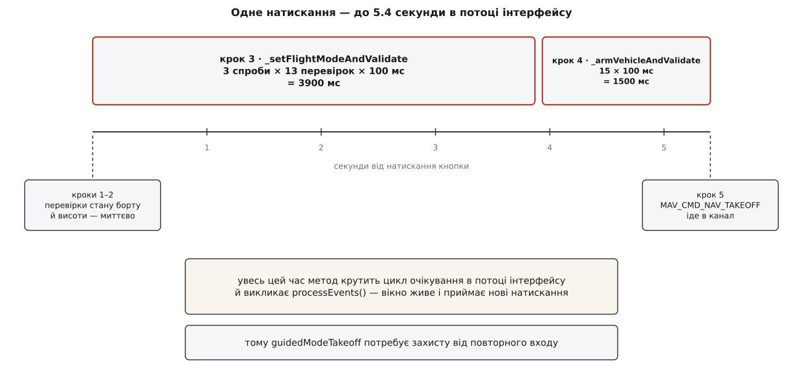

# ⚙️ Власний плагін прошивки: від фабрики до першого злету

Тут зібрано весь код, потрібний, щоб QGroundControl перестав бачити вендорський автопілот як «щось невідоме, від чого приходить телеметрія», і почав керувати ним по-справжньому — з іменами режимів у списку, живими кнопками й робочим зльотом. Виходить близько двохсот рядків у шести файлах, жоден із яких не лежить у теці апстриму; майже все — таблиця, і лише один метод справді пишеться руками.

## Задача

Виробник зробив власну прошивку. Назвімо її **Sokil**: керує квадрокоптером і наземним ровером, розмовляє звичайним MAVLink, у HEARTBEAT чесно оголошує свій тип. Станція під'єднується, показує висоту, напругу батареї й супутники — і на цьому все. Список режимів порожній, у рядку стану замість імені видно `Custom:0x106`, кнопки «Злетіти», «Пауза», «Повернення» неактивні.

Це не збій: без свого плагіна апарат дістає базовий `FirmwarePlugin`, у якого `isCapable()` відповідає `false` на будь-яке питання, а `setFlightMode()` пише в журнал «not supported». Наше завдання — замінити цей порожній об'єкт на свій, і зробити це так, щоб у файлах апстриму не змінився жоден символ.

Перше, з чим треба визначитися, — число. Апарат періодично надсилає [HEARTBEAT](book:communications/mavlink-heartbeat) — коротке повідомлення, яким він оголошує, що живий, і заразом каже, який на ньому автопілот (поле `autopilot`) і що він за апарат (поле `type`). Плагін добирають саме за першим із цих полів, тож у виробника має бути власне значення `MAV_AUTOPILOT`. Наразі перелік у `common.xml` закінчується на `MAV_AUTOPILOT_REFLEX = 20` (Fusion Reflex), тож наступний виробник, чиє доповнення приймуть в апстрим, дістане 21. Поки цього не сталося, значення живе у [власному діалекті](book:communications/mavlink-dialect) виробника — і саме воно є ключем усієї конструкції:

```cpp
// SokilMAVLink.h — доки значення не внесене в common.xml
static constexpr MAV_AUTOPILOT MAV_AUTOPILOT_SOKIL = static_cast<MAV_AUTOPILOT>(21);
```

Тут варто зупинитися на одній деталі, яка інакше з'їсть годину налагодження. Клас прошивки, за яким менеджер шукає фабрику, оголошено так:

```cpp
// QGCMAVLinkTypes.h
typedef int FirmwareClass_t;

// QGCMAVLink.h
static constexpr const FirmwareClass_t FirmwareClassPX4       = MAV_AUTOPILOT_PX4;
static constexpr const FirmwareClass_t FirmwareClassArduPilot = MAV_AUTOPILOT_ARDUPILOTMEGA;
static constexpr const FirmwareClass_t FirmwareClassGeneric   = MAV_AUTOPILOT_GENERIC;
```

Тобто «клас прошивки» — це не окремий перелік, а те саме число `MAV_AUTOPILOT` під іншим іменем, і тип у нього — звичайний `int`. Менеджер бере значення з HEARTBEAT і шукає фабрику, чий список містить рівно це число. Наслідок практичний: у `supportedFirmwareClasses()` треба покласти 21, і жодного окремого «класу Sokil» заводити не потрібно. Наслідок неприємний: `typedef int` означає, що компілятор мовчки прийме туди й `MAV_TYPE`, і будь-яке інше ціле — переплутати вісь апарата з віссю прошивки можна без єдиного попередження, а впаде це аж у полі, коли жодна фабрика не знайдеться.

> 🔧 **Навіщо це.** Спокуса оголосити себе `MAV_AUTOPILOT_GENERIC` (нуль), щоб «поки що працювало», коштує дорого. Нуль — це клас, у який потрапляє все незнайоме, і фабрика, що його заявила, перехоплюватиме кожен чужий автопілот на шині: підвіс, камеру, чужий дрон у тому самому радіоканалі. Причому мовчки — менеджер бере **першу** фабрику, чий список містить потрібне число, і на цьому пошук зупиняє.

## Що саме доведеться написати

Уся різниця живе в теці `custom/`, тій самій, через яку в станцію потрапляє [ядрове розширення](book:qgroundcontrol/core-plugin):

```
custom/
├── CMakeLists.txt
└── src/
    ├── SokilMAVLink.h                        ← значення MAV_AUTOPILOT
    ├── SokilFirmwarePluginFactory.h/.cc      ← реєстрація й вибір за типом апарата
    ├── SokilFirmwarePlugin.h/.cc             ← таблиця режимів, уміння, дії
    └── SokilFirmwarePluginInstanceData.h     ← персональний стан кожного борту
```

Порядок робіт зворотний до інтуїтивного: спершу пишеться фабрика з порожнім плагіном, і збірка проганяється до кінця. Якщо в журналі станції при під'єднанні з'явилося ім'я нашого класу — шов працює, і далі лишається наповнювати таблиці. Якщо почати з таблиць, перша ж тиша буде неоднозначною: чи то режими не ті, чи то фабрика взагалі не зареєструвалася.

## Фабрика: об'єкт, якого ніхто не викликає

Фабрика — це десяток рядків, у яких найважливіше те, чого в них немає.

```cpp
// SokilFirmwarePluginFactory.h
#include "FirmwarePluginFactory.h"

class SokilFirmwarePluginFactory : public FirmwarePluginFactory
{
    Q_OBJECT

public:
    explicit SokilFirmwarePluginFactory(QObject *parent = nullptr);

    QList<QGCMAVLink::FirmwareClass_t> supportedFirmwareClasses() const final;
    QList<QGCMAVLink::VehicleClass_t>  supportedVehicleClasses() const final;
    FirmwarePlugin *firmwarePluginForAutopilot(MAV_AUTOPILOT autopilotType,
                                               MAV_TYPE vehicleType) final;

private:
    FirmwarePlugin *_copterPluginInstance = nullptr;
    FirmwarePlugin *_roverPluginInstance  = nullptr;
};
```

```cpp
// SokilFirmwarePluginFactory.cc
#include "SokilFirmwarePluginFactory.h"
#include "SokilFirmwarePlugin.h"
#include "SokilMAVLink.h"

// Глобальний об'єкт: створюється до main(), і саме його конструктор
// вписує фабрику в реєстр. Нікого іншого викликати не треба.
SokilFirmwarePluginFactory SokilFirmwarePluginFactory_instance(nullptr);

SokilFirmwarePluginFactory::SokilFirmwarePluginFactory(QObject *parent)
    : FirmwarePluginFactory(parent)
{
    // Порожньо. Свідомо.
}

QList<QGCMAVLink::FirmwareClass_t> SokilFirmwarePluginFactory::supportedFirmwareClasses() const
{
    return { static_cast<QGCMAVLink::FirmwareClass_t>(MAV_AUTOPILOT_SOKIL) };
}

QList<QGCMAVLink::VehicleClass_t> SokilFirmwarePluginFactory::supportedVehicleClasses() const
{
    return { QGCMAVLink::VehicleClassMultiRotor, QGCMAVLink::VehicleClassRoverBoat };
}

FirmwarePlugin *SokilFirmwarePluginFactory::firmwarePluginForAutopilot(MAV_AUTOPILOT autopilotType,
                                                                      MAV_TYPE vehicleType)
{
    if (autopilotType != MAV_AUTOPILOT_SOKIL) {
        return nullptr;                    // не наш апарат — хай іде до загального плагіна
    }

    switch (vehicleType) {
    case MAV_TYPE_QUADROTOR:
    case MAV_TYPE_HEXAROTOR:
        if (!_copterPluginInstance) {
            _copterPluginInstance = new SokilCopterFirmwarePlugin(this);
        }
        return _copterPluginInstance;
    case MAV_TYPE_GROUND_ROVER:
        if (!_roverPluginInstance) {
            _roverPluginInstance = new SokilRoverFirmwarePlugin(this);
        }
        return _roverPluginInstance;
    default:
        return nullptr;
    }
}
```

Реєстрація тримається на тому, що конструктор базової фабрики робить її сам:

```cpp
// FirmwarePluginFactory.cc — код апстриму
FirmwarePluginFactory::FirmwarePluginFactory(QObject *parent)
    : QObject(parent)
{
    FirmwarePluginFactoryRegister::instance()->registerPluginFactory(this);
}
```

Тому наш конструктор і має бути порожній. Глобальний об'єкт створюється до `main()`, а порядок створення глобальних об'єктів у різних одиницях трансляції стандарт не визначає — це класичний [провал порядку статичної ініціалізації](book:programming/cpp-static-init-order). Звернутися звідси до налаштувань застосунку, до журналу чи до будь-якого іншого [сінглтона](book:programming/singleton) означає покластися на те, що компонувальник склав бінарник у зручному порядку. Сам реєстр від цього захищений — він оголошений через `Q_GLOBAL_STATIC`, тобто створюється при першому зверненні, а не наперед. Наш конструктор такого захисту не має й мати не мусить: усе, що плагінові потрібно, він зробить пізніше, у `initializeVehicle()`.

Друга річ, яку легко проґавити: примірник плагіна створюється **один на клас апарата** й повертається всім таким апаратам. Три квадрокоптери Sokil дістануть один і той самий об'єкт. Тому в полях плагіна не може бути нічого, що стосується конкретного борту, — і саме тому кожен його метод бере `Vehicle *` першим аргументом.

## Таблиця режимів і два напрямки перекладу

Sokil, як більшість прошивок, кладе номер режиму в `custom_mode`. Але кладе не самий номер:

```
custom_mode (32 біти):
  біти  0…7   — номер режиму
  біти  8…15  — причина останнього переходу
                (0 — пілот, 1 — відмова радіоканалу, 2 — розряд батареї)
  біти 16…31  — нулі
```

Це вирішує все подальше. Базова реалізація перекладу шукає число в мапі точним збігом:

```cpp
// FirmwarePlugin::flightMode() — код апстриму
flightMode = _modeEnumToString.value(custom_mode, QStringLiteral("Custom:0x%1").arg(custom_mode, 0, 16));
```

**Умова: апарат сам повернувся додому через відмову радіоканалу.** Прошивка виставила режим 6 (`Return`) і причину 1:

```
custom_mode          = 0x00000106

номер режиму  = custom_mode & 0xFF          = 0x06 = 6   → «Return»
причина       = (custom_mode >> 8) & 0xFF   = 0x01       → відмова радіоканалу

точний пошук 0x00000106 у таблиці не знаходить нічого
→ на екрані з'являється «Custom:0x106»
```

Ось звідки та сама тиша, з якої почалася задача. Таблицю пишемо на чисті номери, а маскування додаємо перевизначенням:

```cpp
// SokilFirmwarePlugin.cc
enum SokilMode : uint32_t {
    ModeManual = 0, ModeStabilize = 1, ModeAltitude = 2, ModePosition = 3,
    ModeGuided = 4, ModeMission = 5, ModeReturn = 6, ModeLand = 7,
    ModeTakeoff = 8, ModeFailsafe = 9, ModeAcro = 10,
};

SokilCopterFirmwarePlugin::SokilCopterFirmwarePlugin(QObject *parent)
    : SokilFirmwarePlugin(parent)
{
    //                    ім'я           номер          canBeSet  advanced
    FlightModeList modes = {
        { "Manual",       ModeManual,    true,  false },
        { "Stabilize",    ModeStabilize, true,  false },
        { "Altitude",     ModeAltitude,  true,  false },
        { "Position",     ModePosition,  true,  false },
        { "Guided",       ModeGuided,    true,  false },
        { "Mission",      ModeMission,   true,  false },
        { "Return",       ModeReturn,    true,  false },
        { "Land",         ModeLand,      true,  false },
        { "Takeoff",      ModeTakeoff,   false, false },   // входить сама за командою зльоту
        { "Failsafe",     ModeFailsafe,  false, false },   // тільки показ
        { "Acro",         ModeAcro,      true,  true  },   // за перемикачем «розширено»
    };

    updateAvailableFlightModes(modes);   // заповнює _flightModeList і _modeEnumToString
}
```

Дві колонки прапорців роблять таблицю відповіддю на два різні питання одразу. `canBeSet == false` означає «показати можна, вибрати не можна»: у `Takeoff` апарат заходить сам за командою зльоту, і пункт у списку був би пасткою; `Failsafe` вмикає прошивка, і вибирати його вручну безглуздо. `advanced` ховає режим за перемикачем розширеного інтерфейсу — акробатичний `Acro` не має лежати поруч зі звичайними режимами для пілота, який робить перший виліт.

Далі — три перевизначення, і всі три короткі.

```cpp
QString SokilFirmwarePlugin::flightMode(uint8_t base_mode, uint32_t custom_mode) const
{
    // Причину переходу в імені режиму не показуємо — вона їде окремим індикатором.
    return FirmwarePlugin::flightMode(base_mode, custom_mode & 0xFF);
}

bool SokilFirmwarePlugin::setFlightMode(const QString &flightMode,
                                        uint8_t *base_mode, uint32_t *custom_mode) const
{
    for (const FirmwareFlightMode &mode : _flightModeList) {
        if (mode.mode_name != flightMode) {
            continue;
        }
        if (!mode.canBeSet) {
            qCWarning(SokilLog) << "режим не можна вибрати вручну:" << flightMode;
            return false;
        }
        *base_mode   = MAV_MODE_FLAG_CUSTOM_MODE_ENABLED;
        *custom_mode = mode.custom_mode;   // причина нульова: перехід ініціює пілот
        return true;
    }

    qCWarning(SokilLog) << "невідомий режим:" << flightMode;
    return false;
}

QStringList SokilFirmwarePlugin::flightModes(Vehicle *vehicle) const
{
    QStringList list;
    for (const FirmwareFlightMode &mode : _flightModeList) {
        if (!mode.canBeSet) {
            continue;
        }
        if ((vehicle->multiRotor() && !mode.multiRotor) || (vehicle->fixedWing() && !mode.fixedWing)) {
            continue;
        }
        list << mode.mode_name;
    }
    return list;
}
```

Ім'я режиму тут працює не як напис, а як **ключ**: у той бік станція шукає його в мапі, у цей — порівнює з полем таблиці. Тому воно мусить бути однією й тією самою сталою в обох напрямках. Загорнути його в `tr()` в одному місці й порівняти з літералом в іншому — зламати переклад назад, причому лише для тих користувачів, у яких увімкнена не англійська мова. Показ і ключ — різні речі, і перекладу підлягає лише перший.

Лишаються ролі — відповідь на питання «як у цій прошивці зветься режим, у який треба перейти, щоб апарат зробив X»:

```cpp
QString rtlFlightMode()         const override { return QStringLiteral("Return"); }
QString landFlightMode()        const override { return QStringLiteral("Land"); }
QString missionFlightMode()     const override { return QStringLiteral("Mission"); }
QString pauseFlightMode()       const override { return QStringLiteral("Position"); }
QString takeControlFlightMode() const override { return QStringLiteral("Stabilize"); }
QString guidedFlightMode()      const                { return QStringLiteral("Guided"); }
```

Пауза для мультикоптера Sokil — це `Position`, режим утримання точки. Для ровера того самого виробника паузи як режиму немає взагалі: ровер зупиняють командою, і в його плагіні `pauseFlightMode()` лишається порожнім, а `pauseVehicle()` перевизначено окремо. Одна кнопка на екрані, дві різні дії — рівно те, задля чого плагін і існує.

## Маска вмінь: підмножина, а не перетин

Станція мусить знати про вміння апарата **до** першої команди, бо інтерфейс малюється раніше за політ. Відповідь дає одна бітова маска:

```cpp
bool SokilFirmwarePlugin::isCapable(const Vehicle *vehicle, FirmwareCapabilities capabilities) const
{
    int available = SetFlightModeCapability | GuidedModeCapability | PauseVehicleCapability;

    if (vehicle->multiRotor()) {
        available |= TakeoffVehicleCapability | GuidedTakeoffCapability | ChangeHeadingCapability;
    }
    // OrbitModeCapability і ROIModeCapability Sokil не має: підвісу немає,
    // а політ по колу не реалізовано в прошивці.

    return (capabilities & available) == capabilities;
}
```

Останній рядок виглядає як дрібниця, а насправді визначає зміст усього методу. Питання завжди складене: інтерфейс питає не «чи вміє апарат зліт», а «чи вміє апарат і керований режим, **і** зліт». Тому відповідь має бути перевіркою **підмножини**: усе, про що спитали, є серед того, що ми вміємо. Написати замість цього `return capabilities & available;` — типова помилка, і вона тиха: вираз стане істиною, щойно збігся хоч один біт. Кнопка керованого зльоту з'явиться на ровері, бо ровер уміє `SetFlightMode`, а `GuidedTakeoff` у тому самому запиті просто загубиться.

```
запит       = GuidedModeCapability | GuidedTakeoffCapability = 0b00000100 | 0b10000000 = 0b10000100
вміє ровер  = SetFlightMode | GuidedMode | PauseVehicle      = 0b00000001 | 0b00000100 | 0b00000010
                                                             = 0b00000111

перетин     = 0b10000100 & 0b00000111 = 0b00000100   → ненульовий, «істина» ✖
підмножина  = 0b00000100 == 0b10000100 ?              → ні, «хибність» ✔
```

## Одна керована дія: зліт

Далі йде єдине місце, де плагін пишеться не таблицею, а руками. Sokil приймає команду зльоту тільки в керованому режимі й тільки коли мотори вже крутяться — як ArduPilot; але висоту в сьомому параметрі чекає **абсолютну**, від рівня моря, — як PX4. Послідовність не збігається з жодною наявною, тож її треба скласти.

```cpp
void SokilFirmwarePlugin::guidedModeTakeoff(Vehicle *vehicle, double takeoffAltRel) const
{
    // 1. Чи не відмовився цей борт від команди раніше.
    const auto *data = qobject_cast<SokilFirmwarePluginInstanceData*>(vehicle->firmwarePluginInstanceData());
    if (data && data->getCommandSupported(MAV_CMD_NAV_TAKEOFF)
                == FirmwarePluginInstanceData::CommandSupportedResult::UNSUPPORTED) {
        QGC::showAppMessage(tr("Прошивка цього апарата не приймає команду зльоту."));
        return;
    }

    // 2. Sokil чекає висоту від рівня моря — переводимо, поки знаємо, де стоїмо.
    const double vehicleAltitudeAMSL = vehicle->altitudeAMSL()->rawValue().toDouble();
    if (qIsNaN(vehicleAltitudeAMSL)) {
        QGC::showAppMessage(tr("Зліт неможливий: висота апарата невідома."));
        return;
    }
    const double takeoffAltAMSL = takeoffAltRel + vehicleAltitudeAMSL;

    // 3. Режим — до вмикання моторів: у решті режимів Sokil ігнорує команду зльоту.
    if (!_setFlightModeAndValidate(vehicle, guidedFlightMode())) {
        QGC::showAppMessage(tr("Зліт неможливий: апарат не перейшов у режим Guided."));
        return;
    }

    // 4. Мотори — до команди: без них зліт буде відхилено.
    if (!_armVehicleAndValidate(vehicle)) {
        QGC::showAppMessage(tr("Зліт неможливий: не вдалося ввімкнути мотори."));
        return;
    }

    // 5. І аж тепер сама команда.
    vehicle->sendMavCommand(vehicle->defaultComponentId(),
                            MAV_CMD_NAV_TAKEOFF,
                            true,                                    // показати відмову користувачеві
                            NAN,                                     // тангаж не задаємо
                            NAN, NAN, NAN,                           // не використовуються
                            NAN, NAN,                                // широта й довгота — «де стоїмо»
                            static_cast<float>(takeoffAltAMSL));
}
```

Порядок кроків тут не стилістичний вибір, а те саме знання про діалект, тільки виражене послідовністю. Переставити третій і четвертий місцями — і апарат увімкне мотори в `Stabilize`, тобто віддасть керування пілотові й буде стояти на землі з розкрученими гвинтами, поки станція чекає зльоту.

Крок перший — той самий персональний стан, який не можна тримати в спільному плагіні. `FirmwarePluginInstanceData` живе поруч із `Vehicle`, створюється при ініціалізації апарата й гине разом із ним:

```cpp
// SokilFirmwarePluginInstanceData.h
class SokilFirmwarePluginInstanceData : public FirmwarePluginInstanceData
{
    Q_OBJECT
public:
    explicit SokilFirmwarePluginInstanceData(QObject *parent = nullptr)
        : FirmwarePluginInstanceData(parent) {}

    QTime lastStreamRequestTime;    // коли востаннє просили частоти
    uint32_t firmwareBuild = 0;     // збірка, що приїхала в AUTOPILOT_VERSION
};
```

Спокуса покласти ці два поля прямо в `SokilFirmwarePlugin` виглядає нездоланною — це ж «дані про наш автопілот». Ціна виявиться на другому апараті: плагін один на всі борти, тож `firmwareBuild` другого перезапише перший, і станція вирішить, що на старому дроні стоїть нова прошивка. Помилка не впаде — вона просто ввімкне команду, якої той борт не знає.

## Мить під'єднання: initializeVehicle

Sokil, як і ArduPilot, мовчить, поки його не попросять: без явного запиту він шле лише HEARTBEAT. Тому весь потік телеметрії замовляється тут, один раз за життя об'єкта `Vehicle`.

```cpp
void SokilFirmwarePlugin::initializeVehicle(Vehicle *vehicle)
{
    if (vehicle->isOfflineEditingVehicle()) {
        return;                                 // апарата немає — просити нема кого
    }

    auto *data = qobject_cast<SokilFirmwarePluginInstanceData*>(vehicle->firmwarePluginInstanceData());
    if (!data) {
        data = new SokilFirmwarePluginInstanceData(vehicle);
        vehicle->setFirmwarePluginInstanceData(data);   // Vehicle бере об'єкт собі в діти
    }
    data->lastStreamRequestTime = QTime::currentTime();

    struct StreamRequest { uint32_t msgId; int hz; };
    static constexpr StreamRequest rgRequests[] = {
        { MAVLINK_MSG_ID_ATTITUDE,              10 },   // горизонт має бути плавним
        { MAVLINK_MSG_ID_GLOBAL_POSITION_INT,    5 },   // мітка на мапі
        { MAVLINK_MSG_ID_VFR_HUD,                5 },
        { MAVLINK_MSG_ID_SYS_STATUS,             2 },   // батарея, датчики
        { MAVLINK_MSG_ID_GPS_RAW_INT,            2 },
        { MAVLINK_MSG_ID_HOME_POSITION,          1 },
        { MAVLINK_MSG_ID_EXTENDED_SYS_STATE,     1 },   // без нього не працює переривання посадки
    };

    for (const StreamRequest &request : rgRequests) {
        vehicle->sendMavCommand(vehicle->defaultComponentId(),
                                MAV_CMD_SET_MESSAGE_INTERVAL,
                                false,                                     // мовчки: старі збірки команди не знають
                                static_cast<float>(request.msgId),
                                static_cast<float>(1000000 / request.hz)); // інтервал у мікросекундах
    }
}
```

Третій аргумент `false` тут змістовний: команду `MAV_CMD_SET_MESSAGE_INTERVAL` розуміють не всі збірки прошивки, і апарат, який відповів «не підтримую», не має влаштовувати користувачеві сім вікон із помилками при кожному під'єднанні. Про це станція мовчки запам'ятає в `FirmwarePluginInstanceData` і більше не питатиме.

Числа варто прикинути до того, як їх зашивати. Sokil літає на телеметричному радіомодемі 57600 бод, і кожне повідомлення MAVLink 2 несе 12 байтів обгортки понад корисні дані:

```
частота потоку   → інтервал = 1 000 000 / f мкс
  10 Гц → 100 000 мкс
   1 Гц → 1 000 000 мкс

повідомлень за секунду = 10 + 5 + 5 + 2 + 2 + 1 + 1 = 26
самої лише обгортки    = 26 · 12 = 312 Б/с ≈ 2.5 кбіт/с

на 57600 бод (≈ 5760 Б/с з урахуванням старт-стопових бітів)
обгортка з'їдає близько 5 % каналу ще до першого корисного байта
```

П'ять відсотків на порожню обгортку — прийнятно; але подвоєння частоти `ATTITUDE` до 20 Гц додає ще 120 Б/с обгортки й приблизно стільки ж корисних даних, і на слабкому каналі це вже вимірний внесок у затримку. Тому частоти належать [налаштуванням користувача](book:qgroundcontrol/settings-persistence), а не сталим у коді: на кабелі USB доречні одні числа, на модемі за десять кілометрів — інші.

## Складання: п'ять рядків CMake і одна пастка компонувальника

Механіка теки `custom/` вже налагоджена для ядрового розширення, тож наш внесок у неї — один блок:

```cmake
# custom/CMakeLists.txt
list(APPEND CUSTOM_SOURCES
    ${CMAKE_CURRENT_SOURCE_DIR}/src/SokilFirmwarePluginFactory.cc
    ${CMAKE_CURRENT_SOURCE_DIR}/src/SokilFirmwarePluginFactory.h
    ${CMAKE_CURRENT_SOURCE_DIR}/src/SokilFirmwarePlugin.cc
    ${CMAKE_CURRENT_SOURCE_DIR}/src/SokilFirmwarePlugin.h
    ${CMAKE_CURRENT_SOURCE_DIR}/src/SokilFirmwarePluginInstanceData.h
    ${CMAKE_CURRENT_SOURCE_DIR}/src/SokilMAVLink.h
)
set(CUSTOM_SOURCES ${CUSTOM_SOURCES} CACHE INTERNAL "" FORCE)
```

Забирає це апстрим сам, у своєму звичному рядку:

```cmake
# src/CMakeLists.txt — код апстриму
if(CUSTOM_SOURCES)
    target_sources(${CMAKE_PROJECT_NAME} PRIVATE ${CUSTOM_SOURCES})
endif()
```

Заголовки в списку не помилка: без них `moc` не побачить `Q_OBJECT`, і збірка впаде на відсутніх метаоб'єктних символах. А `CACHE INTERNAL … FORCE` потрібне тому, що `custom/` і `src/` — сусідні підкаталоги, і звичайна змінна з першого в другому просто не існує; докладніше — у [кеші й опціях CMake](book:build-systems/cache-and-options).

Тепер пастка, через яку сходиться найбільше годин налагодження в цій конструкції. Наш глобальний об'єкт `SokilFirmwarePluginFactory_instance` — єдине, що вписує фабрику в реєстр. І на нього **ніхто не посилається**: жоден рядок застосунку не згадує ані цього імені, ані навіть заголовка. Поки файл компілюється прямо в застосунок через `target_sources`, це працює — об'єктний файл потрапляє в бінарник цілком, разом із кодом ініціалізації глобальних об'єктів.

Але спокуса охайності підказує зібрати свій плагін окремою статичною бібліотекою: `add_library(sokil_plugin STATIC …)` і `target_link_libraries(… sokil_plugin)`. І тоді реєстрація тихо зникає. Причина — у самій моделі [компонування](book:programming/linking): статична бібліотека це архів об'єктних файлів, і компонувальник дістає з архіву лише ті файли, які **розв'язують невизначений символ**. Наш файл не розв'язує жодного, тож у бінарник не потрапляє. Помилки збірки немає, попередження немає — просто апарат при під'єднанні дістає загальний плагін, як і до початку роботи.

Виходів три, і всі відомі: лишити файли в `CUSTOM_SOURCES`, зібрати їх об'єктною бібліотекою (`add_library(… OBJECT …)`, яка домішується цілком) або примусити компонувальник узяти архів повністю — `-Wl,--whole-archive` у GNU, `/WHOLEARCHIVE:` у MSVC. Перший шлях і є той, який пропонує апстрим, і саме тому пропонує.


*Уся реєстрація тримається на конструкторі глобального об'єкта, на який немає жодного посилання, — тому спосіб потрапляння файлу в бінарник тут важить не менше за сам код.*

## Ціна: скільки це блокує й де ламається

Найдорожче в готовому плагіні — не рядки, а час і потоки.

`_setFlightModeAndValidate()` і `_armVehicleAndValidate()` виглядають як звичайні виклики, а насправді крутять цикл очікування прямо в потоці інтерфейсу. Ось скільки це триває у найгіршому випадку — коли апарат мовчить:

```
_setFlightModeAndValidate:  3 спроби × 13 перевірок × 100 мс = 3900 мс
_armVehicleAndValidate:     1 спроба × 15 перевірок × 100 мс = 1500 мс
                                                       разом = 5400 мс = 5.4 с
```

Три спроби зміни режиму не примха: пакет по радіоканалу губиться, і перша спроба цілком може не долетіти. Але наслідок треба знати наперед. По-перше, `guidedModeTakeoff()` можна кликати **тільки** з потоку інтерфейсу — з [потоку каналу](book:qgroundcontrol/threading-model) він зруйнує чужі черги сигналів. По-друге, цикл усередині викликає `QCoreApplication::processEvents()`, тобто інтерфейс лишається живим: користувач може за ці п'ять секунд натиснути «Злетіти» ще раз і зайти в той самий метод повторно, поки перший виклик не завершився. Захист від повторного входу — обов'язок нашого коду, і найдешевше він робиться прапорцем у `FirmwarePluginInstanceData`, а не в плагіні.



*Одне натискання кнопки може блокувати потік інтерфейсу на п'ять із половиною секунд — і весь цей час цикл подій приймає нові натискання.*

Друга пастка стосується вихідного гачка на потоці повідомлень. Sokil ігнорує команди, у яких `target_component` не дорівнює одиниці, тож їх доводиться правити перед відправленням:

```cpp
void SokilFirmwarePlugin::adjustOutgoingMavlinkMessageThreadSafe(Vehicle *vehicle,
                                                                 LinkInterface *outgoingLink,
                                                                 mavlink_message_t *message)
{
    if (message->msgid != MAVLINK_MSG_ID_COMMAND_LONG) {
        return;
    }

    mavlink_command_long_t cmd{};
    mavlink_msg_command_long_decode(message, &cmd);
    if (cmd.target_component == MAV_COMP_ID_ALL) {
        cmd.target_component = MAV_COMP_ID_AUTOPILOT1;
        mavlink_msg_command_long_encode_chan(message->sysid, message->compid,
                                             outgoingLink->mavlinkChannel(), message, &cmd);
    }
}
```

Суфікс `ThreadSafe` в імені — не побажання, а опис місця виклику: метод виконується в потоці каналу. І тут накладаються дві обставини, кожна з яких сама по собі нешкідлива. Плагін **спільний** для всіх апаратів своєї пари «прошивка × клас», а каналів у станції кілька, і кожен має власний потік. Отже, у цей метод можуть одночасно зайти два потоки на одному й тому самому об'єкті. Тіло вище безпечне лише тому, що не торкається жодного поля плагіна: усе, з чим воно працює, — аргументи й локальні змінні. Додати сюди нешкідливий на вигляд лічильник `++_adjustedCount` означає завести [перегони даних](book:programming/thread-safety) з тихою, невідтворюваною поведінкою.

Так само заборонено читати звідси властивості `Vehicle`: вони живуть у потоці інтерфейсу, і `vehicle->armed()` тут — не помилка компіляції, а прочитане з-під чужих рук значення. Якщо гачкові справді потрібен стан борту, стан має бути покладений у `FirmwarePluginInstanceData` під `QMutex` і читатися звідти.

Третя пастка найдешевша й найчастіша: `adjustIncomingMavlinkMessage()` повертає `bool`, і `false` означає «проковтнути повідомлення». Базова реалізація повертає `true`. Гілка, яка забула повернути значення на одному зі шляхів, з'їдатиме частину телеметрії — і побачити це можна буде тільки за приладами, що перестали оновлюватися. Найдорожчі помилки в плагіні прошивки не падають; вони працюють неправильно.

Що з усього цього справді вимагає роботи? Таблиця режимів — годину. Маска вмінь — п'ятнадцять хвилин. Запит потоків — стільки, скільки триває розмова з розробником прошивки про те, що вона вміє надсилати. А от `guidedModeTakeoff()` і подібні керовані дії пишуться рівно стільки, скільки триває їх перевірка на реальному апараті: жодна документація прошивки не скаже, що станеться, коли команда зльоту прийде на півсекунди раніше, ніж прошивка визнає режим зміненим.
