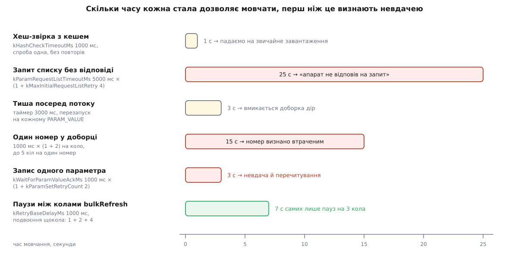

# 📋 Контракт менеджера параметрів: властивості, сигнали, методи, сталі

Усе, що `ParameterManager` віддає назовні — п'ять властивостей для інтерфейсу, сім сигналів, два десятки методів і десяток числових сталих із їхніми значеннями, — зібрано тут одним списком, щоб писати сторінку налаштувань, перевірку перед зльотом чи власне розширення, не вичитуючи заголовок і реалізацію. Наприкінці — таблиця кодів відмови й категорії журналювання, з яких починається діагностика.

## Де він живе і як його взяти

Оголошення — `src/FactSystem/ParameterManager.h`, клас успадковує `QObject` і позначений `QML_ELEMENT` + `QML_UNCREATABLE`: з QML його видно, але створити не можна. Створює його [об'єкт апарата](book:qgroundcontrol/vehicle-object) — модель одного дрона всередині застосунку, якій належать усі його підсистеми; вона й тримає єдиний екземпляр на апарат і віддає його незмінним посиланням.

```cpp
ParameterManager *parameterManager();          // Vehicle::parameterManager()
```

У QML те саме доступне як `CONSTANT`-властивість апарата, тож прив'язка ніколи не переприв'язується:

```qml
property var pm: activeVehicle ? activeVehicle.parameterManager : null

Item {
    // сторінку налаштувань показуємо лише на повному наборі
    visible: pm && pm.parametersReady && !pm.missingParameters
}
```

**Найкоротший робочий виклик: прочитати й записати одне значення**

```cpp
ParameterManager *pm = vehicle->parameterManager();
const int compId = ParameterManager::defaultComponentId;   // −1

if (pm->parameterExists(compId, "MPC_XY_VEL_MAX")) {
    Fact *fact = pm->getParameter(compId, "MPC_XY_VEL_MAX");
    const double current = fact->rawValue().toDouble();

    fact->setRawValue(current + 1.0);   // ← це і є запис на борт
}
```

Останній рядок — головне в усьому контракті. **Методу «записати параметр» у менеджера немає.** Запис не викликають — його спричиняють: менеджер підписаний на зміну значення кожного свого факту, і `setRawValue()` на такому факті тягне за собою `PARAM_SET`, очікування відлуння, повтори й, за невдачі, перечитування з борту. Що таке факт і чому в нього є «сире» значення поряд із показаним — [окрема підсистема](book:qgroundcontrol/fact-system): факт тримає значення, тип, метадані (одиниці, межі, перелік варіантів) і сигнал зміни, на який чіпляється і екран, і менеджер.

## Властивості

Усі п'ять — лише для читання з QML; у C++ у `parameterDownloadSkipped` є ще й сетер.

| Властивість | Тип | Що означає | Сигнал зміни |
|---|---|---|---|
| `parametersReady` | `bool` | Початкове завантаження **завершено** — набором можна користуватися. Не означає «повний»: дивись сусідній рядок | `parametersReadyChanged(bool)` |
| `missingParameters` | `bool` | У наборі є діри: якісь номери не приїхали й доборка на них здалася | `missingParametersChanged(bool)` |
| `loadProgress` | `double`, [0.0, 1.0] | Частка вже отриманих параметрів від загальної кількості по всіх компонентах — це і є смужка поступу | `loadProgressChanged(float)` |
| `pendingWrites` | `bool` | Є щонайменше один запис у польоті, на який ще не прийшло відлуння | `pendingWritesChanged(bool)` |
| `parameterDownloadSkipped` | `bool` | Завантаження **свідомо** пропущено (під'єднання до апарата в польоті, канал із високою затримкою) | `parameterDownloadSkippedChanged()` |

Три речі, на яких спотикаються:

- `parametersReady == true` разом із `missingParameters == true` — **звичайна, робоча комбінація**, а не суперечність. Перше каже «менеджер більше нічого не чекає», друге — «того, чого він чекав, він не дочекався».
- `parametersReady` — прапорець в один бік: він стає істинним і назад не повертається, навіть коли ви замовили повне перезавантаження. Смужку поступу вішайте на `loadProgress`, а не на нього. Сигнал при цьому шлеться на кожному завершенні, а не лише на зміні, — тож надійти він може не один раз.
- Гетер `loadProgress()` повертає `double`, а сигнал несе `float`. Прив'язка в QML цього не помічає, а от порівняння на точну рівність у C++ — помітить.
- `pendingWrites` рахується лічильником незавершених записів, а не прапорцем: він зростає перед очікуванням відлуння й спадає після, тож під час повтору встигає впасти й піднятися знову.

```cpp
bool   parametersReady() const;
bool   missingParameters() const;
double loadProgress() const;
bool   pendingWrites() const;
bool   parameterDownloadSkipped() const;
void   setParameterDownloadSkipped(bool skipped);
```

## Сигнали

| Сигнатура | Коли надходить | Навіщо підписуватися |
|---|---|---|
| `parametersReadyChanged(bool)` | Завантаження завершилося — успішно чи з дірами | Відкрити сторінки налаштувань |
| `missingParametersChanged(bool)` | З'явилися або зникли діри в наборі | Показати попередження, заблокувати редактор |
| `loadProgressChanged(float)` | На кожній зміні частки отриманого | Смужка поступу |
| `pendingWritesChanged(bool)` | Лічильник записів перетнув нуль в один чи інший бік | Попередити людину, що закриває вікно або від'єднується |
| `parameterDownloadSkippedChanged()` | Змінилася ознака свідомого пропуску | Пояснити порожній редактор, а не вдавати помилку |
| `cacheCheckOnlyFailed()` | Спроба **лише** звіритися з кешем не вдалася | Перейти до звичайного завантаження самому |
| `factAdded(int componentId, Fact *fact)` | Ім'я трапилося вперше — створено новий факт | Довішати свої метадані, підписки, перевірки |

`cacheCheckOnlyFailed()` — пара до методу `tryHashCheckCacheLoad()` і надходить у чотирьох випадках: канал не той (висока затримка чи відтворення логу), прошивка не PX4, `_HASH_CHECK` не відповів за секунду, контрольна сума кешу не збіглася.

У списку сигналів є ще чотири з підкресленням на початку — `_paramSetSuccess`, `_paramSetFailure`, `_paramRequestReadSuccess`, `_paramRequestReadFailure`. Видимі вони всім — секція сигналів у Qt завжди публічна, — але це внутрішній обмін між автоматами запису й читання, пачковим оновленням і тестами. **Покладатися на них ззовні не варто**: їхній набір і порядок — деталь реалізації, яка не обіцяна нікому.

## Методи

### Читання карти

```cpp
bool        parameterExists(int componentId, const QString &paramName) const;
Fact       *getParameter   (int componentId, const QString &paramName);
QStringList parameterNames (int componentId) const;
QList<int>  componentIds   () const;
```

`getParameter()` **ніколи не повертає `nullptr`.** Якщо параметра немає, він віддає посилання на єдиний спільний порожній факт і водночас показує людині повідомлення про відсутній параметр. Наслідки два, обидва неприємні:

- перевірка `if (fact)` не рятує ні від чого — вона завжди істинна;
- звертання до необов'язкового параметра «навмання» породжує видиме повідомлення про помилку в того, хто просто відкрив вікно.

Тому для всього, чого може не бути на цій прошивці, порядок один: спершу `parameterExists()`, і лише потім `getParameter()`.

`componentIds()` повертає ключі карти кількостей — тобто **лише ті компоненти, які встигли відповісти** хоч одним `PARAM_VALUE` із заповненим `param_count`. Підвіс, який ще мовчить, у списку не з'явиться. `parameterNames()` для невідомого компонента поверне порожній список, а не помилку.

### Оновлення з борту

```cpp
void refreshAllParameters(uint8_t componentID);
void refreshAllParameters();                       // Q_INVOKABLE, == MAV_COMP_ID_ALL
void refreshParameter        (int componentId, const QString &paramName);
void refreshParametersPrefix (int componentId, const QString &namePrefix);
void bulkRefresh             (int componentId, const QStringList &names,
                              bool notifyFailure = true);
void tryHashCheckCacheLoad();
```

Два методи з чотирьох роблять на вигляд те саме — оновлюють групу параметрів за префіксом. Різниця між ними суттєва:

| | `refreshParametersPrefix` | `bulkRefresh` |
|---|---|---|
| Що приймає | один префікс, порівняння `startsWith` | список імен **і** шаблонів `"ПРЕФІКС*"` |
| Як шле | по одному незалежному `PARAM_REQUEST_READ` **одразу** на кожне ім'я | пачкою, колами, з подвоєнням паузи між колами |
| Повтори | по 2 на кожен запит, окремо | ще й 3 кола на всю пачку |
| Повідомлення про невдачу | окреме на **кожне** ім'я | одне підсумкове на всю пачку (`notifyFailure`) |
| Дублікати | не бувають — префікс один | відкидаються, порядок першої появи збережено |

Шаблон у `bulkRefresh` — це рівно `*` **наприкінці** рядка й нічого більше: `"COMPASS_*"` розгорнеться в усі відомі імена з таким початком, взяті **на момент виклику**. Голий `"*"` не розгортається в усе — його пропускають із попередженням у журналі. Невідоме точне ім'я теж пропускають із попередженням, а не з помилкою.

```cpp
// одне коло, окремий запит на кожне ім'я, окреме повідомлення на кожну невдачу
pm->refreshParametersPrefix(compId, "COMPASS_");

// той самий набір плюс два точкові імені — пачкою, з відкатом і ОДНИМ повідомленням
pm->bulkRefresh(compId, { "COMPASS_*", "INS_GYROFFS_X", "INS_GYROFFS_Y" });

// мовчки: якщо не вийде, ми самі розберемося зі своїми фактами
pm->bulkRefresh(compId, { "BATT_*" }, false /* notifyFailure */);
```

`tryHashCheckCacheLoad()` — окремий вхід для тих, кому треба **лише** звірити хеш із кешем і не запускати повне завантаження за жодних обставин. Провал повертається сигналом `cacheCheckOnlyFailed()`, а не мовчазним переходом на потік.

### Скидання

```cpp
void resetAllParametersToDefaults();
void resetAllToVehicleConfiguration();
```

Обидва — не тисяча записів, а по одній дії.

Перший шле автопілоту (`MAV_COMP_ID_AUTOPILOT1`) команду `MAV_CMD_PREFLIGHT_STORAGE` із `param1 = 2` («скинути параметри до заводських») і `param2 = −1` («сховища місій не чіпати»); помилки показуються людині. Що таке команда з підтвердженням і чим вона відрізняється від запису — [окремий протокол поверх MAVLink](book:communications/mavlink-commands): станція шле `COMMAND_LONG`/`COMMAND_INT`, борт відповідає `COMMAND_ACK` із кодом результату.

Другий — тільки для PX4: він записує значення `2` в параметр `SYS_AUTOCONFIG`, а прошивка розуміє це як прохання перегенерувати решту під поточну конфігурацію апарата.

### Кеш і вивантаження

```cpp
static QDir    parameterCacheDir();
static QString parameterCacheFile(int vehicleId, int componentId);
void           writeParametersToStream(QTextStream &stream) const;
```

Перші два — **статичні**: їх можна звати без жодного апарата, і саме так чистять кеш із налаштувань.

```
тека:  <тека файлу налаштувань>/<ім'я застосунку>/ParamCache
файл:  <номер апарата>_<номер компонента>.v2
```

`writeParametersToStream()` пише текстовий дамп для людини — не кеш. Спершу шапка з коментарями, далі по рядку на параметр, поля розділені табуляціями:

```
# Onboard parameters for Vehicle 1
#
# Stack: PX4 Pro
# Vehicle: Multi-Rotor
# Version: 1.14.0 dev
# Git Revision: 3a5b1c9
#
# Vehicle-Id Component-Id Name Value Type
1	1	MPC_XY_VEL_MAX	12.000000	9
1	1	MPC_Z_VEL_MAX_UP	3.000000	9
```

Останнє число — числовий код `MAV_PARAM_TYPE` (9 — це `REAL32`). Значення пишеться повною точністю, без округлення до показаного на екрані. Той самий формат читає офлайновий апарат для планування, тож дамп із живого дрона можна підсунути застосунку як основу.

### Службові

```cpp
void      mavlinkMessageReceived(const mavlink_message_t &message);
Vehicle  *vehicle();

static MAV_PARAM_TYPE            factTypeToMavType(FactMetaData::ValueType_t factType);
static FactMetaData::ValueType_t mavTypeToFactType(MAV_PARAM_TYPE mavType);
```

`mavlinkMessageReceived()` — єдина точка входу для повідомлень; її кличе апарат, а не ви. Дві статичні функції перетворення типів корисні самі по собі — наприклад, щоб записати свій дамп у тому ж форматі.

| `MAV_PARAM_TYPE` | `FactMetaData::ValueType_t` |
|---|---|
| `UINT8` / `INT8` | `valueTypeUint8` / `valueTypeInt8` |
| `UINT16` / `INT16` | `valueTypeUint16` / `valueTypeInt16` |
| `UINT32` / `INT32` | `valueTypeUint32` / `valueTypeInt32` |
| `UINT64` / `INT64` | `valueTypeUint64` / `valueTypeInt64` |
| `REAL32` / `REAL64` | `valueTypeFloat` / `valueTypeDouble` |

Обидві функції на невідомому вході **не падають і не кидають виняток**: вони пишуть попередження в журнал і повертають цілий 32-бітний тип. Тиха підстановка — свідома, але саме через неї зіпсований `param_type` на дроті обертається не помилкою, а дивним числом.

## `defaultComponentId` і перетворення імені

```cpp
static constexpr int defaultComponentId = -1;
```

Кожен метод, що приймає `componentId`, спершу проганяє його через внутрішнє перетворення: `−1` замінюється на справжній номер головного компонента цього апарата. Отже, писати `−1` можна скрізь — і це правильний спосіб не тягти в свій код знання про те, який компонент у цього дрона головний.

Друге перетворення — над **іменем**. Код застосунку звертається до параметрів іменами найновішої відомої версії прошивки; якщо на борту старіша, ім'я проганяється назад по таблицях перейменувань. Це роблять і `getParameter()`, і `parameterExists()`, мовчки. Коли перетворення заважає — наприклад, треба з'ясувати, чи існує саме **нове** ім'я, а не його старий відповідник, — його вимикають префіксом:

```cpp
pm->parameterExists(compId, "WPNAV_SPEED");           // з перетворенням версій
pm->parameterExists(compId, "noremap.WPNAV_SPEED");   // ім'я як є, дослівно
```

Префікс `noremap.` зрізається перед пошуком і в карту не потрапляє.

## Числові сталі

Частина оголошена публічно в заголовку (щоб на них могли спиратися тести), частина живе в реалізації.

| Ім'я | Значення | Де спрацьовує |
|---|---|---|
| `defaultComponentId` | `−1` | «головний компонент цього апарата» у будь-якому методі |
| `kParamSetRetryCount` | `2` | повтори `PARAM_SET` після першої спроби |
| `kParamRequestReadRetryCount` | `2` | повтори `PARAM_REQUEST_READ` після першої спроби |
| `kWaitForParamValueAckMs` | `1000` мс | очікування відлуння `PARAM_VALUE` на запис і на точкове читання |
| `kParamRequestListTimeoutMs` | `5000` мс | тиша у відповідь на `PARAM_REQUEST_LIST` |
| `kMaxInitialRequestListRetry` | `4` | повтори всього запиту списку |
| `kHashCheckTimeoutMs` | `1000` мс | тиша у відповідь на читання `_HASH_CHECK` |
| таймер тиші потоку | `3000` мс | перезапускається на **кожному** `PARAM_VALUE`; спрацював — вмикається доборка |
| `maxBatchSize` | `10` | скільки запитів за номером тримають у польоті одночасно |
| `_maxInitialLoadRetrySingleParam` | `5` | спроб на один номер, після чого його визнають утраченим |
| `BulkRefreshJob::kMaxRetryRounds` | `3` | кола пачкового оновлення |
| `BulkRefreshJob::kRetryBaseDelayMs` | `1000` мс | пауза перед наступним колом, **подвоюється** щокола |
| індекс-сентинел | `65535` | «номера немає» в незапитаному `PARAM_VALUE`; такі відкидаються, поки чекаємо відповіді на запит списку |

Окремо — сталі, чинні **лише у складанні для тестів**; якщо ви міряєте час у тестовій збірці, ви міряєте не ті числа:

| Ім'я | Значення в тестах | Замість чого |
|---|---|---|
| `kTestHashCheckTimeoutMs` | `200` мс | `kHashCheckTimeoutMs` |
| `kTestInitialRequestIntervalMs` | `500` мс | `kParamRequestListTimeoutMs` |
| `kTestMaxInitialRequestTimeMs` | `(4 + 1) · 500 + 1000 = 3500` мс | стеля очікування вичерпання повторів |
| очікування відлуння | `50` мс | `kWaitForParamValueAckMs` |
| таймер тиші потоку | `500` мс | `3000` мс |

Самі по собі ці числа мало що кажуть. Вага з'являється, коли їх перемножити: кожна пара «затримка × кількість спроб» — це час, який підсистема має право мовчати, перш ніж визнати невдачу.

**Найгірші випадки, зібрані зі сталих**

```
запит списку, на який ніхто не відповів:
  5000 мс · (1 + 4)                 = 25 000 мс  → «апарат не відповів на запит параметрів»

один номер у доборці:
  1000 мс · (1 + 2)  = 3000 мс      — одне коло запитів за номером
  3000 мс · 5                       = 15 000 мс  → номер визнано втраченим

запис одного параметра:
  1000 мс · (1 + 2)                 =  3 000 мс  → невдача, повідомлення, перечитування

паузи між колами bulkRefresh:
  1000 + 2000 + 4000                =  7 000 мс  → самі лише паузи, без часу самих кіл
```



*Чверть хвилини на мертвий запит списку проти трьох секунд на невдалий запис — різниця не випадкова. Довго чекають там, де тиша ще може виявитися просто повільним каналом; швидко здаються там, де людина дивиться на поле й чекає, що воно ось-ось оновиться.*

## Коди відмови: `PARAM_ERROR`

Класичний протокол параметрів не має підтвердження запису: борт відповідає тим, що передає параметр наново звичайним `PARAM_VALUE`. Тому відмову доводилося відрізняти від тиші здогадом. Повідомлення `PARAM_ERROR` (ідентифікатор **345** у наборі `common.xml`) закриває цю дірку — воно каже прямо, чому запис чи читання не вдалися.

| Поле | Тип | Зміст |
|---|---|---|
| `target_system` | `uint8_t` | кому адресовано |
| `target_component` | `uint8_t` | кому адресовано |
| `param_id` | `char[16]` | ім'я; без завершального нуля, якщо займає всі 16 символів |
| `param_index` | `int16_t` | номер; `−1` означає «розрізняй за іменем, номер ігноруй» |
| `error` | `uint8_t` | код із переліку `MAV_PARAM_ERROR` |

| Код | Ім'я | Причина |
|---|---|---|
| 0 | `MAV_PARAM_ERROR_NO_ERROR` | помилки немає (у самому `PARAM_ERROR` не очікується) |
| 1 | `MAV_PARAM_ERROR_DOES_NOT_EXIST` | параметра не існує |
| 2 | `MAV_PARAM_ERROR_VALUE_OUT_OF_RANGE` | значення не влазить у допустимий діапазон |
| 3 | `MAV_PARAM_ERROR_PERMISSION_DENIED` | тому, хто просить, не дозволено це змінювати |
| 4 | `MAV_PARAM_ERROR_COMPONENT_NOT_FOUND` | вказано невідомий компонент |
| 5 | `MAV_PARAM_ERROR_READ_ONLY` | параметр лише для читання |
| 6 | `MAV_PARAM_ERROR_TYPE_UNSUPPORTED` | такого типу прошивка не підтримує взагалі |
| 7 | `MAV_PARAM_ERROR_TYPE_MISMATCH` | тип не збігається з очікуваним |
| 8 | `MAV_PARAM_ERROR_READ_FAIL` | параметр є, але прочитати не вдалося |

Менеджер приймає `PARAM_ERROR` за свій, лише якщо збіглися і номер компонента, і ім'я. Далі — три правила поведінки, які варто знати наперед:

- **на відмову повторів немає.** Тиша лікується повторами, відмова — ні: повторювати те, що вже відхилили, безглуздо. Автомат одразу йде в гілку невдачі.
- **текст відмови показують людині** разом із іменем параметра — саме звідси беруться повідомлення на кшталт «значення поза межами», а не просто «запис не вдався».
- **після `DOES_NOT_EXIST` перечитування пропускають.** Після будь-якої іншої невдачі менеджер перечитує параметр із борту, щоб вигнати з локальної копії число, яке вписала людина. Тут перечитувати нічого — на апараті цього параметра немає.

⚠️ І головне застереження. У `common.xml` і саме повідомлення, і перелік `MAV_PARAM_ERROR` позначені як робочі-в-розробці (`<wip/>`) з прямою вказівкою не спиратися на них у промислових умовах. Станція `PARAM_ERROR` розуміє, але **розраховувати на нього не можна**: більшість прошивок на відмову просто мовчить, і звичайним шляхом невдачі лишається вичерпання повторів. Тонкощі того, що протокол параметрів обіцяє, а що ні, — [окрема тема](book:communications/param-protocol): запит списку без маркера кінця, номери, чинні лише в межах одного сеансу, і значення в полі `float` незалежно від справжнього типу.

## Категорії журналювання

Чотири категорії, оголошені у файлі реалізації. Вмикаються правилами журналювання Qt — або з вікна налаштувань застосунку, або змінною середовища:

```
QT_LOGGING_RULES="FactSystem.ParameterManager*=true"
```

| Категорія | Що показує |
|---|---|
| `FactSystem.ParameterManager` | обрану дорогу завантаження, хеш-звірку, наповнення пачок, успіх і невдачу кожного запису, розгортання шаблонів у `bulkRefresh`, попередження про невідомі імена |
| `FactSystem.ParameterManager:verbose1` | те саме плюс подробиці по кожному параметру |
| `FactSystem.ParameterManager:verbose2` | найгустіший потік: кожне повідомлення, кожен крок автоматів |
| `FactSystem.ParameterManager:debugCacheFailure` | **чому не збіглася сума кешу PX4**: менеджер тримає розібрану карту кешу й позначки «бачив», а потім показує, які саме параметри розійшлися |

Остання — саме та, з якої починають, коли **кожне** під'єднання довге. Довге завантаження означає, що хеш ніколи не сходиться; ця категорія називає конкретні імена, що розходяться, і тим одразу відрізняє реальну зміну набору від параметра, який змінюється сам і не мав би потрапляти в суму.

Кожен рядок журналу починається з префікса апарата: `V:1` або `V:1 C:1` — номер апарата й, коли він відомий, номер компонента. За кількох дронів в одному застосунку це єдиний спосіб не переплутати, чиї це параметри.

## Пастки, які видно лише з контракту

- **`getParameter()` завжди повертає щось.** Перевірка на `nullptr` не працює; звертання «навмання» показує людині помилку. Для необов'язкових параметрів — `parameterExists()` спершу.
- **Запис — це побічний наслідок `setRawValue()`.** Немає способу «просто оновити локальне значення» через публічний контракт: будь-яка правка факту параметра йде в ефір.
- **Номери параметрів назовні не виходять.** Увесь публічний контракт іменний, і це навмисне: номери чинні лише в межах одного сеансу завантаження й зсуваються між версіями прошивки.
- **`componentIds()` показує тих, хто відповів**, а не тих, хто існує. Компонент, який ще мовчить, у списку відсутній — і перевірка «підвіс не під'єднано» на цьому списку буде хибно спрацьовувати на повільному каналі.
- **Порожній редактор ≠ помилка.** Спершу дивись `parameterDownloadSkipped`: набору може не бути тому, що його свідомо не питали.
- **`bulkRefresh` розгортає шаблони на момент виклику.** Параметр, який з'явиться пізніше (наприклад, після під'єднання підвісу), у цю пачку не потрапить, хоч і підходить під префікс.
