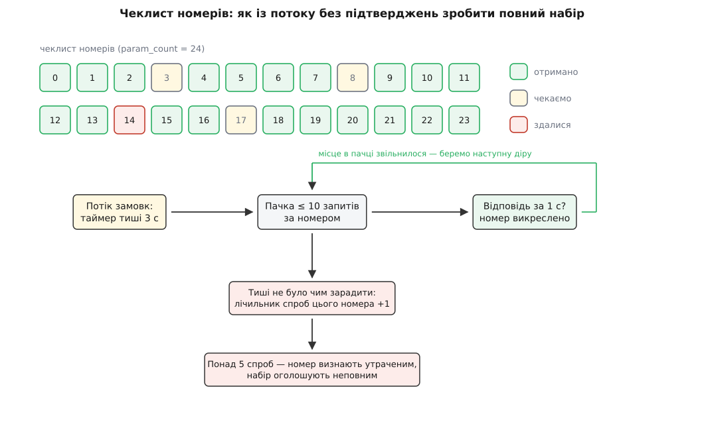
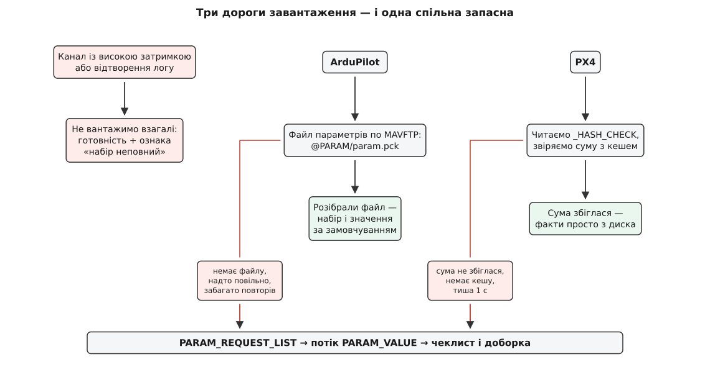
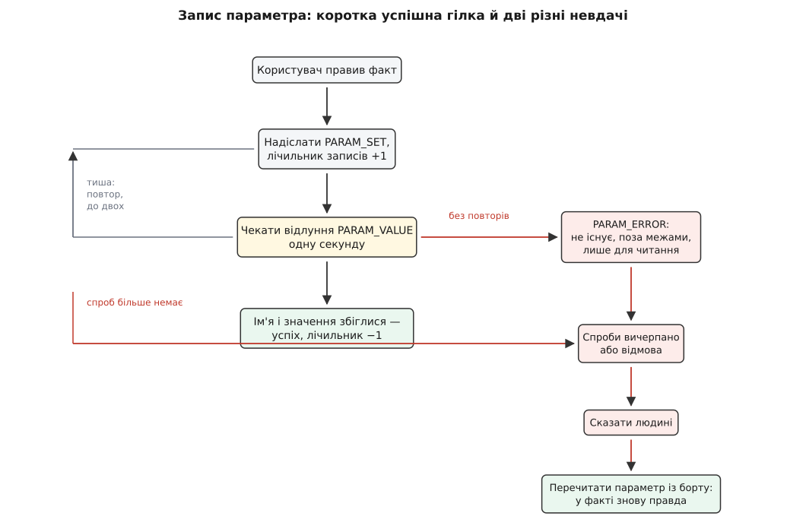

# Менеджер параметрів: завантаження, кеш, запис

<preknowlist>
- [Протокол параметрів](topic:communications/param-protocol) — як борт віддає налаштування: запит списку, потік повідомлень зі значеннями, запис одного значення.
- [Пакет MAVLink](topic:communications/mavlink-packet) — кадр, адреси system id й component id, контрольна сума, ненадійність доставки.
- [FactSystem: факт, метадані й зв'язок зі станом](topic:qgroundcontrol/fact-system) — що таке Fact, звідки в нього метадані й як до нього прив'язується інтерфейс.
- [Vehicle: модель апарата всередині застосунку](topic:qgroundcontrol/vehicle-object) — об'єкт апарата, якому належить менеджер параметрів і його канал зв'язку.
- [CRC](topic:communications/crc) — контрольна сума як короткий підпис великого набору даних.
</preknowlist>

Відкрий у станції сторінку налаштування підвісу — і на екрані миттєво з'являться два десятки полів із числами, підписами, одиницями й повзунками. Жодне з цих чисел не належить застосунку: усі вони живуть у флеші польотного контролера за сотні метрів звідси, на іншому кінці радіониточки, яка втрачає пакети й відповідає із затримкою в сотні мілісекунд. Проте інтерфейс поводиться так, ніби значення лежать у сусідній змінній: він читає їх синхронно, показує без паузи, реагує на правку одразу.

Це не ілюзія і не хитрий кеш поверх запитів. Це наслідок одного архітектурного рішення: **станція тримає в пам'яті повну копію всього набору параметрів апарата** — і весь менеджер параметрів існує, щоб цю копію спершу чесно наповнити, потім не наповнювати заново без потреби, і ніколи не дати їй збрехати.

## Чому копія, а не запити за потребою

Спокуслива альтернатива очевидна: не тягнути нічого наперед, а питати борт тоді, коли значення справді знадобилося. Розгляньмо, чому вона не працює.

Перше — кількість. У ArduPilot набір параметрів польотного контролера має порядок тисячі записів, у PX4 — кілька сотень; сторінка налаштувань відкриває десятки з них одразу, а перевірки перед зльотом читають ще десятки з різних кутів застосунку. Друге — затримка. Радіоканал відповідає не за мікросекунди, а за сотні мілісекунд, і відповідь може не прийти взагалі. Третє, і головне, — **спосіб зв'язування інтерфейсу**. Поле на екрані прив'язане до факту як до властивості об'єкта: воно читає значення в момент відмальовки, синхронно, без права «зачекати». Асинхронний запит у цю модель не вкладається — довелося б у кожному полі показувати спіннер і окремо обробляти «значення ще не приїхало», і так у сотнях місць.

Тому менеджер робить протилежне: один раз, на під'єднанні, він забирає **весь** набір і розкладає його в пам'яті у вигляді фактів. Далі інтерфейс працює з локальними об'єктами й нічого не знає про радіо. Ціна цього рішення — рівно те, з чого складається решта статті: наповнення копії треба зробити надійним поверх ненадійного каналу, повторне наповнення — швидким, а запис — таким, щоб копія не розійшлася з бортом.


*Значення проходить чотири перетворення: з байтів кадру — у повідомлення, з діалекту конкретної прошивки — у єдине внутрішнє подання, з повідомлення — у комірку карти фактів, і аж потім у видимий рядок із одиницями й межами. Менеджер параметрів стоїть посередині й відповідає лише за третій крок — але саме він вирішує, чи повний набір і чи можна йому вірити.*

## Що дає протокол — і чого він не дає

Менеджер стоїть на протоколі параметрів MAVLink, і майже кожне його конструктивне рішення — це відповідь на конкретну властивість цього протоколу.

Даром протокол дає одне: **запит списку**. Станція шле `PARAM_REQUEST_LIST`, і борт починає лити назустріч потік повідомлень `PARAM_VALUE`, по одному на параметр. У кожному такому повідомленні п'ять полів: ім'я (`param_id`, рівно 16 символів, без завершального нуля, якщо ім'я займає всі 16), значення (`param_value`, чотири байти), тип значення (`param_type`), **загальна кількість параметрів** (`param_count`) і **порядковий номер цього** (`param_index`).

А тепер про те, чого протокол не дає. Він не дає підтверджень: борт не питає, чи ти отримав, і не повторює втрачене. Він не дає маркера кінця: потік просто вичерпується, і жодне повідомлення не каже «це було останнє». Він не дає гарантії, що номери сталі між прошивками: параметр можна додати чи прибрати, і всі номери після нього зсунуться, тож звертатися за номером можна лише в межах одного сеансу завантаження, коли `param_count` щойно отримано. І він не дає окремого поля під значення — усе, і цілі, і дробові, їде в одному чотирибайтовому полі, оголошеному як float.

Але два з п'яти полів — `param_count` і `param_index` — дають рівно те, чого бракує. Вони перетворюють безладний потік на **чеклист**: із першого ж отриманого повідомлення станція знає, скільки всього комірок, і кожне наступне повідомлення викреслює одну конкретну. Порожні комірки наприкінці — це і є список того, що загубилося. Уся надійність завантаження побудована на цьому одному факті.

## Тип у полі float: два діалекти одного протоколу

Перш ніж значення потрапить у комірку, його треба правильно прочитати — а тут протокол має відому двозначність, повз яку менеджер не міг би пройти навіть якби хотів.

Поле `param_value` має тип `float`, тобто чотири байти. Але параметр може бути цілим — і його теж треба покласти в ці чотири байти. Способів рівно два, і обидва живі:

- **побайтове перенесення**: бітовий образ цілого копіюють у поле як є, а `param_type` каже, як його читати назад;
- **числове перетворення**: ціле перетворюють у float за значенням, як звичайним приведенням типу.

Різниця не косметична — це два різні набори байтів на дроті для того самого числа:

**Параметр типу int32 зі значенням 3, у двох домовленостях**

```
побайтове перенесення:   біти 0x00000003
                         прочитані як float → 4.2·10⁻⁴⁵ (денормалізоване число)
числове перетворення:    (float)3 = 3.0
                         біти 0x40400000
```

Прочитати одну домовленість правилами іншої — значить отримати або майже нуль, або сміття. PX4 передає побайтово, ArduPilot — числовим перетворенням (і ще й ігнорує `param_type` у вхідному записі, покладаючись на власний тип, який зберігає у флеші). Жодна з прошивок не оголошує свою домовленість прапорцем можливостей — станція мусить знати це наперед.

QGroundControl розв'язує це не в менеджері параметрів, а **на шар нижче**. Сам менеджер завжди працює лише з побайтовою домовленістю — через об'єднання `mavlink_param_union_t`. А розширення прошивки ArduPilot перехоплює кадри на межі каналу й **переписує їх на льоту**: вхідне `PARAM_VALUE` перекодовує з числового перетворення в побайтове, вихідне `PARAM_SET` — навпаки. Менеджер про це не знає; він бачить один-єдиний діалект.

Це типовий для цього застосунку прийом: розбіжності конкретних прошивок гасять у розширенні прошивки, а спільна підсистема лишається чистою. Обійтися без нього не вийшло б — інакше кожне місце, де читається значення, мусило б питати «а яка в нас прошивка».

## Куди лягає значення: карта карт і факт

Внутрішнє сховище менеджера — вкладена карта: **ідентифікатор компонента → ім'я параметра → факт**.

Верхній рівень потрібен тому, що «апарат» у MAVLink — це не одна адреса. Під одним system id живуть кілька компонентів: автопілот, підвіс, камера, вантаж. Кожен має **власний набір параметрів, власну загальну кількість і власну нумерацію**, і всі вони приходять одним потоком, розрізняючись лише полем `compid` у кадрі. Тому чеклист теж ведеться окремо на компонент.

Щоб код застосунку не мусив щоразу згадувати, який компонент у цього апарата головний, менеджер приймає особливе значення `-1` як «компонент за замовчуванням» і сам підставляє справжній номер. Дрібниця — але вона прибирає з сотень місць знання, яке належить одному.

Коли ім'я трапляється вперше, менеджер створює новий факт: тип бере з поля `param_type` (перетворивши в свій перелік типів), метадані — з підсистеми відомостей про компонент, а далі під'єднується до сигналу зміни значення факту, щоб дізнаватися про правки з інтерфейсу. Значення в уже наявний факт кладеться **окремим методом, який не породжує запису на борт**. Ця пара методів — «встановити й надіслати» проти «встановити, бо надійшло» — дрібна на вигляд, але без неї система зациклилася б: кожне отримане значення поверталося б на борт як нова правка, борт відповідав би відлунням, і потік ніколи б не вщух.

## Метадані: значення без опису — марне

Число 2.5 саме по собі не показати на екрані: невідомо, чи це метри за секунду, чи градуси, чи номер режиму зі списку; невідомо, які межі допустимі й що станеться, якщо вписати 25. Усе це — метадані факту, і менеджер бере їх із трьох джерел за спаданням довіри.

Перше й найкраще — **метадані з самого борту**. Апарат може віддати станції файл опису своїх параметрів (окремий вид відомостей про компонент, `COMP_METADATA_TYPE_PARAMETER`) — JSON із описами, одиницями, межами, значеннями за замовчуванням, переліками варіантів. Він перевіряється за схемою й розбирається в об'єкти метаданих. Приємна деталь: імена в такому описі можуть містити **шаблон з номером** — запис `CAL_GYRO{n}_ID` покриває і `CAL_GYRO0_ID`, і `CAL_GYRO2_ID`; менеджер зіставляє ім'я з регулярним виразом і підставляє номер у текст опису. Механіка отримання й кешування цих файлів — окрема підсистема, [відомості про компонент](topic:qgroundcontrol/component-information).

Друге джерело — **метадані, вшиті в саму станцію**: XML-описи параметрів PX4 й ArduPilot, які лежать у ресурсах застосунку й вантажаться через розширення прошивки. Вони покривають старі прошивки, що не вміють віддавати опис, — але саме тут з'являється класична біда старіння: станція знає параметри тієї версії, з якою її зібрали.

Третє — **порожні метадані як запасний варіант**: тип відомий із дроту, група береться з префікса імені до першого підкреслення (`RC1_MIN` → група `RC1`), а для не-автопілотних компонентів ще й підписується категорія. Такий параметр буде видно в редакторі, але без пояснень і без перевірки меж.

Є ще один шар, який легко пропустити, — **перейменування між версіями прошивки**. Код станції звертається до параметрів за іменами найновішої відомої версії. Якщо на борту старіша прошивка, де параметр звався інакше, менеджер проганяє ім'я назад по таблицях перейменувань розширення прошивки — від найвищої відомої мінорної версії вниз до версії апарата — і шукає в карті вже старе ім'я. Для випадків, коли коду треба розрізнити старе й нове ім'я явно (наприклад, перевірити, чи існує саме нове), передбачено префікс `noremap.`, який вимикає перетворення.

> 🔧 **Навіщо це.** Коли параметр «є в апараті, але станція каже, що його немає» — винен зазвичай не менеджер, а один із цих трьох шарів: борт не віддав опис, вшиті метадані від іншої версії, або ім'я не збіглося через перейменування. Знаючи порядок джерел, діагноз ставиться за хвилину: якщо параметр видно в редакторі без опису й без меж — працює запасний варіант, тобто опису немає ні на борту, ні в станції.

## Чеклист індексів: як зробити повний набір із потоку без підтверджень

Тепер найцікавіше. Потік `PARAM_VALUE` летить у один бік, ніхто нічого не підтверджує, частина повідомлень гине в каналі. Треба гарантовано отримати всі — або чесно сказати, яких немає.

З **першого ж** отриманого повідомлення менеджер дізнається `param_count` і будує для цього компонента карту очікування: усі номери від 0 до `count-1`, кожному — лічильник спроб, поки нульовий. Кожне наступне повідомлення викреслює свій номер із карти. Відношення викресленого до загального — це і є смужка поступу на екрані.

Далі працюють три таймери, і кожен ловить свій вид тиші.

**Перший — тиша у відповідь на запит списку**, 5 секунд. Якщо після `PARAM_REQUEST_LIST` не прийшло взагалі нічого, менеджер повторює запит цілком, і так до чотирьох разів. Не допомогло — користувач бачить повідомлення «апарат не відповів на запит параметрів».

**Другий — тиша посеред потоку**, 3 секунди. Цей таймер перезапускається на **кожному** отриманому параметрі, тож поки потік іде, він не спрацьовує ніколи. Спрацював — значить, борт замовк, а в чеклисті є діри. Саме тут вмикається доборка.

**Третій — тиша у відповідь на точковий запит**, 1 секунда; про нього — нижче.

Доборка влаштована так. Менеджер бере з карти очікування номери, яких бракує, і збирає з них **пачку не більш як на десять** запитів `PARAM_REQUEST_READ` за номером. Кожен запит — окремий маленький автомат: надіслати, чекати секунду на відповідне `PARAM_VALUE`, не дочекався — надіслати ще раз, і так до двох повторів. Коли відповідь приходить, номер викреслюється з карти, вилітає з пачки — і пачка одразу **доповнюється наступним номером**, тобто в польоті постійно тримається до десятка запитів.

Чому саме пачка, а не все одразу й не по одному? Усе одразу — це тисяча запитів у той самий вузький канал, яким борт зараз намагається відповідати; запити витіснять відповіді, і стане гірше, ніж було. По одному — це послідовний ланцюжок із затримки каналу: тисяча дір по півсекунди дає хвилини. Десять у польоті — компроміс, який тримає канал зайнятим, але не забитим.

Кожна невдала спроба збільшує лічильник спроб цього номера. Коли він переступає п'ять, менеджер **здається на цьому номері**: викидає його з карти очікування й записує в список провалених. Це принципово: без здавання завантаження ніколи б не завершилося на каналі з високими втратами, а станція висіла б у стані «майже готово» вічно.


*Загальна кількість із першого ж повідомлення перетворює потік без підтверджень на список комірок. Поки комірки викреслюються, таймер тиші відсувається; щойно потік замовк із дірами — з дір збирається пачка точкових запитів. Лічильник спроб на кожній комірці не дає доборці крутитися вічно: після п'яти невдач комірку визнають утраченою, і набір оголошують неповним замість того, щоб чекати далі.*

Завершення визначається **не мовчанням, а порожнечею карт**: коли жодна карта очікування не має записів **і** з'явилися параметри головного компонента — початкове завантаження вважається завершеним. Друга умова не зайва: параметри підвісу можуть приїхати першими, і без неї станція оголосила б готовність, не маючи головного набору. Якщо в списку провалених щось лишилося, менеджер додатково піднімає ознаку «параметрів бракує» й показує повідомлення — а сторінки налаштувань залишаються недоступними, бо будувати інтерфейс на неповному наборі означає показувати неправду.

Окремий випадок, який довелося зашити просто в обробник: ArduPilot починає сипати параметрами **ще до того, як відповість на запит списку**, і в таких незапитаних повідомленнях поле номера дорівнює 65535 — «номера немає». Поки триває очікування відповіді на запит списку, менеджер такі повідомлення просто відкидає: якщо прийняти їх, чеклист побудується на неповних даних.

> 🔧 **Навіщо це.** Повідомлення «станція не змогла отримати повний набір параметрів» майже завжди означає не поламану прошивку, а поганий канал: втрати навіть у кілька відсотків на тисячі повідомлень дають десятки дір, а на десятках відсотків доборка вичерпує п'ять спроб і здається. Перевіряти треба лінк (антену, живлення модема, завади), а не перевстановлювати застосунок.

Той самий цикл — чеклист, таймер тиші, пачка добору, лічильник спроб — можна зібрати самому будь-де, де є список із номерами й ненадійний канал; [робочий приклад такої доборки](topic:qgroundcontrol/parameter-manager/proj-param-sync.md) показує його як окремий шматок коду з пастками, на які натикаються всі, хто пише свою станцію.

## Дві дороги швидкого завантаження

Порахуймо, скільки коштує чесне повне завантаження звичайним потоком.

**Тисяча двісті параметрів через телеметричний модем на 57600 бод**

```
кадр PARAM_VALUE (MAVLink v2):  12 байтів обгортки + 25 байтів даних = 37 байтів
1200 параметрів:                1200 · 37                     = 44 400 байтів
канал 57600 бод, 8N1:           57600 / 10                    = 5760 байтів/с
теоретичний мінімум:            44400 / 5760                  ≈ 7.7 с
протокол радить відправнику
займати 30–50 % каналу:         7.7 / 0.4                     ≈ 19 с
```

І це ще оптимістично: радіомодем віддає в ефір помітно менше за номінал послідовного порту, а кожна втрата додає до кінця доборку. На практиці повне завантаження живого апарата — десятки секунд, під час яких станція показує смужку й нічого не вміє. Робити це на кожному під'єднанні — знущання.

Обидві головні прошивки дають спосіб цього уникнути, і способи різні.


*Вибір дороги роблять до першого запиту й за трьома ознаками: тип каналу, прошивка апарата і наявність кешу. Кожна швидка дорога має власний спосіб провалитися — і всі провали ведуть в одне й те саме звичайне завантаження потоком, тому втрата швидкості ніколи не перетворюється на втрату параметрів.*

### PX4: хеш-звірка з кешем

Ідея точна: якщо набір на борту не змінився з минулого разу, його не треба передавати — досить **переконатися, що він той самий**.

PX4 підтримує псевдопараметр `_HASH_CHECK`, якого немає в списку. Станція просить його прочитати; борт відповідає звичайним `PARAM_VALUE`, у значенні якого — 32-бітна контрольна сума над усім його набором параметрів. Паралельно станція бере свій **кеш-файл** цього апарата, рахує таку саму суму над ним і порівнює.

Кеш-файл лежить у теці `ParamCache` поруч із налаштуваннями застосунку, зветься `<номер апарата>_<номер компонента>.v2` і містить серіалізовану карту «ім'я → (тип, значення)». Записується він рівно в один момент: коли остання діра в чеклисті цього компонента закрилася, тобто коли набір щойно став повним.

Контрольна сума рахується не абияк: у неї підмішуються байти імені й байти значення, параметр за параметром, у порядку обходу карти — а **нестабільні параметри пропускаються**. Останнє критичне: серед параметрів трапляються такі, що змінюються самі (лічильники, поточні калібрування), і якби вони брали участь у сумі, збіг був би неможливий у принципі. Обидві сторони — прошивка й станція — мусять рахувати однаково: той самий порядок обходу, ті самі байти значень, той самий перелік нестабільних. Це домовленість двох кодових баз, а не властивість протоколу; варто одній стороні змінити правило — і кеш перестане збігатися назавжди (мовчки, з єдиним наслідком у вигляді довгих завантажень).

Суми збіглися — станція вантажить факти прямо з диска, **не отримавши з борту жодного значення**, і одразу шле назад `PARAM_SET` для того ж `_HASH_CHECK` із порахованою сумою. Це домовлений сигнал «маю все, не лий потік». Смужка поступу при цьому все одно пробігає від нуля до одиниці за три чверті секунди — суто щоб людина побачила, що щось сталося.

Не збіглися (або кеш-файла немає взагалі, або борт не відповів за секунду) — менеджер переходить до звичайного запиту списку. Саме тому звіряють **суму, а не час чи версію**: підмінили польотний контролер, а номер апарата лишився той самий — сума не збіжиться, і станція чесно перевантажить усе.

Кеш ведеться **лише для PX4**. В ArduPilot і в апаратів лінійки Solo є параметри, які змінюються під час польоту (наприклад, поточні значення підвісу), — кеш або не збігався б ніколи, або переписувався б безперервно, з'їдаючи диск і час.

> 🔧 **Навіщо це.** Ось чому те саме під'єднання іноді триває секунду, а іноді сорок: у першому випадку хеш збігся з кешем, у другому — ні. Змінив один параметр і перепід'єднався — сума інша, тож наступне під'єднання буде довгим, а вже наступне за ним — знову миттєвим.

### ArduPilot: один файл замість тисячі повідомлень

ArduPilot іде іншим шляхом: він віддає весь набір **одним файлом** через передачу файлів поверх MAVLink. Файл синтетичний — його немає на диску, автопілот породжує його на льоту у відповідь на запит імені `@PARAM/param.pck?withdefaults=1`; механіка самої передачі файлів — [окремий протокол зі своїм вікном і підтвердженнями](topic:communications/mavlink-ftp).

Виграш складається з трьох частин. По-перше, зникає обгортка: замість 12 байтів кадру на кожні 25 байтів даних — суцільний потік байтів файлу. По-друге, дані стиснуті: імена зберігаються з **префіксним стисненням** відносно попереднього імені (у парі `RC1_MIN`, `RC1_MAX` друге зберігає лише хвіст `AX`), а тип і прапорці пакуються в напівбайти. По-третє, і головне, передача файлу **надійна сама по собі** — у неї є свої підтвердження й повтори, тож ніякої доборки по дірах не потрібно взагалі.

Додатковий подарунок — суфікс `withdefaults=1`: разом зі значеннями борт віддає **значення за замовчуванням** там, де вони відрізняються від поточних. Тільки завдяки цьому редактор параметрів може показати «змінено відносно початкового», не маючи вшитої таблиці типових значень. Розбір цього формату — окрема робота з бітовими полями й хитрою вирівнювальною набивкою; [розбір `param.pck` по байтах із робочим парсером](topic:qgroundcontrol/parameter-manager/proj-param-pck.md) розкладає його повністю.

Найцікавіше в цій дорозі — **три різні способи з неї зійти**, і кожен обробляється по-своєму:

- борт відповів «файл не знайдено» — прошивка стара й такого не вміє; це не ознака перевантаженого каналу, тож станція **негайно**, без паузи, перемикається на звичайне завантаження;
- передача пішла, але поступ повзе (менш як відсоток за час очікування) — канал занадто повільний для файлу; краще звичайний потік, який хоч дає видимий прогрес;
- забагато повторів самої передачі — теж перехід на звичайну дорогу.

Спільна риса всіх трьох: провал швидкої дороги ніколи не означає провалу завантаження. Він означає лише повернення на повільну.

## Запис: локальна правка мусить стати підтвердженою зміною

Зворотний бік копії — небезпека. Щойно користувач пересунув повзунок, локальний факт **уже** показує нове значення, а борт про нього ще нічого не знає. З цієї миті копія бреше — і завдання менеджера звести брехню до найкоротшого можливого проміжку, а якщо звести не вдалося, зізнатися.

Ланцюжок починається з факту: правка значення породжує сигнал, менеджер його ловить і запускає автомат запису. Сам автомат — це послідовність станів зі спробами, дуже схожа на [автомат обміну взагалі](topic:programming/state-machine), і виглядає так.

Надіслати `PARAM_SET` із іменем, значенням і типом. Збільшити лічильник незавершених записів. Чекати відповіді **одну секунду**.

Чекати на що? Тут ще одна особливість протоколу: **окремого підтвердження запису немає**. Борт відповідає тим, що передає параметр наново звичайним `PARAM_VALUE` — тим самим, яким він відповідає на читання. Це не недогляд: таке «відлуння» бачать усі станції на каналі одразу, тож інші оператори теж дізнаються про зміну. Але наслідок для того, хто чекає, серйозний: **підтвердження треба впізнавати за змістом**. Менеджер порівнює ім'я, порівнює тип, а значення звіряє точно для цілих і з допуском для дробових — бо число, яке пройшло через перетворення на борту й назад, може відрізнятися в останньому біті.

І звідси випливає поведінка, яка спершу здається дивною, а насправді єдино правильна. Якщо борт **прийняв запис, але виправив значення** — скажімо, обрізав його до допустимих меж, — відлуння не збігається з очікуваним. Для автомата це «не моє повідомлення»: він чекає далі, вичерпує секунду, повторює запис (усього до двох повторів), знову не отримує збігу — і оголошує невдачу. А невдача веде в дві дії поспіль: сказати людині й **перечитати параметр із борту**. Перечитане значення затирає у факті те, що вписав користувач. Поле на екрані стрибає до числа, яке насправді стоїть на борту, — і копія знову правдива.

Окремим випадком стоїть **явна відмова**. У новіших зборках MAVLink є повідомлення `PARAM_ERROR` (ідентифікатор 345) з переліком причин: параметра не існує, значення поза межами, лише для читання, немає прав, тип не збігається. Воно позначене в описі протоколу як робоче-в-розробці, тобто ще може змінитися й не годиться для промислового покладання, — але станція його вже розуміє. Відмова відрізняється від тиші принципово: **на неї не роблять повторів**, бо повторювати те, що вже відхилили, безглуздо. І один різновид відмови має ще й особливу обробку: якщо параметра просто не існує, перечитувати нічого — цей крок пропускають.

Лічильник незавершених записів існує не для звітності. Поки він більший за нуль, застосунок знає, що правки в польоті, — і має що сказати користувачеві, який саме зараз закриває вікно або від'єднує апарат.


*Успішна гілка коротка: надіслали, дочекалися відлуння з тим самим значенням, зменшили лічильник незавершених записів. Уся решта конструкції — це дві різні невдачі: тиша, яку лікують повторами, і відмова, яку повторювати не можна. Обидві сходяться в одну точку — перечитування з борту, бо після невдалого запису локальна копія тримає число, якого на апараті немає.*

Дві дії поруч із записом виглядають як запис, але ним не є. **Скидання всіх параметрів до заводських** — це не тисяча записів, а одна команда роботи зі сховищем (`MAV_CMD_PREFLIGHT_STORAGE` із вказівкою скинути параметри); борт робить це сам, а станція потім перечитує набір. **Повернення до конфігурації апарата** в PX4 — узагалі запис одного-єдиного параметра `SYS_AUTOCONFIG`, який прошивка розуміє як прохання перегенерувати решту.

## Крайні випадки, які й сформували решту коду

Найбільше про справжню конструкцію менеджера кажуть його відмови працювати.

**Канал із високою затримкою** (супутниковий, з платою за байт) — параметри не вантажаться **взагалі**. Менеджер одразу оголошує готовність і водночас піднімає ознаку «параметрів бракує». Логіка жорстка й правильна: тисяча повідомлень уб'є такий канал разом із телеметрією, а без телеметрії апарат утрачено. Краще станція без сторінок налаштування, ніж станція без зв'язку.

**Відтворення логу** — з'єднання є, але воно однобічне: запитувати нікого. Тут вимикаються всі повтори загалом, а спрацювання таймера тиші тлумачиться не як помилка, а як «завантаження завершено»: у логу є рівно ті параметри, які до нього потрапили.

**Апарат для планування без заліза** — офлайновий об'єкт, який існує, щоб можна було складати місію, не маючи дрона під рукою. Його параметри читаються з текстового файлу, що лежить у ресурсах розширення прошивки, і в цьому режимі менеджер узагалі не торкається каналу.

**Під'єднання до апарата в польоті** — окрема ознака «завантаження параметрів свідомо пропущено». Забивати канал тисячею повідомлень, поки апарат летить, — не те, чого хоче оператор, який щойно під'єднався подивитися телеметрію.

Помітно спільне: у кожному з цих випадків менеджер **не імітує успіх**. Він або каже «набір неповний», або чесно лишає порожнечу. Це та сама лінія, що й перечитування після невдалого запису: краще видима діра, ніж правдоподібне число невідомого походження.

## Вивантаження набору у файл

Останній шматок — збереження параметрів на диск для людини, а не для кешу. Менеджер пише текстовий файл: спершу шапка з коментарями (тип прошивки, тип апарата, її версія й хеш ревізії), далі по рядку на параметр — номер апарата, номер компонента, ім'я, значення повною точністю, числовий код типу, розділені табуляціями.

Шапка тут не прикраса. Набір параметрів без прив'язки до конкретної версії прошивки майже марний: імена змінюються між версіями, значення можуть означати різне, а частина параметрів у сусідній версії просто відсутня. Той самий формат читає офлайновий апарат — тобто дамп із реального дрона можна підсунути в застосунок як основу для планування.

Повний перелік того, що менеджер віддає назовні — властивості для інтерфейсу, сигнали, методи й числові сталі з їхніми значеннями, — зібрано окремо: [контракт менеджера параметрів](topic:qgroundcontrol/parameter-manager/api-param-manager.md).

## Один інваріант

Якщо звести всю конструкцію до одного речення, менеджер параметрів — це не транспорт і не кеш, а **сторож одного інваріанта: локальна копія ніколи не показує того, чого борт не підтвердив**.

Кожен механізм тут — оборона цього інваріанта з іншого боку. Чеклист номерів не дає вважати неповний набір повним. Лічильник спроб не дає обороні тривати вічно. Хеш-звірка дозволяє пропустити передачу лише тоді, коли борт **сам підписався** під тим, що набір не змінився. Звірка відлуння за значенням не дає порахувати виправлений бортом запис за успішний. Перечитування після невдачі виганяє з копії число, яке в неї вписала людина, а не апарат. А коли інваріант утримати неможливо — на поганому каналі, на супутниковому лінку, на старій прошивці — менеджер не підставляє правдоподібне, а піднімає ознаку неповноти й вимикає сторінки налаштувань.

Тому й тлумачити його поведінку варто саме так. Довге завантаження, повідомлення про неповний набір, поле, що стрибнуло назад після правки, — це не збої підсистеми. Це вона працює.
