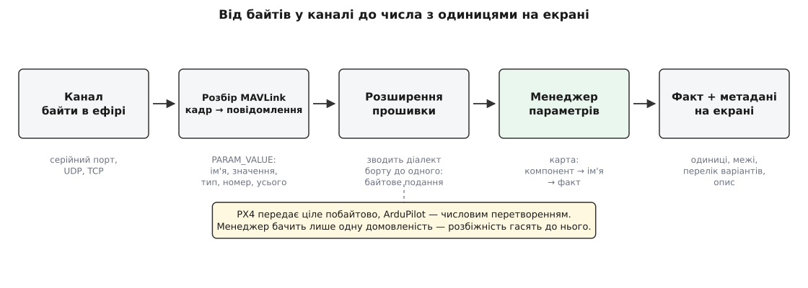

# Менеджер параметрів: завантаження, кеш, запис

<preknowlist>
- [Протокол параметрів](book:communications/param-protocol) — як борт віддає налаштування: запит списку, потік повідомлень зі значеннями, запис одного значення.
- [Пакет MAVLink](book:communications/mavlink-packet) — кадр із адресами й контрольною сумою, без гарантії доставки.
- [FactSystem: факт, метадані й зв'язок зі станом](book:qgroundcontrol/fact-system) — що таке факт і звідки він бере опис, одиниці та межі.
- [Vehicle: модель апарата всередині застосунку](book:qgroundcontrol/vehicle-object) — об'єкт апарата, якому належить менеджер параметрів разом із каналом зв'язку.
</preknowlist>

Відкрий сторінку налаштувань — і на екрані одразу з'являються десятки полів із числами, підписами й одиницями. Жодне з цих чисел не лежить у застосунку. Вони живуть у флеші польотного контролера, на іншому кінці радіоканалу, який губить пакети й відповідає із затримкою в сотні мілісекунд. Але поле на екрані читає значення миттєво, ніби воно в сусідній змінній.

Так можна поводитися лише з однієї причини: **станція тримає в пам'яті повну копію всього набору параметрів апарата**. Менеджер параметрів існує заради цієї копії — наповнити її чесно, не наповнювати заново без потреби й ніколи не дати їй збрехати.

## Чому копія, а не запити за потребою

Здавалося б, простіше не тягнути нічого наперед, а питати борт тоді, коли значення знадобилося. Це не працює з трьох причин.

Параметрів багато: у ArduPilot їх близько тисячі, у PX4 — кілька сотень, а одна сторінка налаштувань відкриває десятки одразу. Канал повільний: відповідь іде сотні мілісекунд, а може не прийти взагалі. І головне — спосіб, у який побудований інтерфейс: поле прив'язане до значення як до властивості об'єкта й читає його в момент відмальовки, синхронно, чекати воно не вміє. Запит, який виконується з паузою, у цю модель не вкладається — довелося б у сотнях місць показувати спіннер і окремо обробляти «значення ще не приїхало».

Тому менеджер робить навпаки: один раз, на під'єднанні, він забирає **весь** набір і розкладає його в пам'яті у вигляді фактів — значень із описом, одиницями й межами. Далі інтерфейс працює з локальними об'єктами й нічого не знає про радіо. Плата за це — рівно три задачі: наповнити копію надійно поверх ненадійного каналу, наповнювати її повторно швидко й записувати так, щоб вона не розійшлася з бортом.


*Значення проходить кілька перетворень, перш ніж стати рядком на екрані. Менеджер параметрів стоїть посередині: він не розбирає кадри й не малює поля, зате вирішує, чи набір повний і чи можна йому вірити.*

## Чеклист замість підтверджень

Станція шле запит списку, і борт починає лити назустріч потік повідомлень — по одному на параметр. Ніхто не підтверджує отримання, ніхто не повторює втрачене, і жодне повідомлення не каже «це було останнє». Потік просто вичерпується.

Проте в кожному повідомленні є два поля, які все рятують: **скільки всього параметрів** і **який номер має цей**. З першого ж отриманого повідомлення менеджер знає кількість і будує список очікуваних номерів; кожне наступне повідомлення викреслює один. Відношення викресленого до загального — це і є смужка поступу.

Далі працює таймер тиші на три секунди, який перезапускається на кожному отриманому параметрі. Поки потік іде, він не спрацьовує ніколи. Спрацював — значить, борт замовк, а в списку лишилися діри. Менеджер бере з дір **пачку не більш як на десять** і на кожен номер шле точковий запит на читання; прийшла відповідь — номер викреслюється, а на його місце в пачку стає наступна діра. Пачка, а не все одразу, бо тисяча запитів заб'є той самий вузький канал, яким борт зараз намагається відповідати. І не по одному, бо тисяча дір по півсекунді дає хвилини.

Кожна невдала спроба збільшує лічильник на своєму номері. Після п'яти невдач менеджер **здається на цьому номері** й записує його в провалені. Без здавання завантаження на поганому каналі не скінчилося б ніколи.

Тому й завершення визначається не мовчанням, а порожнечею списку очікування. Якщо в провалених щось лишилося, станція піднімає ознаку «параметрів бракує» й не пускає користувача в сторінки налаштувань: інтерфейс, зібраний на неповному наборі, показував би неправду.

> 🔧 **Навіщо це.** Повідомлення «станція не змогла отримати повний набір параметрів» майже завжди означає поганий канал, а не поламану прошивку: втрати навіть у кілька відсотків на тисячі повідомлень дають десятки дір, а на десятках відсотків доборка вичерпує п'ять спроб і здається. Перевіряти треба антену, живлення модема й завади, а не перевстановлювати застосунок.

## Дві дороги в обхід повного завантаження

Чесне повне завантаження коштує дорого:

**Тисяча двісті параметрів через телеметричний модем на 57600 бод**

```
кадр на один параметр:   12 байтів обгортки + 25 байтів даних = 37 байтів
1200 параметрів:         1200 · 37             = 44 400 байтів
канал 57600 бод, 8N1:    57600 / 10            = 5760 байтів/с
теоретичний мінімум:     44400 / 5760          ≈ 7.7 с
```

А на практиці — десятки секунд, бо радіомодем віддає в ефір менше за номінал, канал не можна займати цілком, і кожна втрата додає доборку. Робити це на кожному під'єднанні нестерпно, тож обидві головні прошивки дають спосіб уникнути — і способи різні.

**PX4 звіряє контрольну суму.** Станція просить прочитати особливе значення `_HASH_CHECK`, якого немає в списку параметрів; борт відповідає числом — контрольною сумою над усім своїм набором. Паралельно станція бере кеш-файл цього апарата, збережений минулого разу, і рахує таку саму суму над ним. Збіглося — факти вантажаться прямо з диска, і з борту не приходить **жодного** значення. Не збіглося (чи кеш-файла немає) — звичайний потік. Звіряють саме суму, а не час чи версію: підмінили польотний контролер під тим самим номером апарата — сума не збіжиться, і станція чесно перевантажить усе. Ось чому те саме під'єднання іноді триває секунду, а іноді сорок.

Кеш ведеться **лише для PX4**. В ArduPilot є параметри, що змінюються самі під час польоту, — сума не збігалася б ніколи.

**ArduPilot віддає один файл.** Замість тисячі повідомлень борт породжує на льоту файл із усім набором і передає його через [передачу файлів поверх MAVLink](book:communications/mavlink-ftp). Виграш потрійний: зникає обгортка кадру на кожному параметрі, імена в файлі зберігаються стисненими, а сама передача файлу має власні підтвердження й повтори — тобто доборка по дірах не потрібна взагалі.

Обидві швидкі дороги можуть провалитися: прошивка стара й такого файлу не знає, канал занадто повільний, повторів забагато, сума не збіглася. Спільне в усіх провалів одне — вони ведуть у те саме звичайне завантаження потоком. Втрата швидкості ніколи не перетворюється на втрату параметрів.

## Запис: локальна правка мусить стати підтвердженою зміною

У копії є зворотний бік. Щойно користувач пересунув повзунок, локальний факт **уже** показує нове число, а борт про нього ще не знає. З цієї миті копія бреше, і завдання менеджера — звести брехню до найкоротшого проміжку, а якщо не вдалося, зізнатися.

Менеджер шле на борт запис і чекає секунду. Чекає на що? Окремого підтвердження запису протокол не має: борт відповідає тим, що передає параметр наново — звичайним повідомленням зі значенням, тим самим, яким він відповідає на читання. Це зроблено навмисно, бо таке відлуння бачать усі станції на каналі одразу. Але для того, хто чекає, наслідок серйозний: **підтвердження треба впізнавати за змістом**. Менеджер звіряє ім'я, звіряє тип, а значення порівнює точно для цілих і з невеликим допуском для дробових.

Не збіглося — повтор, і так до двох разів. Не допомогло — невдача, а невдача веде до двох дій поспіль: сказати людині й **перечитати параметр із борту**. Перечитане значення затирає у факті те, що вписав користувач.

Саме звідси береться поведінка, яка спершу дивує: поле стрибає назад одразу після правки. Це означає, що борт запис прийняв, але значення виправив — найчастіше обрізав до допустимих меж. Відлуння не збіглося з очікуваним, менеджер визнав запис невдалим і показав те число, яке справді стоїть на апараті.

## Один інваріант

Уся конструкція обороняє одне правило: **локальна копія ніколи не показує того, чого борт не підтвердив**.

Список очікуваних номерів не дає вважати неповний набір повним. Лічильник спроб не дає обороні тривати вічно. Звірка контрольної суми дозволяє пропустити передачу лише тоді, коли борт сам підписався під тим, що набір не змінився. Перечитування після невдачі виганяє з копії число, яке вписала людина, а не апарат. А коли правило втримати неможливо — на поганому каналі чи на старій прошивці, — менеджер не підставляє правдоподібне, а піднімає ознаку неповноти й вимикає сторінки налаштувань.

Тож довге завантаження, повідомлення про неповний набір і поле, що стрибнуло назад, — це не збої підсистеми.
