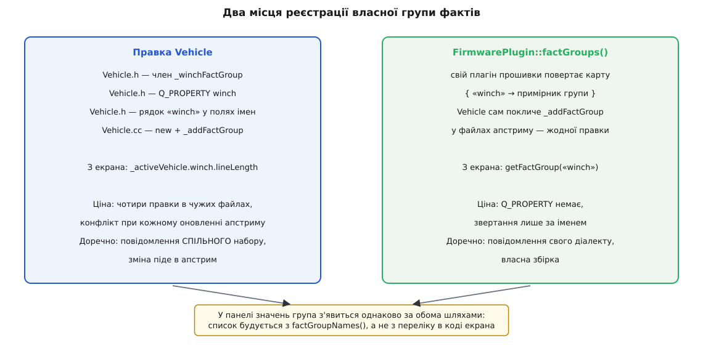
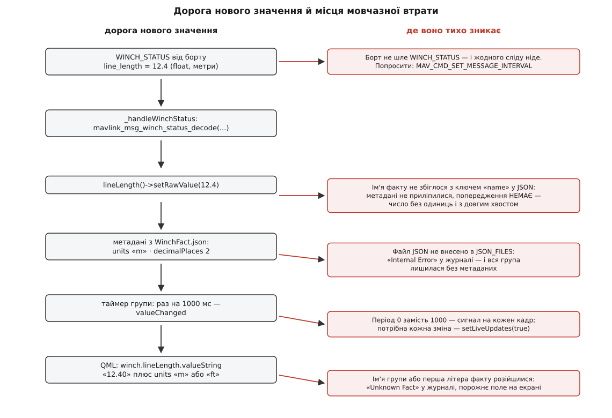

# ⚙️ Від WINCH_STATUS до числа на екрані: власна група фактів

Тут проведено одне-єдине значення — довжину випущеного троса лебідки — від сирого кадру в ефірі до підписаного числа на екрані станції, з усім кодом, який для цього треба написати. Виходить чотири файли й близько ста тридцяти рядків, причому найтонше місце в конструкції — не C++, а кілька рядків тексту, які нічим, крім точного збігу літер, між собою не зв'язані й ніким не звіряються.

## Умова

Доставковий мультикоптер має лебідку: трос із гаком, що опускає вантаж, поки апарат висить на місці. Автопілот про неї доповідає — шле повідомлення `WINCH_STATUS` зі спільного набору MAVLink, номер 9005:

```
uint64_t time_usec     [мкс]  мітка часу
float    line_length   [м]    випущено троса, NaN якщо невідомо
float    speed         [м/с]  + випускає, − підбирає, NaN якщо невідомо
float    tension       [кг]   натяг на тросі, NaN якщо невідомо
float    voltage       [В]    напруга живлення лебідки, NaN якщо невідомо
float    current       [А]    струм, NaN якщо невідомо
uint32_t status               бітові прапорці MAV_WINCH_STATUS
int16_t  temperature   [°C]   температура двигуна, INT16_MAX якщо невідомо
```

QGroundControl про це повідомлення не знає нічого. У теці `src/Vehicle/FactGroups` двадцять із гаком груп — GPS, вітер, вібрація, генератор, двигун внутрішнього згоряння, — лебідки серед них немає. Кадр справно приходить, справно проходить перевірку контрольної суми й маршрутизацію, а далі просто зникає, бо його ніхто не читає. Із чого складається сам кадр і як у ньому влаштовані номер повідомлення й ідентифікатори відправника, розібрано в [пакеті MAVLink](topic:communications/mavlink-packet).

Умову навмисне взято з боку спільного набору: структура `mavlink_winch_status_t` і функція її розбору вже лежать у бібліотеці, яку станція збирає й так, тож писати доводиться лише те, що вище протоколу. Дзеркальний випадок — повідомлення власного [діалекту](topic:communications/mavlink-dialect), якого в бібліотеці немає, — потребує ще й свого XML та [перезбирання бібліотеки з нього](topic:communications/mavlink-xml-codegen).

Отже, робота ставиться так: оператор має бачити довжину троса, швидкість, натяг і температуру двигуна, а кнопка «Підібрати» має бути недоступна, поки трос рухається.

## Три рішення, які ухвалюють до першого рядка коду

**Нова група чи наявна?** Група фактів — це один пристрій або одна підсистема зі своїм темпом надходження даних і своєю наявністю чи відсутністю на конкретному апараті. Якби йшлося про ще одну висоту, місце їй було б у головній групі апарата, поруч із `altitudeRelative` і `groundSpeed`. Лебідка — окрема залізяка: на більшості апаратів її взагалі немає, повідомлення про неї йде своїм ритмом, і жодне з її значень не має сенсу без решти. Отже, нова група.

Це рішення дає ще й безкоштовну відповідь на питання «а що показувати, коли лебідки немає». У кожної групи є прапорець `telemetryAvailable` з чесним описом в апстримі — «жодної телеметрії для цих значень ще не приходило». Доки не прийшов перший кадр, прапорець хибний, і екран має право не показувати групу зовсім, замість того щоб малювати шість нулів.

**Факт чи властивість?** Правило коротке: значення, яке показують **як число**, стає фактом; значення, яким користуються **як цілим**, лишається звичайною властивістю з сигналом. Довжина, швидкість, натяг, напруга, струм і температура — числа з одиницями й потрібною точністю, всі шість ідуть у факти. Поле `status` числом не є взагалі: це набір бітів, і показувати «17» оператору немає сенсу. Із нього треба видобути осмислені питання — «рухається?», «повністю змотано?», «зчеплення ввімкнене?» — а відповідь на таке питання вживають в умові, а не малюють цифрою. Тому «рухається» стає `Q_PROPERTY(bool)` із власним сигналом.

Межа тут не абсолютна. Якби ми хотіли, щоб оператор міг сам винести «рухається» на панель значень поруч із висотою, це мав би бути факт логічного типу з парою підписів у метаданих — і панель показала б «Рухається», а не голе число. Різниця не в тому, що можна, а в тому, за чим приходять: за умовою для кнопки чи за написом для ока. Що саме факт додає до голого числа — одиниці, точність, підпис, переклад — розібрано у [FactSystem](topic:qgroundcontrol/fact-system).

Мітку часу `time_usec` не беремо нікуди: вона знадобилася б, лише якби ми звіряли свіжість даних самі, а цим і так займається сама група.

**Який період оновлення?** Група створюється з періодом у мілісекундах, і всередині цього періоду вона накопичує зміни, випускаючи назовні один сигнал замість десятків. Для лебідки беремо 1000 мс — стільки ж, скільки взято для вітру.

Може здатися, що для рідкісного повідомлення період зайвий: кадр і так приходить раз на секунду, прорідити нічого. Але період — це стеля, а не підлога. Нижче ми самі попросимо борт слати `WINCH_STATUS` частіше, а хтось інший потім попросить ще частіше; поставлений період означає, що екран цього навіть не помітить. Нуль замість тисячі означав би, що частота перемальовування назавжди прив'язана до того, як сьогодні налаштований борт.

## Крок 1. Заголовок групи

```cpp
// src/Vehicle/FactGroups/VehicleWinchFactGroup.h
#pragma once

#include "FactGroup.h"

class VehicleWinchFactGroup : public FactGroup
{
    Q_OBJECT
    Q_PROPERTY(Fact *lineLength READ lineLength CONSTANT)
    Q_PROPERTY(Fact *speed      READ speed      CONSTANT)
    Q_PROPERTY(Fact *tension    READ tension    CONSTANT)
    Q_PROPERTY(Fact *voltage    READ voltage    CONSTANT)
    Q_PROPERTY(Fact *current    READ current    CONSTANT)
    Q_PROPERTY(Fact *motorTemp  READ motorTemp  CONSTANT)
    Q_PROPERTY(bool  moving     READ moving     NOTIFY movingChanged)

public:
    explicit VehicleWinchFactGroup(QObject *parent = nullptr);

    Fact *lineLength() { return &_lineLengthFact; }
    Fact *speed()      { return &_speedFact; }
    Fact *tension()    { return &_tensionFact; }
    Fact *voltage()    { return &_voltageFact; }
    Fact *current()    { return &_currentFact; }
    Fact *motorTemp()  { return &_motorTempFact; }

    bool moving() const { return _moving; }

    // Перевизначення FactGroup
    void handleMessage(Vehicle *vehicle, const mavlink_message_t &message) final;

signals:
    void movingChanged(bool moving);

private:
    void _handleWinchStatus(const mavlink_message_t &message);

    Fact _lineLengthFact = Fact(0, QStringLiteral("lineLength"), FactMetaData::valueTypeDouble);
    Fact _speedFact      = Fact(0, QStringLiteral("speed"),      FactMetaData::valueTypeDouble);
    Fact _tensionFact    = Fact(0, QStringLiteral("tension"),    FactMetaData::valueTypeDouble);
    Fact _voltageFact    = Fact(0, QStringLiteral("voltage"),    FactMetaData::valueTypeDouble);
    Fact _currentFact    = Fact(0, QStringLiteral("current"),    FactMetaData::valueTypeDouble);
    Fact _motorTempFact  = Fact(0, QStringLiteral("motorTemp"),  FactMetaData::valueTypeDouble);

    bool _moving = false;
};
```

Чотири дрібниці тут варті окремого погляду.

Факти — **поля-значення, а не вказівники**. Група володіє ними через вкладення: створюються разом із нею, гинуть разом із нею, і жодного `new` на них немає. Саме тому далі всюди фігурує `&_lineLengthFact` — беремо адресу свого ж поля.

Перший аргумент конструктора факту — ідентифікатор компонента, і для телеметрії він нульовий: компонент має значення для параметрів, які треба вміти записати назад конкретному вузлу, а телеметрійний факт нікуди не пишеться. Другий аргумент, ім'я, — найважливіший рядок у всьому файлі, і чому саме він, стане видно з наступного файлу.

Усі факти оголошено як `valueTypeDouble`, хоча в кадрі летять `float` і `int16_t`. Тип факту — це тип **сховища й показу**, а не тип поля в протоколі; звужувати його до `float` немає сенсу, а розширення `int16_t` до дійсного дає змогу покласти в температуру ознаку «не знаю» замість числа.

І `CONSTANT` у властивостях, що віддають факти, викликає найбільше подиву: значення ж змінюється щосекунди. Але змінюється значення **всередині** факту, а сам вказівник на факт справді сталий — об'єкт створено разом із групою й ніколи не підмінюється. Про зміну числа сповіщає сам факт своїм `valueChanged`, і прив'язка на екрані слухає саме його.

## Крок 2. Метадані

Ім'я, одиниці, точність і підпис у C++ не пишуть — вони живуть у JSON поруч із класом.

```json
{
    "version":      1,
    "fileType":     "FactMetaData",
    "QGC.MetaData.Facts":
[
{
    "name":             "lineLength",
    "shortDesc":        "Winch Line",
    "type":             "double",
    "decimalPlaces":    2,
    "units":            "m"
},
{
    "name":             "speed",
    "shortDesc":        "Winch Spd",
    "type":             "double",
    "decimalPlaces":    2,
    "units":            "m/s"
},
{
    "name":             "tension",
    "shortDesc":        "Winch Tension",
    "type":             "double",
    "decimalPlaces":    1,
    "units":            "kg"
},
{
    "name":             "voltage",
    "shortDesc":        "Winch Volt",
    "type":             "double",
    "decimalPlaces":    1,
    "units":            "V"
},
{
    "name":             "current",
    "shortDesc":        "Winch Curr",
    "type":             "double",
    "decimalPlaces":    1,
    "units":            "A"
},
{
    "name":             "motorTemp",
    "shortDesc":        "Winch Temp",
    "type":             "double",
    "decimalPlaces":    0,
    "units":            "C"
}
]
}
```

`name` і `type` обов'язкові, решта — ні. `name` — це той самий рядок, що стоїть у конструкторі факту, і єдиний шов між цим файлом і C++: метадані знаходять свій факт **виключно** за збігом цього рядка. `shortDesc` — короткий підпис, який побачить оператор; пишеться англійською, бо далі проходить через переклад інтерфейсу. `decimalPlaces` — скільки знаків після коми показувати.

А `units` — не підпис. Це **ключ у таблиці перетворень**: за цим рядком станція шукає пару функцій «туди-сюди» й лише знайшовши її, вміє показати значення в чужій системі. Записи є для метрів (`m`, а також `meter` і `meters`), швидкості (`m/s`) і температури (`C`) — тому наша довжина сама покажеться у футах, швидкість у вузлах, а температура у Фаренгейтах, щойно користувач вибере це в налаштуваннях. Для кілограмів, вольтів і амперів записів немає, і це звичайна річ для вузькоспеціальних величин: рядок піде в підпис як є. Повний порядок перевірок цього рядка — разом із підписами кодів і бітовими масками, які перетворення вимикають зовсім, — розібрано у [власній групі фактів](topic:qgroundcontrol/fact-system/proj-custom-factgroup.md).

> 🔧 **Навіщо це.** Звідси неочевидний висновок: одиниці пишуть **ті, у яких значення лежить у пам'яті**, а не ті, у яких його хочеться бачити. Поклали в факт метри, а написали `"units": "ft"` — і футів не буде ніколи: перетворювача для такого рядка немає, тож число покажеться метрове, а підпис брехатиме. З тієї самої причини `"metres"` не спрацює там, де працює `"meters"`: збіг рядка шукається точний.

## Крок 3. Реалізація

```cpp
// src/Vehicle/FactGroups/VehicleWinchFactGroup.cc
#include "VehicleWinchFactGroup.h"
#include "Vehicle.h"

#include <QtCore/QtMath>
#include <cstdint>

VehicleWinchFactGroup::VehicleWinchFactGroup(QObject *parent)
    : FactGroup(1000, QStringLiteral(":/json/Vehicle/WinchFact.json"), parent)
{
    _addFact(&_lineLengthFact);
    _addFact(&_speedFact);
    _addFact(&_tensionFact);
    _addFact(&_voltageFact);
    _addFact(&_currentFact);
    _addFact(&_motorTempFact);

    // «Даних ще немає» — це не нуль. NaN станція покаже прочерком.
    for (Fact *fact : { &_lineLengthFact, &_speedFact, &_tensionFact,
                        &_voltageFact, &_currentFact, &_motorTempFact }) {
        fact->setRawValue(qQNaN());
    }
}

void VehicleWinchFactGroup::handleMessage(Vehicle *vehicle, const mavlink_message_t &message)
{
    Q_UNUSED(vehicle);

    switch (message.msgid) {
    case MAVLINK_MSG_ID_WINCH_STATUS:
        _handleWinchStatus(message);
        break;
    default:
        break;
    }
}

void VehicleWinchFactGroup::_handleWinchStatus(const mavlink_message_t &message)
{
    mavlink_winch_status_t winch{};
    mavlink_msg_winch_status_decode(&message, &winch);

    // NaN у полі означає «борт не знає» — кладемо його як є, не підміняючи нулем
    lineLength()->setRawValue(winch.line_length);
    speed()->setRawValue(winch.speed);
    tension()->setRawValue(winch.tension);
    voltage()->setRawValue(winch.voltage);
    current()->setRawValue(winch.current);

    // у цілого поля свій знак незнання — переводимо його в той самий NaN
    motorTemp()->setRawValue(winch.temperature == INT16_MAX
                                 ? qQNaN()
                                 : static_cast<double>(winch.temperature));

    const bool moving = (winch.status & MAV_WINCH_STATUS_MOVING) != 0;
    if (moving != _moving) {
        _moving = moving;
        emit movingChanged(_moving);
    }

    _setTelemetryAvailable(true);
}
```

Конструктор робить рівно три речі. Кличе базовий із періодом і шляхом до метаданих — і саме там, усередині базового, JSON читається й розкладається в карту «ім'я → метадані». Реєструє факти: `_addFact` бере ім'я з самого факту, шукає в тій карті запис під цим іменем і, якщо знаходить, приліплює його. І кладе в кожен факт `NaN`.

Останнє — не дрібниця. `NaN` у полі MAVLink означає «борт не знає»; нуль означає «нуль». Різниця між «трос не випущено» і «про трос нічого не відомо» для оператора величезна, і станція її показує: побачивши `NaN`, факт віддає замість числа рядок із самих тире — `–.––` для двох знаків після коми, просто `–` для нуля знаків. Тому нуль на старті був би прямою брехнею: до першого кадру екран запевняв би, що трос змотано. Чому `NaN` узагалі поводиться інакше за всі інші числа й чому порівняння з ним не працює — у [числах із рухомою комою](topic:programming/floating-point).

Через це й температура не переписується прямо. Її поле ціле, `NaN` у нього не влізе, тож незнання позначене крайнім значенням типу — і рядок `motorTemp()->setRawValue(winch.temperature)` без перевірки зібрався б, спрацював і показав операторові бадьорі `32767 °C`. Знак незнання переводять у `NaN`, а не в нуль: нуль градусів — теж цілком правдоподібне показання, і відрізнити його від «немає даних» на екрані вже не вийде.

`handleMessage` виглядає надлишковим на одну гілку, але форма тут не випадкова: цей метод отримує **весь** потік апарата, кадр за кадром, і `switch` за номером — найдешевший спосіб відкинути чуже. Ще важливіше, що метод виконується в головній нитці — тій самій, яка малює інтерфейс, — тож будь-яка важка робота всередині нього стає підгальмовуванням екрана. Що саме де відбувається, розкладено в [моделі потоків](topic:qgroundcontrol/threading-model).

Прапорець `moving` оновлюється через порівняння зі старим значенням. Це не оптимізація заради економії: сигнал, який летить із кожним кадром, змушує перерахуватися кожну прив'язку, що на ньому висить, — а бітове поле здебільшого не змінюється роками. Факти такого порівняння не потребують, бо їх стримує таймер групи; властивість, яку ми завели самі, стримувати нікому.

## Крок 4. Збірка й ресурси

```cmake
# src/Vehicle/FactGroups/CMakeLists.txt

target_sources(${CMAKE_PROJECT_NAME}
    PRIVATE
        ...
        VehicleWinchFactGroup.cc
        VehicleWinchFactGroup.h
)

set(JSON_FILES
    ...
    WinchFact.json
)

qt_add_resources(${CMAKE_PROJECT_NAME} json_vehicle_fact_group
    PREFIX "/json/Vehicle"
    FILES ${JSON_FILES}
)
```

Записів два, і вони незалежні. Перший додає код до збірки. Другий вшиває JSON у бінарник — саме вшиває, а не залишає файлом на диску: `qt_add_resources` бере перелічені файли й перетворює їх на масиви байтів усередині виконуваного файлу, доступні за шляхом із двокрапкою. Шлях складається з префікса й імені файлу:

```
PREFIX "/json/Vehicle"  +  WinchFact.json
                        ↓
:/json/Vehicle/WinchFact.json      ← точно цей рядок стоїть у конструкторі
```

Ніхто ці два рядки між собою не звіряє. Помилка в будь-якому — і застосунок збереться без єдиного зауваження, а метадані не завантажаться. Загальні кроки збірки й залежності — у [збірці QGroundControl](topic:qgroundcontrol/building-qgc); окремих команд наш додаток не потребує.

## Крок 5. Реєстрація: два місця на вибір



*Обидва шляхи ведуть в одну точку — до тієї самої карти груп усередині апарата; різняться вони не результатом, а ціною для чужих файлів.*

Перший шлях — прямо в моделі апарата. Метод, яким апарат бере до себе вкладену групу, захищений, а успадковувати сам клас застосунок не дає — тож «прямо» тут означає буквально: правити файли апстриму. Це шлях того, хто веде свою гілку або збирається віддати зміну назад. Чотири правки:

```cpp
// Vehicle.h — серед решти властивостей
Q_PROPERTY(FactGroup *winch READ winchFactGroup CONSTANT)
...
FactGroup *winchFactGroup() { return _winchFactGroup; }
...
VehicleWinchFactGroup *_winchFactGroup = nullptr;
const QString _winchFactGroupName = QStringLiteral("winch");
```

```cpp
// Vehicle.cc, поруч зі створенням решти груп
_winchFactGroup = new VehicleWinchFactGroup(this);
...
_addFactGroup(_winchFactGroup, _winchFactGroupName);
```

І це весь код. Роздавання повідомлень дописувати не треба — воно вже є й написане циклом, а не переліком:

```cpp
// Vehicle::_mavlinkMessageReceived
for (FactGroup *factGroup : factGroups()) {
    factGroup->handleMessage(this, message);
}
```

Тому щойно група потрапила в карту, її `handleMessage` починає отримувати кадри — без жодного рядка десь іще.

Другий шлях зовсім не чіпає файлів апстриму. Плагін прошивки має віртуальний метод, що віддає карту власних груп, і модель апарата сама розкладає її по тих самих полицях:

```cpp
// у своєму плагіні прошивки
QMap<QString, FactGroup*> *MyFirmwarePlugin::factGroups()
{
    if (_factGroups.isEmpty()) {
        _factGroups.insert(QStringLiteral("winch"), new VehicleWinchFactGroup(this));
    }
    return &_factGroups;
}
```

Різниця між шляхами одна: у другого немає `Q_PROPERTY`, тож із боку інтерфейсу до групи доведеться звертатися за іменем, а не крапкою. Взамін — жодного рядка різниці з апстримом, а отже, жодного конфлікту при оновленні. Правило вибору просте: повідомлення зі спільного набору й зміна, що годиться всім, — перший шлях; своя залізяка на своєму апараті — другий. Що ще дозволяє змінити [плагін прошивки](topic:qgroundcontrol/firmware-plugin) і як узагалі підставляють власний, — у [власній збірці](topic:qgroundcontrol/custom-build).

## Крок 6. Звернення з боку інтерфейсу

Найкоротший шлях до числа на екрані — крапкою, через властивість:

```qml
QGCLabel {
    text: _activeVehicle
              ? _activeVehicle.winch.lineLength.valueString + " " +
                _activeVehicle.winch.lineLength.units
              : "–"
}

QGCButton {
    text:    qsTr("Retract")
    enabled: _activeVehicle && !_activeVehicle.winch.moving
}
```

`valueString` — це вже перетворене й округлене число, з прочерком замість `NaN`; `units` — уже перекладені одиниці, метри чи фути залежно від налаштувань. Ніде в цьому коді не сказано, що йдеться про довжину, скільки в неї знаків після коми й чим її підписати, — і в цьому вся суть: усе знання про величину лишилося в JSON.

Другий спосіб — за іменем, і він працює обома шляхами реєстрації:

```qml
property Fact _lineLength: _activeVehicle.getFact("winch.lineLength")
```

Крапка всередині рядка означає «група, потім факт у ній», і рівень вкладення дозволено рівно один: `"winch.motor.temp"` дасть у журналі скаргу на глибину, а не значення.

І третій спосіб — не писати QML узагалі. Панель значень, куди оператор сам складає потрібні йому показники, будує свій перелік не з якогось списку в коді екрана, а з переліку груп і фактів, який віддає сам апарат:

```cpp
QStringList groupNames = _vehicle->factGroupNames();
for (QString &name : groupNames) {
    name[0] = name[0].toUpper();          // «winch» → «Winch» для показу
}
```

Тому щойно група зареєстрована, у списку доступних значень з'являється «Winch», а в ньому — шість наших рядків. Оператор перетягує «LineLength» на екран, і панель повертає ім'я назад:

```
показ:    LineLength          ← перша літера велика, для ока
пошук:    getFact("LineLength")
всередині: перша літера в малу  →  "lineLength"
знайдено: _nameToFactMap["lineLength"]   ✔
```

> 🔧 **Навіщо це.** Звідси випливає найдешевший порядок робіт. Спершу — група, метадані, збірка й реєстрація; далі запустити станцію й подивитися в панель значень. Якщо «Winch» там є і шість значень усередині мають одиниці — усе зроблене правильно, і власний QML лишається питанням смаку. Якщо почати з малювання екрана, перша ж порожнеча буде неоднозначною: чи то група не зареєстрована, чи то метадані не приліпилися, чи то в прив'язці друкарська помилка.

## Крок 7. Попросити борт слати

Найприкріше місце всієї роботи в тому, що бездоганно написана група може не показати нічого: борт не зобов'язаний слати `WINCH_STATUS` за власною ініціативою. Багато повідомлень автопілот шле лише тоді, коли їх попросили.

Просять командою `MAV_CMD_SET_MESSAGE_INTERVAL` під номером 511: перший параметр — номер потрібного повідомлення, другий — бажаний проміжок між кадрами в мікросекундах. Проміжок, а не частота, тож рахувати доводиться самому:

```
бажана частота  = 4 Гц
проміжок        = 1 / 4 = 0.25 с
у мікросекундах = 0.25 · 1 000 000 = 250 000     ← param2
```

```cpp
_vehicle->sendMavCommand(_vehicle->defaultComponentId(),
                         MAV_CMD_SET_MESSAGE_INTERVAL,
                         true,                          // показати помилку, якщо борт відмовить
                         MAVLINK_MSG_ID_WINCH_STATUS,   // param1 — номер повідомлення
                         250000);                       // param2 — проміжок, мкс
```

Два особливі значення другого параметра варто знати напам'ять: `-1` вимикає потік зовсім, `0` повертає типову для прошивки частоту. І `-1`, і `0` — цілком робочі значення, а не помилка.

Проте команду мало відправити: борт може її не підтримати або відмовити, і тоді все залишиться як було. Тому в станції є менеджер проміжків, який робить і те, і те — шле команду, а потім окремим запитом звіряє, що вийшло насправді:

```cpp
// частота тут у герцах, перерахунок у мікросекунди робить менеджер
_vehicle->setMessageRate(_vehicle->defaultComponentId(),
                         MAVLINK_MSG_ID_WINCH_STATUS, 4);
```

Як узагалі влаштований діалог із командою, підтвердженням і повтором, розібрано в [командах MAVLink](topic:communications/mavlink-commands).

## Скільки коду вийшло

| файл | рядків | що робить |
|---|---|---|
| `FactGroups/VehicleWinchFactGroup.h` | ~40 | шість фактів, одна властивість, один сигнал |
| `FactGroups/WinchFact.json` | ~45 | одиниці, точність, підписи |
| `FactGroups/VehicleWinchFactGroup.cc` | ~55 | реєстрація фактів, розбір кадру |
| `FactGroups/CMakeLists.txt` | +3 | два джерела й один ресурс |
| `Vehicle.h` / `Vehicle.cc` | +6 | член, властивість, ім'я, реєстрація |

Сто тридцять рядків на шість нових значень — і жодного рядка в тому, що роздає повідомлення, малює числа, переводить метри у фути чи складає панель.

## Граблі

Майже всі помилки в цій конструкції — тихі: збірка проходить, застосунок запускається, а значення на екрані немає або воно виглядає не так. Причина спільна: жоден зі швів між чотирма файлами не перевіряється компілятором, бо всі вони — збіг рядків.



*Ліворуч — шість кроків, які має пройти число; праворуч — що станеться, якщо розійдеться шов між сусідніми кроками.*

### Забутий рядок у CMakeLists — дві різні поламки

Записів там два, і симптоми в них геть різні.

Не внесли `.cc` у `target_sources` — файл просто не компілюється. Помилка знайдеться швидко, бо компонувальник поскаржиться на невизначені посилання, щойно `Vehicle.cc` спробує створити групу.

Не внесли `.json` у `JSON_FILES` — усе збереться. Ресурсу за шляхом `:/json/Vehicle/WinchFact.json` не існує, читання його провалиться, у журналі з'явиться `Internal Error`, а карта метаданих лишиться порожньою. Далі `_addFact` шукатиме в порожній карті, нічого не знаходитиме — і мовчки додасть факти **без метаданих узагалі**. На екрані: жодних одиниць, підпис — саме ім'я змінної, а число з усіма знаками після коми, які має `double`. Причому провалиться вся група разом, бо файл один на всі шість фактів. Це, до речі, добра ознака для розрізнення: одне значення без одиниць — розійшлося ім'я; усі шість без одиниць — не доїхав файл.

### Ім'я факту й ключ `name` розійшлися

Той самий кінцевий вигляд, але через інший шов і лише для одного факту. `_addFact` шукає метадані за іменем, узятим із самого факту, і не знайшовши — тихо кладе факт у карту без них:

```cpp
void FactGroup::_addFact(Fact *fact, const QString &name)
{
    if (_nameToFactMap.contains(name)) {
        qCWarning(FactGroupLog) << "Duplicate Fact" << name;
        return;
    }
    fact->setSendValueChangedSignals(_updateRateMSecs == 0);
    if (_nameToFactMetaDataMap.contains(name)) {
        fact->setMetaData(_nameToFactMetaDataMap[name], true);
    }
    _nameToFactMap[name] = fact;
    ...
```

Зверніть увагу: у `if` немає гілки `else`. Дублікат імені попередження дає, а відсутність метаданих — ні. Тому `"name": "linelength"` замість `"lineLength"` не залишає в журналі нічого; єдиний слід — значення без одиниць.

### Велика літера на початку імені

Найзагадковіші з усіх граблів, бо помилку видно лише в панелі значень, а у власному QML усе працює.

Пошук факту за іменем не буквальний: перед пошуком перша літера імені переводиться в малу. Зроблено це заради панелі, яка показує імена з великої літери й тим самим іменем потім і шукає. Але наслідок ширший: ім'я, зареєстроване з великої літери, знайти вже неможливо. Назвали факт `LineLength` — реєстрація пройде, у панелі напис з'явиться, а спроба взяти значення дасть у журналі:

```
Unknown Fact "lineLength"
```

і порожнє поле на екрані. Тому правило залізне: **ім'я факту завжди починається з малої літери** — і в C++, і в JSON.

### Значення оновлюється, а екран стоїть

Число в факті свіже щомиті, а рухається на екрані раз на секунду — і винен тут не кадр, а таймер групи, який притлумлює сповіщення. Вікну, якому потрібна кожна зміна, на час його життя вмикають `setLiveUpdates(true)`, а при закритті вимикають назад; забутий увімкненим живий режим лишається таким до перезапуску застосунку й розганяє вже не те вікно, а звичайний польотний вигляд.

Тонкість, яку варто розуміти чітко: період прорідує **сповіщення**, а не значення. Хто читає факт напряму, завжди дістає найсвіжіше число. Тому телеметрійний лог із фактів писати не можна — його пишуть із сирих кадрів.

### Борт мовчить

Найчастіший симптом після першої збірки: усе зроблено, а в панелі — самі прочерки. Перевіряти тут треба не код: у станції є вбудований інспектор MAVLink, і питання до нього одне — чи приходить `WINCH_STATUS` узагалі. Не приходить — це не поламка, а сходинка сьома вище: попросіть борт слати.

Окремий різновид того самого — повідомлення приходить, але від іншого компонента. Лебідка цілком може бути самостійним вузлом зі своїм `compid`. Кадр до групи дійде, бо апарат фільтрує потік за `sysid`, — але штатні обробники в апстримі часто звіряють ще й `compid` з ідентифікатором автопілота, і скопійована за звичкою перевірка

```cpp
if (message.compid != vehicle->compId()) {   // ← для стороннього вузла це смерть
    return;
}
```

відкине рівно ті кадри, заради яких усе робилося.

Спільне в цих п'яти випадках одне: жоден не дає ні падіння, ні червоного рядка. Тому найдешевша звичка — перевіряти шов за швом у порядку, у якому вони йдуть: чи приходить кадр, чи потрапив файл у ресурси, чи збіглися імена, чи зареєстрована група. Кожен наступний крок має сенс лише тоді, коли попередній справді працює.
