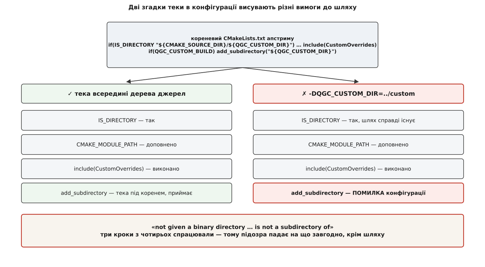
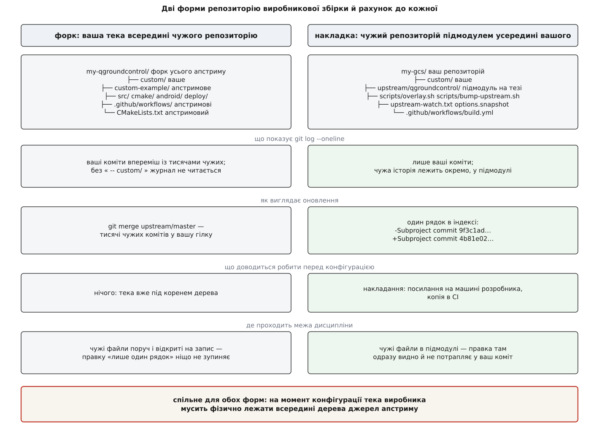

# ⚙️ Накладковий репозиторій: щоб оновлення апстриму коштувало один вказівник

Коли вміст теки виробника вже вирішено, лишається питання, що виглядає організаційним, а насправді призначає ціну кожного майбутнього релізу QGroundControl: де ця тека живе в системі контролю версій. Нижче — дві можливі форми репозиторію з чесним рахунком до кожної, тверде обмеження системи збірки, яке одну з них ускладнює, робочі скрипти накладання й оновлення, мінімальний CI на три платформи й чек-лист переходу на нову версію, у якому кожна тиха поломка дістає механічний перетворювач на гучну.

## Обмеження, з якого все випливає

У кореневому `CMakeLists.txt` апстриму теку виробника згадано двічі, і другий раз важливіший за перший:

```cmake
if(IS_DIRECTORY "${CMAKE_SOURCE_DIR}/${QGC_CUSTOM_DIR}")
    list(APPEND CMAKE_MODULE_PATH "${CMAKE_SOURCE_DIR}/${QGC_CUSTOM_DIR}/cmake")
    include(CustomOverrides)
endif()
# …
if(QGC_CUSTOM_BUILD)
    add_subdirectory("${QGC_CUSTOM_DIR}")
endif()
```

Ім'я теки вільне. `QGC_CUSTOM_DIR` — звичайна кешована змінна з типовим значенням `custom` і промовистим описом «Custom build overlay directory, relative to the source root», тож перейменування — лише один зі способів; другий — передати `-DQGC_CUSTOM_DIR=…` у виклик конфігурації. Сам апстрим у своєму CI користується саме другим: робочий процес `custom-build.yml` збирає показовий приклад рядком `-DQGC_CUSTOM_DIR=custom-example`, нічого не перейменовуючи.

А от **місце** не вільне, і винний у цьому `add_subdirectory`. Ця команда з одним аргументом приймає лише каталог, що лежить під поточним каталогом джерел. Дати їй шлях назовні можна, але тоді потрібен другий аргумент — каталог для результатів збірки, бо CMake не має куди покласти вивід підпроєкту, який лежить поза деревом. Апстрим другого аргумента не передає.

Наслідок неочевидний, і саме тому дорогий. Спроба вказати `-DQGC_CUSTOM_DIR=../custom` виглядає так, ніби майже спрацювала: `IS_DIRECTORY` бачить існуючий каталог, шлях пошуку модулів складається правильно, `CustomOverrides` виконується, повідомлення про виявлену теку з'являється в журналі. І лише через кілька сотень рядків конфігурації прилітає:

```
CMake Error at CMakeLists.txt:NNN (add_subdirectory):
  add_subdirectory not given a binary directory but the given source
  directory "…/../custom" is not a subdirectory of "…/qgroundcontrol".
  When specifying an out-of-tree source a binary directory must be
  explicitly specified.
```

Три кроки з чотирьох відпрацювали, тому перше, на що падає підозра, — що завгодно, крім шляху.



*Перевірка наявності теки й додавання її як підпроєкту — різні команди з різними вимогами до шляху, тому шлях назовні дерева проходить першу й падає на другій.*

Отже, хоч би яку форму репозиторію ви обрали, на момент конфігурації тека виробника мусить фізично лежати всередині дерева джерел апстриму. Усе далі — наслідки цього речення.

## Форма перша: форк, тека всередині

Це шлях, який радить документація розробника QGC: зробити форк репозиторію й **скопіювати** `custom-example` у нову теку `custom`.

```
my-qgroundcontrol/            ← форк усього апстриму
├── custom/                   ваше: два-три десятки файлів
├── custom-example/           апстримове, лишається на місці
├── src/  cmake/  android/  deploy/
├── .github/workflows/        апстримові
└── CMakeLists.txt            апстримовий
```

Слово «скопіювати» тут не випадкове, і документація окремо застерігає проти перейменування. Причина в тому, як git визначає перейменування: він не записує їх, а обчислює постфактум за схожістю вмісту. Перейменована тека виглядає для злиття як переміщення апстримового каталогу, і кожна наступна правка, яку апстрим внесе в `custom-example`, приїде до вас як зміна **вашого** `custom` — з конфліктами в файлах, що давно живуть власним життям. Копія такого спорідненості не має: апстрим править свій приклад, ви правите свою теку, злиття їх не плутає.

Що ця форма дає задарма: тека вже всередині дерева, тож жодного накладання робити не треба; апстримові робочі процеси CI лежать поруч і запускаються з єдиною відмінністю в один прапорець; `git bisect` ходить по обох історіях одночасно, тож поломка «десь між двома релізами» знаходиться однією командою.

Чого вона коштує. По-перше, історія: ваші коміти лежать упереміш із чужими, і `git log --oneline` без `-- custom/` не читається. По-друге — і це серйозніше — зникає тертя. Чужі файли лежать поруч і відкриті на запис; правка «лише один рядок, потім винесемо» не вимагає жодної зайвої дії, а рахунок за неї виставляється не сьогодні, а на наступному злитті. Загальні правила співжиття похідного репозиторію з першоджерелом розібрано в темі [форку й апстриму](topic:programming/fork-and-upstream); тут важить лише те, що ця форма покладається виключно на дисципліну.

## Форма друга: свій репозиторій, апстрим підмодулем

Розвернімо вкладеність. Верхній репозиторій — ваш, апстрим входить у нього [підмодулем](topic:programming/git-submodules), закріпленим на конкретному тезі.

```
my-gcs/                        ← ваш репозиторій
├── custom/                    усе ваше
│   ├── cmake/CustomOverrides.cmake
│   ├── src/  res/  android/  deploy/
│   └── CMakeLists.txt
├── upstream/qgroundcontrol/   підмодуль, закріплений на тезі
├── scripts/overlay.sh
├── scripts/bump-upstream.sh
├── upstream-watch.txt         перелік точок дотику
├── options.snapshot           знімок чинних ручок збірки
└── .github/workflows/build.yml
```

`git log` показує тільки вашу роботу. Розмір репозиторію дорівнює розміру вашого внеску. А оновлення справді виглядає як один вказівник:

```
 upstream/qgroundcontrol
-Subproject commit 9f3c1ad2b7e5…
+Subproject commit 4b81e02c9a17…
```

По суті це звичайне [закріплення версії залежності](topic:build-systems/version-pinning), тільки залежність збирається з джерел, а не приходить бінарником; загальний розбір такого способу тримати чужий код — у темі [вендорингу й сабмодулів](topic:build-systems/vendoring-submodules).

Плата за це рівно дві позиції: тека більше не опиняється на місці сама, і апстримові робочі процеси CI перестають бути вашими. Обидві розв'язні, і саме про них — далі.



*Форк дає безкоштовне розміщення теки й змішану історію; підмодуль дає чисту історію й оновлення в один рядок, але вимагає власного кроку накладання перед кожною конфігурацією.*

## Крок накладання: три способи покласти теку на місце

Спосіб перший — **символічне посилання**, для машин розробників під Linux і macOS. Робити його треба відносним, інакше клон, переміщений в іншу теку, зламається:

```bash
ln -s ../../custom upstream/qgroundcontrol/custom
```

Ціль рахується від теки, у якій лежить саме посилання, а не від поточної, — звідси два кроки вгору. Що саме зберігає таке посилання й чим воно відрізняється від жорсткого, розібрано в темі про [жорсткі й символічні посилання](topic:unix-linux/hard-and-symbolic-links).

Спосіб другий — **з'єднання каталогів (junction)** під Windows:

```
rem виконувати з кореня репозиторію
mklink /J upstream\qgroundcontrol\custom %CD%\custom
```

Тут три практичні деталі, заради яких це окремий пункт. Перша: створення справжнього символічного посилання (`mklink /D`) вимагає прав адміністратора або ввімкненого режиму розробника, а з'єднання каталогів — ні; для локального тому воно робить рівно те, що потрібно збірці. Друга: ціль обов'язково абсолютна — з'єднання зберігає повний шлях, а не відносний, тож перенесення клону його ламає, на відміну від відносного посилання під Unix. Третя: `ln -s` у Git Bash за типових налаштувань не створює посилання, а копіює — для справжнього потрібне `MSYS=winsymlinks:nativestrict`. Тому під Windows надійніше не покладатися на `ln`.

Спосіб третій — **копія**, для CI й випусків:

```bash
cmake -E copy_directory custom upstream/qgroundcontrol/custom
```

Копія дає те, чого не дає посилання: збірка бачить рівно те, що лежить у коміті, без питань про підтримку посилань файловою системою, розпакувальником архіву чи образом контейнера. У цьому ж її незручність для щоденної роботи: апстрим стежить за змінами накладеної теки через `CMAKE_CONFIGURE_DEPENDS`, а сторожем стає **копія**, тож правка у вашій теці нічого не перезапустить, поки ви не накладете її наново. Звідси й розподіл: розробнику — посилання, машині — копія.

Скрипт, що робить обидва варіанти й прибирає за собою:

```bash
#!/usr/bin/env bash
# scripts/overlay.sh [link|copy|auto] — покласти custom/ усередину дерева апстриму
set -euo pipefail

ROOT="$(cd "$(dirname "${BASH_SOURCE[0]}")/.." && pwd)"
SRC="$ROOT/upstream/qgroundcontrol"
DST="$SRC/custom"
MODE="${1:-${QGC_OVERLAY_MODE:-auto}}"

if [ ! -f "$SRC/CMakeLists.txt" ]; then
    echo "Підмодуль не витягнуто: git submodule update --init --recursive" >&2
    exit 1
fi

# 1. Хай git усередині підмодуля не рахує нашу теку за сміття в дереві.
#    У підмодуля .git — файл-указівник, тому справжній каталог питаємо в git.
GITDIR="$(git -C "$SRC" rev-parse --absolute-git-dir)"
mkdir -p "$GITDIR/info"
grep -qxF '/custom/' "$GITDIR/info/exclude" 2>/dev/null \
    || echo '/custom/' >> "$GITDIR/info/exclude"

# 2. Прибрати попереднє накладання, яким би воно не було.
#    Перевірка на посилання мусить іти першою: для посилання на теку -d теж істинне.
if [ -L "$DST" ]; then
    rm -f "$DST"
elif [ -d "$DST" ]; then
    rm -rf "$DST"
fi

# 3. Покласти нове.
if [ "$MODE" = auto ]; then
    if [ -n "${CI:-}" ]; then MODE=copy; else MODE=link; fi
fi

case "$MODE" in
    link) ln -s ../../custom "$DST" ;;
    copy) cmake -E copy_directory "$ROOT/custom" "$DST" ;;
    *)    echo "Невідомий режим: $MODE (link|copy|auto)" >&2; exit 2 ;;
esac

echo "Накладку покладено ($MODE): $DST"
```

Два місця тут варті окремої уваги. Порядок перевірок `-L` перед `-d` не косметичний: для посилання на існуючу теку істинні обидві, і `rm -rf` по посиланню вичистить **вашу** теку через нього. І рядок про `info/exclude`: без нього `git status` у підмодулі назавжди показує невідстежену теку, а `git submodule status` у верхньому репозиторії позначає підмодуль брудним — тобто найкорисніший сигнал «хтось поліз у чужі файли» тоне в шумі й перестає працювати.

## Оновлення: скрипт, який робить більше, ніж переставляє тег

Переставити вказівник — один рядок. Решта скрипта існує тому, що переставлений вказівник сам по собі нічого не розповідає.

```bash
#!/usr/bin/env bash
# scripts/bump-upstream.sh v5.0.8 — перевести підмодуль на тег і показати, що змінилося
set -euo pipefail

TAG="${1:?вкажіть тег апстриму, напр. v5.0.8}"
ROOT="$(cd "$(dirname "${BASH_SOURCE[0]}")/.." && pwd)"
SRC="$ROOT/upstream/qgroundcontrol"

OLD="$(git -C "$SRC" rev-parse HEAD)"

git -C "$SRC" fetch --tags --force origin
git -C "$SRC" checkout --detach "refs/tags/$TAG"
git -C "$SRC" submodule update --init --recursive

NEW="$(git -C "$SRC" rev-parse HEAD)"
if [ "$OLD" = "$NEW" ]; then echo "Уже на $TAG"; exit 0; fi

echo "== Що змінилося в точках, за які ми чіпляємось =="
# Розбиття на слова тут навмисне: у переліку шляхів пробілів немає.
WATCH="$(grep -vE '^[[:space:]]*(#|$)' "$ROOT/upstream-watch.txt" | tr '\n' ' ')"
git -C "$SRC" diff --stat "$OLD..$NEW" -- $WATCH

echo
echo "== Свіжий знімок чинних ручок збірки =="
rm -rf "$ROOT/build"                       # кеш переживає зникнення змінних — а нам треба, щоб не переживав
cmake -S "$SRC" -B "$ROOT/build" -DQGC_CUSTOM_DIR=custom -DCMAKE_BUILD_TYPE=Release >/dev/null
cmake -N -LA "$ROOT/build" | grep '^QGC_' \
    | sed "s#$ROOT#@ROOT@#g" | sort > "$ROOT/options.now"
diff "$ROOT/options.snapshot" "$ROOT/options.now" || true

git -C "$ROOT" add upstream/qgroundcontrol
echo
echo "Вказівник переставлено й підготовлено до коміту. Перегляньте різницю знімка вище,"
echo "оновіть options.snapshot свідомо — і лише тоді комітьте."
```

Скрипт навмисно не комітить сам. Різниця знімка ручок — це і є текст, який людина мусить прочитати; автоматичний коміт перетворив би його на журнальний шум, який ніхто не відкриває.

Три речі в цьому скрипті працюють не так, як здається на перший погляд.

**`upstream-watch.txt` — дані, а не код.** Перелік файлів апстриму, на які спирається ваша накладка, змінюється частіше за сам скрипт, тому живе окремим файлом і читається кожним, хто веде збірку:

```
# Точки дотику накладки з апстримом.
# Зміна будь-якого з цих файлів між релізами вимагає ручної звірки.
cmake/CustomOptions.cmake
src/API/QGCCorePlugin.h
src/API/QGCOptions.h
src/QGCApplication.cc
src/CMakeLists.txt
custom-example
```

**Знімати треба кеш, а не текст.** Спокуса вичитати перелік опцій регулярним виразом із `CustomOptions.cmake` природна, але дає не те: у файлі видно оголошення, а в збірку йдуть **чинні значення** — з урахуванням залежних опцій, платформозалежних типових значень і ваших власних `FORCE`. Режим `-N -LA` читає готовий кеш і не переконфігуровує проєкт, тож знімок — це справді те, з чим збирається продукт. Абсолютні шляхи в значеннях зашумили б різницю на кожній машині, тому корінь репозиторію замінюється міткою. Що взагалі означає «кешована змінна» й чому вона переживає перезапуски, розібрано в темі [кешу CMake й опцій](topic:build-systems/cache-and-options).

**Теку збірки треба саме видаляти.** Кеш CMake — накопичувальний: змінна, яку апстрим видалив з нової версії, лишається в `CMakeCache.txt` зі старим значенням, і всі перевірки на її наявність проходять успішно. Різниця знімків на старому кеші показала б, що не змінилося нічого. Це той рідкісний випадок, коли повне перезбирання не марнотратство, а умова коректності перевірки.

## Мінімальний CI: три платформи, одне запитання

Робочий процес нижче не збирає випуск. Він відповідає на єдине питання: **чи ваша накладка досі накладається на цей апстрим**. Тому важке вимкнено — відеотракт, інсталятор, тести; лишилося рівно те, що виконує `add_subdirectory(custom)`, компілює ваші джерела у складі головної цілі й лінкує результат. Такий прогін коштує хвилини, а не години, тож може ходити на кожному пуші; повне пакування під кожну платформу — окремий, повільніший процес, і його влаштування — тема [цілей платформ](topic:qgroundcontrol/platform-targets).

```yaml
name: overlay
on: [push, pull_request]

jobs:
  build:
    strategy:
      fail-fast: false
      matrix:
        include:
          - { os: ubuntu-24.04, qt_host: linux,   qt_arch: linux_gcc_64 }
          - { os: windows-2022, qt_host: windows, qt_arch: win64_msvc2022_64 }
          - { os: macos-15,     qt_host: mac,     qt_arch: clang_64 }
    runs-on: ${{ matrix.os }}
    defaults:
      run:
        shell: bash
    steps:
      - uses: actions/checkout@v4
        with:
          submodules: recursive
          fetch-depth: 0

      # Версію застосунку апстрим бере з git describe у СВОЄМУ дереві.
      - name: Теги апстриму
        run: git -C upstream/qgroundcontrol fetch --tags --force

      - uses: lukka/get-cmake@latest          # cmake + ninja однаково на всіх трьох
      - uses: jurplel/install-qt-action@v4
        with:
          version: '6.8.3'
          host: ${{ matrix.qt_host }}
          arch: ${{ matrix.qt_arch }}
          modules: qtcharts qtlocation qtpositioning qtmultimedia qtconnectivity qtsensors qtserialport qtshadertools qt5compat

      - uses: ilammy/msvc-dev-cmd@v1
        if: runner.os == 'Windows'

      - name: Накладання
        run: ./scripts/overlay.sh copy

      - name: Конфігурація
        run: |
          cmake -S upstream/qgroundcontrol -B build -G Ninja \
                -DCMAKE_BUILD_TYPE=Release \
                -DQGC_CUSTOM_DIR=custom \
                -DQGC_ENABLE_GST_VIDEOSTREAMING=OFF \
                -DQGC_BUILD_TESTING=OFF \
                -DQGC_BUILD_INSTALLER=OFF

      - name: Збірка
        run: cmake --build build --parallel

      # Лише на Linux: знімок містить шляхи, а bash під Windows подає корінь
      # як /d/a/…, тоді як CMake зберігає D:/a/… — заміна не спрацювала б.
      - name: Знімок ручок не розійшовся зі збереженим
        if: runner.os == 'Linux'
        run: |
          cmake -N -LA build | grep '^QGC_' \
            | sed "s#$PWD#@ROOT@#g" | sort > options.now
          diff options.snapshot options.now
```

Кілька рішень тут ухвалено свідомо, і кожне має ціну помилки.

**Образи прикріплено за номером, не `-latest`.** Мітка `ubuntu-latest` переїжджає на нову версію дистрибутива без вашої участі — і робить це тихо: збірка або починає падати без жодної вашої зміни, або, гірше, починає збиратися з іншим компілятором і давати інший бінарник. Це та сама порода поломок, від якої захищає закріплення версій залежностей; докладніше про вимогу «той самий вхід — той самий артефакт» — у темі [відтворюваних збірок](topic:build-systems/reproducible-builds).

**Повна глибина клону.** Апстрим виводить версію застосунку з опису найближчого тега у своєму дереві. Неглибокий клон тегів не привозить, і версія тихо стає нульовою — у бінарнику, в інсталяторі, у перевірці наявності оновлень. Що саме апстрим робить із цією версією — тема [моделі релізів](topic:qgroundcontrol/release-model).

**`QGC_ENABLE_WERROR` лишається ввімкненим.** Спокуса вимкнути попередження-як-помилки в CI велика й хибна: саме це налаштування перетворює свіже застереження компілятора про вашу накладку на червоний прогін замість непоміченого рядка в журналі на десять тисяч рядків.

**Версія Qt і перелік модулів — теж точка дотику.** Тут вони записані числом, і це чесніше, ніж здається: апстрим тримає свою версію Qt у складеній дії `.github/actions/build-prerequisites`, і при переході на новий тег її треба звірити руками. Розбіжність не ламає збірку одразу — вона ламає її через місяць, на функції, якої у вашій версії Qt ще немає. Загальний розбір того, як влаштувати такий конвеєр, — у темі [CI/CD](topic:programming/ci-cd); а якщо ви ведете кілька конфігурацій продукту, набір прапорців конфігурації варто винести в [пресети CMake](topic:build-systems/cmake-presets) замість довгого рядка в YAML.

## Чек-лист переходу: як зробити тихі поломки гучними

Поломки при переході діляться не на «серйозні» й «дрібні», а за моментом виявлення. Гучна виявляється машиною за хвилини. Тиха виявляється користувачем за тижні. Різниця між ними не в природі поломки — вона в тому, чи написана перевірка. Тому нижче до кожного пункту йде не порада «пам'ятайте», а перетворювач: команда або рядок конфігурації, після якого тиха поломка стає гучною.

### Гучні — ті, що вже кричать

**Змінилася сигнатура віртуального методу ядрового розширення.** Без `override` перевизначення з новою сигнатурою мовчки перетворюється на **нову**, ні з чим не пов'язану функцію: збірка проходить, метод ніколи не викликається. Ключове слово перетворює це на помилку компіляції. Проблема в тому, що поставити його всюди — питання дисципліни, а її можна автоматизувати:

```cmake
# custom/CMakeLists.txt — після формування CUSTOM_SOURCES
set_source_files_properties(${CUSTOM_SOURCES}
    TARGET_DIRECTORY ${CMAKE_PROJECT_NAME}
    PROPERTIES COMPILE_OPTIONS
        "$<$<CXX_COMPILER_ID:GNU,Clang>:-Wsuggest-override>;$<$<CXX_COMPILER_ID:MSVC>:/w14263>")
```

Аргумент `TARGET_DIRECTORY` тут обов'язковий, і причина в тому, як влаштовано під'єднання накладки. Властивості файлів джерел діють у межах каталогу, який їх задав, а ваші джерела компілюються не тут, а у складі головної цілі — у каталозі апстриму. Без цього аргументу рядок виконається без помилки й не подіє. Що саме віддає назовні ядрове розширення і які підписи там варто пильнувати — у [темі про нього](topic:qgroundcontrol/core-plugin).

**Зникла змінна, яку ви перевизначаєте.** `set(X … CACHE … FORCE)` на змінну, якої апстрим більше не оголошує, не є помилкою: CMake створить нову кешовану змінну, яку ніхто не читає. Ваше перевизначення далі «працює» — у порожнечу. Обгортка перетворює це на зупинку конфігурації:

```cmake
# custom/cmake/CustomOverrides.cmake
function(qgc_override name type value)
    if(NOT DEFINED CACHE{${name}})
        message(FATAL_ERROR "Апстрим більше не оголошує ${name}: перевизначення повисло")
    endif()
    set(${name} "${value}" CACHE ${type} "custom build override" FORCE)
endfunction()

qgc_override(QGC_APP_NAME       STRING "Custom-QGroundControl")
qgc_override(QGC_PACKAGE_NAME   STRING "com.example.gcs")
qgc_override(QGC_SETTINGS_VERSION STRING "1")
```

Перевірка спирається на те, що типові значення апстриму лягли в кеш **до** вашого файлу. На повторно вжитій теці збірки старий запис лишається в кеші й перевірка пройде хибно — тому видалення теки збірки у скрипті оновлення й ця обгортка працюють лише в парі.

**Перейменувалася ціль, до якої ви лінкуєтесь.** Найгучніша з усіх: `target_link_libraries` на неіснуючу ціль зупиняє CMake ще на генерації, до першого виклику компілятора. Окремої перевірки не потребує.

### Тихі — ті, для яких перевірку треба написати

**Апстрим перейменував файл, який ви підміняєте.** Підміна за іменем тримається на збігу рядків: ім'я розійшлося — підміна просто перестає застосовуватися, і користувач бачить стандартний екран. Перевірка — стверджувати наявність кожного апстримового файлу, на який ви розраховуєте:

```cmake
# custom/CMakeLists.txt
set(CUSTOM_SHADOWED
    src/UI/toolbar/MainToolBar.qml
    src/UI/preferences/GeneralSettings.qml
)
foreach(f IN LISTS CUSTOM_SHADOWED)
    if(NOT EXISTS "${CMAKE_SOURCE_DIR}/${f}")
        message(FATAL_ERROR "Апстрим більше не має ${f}: наша підміна нікуди не діє")
    endif()
endforeach()
```

**З'явилася нова опція з типовим значенням «увімкнено».** У вашому продукті виникає функція, якої ви не замовляли, не бачили й не випробовували. Перевірка — та сама різниця знімків, що й у скрипті оновлення; у CI вона стоїть окремим кроком і валить прогін:

```bash
cmake -N -LA build | grep '^QGC_' | sed "s#$PWD#@ROOT@#g" | sort > options.now
diff options.snapshot options.now
```

Оновлений `options.snapshot` їде тим самим комітом, що й новий вказівник підмодуля. Різниця цього файлу в запиті на злиття — найкоротший опис того, що апстрим змінив під вами.

**Стрибнув `QGC_SETTINGS_VERSION`.** Незбіг цього числа з тим, що лежить у файлі налаштувань, означає повне очищення налаштувань користувача при першому запуску нової версії. Захист і перевірка тут різні речі. Захист — тримати власне число, як в обгортці вище: тоді рішення апстриму чистити налаштування взагалі не долітає до ваших користувачів. Перевірка — подивитися, **чому** апстрим його підняв, бо причина може стосуватися й вас:

```bash
git -C upstream/qgroundcontrol log -p "$OLD..$NEW" -- cmake/CustomOptions.cmake \
    | grep -B 20 'QGC_SETTINGS_VERSION'
```

**Значок або ресурс поїхали на типовий шлях.** Умова `if(EXISTS …)` навколо перевизначення шляху рятує від падіння на неіснуючому файлі — і рівно тим самим ховає помилку: ви перейменували свій файл, умова не спрацювала, збірка пройшла, інсталятор поїхав з апстримовим значком. Перетворювач — стверджувати не наявність файлу, а те, що чинне значення вказує **всередину накладки**:

```cmake
foreach(v IN ITEMS QGC_MACOS_ICON_PATH
                   QGC_WINDOWS_ICON_PATH
                   QGC_APPIMAGE_ICON_SCALABLE_PATH
                   QGC_WINDOWS_INSTALL_HEADER_PATH)
    if(NOT "${${v}}" MATCHES "/${QGC_CUSTOM_DIR}/")
        message(FATAL_ERROR "${v} указує повз накладку: ${${v}}")
    endif()
endforeach()
```

Тепер забутий чи перейменований значок зупиняє конфігурацію на секунді, а не виявляється в підписаному інсталяторі.

**Дерево пакета Android розійшлося.** Накладання копіює ваші файли поверх апстримового дерева, і файл, який апстрим перейменував, лишається у вас під старим ім'ям: у результаті поруч лежать обидва, ваш нікуди не підключений, а працює апстримовий. Перевірка симетрична попереднім — кожен ваш файл мусить мати апстримового двійника:

```bash
( cd custom/android && find . -type f ) | while read -r f; do
    [ -e "upstream/qgroundcontrol/android/$f" ] \
        || echo "ЗАЙВИЙ: custom/android/$f — в апстримі такого файлу немає"
done
```

Візерунок у кожному з цих пунктів той самий: тиха поломка — це розірваний зв'язок, про який ніхто не спитав. Перетворення її на гучну щоразу зводиться до одного руху — записати цей зв'язок як дані (`upstream-watch.txt`, `options.snapshot`, перелік підмінених файлів) і додати три рядки, які його перевіряють.

Звідси й практична вага цих файлів: їхній сукупний обсяг — найточніша оцінка вартості вашої збірки. Не кількість написаних рядків, а кількість зв'язків, які доводиться щоразу підтверджувати. Коли черговий запит на функцію додає до цього переліку новий рядок, ви бачите ціну наперед — а не через рік, на переході, який мав зайняти день.
