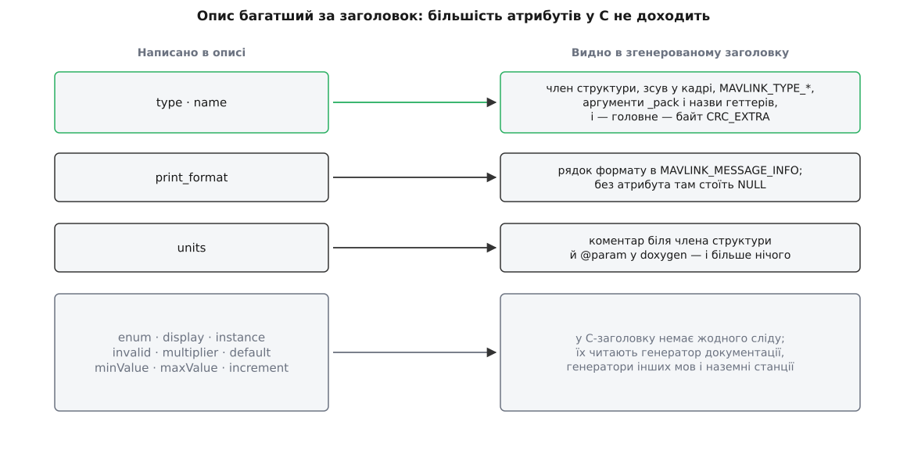

# 📋 XML-опис діалекту MAVLink і контракт, що з нього виходить у C

Тут два переліки: усе, що взагалі дозволено написати в XML-описі діалекту, і точна форма того, що з цього опису породжує `mavgen --lang=C` — імена функцій, порядок їхніх аргументів, константи довжин, вміст двох службових таблиць. Довідка потрібна, щоб не гадати, як називатиметься згенерована функція, звідки взялася чиясь довжина в байтах і чому половина атрибутів опису в заголовку не з'являється взагалі.

Звірено 2 серпня 2026 року з файлами `generator/mavparse.py` і `generator/mavgen_c.py` гілки `master` репозиторію `ArduPilot/pymavlink` (саме цей код запускає `mavgen`), з `mavlink_types.h` і `mavlink_get_info.h` репозиторію `mavlink/c_library_v2` та з опису схеми на `mavlink.io`. Там, де офіційна документація й код розходяться, я пишу те, що робить **код** — саме він визначає, зберетеся ви чи ні.

Наскрізний приклад скрізь один: повідомлення `PERIMETER_BEACON_STATUS` з номером 42501, шістьма базовими полями й одним полем-розширенням.

---

## Дерево опису

Кореневий елемент один; порядок дочірніх елементів у ньому фіксований.

```xml
<?xml version="1.0"?>
<mavlink>
  <include>all.xml</include>       <!-- 0..n -->
  <version>3</version>             <!-- 0..1 -->
  <dialect>0</dialect>             <!-- 0..1 -->
  <enums>
    <enum name="PERIMETER_BEACON_MODE">
      <description>Режим роботи маячка периметра.</description>
      <entry name="PERIMETER_BEACON_MODE_OFF" value="0">
        <description>Маячок вимкнено.</description>
      </entry>
    </enum>
  </enums>
  <messages>
    <message id="42501" name="PERIMETER_BEACON_STATUS">
      <description>Стан маячка периметра.</description>
      <field type="uint16_t" name="beacon_id">Номер маячка.</field>
      <extensions/>
      <field type="float" name="bearing_deg" units="deg">Курс на маячок.</field>
    </message>
  </messages>
</mavlink>
```

| Елемент | Де | Атрибути | Що робить |
|---|---|---|---|
| `<mavlink>` | корінь | — | єдиний кореневий елемент файлу |
| `<include>` | у корені | — | у тілі — ім'я іншого XML; вкладеність обмежено п'ятьма рівнями (`MAXIMUM_INCLUDE_FILE_NESTING = 5`) |
| `<version>` | у корені | — | мінорна версія діалекту; потрапляє в макрос `MAVLINK_VERSION` |
| `<dialect>` | у корені | — | номер діалекту; у C-заголовках не використовується |
| `<enums>` | у корені | — | контейнер перелічень |
| `<enum>` | в `<enums>` | `name`, `bitmask` | одне перелічення; `bitmask="true"` вимагає, щоб значення були степенями двійки |
| `<entry>` | в `<enum>` | `name`, `value` | один елемент перелічення; без `value` номер призначається автоматично |
| `<param>` | в `<entry>` перелічення `MAV_CMD` | `index` (1–7), `label`, `units`, `enum`, `default`, `minValue`, `maxValue`, `increment`, `multiplier`, `decimalPlaces`, `reserved` | опис одного з семи параметрів команди |
| `<messages>` | у корені | — | контейнер повідомлень |
| `<message>` | в `<messages>` | `id`, `name` | одне повідомлення |
| `<description>` | майже скрізь | — | текст для людини; у C стає коментарем |
| `<field>` | в `<message>` | див. нижче | одне поле |
| `<extensions/>` | в `<message>` | — | порожня мітка: усе після неї — розширення |
| `<deprecated>` | в `<message>`, `<enum>`, `<entry>` | `since` (`РРРР-ММ`), `replaced_by`, `remove_on_date` | позначка «застаріле» |
| `<superseded>` | там само | `since`, `replaced_by` | «є краща заміна, але це ще працює» |
| `<wip>` | там само | `since` | «у розробці»; повідомлення дістає атрибут `MAVLINK_WIP` у заголовку |

Про `<include>` варто знати одну механічну річ. Генератор розкриває включення пошуком **ушир**, а потім зливає таблиці включених файлів у той, що включає, — доки не лишиться жодного нерозв'язаного посилання. Тому діалект — не «набір із кількох файлів», а **один плаский простір імен**, зшитий із них. Звідси й правила перевірок: два повідомлення з одним номером або однією назвою, два однойменні поля в одному повідомленні, два елементи перелічення з однаковим ім'ям чи однаковим значенням — усе це помилка збірки, навіть якщо зіткнення сталося між різними файлами.

## Атрибути `<field>`

Це найгустіше місце опису, і саме тут найлегше витратити годину на атрибут, який нічого не робить.

| Атрибут | Обов'язковий | Значення | Приклад |
|---|---|---|---|
| `type` | так | тип поля; допустимі значення — у таблиці нижче | `uint16_t`, `float`, `char[16]` |
| `name` | так | ім'я поля; унікальне в межах повідомлення, без дужок | `range_m` |
| `units` | ні | одиниці зі словника схеми | `m`, `us`, `deg`, `%` |
| `enum` | ні | назва перелічення, значеннями якого є поле | `MAV_RESULT` |
| `display` | ні | підказка про подання; у `common.xml` трапляється в єдиній формі `display="bitmask"` | `bitmask` |
| `print_format` | ні | формат у стилі `printf` для показу значення | `0x%04x` |
| `instance` | ні | `true` означає: це поле каже, **про який саме** датчик чи батарею йдеться | `true` |
| `invalid` | ні | значення, яке позначає «даних немає»; для масивів — у квадратних дужках | `UINT16_MAX`, `NaN`, `[0]`, `[NaN:]` |
| `multiplier` | ні | множник, яким значення повертають до вихідного масштабу | `1e-7` |
| `default` | ні | значення за замовчуванням | `0` |
| `minValue` · `maxValue` · `increment` | ні | межі й крок для редакторів і перевірок | `0`, `100`, `1` |

Форми запису `invalid` для масивів різняться змістом: `[value]` — недійсний той елемент, що дорівнює `value`; `[value:]` — увесь масив недійсний, якщо таке значення має **перший** елемент; `[v1,,v3,]` — позиційний запис, де порожнє місце означає «цей елемент завжди дійсний».

А тепер головне про цю таблицю: **до C-заголовка доходять три атрибути з одинадцяти**.



*`type` і `name` формують усе — від зсуву в кадрі до відбитка опису; решта, крім `print_format`, у C-код не потрапляє.*

`type` і `name` визначають член структури, зсув поля в кадрі, константу `MAVLINK_TYPE_*` у таблиці описів, ім'я аргументу в `_pack` та ім'я геттера — і вони ж ідуть у розрахунок `CRC_EXTRA`. `print_format` стає рядком формату в таблиці описів; коли атрибута немає, генератор кладе туди `NULL`. `units` потрапляє в коментар біля члена структури й у `@param` документації — і на цьому все.

Решта — `enum`, `display`, `instance`, `invalid`, `multiplier`, `default`, `minValue`, `maxValue`, `increment` — у файлі `mavgen_c.py` не згадана жодного разу. Це не означає, що їх можна не писати: їх читає генератор документації, генератори Python, Java та решти мов, а наземні станції беруть із них підказки для інтерфейсу. Але **збірка C-коду від них не залежить**, і `CRC_EXTRA` теж — тобто виправити `units` чи додати `invalid` у вже випущеному повідомленні цілком безпечно.

## Типи полів

| Запис в XML | Байтів | Член структури | Константа в таблиці описів |
|---|---|---|---|
| `char` | 1 | `char` | `MAVLINK_TYPE_CHAR` |
| `uint8_t` | 1 | `uint8_t` | `MAVLINK_TYPE_UINT8_T` |
| `int8_t` | 1 | `int8_t` | `MAVLINK_TYPE_INT8_T` |
| `uint16_t` | 2 | `uint16_t` | `MAVLINK_TYPE_UINT16_T` |
| `int16_t` | 2 | `int16_t` | `MAVLINK_TYPE_INT16_T` |
| `uint32_t` | 4 | `uint32_t` | `MAVLINK_TYPE_UINT32_T` |
| `int32_t` | 4 | `int32_t` | `MAVLINK_TYPE_INT32_T` |
| `uint64_t` | 8 | `uint64_t` | `MAVLINK_TYPE_UINT64_T` |
| `int64_t` | 8 | `int64_t` | `MAVLINK_TYPE_INT64_T` |
| `float` | 4 | `float` | `MAVLINK_TYPE_FLOAT` |
| `double` | 8 | `double` | `MAVLINK_TYPE_DOUBLE` |
| `<тип>[N]` | N × розмір | `<тип> name[N]` | та сама константа, `array_length = N` |
| `uint8_t_mavlink_version` | 1 | `uint8_t` | `MAVLINK_TYPE_UINT8_T` |

Три уточнення до цієї таблиці.

**Масив.** Довжина в дужках — частина типу, а не імені: `char[16]`, `float[4]`. У згенерованому заголовку з'явиться додаткова константа `MAVLINK_MSG_<ПОВІДОМЛЕННЯ>_FIELD_<ПОЛЕ>_LEN`, а довжина масиву додатково домішується в `CRC_EXTRA` — тож змінити `char[16]` на `char[20]` так само несумісно, як змінити тип.

**Рядки.** Окремого типу рядка немає: рядок — це `char[N]`. Якщо текст коротший за N, його завершують нулем; якщо рівно N — завершального нуля в кадрі не буде, і читати такий масив як C-рядок не можна.

**`uint8_t_mavlink_version`.** Псевдотип, який існує заради одного поля в `HEARTBEAT`. Генератор перетворює його на звичайний `uint8_t`, але **прибирає відповідний аргумент** зі згенерованих функцій і підставляє туди номер версії діалекту як константу. Свої повідомлення на ньому будувати немає жодного сенсу.

## Межі, на яких генератор зупиниться

| Обмеження | Значення | Що станеться |
|---|---|---|
| Полів у повідомленні | ≤ 64 (`MAVLINK_MAX_FIELDS`) | помилка розбору з назвою повідомлення |
| Довжина навантаження | ≤ 255 байтів (`MAVLINK_MAX_PAYLOAD_LEN`) | генератор не спиняє, але такий кадр неможливий: довжина в заголовку — один байт |
| Номер повідомлення | 0–16777215 для MAVLink 2 | при `--wire-protocol=1.0` повідомлення з номером понад 255 просто **мовчки викидаються** з генерації |
| Невідомий `type` | — | помилка розбору `unknown type '…'` |
| Однаковий `id` або `name` | — | помилка з іменами обох файлів і номерами рядків |
| Поле `enum="…"` без такого перелічення | — | помилка **лише** з ключем `--validate` |

Найпідступніший рядок тут третій: перехід на першу версію протоколу не дає помилки на ваш чотиризначний номер, а тихо викидає повідомлення з набору — і ви отримуєте заголовок, у якому вашого повідомлення просто немає.

## Що виходить із запуску

```
python -m pymavlink.tools.mavgen --lang=C --wire-protocol=2.0 \
       --output <каталог> message_definitions/v1.0/perimeter.xml
```

| Файл | Породжується | Вміст |
|---|---|---|
| `mavlink.h` | на кожен XML | стартовий байт, вибір версії протоколу, підключення діалекту |
| `version.h` | на кожен XML | `MAVLINK_BUILD_DATE`, `MAVLINK_WIRE_PROTOCOL_VERSION`, `MAVLINK_MAX_DIALECT_PAYLOAD_SIZE` |
| `perimeter/perimeter.h` | на кожен XML | перелічення, дві службові таблиці, підключення всіх повідомлень |
| `perimeter/mavlink_msg_<name>.h` | на кожне повідомлення | структура, константи, функції |
| `perimeter/testsuite.h` | на кожен XML | автотести кодування-декодування |
| `mavlink_types.h`, `protocol.h`, `mavlink_helpers.h`, `checksum.h`, `mavlink_conversions.h`, `mavlink_get_info.h`, `mavlink_sha256.h` | копіюються як є | незмінна частина бібліотеки |

## Заголовок одного повідомлення

Для наскрізного прикладу генератор випише такі константи. Числа справжні: пораховані тим самим алгоритмом, що в `mavparse.py`, а сам алгоритм перевірено на відомих значеннях (`HEARTBEAT` дає 50, `PARAM_SET` — 168).

| Константа | Значення | Звідки |
|---|---|---|
| `MAVLINK_MSG_ID_PERIMETER_BEACON_STATUS` | `42501` | атрибут `id` |
| `MAVLINK_MSG_ID_PERIMETER_BEACON_STATUS_LEN` | `21` | сума розмірів **усіх** полів, разом із розширеннями |
| `MAVLINK_MSG_ID_PERIMETER_BEACON_STATUS_MIN_LEN` | `17` | сума розмірів полів **до** мітки `<extensions/>` |
| `MAVLINK_MSG_ID_PERIMETER_BEACON_STATUS_CRC` | `131` | відбиток опису |
| `MAVLINK_MSG_ID_42501_LEN` · `_MIN_LEN` · `_CRC` | ті самі | синоніми за номером |

Структура повторює **порядок у кадрі**, а не порядок в описі:

```c
MAVPACKED(
typedef struct __mavlink_perimeter_beacon_status_t {
    uint64_t time_usec;         // зсув 0
    float    range_m;           // зсув 8
    uint16_t beacon_id;         // зсув 12
    uint8_t  quality;           // зсув 14
    uint8_t  target_system;     // зсув 15
    uint8_t  target_component;  // зсув 16
    float    bearing_deg;       // зсув 17 — розширення
}) mavlink_perimeter_beacon_status_t;
```

Обгортка `MAVPACKED(…)` з'являється не завжди — генератор додає її, лише коли хоч одне поле лягло на зсув, не кратний своєму розміру. У прикладі це саме так: `bearing_deg` — чотирибайтове поле на зсуві 17. Причина в тому, що поля-розширення **не сортують**, тож вирівнювання, яке сортування давало для базової частини, на них не поширюється. Наслідок для компілятора описано в [пакуванні бінарного протоколу](topic:programming/wire-format-packing): пакована структура забороняє йому вставляти дірки, але й позбавляє права читати поле одним вирівняним доступом.

Тепер — контракт функцій. Він виглядає одноманітно, і одна деталь у ньому регулярно коштує години налагодження:

```c
// Скласти кадр. Аргументи полів ідуть у порядку ОПИСУ, не кадру.
uint16_t mavlink_msg_perimeter_beacon_status_pack(
        uint8_t system_id, uint8_t component_id, mavlink_message_t *msg,
        uint16_t beacon_id, float range_m, uint8_t quality, uint64_t time_usec,
        uint8_t target_system, uint8_t target_component, float bearing_deg);

// Те саме, але номер послідовності береться зі стану каналу chan.
uint16_t mavlink_msg_perimeter_beacon_status_pack_chan(
        uint8_t system_id, uint8_t component_id, uint8_t chan,
        mavlink_message_t *msg, /* ...ті самі поля... */);

// Те саме, але стан кодувальника передано явно, без глобальної таблиці каналів.
uint16_t mavlink_msg_perimeter_beacon_status_pack_status(
        uint8_t system_id, uint8_t component_id, mavlink_status_t *_status,
        mavlink_message_t *msg, /* ...ті самі поля... */);

// Три обгортки, що беруть готову структуру замість переліку полів.
uint16_t mavlink_msg_perimeter_beacon_status_encode(
        uint8_t system_id, uint8_t component_id, mavlink_message_t *msg,
        const mavlink_perimeter_beacon_status_t *st);
uint16_t mavlink_msg_perimeter_beacon_status_encode_chan(
        uint8_t system_id, uint8_t component_id, uint8_t chan,
        mavlink_message_t *msg, const mavlink_perimeter_beacon_status_t *st);
uint16_t mavlink_msg_perimeter_beacon_status_encode_status(
        uint8_t system_id, uint8_t component_id, mavlink_status_t *_status,
        mavlink_message_t *msg, const mavlink_perimeter_beacon_status_t *st);

// Розібрати кадр у структуру. Нічого не повертає — кадр уже перевірено сумою.
void mavlink_msg_perimeter_beacon_status_decode(
        const mavlink_message_t *msg, mavlink_perimeter_beacon_status_t *st);

// Геттер на кожне поле — читає просто з навантаження, без розбору цілого.
uint64_t mavlink_msg_perimeter_beacon_status_get_time_usec(const mavlink_message_t *msg);
float    mavlink_msg_perimeter_beacon_status_get_bearing_deg(const mavlink_message_t *msg);
```

Деталь, що коштує години: **аргументи полів у `_pack` ідуть у порядку опису, а члени структури — у порядку кадру**. Генератор будує список аргументів із вихідного переліку полів і лише окремо сортує їх для розкладання в байти. Тому переставити місцями `<field>` в XML — це змінити не лише `CRC_EXTRA`, а й порядок аргументів усіх викликів у вашому коді; компілятор мовчатиме там, де сусідні поля однотипні.

Ще три відмінності, які видно з підписів. Усі три `_pack` повертають **повну довжину кадру на дроті** — разом із заголовком, сумою й підписом, — а не код помилки. Родина `_send` (`_send`, `_send_struct`, `_send_buf`) з'являється лише тоді, коли зібрано з визначеним `MAVLINK_USE_CONVENIENCE_FUNCTIONS`, — у застосунках зі своїм рівнем каналів її звичайно немає. І геттер поля-масиву вибивається з ряду: він приймає вихідний буфер і повертає `uint16_t` — кількість скопійованих байтів:

```c
uint16_t mavlink_msg_param_set_get_param_id(const mavlink_message_t *msg, char *param_id);
```

## Дві таблиці рівня діалекту

У заголовку діалекту (`perimeter.h`) генератор складає два масиви. Вони роблять різні речі, і плутати їх не варто: без першого кадр не розібрати взагалі, без другого — не сказати про розібраний кадр нічого.

**`MAVLINK_MESSAGE_CRCS` — рядок на кожне повідомлення, відсортований за номером.** Кожен рядок лягає у структуру `mavlink_msg_entry_t`:

| Поле структури | Чим заповнює `mavgen` |
|---|---|
| `msgid` | атрибут `id` |
| `crc_extra` | відбиток опису: назва, типи й імена базових полів у порядку кадру |
| `min_msg_len` | довжина до мітки `<extensions/>` (у прикладі — 17) |
| `max_msg_len` | повна довжина разом із розширеннями (21) |
| `flags` | `1`, якщо є поле `target_system`; `2`, якщо є `target_component`; сума — якщо обидва (у прикладі — 3) |
| `target_system_ofs` | зсув поля `target_system` у кадрі (15) |
| `target_component_ofs` | зсув поля `target_component` у кадрі (16) |

Перше поле в структурі не випадкове: пошук у таблиці — двійковий, і він працює лише тому, що масив відсортовано за `msgid`. Прапорці й зсуви заповнюються **за іменем поля**, без жодного налаштування, і саме з них [маршрутизація за ідентифікаторами](topic:qgroundcontrol/message-routing) дізнається адресата вашого кадру, нічого не знаючи про його зміст. Виняток з правила «за іменем» рівно один: у `MANUAL_CONTROL` роль `target_system` грає поле з іменем `target`, і це вписано в генератор окремим рядком.

**`MAVLINK_MESSAGE_INFO` — описи полів.** Масив збирається лише в заголовку кореневого XML і потрапляє у збірку, тільки якщо визначено `MAVLINK_USE_MESSAGE_INFO`. Структури такі:

```c
typedef struct __mavlink_field_info {
    const char            *name;
    const char            *print_format;
    mavlink_message_type_t type;
    unsigned int           array_length;
    unsigned int           wire_offset;
    unsigned int           structure_offset;
} mavlink_field_info_t;

typedef struct __mavlink_message_info {
    uint32_t             msgid;
    const char          *name;
    unsigned             num_fields;
    mavlink_field_info_t fields[MAVLINK_MAX_FIELDS];
} mavlink_message_info_t;
```

| Поле | Чим заповнює `mavgen` |
|---|---|
| `name` | атрибут `name` поля, як текстовий рядок |
| `print_format` | атрибут `print_format` або `NULL` |
| `type` | константа `MAVLINK_TYPE_*` за типом поля |
| `array_length` | довжина масиву; `0` для скаляра |
| `wire_offset` | зсув поля в навантаженні |
| `structure_offset` | `offsetof` члена в згенерованій структурі |

Порядок полів у цьому масиві — **порядок опису**, не порядок кадру; зв'язок з кадром тримає `wire_offset`. Саме ця пара — ім'я поля плюс зсув — дає змогу показати геть незнайоме повідомлення з назвами полів, не маючи про нього жодного рядка коду.

Третій масив, `MAVLINK_MESSAGE_NAMES`, — пари «назва → номер», відсортовані за назвою; він потрібен лише для пошуку за іменем. Разом ці масиви обслуговують три функції пошуку:

```c
const mavlink_msg_entry_t     *mavlink_get_msg_entry(uint32_t msgid);
const mavlink_message_info_t  *mavlink_get_message_info_by_id(uint32_t msgid);
const mavlink_message_info_t  *mavlink_get_message_info_by_name(const char *name);
```

Перша працює завжди — без неї не перевірити контрольну суму. Друга й третя існують лише за `MAVLINK_USE_MESSAGE_INFO`; наявність цієї здатності можна перевірити макросом `MAVLINK_HAVE_GET_MESSAGE_INFO`.

## Мінімальний робочий виклик

Складання й розбирання того самого повідомлення, без жодної інфраструктури:

```c
#include <mavlink.h>

/* Скласти кадр у буфер. Повертає кількість записаних байтів. */
uint16_t build(uint8_t *buf, uint8_t chan)
{
    mavlink_message_t msg = {0};
    mavlink_msg_perimeter_beacon_status_pack_chan(
        255, MAV_COMP_ID_MISSIONPLANNER, chan, &msg,
        7,            /* beacon_id        — порядок ОПИСУ */
        12.5f,        /* range_m                          */
        88,           /* quality                          */
        1712345678ULL,/* time_usec                        */
        1, 1,         /* target_system, target_component  */
        137.0f);      /* bearing_deg — розширення         */
    return mavlink_msg_to_send_buffer(buf, &msg);
}

/* Розібрати вже прийнятий кадр. */
void consume(const mavlink_message_t *msg)
{
    if (msg->msgid != MAVLINK_MSG_ID_PERIMETER_BEACON_STATUS) {
        return;
    }
    mavlink_perimeter_beacon_status_t st = {0};
    mavlink_msg_perimeter_beacon_status_decode(msg, &st);
    /* st.bearing_deg == 0.0f, якщо відправник зібраний без цього розширення */
}
```

Коментар у другій функції — про єдину пастку цього контракту. `_decode` спершу **забиває всю структуру нулями** й лише потім копіює стільки байтів, скільки їх у кадрі насправді прийшло. Тож поле-розширення, якого в кадрі не було, читається як нуль — рівно так само, як читався б надісланий нуль. Відрізнити ці два випадки з коду неможливо, і саме тому нуль у полі-розширенні мусить означати те саме, що й відсутність поля.

Перевірити результат найдешевше не кодом, а очима: якщо номер, довжина й `CRC_EXTRA` у вашому заголовку збіглися з тими, що в заголовку другого боку, кадр пройде. Якщо ні — [контрольна сума](topic:communications/crc) перетворить розбіжність на мовчазну втрату, і жодного повідомлення про причину ви не отримаєте.
