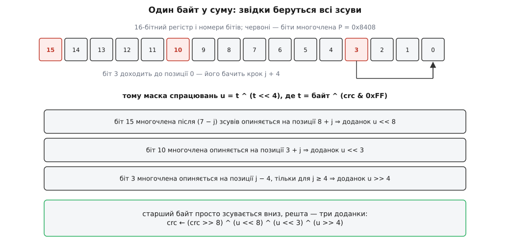
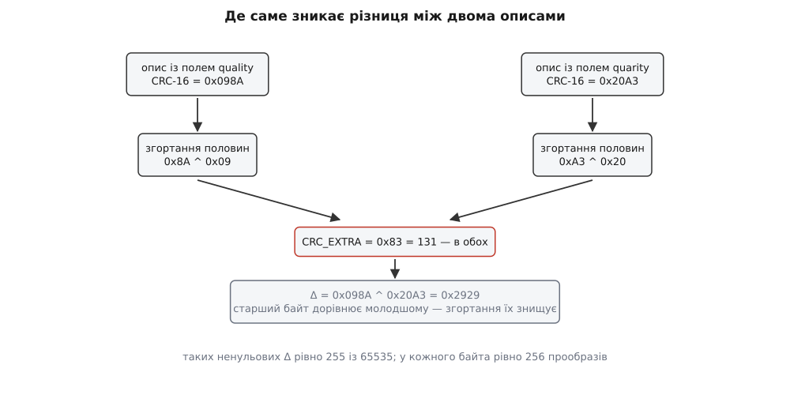

# 🧮 Байт CRC_EXTRA: рахуємо число і міряємо межу, яку воно ставить

Відбиток опису повідомлення MAVLink — одне число від 0 до 255, і тут воно доведене до кінця: від рядка символів, який іде в суму, до тієї межі виявлення, яку ставить сама ширина у вісім біт. Наприкінці з'ясується, що межа не однакова для всіх правок опису: половину змін відбиток ловить із гарантією, а решту стереже вдвічі гірше, ніж обіцяє звичне «одна збіжність із двохсот п'ятдесяти шести».

Метод перевірено на відомих числах: для `HEARTBEAT` він дає 50, для `ATTITUDE` — 39, для `GLOBAL_POSITION_INT` — 104. Це рівно ті значення, що стоять у згенерованих заголовках MAVLink.

## Рядок, який іде в суму

Візьмімо повідомлення з шістьма полями до мітки `<extensions/>`:

```
PERIMETER_BEACON_STATUS
    uint64_t  time_usec
    float     range_m
    uint16_t  beacon_id
    uint8_t   quality
    uint8_t   target_system
    uint8_t   target_component
```

Поля виписано в кадровому порядку — за спаданням розміру типу, як їх переставляє генератор, — і саме в цьому порядку їх обходить сума.

Обхід простий: спершу назва повідомлення, потім для кожного поля назва типу й ім'я поля, кожен шматок із пробілом у хвості. Виходить один рядок ASCII:

```
PERIMETER_BEACON_STATUS uint64_t time_usec float range_m uint16_t beacon_id uint8_t quality uint8_t target_system uint8_t target_component 
```

139 байтів разом із кінцевим пробілом. Більше не входить нічого — ні текст опису, ні одиниці, ні перелічення, ні навіть номер повідомлення. Виняток єдиний: якщо поле — масив, після його імені додається ще один байт, довжина масиву.

## Крок суми: звідки беруться зсуви

Сума тут — CRC-16/MCRF4XX: многочлен x¹⁶+x¹²+x⁵+1, початкове значення 0xFFFF, біти подаються молодшим уперед, результат не інвертується. Такий самий алгоритм захищає й сам кадр. [Циклічна надлишкова сума](topic:communications/crc) розглядає дані як довгий двійковий многочлен, ділить його на многочлен-твірник і лишає в регістрі остачу; від вибору твірника залежить, які саме спотворення вона ловить із гарантією, а які може пропустити. У «шкільному» вигляді, біт за бітом, крок на один байт виглядає так:

```c
crc ^= b;
for (int i = 0; i < 8; i++)
    crc = (crc & 1) ? ((crc >> 1) ^ 0x8408) : (crc >> 1);
```

0x8408 — це той самий многочлен, записаний навпаки: біти 15, 10 і 3 замість 12, 5 і 0. Обернений запис потрібен тому, що регістр зсувається праворуч.

Бібліотека MAVLink рахує те саме без циклу, і в її трьох рядках усі константи виглядають магічними:

```c
tmp = data ^ (uint8_t)(*crcAccum & 0xff);
tmp ^= (tmp << 4);
*crcAccum = (*crcAccum >> 8) ^ (tmp << 8) ^ (tmp << 3) ^ (tmp >> 4);
```

Магії там немає — є вісім кроків циклу, згорнутих у арифметику, і кожна константа має своє походження.

Почнімо з того, що зсув праворуч не перемішує байти: за вісім кроків старший байт регістра просто з'їжджає на місце молодшого. Тому в результаті обов'язково буде доданок `crc >> 8`, а все інше — це слід, який лишив многочлен.

Многочлен домішується лише на тих кроках, де молодший біт регістра був одиницею. Позначмо `u` маску таких кроків: біт j дорівнює одиниці, якщо на кроці j спрацював зворотний зв'язок. Молодші вісім біт регістра на початку — це `t = data ^ (crc & 0xFF)`; якби зворотного зв'язку не було, маска дорівнювала б просто `t`. Але зв'язок є: із трьох бітів многочлена — 15, 10 і 3 — у молодший байт потрапляє тільки біт 3, і три наступні зсуви зносять його в позицію 0. Тобто спрацювання на кроці j повертається в молодший біт на кроці j+4.

Звідси `u_j = t_j ⊕ u_{j−4}`. Кроків усього вісім, тож друге покоління не встигає з'явитися: `u_{j−4}` дорівнює `t_{j−4}` для j ≥ 4 і нулю для j < 4. Це і є `u = t ^ (t << 4)`, обрізане до восьми біт.

Лишилось порахувати, що кожне спрацювання лишає в регістрі наприкінці. Многочлен, доданий на кроці j, зазнає ще (7 − j) зсувів, тож його біти 15, 10 і 3 опиняються на позиціях 8+j, 3+j і j−4 — останній лише за j ≥ 4, інакше він уже вийшов за край регістра. Просумувавши по всіх j, де `u_j` дорівнює одиниці, дістаємо рівно три доданки:

```
crc ← (crc >> 8) ^ (u << 8) ^ (u << 3) ^ (u >> 4)

u = (t ^ (t << 4)) & 0xFF,   t = байт ^ (crc & 0xFF)
```

Прямий перебір підтверджує: обидві форми дають те саме для всіх 65536 станів регістра й усіх 256 значень байта.



*Кожна константа в трирядковій формулі — це позиція біта многочлена після решти зсувів.*

Перший байт нашого рядка — `'P'` = 0x50, регістр іще 0xFFFF:

```
t   = 0x50 ^ 0xFF                       = 0xAF
u   = (0xAF ^ (0xAF << 4)) & 0xFF       = 0xAF ^ 0xF0 = 0x5F
crc = 0x00FF ^ 0x5F00 ^ 0x02F8 ^ 0x0005 = 0x5D02
```

Тут `0x5F << 3` дало 0x02F8, а `0x5F >> 4` — 0x0005.

## Число

Далі те саме ще 138 разів. Ось стан регістра після кожного шматка рядка:

| шматок рядка | crc |
|---|---|
| `PERIMETER_BEACON_STATUS ` | 0x1D2C |
| `uint64_t ` | 0xECBB |
| `time_usec ` | 0xB66C |
| `float ` | 0x58BB |
| `range_m ` | 0x70A7 |
| `uint16_t ` | 0xE1D7 |
| `beacon_id ` | 0x4275 |
| `uint8_t ` | 0x4559 |
| `quality ` | 0x9DFF |
| `uint8_t ` | 0x454E |
| `target_system ` | 0xA86D |
| `uint8_t ` | 0xF852 |
| `target_component ` | 0x098A |

Шістнадцять біт треба звести до восьми, і робиться це складанням половин за модулем два:

```
CRC-16    = 0x098A
CRC_EXTRA = (0x098A & 0xFF) ^ (0x098A >> 8) = 0x8A ^ 0x09 = 0x83 = 131
```

Саме це число має стояти в згенерованому заголовку як `MAVLINK_MSG_ID_PERIMETER_BEACON_STATUS_CRC`.

> 🔧 **Навіщо це.** Байт можна порахувати, нічого не збираючи, — усе обчислення поміщається в дванадцять рядків. Якщо прошивка вже літає, а станція ще ні, це найдешевший спосіб дізнатися наперед, чи зійдуться словники: обчислене число має збігтися з константою `..._CRC` у заголовку, з яким зібрано прошивку. Не збіглося — значить, описи розійшлися, і жоден код у застосунку цього не виправить.

```python
def crc_extra(name, fields):          # fields: [(тип, ім'я)] у кадровому порядку
    crc = 0xFFFF
    for chunk in [name] + [x for t, n in fields for x in (t, n)]:
        for b in (chunk + ' ').encode():
            t = b ^ (crc & 0xFF)
            u = (t ^ (t << 4)) & 0xFF
            crc = ((crc >> 8) ^ (u << 8) ^ (u << 3) ^ (u >> 4)) & 0xFFFF
    return (crc & 0xFF) ^ (crc >> 8)
```

## Що робить із цим числом одна правка опису

Перейменуємо поле чесно, як робиться при зміні одиниць: `range_m` → `range_cm`. CRC-16 стає 0x414A, байт — 11. Число інше, тож дві збірки більше не порозуміються: сума кадру не зійдеться, кадри зникатимуть. Це саме те, чого від відбитка чекають.

А тепер перейменуємо поле випадково — так, як зіскакують пальці: `quality` → `quarity`. CRC-16 стає 0x20A3, теж інший. Але байт:

```
0xA3 ^ 0x20 = 0x83 = 131
```

Той самий. Дві збірки з різними описами обміняються кадрами так, наче описи однакові.



*Різниця сум 0x2929 має однакові половини — рівно те, що згортання знищує.*

Перейменування саме собою нешкідливе: байти в кадрі лишаються на місцях, змінюється тільки підпис. Тому візьмімо правку з зубами — переставмо в описі місцями `quality` і `target_system`, два однобайтові поля. У кадрі вони теж поміняються місцями: сортування за розміром їх не чіпає, бо розмір однаковий, а між собою поля однакового розміру лишаються в порядку опису. Байти 14 і 15 навантаження помінялися ролями. CRC-16 нової збірки — 0x77F4, а байт:

```
0xF4 ^ 0x77 = 0x83 = 131
```

Знову 131. Стара збірка прийме кадр нової як цілий і покаже оператору ідентифікатор системи замість відсотка якости — «правдоподібно, але хибно розкладені числа», рівно те, від чого відбиток і мав захистити.

## Скільки коштує згортання

Це не смуга невдач — це ціна згортання, і її можна порахувати точно.

Почнімо з того, що згортання `v ↦ (v & 0xFF) ^ (v >> 8)` рівномірне. Для будь-якого байта b прообразів рівно 256: беремо будь-який старший байт h, і молодший визначається однозначно як `h ^ b`. Тобто 65536 значень CRC-16 лягають на 256 байтів рівно по 256 на кожен, без перекосів.

Тепер поставмо питання так, як воно стоїть насправді. Два різні описи того самого повідомлення дають суми s і s′; байти збігаються тоді й лише тоді, коли

```
(s & 0xFF) ^ (s >> 8) = (s′ & 0xFF) ^ (s′ >> 8)
```

Позначмо Δ = s ^ s′ і розкриємо дужки за модулем два: рівність зводиться до `Δ >> 8 = Δ & 0xFF`. Різниця зникає рівно тоді, коли **старший байт різниці дорівнює молодшому**. У прикладі з перейменуванням Δ = 0x098A ^ 0x20A3 = 0x2929; у прикладі з перестановкою — 0x098A ^ 0x77F4 = 0x7E7E. Обидві половини однакові в обох.

Таких Δ рівно 256, по одній на кожне значення половини, і одна з них нульова — це збіг уже самих шістнадцятибітних сум. Отже, з 65535 ненульових різниць невидимі для байта 255:

```
255 / 65535 = 1 / 257        (65535 = 255 · 257, рівність точна)
```

Звична оцінка «одна збіжність із двохсот п'ятдесяти шести» — це та сама величина, тільки без умови «CRC-16 таки змінився». Емпірично: 200 000 випадкових перейменувань одного поля дали 773 збіги байта, тобто 1/258.7.

## Одну гарантію згортання не ламає

Але 1/257 — це середнє по двох дуже різних режимах, і різниця між ними більша за саму цифру.

Шістнадцятибітний CRC-16/MCRF4XX — не хеш, а код із доведеними властивостями. Для повідомлень до 32751 біт він ловить будь-яку зміну в один, два чи три біти — це [відстань Геммінга](topic:communications/hamming-distance) 4, мінімальна кількість змінених біт, за якої дві різні порції даних можуть дати однакову суму, — і будь-яку [пакетну помилку](topic:communications/burst-error) завдовжки до 16 біт. Після згортання до байта від цих гарантій, здається, не лишається нічого: 256 різних шістнадцятибітних сум дають один і той самий байт.

Одна гарантія все ж переживає згортання, і не випадково. Многочлен x¹⁶+x¹²+x⁵+1 має чотири члени — парну кількість, — а це те саме, що сказати: він ділиться на (x+1). Далі все робить підстановка одиниці. Різниця сум Δ — це остача від ділення похибки на твірник, тобто рівність

```
Δ(x) = e(x)·x¹⁶ + q(x)·P(x)
```

де e — «виключне або» двох рядків. [Над двійковим полем](topic:math/finite-fields), де додавання є «виключним або», а множення — звичайним множенням многочленів за модулем два, підстановка x = 1 знищує весь доданок із P, бо P(1) = 0. Лишається Δ(1) = e(1). А підставити одиницю в двійковий многочлен — це те саме, що порахувати парність кількости його одиниць. Отже, **парність кількости одиниць у Δ завжди дорівнює парності кількости змінених біт.**

Тепер зіставмо це з умовою невидимости. Δ невидима, коли її половини однакові, тобто Δ = (v << 8) | v. У такого числа одиниць рівно вдвічі більше, ніж у v, — завжди парна кількість.

Звідси теорема, яку легко перевірити пальцем: **якщо два описи мають однакову довжину й відрізняються непарною кількістю біт, байти CRC_EXTRA у них різні. Завжди.** Зокрема, будь-яка зміна одного біта в описі помітна гарантовано. Умова однакової довжини потрібна тому, що лише для рядків рівної довжини початкове 0xFFFF скорочується у різниці й «похибку» взагалі можна означити як `A ⊕ B`. Прямий перебір підтверджує: усі 1112 однобітових змін нашого рядка дають інший байт, жодного збігу.

Коли ж змінених біт парне число, стає гірше, ніж обіцяє 1/257. Невидимі Δ — усі парної ваги, а ненульових Δ парної ваги всього 32767, тож імовірність збігу серед них удвічі вища:

```
255 / 32767 = 1 / 128.5
```

Перевірка: 150 тисяч однодовжинних змін парної ваги дали 1177 збігів байта — 1/127.4; стільки ж змін непарної ваги не дали жодного збігу.

Ось чому обидва наші приклади й сховалися. Літери `l` і `r` відрізняються на `0x6C ^ 0x72 = 0x1E` — чотири одиниці, парна вага. Перестановка двох полів не змінює набору байтів у рядку, тож кількість одиниць у ньому та сама, а різниця двох рядків з однаковою парністю одиниць завжди парної ваги. Обидві правки потрапили в гірший режим. А літери, що відрізняються непарним числом біт — скажімо, `a` і `c`, у яких `0x61 ^ 0x63 = 0x02`, — ловляться завжди.

Коли описи різної довжини (додали поле, замінили `uint16_t` на `uint32_t`), похибку означити не можна, парність нічого не гарантує, і лишається груба оцінка 1/256.

## Що з цієї межі випливає

Спершу — де межа НЕ проходить, бо це звужує задачу.

Байт відбитка не летить у ефір: кожен бік домішує свою копію в контрольну суму кадру останнім байтом, після навантаження. Крок суми оборотний щодо байта: із того самого стану регістра два різні байти неодмінно дадуть різні стани. Це видно з формули — відображення `t ↦ u` бієктивне, а вираз `(u << 8) ^ (u << 3) ^ (u >> 4)` дорівнює нулю тільки за u = 0: у позицію 15 біт може прийти лише з доданка `u << 8`, тож біт 7 в u мусить бути нульовим, далі те саме для біта 6 і так до кінця. Отже, **різні байти відбитка завжди дають різну суму кадру**. Не буває так, що байти розійшлися, а кадр усе одно прийняли. Уся ймовірність зосереджена в одному місці: два різні описи згорнулися в одне число.

Далі — де ця ймовірність НЕ спрацьовує, попри спокусу. У діалекті `all` понад тисячу повідомлень, а значень байта всього 256, тож збігів там повно й без будь-яких парадоксів. Але ці збіги нешкідливі: байт беруть із таблиці за номером повідомлення, і байт `HEARTBEAT` ніколи не звіряють із байтом `ATTITUDE`. Порівнюються завжди дві версії ОДНОГО номера, тому [парадокс днів народжень](topic:math/birthday-paradox) — оцінка, за якою в групі досить швидко знаходяться двоє з однією датою, — тут не застосовний: ймовірність лишається попарною, 1/257, і не росте з розміром словника.

Тепер — де 1/257 таки стріляє. Випадків два.

Перший: ви змінили опис свого повідомлення, другий бік лишився зі старою збіркою, і байт випадково не змінився. Якщо зміна була тільки в іменах, наслідків майже немає; якщо в типах, порядку чи складі полів — оператору показують число, розкладене не з тих байтів. Другого рубежу тут чекати не варто: перевірка довжини навантаження проти таблиці в бібліотеці є, але вона під умовною компіляцією (`MAVLINK_CHECK_MESSAGE_LENGTH`) і типово вимкнена, а друга версія протоколу ще й обрізає нульовий хвіст, тож довжина й так плаває.

Другий: ви взяли номер повідомлення, уже зайнятий чужим повідомленням у чужому діалекті. Тоді два різні описи живуть під одним номером за побудовою, і 1/257 — це ймовірність, що чужий кадр буде прийнято й розкладено як свій.

І накопичення. Порахована ймовірність стосується однієї правки. Якщо за життя проєкту ви зробите k несумісних змін опису, шанс, що хоч одна пройде непоміченою:

```
1 − (256/257)^k

k =  10  →   3.8 %
k =  50  →  17.7 %
k = 100  →  32.3 %
```

Це не привід боятися — це причина не вимагати від відбитка більше, ніж він тримає. Вісім біт узялися не з міркувань стійкости: у записі таблиці описів під нього відведено рівно один `uint8_t`, а в ефір він не йде взагалі, тож коштує нуль байтів на кадр і один байт на повідомлення в пам'яті. За такою ціною CRC_EXTRA робить рівно одну річ, зате робить її добре: перетворює типову розбіжність описів на гучну відмову, а не на тихо перебрехані числа. Гарантії, що розбіжність буде помічена, він не дає й дати не може — це видно з арифметики. Тому єдине, що справді тримає узгодженість, лежить поза протоколом: один опис, одна закріплена версія, одна перегенерація для всіх, хто цей кадр читає.
