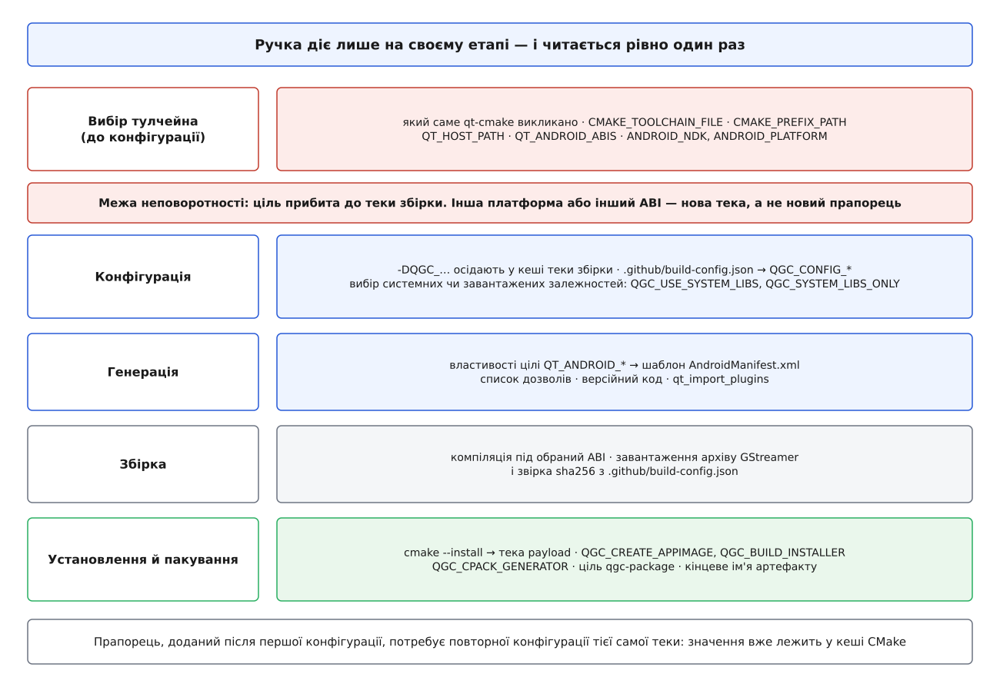

# 🎛️ Ручки платформної збірки QGroundControl

Це перелік усього, чим керують збіркою QGroundControl під конкретну платформу: якою командою запускають конфігурацію під кожну ціль, які опції `-DQGC_…` існують і що вмикають, які змінні керують Android-пакетом, що лежить у `.github/build-config.json` і як воно потрапляє в CMake, які цілі пакування дають які файли, і чим ставлять системні залежності. Довідка потрібна тому, що назви тут не вгадуються з логіки: `QGC_ENABLE_…` і `QGC_DISABLE_…` живуть поруч, частина ручок звуться `QT_ANDROID_…` і належать Qt, а не проєктові, і половина з них узагалі не прапорці, а вибір теки, з якої запущено `qt-cmake`.

**Числа належать конкретній гілці.** Усе нижче звірено з `master` станом на серпень 2026 року (Qt 6.11.1, Android SDK 36, NDK r27c, GStreamer 1.28.4). У стабільній лінії 5.x закріплено інші числа, і питати «яка версія Qt потрібна» без назви гілки безглуздо. **Механізм** — імена опцій, порядок читання, спосіб пакування — змінюється значно повільніше за числа; саме він тут і описаний. Ключі версій завжди перевіряйте у `.github/build-config.json` тієї гілки, з якої збираєте.

## Порядок: коли яка ручка діє

Ручки читаються на різних етапах, і етап визначає, чи можна ще передумати.



*Ціль платформи вибирають один раз — командою, що створює теку збірки; решта ручок осідає в кеші CMake цієї теки.*

Практичний наслідок один: `-DQGC_ENABLE_GST_VIDEOSTREAMING=OFF`, доданий до вже сконфігурованої теки, спрацює після повторної конфігурації, а от переїзд із Linux на Android у тій самій теці не спрацює ніколи — потрібна нова. Механіка кешу описана окремо: [кеш і опції CMake](book:build-systems/cache-and-options).

## Мінімальний робочий виклик

**Linux, рідна збірка.**

```bash
~/Qt/6.11.1/gcc_64/bin/qt-cmake -B build -G Ninja -DCMAKE_BUILD_TYPE=Debug
cmake --build build --config Debug
./build/Debug/QGroundControl
```

**Windows.** Виконувати з «x64 Native Tools Command Prompt for VS 2022» — інакше `cl.exe` не в шляху.

```bat
C:\Qt\6.11.1\msvc2022_64\bin\qt-cmake.bat -B build -G Ninja -DCMAKE_BUILD_TYPE=Debug
cmake --build build --config Debug
build\Debug\QGroundControl.exe
```

**Android.** Тут `qt-cmake` із теки цільового Qt теж працює, але сценарій неперервної інтеграції вказує тулчейн прямо — так видно всі чотири обов'язкові речі одразу:

```bash
cmake -S . -B build -G Ninja \
  -DCMAKE_TOOLCHAIN_FILE="$QT_TARGET_ROOT/lib/cmake/Qt6/qt.toolchain.cmake" \
  -DCMAKE_PREFIX_PATH="$QT_TARGET_ROOT" \
  -DQT_HOST_PATH="$QT_HOST_ROOT" \
  -DQT_ANDROID_ABIS="arm64-v8a;armeabi-v7a" \
  -DQT_ANDROID_SIGN_APK=ON \
  -DCMAKE_BUILD_TYPE=Release
cmake --build build
# готові пакети — у build/android-build/
```

Що з цього обов'язкове на кожній платформі:

| Ручка | Linux | Windows | Android |
|---|---|---|---|
| тека, з якої беруть `qt-cmake` | `gcc_64` | `msvc2022_64` | `android_arm64_v8a`, `android_armv7`, `android_x86_64`, `android_x86` |
| `CMAKE_TOOLCHAIN_FILE` | вже всередині `qt-cmake` | вже всередині `qt-cmake` | те саме, або вказують явно |
| `QT_HOST_PATH` | не потрібен | не потрібен | **обов'язковий** — інструменти Qt, що працюють на хості |
| `QT_ANDROID_ABIS` | — | — | список ABI через `;`; порожній = один ABI цього Qt |
| `ANDROID_NDK`, `ANDROID_PLATFORM` | — | — | з оточення або з пресета |
| генератор | `Ninja` | `Ninja` або `Ninja Multi-Config` | `Ninja` |

> 🔧 **Навіщо це.** `QT_HOST_PATH` — найчастіша причина падіння першої Android-збірки. Qt має інструменти, які **виконуються під час збірки**: `moc`, `rcc`, компілятор QML. Вони мусять працювати на машині розробника, тобто на x86-64, а цільовий Qt зібраний під ARM і не запуститься. Без цієї змінної CMake шукає `moc` серед цільових двійників і зупиняється на першій же спробі його викликати. Загальна механіка розділення хоста й цілі — у [файлі тулчейна](book:build-systems/cmake-toolchain-file).

## Пресети замість довгих командних рядків

У корені лежить **`CMakePresets.json.template`** — не `CMakePresets.json`. Файл треба скопіювати під робочим іменем; він нічого не містить, крім переліку справжніх пресетів:

```json
{
  "version": 5,
  "cmakeMinimumRequired": { "major": 3, "minor": 25, "patch": 0 },
  "include": [
    "cmake/presets/common.json",
    "cmake/presets/Android.json",
    "cmake/presets/iOS.json",
    "cmake/presets/Linux.json",
    "cmake/presets/macOS.json",
    "cmake/presets/Windows.json"
  ]
}
```

Розділення на шаблон і робочий файл навмисне: `CMakePresets.json` у корені — той файл, куди розробник дописує **свої** пресети, тож у репозиторії його немає, щоб локальні зміни не конфліктували з апстримом.

```bash
cp CMakePresets.json.template CMakePresets.json
cmake --list-presets
cmake --preset Linux-debug
cmake --build --preset Linux-debug
cmake --workflow --preset Linux        # конфігурація + збірка + тести + пакет
```

| Пресет конфігурації | Тека збірки | Що задає понад базове |
|---|---|---|
| `Linux`, `Linux-debug` | `../build/Linux[-debug]` | тулчейн із `$QT_ROOT_DIR`, `ccache` |
| `Linux-coverage` | `../build/Linux-coverage` | `QGC_ENABLE_COVERAGE=ON` |
| `Linux-arm64[-debug]` | `../build/Linux-arm64[-debug]` | `QT_HOST_PATH` з оточення |
| `Linux-deb`, `Linux-rpm` | `../build/Linux-deb`, `…-rpm` | `QGC_CPACK_GENERATOR=DEB` / `RPM` |
| `Windows` | `../build/Windows` | `Ninja Multi-Config`, `sccache`, конфігурації `Release;Debug` |
| `Windows-arm64` | `../build/Windows-arm64` | те саме + `QT_HOST_PATH` |
| `Android`, `Android-debug` | `../build/Android[-debug]` | `ANDROID_ABI=arm64-v8a`, `ANDROID_NDK`, `ANDROID_PLATFORM`, `QT_HOST_PATH` |
| `default`, `default-release` | `./build` | без прив'язки до платформи |

Приховані пресети (`debug`, `release`, `coverage`, `ccache`, `sccache`) самі не викликаються — від них успадковують. `debug` вмикає `QGC_BUILD_TESTING=ON` і `QGC_DEBUG_QML=ON`, `release` — вимикає обидва. Ширше про сам механізм — [пресети CMake](book:build-systems/cmake-presets).

## Опції `-DQGC_…`

Оголошені у `cmake/CustomOptions.cmake`. Значення в дужках — типове.

**Що збирати.**

| Опція | Типово | Дія |
|---|---|---|
| `QGC_STABLE_BUILD` | `OFF` | збірка стабільного релізу; вимикає функції денної збірки |
| `QGC_BUILD_INSTALLER` | `ON` | збирати інсталятор або пакет платформи |
| `QGC_BUILD_TESTING` | Debug `ON`, Release `OFF` | компілювати тести |
| `QGC_DEBUG_QML` | Debug `ON`, Release `OFF` | налагоджувальний режим QML |
| `QGC_ENABLE_WERROR` | `ON` | попередження компілятора у власному коді = помилки |
| `QGC_UNITY_BUILD` | `OFF` | склеювати одиниці трансляції заради швидшої збірки |
| `QGC_USE_CACHE`, `QGC_USE_MOCCACHE` | `ON` | кешування компіляції й `moc` |
| `QGC_ENABLE_COVERAGE` | `OFF` | збирати покриття (лише Debug) |
| `QGC_ENABLE_CLANG_TIDY` | `OFF` | статичний аналіз під час збірки |

**Звідки брати залежності.**

| Опція | Типово | Дія |
|---|---|---|
| `QGC_USE_SYSTEM_LIBS` | `OFF` | спершу шукати бібліотеки в системі (`find_package`), лише потім завантажувати |
| `QGC_SYSTEM_LIBS_ONLY` | `OFF` | вимагати системні; **нічого не завантажувати** — режим для пакувальників дистрибутивів |
| `GStreamer_REQUIRE_CHECKSUM` | `ON` | звіряти `sha256` завантаженого архіву GStreamer |
| `QGC_GST_DOWNLOAD_TIMEOUT` | `1200` c | загальний тайм-аут завантаження GStreamer |
| `QGC_GST_DOWNLOAD_INACTIVITY_TIMEOUT` | `60` c | тайм-аут бездіяльності того самого завантаження |
| `QGC_LINK_PARALLEL_LEVEL` | `2` | скільки лінкувань паралельно (лінкувальник їсть пам'ять, не процесор) |

**Що вміє застосунок.** Саме ці ручки роблять збірку «вужчою» на бідній платформі.

| Опція | Типово | Дія |
|---|---|---|
| `QGC_ENABLE_GST_VIDEOSTREAMING` | `ON` | відеотракт на GStreamer; `OFF` — застосунок без відео взагалі |
| `QGC_NO_SERIAL_LINK` | `OFF` | `ON` прибирає послідовний зв'язок цілком |
| `QGC_ENABLE_BZIP2`, `QGC_ENABLE_LZ4` | `OFF` | розпакування логів відповідним алгоритмом |
| `QGC_MAVLINK_DIALECT` | `"all"` | який діалект MAVLink генерувати |
| `QGC_MAVLINK_VERSION` | `"2.0"` | версія протоколу |
| `QGC_MAVLINK_GIT_REPO`, `QGC_MAVLINK_GIT_TAG` | апстрим і закріплений коміт | звідки брати визначення повідомлень |
| `QGC_DISABLE_APM_MAVLINK` | `OFF` | не генерувати діалект ArduPilot |
| `QGC_DISABLE_APM_PLUGIN`, `QGC_DISABLE_APM_PLUGIN_FACTORY` | `OFF` | вимкнути підтримку ArduPilot у застосунку |
| `QGC_DISABLE_PX4_PLUGIN`, `QGC_DISABLE_PX4_PLUGIN_FACTORY` | `OFF` | те саме для PX4 |

Ці дві родини читаються по-різному навмисне. `QGC_ENABLE_…` описує **необов'язкову можливість**, якої може не бути на платформі; `QGC_DISABLE_…` описує **типово присутню** підтримку автопілота, яку вимикають у вендорській збірці. Тому типове значення першої родини буває і `ON`, і `OFF`, а другої — завжди `OFF`.

**Ідентичність застосунку.** Ці рядки йдуть у назву, у теку налаштувань і в ім'я пакета; на Android `QGC_PACKAGE_NAME` стає ідентифікатором у крамниці.

| Опція | Типово |
|---|---|
| `QGC_APP_NAME` | `"QGroundControl"` |
| `QGC_APP_DESCRIPTION` | `"Open Source Ground Control App"` |
| `QGC_ORG_NAME` | `"QGroundControl"` |
| `QGC_ORG_DOMAIN` | `"qgroundcontrol.com"` |
| `QGC_PACKAGE_NAME` | `"org.mavlink.qgroundcontrol"` |
| `QGC_SETTINGS_VERSION` | `"9"` |

Змінювати їх поодинці має сенс лише для перевірки; повний спосіб зробити власну збірку з іншим набором функцій і брендом — окрема тема, [власна збірка](book:qgroundcontrol/custom-build).

## Android: змінні, властивості, маніфест

Тут імена приходять із трьох джерел, і плутати їх дорого.

| Хто власник | Приклад | Коли задають |
|---|---|---|
| NDK через тулчейн | `ANDROID_ABI`, `ANDROID_NDK`, `ANDROID_PLATFORM` | у команді конфігурації або в пресеті |
| Qt | `QT_ANDROID_ABIS`, `QT_ANDROID_SIGN_APK`, `QT_ANDROID_*` як **властивості цілі** | змінні — при конфігурації, властивості виставляє `cmake/platform/Android.cmake` |
| QGroundControl | `QGC_QT_ANDROID_*`, `QGC_ANDROID_*` | опції кешу з типовим значенням із `build-config.json` |

Ланцюжок від JSON до маніфесту виглядає так:

| Опція QGC | Типове значення (звідки) | Стає властивістю цілі | Куди потрапляє |
|---|---|---|---|
| `QGC_QT_ANDROID_MIN_SDK_VERSION` | `QGC_CONFIG_ANDROID_MIN_SDK` = `28` | `QT_ANDROID_MIN_SDK_VERSION` | `minSdkVersion` у маніфесті |
| `QGC_QT_ANDROID_TARGET_SDK_VERSION` | `QGC_CONFIG_ANDROID_PLATFORM` = `36` | `QT_ANDROID_TARGET_SDK_VERSION` | `targetSdkVersion` |
| `QGC_QT_ANDROID_COMPILE_SDK_VERSION` | `QGC_CONFIG_ANDROID_PLATFORM` = `36` | `QT_ANDROID_COMPILE_SDK_VERSION` | версія SDK, якою компілюють Java |
| `QGC_ANDROID_PACKAGE_NAME` | з `QGC_PACKAGE_NAME` | `QT_ANDROID_PACKAGE_NAME` | `package=` у маніфесті |
| `QGC_ANDROID_PACKAGE_SOURCE_DIR` | `${CMAKE_SOURCE_DIR}/android` | `QT_ANDROID_PACKAGE_SOURCE_DIR` | тека з шаблоном маніфесту, ресурсами й Java-кодом |
| — (обчислюється) | `BBMIPPDDD` за версією й ABI | `QT_ANDROID_VERSION_CODE` | `android:versionCode` |
| — (обчислюється) | рядок версії проєкту | `QT_ANDROID_VERSION_NAME` | `android:versionName` |
| — | `QGC_APP_NAME` | `QT_ANDROID_APP_NAME`, `QT_ANDROID_APP_ICON` | назва й піктограма на екрані |

Окремо — ручки підпису й розкладки збірки:

| Змінна | Типово | Дія |
|---|---|---|
| `QT_ANDROID_ABIS` | ABI цього Qt | список ABI через `;`; кожен дає окремий пакет |
| `QT_ANDROID_SIGN_APK` | `OFF` | підписувати `.apk` |
| `QT_ANDROID_SIGN_AAB` | `OFF` | підписувати `.aab` для крамниці |
| `QT_ANDROID_DEPLOYMENT_TYPE` | `""` | режим розгортання Qt (`Release` вимикає налагоджувальні дозволи) |
| `QT_USE_TARGET_ANDROID_BUILD_DIR` | `OFF` | окрема тека `android-build` під кожну ціль |

Розкладка версійного коду `BBMIPPDDD` — двозначна ознака розрядності (`66` для `arm64-v8a` і `x86_64`, `34` для `armeabi-v7a` і `x86`), далі старший і молодший номери версії по одному розряду, латка на двох і номер збірки на трьох:

```
версія 5.0.3, 7 комітів після тега

arm64-v8a:    BB=66  M=5  I=0  PP=03  DDD=007  →  665003007
armeabi-v7a:  BB=34  M=5  I=0  PP=03  DDD=007  →  345003007

тегований реліз: DDD=000        денна збірка: DDD = коміти після тега, стеля 999
```

Поле `DDD` — саме те, що робить кожну денну збірку «новішою» за попередню без правки номера версії; зв'язок цієї схеми з каналами постачання — у [моделі релізів](book:qgroundcontrol/release-model). Дозволи Android формує той самий `cmake/platform/Android.cmake`: Bluetooth (`SCAN`, `CONNECT`), мережа (`INTERNET`, `ACCESS_NETWORK_STATE`, `CHANGE_WIFI_MULTICAST_STATE`), сховище (`READ_EXTERNAL_STORAGE`, `WRITE_EXTERNAL_STORAGE`, `MANAGE_EXTERNAL_STORAGE`), розташування (`ACCESS_FINE_LOCATION`, `ACCESS_COARSE_LOCATION`), `VIBRATE`, `WAKE_LOCK`. Дописаний руками в `AndroidManifest.xml` дозвіл зникне з наступною генерацією — правити треба список у CMake.

## `.github/build-config.json` → `QGC_CONFIG_*`

Один JSON у корені тримає всі закріплені версії. `cmake/BuildConfig.cmake` читає його вбудованим розбирачем і розкладає по змінних:

| Ключ JSON | Змінна CMake | Значення на `master` |
|---|---|---|
| `qt.version` | `QGC_CONFIG_QT_VERSION` | `6.11.1` |
| `qt.minimum_version` | `QGC_CONFIG_QT_MINIMUM_VERSION` | `6.11.0` |
| `qt.modules` | — (читає сценарій установлення Qt) | перелік модулів Qt |
| `android.platform` | `QGC_CONFIG_ANDROID_PLATFORM` | `36` |
| `android.min_sdk` | `QGC_CONFIG_ANDROID_MIN_SDK` | `28` |
| `android.ndk_version` | `QGC_CONFIG_NDK_VERSION` | `r27c` |
| `android.ndk_full_version` | `QGC_CONFIG_NDK_FULL_VERSION` | `27.2.12479018` |
| `android.java_version` | `QGC_CONFIG_JAVA_VERSION` | `21` |
| `android.build_tools`, `android.cmdline_tools` | — (неперервна інтеграція) | `36.0.0`, `14742923` |
| `apple.macos_deployment_target` | `QGC_CONFIG_MACOS_DEPLOYMENT_TARGET` | `13.0` |
| `apple.ios_deployment_target` | `QGC_CONFIG_IOS_DEPLOYMENT_TARGET` | `17.0` |
| `build.cmake_minimum_version` | `QGC_CONFIG_CMAKE_MINIMUM` | `3.25` |
| `build.platform_workflows` | — | `Linux,Windows,MacOS,Android` |
| `gstreamer.version.default` | `QGC_CONFIG_GSTREAMER_VERSION` | `1.28.4` |
| `gstreamer.version.minimum` | `QGC_CONFIG_GSTREAMER_MIN_VERSION` | `1.20.0` |
| `gstreamer.version.android` | `QGC_CONFIG_GSTREAMER_ANDROID_VERSION` | `1.28.4` |
| `gstreamer.version.windows/macos/ios` | `QGC_CONFIG_GSTREAMER_WIN_VERSION` та ін. | `1.28.4` |
| `gstreamer.plugins.*` | — (сценарій збірки GStreamer) | списки плагінів на платформу |
| `gstreamer.checksums.<версія>.<платформа>` | — (звірка після завантаження) | `sha256` архіву |

Файл описаний власною схемою `build-config.schema.json` поруч — тож помилка в ключі ловиться редактором, а не за півгодини збірки. Про сам підхід «одне число, прочитане звідусіль» — [закріплення версій](book:build-systems/version-pinning).

Списки плагінів GStreamer у цьому ж файлі показують, де саме розходяться платформи: спільна частина (`rtp`, `rtsp`, `udp`, `videoparsersbad`, `openh264`, `playback`, `libav`, `opengl` і решта) плюс платформна добавка — `androidmedia` й `dav1d` для Android, `d3d11`, `d3d12`, `nvcodec`, `dav1d` для Windows, `va`, `qsv`, `vulkan`, `nvcodec` для Linux, `applemedia` для Apple. Що ці елементи роблять у конвеєрі — у [відеотракті станції](book:qgroundcontrol/video-pipeline).

## Пакування й імена артефактів

| Платформа | Ручка | Інструмент | Ім'я, що виходить |
|---|---|---|---|
| Linux | `QGC_CREATE_APPIMAGE` (`ON`) | `linuxdeploy` збирає `AppDir`, `appimagetool --no-appstream` пакує | `QGroundControl-x86_64.AppImage`, `QGroundControl-aarch64.AppImage` |
| Linux | `QGC_CPACK_GENERATOR` (`DEB`/`RPM`/…) | CPack через ціль `qgc-package` | `.deb`, `.rpm` — залежно від генератора |
| Windows | `QGC_BUILD_INSTALLER` (`ON`) | `makensis` зі сценарієм NSIS | `QGroundControl-installer-AMD64.exe`, `-ARM64.exe`, `-AMD64-ARM64.exe` |
| Android | `QT_ANDROID_SIGN_APK` | розгортання Qt + Gradle | `QGroundControl.apk` у `build/android-build/` |
| macOS | — | образ диска | `QGroundControl.dmg` |

Прапорець `--no-appstream` у виклику `appimagetool` не косметика: без нього пакування ходить по мережі перевіряти метадані застосунку, і збірка червоніє від змін на чужому сайті.

Прапорці NSIS передають так:

```
/DAPPNAME=<назва проєкту>   /DEXENAME=<ім'я виконуваного файла>
/DORGNAME=<QGC_ORG_NAME>    /DDESTDIR=<тека з готовим вмістом>
/DAPPVERSION=<версія>       /XOutFile "<кінцевий .exe>"
```

Тека `DDESTDIR` на цей момент уже містить усе — застосунок, бібліотеки Qt, плагіни, переклади. Тобто пакування нічого не збирає; воно лише загортає **вже встановлене**. Звідси й порядок команд:

```bash
cmake --build build --config Release
cmake --install build --config Release          # → тека payload
cmake --build build --target qgc-package        # → нативний пакет за QGC_CPACK_GENERATOR
```

Мітка встановлення `appimage` навмисно винесена в окремий компонент: `cmake --install` без неї дає звичайне дерево файлів, а AppImage збирається лише тоді, коли його справді просять. Загальна модель установлення й пакування — [install і export](book:build-systems/install-and-export) та [CPack](book:build-systems/cpack).

## Підготовка залежностей

`tools/setup/install_dependencies` — пакет Python, а не сценарій оболонки; викликається обома способами:

```bash
python3 tools/setup/install_dependencies --dry-run   # показати, що поставить
python3 tools/setup/install_dependencies
python3 -m setup.install_dependencies --list         # перелік за категоріями
```

| Прапорець | Платформа | Дія |
|---|---|---|
| `--dry-run` | усі | показати перелік без установлення |
| `--list` | усі | вивести пакети за категоріями |
| `--print-packages` | усі | машинний вивід через пробіл — для кешу неперервної інтеграції |
| `--platform {debian,fedora,arch,macos,windows}` | усі | перекрити визначення платформи |
| `--category <назва>` | Linux | поставити лише одну категорію |
| `--skip-system-packages` | Debian | пропустити `apt` — коли пакети вже поставив попередній крок |
| `--print-available-packages` | Debian | які `apt`-пакети доступні в обраній категорії |
| `--validate-extra-packages [імена…]` | Debian | перевірити імена пакетів і вивести назад |
| `--gstreamer-version <версія>` | Windows | перекрити версію з `build-config.json` |
| `--skip-gstreamer` | Windows | не ставити GStreamer |
| `--vulkan` | Windows | поставити Vulkan SDK |
| `--msvc` | Windows | поставити інструменти збірки Visual Studio |
| `--msvc-arm64` | Windows | додати крос-компілятор ARM64 (вмикає `--msvc`) |
| `--nsis` | Windows | поставити NSIS для збірки інсталятора |

Поруч живуть однорукі сценарії, які викликають і окремо: `install_qt.py` (ставить Qt версії з `build-config.json`), `build_android_openssl.py` (OpenSSL під Android — системного застосункові не дають), `build-gstreamer.py`, `read_config.py` (читає той самий JSON із оболонки). Для Linux `install_dependencies` **не** додає користувача до групи `dialout` і не глушить ModemManager — це окремі команди, і без них порт не відкриється.

## Симптом → ручка

| Що видно | Куди дивитися |
|---|---|
| Android-збірка не знаходить `moc` або падає на генерації | `QT_HOST_PATH` не заданий |
| «Ненайдений заголовок» одразу після конфігурації Android | викликано `qt-cmake` рідної теки замість цільової |
| Зібралося, але на планшеті «не підтримується пристроєм» | ABI пакета не збігається з ABI планшета: перевірити `QT_ANDROID_ABIS` |
| Крамниця відхиляє завантаження | версійний код не більший за попередній: `DDD` або номер версії |
| Дозвіл є у `AndroidManifest.xml`, а виклик відмовляє | дозвіл дописано руками замість списку в `cmake/platform/Android.cmake` |
| Збірка довго висить на GStreamer | мережа: `QGC_GST_DOWNLOAD_TIMEOUT`, `QGC_GST_DOWNLOAD_INACTIVITY_TIMEOUT` |
| Немає готового GStreamer під цю архітектуру | `-DQGC_ENABLE_GST_VIDEOSTREAMING=OFF` |
| Пакувальник дистрибутива забороняє завантаження під час збірки | `-DQGC_SYSTEM_LIBS_ONLY=ON` |
| Прапорець `-D…` ніби не подіяв | значення вже в кеші: сконфігурувати теку повторно або взяти нову |
| `cmake --preset` каже, що пресетів немає | не скопійовано `CMakePresets.json.template` |
| Збірка падає на попередженні компілятора | `-DQGC_ENABLE_WERROR=OFF` — на час розбирання, не назавжди |
| NDK не тієї версії | звірити з `android.ndk_full_version` у `.github/build-config.json` цієї гілки |
