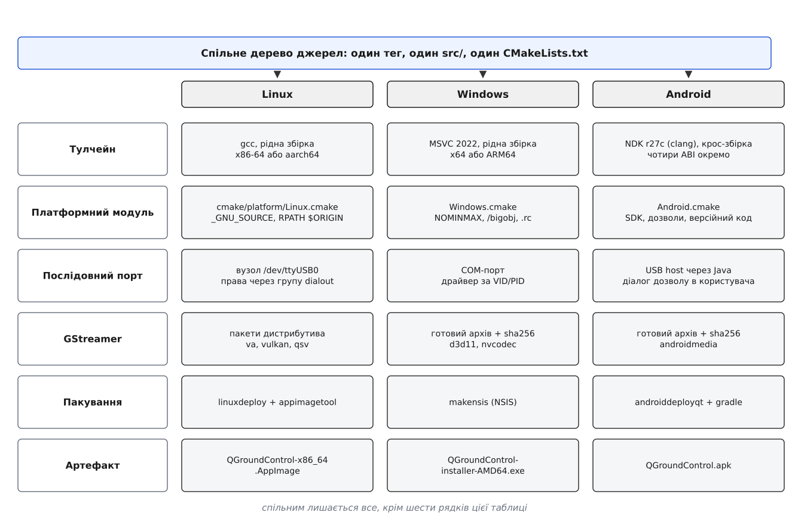
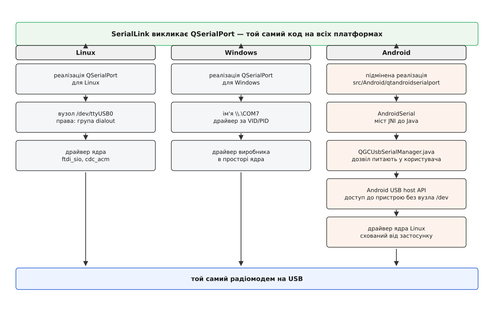
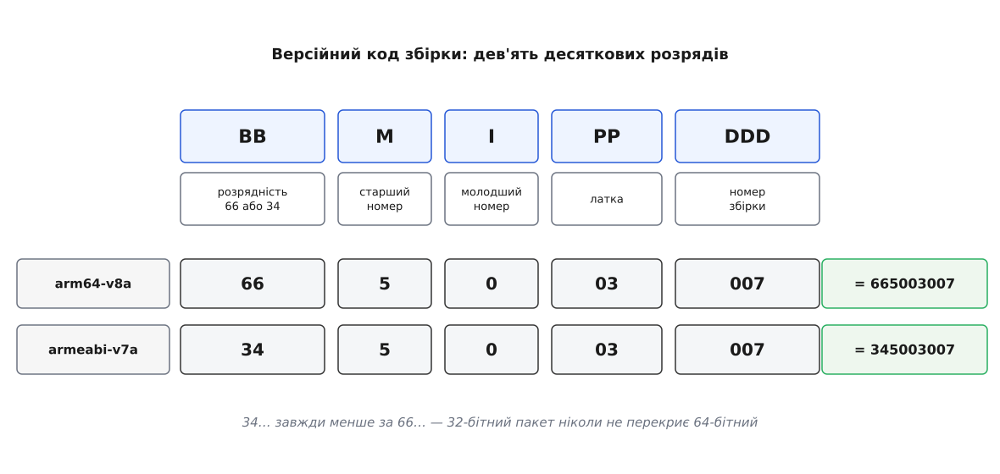

# Цілі платформ: Linux, Windows, Android

<preknowlist>
- [Компіляція](book:programming/compilation) — перетворення тексту програми на машинний код для конкретного процесора.
- [ABI і домовленість про виклик](book:programming/abi-calling-convention) — двійковий контракт: у яких регістрах лежать аргументи, як вирівняні структури, що означає «сумісний код».
- [Крос-компіляція](book:build-systems/cross-compilation) — коли машина, що збирає, і машина, що виконує, — різні; звідси поділ на хост і ціль.
- [Динамічне лінкування](book:programming/dynamic-linking) — як програма знаходить і підвантажує бібліотеки під час запуску.
- [Цілі й властивості CMake](book:build-systems/targets-and-properties) — ціль збірки як об'єкт із власними прапорцями, визначеннями й залежностями.
- [Виклик чужої мови](book:programming/foreign-function-interface) — механізм, яким код однією мовою викликає функції, написані іншою.
- [QGroundControl: що це і яку задачу розв'язує](book:qgroundcontrol/what-is-qgc) — призначення наземної станції та її місце між оператором і апаратом.
</preknowlist>

## Три файли з одного тега

На сторінці завантажень лежать три різні речі: `QGroundControl-x86_64.AppImage`, `QGroundControl-installer-AMD64.exe` і `QGroundControl.apk`. Зібрані вони з того самого тега, з того самого дерева джерел, тим самим набором команд. Але жодну з них не можна одержати з іншої — і навіть не тому, що всередині різні машинні інструкції.

Найпростіше пояснення звучить так: платформа — це набір інструкцій процесора, тож «зібрати під іншу платформу» означає «перекомпілювати іншим компілятором». Перевірмо це припущення уявним експериментом. Візьмімо готовий бінарник для Linux і припустімо, що якийсь чарівний інструмент бездоганно переклав кожну його інструкцію в ARM-інструкцію. Покладімо результат у `.apk`. Він не запуститься — і не через код.

Не запуститься він тому, що застосунок складається не лише з власного коду. Він увесь час **звертається до середовища**: відкрий мені пристрій із таким іменем, дай вікно з таким розміром, розшифруй цей потік H.264, прочитай мій файл налаштувань, запитай у користувача дозвіл. Кожне таке звертання адресоване не залізу, а **домовленості** — набору імен, правил і обіцянок, які операційна система тримає перед застосунком. Набір інструкцій процесора — лише одна з цих домовленостей, і, як не дивно, найспокійніша: її дотримання забезпечує компілятор, і на цьому проблема закінчується.

Тож «платформа» для наземної станції — це чотири незалежні контракти:

1. **Машинний рівень.** Які інструкції та який двійковий формат розуміє процесор і завантажувач.
2. **Системний інтерфейс.** Як програма просить у системи пристрій, вікно, файл, декодер.
3. **Спосіб доставки.** Що саме система вважає «встановленим застосунком» і хто постачає бібліотеки, з якими він працює.
4. **Правила дозволу.** Чи взагалі вільно застосункові зробити те, що він просить, і в кого це питають.

Далі — одне питання: **де в проєкті дозволено знати про платформу, і чому саме там**. Відповідь на нього дають ці чотири контракти, кожен по черзі; у сумі вони пояснюють, чому одне дерево джерел дає три несхожі артефакти й чому нова функція іноді коштує день, а іноді тиждень.



*Спільним лишається все, крім шести рядків: саме в них зосереджена вся різниця між трьома збірками.*

## Контракт перший: у які інструкції компілювати

Збірка під Linux і Windows — **рідна**: машина, що компілює, і машина, що виконує, однакові за архітектурою. Компілятор бере заголовки з системи, лінкувальник — її ж бібліотеки, і кожен зібраний проміжний файл можна тут-таки запустити.

Android ламає цю зручність повністю. Розробник сидить за настільним комп'ютером на x86-64, а код виконуватиметься на планшеті з ARM. Отже, збірка **крос-платформна**: усе, що бере участь у компіляції, мусить існувати двічі. Компілятор — той, що працює на хості, але породжує код для цілі. Заголовки й бібліотеки — цільові, не системні: підставити `/usr/include` тут не можна, бо там описано зовсім інше ядро й зовсім інший libc. Сам Qt — теж цільовий, зібраний під цю архітектуру заздалегідь.

І цільова архітектура на Android не одна. Android розрізняє чотири двійкові інтерфейси застосунку: `armeabi-v7a`, `arm64-v8a`, `x86`, `x86_64`. Різниця між ними — не лише набір інструкцій; це різні розміри вказівника, різні домовленості про виклик, різне вирівнювання. Код, зібраний під один ABI, у процесі з іншим ABI не працює взагалі — не «повільніше», а ніяк. Тому повна збірка QGroundControl під Android — це чотири незалежні компіляції, кожна зі своїм набором Qt.

Хто ж призначає компілятор? У CMake це робить **файл тулчейна** — окремий сценарій, що виконується найпершим і задає компілятор, sysroot і цільовий тріплет ще до того, як проєкт скаже бодай слово про себе. Qt постачає власну обгортку над цим механізмом:

```bash
~/Qt/6.11.1/gcc_64/bin/qt-cmake -B build -G Ninja -DCMAKE_BUILD_TYPE=Debug
cmake --build build --config Debug
```

`qt-cmake` — це той самий `cmake`, якому наперед підсунуто тулчейн Qt. Звідси випливає річ, що спершу дивує: **цільову платформу обирають не прапорцем, а тим, який саме `qt-cmake` викликано**. Виклик із теки `android_arm64_v8a` дає збірку під ARM64-Android із тулчейном NDK всередині; виклик із `gcc_64` — рідну збірку під Linux. Проєкт при цьому не змінюється ані на рядок.

> 🔧 **Навіщо це.** Коли збірка під Android падає з незрозумілою помилкою про ненайдений заголовок, першою перевіркою має бути не текст помилки, а **який `qt-cmake` викликано і чи стоїть Qt саме під цей ABI**. Половина «загадкових» падінь Android-збірки — це рідний тулчейн, якому підсунули цільові джерела, або встановлений `arm64-v8a` при заданому `armeabi-v7a`.

Технічні подробиці того, як тулчейн описує чужу платформу — sysroot, тріплет, розділення хоста й цілі, — розібрані окремо в довіднику систем збірки: [файл тулчейна](book:build-systems/cmake-toolchain-file) задає компілятор і оточення до конфігурації проєкту, а [цільовий тріплет і sysroot](book:build-systems/target-triple-sysroot) визначають, з якого дерева брати заголовки й бібліотеки. Нюанси саме NDK — рівень API, вибір ABI, версії — теж лежать поруч, у [нюансах Android](book:build-systems/android-ndk-nuances).

## Чому версії прибиті цвяхом

Тепер прикра деталь, без якої попереднє не працює. Наземна станція не збереться «будь-яким свіжим Qt» — документація прямо забороняє брати іншу версію, ніж указана. Це не примха супроводу.

Причина в тому, що станція керує апаратом у польоті. Зміна поведінки QML-рушія, яка деінде дала б смикання анімації, тут дає завмерлий на секунду індикатор висоти. Зміна в тайм-аутах послідовного порту деінде дала б повільніше завантаження — тут вона дає розрив зв'язку в момент, коли оператор натиснув «повернутися додому». Перевірити всю поверхню застосунку на кожній новій версії Qt ніхто не в змозі, тому вибір такий: або одна перевірена версія, або необмежений ризик. Проєкт обрав перше.

Але «одна версія» — це обіцянка, яку легко порушити випадково: у документації одне число, у сценарії неперервної інтеграції інше, у CMake третє. Тому всі закріплені версії зведено в **один файл** — `.github/build-config.json`, звичайний JSON:

```json
{
  "qt":      { "version": "6.11.1", "minimum_version": "6.11.0" },
  "android": { "platform": "36", "min_sdk": "28", "build_tools": "36.0.0",
               "ndk_version": "r27c", "ndk_full_version": "27.2.12479018",
               "java_version": "21" },
  "build":   { "cmake_minimum_version": "3.25",
               "platform_workflows": "Linux,Windows,MacOS,Android" },
  "gstreamer": { "version": { "default": "1.28.4", "minimum": "1.20.0" } }
}
```

Читає його не лише неперервна інтеграція, а й сама збірка: `cmake/BuildConfig.cmake` відкриває цей файл вбудованим у CMake розбирачем JSON і розкладає значення по змінних `QGC_CONFIG_*`:

```cmake
set(QGC_BUILD_CONFIG_FILE "${CMAKE_SOURCE_DIR}/.github/build-config.json")
if(NOT EXISTS "${QGC_BUILD_CONFIG_FILE}")
    message(FATAL_ERROR "QGC: BuildConfig: Config file not found: ${QGC_BUILD_CONFIG_FILE}")
endif()
file(READ "${QGC_BUILD_CONFIG_FILE}" QGC_BUILD_CONFIG_CONTENT)
```

Наслідок практичний: версія Qt на машині розробника й версія Qt у хмарному складальнику — не два числа, які треба узгоджувати, а одне число, прочитане двічі. Складальник, що зелений при червоному розробникові, — гірше за відсутність складальника взагалі, бо він бреше впевнено.

Числа тут наведено з гілки `master` на час письма; у стабільній лінії 5.x закріплено Qt 6.8.3. Це не суперечність, а звичайний стан: кожна гілка тримає свій набір закріплень, і питати «яка версія Qt потрібна для QGC» без назви гілки — безглуздо. Сам механізм при цьому не змінюється, змінюються лише числа у файлі.

## Контракт другий: одне розгалуження на весь проєкт

Отже, компілятор ми маємо. Далі починається різниця в системному інтерфейсі — і от тут проєкт міг би розсипатися. Найлегший шлях — писати `#ifdef` там, де болить: у коді вікна, у коді порту, у коді відео, у десятку місць збірки. Через рік такий проєкт неможливо ні прочитати, ні полагодити: щоб зрозуміти, що робиться на Android, треба обійти сотню файлів.

QGroundControl іде іншим шляхом: **платформна різниця має мешкати в наперед відомих місцях**. У збірці таких місць рівно чотири, і кореневий `CMakeLists.txt` містить єдине розгалуження на весь проєкт:

```cmake
if(WIN32)
    include(Windows)
elseif(APPLE)
    include(Apple)
elseif(ANDROID)
    include(Android)
elseif(LINUX)
    include(Linux)
endif()
```

Порядок гілок тут промовистий. `ANDROID` перевіряють **до** `LINUX`, а пошук клієнта Wayland додатково захищено умовою `if(LINUX AND NOT ANDROID)`. Причина в тому, що Android стоїть на ядрі Linux, але не є Linux-настільною системою: там немає ні X11, ні Wayland, ні звичного набору бібліотек. Ядро спільне — контракт застосунку інший, і плутати ці два рівні дорого.

Що ж лежить усередині кожного модуля? Не декоративні дрібниці, а конкретні наслідки конкретних властивостей системи.

**Windows.** Компілятор MSVC отримує `/bigobj` і `/Zc:preprocessor`, а компіляція — визначення `NOMINMAX`, `WIN32_LEAN_AND_MEAN`, `_USE_MATH_DEFINES`, `_CRT_SECURE_NO_WARNINGS`. Кожне з них має історію. `NOMINMAX` потрібне тому, що `windows.h` визначає `min` і `max` як макроси, а вони мовчки псують будь-який виклик `std::min`. `/bigobj` — тому що об'єктний файл MSVC має обмеження на кількість секцій, і одиниця трансляції, у яку інструменти Qt згенерували кілька тисяч шаблонних утілень, у це обмеження не влазить. `WIN32_LEAN_AND_MEAN` просто відрізає половину заголовків системи, які проєкту ні до чого. Окремо модуль складає ресурсний файл із шаблона `deploy/windows/QGroundControl.rc.in` — щоб у властивостях `.exe` показувалися назва, версія й правовласник: у Windows це не косметика, а те, за чим служба підтримки визначає, яка саме збірка стоїть у клієнта.

**Linux.** Тут визначень майже немає: `_GNU_SOURCE` — і все. Натомість модуль вмикає `set(CMAKE_BUILD_RPATH_USE_ORIGIN ON)`, і це рішення тягне за собою цілий спосіб пакування. `$ORIGIN` у шляху пошуку бібліотек означає «тека, у якій лежить сам виконуваний файл»; програма, зібрана так, шукає свої `.so` **відносно себе**, а не за абсолютними шляхами машини складальника. Без цього самодостатній пакунок неможливий у принципі. Крім того, кореневий `CMakeLists.txt` явно вшиває в застосунок три плагіни платформи Qt — Wayland, XCB і EGLFS:

```cmake
if(LINUX)
    qt_import_plugins(${CMAKE_PROJECT_NAME}
        INCLUDE
            Qt6::QWaylandIntegrationPlugin
            Qt6::QXcbIntegrationPlugin
            Qt6::QEglFSIntegrationPlugin
    )
endif()
```

Причина знову не в естетиці: у Linux немає **однієї** віконної системи. На машині користувача може бути Wayland, може бути X11, а на бортовому комп'ютері без робочого столу — взагалі прямий вивід у кадровий буфер. Складальник не знає, куди поїде його артефакт, тому кладе в нього всі три відповіді.

**Android.** Модуль насамперед перевіряє версію NDK — і не «приблизно», а звіряє пару «старша.молодша» з тією, якої вимагає Qt. Далі він виставляє властивості цілі, які потім перетворяться на маніфест пакета: `QT_ANDROID_MIN_SDK_VERSION`, `QT_ANDROID_TARGET_SDK_VERSION`, `QT_ANDROID_COMPILE_SDK_VERSION`, `QT_ANDROID_PACKAGE_NAME`, `QT_ANDROID_PACKAGE_SOURCE_DIR`, `QT_ANDROID_VERSION_CODE`, `QT_ANDROID_VERSION_NAME`. Тут-таки складається список дозволів застосунку й підключається окремо зібраний OpenSSL: Android не постачає застосункам системну криптобібліотеку в тому вигляді, у якому її очікує Qt.

Той самий принцип діє й у джерелах. Платформний код лежить у власній теці, а її `CMakeLists.txt` починається з відсікача:

```cmake
if(NOT ANDROID)
    return()
endif()
```

Тека `src/Android/` просто не існує для решти платформ — не «компілюється в порожнечу», а взагалі не бере участі в збірці.

> 🔧 **Навіщо це.** Правило, яке варто прикласти до власної правки: якщо ви пишете `#ifdef Q_OS_ANDROID` десь у `src/Vehicle` чи `src/FlyView`, майже напевно ви пишете його не там. Питання, яке треба поставити собі, — «а чи можна замість умови в місці виклику підмінити реалізацію під ним». Умова в місці виклику розмножується з кожною новою платформою; підмінена реалізація — ні.

## Контракт третій: на Android немає `/dev/ttyUSB0`

Найглибша межа між платформами проходить там, де станція торкається заліза. Наземна станція без послідовного порту марна: саме через нього під'єднано радіомодем, який несе телеметрію [каналом до апарата](book:qgroundcontrol/link-types). І цей порт на трьох системах відкривають трьома різними способами.

**Linux.** USB-перехідник, увімкнутий у комп'ютер, ядро розпізнає й породжує вузол пристрою — файл `/dev/ttyUSB0` (для мікросхем FTDI) або `/dev/ttyACM0` (для пристроїв класу CDC). Далі все як зі звичайним файлом: відкрити, налаштувати швидкість, читати. Права на цей вузол ядро дає не всім: власником стає `root`, а групою — `dialout`, тож користувач мусить бути в цій групі, інакше відкриття впаде на правах доступу. Звідси перша команда з будь-якої інструкції встановлення:

```bash
sudo usermod -aG dialout "$(id -un)"
sudo systemctl mask --now ModemManager.service
```

Другий рядок стосується другої халепи. У багатьох дистрибутивах працює служба ModemManager, яка бачить нову послідовну «залізяку» й негайно намагається з нею поговорити, вважаючи її модемом. Поки вона це робить, порт зайнятий, і станція одержує помилку відкриття на пристрої, який щойно чудово визначився. Механіка вузлів пристроїв, правил `udev` і груп доступу розібрана в довіднику Linux — досить знати, що [вузол пристрою](book:unix-linux/device-file-model) — це ім'я у файловій системі, за яким стоїть драйвер, а [доступ до пристрою дають через групу](book:unix-linux/device-access-groups), а не персонально.

**Windows.** Тут ядро не породжує файл у файловій системі. Замість цього система, побачивши пристрій з певними ідентифікаторами постачальника й виробу, підбирає драйвер і реєструє **COM-порт** із номером. Застосунок відкриває його за іменем `COM7` — а якщо номер більший за дев'ять, то за формою `\\.\COM10`, бо коротка форма для двоцифрових номерів історично не працює. Групи `dialout` немає, служби-конкурента зазвичай теж немає; натомість є питання, чи взагалі встановлено драйвер для цієї мікросхеми.

**Android.** А тут немає нічого зі згаданого. Ядро — те саме Linux-ядро, вузол `/dev/bus/usb/...` існує, але **застосунок до нього не дістанеться**: він працює під власним ідентифікатором користувача, і прав на пристрій у нього немає. Це не недогляд, а стрижень моделі безпеки: застосунок, установлений із крамниці, не має мовчки читати те, що ви ввімкнули в порт.

Замість вузла Android дає інший шлях — **USB host API**, доступний із Java. Система сама показує користувачеві діалог «дозволити цьому застосункові доступ до цього пристрою?», і лише після натискання застосунок одержує дескриптор, з яким можна працювати. Діалог тут не випадковість, а частина [моделі застосунку Android](book:programming/android-app-model): застосунок описує себе маніфестом — файлом, у якому перелічено, які дозволи він просить, які події ловить і з якого екрана починається; чутливі дозволи система дає не за записом у маніфесті, а за окремим підтвердженням користувача під час роботи. Додатково маніфест оголошує намір ловити події під'єднання:

```xml
<intent-filter>
    <action android:name="android.hardware.usb.action.USB_DEVICE_ATTACHED"/>
</intent-filter>
<meta-data android:name="android.hardware.usb.action.USB_DEVICE_ATTACHED"
           android:resource="@xml/device_filter"/>
```

Завдяки цій парі система, побачивши знайомий за списком у `device_filter` перехідник, сама пропонує запустити станцію — саме так це виглядає, коли ви втикаєте радіомодем у планшет і QGroundControl відкривається без вашої участі.

Тепер головне питання: як усе це пов'язати з кодом станції, який просто хоче відкрити порт? Найгірша відповідь — розкидати умови по `SerialLink`. QGroundControl робить інакше: **зберігає інтерфейс і підмінює реалізацію під ним**. У теці `src/Android/` живе `qtandroidserialport` — реалізація тих самих класів `QSerialPort`, тільки з іншим нутром, і міст до Java:

```cpp
namespace AndroidSerial {
    constexpr const char *kJniUsbSerialManagerClassName =
        "org/mavlink/qgroundcontrol/QGCUsbSerialManager";

    QList<QSerialPortInfo> availableDevices();
    int  open(const QString &portName, QSerialPortPrivate *classPtr);
    QByteArray read(int deviceId, int length, int timeout);
    int  write(int deviceId, const char *data, int length, int timeout, bool async);
    bool setParameters(int deviceId, int baudRate, int dataBits, int stopBits, int parity);
}
```

Кожна з цих функцій через [міст до чужої мови](book:programming/foreign-function-interface) викликає метод Java-класу `QGCUsbSerialManager`, який уже й розмовляє з USB host API. З боку `SerialLink` не змінюється нічого: він як створював `QSerialPort` і кликав `write()`, так і кличе. Практичну механіку цього мосту — хто кого реєструє, у якому потоці працює зворотний виклик, що станеться, коли кабель висмикнули посеред запису — розібрано окремо в [коді мосту JNI](book:qgroundcontrol/platform-targets/proj-android-serial-bridge.md).



*Виклик у застосунку однаковий на всіх трьох платформах; різниця в тому, скільки шарів під ним і хто дає дозвіл.*

Із цієї картинки видно й ціну. Шлях на Android довший на три ланки, кожна з яких може відмовити зі своєї причини: користувач не натиснув «дозволити», перехідник не впізнано за списком, Java-виняток не долетів до C++ як помилка. Тому «на настільній системі працює, на планшеті — ні» для послідовного порту — не аномалія, а очікуваний стан, який треба перевіряти окремо.

## Контракт четвертий: те саме відео, різні декодери

Другий шматок, що впирається в залізо, — відео. Станція приймає з апарата стиснений потік і мусить показати його з якнайменшою затримкою. Робить це GStreamer — [конвеєр елементів](book:media-vision/pipeline-model), та сама бібліотека на всіх платформах. І все ж її збірка на кожній платформі різна, причому двічі різна.

По-перше, різний **набір плагінів**. Декодування H.264 у програмі, на центральному процесорі, з'їдає ядро й додає затримку; кожна система дає власний шлях до апаратного декодера, і кожен такий шлях — окремий плагін GStreamer. Список у конфігурації збірки прямо це показує: спільна частина — `rtp`, `rtsp`, `udp`, `videoparsersbad`, `openh264`, `playback`; понад неї для Windows додають `d3d11`, `d3d12`, `nvcodec`, для Linux — `va`, `qsv`, `vulkan`, `nvcodec`, для Android — `androidmedia`. Останній — це обгортка над системним декодером Android; жодного відношення до `d3d11` він не має, хоча робить те саме. Про самі елементи апаратного декодування є окрема тема: [апаратні декодери в GStreamer](book:media-vision/hardware-decode-elements) підмінюють програмний елемент і працюють із пам'яттю графічного процесора.

По-друге, різне **джерело двійників**. На Linux GStreamer беруть із пакетів дистрибутива — його там усе одно вже поставили десятки інших програм. Для Windows, macOS, Android та iOS системного GStreamer не існує, тому збірка **завантажує готовий архів** потрібної версії й звіряє його `sha256`:

```json
"gstreamer": {
  "version": { "default": "1.28.4", "minimum": "1.20.0", "android": "1.28.4" },
  "checksums": { "1.28.4": { "android": "a48aeb1b4fbae67a2fe0a0daa55af4a6af22b48f15a9c09f09dcd9ab3e8e943e" } }
}
```

Контрольна сума тут не формальність. Завантажений під час збірки архів — це чужий двійковий код, який потрапить у підписаний застосунок для керування літальним апаратом; звірка суми означає, що ми одержали саме той файл, який колись перевіряли, а не той, що лежить сьогодні за тією самою адресою.

Оскільки відеотракт залежить від зовнішніх двійників, він зроблений **необов'язковим**. Опція `-DQGC_ENABLE_GST_VIDEOSTREAMING=OFF` вимикає його цілком — і саме нею користуються там, де готового архіву під потрібну архітектуру немає. Це загальний прийом: усе, що є на одній платформі й відсутнє на іншій, або отримує запасний шлях, або стає вимикною можливістю з чесною відсутністю в інтерфейсі.

## Контракт п'ятий: чим програма стає для користувача

Компілятор відпрацював, код зібрано, залежності на місці. Лишається питання, яке новачки часто вважають дрібницею: що саме віддати користувачеві. Виявляється, «застосунок» — це теж платформне поняття, і на трьох системах воно означає три різні речі.

**Linux не має однієї відповіді.** Дистрибутиви розходяться в назвах пакетів, версіях бібліотек і місцях, куди їх кладуть. Пакунок, зібраний під одну версію Ubuntu, на сусідній не поставиться. Тому проєкт іде шляхом [самодостатнього пакунка](book:unix-linux/self-contained-bundles): `linuxdeploy` збирає в теку `AppDir` виконуваний файл разом з усіма бібліотеками, від яких він залежить, додає файл робочого столу й піктограму, а `appimagetool` запаковує все це в **один** файл із правом на виконання:

```bash
chmod +x QGroundControl-x86_64.AppImage
./QGroundControl-x86_64.AppImage
```

Ось тут і замикається `RPATH` з `$ORIGIN`: без нього виконуваний файл усередині `AppDir` шукав би бібліотеки за абсолютними шляхами складальної машини й не знаходив би нічого. Повної незалежності від системи все одно не виходить — `libfuse2`, потрібну самому механізмові AppImage, доводиться ставити окремо, — але від конкретного дистрибутива артефакт незалежний.

**Windows очікує інсталятор.** Копію теки з файлами користувач Windows застосунком не вважає: потрібен `.exe`, який покладе програму в `Program Files`, зробить ярлик і запис у список установленого. Проєкт складає його програмою `makensis` із системи NSIS, передаючи їй назву, версію й теку з готовим вмістом:

```cmake
/DAPPNAME=${CMAKE_PROJECT_NAME}
/DAPPVERSION=${_APPVER}
/DDESTDIR=${QGC_PAYLOAD_DIR}
/XOutFile "${QGC_INSTALLER_OUT}"
```

Тека `QGC_PAYLOAD_DIR` на цей момент уже містить усе: сам застосунок, бібліотеки Qt, плагіни, переклади. Кінцевий файл зветься `QGroundControl-installer-AMD64.exe` — з архітектурою в імені, бо збірка під ARM64-Windows існує окремо.

**Android вимагає підписаний пакет із цілим числом версії.** Тут з'являється вимога, якої немає на двох інших системах: крамниця Google Play розрізняє збірки не за рядком «5.0.3», а за цілим числом — версійним кодом, — і кожне нове завантаження мусить мати код **більший** за попередній. А оскільки під кожен ABI збирається свій пакет, кодів потрібно кілька, і вони мусять упорядковуватися так, щоб пристрій завжди отримував найкращий для себе варіант.

QGroundControl розв'язує це розкладкою розрядів. Версійний код складають за схемою `BBMIPPDDD`: два розряди розрядності (66 для 64-бітних ABI, 34 для 32-бітних), далі старший номер версії, молодший, латка й номер збірки.

**Умова: версія 5.0.3, збірка номер 7, два пакети — під `arm64-v8a` і під `armeabi-v7a`.**

```
64-бітний:  BB=66  M=5  I=0  PP=03  DDD=007  →  665003007
32-бітний:  BB=34  M=5  I=0  PP=03  DDD=007  →  345003007

345003007 < 665003007                    ← 64-бітний пакет завжди «новіший»
максимум схеми  669999999 < 2100000000   ← стеля версійного коду Google Play
```

Розрядність попереду означає, що жоден 32-бітний пакет ніколи не перекриє 64-бітний тієї самої версії, і пристрій, здатний на 64 біти, одержить саме його. Стеля схеми з великим запасом влазить у обмеження крамниці. Плата — фіксована ширина полів: молодший номер версії має рівно один розряд, тож версія 5.10 у цю розкладку вже не влізе без її перегляду.



*Розрядність стоїть у старших розрядах саме для того, щоб порівняння цілих чисел давало правильний порядок пакетів.*

Сам маніфест пакета при цьому ніхто не редагує руками. У теці `android/` лежить **шаблон** `AndroidManifest.xml` із мітками, які підставляються під час збірки:

```xml
<!-- %%INSERT_PERMISSIONS -->
<!-- %%INSERT_FEATURES -->
android:versionCode="%%INSERT_VERSION_CODE%%"
```

Список дозволів формує CMake, а не людина. Це важливо: дозвіл, доданий у маніфест руками, зникне з наступною генерацією, а дозвіл, доданий у список у `cmake/platform/Android.cmake`, потрапить у пакет назавжди. Повний перелік прапорців збірки, змінних і цілей пакування — з тим, що вони роблять і коли їх чіпають, — зібрано у [довідці платформних ручок](book:qgroundcontrol/platform-targets/api-platform-knobs.md).

Разом із дозволами маніфест оголошує й **можливості пристрою** — камеру, Bluetooth, супутникову навігацію, режим USB host — і всі як необов'язкові. Логіка проста: планшет без приймача супутникової навігації цілком придатний як пульт, і забороняти на нього встановлення через відсутню дрібницю було б безглуздо. Натомість застосунок мусить бути готовий, що можливості немає, і сказати про це в інтерфейсі.

## Що коштує додати своє

Тепер видно, чому та сама на вигляд правка може коштувати годину або тиждень. Ціна визначається не обсягом коду, а тим, **скількох контрактів вона торкається**.

Правка, що не торкається жодного, — нова панель у польотному вигляді, нове поле в місії, новий розрахунок над телеметрією — платформна різниця її не стосується взагалі. Вона просто працює скрізь; збірка під три системи нічого до неї не додає.

Правка, що торкається одного контракту, потребує рівно одного платформного місця. Потрібен новий системний виклик на Linux — його місце у власному файлі під захистом відсікача, а спільний код бачить лише інтерфейс. Потрібен інший прапорець компілятора для MSVC — його місце у `cmake/platform/Windows.cmake`, а не в кореневому файлі.

Правка, що торкається кількох, вимагає плану наперед. Практична послідовність тут така.

**Спершу — інтерфейс, потім реалізації.** Опишіть, чого хоче спільний код, у вигляді звичайного класу чи набору функцій без жодної згадки платформи. Далі дайте кожній платформі свою реалізацію. Цей порядок — не смак: він єдиний, за якого поява четвертої платформи не змушує переписувати місця викликів. Загальний принцип такого поділу відомий як [шар апаратної абстракції](book:programming/hardware-abstraction-layer).

**Нова стороння бібліотека — перевірити на всіх чотирьох.** Питання не «чи є вона для Android», а «чи є вона для `armeabi-v7a`, `arm64-v8a`, `x86` і `x86_64` тієї самої версії». Якщо для якоїсь платформи її немає — бібліотека стає необов'язковою, з опцією `QGC_ENABLE_…` і чесною поведінкою без неї, як зроблено з відеотрактом.

**Нова можливість на Android — це три записи, а не один.** Дозвіл у списку CMake, щоб він потрапив у маніфест; запит дозволу під час роботи, бо для чутливих дозволів самого оголошення в маніфесті мало; необов'язкове оголошення можливості пристрою, щоб застосунок лишався встановлюваним там, де заліза немає. Пропущений другий крок дає найпідступнішу помилку: у маніфесті все правильно, а виклик усе одно повертає відмову.

**Перевіряти — на всіх платформах, які проєкт обіцяє.** Їхній перелік не таємниця, він у тому самому конфігураційному файлі: `"platform_workflows": "Linux,Windows,MacOS,Android"`. Кожна з них має власний сценарій неперервної інтеграції, і правка, зелена лише на вашій системі, — це правка, перевірена на чверть.

> 🔧 **Навіщо це.** Перед тим як оцінювати строк, пройдіться по чотирьох контрактах і позначте, яких торкається задача. Нуль — оцінюйте як звичайну роботу. Один — додайте час на збірку й перевірку саме на тій системі. Три-чотири — це не «функція», а маленький порт, і оцінювати його треба як порт, з окремим часом на діалоги дозволів, на пакування й на те, що на планшеті все поводиться інакше.

Тому питання «чи працюватиме воно на Android?» насправді містить чотири різні питання, і відповіді на них незалежні. Чи компілюється — питання до тулчейна. Чи є системний інтерфейс — питання до платформного модуля й теки платформного коду. Чи долетять двійники залежностей — питання до пакування. Чи дозволить система — питання до маніфесту й до діалогу, який побачить користувач. Збірка під три платформи не складніша за збірку під одну рівно доти, доки кожне з цих питань має своє окреме, наперед відоме місце в дереві.
