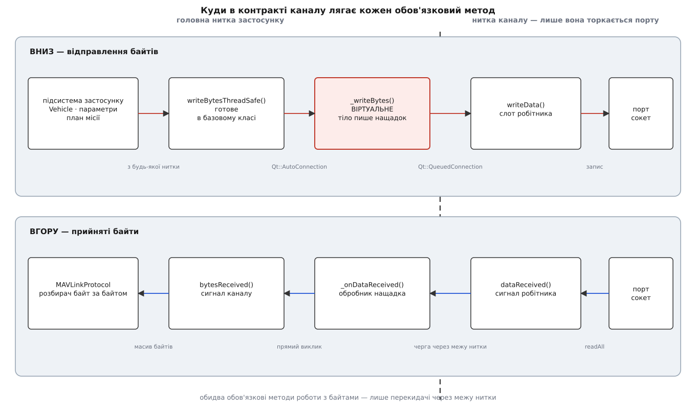

# 🔌 Контракт каналу: віртуальні методи, сигнали й поля кожного типу налаштувань

Тут зібрано повний перелік того, що мусить реалізувати новий тип каналу QGroundControl і що вже зроблено за нього базовим класом: кожен чисто віртуальний метод із сигнатурою й місцем виклику, усі п'ять сигналів і те, хто до них під'єднаний, механіка виділення каналу MAVLink, а далі — поле за полем усі чотири типи налаштувань із типовими значеннями, ключами у сховищі й місцем, де значення справді застосовується. Довідник потрібен, щоб не гадати, який метод обов'язковий, а який має готове тіло, і щоб знати наперед, яке поле переживе перезапуск, а яке зникне разом із сеансом.

Звірено з гілкою `master` репозиторію `mavlink/qgroundcontrol` 2 серпня 2026 року. Чинна стабільна лінія на той день — 5.0.x (останній стабільний випуск 5.0.8 від 9 жовтня 2025); найсвіжіше в переліку релізів — кандидат `v5.1.0-RC1` від 30 липня 2026. Файли: `src/Comms/LinkInterface.h`, `LinkInterface.cc`, `LinkConfiguration.h`, `LinkConfiguration.cc`, `LinkManager.cc`, `SerialLink.h/.cc`, `UDPLink.h/.cc`, `TCPLink.h/.cc`, `Bluetooth/BluetoothConfiguration.h/.cc`, `Bluetooth/BluetoothLink.h/.cc`, `Bluetooth/BluetoothBleWorker.cc`.

---

## Два класи, дві тривалості життя

Контракт розкладено на пару класів, і плутати їх дорого.

| Клас | Що описує | Скільки живе | Хто створює |
|---|---|---|---|
| `LinkConfiguration` | параметри з'єднання: ім'я, порт, швидкість, адреса | від додавання в списку до видалення; серіалізується у сховище | інтерфейс, автоз'єднання, `LinkConfiguration::createSettings(type, name)` |
| `LinkInterface` | живе з'єднання: відкритий порт чи сокет і нитка при ньому | від `createConnectedLink()` до роз'єднання | лише `LinkManager` — конструктор `protected`, а сам менеджер оголошений `friend` |

Обидва ходять по коду виключно розумними вказівниками, і типи для них заведено окремо:

```cpp
typedef std::shared_ptr<LinkInterface>     SharedLinkInterfacePtr;
typedef std::weak_ptr<LinkInterface>       WeakLinkInterfacePtr;
typedef std::shared_ptr<LinkConfiguration> SharedLinkConfigurationPtr;
typedef std::weak_ptr<LinkConfiguration>   WeakLinkConfigurationPtr;
```

Напрям володіння несиметричний і це навмисно: канал тримає **сильне** посилання на свої налаштування (`SharedLinkConfigurationPtr _config`), а налаштування тримають **слабке** посилання на канал (`std::weak_ptr<LinkInterface> _link`). Тому налаштування переживають своє з'єднання, а не навпаки, і `config->link()` після роз'єднання чесно віддає `nullptr`. Хто веде обидва списки — у [менеджері каналів](book:qgroundcontrol/link-manager).

---

## Що зобов'язаний реалізувати нащадок LinkInterface

Чотири чисто віртуальні методи. Без жодного з них клас не компілюється — це і є весь обов'язковий контракт.

```cpp
private:
    virtual bool _connect() = 0;                              ///< відкрити порт/сокет
private slots:
    virtual void _writeBytes(const QByteArray &bytes) = 0;    ///< записати масив байтів
public:
    Q_INVOKABLE virtual void disconnect() = 0;                ///< закрити; має терпіти повторні виклики
    virtual bool isConnected() const = 0;                     ///< правда, доки канал живий
```

| Метод | Доступ у базовому класі | Хто викликає | Що мусить робити |
|---|---|---|---|
| `_connect()` | `private` | `LinkManager::createConnectedLink()` через дружбу | почати під'єднання; `false` = навіть спробу не вдалося запустити |
| `_writeBytes(bytes)` | `private slots` | `writeBytesThreadSafe()` через `QMetaObject::invokeMethod` | віддати байти тому, хто володіє портом |
| `disconnect()` | `public`, `Q_INVOKABLE` | інтерфейс, `LinkManager`, сам базовий клас із `_connectionRemoved()` | закрити з'єднання; **захиститися від повторного виклику** |
| `isConnected()` | `public` | усе — від `LinkManager` до QML | стан «канал живий» без блокування |

Дві тонкощі, які видно лише з оголошень.

**Рівень доступу в нащадку може бути будь-який.** `_connect()` оголошено `private`, і жоден нащадок цього не змінює послідовно: `UDPLink` кладе його в `protected`, `SerialLink` і `TCPLink` — у `private`. Це не помилка й не недбальство. Менеджер кличе метод через вказівник на **базовий** тип (`link->_connect()`, де `link` — `shared_ptr<LinkInterface>`), а дружба з `LinkManager` оголошена саме в базовому класі. Права доступу перевіряються за статичним типом виразу, а виклик диспетчеризується за динамічним — тому специфікатор у нащадку на дозвіл не впливає взагалі ([віртуальна диспетчеризація в C++](book:programming/virtual-dispatch-cpp)).

**Ім'я `disconnect` перекриває однойменні методи `QObject`.** Оголосивши `virtual void disconnect() = 0`, базовий клас ховає всі перевантаження `QObject::disconnect` у своїй області видимості та в усіх нащадках. Усередині коду каналу розірвати зв'язок сигналу з обробником можна лише повним іменем — `QObject::disconnect(…)`; коротка форма або не збереться, або впіймає зовсім не той метод.

### Що можна перевизначити, а можна й не чіпати

```cpp
virtual bool isLogReplay()         const { return false; }
virtual bool isSecureConnection()  const { return false; }
virtual bool _allocateMavlinkChannel();          ///< типово бере один канал
virtual void _freeMavlinkChannel();
```

| Метод | Типова відповідь | Хто й навіщо перевизначає |
|---|---|---|
| `isLogReplay()` | `false` | лише `LogReplayLink` — щоб інтерфейс показав повзунок відтворення замість кнопок керування |
| `isSecureConnection()` | `false` | `SerialLink` → `_serialConfig->usbDirect()`; `UDPLink` і `TCPLink` → `QGCNetworkHelper::isNetworkEthernet()`; `BluetoothLink` не перевизначає |
| `_allocateMavlinkChannel()` | бере один канал і створює контролер підписування | `MockLink` — йому треба **три** канали: власний, вхідний і вихідний для вдаваного апарата |
| `_freeMavlinkChannel()` | звільняє канал і руйнує контролер підписування | `MockLink` — щоб віддати всі три |

Відповідь `isSecureConnection()` не косметична: від неї залежить, чи вимагати підпису кадрів на цьому каналі ([підписування MAVLink v2](book:communications/mavlink-v2-signing)). Кабель USB прямо в плату вважається захищеним, дротова мережа — теж, а от Bluetooth і будь-який серійний канал через радіомодуль — ні.

---

## П'ять сигналів і хто на них підписаний

Сигнали — єдиний спосіб каналу говорити вгору. Емітувати їх мусить сам нащадок; базовий клас цього за нього не робить.

```cpp
signals:
    void bytesReceived(LinkInterface *link, const QByteArray &data);
    void bytesSent(LinkInterface *link, const QByteArray &data);
    void connected();
    void disconnected();
    void communicationError(const QString &title, const QString &error);
```

| Сигнал | Коли подавати | Куди йде |
|---|---|---|
| `bytesReceived` | щойно байти прийшли, без спроби знайти межу повідомлення | `MAVLinkProtocol::receiveBytes` — розбирач |
| `bytesSent` | після фактичного запису, з тим обсягом, який справді пішов | `MAVLinkProtocol::logSentBytes` — журнал телеметрії |
| `connected` | коли порт справді відкрито / сокет прив'язано | `LinkManager::_linkConnected` |
| `disconnected` | рівно **один раз** на з'єднання | `LinkManager::_linkDisconnected`, а також `LinkConfiguration` — щоб оновити властивість `link` |
| `communicationError(заголовок, текст)` | на будь-яку помилку, показну користувачеві | `LinkManager::_communicationError` → діалог |

Один раз — не побажання, а вимога, і в коді її дотримуються однаково в усіх чотирьох каналах: кожен несе поле `std::atomic<bool> _disconnectedEmitted{false}` і подає сигнал тільки на переході цього прапорця. Причина проста: сокет може повідомити про падіння, таймер перевірки порту — теж, а користувач тим часом натисне «роз'єднати». Три шляхи, одна подія.

Порядок, у якому менеджер збирає канал, теж фіксований, і два кроки в ньому стоять раніше, ніж здається природним:

```cpp
// LinkManager::createConnectedLink() — фактична послідовність
link = std::make_shared<UDPLink>(config);      // 1. створити об'єкт
if (!link->_allocateMavlinkChannel()) return false;   // 2. взяти канал розбору
connect(link.get(), &LinkInterface::bytesReceived, MAVLinkProtocol::instance(), …);
connect(link.get(), &LinkInterface::connected,     this, &LinkManager::_linkConnected);
…                                              // 3. підписатися на сигнали
MAVLinkProtocol::instance()->resetMetadataForLink(link.get());
if (!link->_connect()) { …відкотити все… }     // 4. і лише тепер під'єднуватися
_rgLinks.append(link);                         // 5. у список активних
```

Канал виділяється **до** підписки, підписка — **до** `_connect()`. Тому нащадок може подати `connected` синхронно просто з `_connect()`, і сигнал не пропаде. І тому ж на невдалому `_connect()` менеджер мусить власноруч відписатися й повернути канал розбору — об'єкт до списку так і не потрапив.

---

## Готове в базовому класі: не переписувати

| Метод | Що робить |
|---|---|
| `writeBytesThreadSafe(bytes, length)` | пакує в `QByteArray` і кидає виклик `_writeBytes` через `QMetaObject::invokeMethod(..., Qt::AutoConnection, ...)` |
| `sendMessageThreadSafe(message)` | **єдина** законна точка відправлення `mavlink_message_t`: перепідписує повідомлення свіжою міткою часу, серіалізує в буфер, віддає в `writeBytesThreadSafe` |
| `mavlinkChannel()` / `mavlinkChannelIsSet()` | номер каналу розбору; невиділений номер = `0xFF` |
| `linkConfiguration()` | ті самі налаштування, з яких канал зроблено |
| `addVehicleReference()` / `removeVehicleReference()` | лічильник апаратів на каналі; коли він падає до нуля, базовий клас сам кличе `disconnect()` |
| `decodedFirstMavlinkPacket()` / `setDecodedFirstMavlinkPacket()` | позначка «з цього каналу вже вийшло хоч одне ціле повідомлення» |
| `reportMavlinkV1Traffic()` / `reportMavlinkV2Traffic()` | облік версії протоколу на каналі з відкладеним попередженням |
| `signing()` | контролер підписування цього каналу; не `nullptr` після виділення каналу |

Чому `sendMessageThreadSafe` називають вузьким горлом, видно з його тіла: підпис накладається **тут і зараз**, безпосередньо перед серіалізацією. Кешований кадр, відправлений повторно (так робить `Vehicle::sendMessageMultiple`), ніс би замерзлу мітку часу, яка з кожною секундою дедалі більше відстає від годинника — і приймач відкинув би його як застарілий. Обійти цю точку й покликати `writeBytesThreadSafe` з уже готовими байтами повідомлення означає обійти підпис.

Відкладене попередження про MAVLink v1 варте окремого рядка, бо його логіка неочевидна:

```
перше v1-повідомлення           → запустити секундомір, мовчати
v1 далі, секундомір < 10000 мс  → мовчати
поява хоч одного v2             → замовкнути назавжди (_mavlinkV2TrafficSeen)
v1, секундомір ≥ 10000 мс       → показати попередження, більше не повторювати
```

Пільговий час `kMavlinkV1TrafficGraceMsecsDefault = 10000` існує через ArduPilot: його канали стартують у першій версії протоколу й переходять на другу, тільки-но побачать v2-кадр від станції. Без паузи станція лаялася б на кожне справне з'єднання ([обробка MAVLink](book:qgroundcontrol/mavlink-handling)).

---

## Виділення каналу MAVLink

Номер каналу — не властивість каналу, а індекс у глобальному масиві станів розбирача. Роздає їх менеджер, і роздає скупо:

```cpp
uint8_t LinkManager::allocateMavlinkChannel()
{
    for (uint8_t ch = 0; ch < MAVLINK_COMM_NUM_BUFFERS; ch++) {
        if (_mavlinkChannelsUsedBitMask & (1 << ch)) continue;
        mavlink_reset_channel_status(ch);
        mavlink_get_channel_status(ch)->flags |= MAVLINK_STATUS_FLAG_OUT_MAVLINK1;
        _mavlinkChannelsUsedBitMask |= (1 << ch);
        return ch;
    }
    return invalidMavlinkChannel();          // 0xFF
}
```

| Деталь | Значення |
|---|---|
| стеля кількості каналів | `MAVLINK_COMM_NUM_BUFFERS` — константа бібліотеки протоколу, розмір масиву станів |
| облік | одне 32-бітове поле `_mavlinkChannelsUsedBitMask`, біт на канал |
| початкове значення маски | `1` — тобто **канал 0 зайнято наперед** і жодному з'єднанню не дістанеться |
| маркер «немає» | `invalidMavlinkChannel()` = `0xFF` = `std::numeric_limits<uint8_t>::max()` |
| відразу після виділення | `mavlink_set_proto_version(канал, MAVLINK_VERSION)` — станція говорить лише v2 |

Звільнення дзеркальне, але порядок у ньому важить: спершу руйнується контролер підписування (щоб він устиг зафіксувати останню мітку часу), потім у структурі стану **вручну** обнуляються вказівники `signing` і `signing_streams` — бо `mavlink_reset_channel_status` чистить лише стан розбору й лишив би висіти вказівники на вже знищений контролер, — і аж тоді номер повертається в маску.

> 🔧 **Навіщо це.** Кількість одночасних з'єднань станції обмежена не пам'яттю й не сокетами, а саме цим масивом. Коли `MockLink` бере три номери на одне з'єднання, «вільних каналів немає» настає втричі швидше — і симптом буде не «мало пам'яті», а мовчазна відмова створити наступний канал, бо `_allocateMavlinkChannel()` поверне `false` і `createConnectedLink()` тихо віддасть `false`.

---

## Шлях байтів крізь контракт



*Обидва обов'язкові методи роботи з байтами — лише перекидачі через межу нитки. Уся справжня робота з портом чи сокетом живе в об'єкті-робітнику, який ніколи не торкається головної нитки.*

Вниз байти йдуть двома стрибками, і кожен стрибок зроблено іншим механізмом:

```cpp
// 1. з будь-якої нитки: базовий клас, готовий
QMetaObject::invokeMethod(this, "_writeBytes", Qt::AutoConnection, data);

// 2. з нитки об'єкта каналу: тіло, яке пише нащадок
void UDPLink::_writeBytes(const QByteArray &bytes) {
    QMetaObject::invokeMethod(_worker, "writeData", Qt::QueuedConnection, Q_ARG(QByteArray, bytes));
}
```

`Qt::AutoConnection` на першому стрибку означає: покликали з нитки об'єкта каналу — виконається негайно, покликали з чужої — стане в чергу. `Qt::QueuedConnection` на другому — завжди черга, бо робітник живе в окремій нитці й володіє сокетом одноосібно. Угору дорога дзеркальна: робітник подає свій сигнал, той у черзі перетинає межу, обробник каналу подає вже `bytesReceived`. Ніхто ніде не чекає ([модель потоків станції](book:qgroundcontrol/threading-model)).

Тому нащадок, який пише в порт **просто з тіла** `_writeBytes`, формально теж працює — але переносить блокування запису в ту нитку, звідки його покликали.

---

## LinkConfiguration: спільні поля

Ці дев'ять полів має кожен тип налаштувань, незалежно від транспорту.

| Поле | Тип | Типово | У QML | Зберігається | Що означає |
|---|---|---|---|---|---|
| `_name` | `QString` | — (обов'язкове в конструкторі) | `name`, читання й запис | так, ключ `name` | те, що видно в списку з'єднань |
| `_dynamic` | `bool` | `false` | `dynamic`, читання й запис | **ні** — динамічні взагалі не пишуться | створено самим застосунком, не користувачем |
| `_forwarding` | `bool` | `false` | немає | **ні** | службовий канал пересилання потоку |
| `_autoConnect` | `bool` | `false` | `autoConnect`, читання й запис | так, ключ `auto` | піднімати самому при старті |
| `_highLatency` | `bool` | `false` | `highLatency`, читання й запис | так, ключ `high_latency` | канал великої затримки ([протокол великої затримки](book:communications/mavlink-high-latency)) |
| `_suppressAutoReconnect` | `bool` | `false` | немає | ні, лише сеанс | користувач натиснув «роз'єднати» — не піднімати |
| `_autoConnectStarted` | `bool` | `false` | немає | ні, лише сеанс | канал уже запускали цього сеансу |
| `_reconnectAttempts` | `int` | `0` | немає | ні, лише сеанс | скільки спроб поспіль провалилося |
| `_nextReconnect` | `QDeadlineTimer` | вичерпаний | немає | ні, лише сеанс | не раніше цього часу пробувати знову |

Плюс дві читані властивості без власного стану: `link` (сам канал або `nullptr`) і `linkActive`. Друга варта уваги, бо це не те саме, що «з'єднано»:

```cpp
bool linkActive() const {
    return (link() != nullptr) || (_autoConnect && _autoConnectStarted && !_suppressAutoReconnect);
}
```

Правда тримається й тоді, коли з'єднання зараз немає, але станція його підніматиме. Саме через це рядок у списку не блимає між спробами.

### Пере'єднання: точні числа

```
noteReconnectAttempt():
    exp      = min(спроб, 16)
    спроб    = min(спроб + 1, 17)
    пауза_мс = min(1000 << exp, 5000)
```

| Спроба | Пауза до наступної |
|---|---|
| 1-ша | 1000 мс |
| 2-га | 2000 мс |
| 3-тя | 4000 мс |
| 4-та й далі | 5000 мс (стеля) |

Три константи, усі `static constexpr` і всі приватні: `_reconnectBaseMs = 1000`, `_reconnectMaxMs = 5000`, `_reconnectStableMs = 2000`. Третя — найцікавіша. Лічильник спроб скидається не на будь-якому вдалому під'єднанні, а лише коли канал **протримався щонайменше 2000 мс**:

```cpp
void noteDisconnected() {
    if (_connectedTimer.isValid() && (_connectedTimer.elapsed() >= _reconnectStableMs)) {
        resetReconnectBackoff();
    }
    _connectedTimer.invalidate();
}
```

Без цієї умови канал, що відкривається й одразу падає, скидав би затримку на кожному колі й довбав би мертвий хост раз на секунду вічно ([повтори й нарощування пауз](book:programming/retries-backoff)). Сам обхід списку робить таймер менеджера з періодом 1000 мс, і кандидат пропускається, якщо він динамічний, не автоз'єднувальний, уже має живий канал, позначений `suppressAutoReconnect` або ще жодного разу не запускався цього сеансу.

### Що зобов'язаний реалізувати нащадок LinkConfiguration

```cpp
virtual LinkType type() const = 0;
virtual void loadSettings(QSettings &settings, const QString &root) = 0;
virtual void saveSettings(QSettings &settings, const QString &root) const = 0;
virtual QString settingsURL() const = 0;      ///< ім'я QML-файлу діалогу
virtual QString settingsTitle() const = 0;    ///< заголовок діалогу
virtual void copyFrom(const LinkConfiguration *source);   ///< має тіло, але доповнити треба
```

`copyFrom` не чисто віртуальний, і саме тому його легко зіпсувати: базове тіло переносить `name`, `dynamic`, `autoConnect`, `highLatency` — і все. Нащадок мусить покликати спершу свою рідню, а потім скопіювати власні поля; забуте поле обернеться тим, що зміна в діалозі мовчки не долетить до оригіналу, бо редагують завжди **копію** (`duplicateSettings`), а тоді вливають її назад через `copyFrom`.

Прикметно, що `_forwarding` немає в базовому `copyFrom` — на копію налаштувань пересилального каналу цей прапорець не переноситься.

---

## SerialConfiguration

| Поле | Тип | Типово | Ключ у сховищі | Де застосовується |
|---|---|---|---|---|
| `portName` | `QString` | порожній | `portName` | `_port->setPortName()` перед відкриттям |
| `portDisplayName` | `QString` | порожній | `portDisplayName` | лише показ; при завантаженні перезаписується свіжим, якщо пристрій на місці |
| `baud` | `qint32` | `57600` (`QSerialPort::Baud57600`) | `baud` | `setBaudRate()` **після** відкриття порту |
| `dataBits` | `QSerialPort::DataBits` | `Data8` | `dataBits` | `setDataBits()` після відкриття |
| `flowControl` | `QSerialPort::FlowControl` | `NoFlowControl` | `flowControl` | `setFlowControl()` після відкриття |
| `stopBits` | `QSerialPort::StopBits` | `OneStop` | `stopBits` | `setStopBits()` після відкриття |
| `parity` | `QSerialPort::Parity` | `NoParity` | `parity` | `setParity()` після відкриття |
| `usbDirect` | `bool` | `false` | **не зберігається** | `SerialLink::isSecureConnection()` |
| `dtrForceLow` | `bool` | `false` | `dtrForceLow` | `setDataTerminalReady(!dtrForceLow)` |

Порядок тут не оздоба: усі параметри лінії ставляться в обробнику `_onPortConnected()`, тобто **після** вдалого `open(QIODevice::ReadWrite)`. Тому невдале відкриття не залишає жодного сліду в налаштуваннях порту, а зміна швидкості вимагає перепід'єднання.

Три поведінки, задані не полями, а кодом:

- **Перевірка на завантажувач.** Перед відкриттям канал питає `QGCSerialPortInfo::isBootloader()` і на порт у режимі завантажувача не йде взагалі — повідомляє помилку й вважає себе роз'єднаним.
- **Помилка прав під автоз'єднанням мовчить.** Якщо порт зайнято (`QSerialPort::PermissionError`) і налаштування автоз'єднувальні, вікна з помилкою не буде: інакше кожен зайнятий чужий порт давав би вспливайку раз на секунду.
- **Сторожовий таймер існування порту.** Раз на `CONNECT_TIMEOUT_MS = 1000` мс канал переглядає `QSerialPortInfo::availablePorts()` і, не знайшовши свого (звіряючи `systemLocation()` або `portName()`, а не показне ім'я), закриває порт сам. Так виривання кабелю стає нормальним роз'єднанням, а не вічним очікуванням.

Типові значення, які підставляє автоз'єднання, у полях класу не лежать — їх ставить менеджер за розпізнаним типом плати: `57600` для радіомодуля SiK і `115200` для решти; для плати Pixhawk додатково вмикається `usbDirect`. Усі такі налаштування позначаються `dynamic`, тобто у файл не потраплять ніколи.

Список швидкостей для діалогу (`supportedBaudRates()`) — це об'єднання вшитого набору з тим, що віддає `QSerialPortInfo::standardBaudRates()` системи; вшитий набір залежить від платформи (`14400`, `56000`, `128000`, `256000` — лише Windows; `50`, `75`, `150` — лише Unix; `576000` — лише Linux).

---

## UDPConfiguration

| Поле | Тип | Типово | Ключі у сховищі | Примітка |
|---|---|---|---|---|
| `localPort` | `quint16` | `0` | `port` | `0` = система дасть будь-який вільний; при завантаженні порожнього значення береться `udpListenPort` (14550) |
| `_targetHosts` | `QList<shared_ptr<UDPClient>>` | порожній | `hostCount`, далі пари `host0`/`port0`, `host1`/`port1`… | цілі, задані вручну |
| `hostList` | `QStringList` | порожній | похідне | те саме для показу в QML |

`UDPClient` — трійка «ім'я хоста, розв'язана адреса, порт», причому рівність визначено **лише за адресою й портом**, ім'я в порівнянні не бере участі. Це дозволяє тримати ім'я для повторного розв'язання, не плодячи дублікатів.

```cpp
Q_INVOKABLE void addHost(const QString &host);              // порт беруть із рядка "хост:порт"
Q_INVOKABLE void addHost(const QString &host, quint16 port);
Q_INVOKABLE void removeHost(const QString &host);
Q_INVOKABLE void removeHost(const QString &host, quint16 port);
void resolveHosts() const;                                  ///< перерозв'язати всі імена
```

`resolveHosts()` кличеться перед кожним під'єднанням, тому нерозв'язне при додаванні ім'я — не вирок: у списку воно лишається з порожньою адресою і чекає наступної спроби. Цілі з порожньою адресою при відправленні просто пропускаються.

Три числа, що керують поведінкою сокета:

| Константа | Значення | Роль |
|---|---|---|
| `BUFFER_TRIGGER_SIZE` | `10 * 1024` | накопичивши стільки байтів із датаграм поспіль, віддати їх угору не чекаючи |
| `RECEIVE_TIME_LIMIT_MS` | `50` | або віддати, коли на накопичення пішло понад стільки мілісекунд |
| `_multicastGroup` | `224.0.0.1` | група, до якої канал приєднується одразу після прив'язки |

Прив'язка робиться з підказками `ReuseAddressHint | ShareAddress` — тому два застосунки можуть слухати той самий порт, і «порт зайнято» на UDP трапляється рідше, ніж очікують.

Окремо варто знати, що `setAutoConnect()` у цьому класі **перевизначено** й має побічну дію на інші поля:

| Виклик | Що ще станеться |
|---|---|
| `setAutoConnect(true)` | `localPort` ← `udpListenPort` (типово 14550); якщо `udpTargetHostIP` непорожній — його додано в цілі з портом `udpTargetHostPort` (типово 14550) |
| `setAutoConnect(false)` | `localPort` ← `0`; та сама ціль вилучена |

Адреси, вивчені з вхідних датаграм, у налаштуваннях не живуть узагалі: вони лежать у полі `_sessionTargets` самого робітника під м'ютексом і зникають разом зі з'єднанням. Датаграма з локальної адреси чи з петлі перед додаванням нормалізується до `QHostAddress::LocalHost` — інакше та сама програма на тій же машині множилася б у цілях під кожним інтерфейсом.

---

## TCPConfiguration

Найкоротший з усіх — два поля.

| Поле | Тип | Типово | Ключ у сховищі |
|---|---|---|---|
| `host` | `QString` | порожній | `host` |
| `port` | `quint16` | `5760` | `port` |

| Константа каналу | Значення | Роль |
|---|---|---|
| `CONNECT_TIMEOUT_MS` | `3000` | скільки чекати на рукостискання |
| `DISCONNECT_TIMEOUT_MS` | `3000` | скільки чекати на охайне закриття |
| `TYPE_OF_SERVICE` | `32` | значення поля пріоритету в заголовку IP — прохання до мережі про малу затримку |

Типове `5760` — не випадкове число: це порт, який відкриває симулятор SITL для першого клієнта.

---

## BluetoothConfiguration

Тут полів найбільше, бо клас поєднує три різні речі: параметри з'єднання, пошук пристроїв і керування адаптером.

**Параметри самого з'єднання:**

| Поле | Тип | Типово | Ключ у сховищі |
|---|---|---|---|
| `mode` | `BluetoothMode` | `ModeClassic` | `mode` (ціле: `0` — класичний, `1` — мале споживання) |
| `deviceName` | `QString`, лише читання | порожній | `deviceName` |
| `address` | `QString`, лише читання | порожній | `address` |
| `serviceUuid` | `QString` | `6e400001-b5a3-f393-e0a9-e50e24dcca9e` | `serviceUuid` |
| `readUuid` | `QString` | `6e400003-b5a3-f393-e0a9-e50e24dcca9e` | `readCharUuid` |
| `writeUuid` | `QString` | `6e400002-b5a3-f393-e0a9-e50e24dcca9e` | `writeCharUuid` |

Пристрій задається не присвоєнням двох рядків, а вибором зі знайденого: `setDevice(ім'я)` або `setDeviceByAddress(адреса)`; властивості `deviceName` й `address` лише показують те, що всередині лежить у `QBluetoothDeviceInfo`. При завантаженні зі сховища об'єкт пристрою відновлюють з пари «ім'я + адреса», і лише коли обидва непорожні.

Типові UUID — це служба, яка вдає послідовний порт поверх характеристик. Важливо дивитися на **напрям**, а не на літери: станція **пише** в `…0002` і **читає сповіщення** з `…0003`. Позначки «RX» і «TX» у документації різних пристроїв дають то з боку станції, то з боку периферії, тому за ними звіряти небезпечно ([характеристики й сповіщення GATT](book:communications/ble-gatt)).

**Числа, що визначають пропускну здатність у режимі малого споживання:**

| Константа | Значення | Роль |
|---|---|---|
| `DEFAULT_ATT_MTU` | `23` | стартовий розмір пакета до узгодження |
| `BLE_MIN_PACKET_SIZE` | `20` | нижня межа порції |
| `BLE_MAX_PACKET_SIZE` | `512` | верхня межа порції |
| `MAX_BLE_QUEUE_SIZE` | `100` | глибина черги порцій; переповнення = дані відкидаються з помилкою |
| `RSSI_POLL_INTERVAL_MS` | `10000` | як часто опитувати рівень сигналу |

Розмір порції рахується так:

```
корисне = (MTU > 3) ? MTU − 3 : 20        // три байти з'їдає заголовок ATT
порція  = обмежити(корисне, 20, 512)
порцій  = (розмір даних + порція − 1) / порція
```

При стартовому MTU 23 порція виходить рівно 20 байтів — тобто повідомлення MAVLink середнього розміру поїде трьома-чотирма записами поспіль. Черга на 100 порцій при такій арифметиці вміщає лише два-три десятки повідомлень, і саме тому вивантаження всіх параметрів через BLE впирається в «черга переповнена» раніше, ніж у радіо.

**Керування адаптером** класу теж належить, і це поля не з'єднання, а стану системи, тому в сховище не потрапляє жодне: `adapterAvailable`, `adapterPoweredOn`, `adapterDiscoverable`, `adapterName`, `adapterAddress`, `hostMode`, `devicesModel`, `scanning`, `connectedRssi`, `selectedRssi`. Спарення (`requestPairing`, `removePairing`, `isPaired`, `getPairingStatus`) працює лише в класичному режимі.

---

## Сховище налаштувань

Корінь — рядок `LinkConfigurations`, і структура під ним плоска й пронумерована.

```
LinkConfigurations/count        = 3        ← скільки записів
LinkConfigurations/Link0/name   = "Pixhawk on COM3"
LinkConfigurations/Link0/type   = 0        ← число з enum LinkType
LinkConfigurations/Link0/auto   = true
LinkConfigurations/Link0/high_latency = false
LinkConfigurations/Link0/baud   = 115200   ← далі йде те, що записав saveSettings типу
LinkConfigurations/Link0/portName = "COM3"
LinkConfigurations/Link1/…
```

Чотири ключі — `name`, `type`, `auto`, `high_latency` — пише сам менеджер, решту дописує `saveSettings()` конкретного типу в ту саму групу. Запис починається з `settings.remove(LinkConfiguration::settingsRoot())`, тобто гілка щоразу перебудовується з нуля; динамічні налаштування пропускаються, а нумерація `Link0…LinkN` іде по тих, що лишилися, — тому номери після видалення зсуваються, і чіплятися до них ззовні не можна.

Читання перевіряє чотири умови й на будь-якій розбіжності мовчки пропускає запис: є ключ `type`; значення `type` менше за `TypeLast`; є ключ `name`; ім'я непорожнє. Про причини — лише рядок у журналі ([що переживає перезапуск](book:qgroundcontrol/settings-persistence)).

І тут ховається найгостріша пастка всього довідника. Значення `type` — це порядковий номер у переліку, а сам перелік **збирається препроцесором**:

```cpp
enum LinkType {
#ifndef QGC_NO_SERIAL_LINK
    TypeSerial,     // 0 у звичайній збірці — і взагалі відсутній у збірці без серійного каналу
#endif
    TypeUdp, TypeTcp, TypeBluetooth,
#ifdef QT_DEBUG
    TypeMock,       // існує лише у зневаджувальній збірці
#endif
    TypeLogReplay,
    TypeLast
};
```

| Збірка | Serial | Udp | Tcp | Bluetooth | Mock | LogReplay | TypeLast |
|---|---|---|---|---|---|---|---|
| звичайна | 0 | 1 | 2 | 3 | — | 4 | 5 |
| зневаджувальна | 0 | 1 | 2 | 3 | 4 | 5 | 6 |
| без серійного каналу | — | 0 | 1 | 2 | — | 3 | 4 |

Один і той самий файл налаштувань, прочитаний іншою збіркою, дає інші типи каналів: запис із `type = 4`, збережений зневаджувальною збіркою як підставний канал, звичайна прочитає як відтворення логу, а запис `type = 5` вона відкине як недійсний, бо `5 >= TypeLast`. Компілятор про це не скаже нічого. Та сама залежність тримає й перелік назв `LinkManager::linkTypeStrings()`, який мусить збиратися тими самими директивами в тому самому порядку — розбіжність там ловиться вже під час роботи, звіркою довжини списку з `TypeLast`, і виливається в один рядок «Internal error» у журналі.

---

## Мінімальний робочий нащадок

Найкоротший канал, який уже щось робить, — обгортка над джерелом байтів, що виконує весь контракт:

```cpp
class MyConfiguration : public LinkConfiguration
{
    Q_OBJECT
    Q_PROPERTY(QString endpoint READ endpoint WRITE setEndpoint NOTIFY endpointChanged)
public:
    explicit MyConfiguration(const QString &name, QObject *parent = nullptr)
        : LinkConfiguration(name, parent) {}

    // тимчасово чуже значення — доки не заведено власне (див. нижче про LinkType)
    LinkType type() const override { return LinkConfiguration::TypeUdp; }
    QString settingsURL()   const override { return QStringLiteral("MySettings.qml"); }
    QString settingsTitle() const override { return tr("My Link Settings"); }

    void loadSettings(QSettings &s, const QString &root) override {
        s.beginGroup(root);
        setEndpoint(s.value("endpoint", _endpoint).toString());
        s.endGroup();
    }
    void saveSettings(QSettings &s, const QString &root) const override {
        s.beginGroup(root);
        s.setValue("endpoint", _endpoint);
        s.endGroup();
    }
    void copyFrom(const LinkConfiguration *source) override {
        LinkConfiguration::copyFrom(source);                    // спершу базовий!
        const auto *src = qobject_cast<const MyConfiguration *>(source);
        if (src) { setEndpoint(src->endpoint()); }
    }
    QString endpoint() const { return _endpoint; }
    void setEndpoint(const QString &e) { if (e != _endpoint) { _endpoint = e; emit endpointChanged(); } }
signals:
    void endpointChanged();
private:
    QString _endpoint;
};

class MyLink : public LinkInterface
{
    Q_OBJECT
public:
    explicit MyLink(SharedLinkConfigurationPtr &config, QObject *parent = nullptr)
        : LinkInterface(config, parent)
        , _myConfig(qobject_cast<const MyConfiguration *>(config.get())) {}

    bool isConnected()       const override { return _open; }
    bool isSecureConnection() const override { return false; }

public slots:
    void disconnect() override {
        if (!_open) { return; }                                 // терпить повторний виклик
        _open = false;
        if (!_disconnectedEmitted.exchange(true)) { emit disconnected(); }
    }

private slots:
    void _writeBytes(const QByteArray &bytes) override {
        if (!_open) { emit communicationError(tr("Помилка запису"), tr("Канал роз'єднано")); return; }
        const qint64 written = _device.write(bytes);
        if (written > 0) { emit bytesSent(this, bytes.first(written)); }
    }
    void _onReadyRead() { emit bytesReceived(this, _device.readAll()); }

private:
    bool _connect() override {
        if (!_device.open(_myConfig->endpoint())) {
            emit communicationError(tr("Не вдалося під'єднатися"), _device.errorString());
            return false;
        }
        _open = true;
        _disconnectedEmitted = false;
        emit connected();                                       // менеджер уже підписаний
        return true;
    }

    const MyConfiguration *_myConfig = nullptr;
    MyDevice _device;
    bool _open = false;
    std::atomic<bool> _disconnectedEmitted{false};
};
```

Чотири правила видно просто з коду: `disconnect()` перевіряє власний стан першим рядком; `disconnected` подається рівно раз через атомарний прапорець; `bytesSent` несе стільки, скільки справді пішло, а не скільки просили; `connected` можна подавати прямо з `_connect()`, бо на цей момент підписка вже стоїть.

Щоб канал з'явився в застосунку, лишається завести йому власне значення `LinkType` (з правкою `linkTypeStrings()` під тими самими директивами), додати гілки в `createSettings()`, `duplicateSettings()`, `createConnectedLink()` і `loadLinkConfigurationList()` та покласти поруч QML-файл, названий у `settingsURL()`.

---

## Пастки контракту, помітні лише під час роботи

| Що зроблено | Що зламається | Чому мовчки |
|---|---|---|
| `disconnected` подано двічі | менеджер двічі знімає канал; можливе звернення до вже знищеного об'єкта | сигнал сам по собі не має захисту від повтору — його дає прапорець у нащадку |
| `disconnect()` не терпить повторного виклику | падіння на закритті застосунку або на роз'єднанні під час автопере'єднання | у контракті це вимога в коментарі, а не в типі |
| у нащадку викликано коротке `disconnect(sender, signal, …)` | не збереться або вибере не той метод | ім'я `disconnect` перекрито чисто віртуальним методом базового класу |
| повідомлення відправлено повз `sendMessageThreadSafe` | приймач відкидає кадр як застарілий, коли підписування ввімкнено | підпис накладається лише в цій точці |
| `copyFrom` не кличе базову реалізацію або забув поле | правка в діалозі мовчки не долітає до налаштувань | редагують копію, а вливають назад саме через `copyFrom` |
| `_connect()` повернув `true`, але `connected` не подано | рядок у списку лишається «під'єднується» назавжди | менеджер судить про успіх лише за сигналом |
| файл налаштувань перенесено між звичайною й зневаджувальною збірками | тип каналу підмінився або запис зник | `type` — це порядковий номер у переліку, який збирає препроцесор |
| `_allocateMavlinkChannel()` бере більше одного каналу й не звільняє всі | «канали скінчилися» після кількох перепід'єднань | маска зайнятих — глобальна й ніде не перевіряється на витік |
| в `_writeBytes` пишуть у порт напряму, без переходу в нитку робітника | інтерфейс підвисає на повільному каналі | код правильний, диспетчеризація теж — блокує лише нитка виклику |
