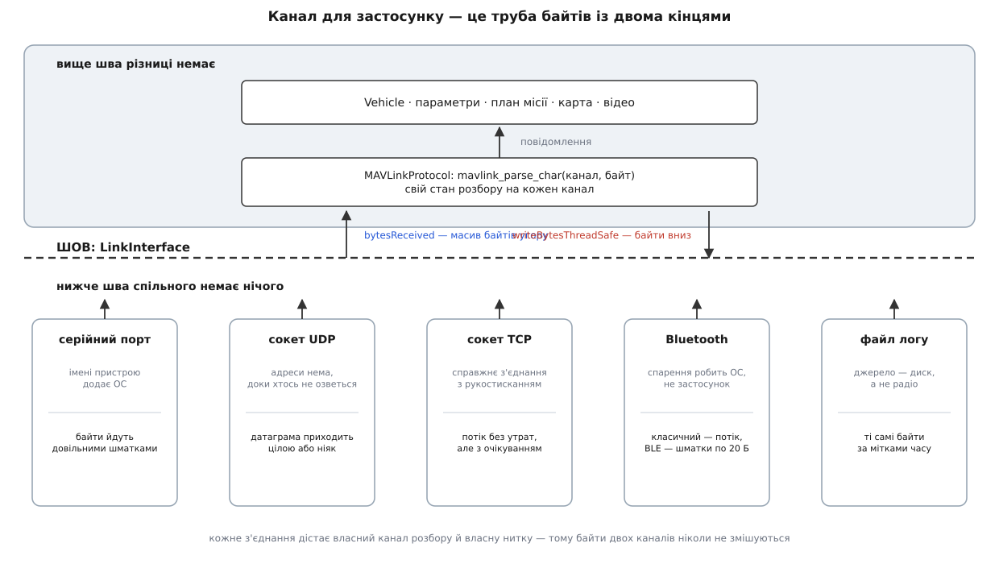
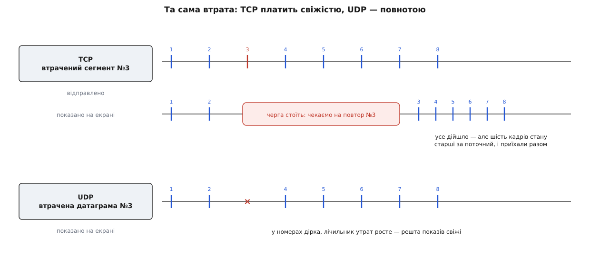

# Типи каналів: серійний, UDP, TCP, Bluetooth

<preknowlist>
- [Пакет MAVLink](topic:communications/mavlink-packet) — з чого складається одне повідомлення телеметрії: стартовий байт, довжина, номер послідовності, контрольна сума.
- [Асинхронний послідовний обмін](topic:communications/async-serial) — кадр UART і швидкість у бодах; спільного тактового сигналу між сторонами немає.
- [Сокети TCP і UDP](topic:programming/sockets-tcp-udp) — прив'язка до порту, датаграма проти потоку, хто починає з'єднання.
- [TCP проти UDP](topic:communications/tcp-vs-udp) — що бере на себе надійна доставка і чим за неї платять.
</preknowlist>

У діалозі з'єднань станція просить вибрати одне з чотирьох: серійний порт, UDP, TCP, Bluetooth. Вибір зроблено — і далі про нього ніхто не питає. Карта не знає, який канал відкрито. Модель апарата не знає. Менеджер параметрів, який тягне з борту тисячу значень, теж не знає. Усі вони бачать одне: потік повідомлень MAVLink, які приходять і які можна відправити.

Різниця між типами при цьому нікуди не дівається — вона просто переїжджає з коду в поведінку. Назовні вона вилазить симптомами, які без знання транспорту виглядають загадково: «станція каже з'єднано, а апарата нема»; «телеметрія йде ривками — постоїть і стрибком наздожене»; «порт зайнятий, хоча нічого не запущено». Кожен такий симптом указує на свій тип каналу.

## Шов: угору йдуть байти

Застосунку від транспорту треба рівно три речі: віддавати байти, щойно вони прийшли, приймати масив байтів на відправлення і чесно казати, коли канал живий, а коли впав. Це і є весь контракт, спільний для серійного каналу, UDP, TCP і Bluetooth.

Ключове тут — «байти», а не «повідомлення». Домовитися про готові кадри було б зручніше, але межі кадру знає лише один транспорт із чотирьох. Сокет UDP видає датаграму — самостійний шматок, у якому лежить рівно те, що відправник поклав в один виклик; межа справжня. Серійний порт меж не має взагалі: драйвер накопичив скількись байтів і віддав, тож у шматку може бути півтора повідомлення. TCP так само віддає потік, у якому межі затерто.

Тому шов бере найменший спільний знаменник — масив байтів — і межу датаграми свідомо викидає. Вище шва єдиний розбирач протягує кожен байт крізь себе й сам знаходить початок кадру за стартовим байтом, довжиною й контрольною сумою.

Здається, що разом із межею ми втратили знання про втрати. Насправді ні: у кадрі MAVLink є лічильник, який відправник збільшує на кожне повідомлення, і розрив у цих номерах видно на рівні протоколу. Пошкоджений шматок не пройде повз контрольну суму. Отже, і про втрати, і про сміття станція дізнається сама — тому шов може дозволити собі бути тупим.

*Вище шва все однакове — і саме тому нижче нього може бути що завгодно: порт, сокет, радіомодуль чи навіть файл.*

Дві дрібниці шва варто знати наперед. Кожне з'єднання дістає власний номер каналу розбору, бо розбирач має стан, і байти двох з'єднань не можна змішувати в одному напівзібраному кадрі ([обробка MAVLink у станції](topic:qgroundcontrol/mavlink-handling)). І кожне з'єднання живе у власній нитці, тому канал, що завис, гальмує лише себе. Окремо варто розрізняти налаштування каналу — ім'я порту, швидкість, адресу — і саме живе з'єднання: перше зберігається й переживає перезапуск, друге створюють і викидають ([менеджер каналів](topic:qgroundcontrol/link-manager)).

> 🔧 **Навіщо це.** Щоб навчити станцію говорити через власний транспорт — фірмову радіолінію, шлюз, тунель, — писати треба не «підтримку нового протоколу», а рівно три речі з контракту. Розбір, модель апарата, план і карта запрацюють без єдиної правки.

## Серійний: адресата немає, є швидкість

Серійний порт — єдиний транспорт, у якому взагалі немає адресата. Що причеплено до дроту, те й співрозмовник. Тож питань лише два: який порт відкрити і з якою швидкістю.

Друге каверзніше, ніж здається. Швидкостей на шляху три, а в діалозі задають одну. Польотний контролер віддає телеметрію своїм UART на швидкості, яку узгоджують прошивка й бортовий радіомодуль. Радіомодуль жене байти в ефір із власним темпом. Наземний модуль приймає й віддає їх у перетворювач USB↔UART — і **лише це останнє з'єднання** описує число, яке ви вводите. Звідси правило: воно має збігатися з тим, що налаштовано в наземному модулі, а не на борту. Модулі сімейства SiK продаються з 57600 на серійному боці, тому це число й стоїть за замовчуванням.

Коли плату під'єднано кабелем USB напряму, правило протилежне: перетворювача немає, контролер оголошує себе системі як віртуальний послідовний порт, байти йдуть шиною пакетами. Число швидкості тут не змінює нічого.

Помилки при неправильній швидкості не буде. У UART немає ні рукостискання, ні підтвердження: приймач просто ділить час на біти за своїм годинником. Тому неспівпадіння дає не повідомлення про помилку, а рівне сміття, яке розбирач мовчки відкидає. Симптом один: канал відкрито, лічильник байтів росте, апарат не з'являється.

Ще одна особливість — порт відкривається монопольно. Скарга «порт зайнятий, хоча я нічого не запускав» майже завжди означає, що його вже тримає інша програма чи системна служба.

## UDP: з'єднання, якого немає

Датаграмний сокет співрозмовника не має. Станція займає локальний порт — типово 14550 — і на цьому «під'єднання» закінчується. Рукостискання не було, на тому боці могло не бути нікого. Тому напис «з'єднано» на каналі UDP означає рівно одне: система дозволила зайняти порт. Про наявність апарата свідчить лише поява серцебиття.

Куди ж тоді слати команди? Адресу станція не налаштовує, а дізнається: коли приходить датаграма, канал запам'ятовує, з якої адреси й порту вона прийшла, і додає цю пару до списку цілей. Далі кожен вихідний масив байтів іде в усі цілі — і вивчені, і задані вручну.

З цього одного правила випливає майже вся поведінка каналу. Він працює крізь домашній маршрутизатор без жодних налаштувань, бо маршрутизатор пропускає відповідь на пакет, який сам щойно випустив назовні — але лише за умови, що апарат озвався першим. Якщо на тому боці стоїть служба, яка чекає першого слова від станції, рятує ручне задання цілі. А чужий, хто озвався, стає постійним отримувачем: запущений поруч симулятор або друга станція діставатимуть копію кожної вашої команди до кінця сеансу.

Про доставку варто сказати прямо, бо саме тут причина, чому UDP на телеметрії головний. Датаграма приходить цілою або не приходить зовсім. Втрата — це просто відсутнє повідомлення, а наступне приходить вчасно й несе свіжий стан. Для потоку, де кожен кадр робить попередній непотрібним, це саме те, що треба.

## TCP: надійність коштує свіжості

Канал TCP влаштований найпростіше: це клієнт, який з'єднується з адресою й портом (типово 5760 — порт симулятора апарата). Стан з'єднання тут справжній, і помилка чесна: у з'єднанні відмовлено, хост недосяжний, час вичерпано.

Але властивість, за яку TCP цінують, для телеметрії обертається проблемою. Він гарантує не лише доставку, а й **порядок**. Загублений шматок транспорт відправить повторно — і до приходу повтору не має права віддати застосунку жодного з тих, що вже прийшли після нього. Вони чекають у буфері.

*Одна й та сама втрата. TCP не втрачає нічого, але наступні кадри стану доходять пачкою й уже застарілими; UDP не доставляє один кадр, зате решта показів лишаються поточними.*

Пілот бачить це так: прилади завмирають на частку секунди, потім стрибком наздоганяють, позначка на карті перестрибує кілька кроків. Показане в момент затримки — брехня. Для потоку станів **застаріла правда гірша за відсутню**.

Тому TCP доречний там, де втрат немає або вони нічого не коштують: симулятор на тій самій машині, міст MAVLink із власним TCP-сервером, перетворювач «серійний порт через мережу», а також мережа, у якій UDP просто не проходить.

## Bluetooth: два транспорти під однією назвою

За одним пунктом списку ховаються дві різні речі. Класичний режим користується профілем послідовного порту: система бере на себе пошук і спарення, а застосунок отримує суцільний потік байтів — для шва це те саме, що відкритий серійний порт, тільки без поняття швидкості.

Режим малого споживання влаштовано інакше: потоку в ньому немає взагалі. Є іменовані значення, у які пишуть і про зміну яких сповіщають, тож байтову трубу доводиться складати самому — вихідні байти ріжуть на шматки за розміром пакета, вхідні збирають назад. Пропускна здатність від цього в рази менша, і тисяча параметрів із борту поїде відчутно довше.

Обидва режими об'єднує те, чого немає в інших транспортів: спарення робить система заздалегідь, а на мобільних платформах застосунок мусить ще й спитати дозвіл у користувача. Разом із дальністю в десятки метрів це й визначає нішу: стіл, стенд і маленькі апарати, з якими працюють із телефона.

## Канал, за яким немає заліза

Найкращий доказ, що шов вибрано правильно, — відтворення журналу. Записана телеметрія це той самий потік байтів, збережений у файл разом із мітками часу; канал відтворення читає файл і видає байти вгору в оригінальному темпі. Для всього застосунку це звичайне з'єднання: з'являється апарат, оживають прилади, малюється трек ([запис телеметрії й відтворення](topic:qgroundcontrol/telemetry-logging)).

Тож вибір типу — це питання не про меню, а про фізику з'єднання. Дріт або пара радіомодулів із серійним виходом — серійний канал, і знати треба лише швидкість наземного модуля. Мережа — UDP, і питання одне: хто озветься першим. Щось, що слухає TCP-порт, — TCP, з платою свіжістю на поганому каналі. Телефон у руках біля апарата — Bluetooth.
