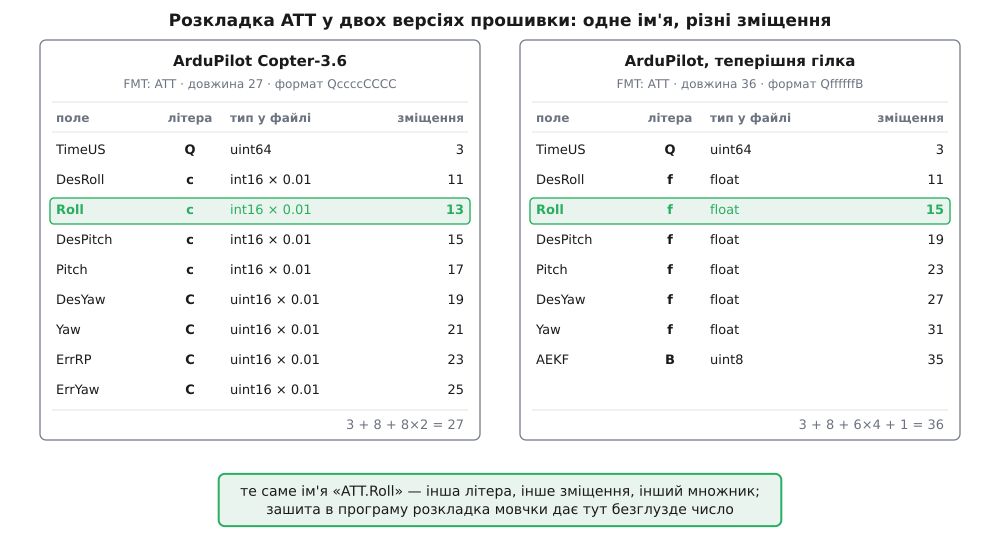
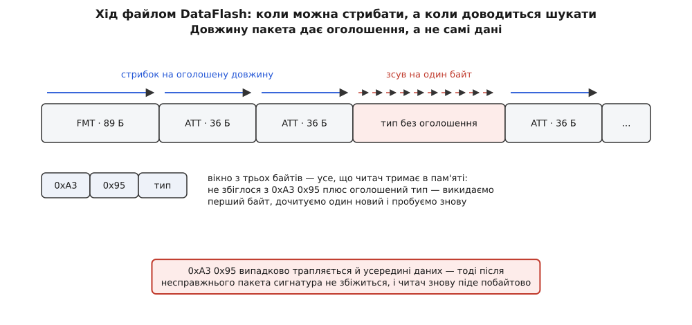

# ⚙️ Мінімальний читач DataFlash: один ряд із `.bin` у CSV

Ось програма на дві з половиною сотні рядків, яка бере бортовий файл ArduPilot і виводить один названий ряд — скажімо, `ATT.Roll` — двома колонками CSV: секунди й значення. Ніде в її коді немає слова «ATT», немає зміщення поля `Roll`, немає таблиці «які повідомлення бувають у логу». Усе це вона дізнається з самого файлу, і саме тому однаково працює з логом п'ятирічної прошивки й учорашньої нічної збірки.

Потреба виникає щоразу, коли з логу треба не подивитися, а порахувати: відняти уставку від виміряного, порівняти два польоти, прогнати ряд через власний фільтр, покласти в таблицю поруч із даними з іншого приладу. Крива на екрані для цього не годиться — потрібні числа. Дві з половиною сотні рядків без жодної зовнішньої залежності дають ці числа й вміщаються всередину будь-якого власного інструмента.

Мова тут не довільна. Читач має справу з невирівняними полями, точними ширинами цілих і потоком байтів, де кожна зайва копія відчутна на півгігабайтному файлі; половина пасток, про які йдеться далі, у мовах із безпечнішою моделлю пам'яті просто не існує, а разом із ними зникає й нагода їх показати. Тому — C++17 і стандартна бібліотека, без Qt і без будь-яких інших залежностей.

## Одна річ, яку доводиться знати наперед

Формат самоописовий: файл спершу оголошує свої структури, а вже потім кладе за ними дані. Читач будує розбирач із прочитаного — [самоописовий формат](topic:programming/self-describing-format) саме про це: опис розкладки їде разом із даними, а не живе в коді того, хто читає.

Але самоопис не буває безоднею. Щоб прочитати оголошення, треба знати розкладку **оголошення**, і десь ця рекурсія мусить упертися в дно. У DataFlash дно завширшки рівно вісімдесят дев'ять байтів.

Оголошення — це пакет типу 128 на ім'я `FMT`, і його власна будова закріплена назавжди:

```
0xA3 0x95 0x80 | Type(1) Length(1) Name(4) Format(16) Labels(64)
      3        +   1    +    1    +   4   +    16    +    64      = 89 байтів
```

У термінах самого формату ця розкладка записується рядком `BBnNZ` із підписами `Type,Length,Name,Format,Columns` — тобто **FMT описується власним словником літер**. Це дає приємну економію: та сама процедура, що розбирає всі інші оголошення, розбирає й початкове; зашитими лишаються п'ять літер, одне число 89 і одне число 128.

Файл до того ж містить пакет `FMT`, який оголошує сам `FMT`. Він не потрібен — ми вже все знаємо, — і його варто свідомо пропускати: якщо в пошкодженому файлі це оголошення виявиться зіпсованим, воно не має права затерти дно рекурсії.

## Чому розкладку не можна зашити

Спокуса зазирнути у файл шістнадцятковим редактором, побачити, що `Roll` лежить за зміщенням 13, і написати `p + 13` виглядає розумною економією. Ось що з неї виходить.

Повідомлення `ATT` в ArduPilot Copter-3.6 оголошено рядком формату `QccccCCCC` — час у мікросекундах і вісім кутових величин, кожна збережена як ціле число сотих часток градуса. У теперішній гілці те саме `ATT` оголошено як `QffffffB`: ті самі кути, але вже звичайними числами з рухомою комою, а замість двох полів похибки з'явилося однобайтове поле активного оцінювача.



*Ліворуч і праворуч — одне й те саме повідомлення того самого автопілота; різниця лише у версії прошивки.*

Порахуймо, що прочитає програма зі старим `p + 13`, якщо дати їй новий лог.

**Дано: новий формат `QffffffB`, апарат тримає крен 12.5° при уставці 1.0°.**

```
DesRoll = 1.0f   → 3F 80 00 00 → у файлі (молодший байт першим): 00 00 80 3F
                   зміщення 11 … 14
Roll    = 12.5f  → 41 48 00 00 → у файлі:                        00 00 48 41
                   зміщення 15 … 18

старий читач бере два байти за зміщенням 13:  80 3F
                        як int16 (молодший перший):  0x3F80 = 16256
                        літера «c» велить поділити на 100:  162.56

у колонці CSV опиниться крен 162.56° замість 12.5°
```

Помилки не сталося. Файл не пошкоджено, програма не впала, попередження не вивелося — просто число тепер брехливе, і виглядає воно достатньо схоже на кут, щоб йому повірити. Ось чому розкладку беруть із файлу, навіть коли здається, що вона відома.

## Рядок формату стає таблицею зміщень

Уся змінна частина розбору вміщається в один словник: літера → скільки байтів, як тлумачити, на що помножити. Літер двадцять, і кілька з них — не просто тип, а тип із множником: `c` та `C` — це двобайтові цілі, поділені на сто, `e` та `E` — чотирибайтові, поділені на сто, `L` — чотирибайтове ціле, поділене на десять мільйонів, тобто широта чи довгота в градусах. Так дробові величини клали у файл, коли зайвий байт на кожне поле був відчутною ціною; це звичайна [фіксована кома](topic:programming/fixed-point), тільки масштаб оголошено літерою, а не окремим полем.

Зміщення з цього словника виводяться самі: перше поле починається одразу за трибайтовим заголовком, кожне наступне — за попереднім. Ніякого вирівнювання немає, структури в прошивці оголошені упакованими, тож `float` спокійно починається за непарним зміщенням.

І тут виникає перевірка, заради якої варто робити цей прохід окремою функцією: **сума розмірів усіх полів плюс три мусить дорівнювати довжині, оголошеній у тому самому `FMT`**. Якщо не дорівнює — або в рядку формату трапилася літера, якої ми не знаємо, або наша таблиця розмірів розійшлася з прошивкою. У будь-якому разі всі зміщення після цього місця з'їдуть, і чесна відмова від цілого повідомлення набагато корисніша за колонку правдоподібного сміття.

```cpp
// dfcsv.cpp — витягти один ряд «ПОВІДОМЛЕННЯ.Поле» з бортового логу ArduPilot у CSV.
// Збірка: c++ -std=c++17 -O2 -o dfcsv dfcsv.cpp
#include <cstdint>
#include <cstdio>
#include <cstdlib>
#include <cstring>
#include <fstream>
#include <map>
#include <string>
#include <vector>

namespace {

constexpr uint8_t HEAD1    = 0xA3;
constexpr uint8_t HEAD2    = 0x95;
constexpr uint8_t FMT_TYPE = 128;   // номер FMT закріплено форматом назавжди
constexpr size_t  HDR      = 3;     // 0xA3, 0x95 і байт типу

// Що каже одна літера рядка формату: скільки байтів, як тлумачити, на що множити.
struct Letter {
    uint8_t size;   // байтів у пакеті
    char    kind;   // 'i' ціле зі знаком, 'u' без знаку, 'f' дробове,
                    // 's' рядок, 'x' масив — не одне число
    double  mult;   // множник, зашитий у саму літеру
};

bool letterInfo(char c, Letter &out) {
    switch (c) {
    case 'b': out = {  1, 'i', 1.0  }; return true;
    case 'B': out = {  1, 'u', 1.0  }; return true;
    case 'M': out = {  1, 'u', 1.0  }; return true;   // номер режиму польоту
    case 'h': out = {  2, 'i', 1.0  }; return true;
    case 'H': out = {  2, 'u', 1.0  }; return true;
    case 'c': out = {  2, 'i', 0.01 }; return true;
    case 'C': out = {  2, 'u', 0.01 }; return true;
    case 'i': out = {  4, 'i', 1.0  }; return true;
    case 'I': out = {  4, 'u', 1.0  }; return true;
    case 'e': out = {  4, 'i', 0.01 }; return true;
    case 'E': out = {  4, 'u', 0.01 }; return true;
    case 'L': out = {  4, 'i', 1e-7 }; return true;   // широта або довгота
    case 'f': out = {  4, 'f', 1.0  }; return true;
    case 'd': out = {  8, 'f', 1.0  }; return true;
    case 'q': out = {  8, 'i', 1.0  }; return true;
    case 'Q': out = {  8, 'u', 1.0  }; return true;
    case 'n': out = {  4, 's', 1.0  }; return true;
    case 'N': out = { 16, 's', 1.0  }; return true;
    case 'Z': out = { 64, 's', 1.0  }; return true;
    case 'a': out = { 64, 'x', 1.0  }; return true;   // int16_t[32]
    default:  return false;
    }
}

struct Field  { std::string label; size_t off; char code; Letter type; };
struct Layout { std::string name; uint8_t length = 0; std::vector<Field> fields; };
```

Далі — сам перехід від оголошення до таблиці полів і читання одного числа за зміщенням.

```cpp
std::vector<std::string> splitLabels(const std::string &s) {
    std::vector<std::string> out;
    for (size_t start = 0;;) {
        const size_t comma = s.find(',', start);
        if (comma == std::string::npos) { out.push_back(s.substr(start)); break; }
        out.push_back(s.substr(start, comma - start));
        start = comma + 1;
    }
    return out;
}

// Рядок формату плюс підписи → таблиця полів зі зміщеннями від початку пакета.
bool buildLayout(const std::string &format, const std::string &labels, Layout &lay) {
    const std::vector<std::string> names = splitLabels(labels);
    size_t off = HDR;
    lay.fields.clear();
    for (size_t k = 0; k < format.size(); ++k) {
        Letter t;
        if (!letterInfo(format[k], t)) return false;   // чужа літера — далі все з'їде
        lay.fields.push_back({ k < names.size() ? names[k] : std::string(),
                               off, format[k], t });
        off += t.size;
    }
    return off == lay.length;      // сума полів мусить збігтися з оголошеною довжиною
}

// Число за зміщенням, зведене до double. memcpy — бо поля в пакеті не вирівняні.
double readNumber(const uint8_t *p, const Letter &t) {
    double raw = 0.0;
    switch (t.kind) {
    case 'i': {
        int64_t v = 0;
        if      (t.size == 1) { int8_t  x; std::memcpy(&x, p, 1); v = x; }
        else if (t.size == 2) { int16_t x; std::memcpy(&x, p, 2); v = x; }
        else if (t.size == 4) { int32_t x; std::memcpy(&x, p, 4); v = x; }
        else                  { int64_t x; std::memcpy(&x, p, 8); v = x; }
        raw = static_cast<double>(v);
        break;
    }
    case 'u': {
        uint64_t v = 0;
        if      (t.size == 1) { uint8_t  x; std::memcpy(&x, p, 1); v = x; }
        else if (t.size == 2) { uint16_t x; std::memcpy(&x, p, 2); v = x; }
        else if (t.size == 4) { uint32_t x; std::memcpy(&x, p, 4); v = x; }
        else                  { uint64_t x; std::memcpy(&x, p, 8); v = x; }
        raw = static_cast<double>(v);
        break;
    }
    case 'f':
        if (t.size == 4) { float  x; std::memcpy(&x, p, 4); raw = x; }
        else             { double x; std::memcpy(&x, p, 8); raw = x; }
        break;
    default:
        return 0.0;                // рядок чи масив числом не буває
    }
    return raw * t.mult;
}

// Рядок у пакеті займає рівно size байтів і нульового байта може не мати.
std::string readText(const uint8_t *p, size_t size) {
    size_t n = 0;
    while (n < size && p[n] != '\0') ++n;
    return std::string(reinterpret_cast<const char *>(p), n);
}

// Єдина розкладка, яку доводиться знати наперед: FMT описує сам себе.
Layout fmtLayout() {
    Layout lay;
    lay.name   = "FMT";
    lay.length = 89;                                   // 3 + 1 + 1 + 4 + 16 + 64
    if (!buildLayout("BBnNZ", "Type,Length,Name,Format,Columns", lay)) std::abort();
    return lay;
}

} // namespace
```

## Хід файлом: коли можна стрибати, а коли доводиться шукати

Пакет починається парою `0xA3 0x95`, за нею йде байт типу. Довжини в пакеті **немає** — вона є тільки в його оголошенні. Звідси випливає ціла механіка проходу.

Поки тип оголошений, усе просто: беремо довжину з таблиці, дочитуємо тіло, і наступний пакет починається рівно там, де скінчився попередній. Тіло аналізувати не треба взагалі — стрибок робиться наосліп.

Але щойно трапляється тип, для якого `FMT` ще не зустрівся, довжину взяти нізвідки. Пропустити пакет неможливо, бо невідомо, скільки в ньому байтів. Лишається єдиний вихід: зсунутися на **один** байт і спробувати знову — і так доти, доки не збіжиться і сигнатура, і оголошений тип.



*Той самий цикл робить обидві речі; різниця лише в тому, чи знайшовся тип у таблиці розкладок.*

Практично це означає, що читачеві досить вікна з трьох байтів — усе, що він тримає в пам'яті між пакетами. Не збіглося — викидаємо перший байт, зсуваємо два інших, дочитуємо один новий.

Наскільки це небезпечно? Пара `0xA3 0x95` — це шістнадцять бітів, тож у випадкових даних вона трапляється часто:

```
одна пара на 2¹⁶ = 65536 позицій
у файлі 30 МБ:  30·10⁶ / 65536 ≈ 460 випадкових збігів
```

Чотириста шістдесят фальшивих початків на файл — здавалося б, вирок. Насправді ні, і причина повчальна: **у рівному ході ці збіги ніхто не розглядає**. Читач стоїть точно на межі пакета й дивиться саме на три байти заголовка; випадкова пара всередині чужого тіла ніколи не потрапляє йому на очі. Ризик існує тільки в ті проміжки, коли синхронізацію вже втрачено, — і там він реальний: несправжній «пакет» з'їсть шматок файлу, після нього сигнатура не збіжиться, і пошук піде далі. При цьому пропаде кілька справжніх записів.

Рятує від цього дисципліна самого формату: оголошення завжди йде **перед** своїми даними, бо журнал пишеться послідовно. Тож невідомий тип трапляється тільки тоді, коли початок файлу втрачено, — завантаження з апарата урвалося або читання почалося з середини. У цілому файлі більшість оголошень проходить одразу після відкриття журналу, а решта — перед першим своїм записом.

Форматів, де цієї біди немає взагалі, теж вистачає: якщо межу запису позначити байтом, який усередині даних не може трапитися за побудовою — як у [кадруванні COBS](topic:communications/cobs-framing), — пошук межі стає точним, а не ймовірнісним. У DataFlash межу позначено звичайною парою байтів; це дешевше на боці прошивки, і плата за дешевину виходить саме тут.

## Головний цикл

```cpp
int main(int argc, char **argv) {
    if (argc != 3) {
        std::fprintf(stderr, "вжиток: dfcsv <лог.bin> <ATT.Roll | IMU[1].GyrX>\n");
        return 2;
    }
    const std::string spec = argv[2];
    const size_t dot = spec.rfind('.');
    if (dot == std::string::npos || dot + 1 == spec.size()) {
        std::fprintf(stderr, "очікую вигляд ATT.Roll або IMU[1].GyrX\n");
        return 2;
    }
    const std::string wantField = spec.substr(dot + 1);
    std::string wantMsg = spec.substr(0, dot);
    int wantInstance = -1;                        // −1 означає «байдуже»
    const size_t brk = wantMsg.find('[');
    if (brk != std::string::npos) {
        wantInstance = std::atoi(wantMsg.c_str() + brk + 1);
        wantMsg.erase(brk);
    }

    std::ifstream in(argv[1], std::ios::binary);
    if (!in) { std::fprintf(stderr, "не відкривається: %s\n", argv[1]); return 1; }
    std::streambuf *src = in.rdbuf();

    std::map<uint8_t, Layout> layouts;
    layouts[FMT_TYPE] = fmtLayout();

    int      wantType  = -1;                      // з'явиться разом з оголошенням
    size_t   idxValue  = 0, idxTime = 0, idxInst = 0;
    bool     hasTime   = false, hasInst = false;
    double   timeScale = 1e-6;
    uint64_t rows = 0, slides = 0;

    std::vector<uint8_t> pkt;
    uint8_t win[HDR];
    size_t  have = 0;
    bool    running = true;

    while (running) {
        while (have < HDR) {                      // добираємо вікно до трьох байтів
            const int c = src->sbumpc();
            if (c == std::char_traits<char>::eof()) { running = false; break; }
            win[have++] = static_cast<uint8_t>(c);
        }
        if (!running) break;

        const auto it = layouts.find(win[2]);
        if (win[0] != HEAD1 || win[1] != HEAD2 || it == layouts.end()) {
            win[0] = win[1];                      // зсув вікна на один байт
            win[1] = win[2];
            have   = HDR - 1;
            ++slides;
            continue;
        }

        const uint8_t type = win[2];
        const size_t  len  = it->second.length;
        pkt.assign(len, uint8_t{0});
        std::memcpy(pkt.data(), win, HDR);
        for (size_t k = HDR; k < len; ++k) {
            const int c = src->sbumpc();
            if (c == std::char_traits<char>::eof()) { running = false; break; }
            pkt[k] = static_cast<uint8_t>(c);
        }
        if (!running) break;                      // обірваний хвіст файлу
        have = 0;

        if (type == FMT_TYPE) {
            const Layout &f = layouts.at(FMT_TYPE);
            const uint8_t newType = static_cast<uint8_t>(
                readNumber(pkt.data() + f.fields[0].off, f.fields[0].type));
            if (newType == FMT_TYPE) continue;    // FMT про самого себе — уже знаємо

            Layout lay;
            lay.length = static_cast<uint8_t>(
                readNumber(pkt.data() + f.fields[1].off, f.fields[1].type));
            lay.name = readText(pkt.data() + f.fields[2].off, f.fields[2].type.size);
            const std::string format =
                readText(pkt.data() + f.fields[3].off, f.fields[3].type.size);
            const std::string labels =
                readText(pkt.data() + f.fields[4].off, f.fields[4].type.size);

            if (!buildLayout(format, labels, lay)) {
                std::fprintf(stderr, "пропущено %s: «%s» не дає %u байтів\n",
                             lay.name.c_str(), format.c_str(), unsigned(lay.length));
                continue;
            }
            layouts[newType] = lay;

            if (lay.name != wantMsg || wantType >= 0) continue;

            size_t v = SIZE_MAX, tUS = SIZE_MAX, tMS = SIZE_MAX;
            for (size_t k = 0; k < lay.fields.size(); ++k) {
                const std::string &l = lay.fields[k].label;
                if (l == wantField)              v   = k;
                if (l == "TimeUS")               tUS = k;
                if (l == "TimeMS")               tMS = k;
                if (l == "I" || l == "Instance") { idxInst = k; hasInst = true; }
            }
            if (v == SIZE_MAX) {
                std::string all;
                for (const Field &fl : lay.fields) { all += fl.label; all += ' '; }
                std::fprintf(stderr, "у %s немає поля «%s». Є: %s\n",
                             wantMsg.c_str(), wantField.c_str(), all.c_str());
                return 1;
            }
            if (lay.fields[v].type.kind == 's' || lay.fields[v].type.kind == 'x') {
                std::fprintf(stderr, "%s — не число (літера %c)\n",
                             spec.c_str(), lay.fields[v].code);
                return 1;
            }
            if (hasInst && wantInstance < 0)
                std::fprintf(stderr, "увага: %s має поле екземпляра «%s» — у виводі "
                                     "змішано всі; вкажіть %s[0].%s, щоб узяти один\n",
                             wantMsg.c_str(), lay.fields[idxInst].label.c_str(),
                             wantMsg.c_str(), wantField.c_str());

            idxValue = v;
            if      (tUS != SIZE_MAX) { idxTime = tUS; timeScale = 1e-6; hasTime = true; }
            else if (tMS != SIZE_MAX) { idxTime = tMS; timeScale = 1e-3; hasTime = true; }
            wantType = newType;
            std::printf("%s,%s\n", hasTime ? "time_s" : "n", spec.c_str());
            continue;
        }

        if (static_cast<int>(type) != wantType) continue;

        const Layout &lay = layouts.at(type);
        if (hasInst && wantInstance >= 0) {
            const Field &fi = lay.fields[idxInst];
            if (static_cast<int>(readNumber(pkt.data() + fi.off, fi.type)) != wantInstance)
                continue;
        }
        const Field &fv = lay.fields[idxValue];
        const double value = readNumber(pkt.data() + fv.off, fv.type);
        if (hasTime) {
            const Field &ft = lay.fields[idxTime];
            const double t = readNumber(pkt.data() + ft.off, ft.type) * timeScale;
            std::printf("%.6f,%.9g\n", t, value);
        } else {
            std::printf("%llu,%.9g\n", static_cast<unsigned long long>(rows), value);
        }
        ++rows;
    }

    if (wantType < 0) {
        std::fprintf(stderr, "у логу немає оголошення повідомлення %s\n", wantMsg.c_str());
        return 1;
    }
    std::fprintf(stderr, "рядків: %llu, байтів проскочено вхолосту: %llu\n",
                 static_cast<unsigned long long>(rows),
                 static_cast<unsigned long long>(slides));
    return 0;
}
```

У роботі це має такий вигляд:

```
$ ./dfcsv 00000042.BIN ATT.Roll > roll.csv
рядків: 24118, байтів проскочено вхолосту: 41

$ head -3 roll.csv
time_s,ATT.Roll
412.703125,12.5
412.713047,12.6199999
412.723041,12.7399998
```

Дев'ята значуща цифра тут — не дані, а слід перетворення: `float` несе близько семи десяткових цифр, решту домалювало переведення в `double`. Формат `%.7g` друкує рівно те, що у файлі справді записано.

> 🔧 **Навіщо це.** Коли ряд потрібен для арифметики, а не для ока, зайві цифри шкідливі вдвічі: вони роздувають файл і створюють враження точності, якої в датчика немає. Ставте стільки знаків, скільки несе тип у логу, — сім для `f`, а для `c` чи `e` взагалі два, бо в файлі лежить ціле число сотих.

## Скільки це коштує

Прохід один, і він лінійний за розміром файлу: на кожен байт припадає порівняння з сигнатурою, а на кожен пакет — один пошук у впорядкованому словнику з десятків чи сотні типів. Витрати впираються в швидкість читання з диска, а не в розбір; якщо цього мало, побайтове `sbumpc` замінюють на читання блоками по сто кілобайтів і хід по блоку, а логіка вікна лишається тією самою.

Пам'ять же тут стала — і це найцікавіше в оцінці.

```
довжина пакета — поле uint8, отже пакет не буває довший за 255 байтів
буфер одного пакета:                                    ≤ 255 Б
таблиця розкладок: ~120 типів × ~20 полів × ~64 Б      ≈ 150 КБ
вивід іде в потік і не накопичується                     0

файл 30 МБ  →  ті самі ≈ 150 КБ
файл 500 МБ →  ті самі ≈ 150 КБ
```

Причина проста: ми нічого не тримаємо. Читач не будує словника рядів, не складає точок у вектори, не дає стрибнути на довільну секунду — він переливає один ряд із файлу в потік виводу. Той, хто хоче потім бачити будь-яке поле без повторного проходу, платить пам'яттю у кілька разів більшою за сам файл; той, кому треба одна колонка, не платить нічим. Це звичайний обмін пам'яті на свободу доступу, і тут вибрано протилежний його бік.

## Пастки

**Множники живуть у літері, і забути їх легко.** Літери `c`, `C`, `e`, `E` дають число, поділене на сто, `L` — поділене на десять мільйонів. Пропущений множник не викликає ні збою, ні попередження: крен 12.5° перетвориться на 1250, широта 50.45° — на 504500000. Помилку в широті видно одразу, бо градусів такої величини не буває; помилку в крені — ні, бо 1250 однаково скидається на показ приладу, і хіба що зіставлення з уставкою натякне, що щось не так.

**Одиниці й множники оголошено ще раз — і подвоювати їх не можна.** Сучасні логи додатково несуть пакети `UNIT`, `MULT` та `FMTU`: перший розшифровує позначки одиниць, другий — позначки множників, третій прив'язує до конкретного типу пакета два рядки таких позначок, по літері на кожне поле. Множник там застосовується до **сирого** значення в файлі, тобто вже враховує ту «сотню», що заховалася в літері `c`. Це два способи дізнатися той самий масштаб, а не два масштаби поспіль; помножити на обидва — отримати значення, менше за справжнє в сто разів. Наш читач бере множник із літери й пакети метаданих ігнорує.

**Кілька приладів можуть жити в одному потоці.** Повідомлення `IMU` в теперішній прошивці оголошено як `QBffffffIIfBBHH` з підписами `TimeUS,I,GyrX,GyrY,GyrZ,AccX,AccY,AccZ,EG,EA,T,GH,AH,GHz,AHz`, і друге поле `I` — це номер приладу. Три гіроскопи пишуть у той самий тип пакета по черзі, тож `IMU.GyrX` без відбору дасть колонку, у якій перемішано три різні датчики: сусідні рядки належать різним приладам, і будь-яка похідна від такого ряду — вигадка. Саме тому програма попереджає про наявність поля екземпляра й розуміє запис `IMU[1].GyrX`.

**Невирівняне читання — не дрібниця.** Поля в пакеті упаковані щільно, тож `float` починається за зміщенням 15, а `uint64_t` — за зміщенням 3. Взяти таке значення через `*reinterpret_cast<const float *>(p + 15)` — [порушити вимоги вирівнювання](topic:programming/memory-alignment): на x86 воно найчастіше спрацює, на частині ARM-збірок дасть пастку процесора, а компілятор із увімкненою оптимізацією має право припустити, що такого не буває, і зробити з цим що завгодно. `std::memcpy` у локальну змінну — не перестраховка, а єдина законна дорога; на всіх поширених платформах вона перетворюється на ту саму одну інструкцію завантаження.

**Порядок байтів припущено, а не перевірено.** У файлі молодший байт лежить першим, і `memcpy` копіює байти як є — тобто програма мовчки вимагає, щоб машина, на якій вона працює, теж була [молодшим байтом уперед](topic:programming/bits-bytes-endianness). Для x86 і звичайних ARM це так; на машині з протилежним порядком кожне число вийде переставленим, і знову без жодного попередження. Чесний захист — перевірка порядку байтів під час запуску та перестановка в `readNumber`.

**Рядки не завжди мають нульовий байт.** Ім'я повідомлення займає рівно чотири байти, і чотирилітерне `RFND` заповнює їх повністю, не лишаючи місця на завершальний нуль. Читати таке поле функціями, що шукають нуль самі, означає прихопити наступні шістнадцять байтів рядка формату. Тому довжина рядка тут завжди обмежена оголошеним розміром поля.

**Час є не в кожному повідомленні.** Домовленість «перше поле — `TimeUS`, мікросекунди від увімкнення» тримається майже скрізь, але не всюди: у самому `FMT` часу немає, а в старих логах трапляється `TimeMS` у мілісекундах. Читач шукає поле **за іменем**, а не за позицією, віддає перевагу мікросекундам і має запасний вихід — нумерувати рядки, коли часу немає зовсім. Перша колонка при цьому лишається монотонним лічильником від увімкнення живлення: дати в ньому немає, і щоб покласти ряд поруч із чимось зовнішнім, потрібен окремий перерахунок за супутниковим часом.

**Хвіст файлу буває обірваним.** Живлення зникає посеред запису, і останній пакет лишається недописаним; так виглядає більшість логів після справді цікавих польотів. Читач має зупинитися на цьому спокійно — не видавати половину пакета за рядок і не вважати обрив помилкою.

**`double` тримає не всяке ціле.** Зведення всіх типів до одного дробового зручне, але шістдесятичотирибітне ціле більше за 2⁵³ у нього не влазить без округлення — [числа з рухомою комою](topic:programming/floating-point) мають скінченну мантису. Для мікросекунд це не біда (2⁵³ мкс — понад двісті вісімдесят років), а от лічильники подій, контрольні суми й ідентифікатори, оголошені як `Q`, з такого читача виходять приблизними. Якщо потрібне точне ціле, його треба брати з пакета окремою гілкою, минаючи `double`.
