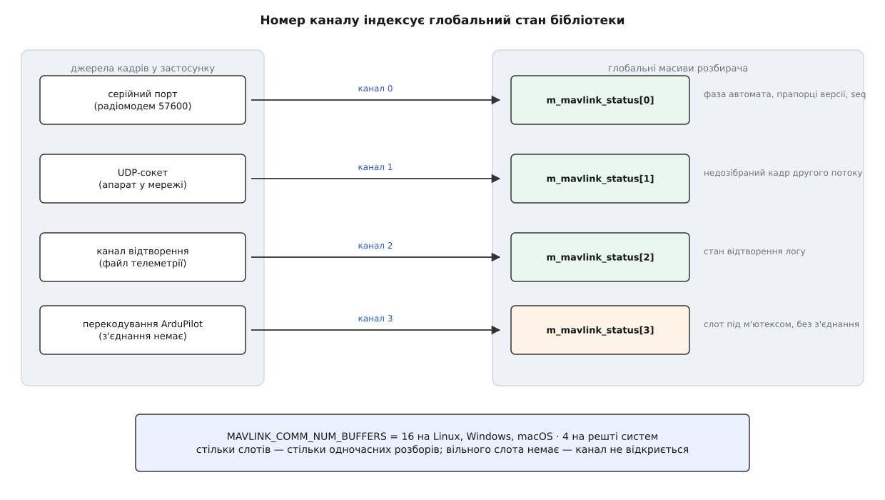
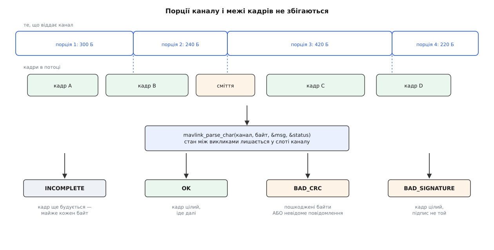
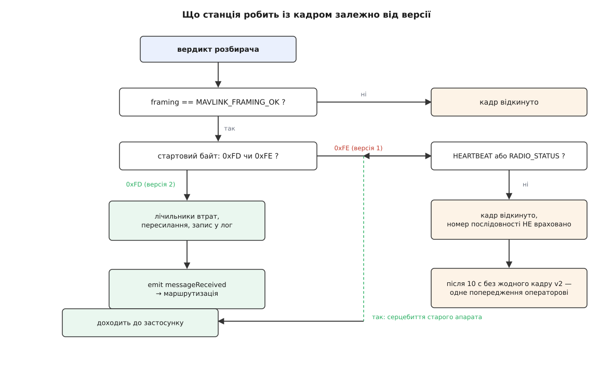
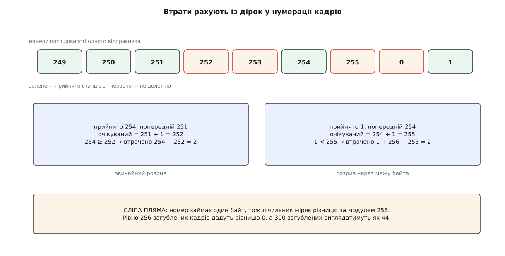

# Обробка MAVLink: розбір, версії, канали

<preknowlist>
- [Пакет MAVLink](book:communications/mavlink-packet) — будова кадру: стартовий байт, довжина, номер послідовності, ідентифікатори системи й компонента, навантаження, контрольна сума.
- [Розбір потоку](book:programming/stream-parser) — інкрементний розбирач, що приймає байти порціями довільного розміру й не втрачає стану між порціями.
- [Машина станів](book:programming/state-machine) — скінченний набір станів і переходи між ними за подіями.
- [CRC](book:communications/crc) — циклічна надлишкова сума: що саме вона ловить і чого не ловить.
- [Нумерація послідовності пакетів](book:communications/sequence-numbering) — навіщо відправник нумерує пакети й що з цих номерів видно отримувачу.
- [Модульна арифметика](book:math/modular-arithmetic) — обчислення за модулем і те, як поводиться різниця чисел, які переповнюються.
</preknowlist>

Усе, що станція знає про апарат, вона знає з байтів. Але канал — послідовний порт, UDP-сокет, TCP-з'єднання чи файл записаної телеметрії — віддає застосунку не повідомлення, а порцію байтів: стільки, скільки встигло накопичитися в драйвері до моменту читання. Розмір цієї порції задає операційна система й темп трафіку, а не протокол. Три властивості такої порції визначають усе подальше.

Порція може містити **пів кадру**: решта прийде наступним читанням, за мілісекунду або за пів секунди. Порція може містити **кілька кадрів і хвіст четвертого**. І перша порція після відкриття порту може містити **сміття**: залишок чужого протоколу, шум від увімкнення живлення апарата, кілька байтів завантажувача.

Звідси випливає вимога до розбирача, яку не обійти: він мусить споживати потік **побайтово**, зберігати недозібраний кадр між викликами й уміти відновлюватися з довільної позиції в потоці. Саме такий інтерфейс і дає бібліотека MAVLink:

```c
uint8_t mavlink_parse_char(uint8_t chan, uint8_t c,
                           mavlink_message_t *r_message,
                           mavlink_status_t *r_status);
```

Один байт усередину — вердикт назовні. Станція нічого до цього не додає: її обробник вхідних даних — це цикл по байтах порції.

```cpp
for (uint8_t byte : data) {
    const uint8_t mavlinkChannel = link->mavlinkChannel();
    mavlink_message_t message{};
    mavlink_status_t status{};

    const uint8_t framing = mavlink_parse_char(mavlinkChannel, byte, &message, &status);
    ...
}
```

Найважливіше в цьому рядку — перший аргумент. Він і є те місце, де живе недозібраний кадр.

## Канал — це слот стану, а не з'єднання

Розбирач MAVLink написаний на C і не має об'єкта. Фаза автомата, лічильник прийнятих байтів, буфер, у який складається кадр, поточний номер послідовності, прапорці, покажчик на ключ підпису — усе це лежить у **глобальних масивах, проіндексованих номером каналу**. `mavlink_parse_char` не приймає структури зі станом; він приймає індекс у цих масивах. Тому канал — не з'єднання й не абстракція протоколу, а **пронумерований слот глобального стану розбирача** (детальніше про природу такої конструкції — [глобальний стан](book:programming/global-state)).

З цього визначення одразу випливає правило, яке інакше виглядало б формальністю: **двом каналам зв'язку не можна ділити один номер**. Радіомодем і USB-кабель несуть два незалежні потоки байтів; у момент, коли з модема прийшло пів кадру, з кабелю може прийти початок іншого. Спільний слот склеїв би обидва недокадри в один, і на виході була б не помилка, а мовчазне сміття: контрольна сума не зійшлася б, кадр зник би, а причини в журналі не було б.

Тому станція веде облік слотів руками — бітовою маскою зайнятих:

```cpp
uint8_t LinkManager::allocateMavlinkChannel()
{
    for (uint8_t mavlinkChannel = 0; mavlinkChannel < MAVLINK_COMM_NUM_BUFFERS; mavlinkChannel++) {
        if (_mavlinkChannelsUsedBitMask & (1 << mavlinkChannel)) {
            continue;
        }

        mavlink_reset_channel_status(mavlinkChannel);
        mavlink_status_t* const mavlinkStatus = mavlink_get_channel_status(mavlinkChannel);
        mavlinkStatus->flags |= MAVLINK_STATUS_FLAG_OUT_MAVLINK1;
        _mavlinkChannelsUsedBitMask |= (1 << mavlinkChannel);
        return mavlinkChannel;
    }
    return invalidMavlinkChannel();
}
```

Скидання стану перед видачею — не гігієна, а необхідність: слот міг лишитися після попереднього з'єднання з половиною кадру всередині, і перший же байт нового каналу продовжив би чужий кадр.

Кількість слотів фіксована на етапі збірки заголовками бібліотеки:

```c
#if (defined linux) | (defined __linux) | (defined  __MACH__) | (defined _WIN32)
# define MAVLINK_COMM_NUM_BUFFERS 16
#else
# define MAVLINK_COMM_NUM_BUFFERS 4
#endif
```

Шістнадцять на настільних системах, чотири на решті — і це жорстка стеля одночасних з'єднань станції, а не порада. Коли слотів немає, канал просто не відкриється.



*Номер каналу індексує глобальні масиви бібліотеки; слот потрібен усьому, що розбирає або кодує кадри, — не лише з'єднанням.*

Що канал — це саме слот стану, а не з'єднання, найкраще видно там, де слот витрачають без жодного з'єднання. Розширення для апаратів ArduPilot переписує деякі вхідні повідомлення (зокрема значення параметрів і текстові статуси) перед тим, як віддати їх решті застосунку. Перекодування — це теж робота з каналом, бо кодувальник бере з нього номер послідовності й прапорці версії. Тому розширення тримає **окремий зарезервований канал** і бере його під м'ютекс:

```cpp
const uint8_t channel = _reencodeMavlinkChannel();
QMutexLocker reencode_lock{&_reencodeMavlinkChannelMutex()};
mavlink_status_t *mavlinkStatusReEncode = mavlink_get_channel_status(channel);
mavlinkStatusReEncode->flags |= MAVLINK_STATUS_FLAG_IN_MAVLINK1;
```

М'ютекс тут з'явився саме тому, що слот один, а охочих переписати кадр може бути кілька — звичайна [потокова безпека](book:programming/thread-safety) навколо спільного ресурсу.

> 🔧 **Навіщо це.** Додаючи станції новий тип каналу, ви зобов'язані взяти номер при створенні й повернути при знищенні — інакше через кілька перепідключень маска вичерпається й нові з'єднання почнуть тихо не відкриватися. Розбирати той самий номер із двох ниток не можна взагалі: бібліотека потокобезпечна лише **в межах каналу**, і саме тому [весь розбір у станції зібрано в одну нитку](book:qgroundcontrol/threading-model).

## Чотири вердикти й одна пастка в них

Кожен байт повертає одне з чотирьох значень:

```c
typedef enum {
    MAVLINK_FRAMING_INCOMPLETE=0,
    MAVLINK_FRAMING_OK=1,
    MAVLINK_FRAMING_BAD_CRC=2,
    MAVLINK_FRAMING_BAD_SIGNATURE=3
} mavlink_framing_t;
```

Перше значення повертається на переважній більшості байтів і означає «кадр ще не добудовано». Друге — «кадр цілий, забирай». Третє й четверте — дві різні причини відмови, і плутати їх не варто: погана сума означає пошкоджені або чужі байти, поганий підпис — цілий кадр із неправильним криптографічним підписом.

Пастка в третьому. У MAVLink контрольна сума рахується не лише по байтах кадру: у неї домішується ще один байт — `CRC_EXTRA`, обчислений із **самого опису повідомлення**: з імен і типів полів. Ідея красива: якщо два боки зібрані з різних описів того самого повідомлення, сума не зійдеться, і кадр із неправильно розкладеними полями буде відкинуто замість того, щоб перетворитися на правдоподібні, але хибні числа на екрані.

Ціна цієї ідеї — розбирач мусить **знати опис**, щоб перевірити суму. Знання лежить у таблиці, згенерованій зі словника повідомлень при збірці; для невідомого номера запису в таблиці немає, і автомат іде найкоротшим шляхом:

```c
const mavlink_msg_entry_t *e = mavlink_get_msg_entry(rxmsg->msgid);
if (e == NULL) {
    // Message not found in CRC_EXTRA table.
    status->parse_state = MAVLINK_PARSE_STATE_GOT_BAD_CRC1;
```

Наслідок практичний і неочевидний: **повідомлення, якого немає в збірці станції, для неї не існує** — не як «незрозуміле повідомлення», а як зіпсований кадр. Ані попередження, ані запису в журналі: лічильник поганих сум трохи підріс, і все. Саме тому QGroundControl збирають із діалектом `all.xml`, який містить усі діалекти репозиторію MAVLink і дозволяє говорити і з PX4, і з ArduPilot. Своє повідомлення, яке ви завели в окремому [діалекті](book:communications/mavlink-dialect), станція мовчки викидатиме, доки ви не зберете її з цим діалектом — процедура описана в темі про [власні MAVLink-повідомлення](book:qgroundcontrol/custom-mavlink-messages).

Друге правило, що працює на тій самій межі «розумію — не розумію», стосується прапорців несумісності в заголовку версії 2:

```c
rxmsg->incompat_flags = c;
if ((rxmsg->incompat_flags & ~MAVLINK_IFLAG_MASK) != 0) {
    // message includes an incompatible feature flag
    _mav_parse_error(status);
```

Кадр, що використовує невідому розбирачеві властивість, відкидається одразу, ще до навантаження. Це навмисна асиметрія: невідомі **сумісні** прапорці ігноруються, невідомі **несумісні** вбивають кадр. Без такого правила будь-яке майбутнє розширення формату (як свого часу підпис) перетворювало б старі станції на генератор правдоподібної нісенітниці.



*Межі порцій, які віддає канал, не мають нічого спільного з межами кадрів; стан між порціями зберігає слот каналу.*

## Дві версії в одному потоці

Версію кадру видно з першого ж байта: `0xFE` — це версія 1, `0xFD` — версія 2. Один автомат розбирає обидві й позначає прапорцем, що саме він щойно зібрав:

```c
if (c == MAVLINK_STX)
{
    status->parse_state = MAVLINK_PARSE_STATE_GOT_STX;
    rxmsg->magic = c;
    status->flags &= ~MAVLINK_STATUS_FLAG_IN_MAVLINK1;
} else if (c == MAVLINK_STX_MAVLINK1)
{
    status->parse_state = MAVLINK_PARSE_STATE_GOT_STX;
    rxmsg->magic = c;
    status->flags |= MAVLINK_STATUS_FLAG_IN_MAVLINK1;
}
```

Прапорець `IN_MAVLINK1` — це не налаштування, а **звіт про останній кадр**: він перевстановлюється на кожному стартовому байті. Тому в одному каналі версії можуть чергуватися, і це нормальний стан, а не помилка.

Вихідний бік описує **окремий** прапорець `OUT_MAVLINK1` у тому самому слоті. Він і вирішує, у якому форматі кодувальник збере наступне повідомлення. Станція піднімає його в момент видачі каналу — тобто перші кадри, які вона кидає в щойно відкрите з'єднання, ідуть у старому форматі.

Логіка цього вибору стає зрозумілою, якщо подивитися на дзеркальний бік. Апарат теж не знає наперед, із ким говорить, і теж мусить із чогось почати. Специфікація радить почати з версії 1 і перейти на версію 2, коли в каналі вперше з'явиться кадр версії 2. В ArduPilot це рівно один умовний оператор:

```cpp
if (!(status.flags & MAVLINK_STATUS_FLAG_IN_MAVLINK1) &&
    (status.flags & MAVLINK_STATUS_FLAG_OUT_MAVLINK1) &&
    (mavlink_protocol == AP_SerialManager::SerialProtocol_MAVLink2 ||
     mavlink_protocol == AP_SerialManager::SerialProtocol_MAVLinkHL)) {
    // if we receive any MAVLink2 packets on a connection
    // currently sending MAVLink1 then switch to sending
    // MAVLink2
    _channel_status.flags &= ~MAVLINK_STATUS_FLAG_OUT_MAVLINK1;
}
```

Домовленість тримається на односторонньому спостереженні: побачив у каналі новий формат — переходь на новий формат, нічого не питаючи й ні на що не чекаючи. QGroundControl історично робив те саме симетричним рядком у розборі; у журналі станції це видно повідомленням «Switching outbound to mavlink 2.0 due to incoming mavlink 2.0 packet». Обидві сторони починають зі старого формату й піднімаються до нового після першого ж кадру, що це дозволяє.

## Кадр версії 1 сьогодні

Домовленість про поступове піднімання версії мала сенс, доки станція розуміла обидві. У версії 5.0 QGroundControl **прибрав підтримку MAVLink 1**: за документацією проєкту, підтримку застарілого протоколу видалено, і застосунок тепер вимагає MAVLink 2.

У коді розбору це один короткий фільтр:

```cpp
const bool isV1 = (status.flags & MAVLINK_STATUS_FLAG_IN_MAVLINK1);
if (isV1 && (message.msgid != MAVLINK_MSG_ID_HEARTBEAT) &&
    (message.msgid != MAVLINK_MSG_ID_RADIO_STATUS)) {
    link->reportMavlinkV1Traffic();
    continue;
}
```

Три речі тут варті пояснення, бо кожна — наслідок конкретної причини.

**Чому кадр не просто ігнорують, а й не рахують.** Номер послідовності в MAVLink спільний для обох версій: відправник веде один лічильник на пару «система, компонент», хоч у якому форматі він зараз кодує. Якби станція пропускала кадри версії 1 повз обробку, але враховувала їхні номери, розрив у нумерації перетворився б на фантомні втрати. Тому такий кадр вибуває з циклу цілком, до всіх лічильників.

**Чому вцілів `HEARTBEAT`.** Це єдиний спосіб узагалі дізнатися, що на тому кінці хтось є. Якби станція викидала й серцебиття, з'єднання зі старим апаратом виглядало б як мертвий канал — жодної підказки, що робити. Замість цього станція бачить життя, розуміє, що воно говорить старим форматом, і може сказати про це людині.

**Чому вцілів `RADIO_STATUS`.** Це повідомлення надсилає не апарат, а наземний радіомодем — і прошивка модемів SiK **завжди** надсилає його як кадр версії 1, навіть коли апарат уже перейшов на версію 2. Історія тут повчальна: колись станція, побачивши такий кадр, робила зворотний висновок і **опускала** канал до версії 1, поки цю поведінку не вимкнули окремою правкою. Викинути `RADIO_STATUS` означало б лишити оператора без рівня сигналу й лічильника втрат у радіоканалі.

Повідомити людину про старий апарат теж виявилося непросто. Прошивки ArduPilot стартують у версії 1 і піднімаються до версії 2 лише після того, як отримають кадр версії 2 від станції, — отже, перші секунди будь-якого нормального з'єднання виглядають як «апарат говорить застарілим протоколом». Попередження, видане одразу, було б хибним щоразу. Тому воно відкладене:

```cpp
void LinkInterface::reportMavlinkV1Traffic()
{
    if (_mavlinkV1TrafficReported || _mavlinkV2TrafficSeen) {
        return;
    }

    if (!_mavlinkV1FirstSeenTimer.isValid()) {
        _mavlinkV1FirstSeenTimer.start();
    }
    if (_mavlinkV1FirstSeenTimer.elapsed() < _mavlinkV1TrafficGraceMsecs) {
        return;
    }
    _mavlinkV1TrafficReported = true;
    ...
}
```

Пільговий час — десять секунд за замовчуванням; якщо за цей час у каналі з'явився хоч один кадр версії 2, попередження не з'явиться ніколи. Інакше оператор отримує повідомлення, яке прямо називає канал і те, що з ним робити.



*Версія 1 доходить далі лише двома повідомленнями, і кожне з них уціліло з окремої практичної причини.*

## Скільки з ефіру не долетіло

Кадр, що пройшов усі перевірки, спершу потрапляє в лічильники. Їхнє завдання — не діагностика протоколу, а оцінка **якости радіоканалу**, і роблять її з єдиного доступного джерела: дірок у нумерації.

```cpp
uint8_t& lastSeq = _lastIndex[mavlinkChannel][message.sysid][message.compid];

const QPair<uint8_t, uint8_t> key(message.sysid, message.compid);
uint8_t expectedSeq;
if (!_firstMessageSeen[mavlinkChannel].contains(key)) {
    _firstMessageSeen[mavlinkChannel].insert(key);
    expectedSeq = message.seq;
} else if (message.seq == lastSeq) {
    return;
} else {
    expectedSeq = lastSeq + 1;
}

uint64_t lostMessages;
if (message.seq >= expectedSeq) {
    lostMessages = message.seq - expectedSeq;
} else {
    lostMessages = static_cast<uint64_t>(message.seq) + 256ULL - expectedSeq;
}
_totalLossCounter[mavlinkChannel] += lostMessages;
```

Кожен рядок тут закриває конкретну діру.

Історія ведеться **на трійку «канал, система, компонент»**, бо нумерує кожен відправник свою. Автопілот, камера й підвіс на одному апараті мають три незалежні лічильники; складати їх в один означало б бачити суцільні розриви там, де все ціле.

**Перше повідомлення від нового відправника** не є втратою. Станція під'єдналася посеред польоту й побачила номер 137 — це не сто тридцять сім загублених кадрів, а просто перше, що вона почула. Тому перша зустріч заводить очікуваний номер рівним отриманому й дає нуль втрат.

**Повтор того самого номера** не рахується взагалі. Той самий кадр цілком може прийти двічі: два маршрути до станції, увімкнене пересилання, дубль у мережі. Різниця номерів дала б від'ємне значення, яке в беззнаковій арифметиці перетворилося б на величезне число — ознака класичного [беззнакового переповнення](book:programming/unsigned-overflow). Явна перевірка на рівність прибирає цей випадок.

**Перехід через нуль** обробляє додавання 256, бо номер займає один байт і рахується за модулем 256.

**Приклад: п'ять кадрів у ефірі, два з них не долетіли.**

```
попередній прийнятий номер lastSeq = 251
очікуваний номер           = 251 + 1 = 252 (за модулем 256)
прийшов кадр з номером     = 254
254 ≥ 252 → втрачено = 254 − 252 = 2

наступний прийшов з номером = 1  (253, 254 → 255, 0, 1)
очікуваний                  = 254 + 1 = 255
1 < 255 → втрачено = 1 + 256 − 255 = 2
```

Обидва розриви пораховано правильно, хоч другий перетнув межу байта. Тут же видно й сліпу пляму методу: рівно 256 підряд загублених кадрів дадуть різницю нуль і не будуть помічені зовсім, а 300 загублених виглядатимуть як 44. На реальних частотах телеметрії такий провал — це секунди повної тиші, які видно й без лічильника, тож ціна прийнятна; повний розбір похибок цієї оцінки, зокрема згладжування й затримку показника, — у [математиці лічильника втрат](book:qgroundcontrol/mavlink-handling/math-loss-counting.md).

Останній крок перетворює абсолютні числа у відсоток, яким користується індикатор якости зв'язку:

```cpp
const uint64_t totalSent = _totalReceiveCounter[mavlinkChannel] + _totalLossCounter[mavlinkChannel];
const float currentLossPercent = (static_cast<double>(_totalLossCounter[mavlinkChannel]) / totalSent) * 100.0f;
_runningLossPercent[mavlinkChannel] = (currentLossPercent + _runningLossPercent[mavlinkChannel]) * 0.5f;
```

Останній рядок — [експоненційне згладжування](book:algorithms/moving-average) з коефіцієнтом 0.5: нове значення рівно наполовину складається з попереднього. Показник за побудовою відстає від дійсности, зате не смикається від кожного кадру. А сам сигнал в інтерфейс іде не щоразу, а на кожному тридцять першому повідомленні: індикаторові потрібен темп, а не подія.



*Номер послідовності — єдине джерело, з якого станція взагалі може дізнатися про те, чого не отримала.*

## Підпис і чому історію нумерації скидають

Кадр із неправильним підписом бібліотека відрізняє від кадру з поганою сумою окремим вердиктом — і станція навмисно **не викидає його одразу**:

```cpp
if (framing == MAVLINK_FRAMING_OK || framing == MAVLINK_FRAMING_BAD_SIGNATURE) {
    if (SigningController* const sigCtrl = link->signing()) {
        if (sigCtrl->processFrame(framing == MAVLINK_FRAMING_OK, message)) {
            resetSequenceTracking(link);
        }
    }
}
if (framing != MAVLINK_FRAMING_OK) {
    continue;
}
```

Причина в тому, що підписаний трафік із нерозпізнаним ключем — це не обов'язково атака, а найчастіше просто ще не підібраний ключ. Контролер підпису бачить такі кадри, щоб автоматично впізнати серед відомих ключів потрібний; сам кадр далі все одно не йде — наступні три рядки його відкидають. Механіку самого підпису — ключ, мітку часу, ідентифікатор каналу — описує [MAVLink v2 і підпис](book:communications/mavlink-v2-signing).

Цікавий тут повернений `true` і його наслідок. Якщо ключ щойно підібрано, вся попередня історія номерів стає непотрібною: до цієї миті станція відкидала підписані кадри, тобто в її нумерації утворилася дірка розміром у всі відкинуті. Без скидання перший же прийнятий після підбору кадр дав би стрибок лічильника втрат, і оператор побачив би провал зв'язку там, де насправді щойно налагодилася автентифікація. Тому історія нумерації каналу очищається:

```cpp
void MAVLinkProtocol::resetSequenceTracking(LinkInterface* link)
{
    const uint8_t channel = link->mavlinkChannel();
    _firstMessageSeen[channel].clear();
    std::memset(_lastIndex[channel], 0, sizeof(_lastIndex[channel]));
}
```

Очищення множини «кого вже бачили» повертає кожного відправника в стан «перша зустріч» — і наступний його кадр знову задасть початок відліку замість розриву.

## Куди йде цілий кадр

Прийнятий кадр робить три речі, і порядок між ними не випадковий.

**Пересилання.** Якщо ввімкнено пересилання MAVLink на сторонній вузол, копія кадру йде туди. Одне повідомлення виключене з пересилання назавжди:

```cpp
if (message.msgid == MAVLINK_MSG_ID_SETUP_SIGNING) {
    return;
}
```

`SETUP_SIGNING` несе **ключ підпису**. Переслати його на сторонній порт означало б віддати ключ будь-кому, хто слухає той порт, — тобто зруйнувати саму мету підпису одним рядком налаштувань. Пересилання, до речі, одностороннє: те, що прийде з чужого вузла назад, станція ігнорує.

**Запис.** Кадр лягає у файл телеметрії таким, яким прийшов, — це і робить можливим пізніше [відтворення логу](book:qgroundcontrol/telemetry-logging) як звичайного каналу.

**Доставка.** Аж тепер кадр іде далі сигналом `messageReceived`, і починається [маршрутизація за ідентифікаторами системи й компонента](book:qgroundcontrol/message-routing), яка вирішує, якому [об'єктові апарата](book:qgroundcontrol/vehicle-object) це повідомлення належить.

І тут ховається пастка, через яку цикл по байтах має право обірватися посеред порції. Доставка повідомлення виконується **синхронно**: у тому самому виклику, усередині того самого циклу, спрацьовують обробники апарата, оновлюються факти, можуть створитися й знищитися об'єкти. Одне з таких повідомлень цілком здатне призвести до розриву з'єднання — а цикл тримає на канал звичайний покажчик. Тому станція перед кожним кроком перевіряє, чи канал іще комусь потрібен, за лічильником посилань спільного покажчика:

```cpp
if (linkPtr.use_count() == 1) {
    return false;   // → break у циклі по байтах
}
```

Одиниця означає, що єдина жива посилка на канал — та, яку тримає цей цикл. Решта байтів порції втрачається, і це правильно: вони належать з'єднанню, якого вже немає. Спроба продовжити розбір скінчилася б зверненням до звільненої пам'яті.

Зворотний напрям простіший, бо в ньому немає невизначености. Станція кодує повідомлення у той самий слот каналу — звідти беруться номер послідовності вихідного потоку й прапорець версії, — а готові байти віддає каналу на запис. Свій ідентифікатор системи (за замовчуванням 255) станція теж бере з налаштувань один раз на застосунок, а не на канал.

Головне ж, що варто винести з усього шляху від байта до повідомлення: **канал MAVLink — це не з'єднання, а пронумерована пам'ять розбирача**. Скільки слотів зайнято — стільки незалежних потоків байтів застосунок здатен тримати одночасно; що записано в слоті — те й визначає, у якій версії піде наступний кадр і чи не склеїться він із чужим. Робочий приклад такого розбирача з нуля — з розривами порцій, лічильником вердиктів і підрахунком дірок у нумерації — у [проєкті «розбирач на каналі»](book:qgroundcontrol/mavlink-handling/proj-parse-channel.md).
