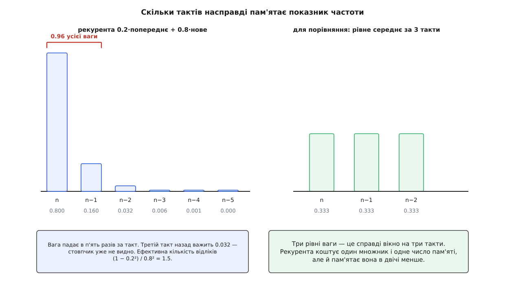
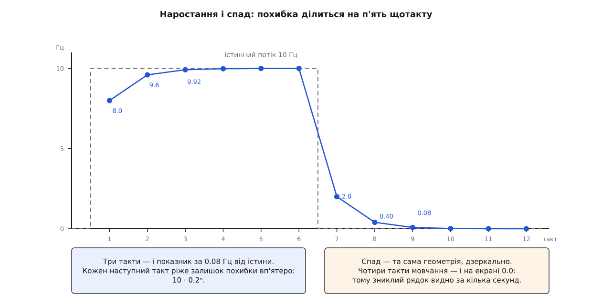
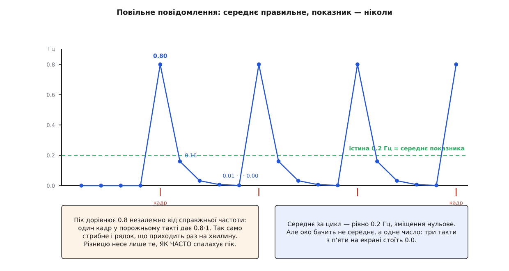

# 🧮 Математика оцінювача частоти: пам'ять у півтора такти

Стовпчик герців коло кожного рядка інспектора рахується однією стрічкою — новий показник дорівнює 0.2 попереднього плюс 0.8 кількості кадрів за останній такт секундного таймера. З цієї стрічки виводяться три числа, і ними вичерпно визначено все, що показник робить на екрані: ефективна пам'ять у півтора відліки, зниження випадкового розкиду лише на 18 % і стале запізнення на чверть такту. Нижче вони виведені й перевірені, а з них уже випливають практичні наслідки — скільки секунд чекати після зміни налаштувань потоку, чому повільні повідомлення пилкою стрибають між 0.8 і нулем, і за що саме заплачено відмовою від оцінювання за проміжками між кадрами.

## Рекурента як зважена сума минулого

Занумеруймо такти таймера числами n = 1, 2, 3 … Позначмо через cₙ кількість кадрів цього повідомлення, що прийшли протягом такту n. Такт триває рівно секунду, тому cₙ — це вже частота в герцах, тільки груба й цілочислова. Показник rₙ — те, що стоїть у стовпчику після такту n. Уся арифметика вміщується в одне співвідношення:

```
rₙ = β·rₙ₋₁ + α·cₙ,    α = 0.8,  β = 1 − α = 0.2,  r₀ = 0
```

Це [експоненційне згладжування](topic:math/exponential-smoothing): нове значення змішують зі старим у сталій пропорції, тож пам'ять про минуле не обривається, а згасає геометрично, і вся вона вміщується в одне число замість масиву відліків. Коефіцієнт α задає, наскільки сильно свіжий відлік тягне показник до себе.

Розкрутімо рекуренту на кілька кроків назад, підставляючи замість rₙ₋₁ його власний вираз, потім те саме для rₙ₋₂:

```
rₙ = α·cₙ + β·(α·cₙ₋₁ + β·rₙ₋₂)
   = α·cₙ + αβ·cₙ₋₁ + αβ²·cₙ₋₂ + …
```

Загальна замкнена форма:

```
rₙ = α · Σ(k = 0 … n−1) βᵏ · cₙ₋ₖ  +  βⁿ · r₀
```

Отже показник — не «згладжене» число в якомусь розпливчастому сенсі, а звичайне зважене середнє останніх тактів, у якого ваги падають геометрично:

```
k:        0       1       2        3         4         5
α·βᵏ:   0.800   0.160   0.032    0.0064    0.00128   0.000256
```

Сума цих ваг — [геометрична прогресія](topic:math/geometric-series), тобто сума виду 1 + β + β² + …, яка при |β| < 1 дорівнює 1/(1 − β), а обірвана на n доданках — (1 − βⁿ)/(1 − β):

```
Σ(k = 0 … n−1) α·βᵏ = α·(1 − βⁿ)/(1 − β) = 1 − βⁿ
```

Звідси одразу два висновки, і другий важливіший.

По-перше, при n → ∞ сума ваг прямує до одиниці. Це справжнє зважене середнє, а не будь-яка сума з коефіцієнтами: на сталому потоці показник збігається саме до істинної частоти, без систематичного зміщення.

По-друге, на перших тактах сума ваг дорівнює 1 − βⁿ, тобто **менша** за одиницю. Бракує рівно βⁿ — і це вага початкового r₀ = 0. Заниження на старті не є якимось «запізненням фільтра»: це буквально зайвий відлік зі значенням нуль, який ще не встиг згаснути. Різниця не словесна, бо лікуються ці дві речі по-різному. Стартове заниження знімається одним діленням — на суму ваг, що вже накопичилася, тобто на 1 − βⁿ; після такої поправки вже перший такт показував би рівно стільки кадрів, скільки їх прийшло, а не 0.8 від цього числа. Запізнення від згладжування тим самим прийомом не знімається взагалі, бо воно не є нестачею ваги.

Тепер головне число. Наскільки довгу пам'ять має такий оцінювач? Відповідь дає ефективна кількість відліків — скільки рівноправних вимірів дали б такий самий розкид, як цей набір ваг:

```
Nₑ = (Σ wₖ)² / Σ wₖ²,   ваги нормовані:  Σ wₖ = 1
Σ wₖ² = α² · Σ β²ᵏ = α²/(1 − β²)
Nₑ = (1 − β²)/α² = (1 − 0.04)/0.64 = 0.96/0.64 = 1.5
```

Півтора відліки. Два перші доданки суми — поточний такт і попередній — разом дають 0.96 усієї ваги; третій такт назад важить 0.032 і на око вже не існує. Це фільтр лише за назвою: він пам'ятає на пів такту більше, ніж якби показував сирий лічильник.



*Два останні такти несуть 0.96 відповіді; для порівняння — рівне вікно на три такти з вагами по 0.333.*

## Наростання й спад: похибка ділиться на п'ять щотакту

Хай потік рівний, cₙ = c для всіх n. Тоді за замкненою формою rₙ = c·(1 − βⁿ), а похибка

```
eₙ = c − rₙ = c · βⁿ = c · 0.2ⁿ
```

Кожен такт множить залишок похибки на 0.2. Відносна похибка δₙ = 0.2ⁿ не залежить від самої частоти: з нуля до 3 Гц і з нуля до 300 Гц показник іде однакову кількість тактів. Скільки саме:

```
n = ln δ / ln 0.2
δ = 0.1   →  n = 1.43  →  2 такти
δ = 0.01  →  n = 2.86  →  3 такти
δ = 0.001 →  n = 4.29  →  5 тактів
```

Похибка падає на порядок за 1.43 такту; стала часу τ = −1/ln 0.2 = 0.62 такту.

**Приклад: рядок мовчав, потім пішов рівний потік 25 кадрів за секунду.**

```
такт 1:  0.2·0.000  + 0.8·25 = 20.000    похибка 5.000
такт 2:  0.2·20.000 + 0.8·25 = 24.000    похибка 1.000
такт 3:  0.2·24.000 + 0.8·25 = 24.800    похибка 0.200
такт 4:  0.2·24.800 + 0.8·25 = 24.960    похибка 0.040
```

На четвертому такті показник збігається з істиною з точністю до десятої частки герца — тобто до останньої цифри, яку взагалі видно на екрані.

Спад — та сама геометрія, дзеркально. Коли потік уривається, cₙ = 0 і рекурента перетворюється на чисте множення: rₙ = r₀·0.2ⁿ. З 25 Гц: 5.0, 1.0, 0.2, 0.04. Три такти мовчання лишають від двадцяти п'яти герців дві десятих, четвертий такт стирає й їх. Саме тому список сам собою показує, хто зник: жодної окремої перевірки «давно не приходило» в коді немає, згасання дає її задарма.

І тут варто чесно розділити внески. Три такти установлення — не вина коефіцієнта. Навіть при α = 1, тобто взагалі без згладжування, показник не може з'явитися раніше, ніж за один повний такт: щоб порахувати кадри за секунду, треба чекати секунду. Рекурента додає два такти до неусувної підлоги в один. Отже вибір α впливає на затримку менше, ніж сам розмір вікна.



*Похибка множиться на 0.2 щотакту в обидва боки; спад до нуля — той самий процес, що й наростання.*

## Стале відставання, коли потік повзе

Рівний потік — ідеалізація. Реальніший випадок: справжня частота повільно змінюється. Прошивка вміє сама притишувати потоки, коли радіомодем не встигає — ArduPilot читає з поля txbuf повідомлення RADIO_STATUS, наскільки заповнено передавальний буфер модема, і зменшує частоти відповідно. Тож повільне сповзання частоти вниз — робочий сценарій, а не вправа.

Змоделюймо його прямою: істинна частота на такті n дорівнює λₙ = λ₀ + a·n, тобто щотакту змінюється на a герців. Питання: на скільки показник відстає, коли перехідний процес уже минув?

Припустімо, що усталений розв'язок має вигляд rₙ = λₙ − Δ зі сталим Δ, і підставмо в рекуренту:

```
λ₀ + a·n − Δ = β·(λ₀ + a·(n−1) − Δ) + α·(λ₀ + a·n)
```

Оскільки α + β = 1, доданки λ₀ і a·n у правій частині складаються рівно в λ₀ + a·n і скорочуються з лівою. Лишається:

```
−Δ = −β·a − β·Δ
Δ = β·a/α = 0.2·a/0.8 = a/4
```

Відставання дорівнює чверті приросту за такт — і воно стале, доки триває сповзання. Якщо прошивка знімає 2 Гц щосекунди, показник увесь час стоїть на 0.5 Гц вище за істину.

Те саме число можна дістати з іншого боку — як центр ваги набору ваг:

```
Σ(k ≥ 0) k · α·βᵏ = α·β/(1 − β)² = 0.8·0.2/0.64 = 0.25
```

Зважене середнє центроване на чверть такту в минуле, тому й на лінійному тренді воно показує те, що було чверть такту тому. Два незалежні шляхи дають 0.25 — це і є перевірка викладки.

Але чверть такту — не вся затримка. Сама кількість кадрів за такт є середнім по інтервалу, а середнє по інтервалу віднесене до його середини, тобто вже пів такту в минуле. Разом близько 0.75 с, і згладжування становить у цій сумі лише третину. Дві третини затримки дає саме відро, і жоден вибір α їх не чіпає.

## Розкид: чому згладжування майже не згладжує

Тепер випадковість. Візьмімо найзручнішу модель надходження — [пуассонівський процес](topic:math/poisson-process) з інтенсивністю λ кадрів за секунду: кадри приходять незалежно один від одного, а кількість їх у вікні сталої довжини має розподіл Пуассона, у якого середнє й дисперсія збігаються. Для секундного вікна це означає, що cₙ незалежні між тактами й

```
E[cₙ] = λ,   Var[cₙ] = λ
```

Через замкнену форму показник — лінійна комбінація незалежних величин, тож [середнє й дисперсія](topic:math/mean-variance) рахуються прямо: середнє складається з вагами, дисперсія — з квадратами ваг.

```
E[r] = α·λ·Σβᵏ = α·λ/(1 − β) = λ

Var[r] = α²·λ·Σβ²ᵏ = α²·λ/(1 − β²)
```

Оскільки α = 1 − β, знаменник розкладається на (1 − β)(1 + β) = α·(1 + β), і одне α скорочується:

```
Var[r] = λ · α/(1 + β) = λ · 0.8/1.2 = (2/3)·λ
```

Оцінка незміщена, а дисперсія становить дві третини дисперсії сирого лічильника. У стандартних відхиленнях це √(2/3) = 0.816 — зниження розкиду на 18 %. І ще одна перевірка: відношення дисперсій 2/3 означає ефективну кількість відліків 1/(2/3) = 1.5, те саме число, що вийшло з ваг.

**Приклад: справжня частота 10 Гц, пуассонівське надходження.**

```
σ(cₙ) = √10   = 3.16 Гц      — розкид сирого лічильника
σ(rₙ) = √(20/3) = 2.58 Гц    — розкид показника, 26 % від показу
```

Щоб побачити, де α = 0.8 стоїть на шкалі можливого, порахуймо кілька варіантів. Відношення дисперсій дорівнює α/(2 − α), ефективна пам'ять — (2 − α)/α, час установлення до 1 % — ln 0.01 / ln(1 − α):

```
α       Var[r]/Var[c]     Nₑ       установлення до 1 %
1.0         1.000        1.0            1 такт
0.8         0.667        1.5            3 такти
0.5         0.333        3.0            7 тактів
0.2         0.111        9.0           21 такт
```

Для α = 1 формула установлення дає нуль тактів, а в таблиці стоїть один — це той самий неусувний такт самого вікна, який фільтр не додає і не забирає.

Значення 0.8 сидить майже впритул до «жодного фільтра». Воно віддає 18 % розкиду в обмін на два зайві такти — а вже 0.5 віддало б 42 % в обмін на шість. Отже зменшення шуму не було метою.

Метою було інше, і видно це, якщо покинути пуассонівську модель. Потік MAVLink породжує планувальник прошивки, який надсилає повідомлення за розкладом, а не випадково. Для строго періодичного потоку з частотою λ кількість кадрів у секундному вікні набуває лише двох значень — ⌊λ⌋ або ⌊λ⌋ + 1. Це не пуассонівський шум, а миготіння останньої цифри від того, що вікно не збігається з періодом.

Що робить із таким миготінням рекурента, видно з її частотної характеристики. Співвідношення rₙ = β·rₙ₋₁ + α·cₙ — це [БІХ-фільтр першого порядку](topic:algorithms/iir-filter), тобто фільтр із зворотним зв'язком, у якого вихід залежить від власного попереднього виходу; його передавальна функція й коефіцієнт передачі на краях смуги такі:

```
H(z) = α/(1 − β·z⁻¹)
|H| на нульовій частоті (ω = 0):   α/(1 − β) = 0.8/0.8 = 1
|H| на найвищій (ω = π):           α/(1 + β) = 0.8/1.2 = 2/3
```

Стала складова проходить незмінною — інакше оцінка була б зміщена. Найшвидше можливе миготіння, коли лічильник стрибає щотакту, придушується рівно до двох третин.

**Приклад: справжня частота 10.5 Гц, кадри рівномірні.** Лічильник дає 10, 11, 10, 11 …

```
… 0.2·10.833 + 0.8·10 = 10.167
   0.2·10.167 + 0.8·11 = 10.833
```

Розмах був 1.000, став 0.667. А ось випадок повільнішого биття — 10.2 Гц, коли зайвий кадр припадає на кожен п'ятий такт:

```
10.800 → 10.160 → 10.032 → 10.006 → 10.001 → 10.800 → …
```

Розмах 0.80 — на п'яту частину менший за сирий. Тобто придушення миготіння лежить між нулем і третиною, і в типовому випадку ближче до нуля.

Виграш насправді в іншому, і він не кількісний. Показник перестав бути цілим числом. Послідовність 10.80 → 10.16 → 10.03 → 10.01 читається як вимір, що встоюється, а послідовність 10 ↔ 11 читається як зламаний індикатор. Смикання те саме, вигляд різний — і при цьому жодного обману немає, бо кожне з проміжних чисел є чесним зваженим середнім.

Практичну шкалу дає одне спостереження: одиничний зайвий кадр зсуває показник рівно на α = 0.8 Гц незалежно від частоти. Відносне миготіння — приблизно 0.8/λ:

```
λ = 20 Гц  →   4 %
λ = 10 Гц  →   8 %
λ =  5 Гц  →  16 %
λ =  2 Гц  →  40 %
λ =  1 Гц  →  80 %
```

Понад 8 Гц показник стоїть твердо до десятої частки. Нижче за 3 Гц він помітно танцює. А що робиться нижче за один герц, варто розібрати окремо.

## Повільні повідомлення: пилка з піком 0.8

Хай кадр приходить раз на P тактів, тобто істинна частота λ = 1/P < 1 Гц. Більшість тактів дають cₙ = 0, один такт із P дає одиницю.

Показник виходить на цикл, і цей цикл легко знайти точно. Нехай A — значення відразу після такту з кадром. Далі P − 1 тактів воно просто множиться на β, тож перед наступним приходом стоїть A·β^(P−1). Наступний прихід дає:

```
A = β·(A·β^(P−1)) + α·1 = β^P·A + α
A = α/(1 − β^P)
```

Для P = 5: A = 0.8/(1 − 0.00032) = 0.80026. Уже при P ≥ 5 різниці з α не видно навіть у третьому знаку. **Пік не залежить від частоти зовсім.** Повідомлення раз на п'ять секунд і повідомлення раз на хвилину дають на екрані однакове 0.8.

Повний цикл при P = 5 (істина 0.2 Гц):

```
0.8003 → 0.1601 → 0.0320 → 0.0064 → 0.0013 → 0.8003 → …
```

Тепер порахуймо середнє показника за цикл. Сума членів циклу — та сама геометрична прогресія:

```
(1/P) · A · (1 + β + … + β^(P−1))
  = (1/P) · [α/(1 − β^P)] · [(1 − β^P)/α]
  = 1/P = λ
```

І α, і (1 − β^P) скорочуються начисто. Середнє того, що стоїть на екрані, дорівнює істинній частоті **точно** — для будь-якого P, без наближень і без зміщення. Формально оцінювач бездоганний.

Але око не усереднює за часом: воно бачить одне число. З одним знаком після коми при P = 5 читач бачить 0.8 один такт із п'яти, 0.2 один такт із п'яти й 0.0 решту три. Середнє дорівнює 0.2, найчастіше показуване значення — нуль, а сама істина з'являється на екрані одну п'яту частину часу. Незміщена оцінка з неправильною модою — саме те, що на екрані виглядає як несправність.

Гірше того, вся інформація про частоту переїхала в місце, де оцінювач її не бачить. Висота піку стала 0.8 для всіх повільних рядків; відрізняє їх тільки те, **як часто** пік спалахує. А підрахунок частоти спалахів — це рівно те завдання, задля якого оцінювач і будувався.

Полагодити це підбором α не вийде, і межа тут не інженерна, а принципова. Пам'ять оцінювача — Nₑ = 1.5 такту. Щоб розрізнити період завдовжки P тактів, потрібна пам'ять порядку P тактів. Усе, що нижче за λ ≈ 1/1.5 ≈ 0.7 Гц, лежить за межею роздільності конструкції. Можна взяти α = 0.1: пам'ять зросте до 19 відліків, пилка на 0.2 Гц справді розгладиться — і той самий фільтр витратить 44 такти на установлення після будь-якої зміни. Для панелі, головне призначення якої — дивитися, що змінилося після повороту ручки, сорок чотири секунди очікування дорожчі за пилку.



*Кадр раз на п'ять тактів: середнє показника точно дорівнює 0.2 Гц, а на екрані стоїть або 0.8, або нуль.*

> 🔧 **Навіщо це.** З цих чисел випливає правило читання стовпчика. Рядки понад 8 Гц читайте як число: воно точне до десятої і встоялося за три секунди. Рядки від 1 до 3 Гц читайте з допуском близько ±0.8 Гц — там танцює остання цифра, а не потік. Повільні рядки не читайте зовсім: дивіться, чи спалахує 0.8, і рахуйте, як часто. А після кожної зміни бажаної частоти дайте три такти — раніше на екрані стоїть не показник, а перехідний процес.

## Альтернатива: оцінювання за проміжками між кадрами

Природний спосіб зробити краще — рахувати не кадри у вікні, а час між сусідніми кадрами. Проміжок Δt дає частоту 1/Δt одразу, без жодного вікна; за N проміжками оцінка буде N/ΣΔtᵢ.

Спершу пастка, про яку варто знати до того, як писати код. Для пуассонівського надходження проміжок між кадрами має [показниковий розподіл](topic:math/exponential-distribution) із густиною λe^(−λt): це розподіл часу до наступної події в процесі без пам'яті, і густина в нього найбільша коло нуля, тобто дуже короткі проміжки трапляються найчастіше. Порахуймо середнє оцінки за одним проміжком:

```
E[1/Δt] = ∫₀^∞ (1/t) · λ·e^(−λt) dt
```

Коло нуля підінтегральний вираз поводиться як λ/t, а інтеграл від dt/t розбігається логарифмічно. Тобто математичного сподівання ця оцінка **не має взагалі** — не «велике», а не існує. На довгому прогоні рано чи пізно трапиться досить короткий проміжок, щоб зіпсувати будь-яке накопичене середнє.

Лікується це порядком дій: спочатку усереднити проміжки, потім обернути. Сума N показникових величин має гамма-розподіл із параметрами (N, λ), і для неї

```
E[N/S]   = N·λ/(N − 1)                    зміщення вгору в N/(N−1) разів
Var[N/S] = N²·λ²/((N − 1)²·(N − 2))       відносне σ ≈ 1/√N при великих N
```

Тепер чесне порівняння: та сама тривалість спостереження T. Рахування кадрів дає λT подій і відносний розкид 1/√(λT). Оцінювання за проміжками дає N ≈ λT проміжків і відносний розкид теж ≈ 1/√N = 1/√(λT). З точністю до головного члена — однаково. Обидва способи витягають ту саму інформацію з тієї самої кількості подій, тож сперечатися про статистичну ефективність нема про що. Різниця вся в іншому.

Що проміжки справді виграють, так це низ шкали. Повідомлення на 0.2 Гц дає готову оцінку 0.2 одразу після другого кадру: ні пилки, ні нулів, ні прив'язки роздільності до такту. І вгорі шкали теж: на 50 Гц рахування розрізняє 50 і 51, а проміжки — 50.0 і 50.1, бо роздільність задає годинник, а не ціле число.

Тепер ціна — те, за що заплачено вибором простого рахування.

**Робота на кожен кадр.** Лічильникові потрібне одне збільшення на кадр. Оцінювачеві за проміжками — читання монотонного годинника, віднімання, оновлення фільтра й запис стану, і все це на потоці приймання, для кожного кадру кожного рядка:

```cpp
// що робить лічильник — одна дія на кадр
_count++;

// що робив би оцінювач за проміжками — на КОЖЕН кадр кожного рядка
const qint64 now = _elapsed.nsecsElapsed();      // QElapsedTimer, монотонний
const qint64 gap = now - _lastArrivalNs;         // qint64 _lastArrivalNs
_lastArrivalNs = now;
_gapEmaNs = 0.2 * _gapEmaNs + 0.8 * static_cast<qreal>(gap);   // qreal _gapEmaNs
```

Рекурента на такті виконує свою арифметику раз на секунду на рядок. Оцінювач за проміжками — раз на кадр, тобто в λ разів частіше. Для рядка на 50 Гц це в п'ятдесят разів більше роботи там, де її й так найдорожче робити.

**Час приходу — не час відправлення.** Радіомодеми SiK тримають двокілобайтний буфер на боці UART, а їхнє типове вікно передавання вміщує до трьох повних кадрів MAVLink за раз; ArduPilot навіть читає заповненість цього буфера з поля txbuf і сам притишує потоки. Отже кадри приходять грудками: три майже нульові проміжки, потім один довгий. Оцінювач за проміжками покаже спалах у сотні герців, а потім провал. Рахування за секунду поглинає грудку задарма — уся вона падає в те саме відро. Секундне вікно саме є фільтром проти пакетування в тракті, і масштаб у нього рівно той, що треба. Це окремий випадок загальнішої речі: [джитера](topic:communications/jitter), тобто мінливості затримки на шляху від відправника до отримувача, через яку відстані між моментами приходу перестають повторювати відстані між моментами відправлення.

**Відсутність кадрів нічого не оновлює.** Оцінювача за проміжками рухають приходи. Якщо повідомлення зникло, події немає — і останнє значення застигає на екрані назавжди, доки не додати окрему перевірку «давно нічого не було». Рекуренту ж рухає таймер, який спрацьовує незалежно від того, прийшло щось чи ні, і такт із cₙ = 0 є повноцінним виміром, а не пропущеним. Ось найкоротше формулювання всієї різниці: **приходи дають лише позитивні свідчення, такт дає негативні.** Для сторінки, чиє перше питання — «хто замовк», згасання до нуля не побічний ефект, а головна властивість.

До цього додаються дрібніші незручності: ділення на нульовий проміжок, коли двом кадрам дістався той самий відлік годинника, і потреба тримати час останнього приходу для кожного рядка окремо.

Підсумок обміну виходить такий. Рахування віддає роздільність нижче за герц і платить секундою затримки; натомість дістає сталу вартість гарячого шляху, несприйнятливість до пакетування в тракті й безкоштовне згасання до нуля. Для панелі, яка відповідає на питання «чи йде воно взагалі» і «чи змінилося щось після мого втручання», це правильний бік обміну: добре відповідає вона рівно на ті питання, які їй і ставлять.

Причому третій варіант нікуди не подівся. Такт можна лишити, а поруч із лічильником тримати номер такту, на якому востаннє прийшов кадр; для повільних рядків показувати 1/P, де P — кількість тактів між останніми двома приходами. Гарячий шлях не дорожчає ні на дію, пилка зникає рівно там, де вона заважає, решта поведінки не змінюється. Те, що в коді цього немає, — рішення про складність одного екрана, а не математична неминучість.
