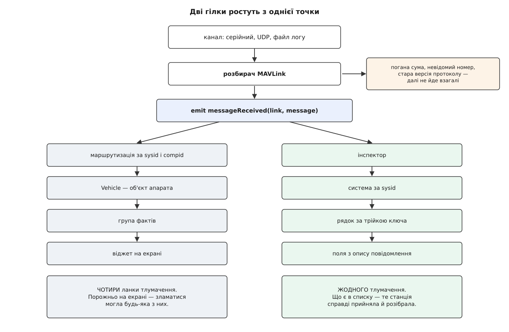
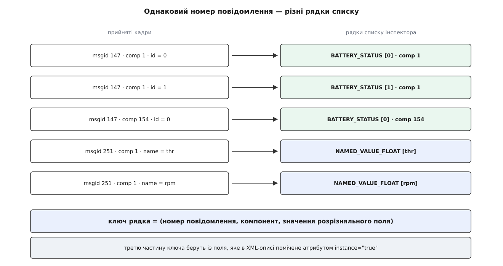
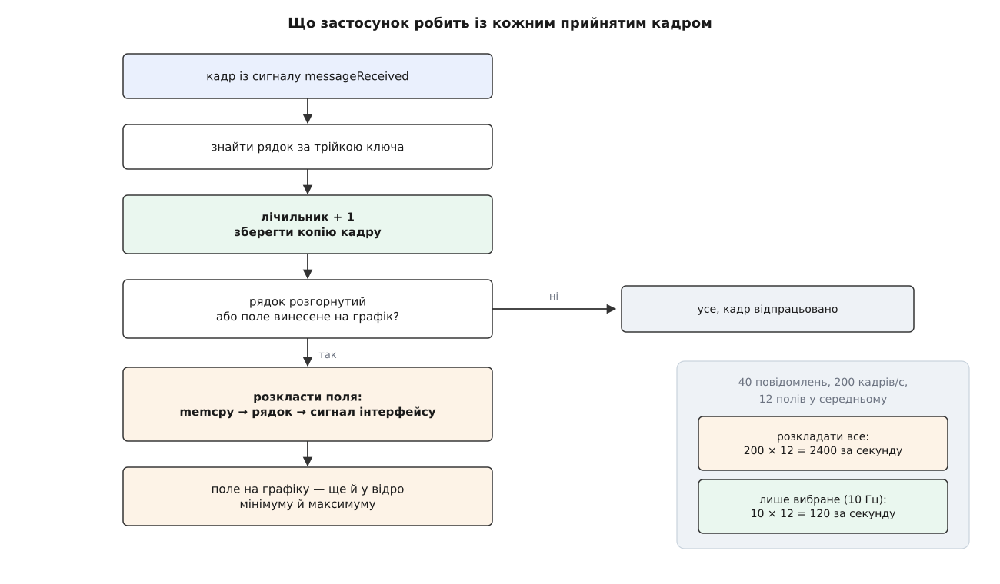
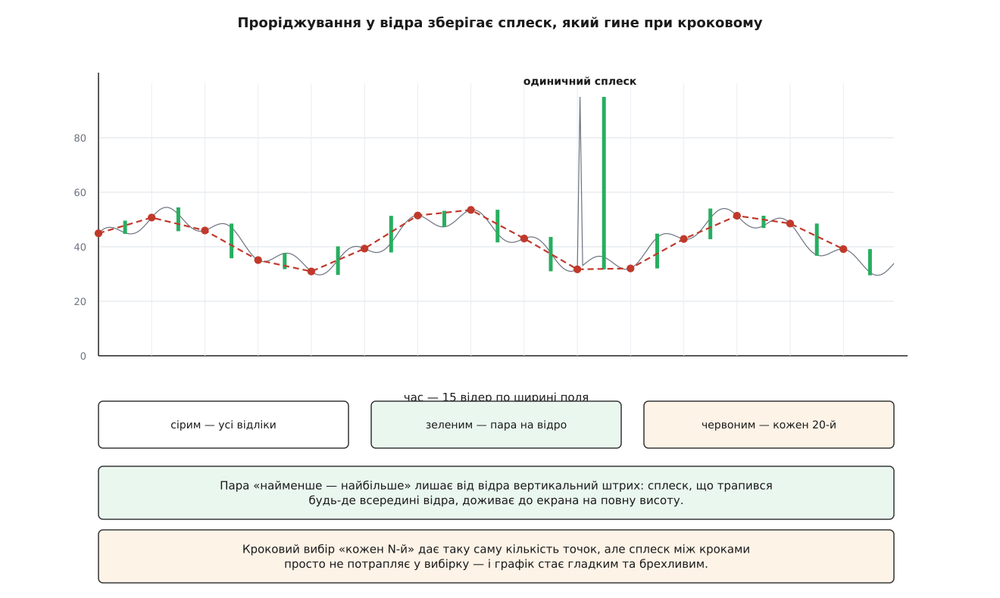

# Інспектор MAVLink: перегляд сирого трафіку

<preknowlist>
- [Пакет MAVLink](book:communications/mavlink-packet) — будова кадру: ідентифікатор повідомлення, ідентифікатори системи й компонента, навантаження.
- [Словник MAVLink](book:communications/mavlink-message-dictionary) — повідомлення описані в XML: перелік полів, їхні типи, порядок і розміри масивів.
- [Обробка MAVLink у станції](book:qgroundcontrol/mavlink-handling) — як байти каналу перетворюються на кадр і які кадри розбирач відкидає мовчки.
- [Маршрутизація за sysid і compid](book:qgroundcontrol/message-routing) — як застосунок вирішує, якому апаратові належить прийняте повідомлення.
- [Рефлексія й метапрограмування](book:programming/reflection-metaprogramming) — код, що читає опис структури під час виконання, замість того щоб знати її наперед.
</preknowlist>

Число на екрані наземної станції — не те, що прислав апарат. Між дротом і віджетом стоїть довгий ланцюг: байти складаються в кадр, кадр знаходить свій [об'єкт апарата](book:qgroundcontrol/vehicle-object), обробник дістає з навантаження потрібне поле, поле лягає у [факт](book:qgroundcontrol/fact-system), факт сповіщає інтерфейс. Поки все справне, знати про цей ланцюг не треба. Незручним питання стає тоді, коли на екрані порожньо: апарат не прислав — чи станція не зрозуміла?

За тією самою порожнечею стоять щонайменше чотири різні поломки. Апарат справді не надсилає потрібне повідомлення — його вимкнули, або прошивка його не має. Апарат надсилає, але кадр не доживає до застосунку: радіо губить, або розбирач відкидає його як зіпсований. Кадр доходить, але маршрутизація приписує його не тому апаратові — і значення осідає в об'єкті, на який ніхто не дивиться. Або кадр доходить і потрапляє куди слід, а помилка сидить в обробнику, який дістає з нього поле.

Чотири різні причини, один і той самий вигляд на екрані. Ланцюг, у якому кожна ланка щось тлумачить, не може сам показати, де він розірвався: усе, що він уміє повідомити, — це підсумок тлумачення. Щоб відрізнити «не прийшло» від «не зрозуміли», потрібне вікно, врізане в ланцюг **до** першого тлумачення — таке, що показує повідомлення так, як їх бачить розбирач, а не так, як їх зрозумів застосунок. Це і є інспектор MAVLink: сторінка розділу «Аналіз», доступна в настільних збірках станції.

## Гілка, що відходить до тлумачення

Місце врізання видно з однієї стрічки коду — з того, на що інспектор підписується при створенні:

```cpp
MAVLinkProtocol *const mavlinkProtocol = MAVLinkProtocol::instance();
(void) connect(mavlinkProtocol, &MAVLinkProtocol::messageReceived,
               this, &MAVLinkInspectorController::_receiveMessage);
```

Це той самий сигнал, на якому висить маршрутизатор. Кадр, що пройшов розбирач і перевірку контрольної суми, віддається обом слухачам одночасно й незалежно: один починає шукати адресата, другий просто вносить кадр у свою таблицю. Інспектор — не відгалуження від дерева тлумачення, а **другий корінь**, який росте з тієї самої точки.



*Обидві гілки ростуть із сигналу `messageReceived`; усе, що станція не змогла розібрати, не доходить до жодної з них.*

З місця врізання одразу випливають три властивості, і кожну варто розуміти буквально, бо саме на них тримається діагностична цінність інспектора.

**Він бачить те, для чого немає апарата.** Обробник вхідного повідомлення не питає, чи знайомий йому відправник, — він заводить систему просто з байта заголовка:

```cpp
QGCMAVLinkSystem *system = _findVehicle(message.sysid);
if (!system) {
    system = new QGCMAVLinkSystem(message.sysid, this);
    _systems->append(system);
    emit systemsChanged();
    ...
}
```

Об'єкт апарата станція створює обережно: їй потрібне серцебиття, потрібен допустимий тип автопілота, потрібне проходження початкової [машини станів](book:qgroundcontrol/vehicle-object). Інспекторові не потрібно нічого. Тому вузол, який шле щось у спільну мережу, але апаратом у застосунку так і не став, у списку інспектора все одно з'явиться — і це часто перша й єдина підказка, що в мережі є хтось третій.

**Він не розрізняє каналів.** Перший аргумент слота — канал, яким прийшов кадр, — навмисно відкинуто:

```cpp
void MAVLinkInspectorController::_receiveMessage(LinkInterface *link, const mavlink_message_t &message)
{
    Q_UNUSED(link);
```

Наслідок неочевидний і кусається на практиці. Якщо той самий апарат під'єднано двічі — радіомодемом і кабелем — інспектор зіллє обидва потоки в одну систему за спільним `sysid`, і показана частота повідомлення буде **сумою** двох каналів. Подвоєна частота серцебиття в інспекторі — це майже завжди не дивна прошивка, а два шляхи до однієї станції.

**Він не бачить того, що не розібралося.** Сигнал `messageReceived` спрацьовує лише для кадрів, які пройшли перевірку. Кадр із неправильною сумою, кадр із невідомим станції номером повідомлення (для розбирача це той самий випадок — [суму нема з чим звірити](book:qgroundcontrol/mavlink-handling)), кадр старої версії протоколу — усе це зникає раніше. Тому мовчання інспектора означає точно «станція не отримала розібраного повідомлення», а не «апарат не надіслав». Різниця між цими твердженнями — і є та частина діагностики, яку доводиться закривати іншими засобами: лічильником утрат каналу й перевіркою того, чи зібрано станцію з потрібним [діалектом](book:qgroundcontrol/custom-mavlink-messages).

> 🔧 **Навіщо це.** Найчастіша практична задача інспектора формулюється як питання «хто винен»: борт чи станція. Якщо повідомлення в списку є, а на екрані пусто — винна станція, і шукати треба нижче за течією, у маршрутизації або в обробнику. Якщо повідомлення в списку немає взагалі — станція ні до чого, і йти треба на борт: до налаштувань потоків, до прошивки, до діалекту.

## Що вважати одним рядком

Список інспектора — це рядки, і питання, яке доводиться розв'язати перед усім іншим, звучить просто: коли черговий кадр оновлює наявний рядок, а коли заводить новий?

Спокуслива відповідь «за номером повідомлення» неправильна, і ламається вона двічі.

Перший злам — компоненти. Автопілот, підвіс і камера на одному апараті мають спільний `sysid` і різні `compid`, і всі троє мають право надсилати повідомлення того самого типу. Злиття їх в один рядок дало б значення, що стрибають між трьома джерелами, і частоту, утричі більшу за справжню.

Другий злам глибший: **один компонент шле те саме повідомлення про різні речі**. Стан батареї надсилається окремо для кожної батареї, дані регуляторів обертів — окремими блоками по чотири, а `NAMED_VALUE_FLOAT` узагалі є універсальним контейнером «ім'я — число», і за одним номером повідомлення в ньому ходять десятки різних величин. Розрізнити їх можна лише за вмістом — за полем, яке в самому словнику MAVLink помічене як розрізняльне:

```xml
<field type="uint8_t" name="id" instance="true">Battery ID</field>
```

Станція не знає цих атрибутів наперед і не має списку в коді. Список постає при збірці: скрипт генератора обходить ланцюг включень діалекту, збирає всі поля з `instance="true"` і виписує їх у заголовок як таблицю «номер повідомлення → ім'я поля».

```python
for field in message.findall("field"):
    if field.get("instance") == "true":
        field_name = field.get("name")
        if msg_id not in instance_fields:
            instance_fields[msg_id] = (msg_name, field_name)
        break  # Only one instance field per message
```

Далі під час роботи станція за цією таблицею дістає значення розрізняльного поля просто з навантаження — за зсувом, який знову ж таки бере з опису повідомлення. Отриманий рядок і стає третьою частиною ключа:

```cpp
if((msg->id() == id) && (msg->compId() == compId) && (msg->instanceValue() == instanceValue)) {
    return msg;
}
```

Ключ рядка — трійка «номер, компонент, примірник», і його ж видно в назві: до імені повідомлення дописується примірник у квадратних дужках, тож `BATTERY_STATUS [0]` і `BATTERY_STATUS [1]` стоять у списку окремо.

Кілька повідомлень довелося обробити руками. Налагоджувальні `NAMED_VALUE_FLOAT`, `NAMED_VALUE_INT`, `DEBUG_VECT` і `DEBUG` розрізняються не помаркованим полем, а іменем чи індексом усередині — і для них станція має чотири явні гілки, які дістають це ім'я напряму. Це не вада конструкції, а чесна межа автоматичного правила: словник помітив те, що зміг, решту довелося назвати поіменно.



*Ключ рядка — трійка «номер повідомлення, компонент, примірник»; без третьої частини батареї злилися б в одну.*

Дрібниця, яку легко проґавити, але без якої списком неможливо користуватися: нові рядки вставляються не в кінець, а **на своє місце за абеткою** — двійковим пошуком за назвою. Причина суто практична. Повідомлення з'являються в списку в тому порядку, у якому вперше приходять з ефіру, і рідкісне повідомлення може прийти вперше через хвилину після під'єднання. Дописування в кінець означало б список, що переставляється на очах. А оскільки вставка посередині зсуває індекси, після кожної вставки станція знаходить вибраний рядок заново й поправляє номер вибраного — інакше клацнутий рядок «тікав» би з-під курсора щоразу, коли в ефірі з'являється щось нове.

## Поля постають з опису, а не з коду

Коли рядок створюється вперше, інспектор одразу будує його поля — і робить це, нічого не знаючи про конкретне повідомлення. Усе, що йому потрібно, лежить у таблиці, яку [генератор коду MAVLink](book:communications/mavlink-xml-codegen) виписав із XML-опису: для кожного номера повідомлення там є ім'я, кількість полів, а для кожного поля — ім'я, тип, зсув у навантаженні й довжина масиву.

```cpp
const mavlink_message_info_t *const msgInfo = mavlink_get_message_info(&message);
...
for (unsigned int i = 0; i < msgInfo->num_fields; ++i) {
```

Це та сама рефлексія, лише зроблена не мовою, а генератором: опис даних існує окремо від коду, і код по ньому ходить. Наслідок вартий того, щоб його промовити: **інспектор не має жодного рядка, присвяченого конкретному повідомленню**. Додайте у свій діалект нове повідомлення, зберіть станцію — і воно з'явиться в інспекторі з усіма полями, без жодної правки в самому інспекторі. Саме тому ця сторінка й лишається робочою на форках і на вендорських прошивках.

Одне перетворення тут таки робиться свідомо. Числовий масив розгортається в окремі поля-елементи:

```cpp
if (array_length > 0 && msgInfo->fields[i].type != MAVLINK_TYPE_CHAR) {
    for (unsigned int j = 0; j < array_length; ++j) {
        const QString elementName = QStringLiteral("%1[%2]").arg(fieldName).arg(j);
```

Причина в тому, для чого поля взагалі потрібні. Поле в інспекторі — не просто число на екрані, а можлива крива на графіку; а крива будується з однієї величини, не з масиву. Масив із чотирьох напруг комірок, показаний одним рядком, не можна ні порівняти сам із собою, ні накласти на іншу величину. Розгорнутий на `voltages[0]`…`voltages[3]`, він дає чотири незалежні криві. Рядкові масиви цього не отримують — і не тільки тому, що ім'я моделі не має сенсу як число: такі поля явно позначаються як невибірні, і галочка графіка біля них не працює.

Ще одна ручна гілка стосується часу. Поля повідомлення `SYSTEM_TIME` — це кількість мілісекунд або мікросекунд від початку епохи, і як число вони нечитабельні. Станція показує їх датою й годинником, залишаючи для графіка вихідне число:

```cpp
if (_message.msgid == MAVLINK_MSG_ID_SYSTEM_TIME && element < 0) {
    const QDateTime d = QDateTime::fromMSecsSinceEpoch(static_cast<qint64>(n), QTimeZone::utc());
    field->updateValue(d.toString("HH:mm:ss"), static_cast<qreal>(n));
```

Два аргументи `updateValue` — це і є розділення, яке проходить крізь усю сторінку: **рядок для ока, число для кривої**. Одне й те саме поле живе у двох поданнях одночасно, і жодне з них не виводиться з іншого.

## Рахувати завжди, розкладати — лише вибране

Тепер найдорожче місце. Розбір [відбувається в головній нитці](book:qgroundcontrol/threading-model) — у тій самій, що малює інтерфейс. Кожна зайва операція на кадр краде час у відмальовки, а кадрів багато.

Порахуймо, у що обійшлося б чесне «розкладати все».

**Умова: у потоці 40 різних повідомлень, разом 200 кадрів за секунду; середнє повідомлення після розгортання масивів має 12 полів.**

```
розкладань за секунду = 200 × 12 = 2400

кожне розкладання:  memcpy з навантаження
                  + QString::number (виділення пам'яті)
                  + порівняння з попереднім рядком
                  + сигнал valueChanged, якщо рядок змінився
```

Дорогі тут не пересилання байтів, а два останні кроки: побудова рядка й сповіщення інтерфейсу. Дві з половиною тисячі рядків за секунду будуються заради того, щоб їх ніхто не побачив: на екрані одночасно розгорнуте **одне** повідомлення.

Звідси й правило, записане в оновленні прямим текстом:

```cpp
void QGCMAVLinkMessage::update(const mavlink_message_t &message)
{
    _count++;
    _message = message;

    if (_selected || _fieldSelected) {
        // Don't update field info unless selected to reduce perf hit of message processing
        _updateFields();
    }
    emit countChanged();
}
```

Кадр завжди робить дві дешеві речі: збільшує лічильник і **заміщає збережену копію повідомлення**. Розкладання ж відбувається лише за двох умов — рядок розгорнутий на екрані або хоч одне його поле винесено на графік.

```
з обмеженням, вибране повідомлення приходить 10 разів за секунду:
розкладань за секунду = 10 × 12 = 120

виграш = 2400 / 120 = 20 разів
```

Збережена копія — не надмірність, а те, що робить перемикання миттєвим. У момент, коли ви клацаєте по рядку, `setSelected` кличе розкладання **одразу**, не чекаючи наступного кадру: значення беруться з копії останнього прийнятого повідомлення. Тому рідкісне повідомлення, що приходить раз на десять секунд, показує поля відразу, а не мовчить порожнім бланком до наступного приходу.

Ціна такої конструкції теж є, і вона чесна: **інспектор не має історії**. Він тримає рівно один — останній — кадр кожного рядка. Побачити, що було в полі три секунди тому, можна лише двома способами: якщо поле вже було на графіку, або пізніше, за [записом телеметрії](book:qgroundcontrol/telemetry-logging), який зберігає кадри цілком. Відтворення такого запису, до речі, проходить тим самим сигналом — інспектор не відрізняє живого польоту від відтвореного логу.



*Лічильник росте від кожного кадру; поля розкладаються тільки для розгорнутого рядка або для полів, винесених на криву.*

Робочий приклад такого спостерігача, зібраного з нуля — з таблицею рядків за трійкою ключа, обходом опису повідомлення й тим самим правилом «рахувати всіх, розкладати вибраного», — розібрано у [проєкті «спостерігач за потоком»](book:qgroundcontrol/mavlink-inspector/proj-inspector-tap.md).

## Частота, яку показують

Стовпчик із герцами біля кожного рядка — найкорисніше число сторінки, і рахується воно не з міжкадрових проміжків, а найгрубішим із можливих способів: скільки кадрів прийшло за такт секундного таймера.

```cpp
void QGCMAVLinkMessage::updateFreq()
{
    const quint64 msgCount = _count - _lastCount;
    const qreal lastRateHz = _actualRateHz;
    _actualRateHz = (0.2 * _actualRateHz) + (0.8 * msgCount);
    _lastCount = _count;
```

Різниця лічильників за секунду — це вже готова частота в герцах. Її не показують напряму, а змішують із попереднім значенням: чотири п'ятих нового, одна п'ята старого. Це [експоненційне згладжування](book:math/exponential-smoothing) з дуже великою вагою свіжого значення — таке, що майже не бреше, але прибирає смикання на одиницю, яке дає цілочислове рахування кадрів за секунду.

**Приклад: рівний потік 10 кадрів за секунду, показник стартує з нуля.**

```
такт 1:  0.2 · 0.000 + 0.8 · 10 = 8.000
такт 2:  0.2 · 8.000 + 0.8 · 10 = 9.600
такт 3:  0.2 · 9.600 + 0.8 · 10 = 9.920
такт 4:  0.2 · 9.920 + 0.8 · 10 = 9.984
```

Три-чотири секунди — і показник за десяту частку герца від істини. Це і є практичне правило користування: після зміни налаштувань потоку зачекайте кілька секунд, перш ніж вірити числу. Похибку такої оцінки, її поведінку на повільних повідомленнях (де більшість тактів дають нуль) і те, чому саме така вага, розібрано в [математиці оцінювача частоти](book:qgroundcontrol/mavlink-inspector/math-rate-estimator.md).

> 🔧 **Навіщо це.** Дві частоти поруч — прийнята й підтверджена апаратом — дають пряме вимірювання каналу без жодного додаткового приладу. Апарат підтвердив 10 Гц, інспектор показує 6.5 — третина кадрів цього типу не долітає. Те саме число, зняте з кількох повідомлень різного розміру, одразу каже, у чому річ: якщо просідають однаково всі, винне радіо; якщо тільки великі — не вистачає смуги.

Один такт таймера обходить усі системи й усі їхні рядки — саме тому частота оновлюється й у тих рядків, які зараз не видно, і список одразу показує, хто мовчить: у рядка, що припинив приходити, число просто сповзає до нуля за той самий десяток секунд.

## Єдина кнопка, що пише в апарат

Досі інспектор був чистим спостерігачем. Одне поле сторінки порушує це — вибір бажаної частоти повідомлення. Він перетворює діагностику на інструмент: побачивши, що потрібне повідомлення йде надто рідко (або що канал забитий непотрібним), ви міняєте частоту прямо звідси.

Дорога від випадного списку до апарата йде через звичайну [команду MAVLink](book:communications/mavlink-commands) — надіслану з підтвердженням, як і будь-яка інша:

```cpp
const float interval = (rate > 0) ? 1000000.0 / rate : rate;

_commandQueue->sendCommandWithHandler(
    &handlerInfo,
    compId,
    MAV_CMD_SET_MESSAGE_INTERVAL,
    static_cast<float>(msgId),
    interval);
```

Протокол оперує **проміжком у мікросекундах**, а не частотою, тож частота перевертається на проміжок; два значення проходять без перетворення й мають окремий сенс: нуль — «повернути типову частоту прошивки», мінус один — «вимкнути це повідомлення». Загальні правила такого керування потоками описано в темі [частот потоків](book:communications/stream-rates).

Найцікавіше починається після команди. Апарат не зобов'язаний виконати запит буквально: у нього власний планувальник із власним кроком, власний бюджет каналу й власна думка про мінімальний проміжок. Тому станція не вважає прохання виконаним і не пише бажане число в інтерфейс. Вона чекає підтвердження — і аж тоді **питає апарат, що ж він насправді поставив**:

```cpp
if ((ack.result == MAV_RESULT_ACCEPTED) && (failureCode == MavCmdResultCommandResultOnly)) {
    ctx->manager->_requestMessageInterval(ctx->compId, ctx->msgId);
}
```

Відповідь приходить окремим повідомленням, у ньому знову проміжок, і станція перевертає його назад у частоту:

```cpp
const int32_t rate = (data.interval_us > 0) ? 1000000.0 / data.interval_us : data.interval_us;
```

Це число й доходить до інспектора сигналом, який знаходить свій рядок за компонентом і номером повідомлення та ставить його як бажану частоту. Отже, у списку ви бачите не те, що просили, а те, що апарат підтвердив, — і розбіжність між ними є показанням приладу, а не збоєм інтерфейсу.

Дві межі цього механізму варто знати наперед, бо обидві виглядають як «не працює».

**Прошивка може не підтримувати запит.** Якщо апарат відповідає на запит проміжку відмовою, станція запам'ятовує пару «компонент, повідомлення» як непідтримувану й більше про неї не питає:

```cpp
if ((result != MAV_RESULT_ACCEPTED) || (failureCode != RequestMessageNoFailure)) {
    (void) ctx->manager->_unsupportedMessageIds.insert(ctx->compId, ctx->msgId);
}
```

Поле бажаної частоти тоді назавжди лишається на «типовій», хоч би що ви вибирали, — і це коректна поведінка: станція не має чого туди написати.

**Керувати можна лише тим, що є апаратом.** Установлення частоти шукає апарат за ідентифікатором системи через [менеджер апаратів](book:qgroundcontrol/multi-vehicle) і мовчки виходить, якщо його там немає. Систему, яку інспектор завів просто з трафіку, можна дивитися — але не можна просити.

## Від поля до кривої

Галочка біля поля перетворює його на криву одного з двох графіків. З цієї миті кожне розкладання поля не лише оновлює рядок, а й додає точку — і тут виникає задача, яку неможливо розв'язати «в лоб».

Величина, що приходить сто разів за секунду, за п'ять хвилин дає тридцять тисяч точок. Графік завширшки дев'ятсот пікселів фізично не може показати більше за дев'ятсот вертикальних смужок. Тридцять тисяч точок у лінії — це тридцять тисяч відрізків, які рисуються по тридцять разів за секунду й дають рівно ту саму картинку, що й тисяча.

Очевидне спрощення — брати кожну N-ту точку — псує саме те, заради чого дивляться на телеметрію. Одиничний сплеск живе один відлік; при проріджуванні з кроком тридцять він з імовірністю двадцять дев'ять до одного просто зникне. Графік стане гладким і брехливим.

Тому станція проріджує інакше: час ділиться на **відра**, по одному на піксель ширини, а від кожного відра лишається не один відлік, а **пара — найменше й найбільше значення**.

```cpp
_bucketCount = std::max(1, chartController->plotPixelWidth());
_bucketWidthMs = chartController->rangeXMs() / _bucketCount;
```

**Приклад: шкала 30 секунд, поле графіка 900 пікселів.**

```
ширина відра   = 30000 мс / 900 = 33.3 мс
точок у пам'яті = 2 × 900 = 1800   (мінімум і максимум на відро)

потік 50 Гц (відлік кожні 20 мс)  → 1–2 відліки на відро
потік 200 Гц (відлік кожні 5 мс)  → 6–7 відліків на відро,
                                     з них уціліють крайні
```

Пара «мінімум-максимум» малюється як вертикальний штрих завширшки в піксель — і сплеск, що трапився в межах відра, лишається на екрані як пік повної висоти. Обсяг пам'яті при цьому не залежить ні від частоти повідомлення, ні від тривалости спостереження: закінчивши, відра пишуться в [кільцевий буфер](book:algorithms/ring-buffer) сталого розміру, де найстаріша пара затирається найновішою.

Ціна — час точки. Обидві точки відра позначаються серединою його інтервалу, тобто момент значення відомий із похибкою до половини відра — тут це шістнадцять мілісекунд. На шкалі, де один піксель і є тридцять три мілісекунди, ця похибка менша за товщину лінії, тож нею можна знехтувати свідомо, а не випадково.

Звідси й пояснення поведінки, яка інакше здається дивною: **зміна масштабу часу очищає графік**. Інша шкала — інша ширина відра, і старі відра, зібрані з іншим кроком, змішувати з новими не можна, бо густина точок у них інша. Простіше почати збирати наново, ніж перераховувати. Те саме стається при зміні ширини вікна: кількість відер прив'язана до ширини поля в пікселях.

Малювання відв'язане від приходу даних: криві перемальовуються за окремим таймером із частотою п'ятнадцять разів за секунду, скільки б повідомлень за цей час не прийшло. Останнє, ще не закрите відро домальовується щоразу окремо — інакше свіжий кінець кривої відставав би від дійсности на ширину відра.



*Одна пара точок на відро тримає обсяг пам'яті сталим, а вертикальний розмах відра зберігає короткі викиди.*

Обмежень у графіка два, і обидва мають вигляд простого числа. Графіків рівно два, і на кожному не більше шести кривих — стільки, скільки кольорів у наборі; сьома галочка просто не вмикається. Вертикальна шкала або рахується автоматично з розмаху всіх кривих графіка (з полями у п'ять відсотків), або задається вручну зі списку сталих меж — бо накладати величину з розмахом у сотні на величину з розмахом у соті автоматика не вміє, і тут потрібна людина.

## Що з цього можна прочитати

Інспектор дає три незалежні показання: **чи повідомлення взагалі є**, **як часто воно приходить** і **що в його полях**. Разом вони розрізняють ті поломки, які на звичайному екрані виглядають однаково.

Повідомлення немає в списку — станція не отримала жодного розібраного кадру цього типу. Далі розвилка: якщо решта трафіку йде нормально, справа не в каналі, а на борту або в діалекті збірки; якщо просіли всі частоти одразу — винен канал.

Повідомлення є, поля показують правильні числа, а на екрані станції порожньо — борт ні до чого. Тлумачення зламалося нижче: маршрутизація віддала кадр не тому апаратові, обробник не знає цього номера повідомлення, факт не зв'язаний із віджетом. Шукати треба в застосунку.

Частота вдвічі більша за очікувану — майже напевно два канали до однієї станції, злиті в один рядок за спільним ідентифікатором системи. Частота нижча за підтверджену апаратом — канал не встигає, і різниця між цими двома числами прямо міряє те, скільки з надісланого не долітає.

У списку є система, якої ви не заводили — у мережі є ще хтось: сусідня станція, ретранслятор, увімкнене кимось пересилання. Для мережевих з'єднань це найшвидший спосіб побачити чужий трафік, який інакше просто тихо витрачає смугу.

Повний перелік того, що сторінка віддає назовні — властивості контролера, рядка й поля, доступні з інтерфейсу, — зібрано в [описі інтерфейсу інспектора](book:qgroundcontrol/mavlink-inspector/api-inspector-qml.md); саме через нього до інспектора додають свої панелі у вендорських збірках.
