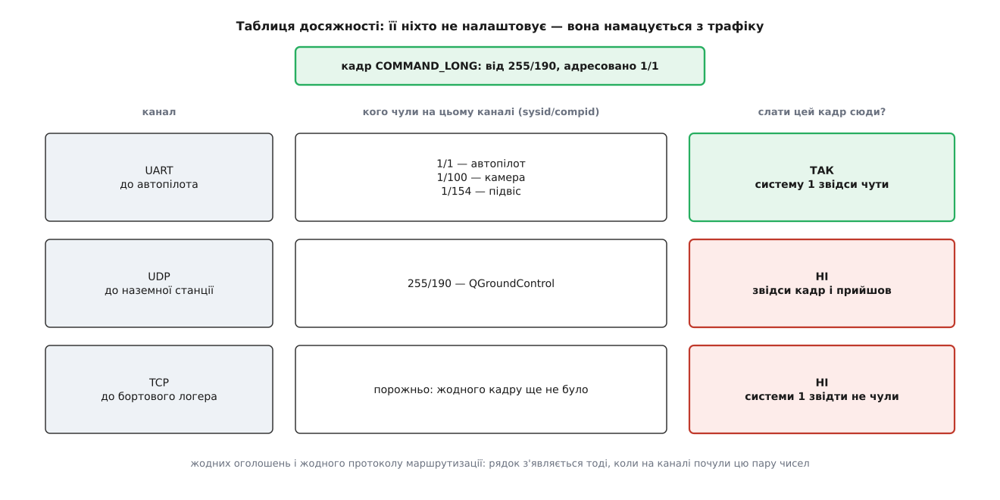
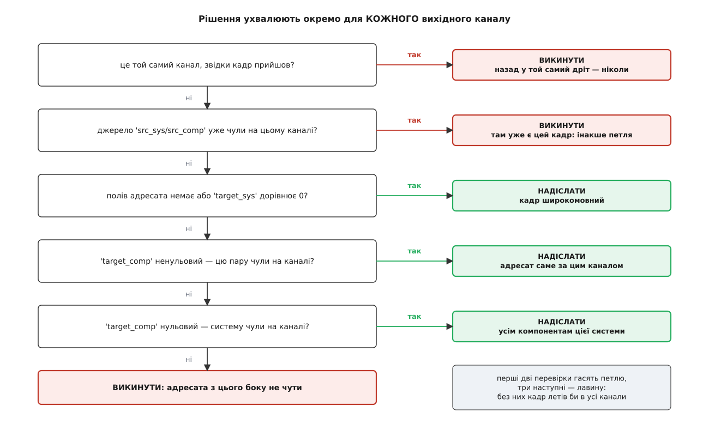

# ⚙️ Маршрутизатор MAVLink, який не розбирає жодного повідомлення

Нижче — робочий маршрутизатор на C: він приймає кадри з кількох каналів, вирішує для кожного «спожити, переслати чи викинути» й жодного разу не заглядає всередину повідомлення. Саме тому він і потрібен: вузол посередині мусить доставляти те, чого не розуміє, а зрозуміти він не може майже нічого — повідомлень тисячі, і чимало з них із чужих діалектів.

## Задача

На апараті стоїть бортовий комп'ютер, і в нього три дроти:

- **UART** до автопілота — звідти телеметрія й туди команди;
- **UDP** через модем до наземної станції — там людина;
- **TCP** на локальний порт — туди чіпляється логер і скрипт на pymavlink.

Автопілот має один послідовний порт, тому фізично говорити з ним може лише один співрозмовник. Станція й скрипт мусять якось цим портом ділитися, і розводить їх саме бортовий комп'ютер.

Вимог до нього чотири, і кожна наступна складніша за попередню.

Перша: команда зі станції має дійти до автопілота, а телеметрія автопілота — до станції й до логера водночас. Це просте пересилання.

Друга: коли скрипт на TCP пише параметр, відповідь автопілота має прийти скрипту, а не тільки станції. Тобто адресні кадри треба розводити, а не розсилати всім підряд.

Третя: у канал не має летіти те, чого там не чекають. Телеметрія трьох компонентів апарата — це десятки кадрів на секунду; якщо кожен із них дублювати в кожен канал, вузький радіоканал захлинеться на порожньому місці.

Четверта, і вона визначає всю конструкцію: **маршрутизатор мусить пропускати повідомлення, яких він не знає.** Прошивка й станція можуть говорити діалектом, зібраним минулого тижня, з повідомленнями, про які бортовий комп'ютер не чув ніколи. Його справа — доставити, а не зрозуміти. Вузол, який мовчки ковтає незнайоме, ламає зв'язок так, що причину знайти майже неможливо: телеметрія йде, heartbeat живий, а одна конкретна функція станції просто не працює.

## Ідея

Уся конструкція тримається на трьох спостереженнях.

**Відправника видно завжди.** `sysid` і `compid` лежать у заголовку на сталих зсувах, однакових для будь-якого повідомлення. Щоб їх прочитати, знати повідомлення не треба. Про склад кадру — у темі [пакет MAVLink](topic:communications/mavlink-packet): стартовий байт, довжина тіла, прапорці, порядковий номер, два байти адреси відправника, тризначний номер повідомлення, тіло, контрольна сума.

**Адресата видно за зсувом із таблиці.** `target_system` і `target_component` — звичайні поля тіла, і в кожного повідомлення вони на своєму місці. Але генератор коду складає з XML-опису таблицю, де для кожного номера повідомлення записано ці зсуви. Отже, прочитати адресата можна теж без розбору — один байт за відомим зсувом. Звідки береться сама таблиця, описано в темі [генерація коду з XML-опису MAVLink](topic:communications/mavlink-xml-codegen): один опис породжує і структури повідомлень, і контрольні дані, і зсуви полів адресата.

**Хто де живе — намацується, а не налаштовується.** Маршрутизатор запам'ятовує, яку пару «система/компонент» він чув на якому каналі, і пересилає адресний кадр лише в ті канали, звідки адресата вже чули. Ніякого протоколу маршрутизації, ніяких оголошень — сама лише пам'ять про почуте.

## Чому штатний розбирач тут не годиться

Перша спокуса — узяти `mavlink_parse_char` з бібліотеки: він уже вміє збирати кадри з байтів і перевіряти контрольну суму. Спокусі варто піддатися рівно до того моменту, як подивитися, що він робить із незнайомим номером повідомлення:

```c
case MAVLINK_PARSE_STATE_GOT_PAYLOAD: {
    const mavlink_msg_entry_t *e = mavlink_get_msg_entry(rxmsg->msgid);
    if (e == NULL) {
        // Message not found in CRC_EXTRA table.
        status->parse_state = MAVLINK_PARSE_STATE_GOT_BAD_CRC1;
        rxmsg->ck[0] = c;
    } else {
        …
    }
}
```

Контрольна сума MAVLink рахується не лише з байтів кадру, а й з додаткового байта `crc_extra`, що залежить від складу повідомлення. Для незнайомого номера цього байта нема — отже, перевірити суму нічим. Бібліотека виходить із становища найпростіше: оголошує суму хибною. Кадр не дійде до застосунку взагалі, і жодного сліду, крім лічильника помилок, по ньому не лишиться.

Для кінцевого вузла це правильна поведінка: чого не розумію, того не беру. Для маршрутизатора — фатальна: він мовчки з'їдає весь чужий діалект, тобто робить рівно те, чого робити не має права.

Висновок незручний, але однозначний: **обрамлення доводиться писати своє.** Це сорок рядків — і саме так робить `mavlink-router`, готовий маршрутизатор, яким користуються на реальних бортах.

## Крок 1: знайти межі кадру, не питаючи про зміст

Обрамлення — це задача «де в потоці байтів починається й закінчується повідомлення», і в MAVLink вона розв'язується так само, як у більшості двійкових протоколів поверх байтового потоку: стартовий байт, поле довжини, а далі рахунок. Загальний устрій цієї задачі й типові пастки — у темі [кадрування повідомлень у потоці TCP](topic:programming/tcp-message-framing).

```c
/* mavrouter.c — мінімальний маршрутизатор MAVLink.
   cc -O2 -Wall mavrouter.c -I/usr/include/mavlink -o mavrouter          */
#include <common/mavlink.h>      /* заради mavlink_get_msg_entry і зсувів */
#include <poll.h>
#include <string.h>
#include <time.h>
#include <unistd.h>
#include <stdbool.h>

#pragma pack(push, 1)
struct mav2_hdr {
    uint8_t magic;           /* 0xFD                                     */
    uint8_t payload_len;
    uint8_t incompat_flags;  /* біт 0 — кадр підписаний                  */
    uint8_t compat_flags;
    uint8_t seq;
    uint8_t sysid;           /* ВІДПРАВНИК, а не одержувач               */
    uint8_t compid;
    uint8_t msgid[3];        /* 24 біти, молодшим байтом уперед          */
};
struct mav1_hdr {
    uint8_t magic;           /* 0xFE                                     */
    uint8_t payload_len;
    uint8_t seq;
    uint8_t sysid;
    uint8_t compid;
    uint8_t msgid;
};
#pragma pack(pop)

/* Усе, що маршрутизаторові треба знати про кадр. */
struct frame {
    const uint8_t *bytes;        /* початок кадру в буфері прийому       */
    uint16_t       len;          /* повна довжина кадру, з підписом      */
    uint32_t       msgid;
    uint8_t        src_sys, src_comp;
    int16_t        tgt_sys, tgt_comp;  /* −1 — полів адресата немає      */
};

static void frame_targets(const uint8_t *payload, uint8_t len, struct frame *f);

/* Розбирає ОБРАМЛЕННЯ першого кадру в буфері.
   Повертає, скільки байтів з початку буфера вже не потрібні;
   виставляє *got, якщо кадр зібрався повністю.                          */
static size_t frame_scan(const uint8_t *buf, size_t n, struct frame *f, bool *got)
{
    *got = false;

    size_t i = 0;
    while (i < n && buf[i] != MAVLINK_STX && buf[i] != MAVLINK_STX_MAVLINK1) {
        i++;                       /* сміття до стартового байта         */
    }
    if (i == n) {
        return n;                  /* самé сміття — буфер можна спорожнити */
    }

    const uint8_t *p     = buf + i;
    const size_t   avail = n - i;
    size_t  hdr_len, total;
    uint8_t payload_len;

    if (p[0] == MAVLINK_STX) {                          /* MAVLink v2    */
        if (avail < sizeof(struct mav2_hdr)) {
            return i;                                   /* дочитати      */
        }
        const struct mav2_hdr *h = (const struct mav2_hdr *)p;
        hdr_len     = sizeof(*h);
        payload_len = h->payload_len;
        total = hdr_len + payload_len + 2
              + ((h->incompat_flags & MAVLINK_IFLAG_SIGNED)
                     ? MAVLINK_SIGNATURE_BLOCK_LEN : 0);
        f->msgid = (uint32_t)h->msgid[0]
                 | ((uint32_t)h->msgid[1] << 8)
                 | ((uint32_t)h->msgid[2] << 16);
        f->src_sys  = h->sysid;
        f->src_comp = h->compid;
    } else {                                            /* MAVLink v1    */
        if (avail < sizeof(struct mav1_hdr)) {
            return i;
        }
        const struct mav1_hdr *h = (const struct mav1_hdr *)p;
        hdr_len     = sizeof(*h);
        payload_len = h->payload_len;
        total       = hdr_len + payload_len + 2;
        f->msgid    = h->msgid;
        f->src_sys  = h->sysid;
        f->src_comp = h->compid;
    }

    if (avail < total) {
        return i;                  /* кадр ще не дочитано                */
    }

    f->bytes = p;
    f->len   = (uint16_t)total;
    frame_targets(p + hdr_len, payload_len, f);
    *got = true;
    return i + total;
}
```

Дві дрібниці тут не дрібниці.

Перша: `f->bytes` вказує **в сам буфер прийому**, а не в копію. Кадр далі поїде в інші канали такими самими байтами, якими прийшов, — про це нижче, і саме заради цього вся ця морока з власним обрамленням.

Друга: у `total` для другої версії протоколу входить блок підпису, коли прапорець `MAVLINK_IFLAG_SIGNED` увімкнено. Забути про ці тринадцять байтів — значить обрізати кожен підписаний кадр і зсунути обрамлення на решту потоку; симптом буде «зв'язок працює, доки не ввімкнеш підпис».

## Крок 2: адресат за зсувом

Тепер найцікавіше — прочитати «кому», не знаючи, що це за повідомлення.

```c
/* Дістає адресу одержувача, НЕ розбираючи повідомлення. */
static void frame_targets(const uint8_t *payload, uint8_t len, struct frame *f)
{
    f->tgt_sys = f->tgt_comp = -1;    /* у цього повідомлення полів адресата немає */

    const mavlink_msg_entry_t *e = mavlink_get_msg_entry(f->msgid);
    if (!e) {
        return;      /* незнайоме повідомлення: адресата не знаємо — отже, «всім» */
    }
    if (e->flags & MAV_MSG_ENTRY_FLAG_HAVE_TARGET_SYSTEM) {
        f->tgt_sys = (e->target_system_ofs < len)
                   ? payload[e->target_system_ofs]
                   : 0;              /* поле обрізане при відправленні → нуль */
    }
    if (e->flags & MAV_MSG_ENTRY_FLAG_HAVE_TARGET_COMPONENT) {
        f->tgt_comp = (e->target_component_ofs < len)
                    ? payload[e->target_component_ofs]
                    : 0;
    }
}
```

Порівняння `ofs < len` виглядає як звичайна перевірка меж, а насправді це змістовна гілка. MAVLink другої версії **обрізає з тіла кінцеві нульові байти**: якщо в `COMMAND_LONG` останні поля нульові, вони в дріт не поїдуть узагалі, і в кадрі буде не тридцять три байти тіла, а, скажімо, двадцять. Коли зсув адресата випадає за цю обрізану довжину, це не збій, а рівно навпаки — це означає, що байт був нульовий і тому зник. Нуль і треба підставити.

Помилитися тут легко й непомітно: узяти байт із буфера за зсувом, який більший за реальну довжину, і прочитати шматок попереднього кадру. Кадр поїде не туди, куди адресований, і жодних ознак поломки не буде.

`mavlink_get_msg_entry` шукає запис двійковим пошуком по таблиці, впорядкованій за номером повідомлення. Незнайомий номер дає `NULL` — і це другий випадок, коли ми свідомо кажемо «адресата немає», тобто «всім». Викидати такий кадр не можна: він може нести саме те, заради чого станція й прошивка й завели собі власне повідомлення.

## Крок 3: таблиця досяжності

Тепер маршрутизатор знає про кадр усе, що йому потрібно: звідки прийшов, від кого, кому. Бракує останнього — куди його везти. І от цього ніхто не налаштовує.

Правило протоколу тут просте, і воно взяте з офіційного опису маршрутизації: адресний кадр можна пересилати в канал лише тоді, коли на цьому каналі вже чули адресата. Пам'ять про почуте й є вся «мережева карта» маршрутизатора.

```c
#define SEEN_MAX     32
#define SEEN_TTL_MS  30000u        /* запис живе 30 с після останнього кадру */
#define RX_MAX       (2 * MAVLINK_MAX_PACKET_LEN)

struct seen {
    uint8_t  sys, comp;
    uint32_t last_ms;
};

struct channel {
    int          fd;
    const char  *name;
    struct seen  seen[SEEN_MAX];
    uint8_t      n_seen;
    uint8_t      rx[RX_MAX];       /* удвічі більший за найдовший кадр:    */
    size_t       rx_len;           /* «повний буфер без кадру» неможливий  */
};

static uint32_t now_ms(void)
{
    struct timespec ts;
    clock_gettime(CLOCK_MONOTONIC, &ts);
    return (uint32_t)(ts.tv_sec * 1000u + ts.tv_nsec / 1000000u);
}

/* Почули пару на цьому каналі — записати або освіжити. */
static void chan_learn(struct channel *c, uint8_t sys, uint8_t comp, uint32_t now)
{
    if (sys == 0) {
        return;        /* системи 0 не існує: адресувати їй кадр неможливо */
    }
    for (uint8_t i = 0; i < c->n_seen; i++) {
        if (c->seen[i].sys == sys && c->seen[i].comp == comp) {
            c->seen[i].last_ms = now;
            return;
        }
    }
    if (c->n_seen < SEEN_MAX) {
        c->seen[c->n_seen++] = (struct seen){ sys, comp, now };
        return;
    }
    uint8_t oldest = 0;                          /* таблиця повна —       */
    for (uint8_t i = 1; i < SEEN_MAX; i++) {     /* витісняємо найдавніший */
        if ((int32_t)(c->seen[i].last_ms - c->seen[oldest].last_ms) < 0) {
            oldest = i;
        }
    }
    c->seen[oldest] = (struct seen){ sys, comp, now };
}

/* Чи чули на каналі цю систему? comp < 0 — «будь-який її компонент». */
static bool chan_heard(const struct channel *c, uint8_t sys, int16_t comp, uint32_t now)
{
    for (uint8_t i = 0; i < c->n_seen; i++) {
        if (now - c->seen[i].last_ms > SEEN_TTL_MS) {
            continue;                            /* запис протух           */
        }
        if (c->seen[i].sys != sys) {
            continue;
        }
        if (comp < 0 || c->seen[i].comp == (uint8_t)comp) {
            return true;
        }
    }
    return false;
}
```

Час тут скрізь монотонний і тридцятидвобітний, тобто переповнюється приблизно раз на сорок дев'ять діб. Це не недогляд: різниця беззнакових чисел через переповнення проходить правильно, тож `now - last_ms` дає справжній вік запису навіть на межі. Порівняння двох міток одна з одною доводиться писати інакше — через знакову різницю `(int32_t)(a - b) < 0`, — бо «більше» для кільцевого лічильника не має сенсу. Чому для тривалостей беруть саме монотонний годинник, а не настінний, розібрано в темі [монотонний проти настінного часу](topic:programming/monotonic-vs-wall-time): настінний перескакує від синхронізації, і запис у таблиці міг би миттєво «протухнути» на годину вперед.



*Таблиця досяжності будується сама: рядок з'являється тоді, коли на каналі почули цю пару чисел.*

## Крок 4: рішення

Тепер усе зібрано, і рішення вміщається в п'ять перевірок поспіль.

```c
/* Чи слати кадр f, що прийшов з каналу in, у канал out. */
static bool should_forward(const struct frame *f, const struct channel *in,
                           const struct channel *out, uint32_t now)
{
    if (out == in) {
        return false;                 /* назад у той самий дріт — ніколи  */
    }
    if (chan_heard(out, f->src_sys, f->src_comp, now)) {
        return false;                 /* джерело чути з того боку:        */
    }                                 /* кадр там уже є — інакше петля    */
    if (f->tgt_sys <= 0) {
        return true;                  /* −1 або 0 — широкомовний кадр     */
    }
    if (f->tgt_comp > 0) {
        return chan_heard(out, (uint8_t)f->tgt_sys, f->tgt_comp, now);
    }
    return chan_heard(out, (uint8_t)f->tgt_sys, -1, now);
}
```

Перші дві перевірки — про петлі, три наступні — про лавину.

Друга варта окремого погляду, бо вона неочевидна. Якщо цю саму систему чути **з того каналу, куди ми збираємось слати**, то канал веде туди ж, звідки кадр прийшов, — просто іншою дорогою. Слати не треба: там цей кадр уже був. Саме ця перевірка розриває петлю з двох маршрутизаторів, з'єднаних двома шляхами, і саме її бракує наївному «розішли в усі канали, крім вхідного».

Тепер друга половина роботи вузла — узяти кадр собі. Бортовий комп'ютер не лише пересилає: він і сам учасник мережі. Номер системи в нього той самий, що в автопілота, бо вони обидва — залізо одного апарата; різняться вони номером компонента, і для бортового комп'ютера він зарезервований — 191.

```c
#define MY_SYS   1
#define MY_COMP  MAV_COMP_ID_ONBOARD_COMPUTER   /* 191 */

static bool is_for_me(const struct frame *f)
{
    if (f->tgt_sys > 0 && f->tgt_sys != MY_SYS) {
        return false;
    }
    if (f->tgt_comp > 0 && f->tgt_comp != MY_COMP) {
        return false;
    }
    return true;                     /* широкомовне теж моє              */
}

static void route(const struct frame *f, struct channel *in,
                  struct channel *ch, int n, uint32_t now)
{
    for (int i = 0; i < n; i++) {
        if (should_forward(f, in, &ch[i], now)) {
            (void)write(ch[i].fd, f->bytes, f->len);   /* СИРІ байти      */
        }
    }
    if (is_for_me(f)) {
        local_handle(f);      /* ось тут кадр уже можна й треба розбирати */
    }
}
```

Рядок `write(ch[i].fd, f->bytes, f->len)` — головний у всьому маршрутизаторі. У канал їдуть **ті самі байти, що прийшли**: без перебирання, без нової контрольної суми, без нового порядкового номера. Чому інакше не можна — у розділі про пастки.



*Кожна перевірка або закриває питання, або передає його далі; «переслати» ніколи не буває рішенням за замовчуванням.*

> 🔧 **Навіщо це.** Перевірка `out == in` виглядає надлишковою поруч із наступною: джерело записують у таблицю вхідного каналу перед маршрутизацією, отже, `chan_heard` і так поверне істину. Надлишкова вона рівно доти, доки джерело в таблицю потрапляє. Кадр із `sysid = 0` туди не потрапляє — `chan_learn` такі відкидає, — і без явної першої перевірки він поїхав би назад у той самий дріт, звідки прийшов. Одне зіпсоване число на лінії дало б нескінченне відлуння. Перевірка, що робить код нечутливим і до порядку дій, і до порожнин у таблиці, коштує один такт.

## Крок 5: цикл

Лишилося з'єднати все з реальними дротами.

```c
int main(void)
{
    struct channel ch[] = {
        { .fd = open_serial("/dev/ttyAMA0", 921600), .name = "автопілот" },
        { .fd = open_udp("0.0.0.0", 14550),          .name = "станція"   },
        { .fd = open_tcp(5760),                      .name = "логер"     },
    };
    const int n = (int)(sizeof(ch) / sizeof(ch[0]));

    for (;;) {
        struct pollfd pfd[3];
        for (int i = 0; i < n; i++) {
            pfd[i] = (struct pollfd){ .fd = ch[i].fd, .events = POLLIN };
        }
        if (poll(pfd, n, 100) <= 0) {
            continue;
        }
        const uint32_t now = now_ms();

        for (int i = 0; i < n; i++) {
            if (!(pfd[i].revents & POLLIN)) {
                continue;
            }
            struct channel *c = &ch[i];

            ssize_t got = read(c->fd, c->rx + c->rx_len, sizeof(c->rx) - c->rx_len);
            if (got <= 0) {
                continue;
            }
            c->rx_len += (size_t)got;

            for (;;) {
                struct frame f;
                bool ok;
                size_t used = frame_scan(c->rx, c->rx_len, &f, &ok);
                if (ok) {
                    chan_learn(c, f.src_sys, f.src_comp, now);
                    route(&f, c, ch, n, now);
                }
                if (used == 0) {
                    break;                    /* треба дочитати           */
                }
                c->rx_len -= used;
                memmove(c->rx, c->rx + used, c->rx_len);
                if (!ok) {
                    break;
                }
            }
        }
    }
}
```

Чотири імені тут лишилися без тіла, і всі чотири — нецікава сантехніка: `open_serial` виставляє швидкість і сирий режим порту, `open_udp` прив'язує сокет до порту, `open_tcp` чекає на клієнта й повертає вже прийняте з'єднання, `local_handle` віддає кадр застосунковій частині бортового комп'ютера — і ось там його вже розбирають звичайним `mavlink_msg_*_decode`, бо там він свій і зрозумілий.

Порядок усередині внутрішнього циклу навмисний: спершу кадр обробляють, і лише потім буфер зсувають. Інакше `f.bytes` вказував би на вже переміщені байти — класична помилка «вказівник у буфер, який щойно ущільнили».

Розмір буфера теж не випадковий. Найдовший можливий кадр MAVLink — 280 байтів: десять заголовка, до 255 тіла, два контрольної суми, тринадцять підпису. Буфер удвічі більший, тож ситуація «буфер повний, а цілого кадру нема» неможлива: якщо в буфері 560 байтів і десь є стартовий байт, за ним точно вміщається повний кадр. Без цього запасу довелося б окремо ловити зависання на переповненні.

Для UDP `read` дає рівно одну дейтаграму, і в ній може бути кілька кадрів поспіль — той самий цикл розбере їх усі. Різниця в тому, що на UDP недобудований залишок треба **викидати**, а не берегти: дейтаграма або дійшла ціла, або не дійшла зовсім, і хвіст від неї злипнеться з початком наступної в неіснуючий кадр. Для TCP і послідовного порту все навпаки: там кадр законно приходить двома частинами, і залишок якраз треба зберегти — що цикл і робить.

## Скільки це коштує

**Ціна одного кадру на вузлі з чотирма каналами.**

```
записів у таблиці каналу     S = 32
каналів                      K = 4
пошук у таблиці              лінійний, до S порівнянь
рішення на кадр              K × S = 128 порівнянь байтів
mavlink_get_msg_entry        двійковий пошук, log₂(≈250) ≈ 8 кроків

уся маршрутизація            ≈ 140 операцій   ≈ 0.1 мкс
один write() у сокет         ≈ 1–2 мкс
частка рішення               ≈ 5–10 % від вартості самої відправки
```

Лінійний пошук по тридцяти двох записах виглядає як недогляд рівно доти, доки не порахувати пам'ять: уся таблиця каналу — 32 × 8 = 256 байтів, чотири рядки кеша, які лежать поспіль і читаються потоком. [Хеш-таблиця](topic:algorithms/hash-table) на таких розмірах програє: обчислення хеша й стрибок у випадкове відро зачіпають більше рядків кеша, ніж повний перебір усього масиву. Вона починає вигравати десь від сотень записів — а сотні систем на одному каналі означають зовсім іншу задачу.

Головне ж число тут останнє. Рішення коштує в десять-двадцять разів менше, ніж системний виклик, яким кадр поїде далі. Отже, оптимізувати треба не логіку маршрутизації, а кількість викликів: зібрати кадри в пакет і віддати одним `write`, коли канал це дозволяє.

## Пастки

**`NULL` — це не помилка.** Найчастіша помилка в саморобних маршрутизаторах: `mavlink_get_msg_entry` повернув `NULL`, отже, кадр битий, отже, викидаємо. Насправді `NULL` означає лише «моя таблиця про це повідомлення не знає» — а таблицю збирали з того діалекту, який був під рукою на момент компіляції. Правильна поведінка: вважати кадр широкомовним і пересилати. Готовий `mavlink-router` пояснює це в коментарі прямо: краще переслати, ніж мовчки викинути, навіть якщо кадр і справді зіпсований.

**Контрольну суму можна перевірити не завжди.** Вона рахується разом із `crc_extra`, а `crc_extra` лежить у тому самому записі, якого для незнайомого повідомлення немає. Тож перевірка можлива лише для знайомих повідомлень — і саме тому неможливо збудувати маршрутизатор, який і пропускає чужі діалекти, і гарантує цілісність усього, що пропускає. Розумний компроміс: знайоме перевіряти й битим не пересилати, незнайоме пропускати як є.

**Нуль як «усі» проти нуля як недійсного джерела.** Обидва байти адресата мають нульове значення зі змістом «широкомовно». Ті самі байти в заголовку такого значення не мають: системи з номером 0 не існує, бо адресувати їй кадр було б неможливо. Тому `chan_learn` відкидає нульове джерело, а найкращий фільтр проти решти сміття — не заводити в таблицю пари з кадрів, чия контрольна сума не зійшлася. Наслідок недогляду тут неприємний і непомітний: фальшивий запис у таблиці не просто займає місце, а вимикає цілий напрям. Друга перевірка в `should_forward` побачить, що це «джерело» чути на вихідному каналі, — і чесний трафік у той канал перестане йти. Симптом — «половина мережі раптом оглухла», причина — один кадр зі сміттям, що потрапив у таблицю півгодини тому.

**Повторна серіалізація ламає кадр.** Спокуса зробити маршрутизатор так: розібрати кадр у `mavlink_message_t`, потім зібрати назад `mavlink_msg_to_send_buffer` і надіслати. Виглядає чисто, а тримає в собі дві міни.

Перша — обрізання нулів. Розбирач, зібравши кадр, домальовує тіло нулями до повної довжини повідомлення, щоб функції читання полів працювали. Складальник перед відправленням, навпаки, обрізає кінцеві нулі. Якщо відправник нулі не обрізав, а ми обрізали, довжина кадру зміниться, а контрольна сума поїде стара — та, що рахувалася для довшого тіла. Наступний вузол відкине кадр як битий, і винен буде ніби відправник.

Друга — порядковий номер. Якщо переписати `seq` під власну нумерацію (спокуса виникає, бо лічильники втрат тоді виглядають красивіше), доведеться перерахувати контрольну суму. Перерахувати її можна лише для знайомих повідомлень — і чужий діалект знову з'їдається мовчки.

Обидві міни знімаються одним рішенням: **пересилати сирі байти**. Саме тому `frame` тримає вказівник у буфер прийому, а не розібране повідомлення.

**Підпис переживає лише сире пересилання.** [Підпис MAVLink v2](topic:communications/mavlink-v2-signing) — це перші сорок вісім бітів хеша SHA-256 від секретного ключа разом з усім кадром, ідентифікатором лінка й міткою часу. Маршрутизатор секретного ключа не має й мати не повинен, отже, переписати підпис він не може. Змінити в кадрі бодай байт — і підпис перестане сходитись. Виходить, підписаний трафік проходить через вузол лише тоді, коли вузол не чіпає в ньому нічого. Це, до речі, зручний спосіб перевірити чужий маршрутизатор: увімкніть підпис і подивіться, чи не почали кадри відкидатися на тому кінці.

**Протухання й повторне використання номерів.** Тридцять секунд у `SEEN_TTL_MS` — компроміс, і обидві його сторони реальні. Занадто довго — і після того, як апарат від'єднали, а на його місце під'єднали інший із тим самим номером, кадри ще пів хвилини їздитимуть у канал, де того апарата вже немає. Занадто коротко — і рідкісний співрозмовник, який озивається раз на хвилину, стане недосяжним між своїми кадрами. Розумний орієнтир — кілька періодів `HEARTBEAT`, тобто кілька секунд для живого учасника й десятки секунд запасу на затримки радіоканалу.

**Канал, що чує сам себе.** UDP із розсиланням на широкомовну адресу підмережі повертає вузлові його ж власні кадри. Захист від петель тут спрацює — але лише після того, як вузол почує на цьому каналі власну пару чисел, тобто після першого ж свого кадру. До того моменту кадр устигне зробити коло. Надійніше не покладатися на це й не піднімати широкомовний UDP там, де вистачає адреси конкретного вузла.

**Лавина, якщо викинути правило «чули на цьому каналі».**

```
каналів у вузлі               K = 4
копій за один прохід          K − 1 = 3
сусід, з'єднаний двома        кадр вертається й іде знову
дорогами

копій після n проходів        до 3ⁿ
n = 2                         9
n = 5                         243

темп телеметрії               30 кадрів/с × 30 Б  = 900 Б/с
радіоканал 57600 8N1          57600 / 10          = 5760 Б/с
запас                         5760 / 900          ≈ 6 разів
```

Шестикратного запасу вистачає рівно на один прохід і не вистачає на другий. Тому наївний маршрутизатор не «трохи вантажить канал», а глушить його насмерть за секунди — і найчастіше саме тоді, коли до мережі під'єднують другу станцію, тобто в найгірший можливий момент.
