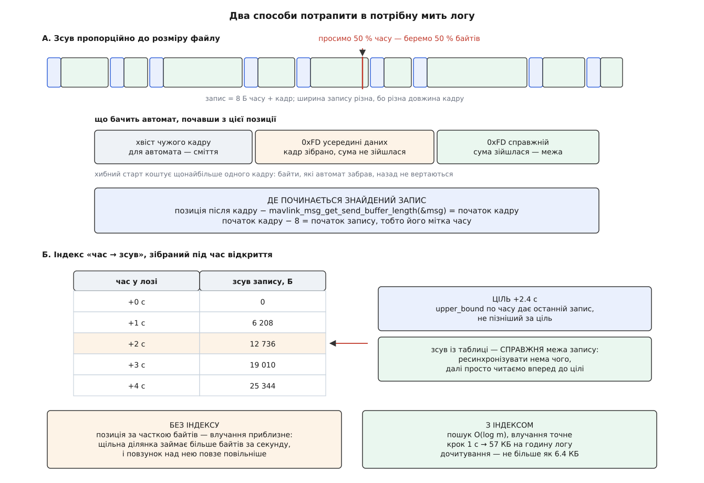

# ⚙️ Читач `.tlog` з нуля: тривалість, точне перемотування, видача в темпі польоту

Це чотириста рядків, які відкривають файл телеметрії, кажуть, скільки тривав політ, стрибають на будь-яку його мить і починають віддавати кадри рівно в тому темпі, у якому вони колись приходили з ефіру. Уся складність тут росте з одного кореня: у цьому файлі немає ані поля довжини, ані заголовка — тож навіть порядок байтів його годинника доводиться вгадувати.

## Задача

Програма командного рядка:

```
tlogplay flight.tlog --seek 62 --speed 2 > /dev/udp/127.0.0.1/14550
```

Чотири вимоги:

1. **Сказати тривалість** — скільки хвилин запису у файлі.
2. **Перемотати на частку часу.** Саме часу: «шістдесят два відсотки польоту», а не «шістдесят два відсотки байтів». Це різні місця, і нижче видно, наскільки різні.
3. **Видавати кадри в темпі**, з множником швидкости.
4. **Не падати на побитому файлі** — обірваному, з чужим порядком байтів, зі сміттям посередині.

Чого програма не робить: не розуміє змісту кадрів. Вона віддає їх байтами, а вже той, кому потрібні значення, розбере їх [словником повідомлень](topic:communications/mavlink-message-dictionary). Такий поділ і робить її придатною одразу для трьох робіт: для власного переглядача, для стенда, що годує логом справжню станцію, і для скрипта, який міряє затримки між командою й відповіддю.

## Формат за півхвилини

Файл — послідовність записів. Запис — вісім байтів часу, за ними кадр як прийшов:

```
[ 8 Б: мікросекунди від епохи Unix, старший байт першим ]
[ кадр MAVLink: від 0xFD (або 0xFE) до контрольної суми  ]
```

Порядок байтів мітки — старший першим; те саме бачимо в `pymavlink`, який пакує її як `struct.pack('>Q', timestamp * 1.0e6)`, а читає як `struct.unpack('>Q', tbuf)`. Це не записано у файлі — це домовленість, яку інструменти повторюють один за одним.

Три властивості формату вирішують усе подальше.

**Довжини запису у форматі немає.** Але це не означає, що довжина невідома: її несе сам кадр. Три перші байти кадру — стартовий байт, довжина навантаження й прапорці несумісности — дають повний розмір арифметикою. Отже, ходити файлом можна швидко, без розбирача. Розбирач знадобиться там, де довіряти цим трьом байтам не можна.

**Заголовка немає.** Файл починається одразу з першого запису. Спитати у файлу, в якому порядку записано його мітки й з якого діалекту його кадри, ніде.

**Мітка не унікальна.** Станція бере мілісекундний годинник і множить на тисячу, тож у її логах кілька кадрів однієї мілісекунди дістають однаковий час. Порядок між ними задає лише порядок у файлі — тому читач ніколи не сортує записи за часом, а лише йде по черзі.

## Мітка: порядок байтів доводиться вгадувати

Логи бувають не тільки від цієї станції. Інші інструменти й старіші версії писали мітку в порядку своєї машини, а формат, який про [порядок байтів](topic:programming/bits-bytes-endianness) мовчить, приречений на здогадки.

Здогадка тримається на порядку величин. Перевернути вісім байтів означає поставити **молодший** байт справжнього числа на місце старшого — а молодший байт мітки поводиться майже як випадковий. Число з нього виходить астрономічне:

```
мить                        2026-08-02 12:00:00 UTC
секунди від епохи Unix      1 785 672 000
мікросекунди                1 785 672 000 000 000    ≈ 1.786·10¹⁵

байти, старший першим       00 06 58 0F 29 3E D0 00
ті самі байти навпаки       00 D0 3E 29 0F 58 06 00
навпаки як число            58 615 141 227 824 640   ≈ 5.862·10¹⁶ мкс
                            ≈ 1857 років від епохи   → 3827 рік

вікно правдоподібности      [2005-01-01 ; зараз + рік]
                          = [1.105·10¹⁵ ; 1.817·10¹⁵]
```

Спокуса — перевіряти кожну мітку окремо: прочитав, вийшло з майбутнього — перевернув. Так робить станція, і на більшості файлів це працює. Але подивімося, коли не працює. Перевернуте прочитання потрапить у вікно правдоподібности рівно тоді, коли два **молодші** байти справжньої мітки виявляться малими — а це не рідкість: приблизно один запис із трьох тисяч. На лозі з чужим порядком байтів це означає сотню міток, які перевірка пропустить неперевернутими. Кожна така мітка виглядатиме правдоподібно — і саме тому зіпсує все: тривалість, індекс і планування видачі.

Отже, порядок байтів — властивість **файлу**, а не запису, і вирішувати його треба один раз. Голосуємо кількома десятками перших міток за двома ознаками: чи потрапляє прочитання у вікно і чи не спадає час:

```cpp
struct RawStamp { uint64_t raw; int64_t off; };   // мітка ЯК Є, без тлумачення

bool chooseSwapped(const std::vector<RawStamp>& head) {
    const uint64_t nowUsec  = static_cast<uint64_t>(std::time(nullptr)) * kUsecPerSec;
    const uint64_t ceilUsec = nowUsec + 365ULL * 86400ULL * kUsecPerSec;

    auto score = [&](bool swapped) {
        int      s = 0;
        uint64_t prev = 0;
        bool     havePrev = false;
        for (const RawStamp& h : head) {
            const uint64_t t = swapped ? swap64(h.raw) : h.raw;
            s += (t >= kStampFloorUsec && t <= ceilUsec) ? +1 : -1;
            if (havePrev) s += (t >= prev) ? +1 : -1;
            prev = t;
            havePrev = true;
        }
        return s;
    };

    return score(true) > score(false);   // рівність → старший-перший, як велить формат
}
```

Ознака «час не спадає» тут важить не менше за вікно. Вона ловить випадок, на якому саме лише вікно безсиле: лог, записаний машиною з годинником, збитим на кілька років уперед. Правильне прочитання таких міток буде поза вікном, зате не спадатиме, а перевернуте — стрибатиме як завгодно.

> 🔧 **Навіщо це.** Одна хибно прочитана мітка — це не «трохи неточний час». Це запис, який за таблицею часу опиняється в 3827 році, тягне за собою тривалість логу й ламає індекс. Тому єдине рішення на весь файл коштує шістдесяти чотирьох записів на початку й закриває тему назавжди.

## Прохід відкриття: тривалість, індекс і довжина кадру без розбирача

Тривалости логу не дізнатися інакше, ніж дійшовши до останнього запису, — попереду немає ані заголовка, ані таблиці. Отже, відкриття коштує повного проходу файлом. Але якщо вже платимо за прохід, то платити варто один раз і брати з нього все.

Прохід не потребує розбирача. Довжина кадру виводиться з трьох його перших байтів:

```cpp
int frameLength(const uint8_t* h) {
    if (h[0] == MAVLINK_STX)              // 0xFD — MAVLink 2
        return MAVLINK_NUM_NON_PAYLOAD_BYTES + h[1] +
               ((h[2] & MAVLINK_IFLAG_SIGNED) ? MAVLINK_SIGNATURE_BLOCK_LEN : 0);
    if (h[0] == MAVLINK_STX_MAVLINK1)     // 0xFE — MAVLink 1
        return MAVLINK_CORE_HEADER_MAVLINK1_LEN + 1 + 2 + h[1];
    return -1;                            // тут не кадр
}
```

Дванадцять службових байтів версії 2 — це десять заголовка й два суми; вісім байтів версії 1 — шість і два. Тринадцять байтів підпису додаються лише тоді, коли прапорець несумісности каже, що кадр підписаний; станція підписи з логу знімає, але чужий лог їх мати може. Ті самі числа рахує й бібліотечна `mavlink_msg_get_send_buffer_length` — вона знадобиться нижче, коли кадр уже розібрано.

Далі прохід виглядає так: прочитати вісім байтів мітки, прочитати три байти заголовка, перескочити решту кадру. Розбирач при цьому не бачить жодного байта навантаження:

```
Умова: година польоту, 120 повідомлень за секунду, середній кадр 45 Б.

записів у файлі         120 · 3600            = 432 000
запис                   45 + 8                = 53 Б
файл                    432 000 · 53          ≈ 22.9 МБ

з диска йде весь файл, але процесор чіпає лише
                        432 000 · 11          ≈ 4.8 МБ

індекс на КОЖЕН запис    432 000 · 16 Б       ≈ 6.9 МБ
індекс із кроком 1 с     3 600 · 16 Б         ≈ 57 КБ
дочитати після стрибка   ≤ 1 с логу = 120 записів ≈ 6.4 КБ
```

Індекс — це і є друга здобич проходу. Кожні кілька секунд логового часу відкладаємо пару «час → зсув початку запису». Крок вирішує розмін: щільніший індекс — точніший стрибок і більше пам'яті. Секунда — вдалий компроміс: п'ятдесят сім кілобайтів на годину запису, а дочитувати після стрибка доводиться щонайбільше шість кілобайтів.

Індекс виходить упорядкованим за часом **за побудовою**, бо запис у нього кладеться лише тоді, коли час перевищив попередню відмітку. Це важливо: далі по ньому працюватиме [двійковий пошук](topic:algorithms/binary-search), а той вимагає впорядкованости й нічого не пробачає.

Прохід заразом дає й діагностику. Якщо на місці заголовка виявився не кадр, ланцюг зірвався — файл побитий. Тоді прохід не здається, а шукає найближчу справжню межу заново й рахує розрив. Якщо байти скінчилися посеред кадру — хвіст обірваний, і це нормальний стан файлу, який лишився від застосунку, що впав. Якщо якийсь запис виявився в минулому щодо попереднього — годинник під час запису переводили, і це доведеться врахувати при видачі.

## Ресинхронізація: коли довіряти трьом байтам не можна

Стрибок на довільний зсув у байтах майже напевно потрапляє в середину кадру. Три байти в тому місці — це не заголовок, а шматок чиєїсь широти, і `frameLength` дасть із них будь-що. Тут потрібен саме розбирач: він не вірить, а перевіряє суму.

[Інкрементний розбирач](topic:programming/stream-parser) бібліотеки MAVLink тримає стан на канал, і перше, що треба зробити, — цей стан викинути:

```cpp
int64_t TlogReader::resyncFrom(int64_t byteOffset) {
    if (!_f.seek(byteOffset)) return -1;

    // Обов'язково: у слоті каналу лежить недобудований кадр із попереднього місця
    // файлу, і без скидання перший же байт нової позиції продовжив би саме його.
    mavlink_reset_channel_status(kChannel);

    mavlink_message_t msg{};
    mavlink_status_t  st{};
    uint8_t b = 0;
    for (int64_t scanned = 0; scanned < kResyncLimit && _f.getByte(b); ++scanned) {
        if (!mavlink_parse_char(kChannel, b, &msg, &st)) continue;

        const int64_t frameEnd   = _f.tell();
        const int64_t frameStart = frameEnd - mavlink_msg_get_send_buffer_length(&msg);
        const int64_t recStart   = frameStart - kStampBytes;
        if (recStart >= 0) return recStart;
    }
    return -1;
}
```

Автомат сам знаходить стартовий байт, збирає кадр, звіряє суму — і перший кадр, що зійшовся, є найближчою чесною межею. Але потрібна нам межа не його, а **запису**: мітка часу цього кадру лежить на вісім байтів раніше за його початок, і ми її вже проминули.

Дістати її можна арифметикою. Розібране повідомлення пам'ятає і свій стартовий байт, і довжину навантаження, і прапорець підпису, тож `mavlink_msg_get_send_buffer_length` відновлює точну довжину кадру в байтах. Віднімаємо її від поточної позиції — маємо початок кадру; віднімаємо ще вісім — маємо початок запису разом із його часом.



*Зсув за часткою байтів завжди потребує пошуку межі; зсув із індексу вже є межею.*

Дві ціни цього способу варто знати наперед.

**Хибний старт.** Байт `0xFD` трапляється всередині навантаження приблизно раз на двісті п'ятдесят шість байтів, і автомат щоразу пробує зібрати з нього кадр. Здебільшого спроба гине рано: бібліотека звіряє заявлену довжину з тим, що знає про це повідомлення (`rxmsg->len < mavlink_min_message_length(rxmsg)`), і відкидає безглузді пари «номер — довжина», не дочекавшись суми. Що вціліло — відсіє сума. Але байти, які автомат уже забрав, назад не повертаються, тож хибний старт може з'їсти один справжній кадр. На перемотуванні це коштує одного пропущеного повідомлення й нічого більше.

**Хибний збіг.** Випадкові два байти зійдуться з контрольною сумою не частіше ніж раз на 65 536 спроб, а насправді рідше: збігтися мусять і номер повідомлення, і його довжина. Але «рідко» — не «ніколи», а результат такого збігу підступний: зсув, який виглядає межею запису й нею не є. Дешевий захист — вимагати, щоб одразу за знайденим записом розібрався ще один:

```cpp
bool TlogReader::seekToByte(int64_t byteOffset) {
    const int64_t rec = resyncFrom(byteOffset);
    if (rec < 0 || !positionAtRecord(rec)) return false;

    std::vector<uint8_t> probe;
    uint64_t t = 0;
    if (!next(t, probe)) return false;            // перший кадр після зсуву
    bool confirmed = !_hasPending;                // це був останній запис у файлі
    if (!confirmed) confirmed = next(t, probe);   // за ним розібрався ще один
    if (!confirmed) return false;

    return positionAtRecord(rec);
}
```

Два незалежні збіги поспіль — це вже 2⁻³², і про них можна забути.

## Крок читання: кадр і одразу наступні вісім байтів

Тепер послідовне читання. Тут напрошується прямий порядок: прочитав мітку, прочитав кадр, віддав. Він працює, але породжує неприємну асиметрію — щоб зрозуміти, **коли** віддавати наступний кадр, треба спершу прочитати його мітку, тобто зазирнути вперед і або відкотити позицію, або тримати чергу.

Тому інваріант ставимо інакше: **у полі стану завжди лежить час запису, який ще не віддано, а файлова позиція стоїть одразу після його мітки**. Один крок читання тоді робить дві речі за один прохід:

```cpp
bool TlogReader::next(uint64_t& tUsec, std::vector<uint8_t>& frame) {
    if (!_hasPending) return false;
    tUsec = _pendingT;
    frame.clear();

    // Межа кадру відома точно — він починається одразу після мітки. Тому стан
    // каналу скидаємо на КОЖНОМУ записі; у живому лінку таке скидання з'їдало б
    // недозібраний кадр, а тут воно робить записи незалежними один від одного.
    mavlink_reset_channel_status(kChannel);

    mavlink_message_t msg{};
    mavlink_status_t  st{};
    uint8_t b = 0;
    while (_f.getByte(b)) {
        frame.push_back(b);
        if (mavlink_parse_char(kChannel, b, &msg, &st)) {
            uint8_t stamp[kStampBytes];
            _hasPending = _f.read(stamp, kStampBytes);   // мітка НАСТУПНОГО запису
            if (_hasPending) _pendingT = decode(stamp);
            return true;
        }
        if (frame.size() > MAVLINK_MAX_PACKET_LEN) break;
    }
    _hasPending = false;
    _truncated  = true;
    return false;
}
```

Вигода не в заощаджених читаннях — вона в тому, що станів лишається рівно один. Планувальникові видачі не треба нікуди зазирати: час, який він порівнює з годинником, уже лежить у полі. А порожнє поле означає кінець файлу, тож окрема перевірка «чи є ще щось» не потрібна.

Тут же обробляються два кінці. Мітка не дочиталася — файл скінчився охайно, на межі запису. Байти скінчилися посеред кадру — хвіст обірваний; це не помилка й не привід відмовлятися від файлу, це звичайний слід аварійного завершення застосунку.

## Перемотування: індекс замість пропорції

З індексом перемотування стає нудним — і це найкраща похвала:

```cpp
bool TlogReader::seekToTime(uint64_t tUsec) {
    if (_index.empty()) return false;

    auto it = std::upper_bound(_index.begin(), _index.end(), tUsec,
                               [](uint64_t t, const IndexEntry& e) { return t < e.tUsec; });
    const IndexEntry& e = (it == _index.begin()) ? _index.front() : *(it - 1);
    if (!positionAtRecord(e.offset)) return false;

    std::vector<uint8_t> skip;
    uint64_t t = 0;
    while (_hasPending && _pendingT < tUsec) {
        if (!next(t, skip)) break;
    }
    return true;
}
```

Зсув із таблиці — справжня межа запису, тож ресинхронізувати нема чого: стаємо й читаємо вперед, доки час не дійде до цілі. Дочитування обмежене кроком індексу, тобто секундою логу.

Порівняймо з тим, що дає позиція, взята пропорційно до **розміру** файлу. Щільність повідомлень протягом польоту нерівномірна: ділянка з активною телеметрією й командами камери займає більше байтів за секунду, ніж хвилина стояння на землі. Половина файлу за байтами — це не половина польоту за часом, і повзунок над щільною ділянкою ніби гальмує. Індекс цю нерівномірність знімає повністю, а платить за неї одним проходом, який ми однаково робимо заради тривалости.

## Темп: опора нерухома, вікно згладжування

Лишилося видавати кадри так, щоб записане виглядало польотом.

Проста схема — «різниця міток двох сусідніх записів, поспати стільки, видати наступний» — розсипається на довгому лозі. Таймер ніколи не спрацьовує рівно, і кожен крок дає похибку в **один** бік: запізнення. Тисяча кроків із середнім запізненням у пів мілісекунди — це пів секунди відставання, а кроків за годину відтворення десятки тисяч.

Тому опора нерухома. У момент запуску запам'ятовуємо дві точки — час у лозі й показ годинника — і далі кожен запис планується від них, а не від попереднього кроку:

```cpp
void playback(TlogReader& log, double speed) {
    using Clock = std::chrono::steady_clock;   // МОНОТОННИЙ: тут ми міряємо
                                               // проміжок, а не позначаємо подію
    uint64_t anchorLogUsec = 0;
    if (!log.pending(anchorLogUsec)) return;
    const Clock::time_point anchorTick = Clock::now();

    std::vector<uint8_t> frame;
    uint64_t t = 0;
    while (log.pending(t)) {
        // ЗНАКОВО. Мітка, менша за опору, у беззнаковій арифметиці дала б
        // 2⁶⁴ мінус дрібниця — і програвач заснув би на 585 тисяч років.
        const int64_t aheadUsec = static_cast<int64_t>(t) - static_cast<int64_t>(anchorLogUsec);
        const int64_t dueMs     = static_cast<int64_t>(aheadUsec / 1000.0 / speed);
        const auto    due       = anchorTick + std::chrono::milliseconds(dueMs);
        const int64_t waitMs    =
            std::chrono::duration_cast<std::chrono::milliseconds>(due - Clock::now()).count();

        if (waitMs >= kBatchWindowMs) {
            std::this_thread::sleep_for(std::chrono::milliseconds(waitMs));
            continue;
        }
        if (!log.next(t, frame)) break;
        emit(t, frame);
    }
}
```

Годинник тут навмисно **монотонний**, хоча мітки у файлі — настінні. Мітки настінні тому, що їхнє призначення — зіставляти події з іншими журналами того дня; а от проміжок між двома видачами міряють годинником, який не можна перевести, інакше нічний перехід на зимовий час зупинить відтворення на годину. Різниця між двома [видами годинників](topic:programming/monotonic-vs-wall-time) — це не педантизм, а розділення двох різних задач.

Другий бік цієї ж формули — вікно згладжування. Видавати кожен кадр окремим спрацюванням таймера неможливо: за півсекунди телеметрії буває шістдесят повідомлень, а таймер із мілісекундною роздільністю стільки разів не встигне. Тому все, до чого лишилося менше за три мілісекунди, вилітає однією пачкою, без сну. Це не спотворення: радіоканал робить те саме — віддає застосункові порцію байтів, що встигла накопичитися.

У тому самому порівнянні ховається догін. Якщо програвач відстав, `waitMs` виходить від'ємним — тобто теж меншим за поріг, — і цикл крутиться без пауз, поки не наздожене графік. Один рядок дає обидві поведінки.

## Робочий код

Обидві вкладки роблять те саме й мають однаковий інтерфейс командного рядка. C++ — коли читач стає частиною станції або має тягнути стомегабайтний лог у реальному темпі. Python — коли лог треба швидко подивитися, і різниця в швидкості проходу нікого не турбує.

Внутрішній устрій у них навмисно не збігається дослівно. Прохід відкриття арифметичний в обох: там важить лише швидкість. А крок читання в C++ пропущено через розбирач — він коштує розбору одного кадру на запис, зате звіряє суму й не дає побитому полю довжини завести читача в нікуди. Python на кроці читання довіряє заголовку так само, як на проході; для інструмента, що просто дивиться лог, ця довіра прийнятна, а розбирач `pymavlink` вмикається лише там, де без звіряння суми не обійтися взагалі, — на ресинхронізації.

:::tabs

```cpp
// tlogplay.cpp — читач логу телеметрії .tlog
// збірка: g++ -O2 -std=c++17 tlogplay.cpp -I<тека згенерованого MAVLink> -o tlogplay
#include <common/mavlink.h>

#include <algorithm>
#include <chrono>
#include <cstdint>
#include <cstdio>
#include <cstdlib>
#include <cstring>
#include <ctime>
#include <thread>
#include <vector>

// ── сталі ───────────────────────────────────────────────────────────────────
constexpr int      kStampBytes    = 8;
constexpr uint64_t kUsecPerSec    = 1000000ULL;
constexpr uint64_t kIndexStepUsec = 1 * kUsecPerSec;  // крок таблиці «час → зсув»
constexpr size_t   kProbeRecords  = 64;               // на скількох мітках вирішуємо порядок
constexpr int64_t  kResyncLimit   = 1 << 16;          // стеля скану межі кадру, байтів
constexpr int      kBatchWindowMs = 3;                // ближче за це — однією пачкою
constexpr uint8_t  kChannel       = MAVLINK_COMM_1;   // НЕ той канал, де живий лінк

constexpr uint64_t kStampFloorUsec = 1104537600ULL * kUsecPerSec;  // 2005-01-01

uint64_t beToU64(const uint8_t* p) {
    uint64_t v = 0;
    for (int i = 0; i < kStampBytes; ++i) v = (v << 8) | p[i];
    return v;
}

uint64_t swap64(uint64_t v) {
    uint64_t r = 0;
    for (int i = 0; i < kStampBytes; ++i) { r = (r << 8) | (v & 0xFFu); v >>= 8; }
    return r;
}

int frameLength(const uint8_t* h) {
    if (h[0] == MAVLINK_STX)              // 0xFD — MAVLink 2
        return MAVLINK_NUM_NON_PAYLOAD_BYTES + h[1] +
               ((h[2] & MAVLINK_IFLAG_SIGNED) ? MAVLINK_SIGNATURE_BLOCK_LEN : 0);
    if (h[0] == MAVLINK_STX_MAVLINK1)     // 0xFE — MAVLink 1
        return MAVLINK_CORE_HEADER_MAVLINK1_LEN + 1 + 2 + h[1];
    return -1;
}

// ── буферизоване читання з довільним позиціюванням ──────────────────────────
class FileBytes {
public:
    ~FileBytes() { if (_f) std::fclose(_f); }

    bool open(const char* path) {
        _f = std::fopen(path, "rb");
        if (!_f) return false;
        if (!seekRaw(0, SEEK_END)) return false;
        _size = tellRaw();
        return seek(0);
    }

    int64_t size() const { return _size; }
    int64_t tell() const { return _bufStart + static_cast<int64_t>(_bufPos); }

    bool seek(int64_t off) {
        if (off < 0 || off > _size || !seekRaw(off, SEEK_SET)) return false;
        _bufStart = off;
        _bufPos = _bufLen = 0;
        return true;
    }

    bool getByte(uint8_t& b) {
        if (_bufPos == _bufLen && !refill()) return false;
        b = _buf[_bufPos++];
        return true;
    }

    bool read(uint8_t* dst, size_t n) {
        for (size_t i = 0; i < n; ++i) if (!getByte(dst[i])) return false;
        return true;
    }

    bool skip(int64_t n) {                       // перескочити, не копіюючи
        if (n < 0 || tell() + n > _size) return false;
        const int64_t inBuf = static_cast<int64_t>(_bufLen - _bufPos);
        if (n <= inBuf) { _bufPos += static_cast<size_t>(n); return true; }
        return seek(tell() + n);
    }

private:
    bool refill() {
        _bufStart += static_cast<int64_t>(_bufLen);
        _bufPos = 0;
        _bufLen = std::fread(_buf, 1, sizeof(_buf), _f);
        return _bufLen > 0;
    }
    bool seekRaw(int64_t off, int whence) {
#if defined(_WIN32)
        return _fseeki64(_f, off, whence) == 0;
#else
        return fseeko(_f, static_cast<off_t>(off), whence) == 0;
#endif
    }
    int64_t tellRaw() {
#if defined(_WIN32)
        return _ftelli64(_f);
#else
        return static_cast<int64_t>(ftello(_f));
#endif
    }

    std::FILE* _f = nullptr;
    int64_t    _size = 0, _bufStart = 0;
    size_t     _bufLen = 0, _bufPos = 0;
    uint8_t    _buf[64 * 1024];
};

// ── читач ───────────────────────────────────────────────────────────────────
struct IndexEntry { uint64_t tUsec; int64_t offset; };
struct RawStamp   { uint64_t raw;   int64_t off;    };

bool chooseSwapped(const std::vector<RawStamp>& head) {
    const uint64_t nowUsec  = static_cast<uint64_t>(std::time(nullptr)) * kUsecPerSec;
    const uint64_t ceilUsec = nowUsec + 365ULL * 86400ULL * kUsecPerSec;

    auto score = [&](bool swapped) {
        int      s = 0;
        uint64_t prev = 0;
        bool     havePrev = false;
        for (const RawStamp& h : head) {
            const uint64_t t = swapped ? swap64(h.raw) : h.raw;
            s += (t >= kStampFloorUsec && t <= ceilUsec) ? +1 : -1;
            if (havePrev) s += (t >= prev) ? +1 : -1;
            prev = t;
            havePrev = true;
        }
        return s;
    };
    return score(true) > score(false);    // рівність → старший-перший
}

class TlogReader {
public:
    bool open(const char* path) {
        if (!_f.open(path) || _f.size() < kStampBytes) return false;
        if (!scanFile()) return false;
        return positionAtRecord(0);
    }

    uint64_t firstUsec()    const { return _first; }
    uint64_t durationUsec() const { return _last > _first ? _last - _first : 0; }
    int      backSteps()    const { return _backSteps; }
    int      breaks()       const { return _breaks; }
    bool     truncated()    const { return _truncated; }

    bool pending(uint64_t& tUsec) const {
        if (!_hasPending) return false;
        tUsec = _pendingT;
        return true;
    }

    bool positionAtRecord(int64_t offset) {
        uint8_t stamp[kStampBytes];
        if (!_f.seek(offset) || !_f.read(stamp, kStampBytes)) { _hasPending = false; return false; }
        _pendingT   = decode(stamp);
        _hasPending = true;
        return true;
    }

    bool next(uint64_t& tUsec, std::vector<uint8_t>& frame) {
        if (!_hasPending) return false;
        tUsec = _pendingT;
        frame.clear();

        mavlink_reset_channel_status(kChannel);

        mavlink_message_t msg{};
        mavlink_status_t  st{};
        uint8_t b = 0;
        while (_f.getByte(b)) {
            frame.push_back(b);
            if (mavlink_parse_char(kChannel, b, &msg, &st)) {
                uint8_t stamp[kStampBytes];
                _hasPending = _f.read(stamp, kStampBytes);
                if (_hasPending) _pendingT = decode(stamp);
                return true;
            }
            if (frame.size() > MAVLINK_MAX_PACKET_LEN) break;
        }
        _hasPending = false;
        _truncated  = true;
        return false;
    }

    int64_t resyncFrom(int64_t byteOffset) {
        if (!_f.seek(byteOffset)) return -1;
        mavlink_reset_channel_status(kChannel);

        mavlink_message_t msg{};
        mavlink_status_t  st{};
        uint8_t b = 0;
        for (int64_t scanned = 0; scanned < kResyncLimit && _f.getByte(b); ++scanned) {
            if (!mavlink_parse_char(kChannel, b, &msg, &st)) continue;
            const int64_t frameEnd   = _f.tell();
            const int64_t frameStart = frameEnd - mavlink_msg_get_send_buffer_length(&msg);
            const int64_t recStart   = frameStart - kStampBytes;
            if (recStart >= 0) return recStart;
        }
        return -1;
    }

    bool seekToByte(int64_t byteOffset) {
        const int64_t rec = resyncFrom(byteOffset);
        if (rec < 0 || !positionAtRecord(rec)) return false;

        std::vector<uint8_t> probe;
        uint64_t t = 0;
        if (!next(t, probe)) return false;
        bool confirmed = !_hasPending;
        if (!confirmed) confirmed = next(t, probe);
        if (!confirmed) return false;
        return positionAtRecord(rec);
    }

    bool seekToTime(uint64_t tUsec) {
        if (_index.empty()) return false;
        auto it = std::upper_bound(_index.begin(), _index.end(), tUsec,
                                   [](uint64_t t, const IndexEntry& e) { return t < e.tUsec; });
        const IndexEntry& e = (it == _index.begin()) ? _index.front() : *(it - 1);
        if (!positionAtRecord(e.offset)) return false;

        std::vector<uint8_t> skip;
        uint64_t t = 0;
        while (_hasPending && _pendingT < tUsec) {
            if (!next(t, skip)) break;
        }
        return true;
    }

private:
    uint64_t decode(const uint8_t* p) const {
        const uint64_t v = beToU64(p);
        return _swapped ? swap64(v) : v;
    }

    bool scanFile() {
        if (!_f.seek(0)) return false;

        std::vector<RawStamp> head;
        head.reserve(kProbeRecords);

        bool     decided = false, haveFirst = false;
        uint64_t nextIndexT = 0, prevT = 0;

        auto accept = [&](uint64_t raw, int64_t off) {
            const uint64_t t = _swapped ? swap64(raw) : raw;
            if (!haveFirst) { _first = t; nextIndexT = t; haveFirst = true; }
            else if (t < prevT) ++_backSteps;
            prevT = t;
            _last = t;
            if (t >= nextIndexT) {
                _index.push_back({t, off});
                nextIndexT = t + kIndexStepUsec;
            }
        };

        while (true) {
            const int64_t recOffset = _f.tell();
            uint8_t stamp[kStampBytes];
            if (!_f.read(stamp, kStampBytes)) break;        // охайний кінець файлу

            uint8_t hdr[3];
            if (!_f.read(hdr, 3)) { _truncated = true; break; }
            const int flen = frameLength(hdr);
            if (flen < 0) {                                  // ланцюг зірвався
                const int64_t rec = resyncFrom(recOffset + 1);
                if (rec < 0) { _truncated = true; break; }
                ++_breaks;
                _f.seek(rec);
                continue;
            }
            if (!_f.skip(flen - 3)) { _truncated = true; break; }

            if (decided) {
                accept(beToU64(stamp), recOffset);
            } else {
                head.push_back({beToU64(stamp), recOffset});
                if (head.size() == kProbeRecords) {
                    _swapped = chooseSwapped(head);
                    decided  = true;
                    for (const RawStamp& h : head) accept(h.raw, h.off);
                }
            }
        }

        if (!decided) {                                      // файл коротший за пробу
            _swapped = chooseSwapped(head);
            for (const RawStamp& h : head) accept(h.raw, h.off);
        }
        return haveFirst;
    }

    FileBytes               _f;
    std::vector<IndexEntry> _index;
    uint64_t _first = 0, _last = 0, _pendingT = 0;
    bool     _hasPending = false, _swapped = false, _truncated = false;
    int      _backSteps = 0, _breaks = 0;
};

// ── видача ──────────────────────────────────────────────────────────────────
void emit(uint64_t /*tUsec*/, const std::vector<uint8_t>& frame) {
    std::fwrite(frame.data(), 1, frame.size(), stdout);   // кадр як є: далі — труба
}

void playback(TlogReader& log, double speed) {
    using Clock = std::chrono::steady_clock;

    uint64_t anchorLogUsec = 0;
    if (!log.pending(anchorLogUsec)) return;
    const Clock::time_point anchorTick = Clock::now();

    std::vector<uint8_t> frame;
    uint64_t t = 0;
    while (log.pending(t)) {
        const int64_t aheadUsec = static_cast<int64_t>(t) - static_cast<int64_t>(anchorLogUsec);
        const int64_t dueMs     = static_cast<int64_t>(aheadUsec / 1000.0 / speed);
        const auto    due       = anchorTick + std::chrono::milliseconds(dueMs);
        const int64_t waitMs    =
            std::chrono::duration_cast<std::chrono::milliseconds>(due - Clock::now()).count();

        if (waitMs >= kBatchWindowMs) {
            std::this_thread::sleep_for(std::chrono::milliseconds(waitMs));
            continue;
        }
        if (!log.next(t, frame)) break;
        emit(t, frame);
    }
}

int main(int argc, char** argv) {
    if (argc < 2) {
        std::fprintf(stderr, "usage: tlogplay FILE [--seek PCT] [--speed X]\n");
        return 2;
    }
    double pct = 0.0, speed = 1.0;
    for (int i = 2; i + 1 < argc; i += 2) {
        if (!std::strcmp(argv[i], "--seek"))  pct   = std::atof(argv[i + 1]);
        if (!std::strcmp(argv[i], "--speed")) speed = std::atof(argv[i + 1]);
    }

    TlogReader log;
    if (!log.open(argv[1])) {
        std::fprintf(stderr, "не відкривається або порожній: %s\n", argv[1]);
        return 1;
    }

    const uint64_t dur = log.durationUsec();
    std::fprintf(stderr, "тривалість %.3f с · стрибків часу назад %d · розривів %d%s\n",
                 static_cast<double>(dur) / 1e6, log.backSteps(), log.breaks(),
                 log.truncated() ? " · хвіст обірваний" : "");

    if (pct > 0.0) {
        if (dur == 0) std::fprintf(stderr, "нульова тривалість: перемотувати нема куди\n");
        else log.seekToTime(log.firstUsec() + static_cast<uint64_t>(dur * (pct / 100.0)));
    }

    playback(log, speed);
    return 0;
}
```

```python
#!/usr/bin/env python3
"""tlogplay.py — читач логу телеметрії .tlog: тривалість, перемотування, темп."""
import argparse
import bisect
import sys
import time

from pymavlink.dialects.v20 import common as mav2

STAMP         = 8
USEC          = 1_000_000
INDEX_STEP    = 1 * USEC              # крок таблиці «час → зсув»
PROBE_RECORDS = 64                    # на скількох мітках вирішуємо порядок байтів
RESYNC_LIMIT  = 1 << 16               # стеля скану межі кадру, байтів
BATCH_WINDOW  = 0.003                 # с: ближче за це — однією пачкою
STAMP_FLOOR   = 1_104_537_600 * USEC  # 2005-01-01


def frame_length(hdr):
    """Довжина кадру за трьома першими байтами; None — це не кадр."""
    if hdr[0] == 0xFD:                                    # MAVLink 2
        return 12 + hdr[1] + (13 if hdr[2] & 0x01 else 0)
    if hdr[0] == 0xFE:                                    # MAVLink 1
        return 8 + hdr[1]
    return None


class Tlog:
    def __init__(self, path):
        self.f = open(path, "rb")
        self.swapped = False
        self.index = []                # [(t_usec, offset)], зростає за часом
        self.first = self.last = 0
        self.back_steps = self.breaks = 0
        self.truncated = False
        self.pending_t = None
        self._scan()
        self.position_at(0)

    # ── мітка ───────────────────────────────────────────────────────────────
    def _decode(self, raw):
        # прочитати ті самі байти як little-endian — і є перевертання
        return int.from_bytes(raw, "little" if self.swapped else "big")

    def _decide(self, head):
        ceil_usec = int(time.time() + 365 * 86400) * USEC

        def score(swapped):
            s, prev = 0, None
            for raw, _ in head:
                t = int.from_bytes(raw, "little" if swapped else "big")
                s += 1 if STAMP_FLOOR <= t <= ceil_usec else -1
                if prev is not None:
                    s += 1 if t >= prev else -1
                prev = t
            return s

        self.swapped = score(True) > score(False)   # рівність → старший-перший

    # ── прохід відкриття: тривалість, індекс, діагностика ───────────────────
    def _scan(self):
        self.f.seek(0)
        head, decided = [], False
        next_index = prev = None

        def accept(raw, off):
            nonlocal next_index, prev
            t = self._decode(raw)
            if next_index is None:
                self.first, next_index = t, t
            elif t < prev:
                self.back_steps += 1
            prev = self.last = t
            if t >= next_index:
                self.index.append((t, off))
                next_index = t + INDEX_STEP

        while True:
            off = self.f.tell()
            raw = self.f.read(STAMP)
            if len(raw) < STAMP:                    # охайний кінець файлу
                break

            hdr = self.f.read(3)
            if len(hdr) < 3:
                self.truncated = True
                break
            flen = frame_length(hdr)
            if flen is None:                        # ланцюг зірвався
                rec = self.resync_from(off + 1)
                if rec is None:
                    self.truncated = True
                    break
                self.breaks += 1
                self.f.seek(rec)
                continue
            if len(self.f.read(flen - 3)) < flen - 3:
                self.truncated = True
                break

            if decided:
                accept(raw, off)
            else:
                head.append((raw, off))
                if len(head) == PROBE_RECORDS:
                    self._decide(head)
                    decided = True
                    for r, o in head:
                        accept(r, o)

        if not decided:                             # файл коротший за пробу
            self._decide(head)
            for r, o in head:
                accept(r, o)

    # ── ресинхронізація: тут довіряти заголовкові не можна ──────────────────
    def resync_from(self, offset):
        """Найближчий після offset справжній початок ЗАПИСУ, або None."""
        self.f.seek(offset)
        mav = mav2.MAVLink(None)        # свіжий автомат = порожній стан каналу
        mav.robust_parsing = True       # сміття → BAD_DATA замість винятку

        scanned = 0
        while scanned < RESYNC_LIMIT:
            chunk = self.f.read(4096)
            if not chunk:
                return None
            scanned += len(chunk)
            for i, b in enumerate(chunk):
                msg = mav.parse_char(bytes([b]))
                if msg is None or msg.get_type() == "BAD_DATA":
                    continue
                frame_end = self.f.tell() - (len(chunk) - i - 1)
                rec = frame_end - len(msg.get_msgbuf()) - STAMP
                return rec if rec >= 0 else None
        return None

    # ── послідовне читання: кадр і одразу наступні вісім байтів ─────────────
    def position_at(self, offset):
        self.f.seek(offset)
        raw = self.f.read(STAMP)
        self.pending_t = self._decode(raw) if len(raw) == STAMP else None
        return self.pending_t is not None

    def next(self):
        """(t_usec, frame) поточного запису; далі стаємо на наступний."""
        if self.pending_t is None:
            return None
        t = self.pending_t

        hdr = self.f.read(3)
        flen = frame_length(hdr) if len(hdr) == 3 else None
        if flen is None:
            self.pending_t, self.truncated = None, True
            return None
        rest = self.f.read(flen - 3)
        if len(rest) < flen - 3:
            self.pending_t, self.truncated = None, True
            return None

        raw = self.f.read(STAMP)                    # мітка НАСТУПНОГО запису
        self.pending_t = self._decode(raw) if len(raw) == STAMP else None
        return t, hdr + rest

    # ── перемотування ──────────────────────────────────────────────────────
    def seek_to_time(self, t_usec):
        if not self.index:
            return False
        i = max(bisect.bisect_right(self.index, (t_usec, 1 << 62)) - 1, 0)
        self.position_at(self.index[i][1])
        while self.pending_t is not None and self.pending_t < t_usec:
            if self.next() is None:
                break
        return True

    def duration(self):
        return self.last - self.first if self.last > self.first else 0


def main():
    ap = argparse.ArgumentParser()
    ap.add_argument("file")
    ap.add_argument("--seek", type=float, default=0.0, help="відсоток тривалости")
    ap.add_argument("--speed", type=float, default=1.0)
    a = ap.parse_args()

    log = Tlog(a.file)
    dur = log.duration()
    print("тривалість %.3f с · стрибків часу назад %d · розривів %d%s"
          % (dur / 1e6, log.back_steps, log.breaks,
             " · хвіст обірваний" if log.truncated else ""), file=sys.stderr)

    if a.seek > 0:
        if dur == 0:
            print("нульова тривалість: перемотувати нема куди", file=sys.stderr)
        else:
            log.seek_to_time(log.first + int(dur * a.seek / 100.0))

    anchor_log = log.pending_t
    if anchor_log is None:
        return
    anchor_tick = time.monotonic()          # МОНОТОННИЙ: міряємо проміжок

    out = sys.stdout.buffer
    while log.pending_t is not None:
        # цілі в Python довільної точности й знакові — пастки з 2⁶⁴ тут немає
        ahead = log.pending_t - anchor_log
        wait = (anchor_tick + ahead / 1e6 / a.speed) - time.monotonic()
        if wait >= BATCH_WINDOW:
            time.sleep(wait)
            continue
        rec = log.next()
        if rec is None:
            break
        out.write(rec[1])
    out.flush()


if __name__ == "__main__":
    main()
```

:::

## Складність

```
n — байтів у файлі · m — рядків індексу · T — тривалість логу

відкриття             O(n)          один прохід, розбирач не бачить навантаження
пам'ять індексу       O(T / крок)   16 Б на рядок; 57 КБ на годину при кроці 1 с
перемотування за часом O(log m)     плюс дочитування ≤ одного кроку індексу
крок читання          O(1)          не більше як 280 Б — стеля кадру
ресинхронізація       O(d)          d — відстань до межі, стеля 64 КіБ
```

Один рядок тут вартий окремої уваги: **відкриття лінійне, і швидшим воно не буде**. Тривалість лежить у кінці ланцюга, а ланцюг не має ані заголовка, ані оглядової таблиці. Єдиний спосіб зробити відкриття дешевшим — покласти індекс поруч із логом окремим файлом, який будується один раз. Формат такого не передбачає, зате ніщо не заважає власному інструменту тримати кеш індексів у себе.

## Пастки

**Беззнакове віднімання часу.** Найдорожча помилка в усій програмі — один пропущений `static_cast<int64_t>`. Мітки — беззнакові шістдесятичотирибітні, і різниця двох таких, коли зменшуване менше, не стає від'ємною, а [обертається за модулем 2⁶⁴](topic:programming/unsigned-overflow):

```
мітка запису           t  = 1 785 672 000 000 000
опора                  t₀ = 1 785 672 000 500 000   (запис із часом НАЗАД)

знаково   (int64)   t − t₀ = −500 000 мкс           → чекати −500 мс → видати негайно
беззнаково (uint64) t − t₀ = 2⁶⁴ − 500 000
                           = 18 446 744 073 709 051 616 мкс
                           ≈ 584 554 роки
```

Мітка, що йде назад, — не екзотика: годинник під час запису могли перевести, його міг підтягнути мережевий синхронізатор, а могла й одна мітка прочитатися хибно. Знакова різниця перетворює такий запис на «видати негайно» й іде далі; беззнакова вішає програвач намертво, і виглядає це як зависання без жодного повідомлення про помилку.

**Обірваний останній запис.** Файл, що лишився від застосунку, який упав, майже завжди кінчається посеред кадру. Це не пошкодження й не привід відмовлятися від файлу: усе перед обривом читається бездоганно. Тому недочитаний хвіст обробляється як кінець, а не як помилка, — і про нього лише повідомляють. Той самий випадок буває й тоді, коли мітка прочиталася, а кадру за нею вже немає: вісім байтів встигли дійти до диска, решта — ні.

**Файл нульової тривалости.** Якщо остання мітка не пізніша за першу, тривалість нульова: перемотування за відсотком втрачає сенс, а зворотний перерахунок «де ми зараз у відсотках» ділиться на нуль. Причини бувають різні — один запис у файлі, годинник, що стояв, чужий порядок байтів, який зрівняв усі мітки. Реакція одна: тривалість нуль, перемотування вимкнене, послідовне читання далі працює. Відмовлятися від такого файлу не варто — кадри в ньому цілі.

**Мітки не унікальні.** Кілька кадрів однієї мілісекунди мають однаковий час, тож упорядковувати записи за міткою не можна ніколи: сортування переставить те, що прийшло в різному порядку. Єдиний істинний порядок — порядок у файлі.

**Слот каналу розбирача.** Бібліотека MAVLink тримає стан на канал у статичній таблиці. Читач логу мусить узяти **свій** слот: якщо він візьме той, на якому працює живе з'єднання, два потоки байтів почнуть добудовувати кадри один одному. Кількість слотів обмежена (`MAVLINK_COMM_NUM_BUFFERS` — шістнадцять на настільних системах, чотири на решті), і про це варто пам'ятати, коли читачів кілька.

**Стрибок часу вперед отруює індекс.** Рядок в індекс кладеться, коли час перевищив попередню відмітку, — і одна мітка з далекого майбутнього підніме відмітку так високо, що наступні кілька хвилин логу індекс не поповнюватиметься зовсім. Перемотування в цю ділянку впаде на початок розриву й далі читатиме послідовно; це повільно, але правильно. Стрибок уперед видно тим самим лічильником, що й стрибок назад: одразу за викидом у майбутнє йде крок у минуле. Тому лічильник і виводиться при відкритті — він каже, наскільки можна вірити повзунку.
