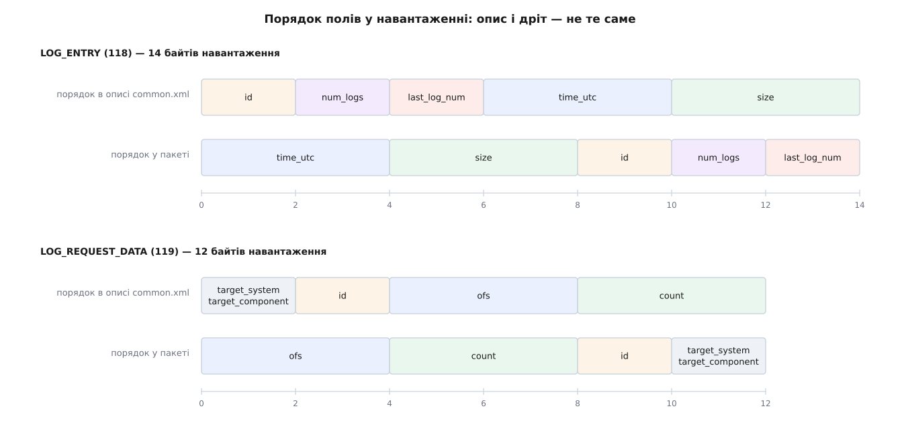

# 📋 Повідомлення логу в MAVLink: поля, розкладка на дроті, значення-заглушки

Дев'ять повідомлень і дві команди — це весь протокольний контракт, яким бортовий журнал переходить з апарата на землю. Тут зібрано їхні поля з типами, одиницями й точними зсувами в навантаженні, а окремим блоком — та частина семантики, якої в таблиці полів не видно: коли нуль означає «немає», коли розмір насправді не розмір, і які значення є заглушками, а не даними.

Звірено з `message_definitions/v1.0/common.xml` гілки `master` репозиторію `mavlink/mavlink` (завантажено 2 серпня 2026 року); довжини навантажень і `CRC_EXTRA` — зі згенерованих заголовків `mavlink/c_library_v2/common/`; правила серіалізації — зі сторінки `mavlink.io/en/guide/serialization.html`; поведінка наземної станції — з гілки `master` репозиторію `mavlink/qgroundcontrol`, файли `src/AnalyzeView/OnboardLogs/OnboardLogController.cc`, `src/Vehicle/Vehicle.cc`, `src/Vehicle/MAVLinkLogManager.cc`.

---

## Що є в протоколі

| Повідомлення | id | Хто шле | Навантаження | `CRC_EXTRA` | Адресовано? |
|---|---|---|---|---|---|
| `LOG_REQUEST_LIST` | 117 | станція → апарат | 6 Б | 128 | так |
| `LOG_ENTRY` | 118 | апарат → усім | 14 Б | 56 | **ні** |
| `LOG_REQUEST_DATA` | 119 | станція → апарат | 12 Б | 116 | так |
| `LOG_DATA` | 120 | апарат → усім | 97 Б | 134 | **ні** |
| `LOG_ERASE` | 121 | станція → апарат | 2 Б | 237 | так |
| `LOG_REQUEST_END` | 122 | станція → апарат | 2 Б | 203 | так |
| `LOGGING_DATA` | 266 | апарат → станції | 255 Б | 193 | так |
| `LOGGING_DATA_ACKED` | 267 | апарат → станції | 255 Б | 35 | так |
| `LOGGING_ACK` | 268 | станція → апарату | 4 Б | 14 | так |

| Команда | Значення | Параметри |
|---|---|---|
| `MAV_CMD_LOGGING_START` | 2510 | `param1` — формат, решта зарезервовані |
| `MAV_CMD_LOGGING_STOP` | 2511 | усі зарезервовані |

Стовпчик «навантаження» — це довжина, оголошена у визначенні повідомлення; у другій версії протоколу вона є **стелею, а не константою**, бо відправник зобов'язаний обрізати нульовий хвіст навантаження перед надсиланням. Перший байт не обрізається ніколи, навіть коли все навантаження нульове. Приймач доповнює коротке навантаження нулями до оголошеної довжини й лише тоді розбирає його на поля — це робить будь-яка згенерована бібліотека, але з цього випливає наслідок, про який легко забути: **за фактичною довжиною кадру не можна судити про кількість корисних байтів**. Скільки їх, каже поле, а не кадр. Будова самого кадру — у [пакеті MAVLink](topic:communications/mavlink-packet).

`CRC_EXTRA` — байт, який домішується до контрольної суми кадру й обчислюється з імен і типів полів. Він існує саме для цієї ситуації: якщо на двох кінцях лінії різні уявлення про розкладку повідомлення, кадр не пройде перевірку суми замість того, щоб тихо розібратися на сміття.

---

## Порядок полів на дроті — не той, що в описі

Поля навантаження **пересортовано за розміром**: спершу восьмибайтові, потім чотири-, дво- й однобайтові. Поля однакового розміру зберігають взаємний порядок із опису. Розширювальні поля (яких у жодному повідомленні логу немає) — виняток: вони їдуть у порядку опису й до `CRC_EXTRA` не входять.

Це не косметика. Хто читає `common.xml` і руками розкладає байти, той без цього правила отримає зсунуті поля на кожному повідомленні логу, крім найпростіших.



*Однобайтові адресні поля з початку опису опиняються в хвості навантаження, а багатобайтові — на його початку.*

Усередині поля байти йдуть **молодшим уперед**; про те, чому це доводиться щоразу перевіряти й де на цьому спотикаються, — у темі [біти й порядок байтів](topic:programming/bits-bytes-endianness).

---

## Сімейство `LOG_*`: запит і відповідь

### `LOG_REQUEST_LIST` (117) — «які записи в тебе є»

| Зсув | Поле | Тип | Значення |
|---|---|---|---|
| 0 | `start` | `uint16_t` | номер першого запису; **0** — від першого наявного |
| 2 | `end` | `uint16_t` | номер останнього; **0xffff** — до останнього наявного |
| 4 | `target_system` | `uint8_t` | системний номер адресата |
| 5 | `target_component` | `uint8_t` | номер компонента адресата |

Опис у специфікації несе три приписи, яких немає в полях, і всі три — про поведінку, а не про байти. Перший: на деяких системах цей запит **зупиняє бортове журналювання**, доки не прийде `LOG_REQUEST_END`. Другий: якщо записів немає, відповіддю має бути **одне** `LOG_ENTRY` з `id = 0` і `num_logs = 0`. Третій: `LOG_ENTRY` можуть починатися з номера 1 або з 0, і наземна станція мусить впоратися з обома.

### `LOG_ENTRY` (118) — один рядок переліку

| Зсув | Поле | Тип | Одиниця | Значення |
|---|---|---|---|---|
| 0 | `time_utc` | `uint32_t` | с | час запису від початку епохи Unix; **0** — «недоступний» |
| 4 | `size` | `uint32_t` | Б | розмір запису, **може бути приблизним** |
| 8 | `id` | `uint16_t` | — | номер запису |
| 10 | `num_logs` | `uint16_t` | — | скільки записів усього |
| 12 | `last_log_num` | `uint16_t` | — | найбільший номер |

Адресних полів немає: відповідь летить у канал **усім**. Хто шле — видно лише з `sysid`/`compid` кадру, а для кого вона — не видно ніяк. Дві станції на одній лінії побачать перелік обидві, і кожна мусить сама вирішити, чи вона його просила. Як станція розділяє потік за номерами відправника — у темі [маршрутизації за sysid і compid](topic:qgroundcontrol/message-routing).

Обидва чотирибайтові поля мають стелю 2³² − 1. Для `size` це 4 ГіБ − 1 байт: більший запис через це сімейство просто неадресовний. Для `time_utc` — беззнакові секунди, тобто переповнення настане не 2038 року, як у знакового відліку, а 2106-го.

### `LOG_REQUEST_DATA` (119) — «дай шматок»

| Зсув | Поле | Тип | Одиниця | Значення |
|---|---|---|---|---|
| 0 | `ofs` | `uint32_t` | Б | зсув від початку запису |
| 4 | `count` | `uint32_t` | Б | скільки байтів віддати |
| 8 | `id` | `uint16_t` | — | номер запису з `LOG_ENTRY` |
| 10 | `target_system` | `uint8_t` | — | системний номер адресата |
| 11 | `target_component` | `uint8_t` | — | номер компонента адресата |

Тут прихована найгостріша асиметрія протоколу: **просять чотирибайтовим лічильником, віддають однобайтовим**. Один запит може зажадати мільярди байтів, і апарат почне їх лити пачкою `LOG_DATA` по 90 байтів. Поля «скільки готовий прийняти зараз» у протоколі немає — ні вікна, ні кредиту, ні паузи. Єдиний спосіб зупинити почату видачу — надіслати новий запит або `LOG_REQUEST_END`.

### `LOG_DATA` (120) — шматок

| Зсув | Поле | Тип | Одиниця | Значення |
|---|---|---|---|---|
| 0 | `ofs` | `uint32_t` | Б | зсув цього шматка від початку запису |
| 4 | `id` | `uint16_t` | — | номер запису |
| 6 | `count` | `uint8_t` | Б | скільки байтів у `data` корисні; **0 — кінець запису** |
| 7 | `data` | `uint8_t[90]` | — | самі байти |

`count` не може перевищити 90 — ширина поля дозволяє більше, місце в повідомленні ні. Байти після `count`-го у `data` — не дані, а доповнення нулями після обрізання хвоста, і читати їх не можна. Адресних полів, як і в `LOG_ENTRY`, немає.

### `LOG_ERASE` (121) і `LOG_REQUEST_END` (122)

Обидва — по два байти, `target_system` на нульовому зсуві й `target_component` на першому, більше нічого. `LOG_ERASE` стирає **всі** записи: вибрати окремий нема чим. `LOG_REQUEST_END` спиняє видачу й повертає бортове журналювання до звичайного стану.

І тут — головна незручність обох: **відповіді немає жодної**. Це повідомлення, а не [команди MAVLink](topic:communications/mavlink-commands), тож на них не приходить ні `COMMAND_ACK`, ні код результату. Надіслати `LOG_ERASE` і дізнатися, чи його виконали, можна лише одним способом: попросити перелік знову й подивитися, що там залишилося. Так само з `LOG_REQUEST_END` — підтвердження, що журналювання відновлено, у протоколі не передбачено.

---

## Сімейство `LOGGING_*`: беззапитний потік

### Вмикання: `MAV_CMD_LOGGING_START` (2510) і `MAV_CMD_LOGGING_STOP` (2511)

| Параметр | `LOGGING_START` | `LOGGING_STOP` |
|---|---|---|
| `param1` | формат: **0 — ULog** (мінімум 0, крок 1) | зарезервовано, 0 |
| `param2`…`param7` | зарезервовано, 0 | зарезервовано, 0 |

Це справжні команди: їх шлють у `COMMAND_LONG` чи `COMMAND_INT` і на них приходить `COMMAND_ACK` із кодом `MAV_RESULT`. Коди тут не декоративні. `MAV_RESULT_UNSUPPORTED` означає «прошивка про таку команду не знає» — це остаточно. `MAV_RESULT_DENIED` — «команду знаю, але з такими параметрами не виконаю», і повторювати з тими самими параметрами марно. `MAV_RESULT_TEMPORARILY_REJECTED` — навпаки, єдиний код, після якого має сенс просто зачекати й спробувати ще раз.

Наземна станція QGroundControl шле `MAV_CMD_LOGGING_START` **без жодного параметра**, тобто з нулями в усіх семи, — що якраз і означає ULog. Іншого значення `param1` у специфікації сьогодні немає: перелік форматів складається з одного пункту.

### `LOGGING_DATA` (266) і `LOGGING_DATA_ACKED` (267)

Розкладка в обох однакова, різняться лише номером повідомлення й `CRC_EXTRA` — і тим, що на друге треба відповісти.

| Зсув | Поле | Тип | Одиниця | Значення |
|---|---|---|---|---|
| 0 | `sequence` | `uint16_t` | — | порядковий номер порції; **обертається** |
| 2 | `target_system` | `uint8_t` | — | системний номер адресата |
| 3 | `target_component` | `uint8_t` | — | номер компонента адресата |
| 4 | `length` | `uint8_t` | Б | скільки байтів у `data` корисні |
| 5 | `first_message_offset` | `uint8_t` | Б | зсув у `data`, з якого починається перше ціле повідомлення формату; **255 — жодне не починається** |
| 6 | `data` | `uint8_t[249]` | — | шматок байтового потоку |

`length` мусить перевірятися приймачем: поле однобайтове, тож у ньому може приїхати будь-яке число до 255, а місця в `data` є лише 249. Станція QGroundControl у такому разі відкидає повідомлення цілком. Так само варто ставитися й до `first_message_offset`: осмислені значення — від 0 до 248 та 255; діапазон 249…254 специфікація не визначає ніяк.

Слово «повідомлення» у назві `first_message_offset` — не про MAVLink. Ідеться про повідомлення **того формату, що всередині потоку**; MAVLink ріже цей потік навпіл, де доведеться, і поле каже, де починається найближчий цілий запис. Що це за записи й чим самоописовий ULog відрізняється від табличного бортового формату ArduPilot — у темі [форматів бортових логів](topic:communications/flight-log-formats).

`sequence` обертається кожні 2¹⁶ порцій. При 249 байтах на порцію повний оберт — це близько 15.6 МіБ потоку:

```
2¹⁶ · 249 Б = 65536 · 249 = 16 318 464 Б
16 318 464 ÷ 1024 ÷ 1024 ≈ 15.6 МіБ
```

Тобто на довгому польоті обертання станеться неодмінно, і приймач мусить відрізняти «номер перескочив назад, бо обернувся» від «пакети прийшли не в тому порядку». Порогу для цього в протоколі немає — його вибирає реалізація; станція QGroundControl бере половину діапазону, 2¹⁵.

### `LOGGING_ACK` (268)

| Зсув | Поле | Тип | Значення |
|---|---|---|---|
| 0 | `sequence` | `uint16_t` | **має збігатися** з `sequence` із `LOGGING_DATA_ACKED` |
| 2 | `target_system` | `uint8_t` | системний номер адресата |
| 3 | `target_component` | `uint8_t` | номер компонента адресата |

Підтвердження стосується **приймання, а не оброблення**: у станції воно надсилається одразу після розбирання кадру, ще до того, як вміст піде в файл. Адресується воно апаратові — у полях стоять номер системи апарата й номер його типового компонента, а не значення, скопійовані з отриманого повідомлення.

---

## Усі заглушки в одному місці

| Поле | Заглушка | Що вона означає |
|---|---|---|
| `LOG_REQUEST_LIST.start` | `0` | від першого наявного запису |
| `LOG_REQUEST_LIST.end` | `0xffff` | до останнього наявного запису |
| `LOG_ENTRY.num_logs` | `0` | записів немає взагалі; таке `LOG_ENTRY` — одне й останнє |
| `LOG_ENTRY.id` | `0` (у відповіді «немає») | не номер запису, а наповнювач |
| `LOG_ENTRY.time_utc` | `0` | дата невідома (у специфікації поле позначено як `invalid="0"`) |
| `LOG_DATA.count` | `0` | кінець запису |
| `LOGGING_DATA.first_message_offset` | `255` (`UINT8_MAX`) | у цьому пакеті не починається жодне ціле повідомлення |
| `MAV_CMD_LOGGING_START.param1` | `0` | формат ULog |
| `MAV_CMD_LOGGING_*.param2…7` | `0` | зарезервовано |

---

## Семантика, якої в таблицях не видно

**Номери записів починаються з 0 або з 1.** Специфікація дозволяє обидва варіанти й прямо перекладає обов'язок розібратися на наземну станцію. Практично це означає, що `id` із `LOG_ENTRY` **не можна брати за індекс** у власному масиві, поки не з'ясовано зсув. QGroundControl визначає його за типом прошивки: для ArduPilot ставить зсув 1, для решти — 0, і далі віднімає цей зсув із кожного вхідного `id` та додає до кожного вихідного. Ознаки в самому протоколі, за якою зсув можна було б визначити, не існує — рішення спирається на те, чия це прошивка.

**Нуль у `num_logs` — це відповідь, а не мовчанка.** Апарат без жодного запису надсилає одне `LOG_ENTRY`, де всі поля нульові, і на цьому обмін завершено. Приймач, який чекає «хоч чогось осмисленого», прочекає до кінця таймера й вирішить, що апарат не відповів, — хоча відповідь була, просто вона порожня.

**`size` — оцінка, а не число.** Специфікація каже це відкритим текстом: «розмір запису (може бути приблизним)». Наслідок відчутний: реалізація, яка вважає файл прийнятим лише тоді, коли лічильник байтів дійшов до оголошеного `size`, зависає назавжди, якщо апарат оголосив розмір із запасом. Ознаки «а це число точне» в протоколі немає — і не буде, бо в багатьох прошивок точний розмір коштує читання каталогу, якого вони під час польоту не роблять. Окремий випадок того самого — ArduPilot, який в одному з `LOG_ENTRY` може надіслати нульовий розмір; станція такі записи від нього просто ігнорує.

**`count = 0` у `LOG_DATA` — це кінець запису.** Так каже визначення поля. Але на цю ознаку не варто покладатися як на єдину: приймач, який рахує байти сам, зазвичай завершує роботу раніше й нульового пакета не дочекається, а якщо той усе-таки прийде — може й не мати для нього окремої гілки. У чинному коді QGroundControl такої гілки немає: запис нуля байтів у файл повертає нуль, і пакет потрапляє в гілку помилки, позначаючи запис як невдалий. Тому прошивці, яка хоче бути зрозумілою наявним станціям, розумніше закінчувати передавання останнім непорожнім пакетом, а нульовий надсилати щонайбільше як додаткову ознаку.

**Запит переліку може вимкнути журналювання.** Специфікація попереджає про це в описі `LOG_REQUEST_LIST`, і саме заради цього існує `LOG_REQUEST_END`. Пропустити цю команду означає лишити апарат без запису наступного польоту — тихо, без жодного повідомлення про помилку, бо повідомляти нема кому й нічим. Робоче правило просте: `LOG_REQUEST_END` шлють у **будь-якому** завершенні роботи з логами — після успішного завантаження, після скасування користувачем, після відмови за таймером.

**`first_message_offset = 255` — це не помилка й не порожній пакет.** Значення означає рівно одне: увесь вантаж — середина довгого запису, який почався раніше. Такий пакет цілком корисний, його байти йдуть у файл; непридатний він лише для **відновлення** після втрати, бо не дає точки, з якої можна знову шукати заголовки.

**Зсуви в `LOG_DATA` можуть виявитися невирівняними.** Протокол не вимагає, щоб `ofs` був кратним 90 — це просто число байтів від початку файлу. Але приймач, який складає файл із дев'яностобайтових комірок, від невирівняного пакета користі не має: QGroundControl такі пакети відкидає з попередженням. Прошивці варто відповідати на запит рівно з тим кроком, у якому її просили.

**Номер запису 0xffff двозначний.** У полі `end` повідомлення `LOG_REQUEST_LIST` це значення зарезервовано під «останній наявний». Що робити, якщо на борту справді є запис із номером 65535, специфікація не каже; це радше вада опису, ніж практична проблема — жодна відома прошивка стільки записів не тримає. Статус: власне спостереження з тексту специфікації, окремого припису на цей рахунок у ній немає.

---

## Мінімальний робочий обмін

Дві мови, бо дві сторони дроту: бортовий бік пишуть на C зі згенерованою бібліотекою, наземний бік — найчастіше на Python через `pymavlink`.

:::tabs
```c
#include <mavlink.h>   /* згенерований діалект common */

/* ── 1. Попросити перелік записів ──────────────────────────────── */
void request_log_list(uint8_t chan, uint8_t tgt_sys, uint8_t tgt_comp)
{
    mavlink_message_t msg;
    mavlink_msg_log_request_list_pack_chan(
        MY_SYSID, MY_COMPID, chan, &msg,
        tgt_sys, tgt_comp,
        0,        /* start: від першого наявного */
        0xffff);  /* end:   до останнього наявного */

    uint8_t buf[MAVLINK_MAX_PACKET_LEN];
    link_write(buf, mavlink_msg_to_send_buffer(buf, &msg));
}

/* ── 2. Розібрати відповіді ────────────────────────────────────── */
static uint16_t id_offset = 0;   /* 1 для ArduPilot, 0 для решти */

void on_message(const mavlink_message_t *msg)
{
    switch (msg->msgid) {

    case MAVLINK_MSG_ID_LOG_ENTRY: {
        mavlink_log_entry_t e;
        mavlink_msg_log_entry_decode(msg, &e);

        if (e.num_logs == 0) {          /* записів немає — це вся відповідь */
            listing_done();
            return;
        }
        uint16_t index = e.id - id_offset;
        /* e.size — оцінка; e.time_utc == 0 означає «дати не знаю» */
        entry_seen(index, e.size, e.time_utc);
        return;
    }

    case MAVLINK_MSG_ID_LOG_DATA: {
        mavlink_log_data_t d;
        mavlink_msg_log_data_decode(msg, &d);

        if (d.count == 0) {             /* оголошений кінець запису */
            transfer_done();
            return;
        }
        /* корисні лише перші d.count байтів; решта d.data — нулі доповнення */
        file_write_at(d.ofs, d.data, d.count);
        return;
    }
    }
}

/* ── 3. Завершити роботу з логами — ЗАВЖДИ ─────────────────────── */
void finish(uint8_t chan, uint8_t tgt_sys, uint8_t tgt_comp)
{
    mavlink_message_t msg;
    mavlink_msg_log_request_end_pack_chan(
        MY_SYSID, MY_COMPID, chan, &msg, tgt_sys, tgt_comp);

    uint8_t buf[MAVLINK_MAX_PACKET_LEN];
    link_write(buf, mavlink_msg_to_send_buffer(buf, &msg));
}
```
```python
from pymavlink import mavutil

link = mavutil.mavlink_connection("udpin:0.0.0.0:14550")
hb = link.wait_heartbeat()
tgt = (link.target_system, link.target_component)

# ArduPilot нумерує записи з одиниці, решта — з нуля;
# ознаки в самому протоколі логу немає, тож дивимося на тип прошивки
id_offset = 1 if hb.autopilot == mavutil.mavlink.MAV_AUTOPILOT_ARDUPILOTMEGA else 0

# ── 1. Перелік записів
link.mav.log_request_list_send(*tgt, 0, 0xffff)

entries = {}
while True:
    e = link.recv_match(type="LOG_ENTRY", blocking=True, timeout=5)
    if e is None:
        break
    if e.num_logs == 0:            # записів немає — це вся відповідь
        break
    entries[e.id - id_offset] = (e.size, e.time_utc or None)
    if len(entries) == e.num_logs:
        break

if not entries:
    raise SystemExit("на борту немає записів")

# ── 2. Тіло одного запису; size — ОЦІНКА, не критерій завершення
index, (size, _) = sorted(entries.items())[0]
link.mav.log_request_data_send(*tgt, index + id_offset, 0, size)

with open("flight.bin", "wb") as out:
    while True:
        d = link.recv_match(type="LOG_DATA", blocking=True, timeout=5)
        if d is None or d.count == 0:      # таймер або оголошений кінець
            break
        out.seek(d.ofs)
        out.write(bytes(d.data[:d.count]))  # хвіст масиву — нулі доповнення

# ── 3. Повернути апаратові право писати власний журнал
link.mav.log_request_end_send(*tgt)
```
:::

Обидва приклади свідомо обходять питання повторів і таймерів: із контракту дроту вони не випливають, бо в протоколі немає ні підтверджень на `LOG_ENTRY`, ні ознаки «остання відповідь у пачці», ні коду помилки. Усе, що стосується втрат, реалізація вибудовує сама поверх цих полів.

---

## Чого в контракті немає

Перелік того, чого протокол не дає, для реалізатора не менш важливий за перелік полів, бо кожен пункт — це місце, де доведеться щось вигадувати самому:

- **ознаки «остання відповідь»** у пачці `LOG_ENTRY` — і жодного підтвердження на кожну окремо;
- **підтверджень і кодів помилок** для `LOG_ERASE` та `LOG_REQUEST_END` — вони повідомлення, а не команди;
- **керування потоком** у `LOG_DATA` — ні вікна, ні кредиту, ні паузи;
- **адресації у відповідях** `LOG_ENTRY` і `LOG_DATA` — вони летять усім, хто слухає лінію;
- **ознаки формату файлу** — що саме приїде, `.ulg` чи `.bin`, із протоколу не видно;
- **гарантії, що `size` точний**, — специфікація прямо каже протилежне;
- **способу стерти один запис** — `LOG_ERASE` стирає всі.
