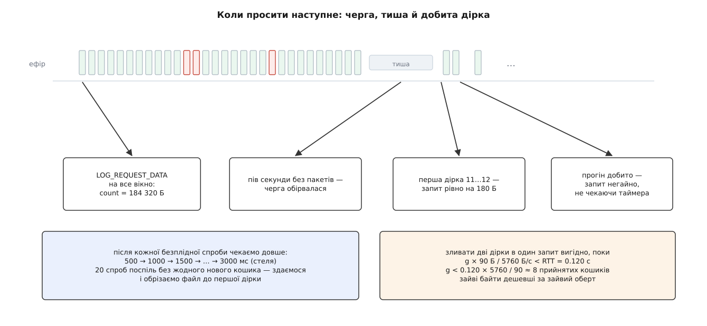

# ⚙️ Завантажувач бортового логу з нуля: 90 байтів, таблиця бітів і жодного підтвердження

Це шістсот рядків на C++, які витягують багатомегабайтний файл із карти апарата поверх протоколу, у якому немає ні підтверджень, ні повторів, ні навіть обіцянки, що пакети прийдуть по порядку. Єдиний важіль, який протокол дає станції, — сказати «надішли мені байти з такого зсуву, стільки-то штук»; усе інше доводиться будувати самому, і будується воно навколо однієї структури — карти того, що вже прийнято.

Мова диктується задачею: двійковий протокол із полями фіксованої ширини, арифметика зсувів і дорога запису, якою за годину проходять мільйони байтів, — усе це C++ описує без прошарку між кодом і тим, що насправді відбувається з пам'яттю й файлом.

## Задача

Програма отримує номер запису й оголошений розмір, має канал, яким можна надсилати `LOG_REQUEST_DATA` і в який приходять `LOG_DATA`, і мусить покласти на диск файл, побайтово рівний тому, що лежить на карті.

Що саме від неї вимагається:

1. **Прийняти пакети в будь-якому порядку** й покласти кожен на своє місце — протокол не обіцяє послідовності, а радіо її й поготів не тримає.
2. **Самій виявити втрати** й перепросити рівно втрачене. Апарат не пам'ятає, що надсилав, і не відповідає на питання «а пакет номер такий-то дійшов?» — такого питання в протоколі немає.
3. **Не впертися назавжди.** Ні в дірку, яку канал уже не віддасть, ні в хвіст файлу, якого насправді не існує.
4. **Не бути вузьким місцем.** Канал віддає близько п'яти кілобайтів за секунду; програма, що встигає менше, — це помилка в програмі, а не властивість радіо.

Чого вона не робить: не дивиться всередину байтів. Що там за формат, які величини записано, де межі записів — усе це справа того, хто відкриє файл потім. Завантажувач переносить, а не тлумачить.

Одне уточнення про поля, від якого залежить половина коду. У `LOG_DATA` немає адресата: там лише `ofs`, `id`, `count` і масив на 90 байтів. Кому саме летить відповідь, повідомлення не каже — його бачить кожен, хто слухає лінію. Тому фільтр «це відповідь моєму апаратові» стоїть не в тілі повідомлення, а на ідентифікаторі системи в заголовку кадру; а якщо на тій самій лінії другу станцію теж тягне цей самий запис, її пакети прийдуть і до нас — і будуть, як не дивно, безкоштовною допомогою, бо пара «номер запису, зсув» завжди несе ті самі байти.

## Ідея: облік веде приймач

Відправник тут — автомат без пам'яті. Прийшов запит — виплюнув чергу пакетів; що з ними сталося далі, він не знає й не дізнається. Отже, усе знання про стан передавання може жити тільки на приймальному боці, і питання «чого мені бракує?» приймач мусить уміти поставити самому собі.

Звідси конструкція. Файл ріжеться на **вікна** сталого розміру, вікно — на **кошики** по 90 байтів, рівно стільки, скільки несе один `LOG_DATA`. На кожне вікно заводиться таблиця бітів: біт піднято — кошик прийнято. Відкритим тримається строго одне вікно; воно закривається, лише коли всі його біти підняті, і тоді відкривається наступне з чистою таблицею.

```
кошик             = 90 Б            (MAVLINK_MSG_LOG_DATA_FIELD_DATA_LEN)
кошиків у вікні   = 2048
вікно             = 2048 × 90       = 184 320 Б = 180 КіБ
таблиця вікна     = 2048 бітів      = 256 Б = 32 слова по 64 біти
```

Дві речі роблять цю схему робочою. Перша: **запит завжди покриває суцільний прогін кошиків**, а не окремий кошик, — інакше швидкість визначала б не ширина каналу, а затримка обертів. Друга: **прогін виводиться з таблиці**, а не з якогось окремого списку втрачених пакетів — перший нуль дає початок, наступна одиниця дає кінець.

Цей спосіб — приймач тримає карту прийнятого й вибірково просить дірки — має ім'я: [вибірковий повтор](book:communications/arq-protocol), базова схема надійного передавання поверх ненадійного каналу. Різниця з класичною тільки в тому, що тут немає ні підтверджень, ні нумерації пакетів: єдина адреса кошика — його зсув у файлі, і за нею ж він і записується.

## Таблиця вікна

Тридцять два слова по 64 біти. Три операції: підняти біт, знайти перший нуль від позиції, знайти першу одиницю від позиції.

```cpp
#include <algorithm>
#include <array>
#include <bit>
#include <cstdint>

constexpr uint32_t kChunk  = 90;                        // байтів у одному LOG_DATA
constexpr uint32_t kBins   = 2048;                      // кошиків у вікні
constexpr uint64_t kWindow = uint64_t(kChunk) * kBins;  // 184 320 Б

class Bits {
public:
    void clear() { w_.fill(0ull); }
    void set(uint32_t i)        { w_[i >> 6] |= 1ull << (i & 63); }
    bool test(uint32_t i) const { return (w_[i >> 6] >> (i & 63) & 1ull) != 0; }

    // перший нуль у [from, bins); bins, якщо нулів немає
    uint32_t firstZero(uint32_t from, uint32_t bins) const {
        for (uint32_t k = from >> 6; k * 64 < bins; ++k) {
            uint64_t free = ~w_[k];
            const uint32_t base = k * 64;
            if (base < from) free &= ~0ull << (from - base);      // лівий край
            const uint32_t width = std::min(64u, bins - base);
            if (width < 64)  free &= (1ull << width) - 1;         // хвіст поза вікном
            if (free) return base + uint32_t(std::countr_zero(free));
        }
        return bins;
    }

    // перша одиниця у [from, bins); bins, якщо одиниць далі немає
    uint32_t firstOne(uint32_t from, uint32_t bins) const {
        for (uint32_t k = from >> 6; k * 64 < bins; ++k) {
            uint64_t v = w_[k];
            const uint32_t base = k * 64;
            if (base < from) v &= ~0ull << (from - base);
            if (v) return std::min(bins, base + uint32_t(std::countr_zero(v)));
        }
        return bins;
    }

    uint32_t countZeros(uint32_t from, uint32_t to) const {
        uint32_t n = 0;
        for (uint32_t i = from; i < to; ++i) if (!test(i)) ++n;
        return n;
    }

private:
    std::array<uint64_t, kBins / 64> w_{};
};
```

Обидва пошуки йдуть по словах, а не по бітах: слово, у якому всі біти підняті, після інверсії дорівнює нулю й проскакується однією перевіркою, а в непорожньому слові позицію дає [пошук крайнього одиничного біта](book:programming/bit-scan-clz-ctz) — `std::countr_zero`, одна процесорна інструкція замість циклу на 64 кроки. Прохід по цілому вікну — тридцять два слова, десятки наносекунд.

Дві маски заслуговують окремої уваги, бо саме на них ламаються такі функції. Ліва відрізає біти до `from`, бо перше слово ми починаємо читати з середини. Права відрізає біти за `bins`: останнє вікно файлу коротше за повне, і нулі в його хвості — це не дірки, це неіснуючі кошики. Забути праву маску означає вічно шукати дірку там, де файл уже скінчився.

## Файл, у який пишуть навмання

Пакети лягають не по черзі, а кожен за своїм зсувом, тож файл треба спершу розтягнути на повну довжину, а потім писати в довільні його місця.

```cpp
#include <cerrno>
#include <cstdio>
#include <fcntl.h>
#include <unistd.h>

class LogFile {
public:
    bool open(const char* path, uint64_t size) {
        fd_ = ::open(path, O_WRONLY | O_CREAT | O_TRUNC, 0644);
        if (fd_ < 0) return false;
        return ::ftruncate(fd_, off_t(size)) == 0;   // розтягуємо наперед
    }

    bool writeAt(uint64_t ofs, const uint8_t* p, uint32_t n) {
        while (n) {
            const ssize_t k = ::pwrite(fd_, p, n, off_t(ofs));
            if (k < 0) { if (errno == EINTR) continue; return false; }
            p += k;  n -= uint32_t(k);  ofs += uint64_t(k);
        }
        return true;
    }

    bool finish(uint64_t realSize) {
        bool ok = (::ftruncate(fd_, off_t(realSize)) == 0);
        ok = (::fsync(fd_) == 0) && ok;              // один раз, наприкінці
        ::close(fd_);  fd_ = -1;
        return ok;
    }

private:
    int fd_ = -1;
};
```

`pwrite` замість пари «перемотати — записати» — це один системний виклик замість двох і, що важливіше, жодного спільного стану: у дескриптора є власна позиція, і два потоки, які по черзі роблять `seek` і `write`, рано чи пізно запишуть один одному в чуже місце. `pwrite` позиції не чіпає взагалі, зсув їде аргументом. Цикл навколо нього — не педантизм: короткий запис і переривання сигналом [обірвуть виклик](book:unix-linux/eintr-and-restart) на півслові, повернувши менше байтів, ніж просили, і мовчки втрачений хвіст пакета проявиться лише тоді, коли файл спробують прочитати. На Windows тому самому відповідає `WriteFile` зі структурою `OVERLAPPED`, у якій зсув задається полем, а не станом дескриптора.

Розтягнутий `ftruncate`-ом файл — [розріджений](book:unix-linux/sparse-files): місця, у які ще нічого не записано, не займають на диску нічого, а при читанні віддають нулі. Звідси наслідок, який визначає всю подальшу поведінку програми: **недокачаний файл на вигляд не відрізнити від докачаного**. Він має повну довжину, він читається без помилок, і в дірках у ньому лежать нулі, які нічим не відрізняються від справжніх нулів логу. Єдине джерело правди про повноту — таблиця бітів у пам'яті; помер процес — правда померла з ним.

## Автомат завантаження

Стан — це номер відкритого вікна, його таблиця, межі щойно запитаного прогону й два лічильники часу.

```cpp
using Ms = uint64_t;                     // монотонний час у мілісекундах

constexpr Ms       kIdle     = 500;      // тиша, після якої вважаємо чергу обірваною
constexpr Ms       kIdleMax  = 3000;     // стеля очікування
constexpr uint32_t kRetryCap = 20;       // безплідних спроб поспіль до відмови
constexpr uint32_t kMerge    = 8;        // прийнятих кошиків, які дешевше перепросити

struct Transport {
    virtual ~Transport() = default;
    virtual void requestData(uint16_t id, uint32_t ofs, uint32_t count) = 0;
    virtual void requestEnd() = 0;
};

struct Stats {
    uint64_t written = 0, dup = 0, stale = 0, unaligned = 0, foreign = 0, malformed = 0;
    uint64_t requests = 0, repeats = 0;
};

class Downloader {
public:
    enum class State { Running, Done, Failed };

    Downloader(Transport& tx, LogFile& out, uint16_t id, uint64_t declared)
        : tx_(tx), out_(out), id_(id), size_(declared) {}

    State        state() const { return state_; }
    uint64_t     size()  const { return size_;  }
    const Stats& stats() const { return stat_;  }

    void start(Ms now) {
        now_ = lastData_ = now;
        window_ = 0;  bins_ = binsIn(0);  table_.clear();
        requestGap();
    }

    void onLogData(uint16_t id, uint32_t ofs, uint8_t count, const uint8_t* data, Ms now);
    void onTick(Ms now);

private:
    void requestGap();
    void shrinkTo(uint64_t realEnd);
    void finish(uint64_t realSize, State how) {
        state_ = how;
        tx_.requestEnd();                // звільняємо бортовий логер
        out_.finish(realSize);
    }
    uint32_t binsIn(uint64_t win) const {
        const uint64_t n = (size_ - win * kWindow + kChunk - 1) / kChunk;
        return uint32_t(n < kBins ? n : kBins);
    }
    uint64_t goodPrefix() const {        // скільки байтів з початку файлу справді суцільні
        const uint64_t p = window_ * kWindow + uint64_t(table_.firstZero(0, bins_)) * kChunk;
        return p < size_ ? p : size_;
    }

    Transport& tx_;
    LogFile&   out_;
    uint16_t   id_;
    uint64_t   size_;                    // оголошений, а далі — уточнений
    uint64_t   window_ = 0;
    uint32_t   bins_ = 0;
    Bits       table_;
    uint32_t   reqStart_ = 0, reqEnd_ = 0, pending_ = 0;
    uint32_t   retries_ = 0;
    Ms         now_ = 0, lastData_ = 0;
    State      state_ = State::Running;
    Stats      stat_;
};
```

`pending_` — це кількість кошиків, яких ще бракує в щойно запитаному прогоні. Тільки заради нього ми запам'ятовуємо межі `reqStart_`/`reqEnd_`, і навіщо — стане видно за два розділи.

## Прийом пакета

Порядок перевірок тут не косметичний: кожна наступна має сенс лише тоді, коли попередня пройшла.

```cpp
void Downloader::onLogData(uint16_t id, uint32_t ofs, uint8_t count,
                           const uint8_t* data, Ms now)
{
    now_ = now;
    if (state_ != State::Running) return;
    if (id != id_)      { ++stat_.foreign;   return; }   // відповідь про інший запис
    if (ofs % kChunk)   { ++stat_.unaligned; return; }   // зсув не з нашої сітки
    if (count > kChunk) { ++stat_.malformed; return; }   // поле зіпсоване

    if (count == 0) {                                    // за цим зсувом уже нічого немає
        shrinkTo(ofs);
        requestGap();
        return;
    }
    if (count < kChunk) shrinkTo(uint64_t(ofs) + count); // короткий пакет буває лише в кінці

    const uint64_t win = uint64_t(ofs) / kWindow;
    if (win != window_) { ++stat_.stale; return; }       // чуже вікно
    const uint32_t bin = uint32_t((uint64_t(ofs) - window_ * kWindow) / kChunk);
    if (bin >= bins_)   { ++stat_.stale; return; }       // за кінцем цього вікна

    lastData_ = now_;                                    // черга йде — навіть якщо це дублікат
    if (table_.test(bin)) { ++stat_.dup; return; }
    if (!out_.writeAt(ofs, data, count)) { finish(goodPrefix(), State::Failed); return; }

    table_.set(bin);
    ++stat_.written;
    retries_ = 0;                                        // поступ є
    if (bin >= reqStart_ && bin < reqEnd_ && --pending_ == 0)
        requestGap();                                    // прогін добито
}
```

Перевірка кратності 90 виглядає надлишковою, поки не згадати, що зсув у пакеті не звірений ні з чим: він приходить таким, яким його поставив відправник, а відправників на лінії буває більше за одного. Кошика для некратного зсуву в таблиці немає, і покласти такий пакет «десь поруч» означало б записати правдоподібне сміття в середину файлу.

Різниця між `lastData_` і `retries_` — тонка й важлива. Перше означає «черга ще йде», і його оновлює будь-який пакет нашого вікна, зокрема повторний: якщо канал зайнятий доставкою дублікатів, то він живий і зайнятий, будити його новим запитом рано. Друге означає «є поступ», і його скидає лише **новий** кошик. Злити ці дві величини в одну — значить або перепитувати посеред живої черги, або ніколи не дійти до стелі спроб, крутячись на дублікатах вічно.

І окремо — чому перевірка `table_.test(bin)` мусить стояти перед `--pending_`. Лічильник беззнаковий; зменшити його на дублікаті означає провалитися з нуля в чотири мільярди, після чого швидкий шлях «прогін добито» не спрацює вже ніколи, і завантаження до кінця своїх днів повзтиме по таймеру. Помилка тиха: файл усе одно збереться, просто вдвічі-втричі повільніше, ніж міг би.

## З дірки народжується запит

Одна функція робить три різні речі — відкриває нове вікно, латає дірку й завершує роботу, — і робить їх однаково, бо всі три є відповіддю на те саме питання «де в таблиці перший нуль».

```cpp
void Downloader::requestGap()
{
    if (state_ != State::Running) return;
    if (window_ * kWindow >= size_) { finish(size_, State::Done); return; }

    uint32_t start = table_.firstZero(0, bins_);
    if (start == bins_) {                          // у вікні жодної дірки
        ++window_;
        if (window_ * kWindow >= size_) { finish(size_, State::Done); return; }
        table_.clear();
        bins_ = binsIn(window_);
        reqStart_ = reqEnd_ = pending_ = 0;
        retries_ = 0;
        requestGap();                              // нове вікно просимо цілком
        return;
    }

    uint32_t end = table_.firstOne(start, bins_);
    for (;;) {                                     // зливаємо близькі дірки
        const uint32_t next = table_.firstZero(end, bins_);
        if (next >= bins_ || next - end > kMerge) break;
        end = table_.firstOne(next, bins_);
    }

    const uint64_t ofs = window_ * kWindow + uint64_t(start) * kChunk;
    uint64_t cnt = uint64_t(end - start) * kChunk;
    if (ofs + cnt > size_) cnt = size_ - ofs;      // не просимо за кінцем файлу

    reqStart_ = start;  reqEnd_ = end;
    pending_  = table_.countZeros(start, end);
    lastData_ = now_;                              // тишу рахуємо від моменту запиту
    ++stat_.requests;
    tx_.requestData(id_, uint32_t(ofs), uint32_t(cnt));
}
```

Свіже вікно — це таблиця з самих нулів, у якій перший нуль стоїть на нулі, а наступна одиниця не знаходиться зовсім, тобто прогін дорівнює всьому вікну. Тож перший запит нового вікна автоматично виходить на всі 184 320 байтів, і жодного окремого коду для «відкрити вікно» писати не треба.

Тепер про злиття. Наївне «просити рівно дірку» має неочевидну ціну: кожен запит — це один оберт «запит — відповідь», а обертів на вікно виходить стільки, скільки в ньому окремих дірок. При п'ятивідсоткових втратах на 2048 кошиків їх близько сотні, і сотня обертів по 120 мілісекунд додає до вікна дванадцять секунд — третину від тих тридцяти восьми, за які вікно взагалі перекачується. Виправлення просте: якщо між двома дірками лежить зовсім небагато прийнятих кошиків, дешевше перепросити їх разом із дірками, ніж платити за окремий оберт.

Поріг рахується з двох чисел і жодних міркувань більше не потребує:

**Умова: послідовний порт 57600 бод, 8N1, повний оберт «запит — відповідь» 120 мс.**

```
пропускна          = 57600 / 10           = 5760 Б/с
зайві байти злиття = g × 90 Б,  g — прийнятих кошиків між дірками
ціна злиття        = g × 90 / 5760        секунд ефіру
ціна окремого запиту = RTT                = 0.120 с

зливаємо, поки  g × 90 / 5760 < 0.120
                g < 0.120 × 5760 / 90     = 7.68  →  kMerge = 8
```

Правило саме підлаштовується під канал. При п'ятивідсоткових втратах прийняті прогони між дірками мають довжину близько (1−p)/p ≈ 19 кошиків — злиття майже не спрацьовує, і запити йдуть точно по дірках. При двадцятивідсоткових прогони коротшають до чотирьох, злиття спрацьовує майже щоразу, і триста дірок стягуються в кілька десятків запитів. Змінилася швидкість порту або затримка ланки — поріг перерахується тією самою формулою.

## Таймер, сходинка й стеля

Просити повторно можна тільки за одним сигналом — тишею. Її і слухає єдина зовнішня функція, яку хтось мусить кликати періодично.

```cpp
void Downloader::onTick(Ms now)
{
    now_ = now;
    if (state_ != State::Running) return;

    const Ms wait = std::min<Ms>(kIdle * (retries_ + 1), kIdleMax);
    if (now_ - lastData_ < wait) return;                        // черга ще йде

    if (retries_ >= kRetryCap) {                                // канал мовчить остаточно
        finish(goodPrefix(), State::Failed);
        return;
    }
    ++retries_;
    ++stat_.repeats;
    requestGap();
}
```

Половина секунди тут не з голови: на повному каналі пакети йдуть кожні дев'ятнадцять мілісекунд, тож 500 мс — це двадцять шість пропущених пакетів поспіль, тобто вже не пауза, а обрив. Знизу поріг обмежений затримкою ланки: чекати менше, ніж повний оберт, означає перепитувати те, що ще летить, — і в каналі, який і так ледве тягне, з'явиться другий такий самий потік. Він витіснить перший, втрати зростуть, таймер спрацює ще раз, і ланка задушить сама себе; це той випадок, коли [неправильно налаштовані повтори](book:programming/retries-backoff) шкодять більше за саму втрату.

Сходинка `kIdle × (retries_ + 1)` розв'язує другий бік: якщо перша повторна спроба нічого не принесла, то й друга за пів секунди нічого не принесе — очікування росте до трьох секунд і там завмирає. Розкидати сходинку випадковим доважком, як роблять зазвичай, тут не треба: доважок потрібен, коли багато клієнтів синхронно б'ються в один сервер, а тут той, хто говорить, один.

Стеля в двадцять безплідних спроб — це приблизно хвилина каналу, який не віддав жодного нового кошика. Далі — відмова, але **не викидання зробленого**: файл обрізається до `goodPrefix()`, тобто до першої дірки. Те, що залишилося, — суцільні справжні байти від початку логу, з якими аналізатор упорається; і це якраз те, чого не можна було б зробити, залишивши в файлі розріджені нулі замість чесного кінця.

Останній шматок автомата — уточнення розміру.

```cpp
void Downloader::shrinkTo(uint64_t realEnd)
{
    if (realEnd >= size_) return;                    // оголошений розмір не збільшуємо
    size_ = realEnd;
    if (window_ * kWindow >= size_) return;
    bins_ = binsIn(window_);                         // хвостове вікно стало коротшим
    if (reqStart_ > bins_) reqStart_ = bins_;
    if (reqEnd_   > bins_) reqEnd_   = bins_;
    pending_ = table_.countZeros(reqStart_, reqEnd_);
}
```

Він потрібен тому, що розмір із переліку записів документація описує дослівно як такий, що **може бути приблизним**. Оголошений розмір придатний рівно на одне — розтягнути файл наперед із запасом. Критерієм завершення він бути не може: якщо апарат назвав більше, ніж має, останні кошики не заповняться ніколи. Правду каже сам потік даних: пакет із `count` меншим за 90 буває лише на хвості файлу, а пакет із `count == 0` прямо означає «за цим зсувом немає нічого». Обидва випадки дають точний кінець, і після нього таблиця відкритого вікна вкорочується, а прогін, який ми встигли попросити, підрізається по новому краю.



*Тиша — єдиний сигнал про втрату, який дає цей протокол; лічильник недоотриманих кошиків прогону дозволяє не чекати її там, де вже й так усе ясно.*

## Апарат, якого немає

Код, що ловить рідкісні збіги втрат і перестановок, неможливо налагодити на справжньому апараті: помилка трапляється раз на кілька тисяч пакетів і не відтворюється. Тому джерело підробляється — з керованим відсотком втрат, керованим безладом і одним і тим самим результатом на тому самому зерні генератора. Це та сама думка, що й у [симуляторі в контурі](book:programming/sitl-simulator), тільки в мініатюрі: замінити залізо моделлю рівно там, де від заліза потрібна одна властивість — псувати потік.

```cpp
#include <cstdlib>
#include <cstring>
#include <deque>
#include <random>
#include <vector>

class FakeVehicle final : public Transport {
public:
    FakeVehicle(std::vector<uint8_t> log, uint32_t seed,
                double loss, double reorder, double skew)
        : log_(std::move(log)), rng_(seed), loss_(loss), reorder_(reorder), skew_(skew) {}

    uint64_t declaredSize() const { return log_.size() + 1234; }   // «розмір приблизний»

    void requestData(uint16_t id, uint32_t ofs, uint32_t count) override {
        // черга навмисне НЕ чиститься: пакети попереднього запиту ще летять
        for (uint32_t p = 0; p < count; p += kChunk) {
            Packet pk{};
            pk.id  = id;
            pk.ofs = ofs + p;
            if (pk.ofs >= log_.size()) { air_.push_back(pk); break; }   // count == 0
            const uint32_t left = uint32_t(log_.size() - pk.ofs);
            pk.count = uint8_t(left < kChunk ? left : kChunk);
            std::memcpy(pk.data, log_.data() + pk.ofs, pk.count);
            air_.push_back(pk);
        }
    }

    void requestEnd() override { air_.clear(); }

    bool pump(Downloader& dl, Ms now) {                 // один «квант ефіру»
        if (air_.empty()) return false;
        Packet pk = air_.front();
        air_.pop_front();
        if (chance(loss_)) return true;                 // згинув у радіо
        if (chance(reorder_) && !air_.empty()) {        // прийде пізніше за сусідів
            const size_t k = 1 + rng_() % std::min<size_t>(8, air_.size());
            air_.insert(air_.begin() + k, pk);
            return true;
        }
        if (chance(skew_)) pk.ofs += 1;                 // збитий зсув
        dl.onLogData(pk.id, pk.ofs, pk.count, pk.data, now);
        return true;
    }

private:
    struct Packet { uint16_t id = 0; uint32_t ofs = 0; uint8_t count = 0; uint8_t data[kChunk]; };
    bool chance(double p) { return dist_(rng_) < p; }

    std::vector<uint8_t> log_;
    std::deque<Packet>   air_;
    std::mt19937         rng_;
    std::uniform_real_distribution<double> dist_{0.0, 1.0};
    double loss_, reorder_, skew_;
};
```

Три рядки тут коштують більше, ніж здаються.

`declaredSize()` навмисне бреше на 1234 байти вгору — це і є та сама приблизність розміру, і без неї шлях через `shrinkTo` ніколи б не виконався.

`requestData` **не чистить чергу**. Завдяки цьому запізнілі пакети виникають самі: станція, не дочекавшись, шле новий запит, а стара черга ще в дорозі, і коли вікно встигне закритися, її пакети прилетять уже в чуже вікно. Ніякого окремого коду для «змоделювати запізнілу відповідь» не потрібно — досить не робити того, чого не робить і справжня ланка.

`pump` віддає **не більше одного пакета за виклик**, а час рухає той, хто його кличе. Тому весь стенд працює у віртуальному часі: секунда моделі коштує мікросекунди процесора, повний прогін на три мегабайти — частку секунди замість дванадцяти хвилин, і жодного `sleep`, жодного потоку, жодної гонки. І та сама пара «зерно, відсоток втрат» дає той самий прогін до біта, тож упійманий баг відтворюється командою з історії оболонки.

## Прогін

```cpp
int main(int argc, char** argv)
{
    const uint32_t seed = (argc > 1) ? uint32_t(std::strtoul(argv[1], nullptr, 10)) : 1u;
    const double   loss = (argc > 2) ? std::strtod(argv[2], nullptr) : 0.05;

    std::vector<uint8_t> log(3u << 20);              // 3 МіБ «бортового файлу»
    std::mt19937 filler(0xC0FFEE);
    for (uint8_t& b : log) b = uint8_t(filler());

    FakeVehicle veh(log, seed, loss, /*перестановки*/ 0.03, /*збитий зсув*/ 0.001);
    LogFile out;
    if (!out.open("log_7.ulg", veh.declaredSize())) { std::perror("open"); return 1; }

    Downloader dl(veh, out, /*id*/ 7, veh.declaredSize());
    Ms now = 0;
    dl.start(now);
    while (dl.state() == Downloader::State::Running && now < 3600u * 1000u) {
        now += 19;                                   // кадр 109 Б на 57600 бод
        veh.pump(dl, now);
        dl.onTick(now);
    }

    const Stats& s = dl.stats();
    std::printf("зерно %u, втрати %.0f%%, модельний час %llu с, стан: %s\n",
                seed, loss * 100, (unsigned long long)(now / 1000),
                dl.state() == Downloader::State::Done ? "готово" : "здалися");
    std::printf("кошиків %llu, дублікатів %llu, чужих вікон %llu, збитих зсувів %llu\n",
                (unsigned long long)s.written, (unsigned long long)s.dup,
                (unsigned long long)s.stale,   (unsigned long long)s.unaligned);
    std::printf("запитів %llu, з них за таймером %llu\n",
                (unsigned long long)s.requests, (unsigned long long)s.repeats);

    std::vector<uint8_t> back(dl.size());
    FILE* f = std::fopen("log_7.ulg", "rb");
    const size_t got = std::fread(back.data(), 1, back.size(), f);
    std::fclose(f);
    std::printf("файл %zu Б, збіг із джерелом: %s\n", got,
                (got == log.size() && std::memcmp(back.data(), log.data(), got) == 0)
                    ? "побайтовий" : "РОЗБІЖНІСТЬ");
    return 0;
}
```

```
g++ -std=c++20 -O2 -Wall -Wextra downloader.cpp -o downloader
./downloader 42 0.05
```

Перевірка наприкінці — не формальність. Вона єдина відрізняє «файл зібрався» від «файл виглядає зібраним»: розріджені дірки читаються нулями, довжина сходиться завжди, і без побайтового порівняння з джерелом помилка в арифметиці зсувів пройшла б непоміченою. Варто прогнати сітку: втрати 0, 0.05, 0.2, 0.5 і кілька десятків зерен на кожну. Півсотні відсотків втрат — не абсурд, а звичайна межа радіоканалу; завантаження на ній має сповільнитися вдвічі-втричі, але зійтися.

## Скільки це коштує

```
пам'ять            = 256 Б таблиці + 90 Б пакета — незалежно від розміру логу
на один пакет      = зсув, маска, один pwrite                        O(1)
пошук дірки        = ≤ 32 слова, по одному countr_zero на слово
                     викликається раз на запит, а не раз на пакет
запитів на вікно   ≈ 1 + n·p·(1−p) дірок,   n = 2048
   p = 0.05  →  1 + 97      (злиття майже не спрацьовує)
   p = 0.20  →  1 + 328     (злиття стягує їх у кілька десятків)
ефір під запити    = 100 × 24 Б = 2.4 КіБ проти 180 КіБ вікна ≈ 1.3 %
```

Числа кажуть головне: сама передача повторних запитів каналу нічого не варта — вартий часу лише **оберт**, який кожен із них коштує. Тому вся оптимізація в цьому коді зводиться до двох речей: не робити зайвих обертів (злиття дірок) і не чекати даремно там, де вже ясно, що черга скінчилася (лічильник `pending_`).

## Пастки

**Оголошений розмір як критерій завершення.** Найдорожча помилка: `size` у переліку записів документовано «may be approximate», і апарат, що назвав більше, ніж має, підвішує наївний завантажувач за крок до кінця — з майже цілим файлом на диску й повною відсутністю діагностики. Правду знає тільки потік: короткий пакет і пакет із нульовим лічильником. Оголошене число має рівно одне застосування — розтягнути файл наперед.

**Повтори без стелі.** Протокол не обмежує кількість запитів, тож нескінченний цикл повторів виглядає як турбота про користувача з поганим радіо. Насправді це втрачена діагностика: замість «канал мертвий, ось вам суцільний початок файлу» користувач бачить смужку прогресу, що не рухається годину. Стеля мусить бути виражена в **часі тиші**, а не в кількості спроб, бо зі сходинкою очікування двадцять спроб можуть означати і десять секунд, і хвилину.

**Занадто короткий таймер бездіяльності.** Поріг менший за оберт ланки перетворює кожну затримку на дублікат, дублікат — на зайвий трафік, а зайвий трафік у вузькому каналі — на нові втрати. Ознака в статистиці однозначна: `dup` того самого порядку, що й `written`.

**Запізнілі пакети закритого вікна.** Вони прилітають завжди, і не через помилку, а тому, що між рішенням станції й відповіддю апарата лежить ланка з пам'яттю. Приймати їх у закрите вікно не можна: його таблиці вже немає, і немає способу дізнатися, чи не перезапише цей пакет уже записане чимось із іншого запиту. Ціна відмови — кілька відсотків марного трафіку; ціна прийому — тихо пошкоджений файл.

**`fsync` і перемотування на кожному пакеті.** Спокуслива обережність, яка коштує все. Вікно у 184 320 байтів лягає на 45 сторінок по 4 КіБ, тобто одна сторінка збирає близько сорока п'яти пакетів; [кеш сторінок](book:unix-linux/page-cache-durability) склеює їх в один фізичний запис. `fsync` після кожного пакета цю склейку знищує: сорок п'ять фізичних записів замість одного, плюс службові операції розрідженого файлу, плюс п'ятдесят два примусові скиди за секунду. Процес, справжня межа якого — 5760 байтів за секунду з радіо, починає впиратися в диск. Один `fsync` наприкінці; якщо страшно за довгі завантаження — по одному на кілька секунд, а не на пакет.

**Дірки, які читаються як нулі.** Розріджений файл робить недокачане невидимим: повна довжина, нульові байти, жодної помилки читання. Тому будь-який вихід із завантаження, крім успішного, зобов'язаний обрізати файл до першої дірки — інакше нулі поїдуть у аналізатор під виглядом даних.

**Хвостове вікно.** Останнє вікно файлу коротше за 2048 кошиків, а останній кошик — коротший за 90 байтів. Кожне місце, де фігурує `bins_`, — це місце, де ця нерівність може вилізти: маска в пошуку нуля, обрізання `count` у запиті, перерахунок після уточнення розміру. Тест на файлі, довжина якого кратна 184 320, пройде ідеально й не перевірить нічого з цього.

## Що звідси можна розвинути

Дві очевидні надбудови не змінюють нічого в описаному вище. **Друге вікно**: тримати таблиці для поточного й наступного вікон, щоб приймати «пакети з майбутнього» замість того, щоб їх викидати, — коштує 256 байтів і рятує ті пакети, які застали момент перемикання. **Стійкість до перезапуску**: скидати таблицю бітів у сусідній файл раз на закрите вікно, щоб обірване завантаження продовжувалося з місця обриву, а не з нуля, — годину каналу це вартує того.

А от чого робити не варто — це вигадувати спосіб «підтвердити пакет». Його немає в протоколі, і будь-яка спроба його додати впирається в те саме, з чого все почалося: відправник не пам'ятає, що надсилав. Уся конструкція тримається на тому, що пам'ятати мусить приймач.
