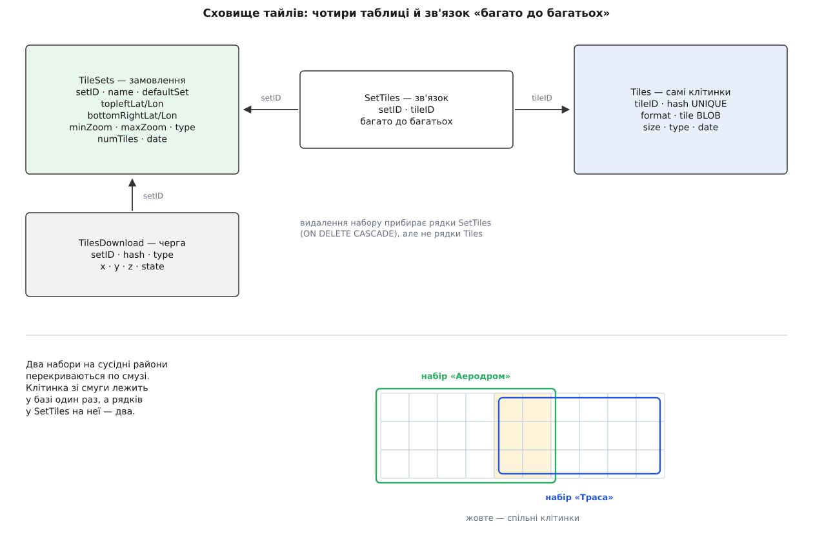
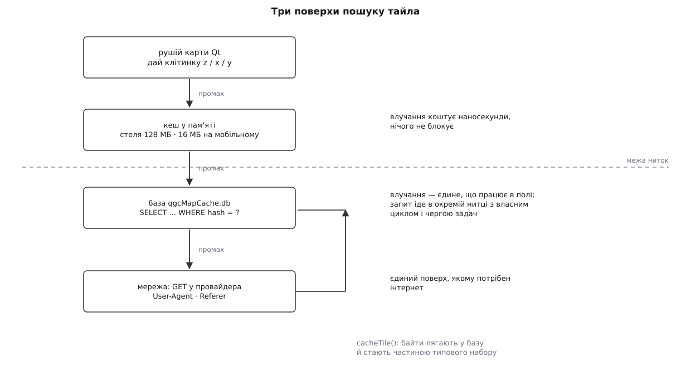
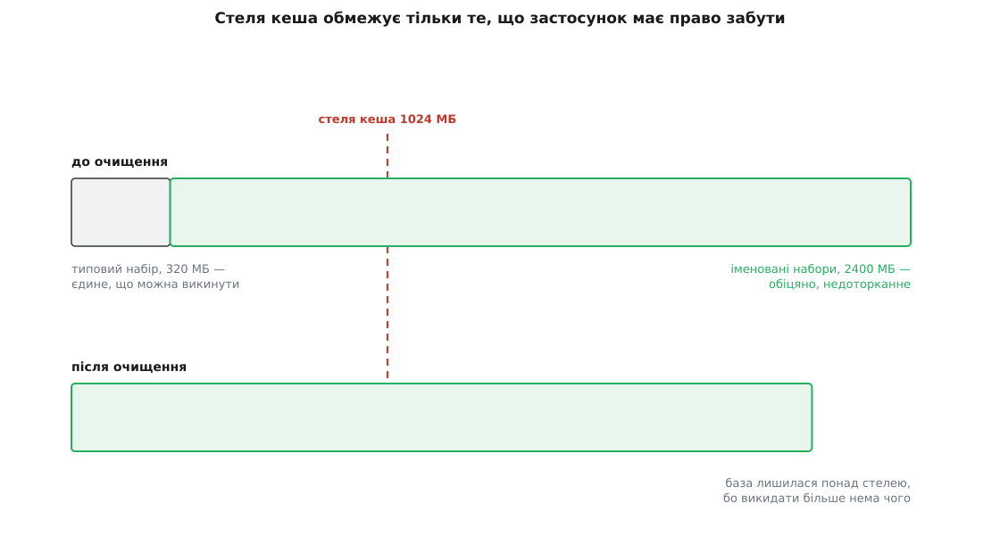

# Офлайн-карти й кеш тайлів

<preknowlist>
- [Офлайн-карти й кеш тайлів](book:programming/offline-tile-cache) — навіщо возити тайли з собою, що таке ключ тайла, як завантажують район наперед і як витісняють старе. Тут — конкретне втілення цього всередині станції.
- [Web Mercator і тайлова сітка](book:math/web-mercator-tiles) — адреса тайла з трьох чисел `z/x/y`, 4ᶻ клітинок на рівні, перехід від широти й довготи до номера клітинки.
- [Вбудована база даних](book:programming/embedded-database) — база як один файл усередині процесу застосунку, без сервера й без мережі.
- [SQL](book:programming/sql) — таблиця, первинний ключ, унікальний індекс, зовнішній ключ, з'єднання таблиць.
- [Модель потоків](book:qgroundcontrol/threading-model) — які нитки має станція і чому в головній не можна робити нічого повільного.
- [Рушій карти](book:qgroundcontrol/map-engine) — провайдери тайлів усередині станції й те, як карта на екрані просить чергову клітинку.
</preknowlist>

Оператор готувався сумлінно. Напередодні виїзду він відкрив станцію вдома, знайшов на карті поле, покрутив колесо туди-сюди, роздивився лісосмугу й дорогу — карта малювалася бездоганно. Наступного ранку в тому самому полі, за сорок кілометрів від найближчої вишки, він відкриває той самий застосунок і бачить сіру пляму з блідою сіткою. Не всю сіру: центр району ще тримається, а край, куди він учора теж заглядав, — уже ні.

Це не збій. Це рівно те, на що він мав право розраховувати, і нічого більше. Учора застосунок не «зберіг карту» — він **кешував** те, що йому знадобилося намалювати, а кеш за визначенням має право забути. Щоб карта була в полі гарантовано, потрібне не прискорення, а **зобов'язання**: набір тайлів, який хтось свідомо замовив і який ніхто не сміє викинути. Уся підсистема офлайн-карт станції виросла саме з цієї різниці, і майже кожне її рішення — від схеми бази до окремої нитки — виводиться з неї за один крок.

Назви класів, таблиць і сталих нижче — з поточної гілки застосунку (лінія 5.x). У старших збірках частина файлів звалася інакше й лежала в інших теках, але модель сховища відтоді не мінялася.

### Кеш забуває, набір — ні

Дві потреби виглядають однаково («хай тайли лежать локально»), а поводяться протилежно.

**Кеш** наповнюється сам собою. Оператор возить карту по екрану, застосунок тягне тайли з мережі й попутно складає їх у себе. Йому не можна рости нескінченно: диск не гумовий, а більшість цих тайлів оператор ніколи вже не побачить. Отже, кеш **мусить** мати стелю й механізм викидання зайвого.

**Набір** створюють руками. Оператор обвів прямокутник, вибрав рівні масштабу, натиснув «завантажити» — і тепер це не оптимізація, а обіцянка: ці клітинки будуть на місці, коли інтернету не буде. Викинути їх, щоб звільнити місце, означає зламати саме те, заради чого вони є.

Станція тримає обидві сутності в **одному** сховищі й розрізняє їх одним прапорцем. У таблиці наборів є рядок з ім'ям `Default Tile Set` і полем `defaultSet = 1` — це і є «звалище» самопливом набраних тайлів; станція створює його сама, якщо не знаходить при старті. Усі інші рядки — іменовані набори з `defaultSet = 0`. Далі вся арифметика витіснення зводиться до одного питання: **чи тримає цю клітинку хоч один іменований набір**. Тримає — недоторканна; не тримає — кандидат на виліт.

> 🔧 **Навіщо це.** Звідси прямий практичний висновок для підготовки до виїзду: покрутити карту вдома — не підготовка. Підготовка — це створити іменований набір на район робіт. Усе інше застосунок має повне право стерти рівно тоді, коли йому забракне місця, і зробить це мовчки.

### Чому одна база, а не тека з файлами

Найпростіше сховище тайлів — тека, де кожен тайл окремим файлом `z/x/y.png`. Чому так не зроблено, докладно розібрано в [загальній статті про офлайн-кеш](book:programming/offline-tile-cache): дрібний файл на 10–20 кілобайтів займає цілий кластер файлової системи, кожен потребує запису в каталозі, а набір на кількасот тисяч тайлів перетворює звичайне «видалити набір» на багатохвилинний обхід дерева. На Android до цього додаються ще й обмеження на кількість файлів у теці застосунку.

Станція обрала іншу відповідь: **одна база SQLite** — файл `qgcMapCache.db` у кеш-теці застосунку (сама тека залежить від платформи, а в різних релізах ще й несла суфікс версії — на кшталт `QGCMapCache300` у користувацьких звітах). Тайл лежить у ній як `BLOB` — двійкова грудка байтів у комірці таблиці. Одна база дає три речі одразу: видалення набору стає одним `DELETE`, підрахунок «скільки в мене всього мегабайтів» — одним `SELECT SUM`, а перенесення карти на іншу станцію — копіюванням одного файлу.

### Чотири таблиці, і одна з них найважливіша

Схема, яку станція створює при першому запуску, складається з чотирьох таблиць:

```sql
CREATE TABLE IF NOT EXISTS Tiles (
    tileID INTEGER PRIMARY KEY NOT NULL, hash TEXT NOT NULL UNIQUE,
    format TEXT NOT NULL, tile BLOB NULL, size INTEGER, type INTEGER,
    date INTEGER DEFAULT 0)

CREATE TABLE IF NOT EXISTS TileSets (
    setID INTEGER PRIMARY KEY NOT NULL, name TEXT NOT NULL UNIQUE, typeStr TEXT,
    topleftLat REAL, topleftLon REAL, bottomRightLat REAL, bottomRightLon REAL,
    minZoom INTEGER DEFAULT 3, maxZoom INTEGER DEFAULT 3, type INTEGER DEFAULT -1,
    numTiles INTEGER DEFAULT 0, defaultSet INTEGER DEFAULT 0, date INTEGER DEFAULT 0)

CREATE TABLE IF NOT EXISTS SetTiles (
    setID INTEGER NOT NULL REFERENCES TileSets(setID) ON DELETE CASCADE,
    tileID INTEGER NOT NULL REFERENCES Tiles(tileID) ON DELETE CASCADE)

CREATE TABLE IF NOT EXISTS TilesDownload (
    setID INTEGER NOT NULL REFERENCES TileSets(setID) ON DELETE CASCADE,
    hash TEXT NOT NULL, type INTEGER, x INTEGER, y INTEGER, z INTEGER,
    state INTEGER DEFAULT 0)
```

`Tiles` — самі картинки: одна клітинка, один рядок, картинка в полі `tile`. `TileSets` — замовлення: ім'я, прямокутник у градусах, діапазон рівнів, тип карти й лічильник клітинок. `TilesDownload` — черга того, що ще треба скачати.

А `SetTiles` — та сама таблиця, заради якої вся конструкція й тримається купи. Вона зв'язує набір із тайлом і не має жодного власного поля: тільки пара номерів. Це **зв'язок «багато до багатьох»**, і потрібен він через просту географічну обставину — **набори перекриваються**. Оператор завантажив район аеродрому, через місяць — сусідній район уздовж траси, і смуга між ними належить обом. Фізичний тайл у базі при цьому один: другий набір не завантажив його вдруге, а просто дописав ще один рядок у `SetTiles`.



*Один фізичний тайл може належати кільком наборам одразу; саме через це видалення набору не має права видаляти тайли, а витіснення — чіпати ті, що комусь обіцяні.*

Наслідок цього рішення видно тоді, коли набір видаляють. `ON DELETE CASCADE` прибирає рядки `SetTiles`, що вели до нього, — але не рядки `Tiles`. Клітинка зі смуги перекриття лишається на місці, бо на неї досі показує другий набір. Якби зв'язок був «один набір — свої тайли», довелося б або дублювати картинки, або перед кожним видаленням перебирати всі інші набори вручну.

Індекси в схемі стоять рівно там, куди станція б'є найчастіше: унікальний по парі `(tileID, setID)` — щоб той самий тайл не потрапив у той самий набір двічі; окремі по `setID` і `tileID` — для двох напрямків обходу зв'язку; по `(setID, state)` у черзі завантаження — щоб швидко брати наступну порцію нескачаного; і по `date` у `Tiles` — бо саме за датою вибирають, кого викинути першим. Повний перелік стовпців із поясненням, що означає кожне значення `state` і `type`, та запити, якими власний кеш можна роздивитися звичайною утилітою `sqlite3`, зібрані [в описі схеми сховища](book:qgroundcontrol/offline-maps/api-tile-cache-db.md).

### Ім'я тайла

Щоб знайти клітинку в базі, потрібен ключ. Природний ключ — четвірка «провайдер, z, x, y», але станція не робить із неї складеного первинного ключа. Замість цього вона склеює четвірку в **один рядок фіксованої довжини**:

```cpp
QString UrlFactory::getTileHash(QStringView type, int x, int y, int z)
{
    return QString::asprintf("%010d%08d%08d%03d",
                             UrlFactory::hashFromProviderType(type), x, y, z);
}
```

Виходить двадцять дев'ять цифр: десять на числовий код провайдера, вісім на `x`, вісім на `y`, три на рівень. Провайдер у ключі обов'язковий, і це не формальність: клітинка `z=15, x=18901, y=10925` у супутниковому шарі Bing і в топографічному шарі Esri — дві геть різні картинки з однією географічною адресою. Без коду провайдера вони б затирали одна одну.

Чому один рядок, а не чотири колонки? Бо цей ключ живе не лише в базі. Ним індексується кеш у пам'яті, ним підписані незавершені мережеві відповіді під час завантаження набору, він же лежить у стовпці `hash` черги `TilesDownload`. Одне значення, яке однаково працює як ключ словника в пам'яті, як текстовий стовпець із унікальним індексом і як частина мережевого обліку, коштує дешевше, ніж три різні подання того самого. Плата — незручність для людини: щоб знайти свій тайл руками, доведеться спершу порахувати цей рядок.

### Дорога тайла до екрана

Карту малює тайловий рушій Qt, і він нічого не знає ні про набори, ні про SQLite. Станція вбудовується в нього як **власний картографічний плагін**: реєструє службу, свій клас керування картою й свою пару «кеш плюс завантажувач». Далі рушій просто питає «дай мені клітинку z/x/y», а весь описаний тут механізм ховається за цим питанням.

Відповідь шукають у три поверхи, згори вниз.

**Пам'ять.** Найближчий поверх — кеш у RAM. Його стелю задає налаштування `maxCacheMemorySize`: типово 128 МБ на настільній системі й 16 МБ на мобільній, а фактичне значення затискається в межі від одного мегабайта до одного гігабайта. Влучання сюди коштує наносекунди й не блокує нічого.

**База.** Промах у пам'яті перетворюється на задачу «дістати тайл за хешем», яку віддають робочій нитці кеша. Та виконує `SELECT` по унікальному індексу `hash`, і якщо рядок є — повертає `BLOB`, який тут-таки стає картинкою. Для оператора в полі це єдиний поверх, що взагалі працює: мережі немає, а карта малюється.

**Мережа.** Тайла немає й у базі — тоді завантажувач формує запит до провайдера. Запит іде з тим `User-Agent` і тим заголовком `Referer`, які вимагає конкретний провайдер (без них частина серверів просто відмовляє), з увімкненим keep-alive і з перевагою кешованої відповіді на рівні мережевого стека. Байти, що прийшли, спершу віддають рушієві на екран, а потім складають у базу — і клітинка стає частиною типового набору.



*Кожен наступний поверх на порядки дорожчий за попередній, тому межа між головною ниткою й ниткою бази проходить саме там, де починається дорога робота.*

### Чому база живе в окремій нитці

Запит до SQLite — це операція з файлом. На завантаженому диску, під час паралельного запису кількох сотень тайлів набору, він може стати на десятки мілісекунд. Якщо цей запит зробити в головній нитці, оператор побачить ривок карти рівно тоді, коли він найбільше заважає: під час панорамування.

Тому вся робота з базою винесена в окрему нитку — робітника кеша. Влаштований він не так, як більшість фонових ниток застосунку: замість звичайного циклу подій у нього **власний цикл із чергою задач**. Задачу кладуть у чергу під м'ютексом і будять нитку умовною змінною; нитка прокидається, розгрібає чергу до дна, а коли черга порожня — засинає з таймаутом до п'яти секунд, щоб час від часу перерахувати підсумки й повідомити їх нагору. Це класична схема [«виробник — споживач»](book:programming/producer-consumer), просто виробників тут багато (карта, редактор наборів, завантажувач), а споживач один — бо база одна.

З цього вибору випливає одна неочевидна деталь у коді. Постановка задачі викликається **прямим** з'єднанням, а не чергою сигналів Qt:

```cpp
// Пряме з'єднання — навмисне: у робочої нитки немає циклу подій Qt,
// тож відкладений виклик через чергу подій до неї просто не доїхав би.
QMetaObject::invokeMethod(_worker, "enqueueTask", Qt::DirectConnection,
                          Q_ARG(QGCMapTask *, task));
```

Звичайний асинхронний виклик між нитками в Qt працює через цикл подій отримувача: подію кладуть у чергу, і нитка забирає її, коли дійде до обробки. Тут циклу подій немає — його місце зайняв власний цикл. Тому виклик виконується прямо в нитці того, хто ставить задачу, і вся синхронізація лягає на м'ютекс усередині черги. Загальну картину того, які ще нитки має станція й де проходять їхні межі, розібрано в [моделі потоків](book:qgroundcontrol/threading-model).

### Скільки це коштує: рахунок перед завантаженням

Редактор наборів показує оцінку — скільки клітинок і скільки мегабайтів вийде, — і робить це до того, як щось скачано. Рахунок прямолінійний: для кожного рівня від мінімального до максимального беруть номери клітинок двох кутів прямокутника й перемножують сторони.

```cpp
int MapProvider::long2tileX(double lon, int z) const {
    return static_cast<int>(floor((lon + 180.0) / 360.0 * pow(2.0, z)));
}
int MapProvider::lat2tileY(double lat, int z) const {
    return static_cast<int>(floor((1.0 - log(tan(lat * M_PI / 180.0)
                 + 1.0 / cos(lat * M_PI / 180.0)) / M_PI) / 2.0 * pow(2.0, z)));
}
```

Кількість клітинок на рівні — `(x₁ − x₀ + 1) · (y₁ − y₀ + 1)`, а обсяг — ця кількість, помножена на **середній розмір тайла**. Початкове значення середнього розміру зашите сталою `QGC_AVERAGE_TILE_SIZE = 13652` байти; провайдер може оголосити своє, а під час завантаження станція кожні десять успішних тайлів перераховує середнє за фактично отриманими байтами й уточнює оцінку на льоту. Тому число, яке видно перед стартом, — оцінка, а не обіцянка: щільна забудова важить більше за поле, і різниця легко буває дворазовою.

**Оцінка для реального замовлення: район приблизно 28 × 33 км (довгота 30.30°–30.70°, широта 50.30°–50.60°), рівні 3–17, супутниковий шар.**

```
рівень   клітинок по x   по y     на рівні   разом
   3– 9              1      1            1        7
  10                 2      2            4       11
  11                 3      3            9       20
  12                 6      6           36       56
  13                10     12          120      176
  14                20     23          460      636
  15                38     44         1672     2308
  16                74     86         6364     8672
  17               147    172        25284    33956

обсяг = 33956 · 13652 ≈ 463 567 312 байтів ≈ 442 МіБ
```

Дві речі в цій табличці варті окремої уваги. Перша: рівні з 3 по 14 разом дали 636 клітинок — менше за три відсотки підсумку. Практично весь набір — це два останні рівні, бо кожен крок углиб множить кількість на чотири; за цим стоїть звичайна [геометрична прогресія](book:math/geometric-series), у якої сума майже дорівнює останньому доданкові. Друга: варто дописати рівень 18 — і додасться ще 100 792 клітинки, тобто близько 1.28 ГіБ; рівень 19 додав би ще понад 5 ГіБ. Саме тому «візьму з запасом, раптом знадобиться» тут не працює: запас коштує дорожче за все замовлення разом.

> 🔧 **Навіщо це.** Максимальний рівень треба вибирати не «найдетальніший, який дають», а той, на якому оператор реально працює. Для планування маршруту над полем цілком вистачає 16–17; рівень 19 має сенс хіба що на п'ятачку злітного майданчика — і тоді його замовляють окремим маленьким набором, а не розтягують на весь район.

### Черга завантаження, яка переживає перезапуск

Замовлення на 34 тисячі клітинок не завантажується за один прийом. Станція могла б тримати список у пам'яті, але тоді закритий ноутбук, розірваний зв'язок чи звичайне «завтра доскачаю» коштували б усього прогресу. Тому черга лежить **у базі** — це та сама таблиця `TilesDownload`: рядок на кожну ще не отриману клітинку, зі станом `state`.

Робота йде порціями. Завантажувач набору бере з бази чергову партію рядків зі станом «чекає», формує з них мережеві запити й тримає в польоті стільки одночасних запитів, скільки дозволяє провайдер, — окрема стеля для звичайних тайлів і окрема для висотних. Щойно відповідь прийшла, тайл ляга́є в базу через ту саму `cacheTile`, що й під час звичайного перегляду карти, а рядок черги переходить у стан «готово». Помилка мережі не зупиняє процес: лічильник помилок росте, рядок позначають станом «помилка», і партія йде далі.

Повторних спроб тут навмисно немає. Замість них є **відновлення**: команда «продовжити» одним оновленням переводить усі рядки набору, що не дійшли до стану «готово», назад у стан «чекає», і завантаження просто починається наново з того, що лишилося. Це грубіше за [розумні повтори з відступом](book:programming/retries-backoff), зате не має жодного стану в пам'яті й однаково правильно відпрацьовує три різні аварії — обрив мережі, вихід із застосунку й падіння.

### Витіснення: кого можна викидати

Після кожної партії записаних тайлів робітник перераховує підсумки — скільки всього рядків і байтів у `Tiles` — і порівнює зі стелею `maxCacheDiskSize`. Типове значення — 1024 МБ, налаштовуване від 1 МБ до 256 ГБ. Перевищили — станція ставить у чергу задачу очищення на різницю.

Очищення викидає найстаріші тайли: у `Tiles` є `date`, по ньому стоїть індекс, і вибірка йде `ORDER BY date ASC` порціями по 128 рядків, поки не звільниться потрібний обсяг. Це звичайна політика «викидаємо найдавніше», одна з [сімейства політик витіснення](book:programming/cache-eviction-policies).

Уся сіль — у тому, **звідки** береться список кандидатів. Він не є «усі тайли»: спершу підзапит відбирає тільки ті клітинки, які тримає єдиний набір — типовий. Тайл, на який показує хоч один іменований набір, у вибірку не потрапляє взагалі.

З цього випливає наслідок, який дивує майже кожного, хто вперше бачить свій кеш роздутим удвічі понад ліміт: **стеля розміру кеша не є стелею розміру сховища**. Вона обмежує лише те, що застосунок має право забути. Замовили набір на 5 ГБ при ліміті 1024 МБ — база виросте до 5 ГБ і не зменшиться, бо викидати з неї нема чого. Єдиний спосіб звільнити цей простір — видалити набір руками; тоді зникнуть рядки зв'язку, тайли перестануть бути обіцяними, і найближче очищення їх забере.



*Ліміт диска керує лише лівою частиною; права росте рівно настільки, скільки замовив оператор, і зменшується тільки разом із набором.*

### Рельєф їде тією самою трубою

Карта показує, що́ під апаратом, але не показує, наскільки воно високо. Висоти потрібні станції не для краси: без них не працює ні профіль висот у редакторі місії, ні режим «слідувати за рельєфом», ні попередження про зіткнення з горою. І потрібні вони точно так само **в полі, без мережі**.

Тому висотні дані завели в те саме сховище — окремим типом «провайдера». Це чиста економія механізму: для черги, бази, витіснення й експорту висотний тайл нічим не відрізняється від картинки. Але всередині відмінності суттєві.

Адреса не тайлова. Джерело висот (набір Copernicus) віддає дані за **прямокутником у градусах**, а не за номером клітинки, тому провайдер підставляє в адресу чотири координати кутів, а не `x`, `y`, `z`. Перетворення «широта-довгота → номер клітинки» в нього своє: воно ігнорує рівень масштабу й ділить простір на клітинки сталого розміру в градусах. Через це в оцінці набору висотні клітинки рахують окремо, на умовному рівні 1.

Зберігається теж не картинка. Те, що прийшло від сервера, розбирають у **сітку висот** і кладуть у базу вже серіалізованим — байти в полі `tile` є впорядкованим масивом чисел, з якого станція потім читає висоту в довільній точці. Що це за сітка, звідки в неї така роздільність і яку похибку дає інтерполяція між вузлами, розібрано в [цифровій моделі рельєфу](book:programming/terrain-elevation-model); як станція користується нею при плануванні — у [режимах висоти в плані](book:qgroundcontrol/terrain-and-altitude).

Практичний бік — один прапорець у редакторі набору. Якщо замовляючи район не поставити позначку про висотні дані, у полі буде карта без рельєфу: маршрут малюється, а профіль висот під ним порожній.

### Перенести набір на іншу станцію

Набір на 442 МіБ качається довго, а на майданчик часто виїжджають кількома станціями. Качати той самий район на кожній — марна трата часу й трафіку, а іноді й неможлива: підготовку роблять там, де є інтернет, а він є не завжди й не у всіх.

Тому набори **експортують**. Станція виділяє вибрані набори в окремий файл бази з розширенням `.qgctiledb` — це та сама схема, просто з підмножиною рядків. На іншій машині його імпортують одним із двох способів: **заміною** (стерти наявне сховище й покласти привезене) або **злиттям** (додати привезені набори до наявних). Злиття — звичайний режим для поповнення, заміна — для розгортання однакового стану на парк станцій.

Той самий формат відкриває й обхід графічного інтерфейсу: файл `.qgctiledb` можна зібрати заздалегідь скриптом на машині збірки — порахувати перелік клітинок для району, вивантажити їх і скласти в базу з правильними хешами й правильними рядками зв'язку. Як це зробити крок за кроком і де при цьому найлегше помилитися, показано [в прикладі підготовки набору без застосунку](book:qgroundcontrol/offline-maps/proj-seed-cache.md).

### Де воно ламається

**Скидання схеми.** Схема має номер версії, і вона його перевіряє. Не збігся — база не мігрує, а створюється заново; усі накопичені тайли зникають. У межах однієї лінії релізів це не турбує, але після великого оновлення застосунку кеш може виявитися порожнім. Звідси правило: перед виїздом карту перевіряють **у тій збірці, з якою поїдуть**, а не в тій, що була вчора.

**Порожні тайли, які виглядають як справжні.** Частина провайдерів на запит клітинки, для якої знімка немає, віддає не помилку, а картинку-заглушку «немає зображення» зі звичайним кодом успіху. Для кеша це нормальний тайл: він потрапляє в базу, займає місце й назавжди затуляє собою те, що з часом на сервері могло з'явитися. У станції для цього є разова чистка, яка вимітає такі заглушки Bing і запам'ятовує в налаштуваннях, що вже це зробила. Симптом у полі — квадрат, який уперто лишається порожнім навіть при живому інтернеті; лікується видаленням тайла з бази або скиданням кеша.

**Провайдер, який мовчить.** Тайлові служби ставлять свої умови: одні вимагають ключа доступу, інші — правильного заголовка `Referer`, майже всі обмежують темп запитів і окремо застерігають масове завантаження. Тому набір, який учора качався, сьогодні може віддавати самі помилки, і причина буде не в станції. Які провайдери є в застосунку, які з них потребують ключа й де він задається — у [рушії карти](book:qgroundcontrol/map-engine); загальні межі того, що взагалі дозволено викачувати з тайлової служби, — в [умовах користування тайловими сервісами](book:programming/tile-service-terms).

**Місце на мобільному пристрої.** На Android база лежить у приватній теці застосунку, і 5-гігабайтний набір там може просто не поміститися або зникнути разом із «очистити дані». Планшет для польотів варто перевіряти на вільне місце так само уважно, як акумулятор: карта, якої не вистачило, вимикає планування рівно так само надійно, як розряджена батарея.
