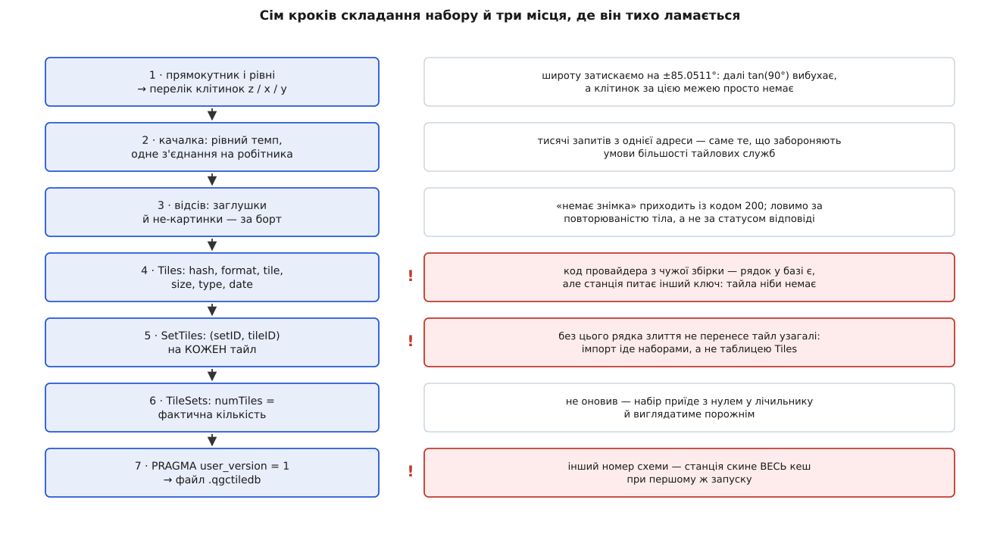

# 🧰 Зібрати `.qgctiledb` скриптом: набір карт без інтерфейсу станції

Це робочий приклад: програма, якій дають прямокутник у градусах, діапазон рівнів масштабу й адресу тайлової служби, а вона віддає готовий файл `.qgctiledb` — рівно той формат, який станція приймає командою «імпортувати». Потрібен він тоді, коли карту треба підготувати один раз і роздати на парк станцій, зробити це на машині без екрана або вбудувати в автоматичну збірку виїзного комплекту.

## Чому не мишкою

Редактор наборів у станції робить те саме — і для одного планшета цього досить. Але щойно станцій стає дванадцять, кожна з них качає ті самі десятки тисяч клітинок із того самого сервера. Це втричі-вчетверо довше, ніж треба, і рівно втричі-вчетверо більше навантаження на службу, яка цього не просила.

Далі йдуть речі, яких інтерфейс не вміє взагалі. Прямокутник району найчастіше вже існує — у файлі плану, у KML із межами ділянки, у наряді на роботи; вводити ті самі чотири числа руками означає ще одне місце, де можна помилитися. Машина, що має інтернет, і машина, що полетить у поле, часто різні, і друга взагалі не має графічного середовища. А підготовку комплекту хочеться відтворювати: той самий прямокутник, ті самі рівні, той самий вміст — і сьогодні, і через півроку.

Звідси чотири вимоги до скрипта:

- на виході — **один самодостатній файл**, який приймає імпорт;
- прогін **відтворюваний**: ті самі аргументи дають той самий вміст;
- перерваний прогін **продовжується** з того місця, де впав;
- у живу базу станції не пишемо **нічого**.

Останнє — не з обережності, а по суті. Поки станція працює, її робітник кеша тримає власне з'єднання й власне уявлення про те, що вже завантажено; сторонній запис у той самий файл у кращому разі впаде на `database is locked`, у гіршому розійдеться з тим, що станція вважає правдою. Правильна межа — окремий файл і штатний імпорт.

## Ідея: що саме має бути у файлі

Спокуслива й хибна модель — «покладу тайли в таблицю `Tiles`, а станція їх підхопить». Не підхопить. Імпорт іде **наборами**: код читає рядки `TileSets`, для кожного набору проходить по його рядках зв'язку `SetTiles` і копіює у свою базу тільки ті клітинки, на які цей зв'язок показує. Тайл без рядка `SetTiles` не існує для імпорту взагалі — він проїде повз, скільки б місця не займав у файлі.

Отже, мінімальний правильний файл — це три речі, і жодну не можна пропустити:

1. **рядок у `TileSets`** з `defaultSet = 0` — іменований набір, на який хтось показує;
2. **рядок у `Tiles`** на кожну клітинку, з ключем `hash`, порахованим точно так, як його рахує станція;
3. **рядок у `SetTiles`** на кожну пару «набір ↔ клітинка».

Плюс одна дрібниця в заголовку файлу — номер схеми в `PRAGMA user_version`. Станція записує туди своє значення при створенні бази і звіряє при відкритті; чуже число вона не мігрує, а трактує як «база не моя» й **перестворює всі чотири таблиці**.

Дві деталі, які видно тільки з коду імпорту й які легко зробити навпаки. По-перше, у файлі, що його експортує сама станція, **немає рядка типового набору**: експорт створює базу з явним «типовий набір не заводити». Це не косметика — при злитті набір із `defaultSet = 1` не створюється заново, а зливається з типовим набором приймача, тобто ваші тайли лягають рівно в ту купу, яку станція має право забути першою. По-друге, ім'я набору при злитті **перейменовується**, якщо таке вже є: до нього дописується номер (`Полігон 0001`). Тому осмислене унікальне ім'я з районом і датою — не естетика, а спосіб не отримати на парку станцій три різні набори з іменами, що відрізняються лише хвостом.



*Перші три кроки — звичайний конвеєр викачування; уся специфіка станції зосереджена в останніх чотирьох, і саме там помилка не падає, а тихо дає непрацездатний файл.*

## Крок 1: перелік клітинок

Прямокутник задають чотири числа в градусах, клітинку — три цілих. Перехід між ними — дві формули проєкції Web Mercator: довгота лягає в горизонтальний номер лінійно, широта у вертикальний — через логарифм тангенса.

```
n = 2ᶻ
x = ⌊ (lon + 180) / 360 · n ⌋
y = ⌊ (1 − ln(tan φ + 1/cos φ) / π) / 2 · n ⌋,   φ = lat у радіанах
```

Це дослівно те, що робить станція у `long2tileX` і `lat2tileY`, і збіг тут обов'язковий: розійдетеся в одному округленні — отримаєте сусідню клітинку з іншим ключем. Про саму сітку — [Web Mercator і тайлова сітка](topic:math/web-mercator-tiles): проєкція розгортає кулю в квадрат, квадрат ділиться на 4ᶻ однакових клітинок, адреса клітинки — номер стовпця, номер рядка й рівень.

Три місця, де перелік ламається мовчки.

**Північ — це менший `y`.** Вертикальний номер росте на південь, тому нижня межа за номером відповідає верхній за широтою. Переплутали — отримали порожній діапазон і файл на нуль тайлів.

**Полюси.** При широті 90° тангенс іде в нескінченність, а логарифм за ним. Тому широту затискають на ±85.05112878° — це та паралель, на якій карта Меркатора стає рівно квадратною, і за нею клітинок просто немає.

**Край сітки.** Номери мусять лишатися в межах `0 … 2ᶻ − 1`. Прямокутник, що вилазить за антимеридіан або за полярну межу, дає від'ємні номери або номери завеликі — і запити за ними повернуть помилку від сервера, а не картинку.

**Оцінка для прямокутника 30.44°–30.58° сх. д., 50.36°–50.45° пн. ш. (приблизно 10 × 10 км), рівні 3–18.**

```
рівень   по x   по y   на рівні   разом
 3–10       1      1          1        8
11          1      2          2       10
12          2      2          4       14
13          4      4         16       30
14          7      7         49       79
15         14     13        182      261
16         26     26        676      937
17         52     52       2704     3641
18        103    104      10712    14353

обсяг ≈ 14353 · 13652 ≈ 195 947 156 байтів ≈ 187 МіБ
час   ≈ 14353 / 4 запити за секунду ≈ 3588 с ≈ 60 хв
```

Останній рядок важливіший, ніж здається: **час прогону визначає темп, а не смуга**. Скільки б каналу не було, чотири запити за секунду дадуть годину на цей район — і саме цю годину треба закласти в підготовку.

## Крок 2: качалка, яка не сварить вас із провайдером

Мережева частина проста, і вся її складність — у самообмеженні. Тайлові служби майже без винятку забороняють масове викачування або обмежують його явним темпом; «я ж лише свій район» — не аргумент, коли скрипт із чотирма нитками б'є в один хост. Що саме дозволено конкретній службі, читають у її угоді: межі описано в [умовах користування тайловими сервісами](topic:programming/tile-service-terms) — від прямої заборони bulk-завантаження до дозволу за окремим договором чи за плату. Приклад нижче написаний під **власний або ліцензований** тайловий сервер, і адреса шаблоном подається саме тому.

Чотири речі, які качалка мусить робити правильно.

**Темп — спільний на весь процес.** Не «пауза в кожній нитці», а один спільний лічильник: наступний запит випускається не раніше, ніж через `1/rps` секунди після попереднього, ким би він не був відправлений. Інакше чотири нитки з паузою по чверть секунди дадуть шістнадцять запитів за секунду замість чотирьох. Це найпростіша з [схем обмеження темпу](topic:programming/rate-limiting) — рівномірний інтервал без сплесків, і для викачування вона краща за відро токенів саме тим, що сплесків не дає.

**Одне з'єднання на робітника.** TLS-рукостискання коштує більше, ніж сам тайл, тож пул із кількох робітників, кожен зі своїм тривким з'єднанням, — правильна форма. Це звичайний [пул робітників](topic:programming/thread-pool): фіксована кількість виконавців розбирає спільну чергу завдань, і кількість одночасних запитів обмежена ними, а не розміром черги. Станція, до речі, тримає шість одночасних запитів — це верхня межа, від якої варто відштовхуватися, а не перевищувати її.

**Заголовки, яких вимагає служба.** Частина серверів відмовляє без `User-Agent`, частина — без `Referer` із дозволеною адресою. Станція підставляє браузероподібний `User-Agent` і `Referer`, оголошений класом провайдера; свій скрипт краще підписувати чесно й тим ім'ям, яке дозволяє угода.

**Повтори — лише там, де вони мають сенс.** `429` і `5xx` — тимчасові, їх повторюють із подвоєнням паузи й повагою до заголовка `Retry-After`. `403` і `404` — остаточні: повторювати їх означає лише швидше отримати блокування. Загальна механіка — у [повторах із відступом](topic:programming/retries-backoff): пауза росте геометрично, щоб не додавати навантаження туди, де вже погано.

## Крок 3: відсів того, що не є картинкою

Тайл, який приїхав із кодом `200`, ще не тайл. Відсів має два рівні надійності, і плутати їх не можна.

**Тверде правило.** Тіло, що не починається сигнатурою PNG (`89 50 4E 47`) або JPEG (`FF D8 FF`), — не картинка. Так у базу не потрапить сторінка помилки, XML із текстом «ліміт вичерпано» чи порожня відповідь. Станція визначає формат так само — за сигнатурою тіла, а не за розширенням в адресі, — тож і поле `format` заповнюється з того ж джерела.

**М'яке правило.** Заглушка «немає знімка» приходить із кодом успіху й **є** справжнім PNG. Упізнати її можна лише за тим, що вона повторюється: та сама послідовність байтів на десятках різних клітинок. Але тут легко зробити гірше, ніж було: суцільна вода чи однорідний пісок на високому рівні теж дають байт-у-байт однакові тайли, і викинути їх — значить залишити в полі дірку там, де насправді все гаразд.

Тому повторюваність — **підозра, а не вирок**. Скрипт рахує контрольну суму кожного тіла, наприкінці показує найчастіші й викладає по одному зразку у файл, щоб людина глянула очима. Викидає він тільки ті суми, які їй назвали явно. Це на одну хвилину роботи довше й на один клас мовчазних помилок менше.

## Крок 4–7: база

Тепер найважливіше, і воно ж найкоротше. Схему створюємо дослівно ту, яку створює станція, — жодних «покращень», бо приймач звіряється з нею буквально. Ключ рахуємо одним форматуванням із фіксованими ширинами полів: десять цифр коду провайдера, вісім на `x`, вісім на `y`, три на рівень.

Записи в `Tiles` ідуть **пачками в одній транзакції**. Кожен окремий `INSERT` поза транзакцією — це власний запис на диск із очікуванням підтвердження; чотирнадцять тисяч таких коштують хвилини на порожньому місці. Пачка по двісті рядків зводить це до сімдесяти підтверджень і водночас обмежує втрату при аварії двомастами тайлами. Чому одиниця запису тут саме транзакція й що вона гарантує — у [властивостях транзакцій](topic:programming/transactions-acid): усе або нічого, і підтверджене не зникає.

Рядки `SetTiles` дописуємо після відсіву — одним запитом на всі клітинки файлу. `numTiles` виставляємо **за фактом**, а не за оцінкою: це число станція показує як «скільки в наборі», і нуль у ньому означає набір, що виглядає порожнім, хоча тайли в ньому є. Останнім рухом — `PRAGMA user_version = 1`.

І одна тиха деталь: журнал. Станція тримає свою базу в режимі `WAL`, і поруч із файлом живуть ще два — `-wal` і `-shm`. Файлу, який ви кудись повезете, це шкодить: забули супутника — привезли стан на кілька хвилин старіший. Тому збірний файл робимо у звичайному режимі журналу, щоб на виході був **один** файл і нічого більше.

## Скрипт цілком

Задача мережево-зв'язана й скриптова: вся робота — це очікування відповідей і кілька тисяч однакових вставок у SQLite, тож виграє мова, у якій і те, і те є в стандартній поставці. У Python це `sqlite3` і `http.client` без жодної залежності; у Node з версії 22.13 те саме дає `node:sqlite` разом із вбудованим `fetch`. Обидві версії роблять те саме й дають байт-у-байт однаковий файл; різниця, варта уваги, одна — у Python робітники є справжніми нитками, і спільний лічильник темпу треба закривати м'ютексом, а в Node паралельність кооперативна, тож той самий лічильник обходиться без замка.

:::tabs
```python
#!/usr/bin/env python3
# seed_qgctiledb.py — складання набору офлайн-карт для QGroundControl
# без графічного інтерфейсу станції. Тільки стандартна бібліотека.
import argparse, hashlib, http.client, math, queue, sqlite3, sys, threading, time
import urllib.parse

SCHEMA_VERSION = 1
MAX_LAT = 85.05112877980659          # межа Меркатора: далі tan(φ) вибухає
BATCH   = 200                        # рядків на одну транзакцію

DDL = [
    "CREATE TABLE IF NOT EXISTS Tiles ("
    " tileID INTEGER PRIMARY KEY NOT NULL, hash TEXT NOT NULL UNIQUE,"
    " format TEXT NOT NULL, tile BLOB NULL, size INTEGER, type INTEGER,"
    " date INTEGER DEFAULT 0)",
    "CREATE TABLE IF NOT EXISTS TileSets ("
    " setID INTEGER PRIMARY KEY NOT NULL, name TEXT NOT NULL UNIQUE, typeStr TEXT,"
    " topleftLat REAL DEFAULT 0.0, topleftLon REAL DEFAULT 0.0,"
    " bottomRightLat REAL DEFAULT 0.0, bottomRightLon REAL DEFAULT 0.0,"
    " minZoom INTEGER DEFAULT 3, maxZoom INTEGER DEFAULT 3, type INTEGER DEFAULT -1,"
    " numTiles INTEGER DEFAULT 0, defaultSet INTEGER DEFAULT 0, date INTEGER DEFAULT 0)",
    "CREATE TABLE IF NOT EXISTS SetTiles ("
    " setID INTEGER NOT NULL REFERENCES TileSets(setID) ON DELETE CASCADE,"
    " tileID INTEGER NOT NULL REFERENCES Tiles(tileID) ON DELETE CASCADE)",
    "CREATE TABLE IF NOT EXISTS TilesDownload ("
    " setID INTEGER NOT NULL REFERENCES TileSets(setID) ON DELETE CASCADE,"
    " hash TEXT NOT NULL, type INTEGER, x INTEGER, y INTEGER, z INTEGER,"
    " state INTEGER DEFAULT 0)",
    "CREATE UNIQUE INDEX IF NOT EXISTS idx_settiles_unique ON SetTiles(tileID, setID)",
    "CREATE INDEX IF NOT EXISTS idx_settiles_setid  ON SetTiles(setID)",
    "CREATE INDEX IF NOT EXISTS idx_settiles_tileid ON SetTiles(tileID)",
    "CREATE UNIQUE INDEX IF NOT EXISTS idx_tilesdownload_setid_hash"
    " ON TilesDownload(setID, hash)",
    "CREATE INDEX IF NOT EXISTS idx_tilesdownload_setid_state"
    " ON TilesDownload(setID, state)",
    "CREATE INDEX IF NOT EXISTS idx_tiles_date ON Tiles(date)",
]


# ─── географія ──────────────────────────────────────────────────────────────
def tile_x(lon, z):
    return int(math.floor((lon + 180.0) / 360.0 * (1 << z)))


def tile_y(lat, z):
    lat = max(-MAX_LAT, min(MAX_LAT, lat))
    phi = math.radians(lat)
    return int(math.floor((1.0 - math.log(math.tan(phi) + 1.0 / math.cos(phi))
                           / math.pi) / 2.0 * (1 << z)))


def cells(west, south, east, north, zmin, zmax):
    """Клітинки прямокутника на всіх рівнях. Північ дає МЕНШИЙ y."""
    for z in range(zmin, zmax + 1):
        n = 1 << z
        x0, x1 = tile_x(west, z), tile_x(east, z)
        y0, y1 = tile_y(north, z), tile_y(south, z)
        for x in range(max(0, x0), min(n - 1, x1) + 1):
            for y in range(max(0, y0), min(n - 1, y1) + 1):
                yield z, x, y


def tile_hash(map_id, x, y, z):
    return "%010d%08d%08d%03d" % (map_id, x, y, z)


def quadkey(x, y, z):
    """Адресація Bing: рівень за рівнем, по два біти на цифру."""
    out = []
    for i in range(z, 0, -1):
        mask, digit = 1 << (i - 1), 0
        if x & mask:
            digit += 1
        if y & mask:
            digit += 2
        out.append(str(digit))
    return "".join(out)


def image_format(body):
    """Розпізнавання за сигнатурою — так само, як це робить станція."""
    if body[:8] == b"\x89PNG\r\n\x1a\n":
        return "png"
    if body[:3] == b"\xff\xd8\xff":
        return "jpg"
    return None


# ─── мережа ─────────────────────────────────────────────────────────────────
class Pace:
    """Спільна на всі нитки стеля «не більше rps запитів за секунду»."""

    def __init__(self, rps):
        self._gap = 1.0 / rps
        self._lock = threading.Lock()
        self._next = time.monotonic()

    def wait(self):
        with self._lock:                       # нитки справжні — потрібен замок
            now = time.monotonic()
            self._next = max(self._next, now) + self._gap
            delay = self._next - self._gap - now
        if delay > 0:
            time.sleep(delay)


class Fetcher:
    """Одне тривке з'єднання на робітника: рукостискання — раз на прогін."""

    def __init__(self, host, headers, pace, timeout=15.0):
        self.host, self.headers, self.pace, self.timeout = host, headers, pace, timeout
        self.conn = None

    def close(self):
        if self.conn:
            try:
                self.conn.close()
            except OSError:
                pass
            self.conn = None

    def get(self, path, attempts=4):
        for attempt in range(attempts):
            self.pace.wait()
            try:
                if self.conn is None:
                    self.conn = http.client.HTTPSConnection(self.host, timeout=self.timeout)
                self.conn.request("GET", path, headers=self.headers)
                resp = self.conn.getresponse()
                body = resp.read()             # тіло читаємо ЗАВЖДИ, інакше
                if resp.status == 200:         # з'єднання не перевикористати
                    return body
                if resp.status in (408, 429, 500, 502, 503, 504):
                    hold = resp.getheader("Retry-After")
                    time.sleep(float(hold) if hold and hold.isdigit() else 2.0 ** attempt)
                    continue
                return None                    # 401 / 403 / 404 — остаточні
            except (http.client.HTTPException, OSError):
                self.close()
                time.sleep(2.0 ** attempt)
        return None


# ─── база ───────────────────────────────────────────────────────────────────
def open_db(path):
    db = sqlite3.connect(path, isolation_level=None)   # транзакціями керуємо самі
    db.execute("PRAGMA foreign_keys = ON")
    db.execute("PRAGMA journal_mode = DELETE")         # один файл на виході
    db.execute("PRAGMA synchronous  = NORMAL")
    for stmt in DDL:
        db.execute(stmt)
    return db


def ensure_set(db, a, west, south, east, north, zmin, zmax):
    row = db.execute("SELECT setID FROM TileSets WHERE name = ?", (a.name,)).fetchone()
    if row:
        return row[0]
    cur = db.execute(
        "INSERT INTO TileSets(name, typeStr, topleftLat, topleftLon, bottomRightLat,"
        " bottomRightLon, minZoom, maxZoom, type, numTiles, defaultSet, date)"
        " VALUES(?,?,?,?,?,?,?,?,?,0,0,?)",
        (a.name, a.map_name, north, west, south, east,      # topleft = ПнЗх кут
         zmin, zmax, a.map_id, int(time.time())))
    return cur.lastrowid


# ─── прогін ─────────────────────────────────────────────────────────────────
def main():
    ap = argparse.ArgumentParser(description="Складання .qgctiledb для QGroundControl")
    ap.add_argument("--out", required=True)
    ap.add_argument("--name", required=True, help="ім'я набору, як його побачить оператор")
    ap.add_argument("--bbox", required=True, help="west,south,east,north у градусах")
    ap.add_argument("--zoom", required=True, help="zmin-zmax")
    ap.add_argument("--url", required=True,
                    help="шаблон із {z} {x} {y} або {q} (quadkey)")
    ap.add_argument("--map-name", required=True, help='typeStr, напр. "Bing Satellite"')
    ap.add_argument("--map-id", type=int, required=True, help="той самий код, що в hash")
    ap.add_argument("--rps", type=float, default=4.0)
    ap.add_argument("--workers", type=int, default=4)
    ap.add_argument("--user-agent", default="qgc-tile-seeder/1.0")
    ap.add_argument("--referer")
    ap.add_argument("--drop", action="append", default=[], help="sha1 тіла-заглушки")
    a = ap.parse_args()

    if a.map_id < 1:
        sys.exit("код провайдера мусить бути додатним: -1 дає непридатний ключ")

    west, south, east, north = (float(v) for v in a.bbox.split(","))
    zmin, zmax = (int(v) for v in a.zoom.split("-"))
    url = urllib.parse.urlsplit(a.url)
    headers = {"User-Agent": a.user_agent, "Accept": "*/*", "Connection": "keep-alive"}
    if a.referer:
        headers["Referer"] = a.referer

    db = open_db(a.out)
    set_id = ensure_set(db, a, west, south, east, north, zmin, zmax)
    have = {h for (h,) in db.execute("SELECT hash FROM Tiles")}   # для продовження

    work, planned = queue.Queue(), 0
    for z, x, y in cells(west, south, east, north, zmin, zmax):
        planned += 1
        h = tile_hash(a.map_id, x, y, z)
        if h not in have:
            work.put((z, x, y, h))
    results = queue.Queue(maxsize=256)      # стеля пам'яті: ~256 тайлів у польоті
    pace = Pace(a.rps)

    def worker():
        f = Fetcher(url.netloc, headers, pace)
        while True:
            try:
                z, x, y, h = work.get_nowait()
            except queue.Empty:
                break
            fields = {"z": z, "x": x, "y": y, "q": quadkey(x, y, z)}
            path = url.path.format(**fields)
            if url.query:
                path += "?" + url.query.format(**fields)
            results.put((h, f.get(path)))
        f.close()
        results.put(None)

    threads = [threading.Thread(target=worker, daemon=True) for _ in range(a.workers)]
    for t in threads:
        t.start()

    digests, saved, skipped, alive = {}, 0, 0, len(threads)
    now = int(time.time())
    db.execute("BEGIN")
    while alive:
        item = results.get()
        if item is None:
            alive -= 1
            continue
        h, body = item
        fmt = image_format(body) if body else None
        if fmt is None:
            skipped += 1
            continue
        digests.setdefault(hashlib.sha1(body).hexdigest(), []).append(h)
        db.execute("INSERT OR IGNORE INTO Tiles(hash, format, tile, size, type, date)"
                   " VALUES(?,?,?,?,?,?)", (h, fmt, body, len(body), a.map_id, now))
        saved += 1
        if saved % BATCH == 0:
            db.execute("COMMIT")
            db.execute("BEGIN")
            print("\r%d / %d" % (saved, planned), end="", file=sys.stderr)
    db.execute("COMMIT")
    print("\nзбережено %d, не картинок %d" % (saved, skipped), file=sys.stderr)

    # відсів заглушок: спершу звіт зі зразками, викидаємо лише назване явно
    for digest, hashes in sorted(digests.items(), key=lambda kv: -len(kv[1]))[:5]:
        if len(hashes) < 2:
            continue
        fmt, blob = db.execute("SELECT format, tile FROM Tiles WHERE hash = ?",
                               (hashes[0],)).fetchone()
        with open("sample-%s.%s" % (digest[:8], fmt), "wb") as fh:
            fh.write(blob)
        print("%s  однакових тіл: %d  → sample-%s.%s"
              % (digest, len(hashes), digest[:8], fmt), file=sys.stderr)
    if a.drop:
        marked = [(h,) for d in a.drop for h in digests.get(d, [])]
        db.executemany("DELETE FROM Tiles WHERE hash = ?", marked)
        print("викинуто заглушок: %d" % len(marked), file=sys.stderr)

    db.execute("BEGIN")
    db.execute("INSERT OR IGNORE INTO SetTiles(tileID, setID) SELECT tileID, ? FROM Tiles",
               (set_id,))
    total = db.execute("SELECT COUNT(*) FROM SetTiles WHERE setID = ?",
                       (set_id,)).fetchone()[0]
    db.execute("UPDATE TileSets SET numTiles = ? WHERE setID = ?", (total, set_id))
    db.execute("COMMIT")
    db.execute("PRAGMA user_version = %d" % SCHEMA_VERSION)
    db.close()
    print("у наборі «%s»: %d клітинок" % (a.name, total), file=sys.stderr)


if __name__ == "__main__":
    main()
```
```typescript
// seed-qgctiledb.ts — те саме на Node 22.13+ / 24: node:sqlite без прапорця,
// fetch вбудований, залежностей немає.
import { DatabaseSync } from 'node:sqlite';
import { createHash } from 'node:crypto';
import { writeFileSync } from 'node:fs';
import { parseArgs } from 'node:util';

const SCHEMA_VERSION = 1;
const MAX_LAT = 85.05112877980659;   // межа Меркатора: далі tan(φ) вибухає
const BATCH = 200;                   // рядків на одну транзакцію

const DDL = [
  'CREATE TABLE IF NOT EXISTS Tiles (' +
  ' tileID INTEGER PRIMARY KEY NOT NULL, hash TEXT NOT NULL UNIQUE,' +
  ' format TEXT NOT NULL, tile BLOB NULL, size INTEGER, type INTEGER,' +
  ' date INTEGER DEFAULT 0)',
  'CREATE TABLE IF NOT EXISTS TileSets (' +
  ' setID INTEGER PRIMARY KEY NOT NULL, name TEXT NOT NULL UNIQUE, typeStr TEXT,' +
  ' topleftLat REAL DEFAULT 0.0, topleftLon REAL DEFAULT 0.0,' +
  ' bottomRightLat REAL DEFAULT 0.0, bottomRightLon REAL DEFAULT 0.0,' +
  ' minZoom INTEGER DEFAULT 3, maxZoom INTEGER DEFAULT 3, type INTEGER DEFAULT -1,' +
  ' numTiles INTEGER DEFAULT 0, defaultSet INTEGER DEFAULT 0, date INTEGER DEFAULT 0)',
  'CREATE TABLE IF NOT EXISTS SetTiles (' +
  ' setID INTEGER NOT NULL REFERENCES TileSets(setID) ON DELETE CASCADE,' +
  ' tileID INTEGER NOT NULL REFERENCES Tiles(tileID) ON DELETE CASCADE)',
  'CREATE TABLE IF NOT EXISTS TilesDownload (' +
  ' setID INTEGER NOT NULL REFERENCES TileSets(setID) ON DELETE CASCADE,' +
  ' hash TEXT NOT NULL, type INTEGER, x INTEGER, y INTEGER, z INTEGER,' +
  ' state INTEGER DEFAULT 0)',
  'CREATE UNIQUE INDEX IF NOT EXISTS idx_settiles_unique ON SetTiles(tileID, setID)',
  'CREATE INDEX IF NOT EXISTS idx_settiles_setid  ON SetTiles(setID)',
  'CREATE INDEX IF NOT EXISTS idx_settiles_tileid ON SetTiles(tileID)',
  'CREATE UNIQUE INDEX IF NOT EXISTS idx_tilesdownload_setid_hash' +
  ' ON TilesDownload(setID, hash)',
  'CREATE INDEX IF NOT EXISTS idx_tilesdownload_setid_state' +
  ' ON TilesDownload(setID, state)',
  'CREATE INDEX IF NOT EXISTS idx_tiles_date ON Tiles(date)',
];

type Cell = { z: number; x: number; y: number; hash: string };

// ─── географія ──────────────────────────────────────────────────────────────
const tileX = (lon: number, z: number) => Math.floor(((lon + 180) / 360) * 2 ** z);

const tileY = (lat: number, z: number): number => {
  const phi = (Math.max(-MAX_LAT, Math.min(MAX_LAT, lat)) * Math.PI) / 180;
  return Math.floor(((1 - Math.log(Math.tan(phi) + 1 / Math.cos(phi)) / Math.PI) / 2)
                    * 2 ** z);
};

const pad = (v: number, w: number) => String(v).padStart(w, '0');
const tileHash = (mapId: number, x: number, y: number, z: number) =>
  pad(mapId, 10) + pad(x, 8) + pad(y, 8) + pad(z, 3);

/** Адресація Bing: рівень за рівнем, по два біти на цифру. */
function quadkey(x: number, y: number, z: number): string {
  let out = '';
  for (let i = z; i > 0; i--) {
    const mask = 1 << (i - 1);
    out += String((x & mask ? 1 : 0) + (y & mask ? 2 : 0));
  }
  return out;
}

/** Розпізнавання за сигнатурою — так само, як це робить станція. */
function imageFormat(b: Uint8Array): string | null {
  if (b.length > 8 && b[0] === 0x89 && b[1] === 0x50 && b[2] === 0x4e && b[3] === 0x47)
    return 'png';
  if (b.length > 3 && b[0] === 0xff && b[1] === 0xd8 && b[2] === 0xff) return 'jpg';
  return null;
}

function* cells(w: number, s: number, e: number, n: number, zmin: number, zmax: number) {
  for (let z = zmin; z <= zmax; z++) {
    const size = 2 ** z;
    const x0 = Math.max(0, tileX(w, z));
    const x1 = Math.min(size - 1, tileX(e, z));
    const y0 = Math.max(0, tileY(n, z));          // північ дає МЕНШИЙ y
    const y1 = Math.min(size - 1, tileY(s, z));
    for (let x = x0; x <= x1; x++) for (let y = y0; y <= y1; y++) yield { z, x, y };
  }
}

// ─── мережа ─────────────────────────────────────────────────────────────────
const sleep = (ms: number) => new Promise((r) => setTimeout(r, ms));

/** Спільна стеля «не більше rps запитів за секунду».
 *  Замка немає навмисно: у Node паралельність кооперативна, і між читанням
 *  та записом `next` виконання не переривається. */
class Pace {
  private readonly gap: number;
  private next = 0;
  constructor(rps: number) { this.gap = 1000 / rps; }
  async wait(): Promise<void> {
    const now = Date.now();
    this.next = Math.max(this.next, now) + this.gap;
    const delay = this.next - this.gap - now;
    if (delay > 0) await sleep(delay);
  }
}

async function get(url: string, headers: Record<string, string>, pace: Pace,
                   attempts = 4): Promise<Uint8Array | null> {
  for (let a = 0; a < attempts; a++) {
    await pace.wait();
    try {
      const res = await fetch(url, { headers, signal: AbortSignal.timeout(15_000) });
      const body = new Uint8Array(await res.arrayBuffer());   // тіло читаємо ЗАВЖДИ
      if (res.ok) return body;
      if ([408, 429, 500, 502, 503, 504].includes(res.status)) {
        const hold = Number(res.headers.get('retry-after'));
        await sleep(Number.isFinite(hold) && hold > 0 ? hold * 1000 : 2 ** a * 1000);
        continue;
      }
      return null;                                           // 401 / 403 / 404
    } catch { await sleep(2 ** a * 1000); }
  }
  return null;
}

// ─── прогін ─────────────────────────────────────────────────────────────────
const { values } = parseArgs({
  options: {
    out: { type: 'string' }, name: { type: 'string' }, bbox: { type: 'string' },
    zoom: { type: 'string' }, url: { type: 'string' },
    'map-name': { type: 'string' }, 'map-id': { type: 'string' },
    rps: { type: 'string', default: '4' }, workers: { type: 'string', default: '4' },
    'user-agent': { type: 'string', default: 'qgc-tile-seeder/1.0' },
    referer: { type: 'string' }, drop: { type: 'string', multiple: true, default: [] },
  },
});

const mapId = Number(values['map-id']);
if (!(mapId >= 1)) throw new Error('код провайдера мусить бути додатним');

const [west, south, east, north] = values.bbox!.split(',').map(Number);
const [zmin, zmax] = values.zoom!.split('-').map(Number);
const headers: Record<string, string> = {
  'User-Agent': values['user-agent']!, Accept: '*/*',
  ...(values.referer ? { Referer: values.referer } : {}),
};

const db = new DatabaseSync(values.out!);
db.exec('PRAGMA foreign_keys = ON');
db.exec('PRAGMA journal_mode = DELETE');        // один файл на виході
db.exec('PRAGMA synchronous  = NORMAL');
for (const stmt of DDL) db.exec(stmt);

let setRow = db.prepare('SELECT setID FROM TileSets WHERE name = ?')
               .get(values.name!) as { setID: number } | undefined;
if (!setRow) {
  const res = db.prepare(
    'INSERT INTO TileSets(name, typeStr, topleftLat, topleftLon, bottomRightLat,' +
    ' bottomRightLon, minZoom, maxZoom, type, numTiles, defaultSet, date)' +
    ' VALUES(?,?,?,?,?,?,?,?,?,0,0,?)',
  ).run(values.name!, values['map-name']!, north, west, south, east,  // ПнЗх кут
        zmin, zmax, mapId, Math.floor(Date.now() / 1000));
  setRow = { setID: Number(res.lastInsertRowid) };
}
const setID = setRow.setID;

const have = new Set((db.prepare('SELECT hash FROM Tiles').all() as { hash: string }[])
                       .map((r) => r.hash));
const todo: Cell[] = [];
let planned = 0;
for (const c of cells(west, south, east, north, zmin, zmax)) {
  planned++;
  const hash = tileHash(mapId, c.x, c.y, c.z);
  if (!have.has(hash)) todo.push({ ...c, hash });
}

const insTile = db.prepare(
  'INSERT OR IGNORE INTO Tiles(hash, format, tile, size, type, date) VALUES(?,?,?,?,?,?)');
const pace = new Pace(Number(values.rps));
const digests = new Map<string, string[]>();
const now = Math.floor(Date.now() / 1000);
let cursor = 0, saved = 0, skipped = 0;

db.exec('BEGIN');
await Promise.all(Array.from({ length: Number(values.workers) }, async () => {
  while (cursor < todo.length) {
    const c = todo[cursor++];
    const url = values.url!.replaceAll('{z}', String(c.z)).replaceAll('{x}', String(c.x))
                           .replaceAll('{y}', String(c.y))
                           .replaceAll('{q}', quadkey(c.x, c.y, c.z));
    const body = await get(url, headers, pace);
    const fmt = body ? imageFormat(body) : null;
    if (!body || !fmt) { skipped++; continue; }
    const d = createHash('sha1').update(body).digest('hex');
    const seen = digests.get(d);
    if (seen) seen.push(c.hash); else digests.set(d, [c.hash]);
    insTile.run(c.hash, fmt, body, body.length, mapId, now);   // запис синхронний
    if (++saved % BATCH === 0) {
      db.exec('COMMIT'); db.exec('BEGIN');
      process.stderr.write(`\r${saved} / ${planned}`);
    }
  }
}));
db.exec('COMMIT');
process.stderr.write(`\nзбережено ${saved}, не картинок ${skipped}\n`);

// відсів заглушок: спершу звіт зі зразками, викидаємо лише назване явно
const sample = db.prepare('SELECT format, tile FROM Tiles WHERE hash = ?');
for (const [digest, list] of [...digests].sort((a, b) => b[1].length - a[1].length)
                                         .slice(0, 5)) {
  if (list.length < 2) continue;
  const row = sample.get(list[0]) as { format: string; tile: Uint8Array };
  writeFileSync(`sample-${digest.slice(0, 8)}.${row.format}`, row.tile);
  process.stderr.write(`${digest}  однакових тіл: ${list.length}\n`);
}
const del = db.prepare('DELETE FROM Tiles WHERE hash = ?');
let dropped = 0;
for (const d of values.drop!) for (const h of digests.get(d) ?? []) { del.run(h); dropped++; }
if (dropped) process.stderr.write(`викинуто заглушок: ${dropped}\n`);

db.exec('BEGIN');
db.prepare('INSERT OR IGNORE INTO SetTiles(tileID, setID) SELECT tileID, ? FROM Tiles')
  .run(setID);
const { total } = db.prepare('SELECT COUNT(*) AS total FROM SetTiles WHERE setID = ?')
                    .get(setID) as { total: number };
db.prepare('UPDATE TileSets SET numTiles = ? WHERE setID = ?').run(total, setID);
db.exec('COMMIT');
db.exec(`PRAGMA user_version = ${SCHEMA_VERSION}`);
db.close();
process.stderr.write(`у наборі «${values.name}»: ${total} клітинок\n`);
```
:::

Виклик виглядає так:

```bash
python3 seed_qgctiledb.py \
  --out "polygon-2026-08.qgctiledb" \
  --name "Полігон Північ · 2026-08" \
  --bbox 30.44,50.36,30.58,50.45 --zoom 3-18 \
  --url "https://tiles.example.org/sat/{z}/{x}/{y}.jpg" \
  --map-name "Bing Satellite" --map-id 7 --rps 4 --workers 4
```

## Перевірка перед тим, як везти

Файл на 187 мегабайтів, який виявиться непридатним уже в полі, — найдорожча з можливих помилок, і коштує вона рівно нуль, якщо перевірити його одразу. Спершу три структурні звірки: усе, що має збігатися, збігається.

```sql
PRAGMA user_version;                              -- має бути 1

SELECT setID, name, typeStr, type, defaultSet, minZoom, maxZoom, numTiles
FROM TileSets;                                    -- рівно один рядок, defaultSet = 0

SELECT (SELECT COUNT(*) FROM Tiles)                            AS tiles,
       (SELECT COUNT(*) FROM SetTiles)                         AS links,
       (SELECT COUNT(*) FROM Tiles t WHERE NOT EXISTS
           (SELECT 1 FROM SetTiles s WHERE s.tileID = t.tileID)) AS orphans,
       (SELECT MIN(length(hash)) FROM Tiles)                   AS hash_min,
       (SELECT MAX(length(hash)) FROM Tiles)                   AS hash_max;
```

`tiles` дорівнює `links`, `orphans` нульовий, обидві довжини ключа рівно `29`, `numTiles` збігається з `tiles`. Будь-яке інше число — привід не везти файл нікуди.

Але жодна з цих перевірок не бачить головного: чи **той самий** код провайдера в ключі. Ловиться це тільки натурним випробуванням, і воно триває дві хвилини. Зберіть той самий район на одному-єдиному рівні — скажімо, `--zoom 10-10`, кілька клітинок і кілька десятків кілобайтів, — імпортуйте його **в ту саму збірку станції**, з якою поїдете, вимкніть мережу й подивіться на карту. Намалювалося — можна запускати повний прогін на годину. Не намалювалося — ви щойно зекономили годину й дізналися, що код провайдера чи його ім'я не ті.

## Скільки це коштує

```
клітинок на рівні   N(z) = (x₁ − x₀ + 1) · (y₁ − y₀ + 1)   ≈ вчетверо більше за N(z−1)
разом               Σ N(z) ≈ N(zₘₐₖₛ) · 4/3
час прогону         ≈ разом / rps                (упирається в темп, не в смугу)
пам'ять             ≈ черга результатів · середній тайл + перелік контрольних сум
запис у базу        разом вставок, кожна O(log разом) через унікальний індекс hash
підтверджень диска  ≈ разом / BATCH
```

Практично це означає ось що. Прибрати верхній рівень — скоротити прогін учетверо; додати один — учетверо подовжити. Збільшувати кількість робітників понад темп безглуздо: вони однаково стоятимуть у спільній черзі темпу, тож єдина причина мати їх чотири, а не одного, — сховати затримку відповіді, а не обійти обмеження. Пам'ять не залежить від розміру набору: тайли не накопичуються, а протікають крізь чергу фіксованої довжини; єдине, що росте лінійно, — перелік контрольних сум, і це десятки байтів на клітинку.

## Де це ламається

**Не той код провайдера.** Найпідступніша з помилок, бо все виглядає бездоганно: файл є, імпорт пройшов, набір у списку, мегабайти на місці. Але станція шукає клітинку за ключем, у перших десяти цифрах якого — **її** номер провайдера, а він є всього лише порядковим номером у списку реєстрації всередині збірки. Досить комусь додати провайдера в середину списку — і всі наступні зсунуться. Тому число не вгадують і не переписують зі сторонньої таблиці: його беруть із бази **тієї самої** станції запитом `SELECT DISTINCT type, typeStr FROM TileSets WHERE type >= 0` або звіряють із її журналом запуску. Які провайдери взагалі є в застосунку й звідки береться їхній порядок — у [рушії карти](topic:qgroundcontrol/map-engine).

**Забутий рядок `SetTiles`.** Тайл без зв'язку невидимий двічі. У файлі для перенесення імпорт його просто не побачить — він ходить наборами, а не таблицею `Tiles`. А якщо тайли колись потраплять у робочу базу без прив'язки до **іменованого** набору, вони стануть звичайними кандидатами на витіснення: обіцянкою є саме рядок зв'язку, а не наявність картинки.

**Набір, позначений типовим.** `defaultSet = 1` у вашому файлі означає не «головний», а «звалище». Злиття не створить такий набір заново — воно висипле його вміст у типовий набір приймача, тобто рівно в ту частину сховища, яку станція викидає першою, коли їй забракне місця.

**Заглушки замість знімків.** Картинка «немає зображення» приходить з кодом успіху й займає місце як справжня. Найгірше в ній не місце, а те, що вона **закриває собою** клітинку назавжди: станція вважає її кешованою й більше не питатиме сервер, навіть коли знімок там з'явиться.

**Чужий номер схеми.** Значення `user_version`, якого станція не чекає, вона трактує не як «треба мігрувати», а як «база не моя» — і перестворює всі чотири таблиці. Тобто один невдалий імпорт стирає **весь** накопичений кеш, а не тільки привезене.

**Висоти так не засіяти.** Спокуса поширити скрипт на рельєф природна, але клітинка висот зберігається в базі не як відповідь сервера, а як розібрана й серіалізована сітка висот. Покласти туди сирі байти означає покласти сміття, яке станція спробує прочитати як масив чисел. Висотні набори лишаються за станцією.

**Один файл — один набір.** Скрипт вище прив'язує до набору всі рядки `Tiles` у файлі, бо файл будується під одне замовлення. Захочете складати кілька районів в один файл — вести перелік `tileID` цього прогону доведеться окремо, інакше другий набір привласнить собі й клітинки першого.
