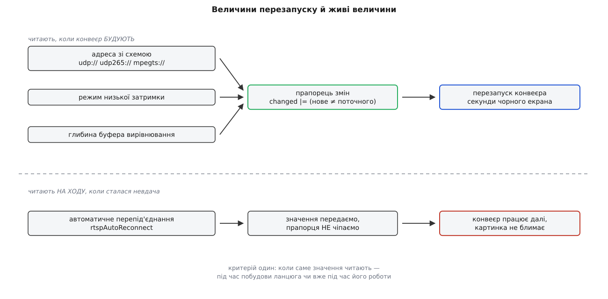
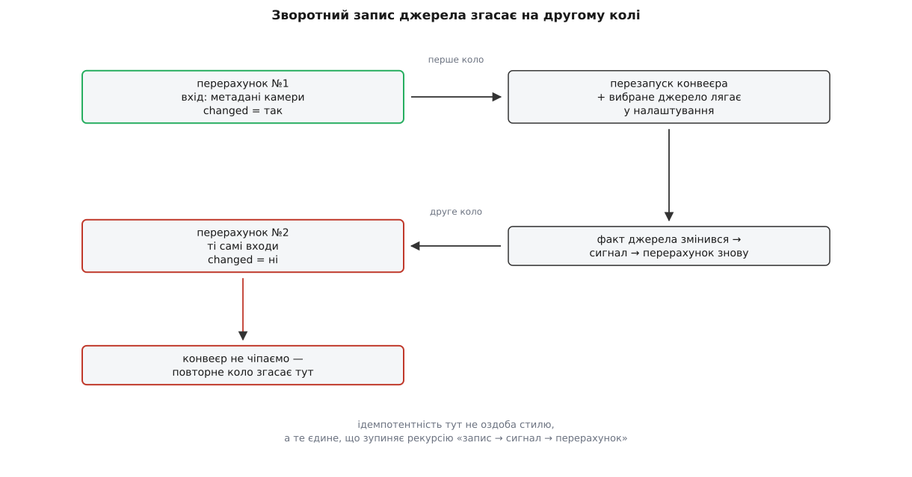

# ⚙️ Розв'язання джерела крок за кроком: чиста функція, прапорець змін і сім перевірок

Вирішити, звідки брати відео, — це два десятки умов, які в застосунку намертво вросли в об'єкт із фактами налаштувань, живим приймачем і сигналами. Тут ті самі умови витягнено в окрему програму без жодної залежності: вона збирається однією командою, не відкриває сокетів, не потребує ані апарата, ані вікна — і за мить проганяє всі складні випадки, на яких ця логіка зазвичай ламається мовчки.

## Задача

Написати самостійну програму, яка робить рівно те, що робить розв'язання джерела в станції:

1. з налаштувань (тип джерела плюс поле адреси) **або** з метаданих камери будує один рядок-адресу;
2. каже, чи це така зміна, заради якої варто перебудовувати конвеєр;
3. відділяє величини, що вимагають перезапуску, від тих, які досить присвоїти на ходу;
4. записує продиктований апаратом вибір назад у налаштування;
5. відповідає на попереднє питання — чи є взагалі що вмикати.

І щоб усе це перевірялося без мережі, без апарата й без графічного інтерфейсу.

## Ідея: рішення окремо від дії

У застосунку ця робота зроблена одним махом. Функція читає факти налаштувань, дивиться в приймач, присвоює йому нову адресу, дописує вибране джерело назад у налаштування й наприкінці смикає перезапуск. Перевірити її неможливо — не тому, що вона погано написана, а тому, що **відповіді вона не повертає**: уся відповідь розчинена в побічних діях.

Розділити її допомагає одне спостереження. Поточна адреса в приймача виглядає як прихований стан, до якого треба лізти, — але насправді це звичайний **вхід**. Функція його лише читає, щоб порівняти. Щойно ми це визнали, деклараційна частина стає [чистою функцією](topic:programming/pure-functions-side-effects) трьох аргументів — «налаштування, метадані камери, теперішній стан приймача», — а виконавча частина зіщулюється до п'яти рядків, які видно оком цілком.

Друге, що мусить пережити цей розділ: результатом є не адреса, а **пара** — адреса плюс «чи щось змінилося». Сама лише адреса не каже нічого про те, чи треба платити за перезапуск, а перезапуск коштує секунди чорного екрана. Прапорець змін тут — не оптимізація, а головна вихідна величина; адресу без нього нема куди подіти.

> 🔧 **Навіщо це.** Прийом переноситься на будь-яку похідну величину, яку доводиться тримати узгодженою: винесіть «обчислити бажаний стан» окремо від «привести систему до нього», а поточний стан системи подайте на вхід обчисленню. Тоді дороге приведення викликається лише за фактом розбіжності, і кожна гілка рішення перевіряється парою рядків замість піднятого стенда.

## Код

Один файл, стандартна бібліотека C++17, жодних залежностей.

```cpp
// збірка: g++ -std=c++17 -Wall -Wextra source_resolution.cpp -o srcres && ./srcres
#include <cstdio>
#include <optional>
#include <string>

// ─── ВХОДИ ────────────────────────────────────────────────────────────────

// У застосунку джерело — рядок у факті налаштувань («UDP h.264 Video Stream»
// і подібні). Тут перелік: логіка від написання рядків не залежить.
enum class Source { NoVideo, UdpH264, UdpH265, MpegTs, Rtsp, Tcp };

struct Settings {
    Source      source        = Source::NoVideo;
    std::string udpUrl        = "0.0.0.0:5600";  // мережева частина для UDP і MPEG-TS
    std::string rtspUrl;
    std::string tcpUrl;
    bool        streamEnabled = true;            // «показувати відео» взагалі
    bool        lowLatency    = false;           // режим низької затримки
    int         rtpJitterMs   = 200;             // глибина буфера вирівнювання
    bool        autoReconnect = true;            // перепід'єднуватися після невдачі
};

// Те, що приїхало в VIDEO_STREAM_INFORMATION від камери на борту.
enum class StreamType { Rtsp, RtpUdp, TcpMpeg, MpegTs };
enum class Encoding   { Unknown, H264, H265 };

struct StreamInfo {
    StreamType  type     = StreamType::RtpUdp;
    Encoding    encoding = Encoding::H264;
    std::string uri;      // повна адреса АБО самий номер порту — дозволено обидва
};

// Те, що зараз стоїть у приймача. Не прихований стан, а такий самий вхід.
struct ReceiverState {
    std::optional<std::string> uri;      // порожній optional = ще нічого не призначали
    bool lowLatency    = false;
    int  rtpJitterMs   = 0;
    bool autoReconnect = false;
};

// ─── ВИХІД ────────────────────────────────────────────────────────────────

struct Decision {
    std::string uri;                        // що має стояти в приймача
    bool        lowLatency    = false;
    int         rtpJitterMs   = 0;
    bool        autoReconnect = false;
    bool        hasVideo      = false;      // увімкнено І налаштовано
    bool        changed       = false;      // щось із того, що йде в конвеєр, стало іншим
    std::optional<Source> writeBackSource;  // джерело, продиктоване апаратом
};

enum class Action { Nothing, Restart, Stop };

// ─── ДОПОМІЖНЕ ────────────────────────────────────────────────────────────

static bool isAllDigits(const std::string &s)
{
    if (s.empty()) return false;
    for (char c : s) {
        if (c < '0' || c > '9') return false;
    }
    return true;
}

// «5600» → «udp://0.0.0.0:5600»; повну адресу лишаємо як є.
static std::string withScheme(const std::string &scheme, const std::string &raw)
{
    if (raw.find("://") != std::string::npos) return raw;
    if (isAllDigits(raw))  return scheme + "://0.0.0.0:" + raw;  // самий порт
    return scheme + "://" + raw;                                 // «хост:порт» без схеми
}

// Чи справді нова адреса інша. Порожній optional означає «ще не призначали»,
// і це НЕ те саме, що призначена порожня адреса.
static bool uriDiffers(const ReceiverState &rx, const std::string &uri)
{
    return !(rx.uri.has_value() && *rx.uri == uri);
}

// Чи є взагалі що вмикати: у кожного типу джерела своє поле адреси.
static bool configured(const Settings &st, const std::optional<StreamInfo> &info)
{
    if (info.has_value()) return true;         // апарат сказав сам — налаштовано
    switch (st.source) {
    case Source::UdpH264:
    case Source::UdpH265:
    case Source::MpegTs:  return !st.udpUrl.empty();
    case Source::Rtsp:    return !st.rtspUrl.empty();
    case Source::Tcp:     return !st.tcpUrl.empty();
    case Source::NoVideo: return false;
    }
    return false;
}

// ─── РІШЕННЯ: чиста функція ───────────────────────────────────────────────

static Decision resolve(const Settings &st,
                        const std::optional<StreamInfo> &info,
                        const ReceiverState &rx)
{
    Decision d;
    d.lowLatency    = st.lowLatency;
    d.rtpJitterMs   = st.rtpJitterMs;
    d.autoReconnect = st.autoReconnect;

    if (info.has_value()) {
        // Апарат диктує: тип потоку з протоколу стає джерелом застосунку.
        switch (info->type) {
        case StreamType::Rtsp:
            d.writeBackSource = Source::Rtsp;
            d.uri = info->uri;                         // RTSP приходить повною адресою
            break;
        case StreamType::RtpUdp:
            if (info->encoding == Encoding::H265) {
                d.writeBackSource = Source::UdpH265;
                d.uri = withScheme("udp265", info->uri);
            } else {
                d.writeBackSource = Source::UdpH264;
                d.uri = withScheme("udp", info->uri);
            }
            break;
        case StreamType::MpegTs:
            d.writeBackSource = Source::MpegTs;
            d.uri = withScheme("mpegts", info->uri);
            break;
        case StreamType::TcpMpeg:
            d.writeBackSource = Source::Tcp;
            d.uri = withScheme("tcp", info->uri);
            break;
        }
    } else {
        // Ручний вибір: тип вирішує, яку схему приклеїти до поля адреси.
        switch (st.source) {
        case Source::UdpH264: d.uri = "udp://"    + st.udpUrl;  break;
        case Source::UdpH265: d.uri = "udp265://" + st.udpUrl;  break;
        case Source::MpegTs:  d.uri = "mpegts://" + st.udpUrl;  break;
        case Source::Rtsp:    d.uri = st.rtspUrl;               break;
        case Source::Tcp:     d.uri = "tcp://"    + st.tcpUrl;  break;
        case Source::NoVideo: d.uri.clear();                    break;
        }
    }

    d.hasVideo = st.streamEnabled && configured(st, info);

    // Накопичення прапорця. КОЖЕН крок мусить відпрацювати — звідси |=, не ||.
    d.changed |= uriDiffers(rx, d.uri);
    d.changed |= (st.lowLatency  != rx.lowLatency);
    d.changed |= (st.rtpJitterMs != rx.rtpJitterMs);
    // autoReconnect свідомо НЕ тут: його читають на ходу.

    return d;
}

// ─── ДІЯ: усе, що псує стан, зібрано в одному місці ───────────────────────

static Action apply(const Decision &d, ReceiverState &rx, Settings &st)
{
    rx.autoReconnect = d.autoReconnect;          // жива величина — щоразу, без наслідків

    if (d.writeBackSource.has_value()) {
        st.source = *d.writeBackSource;          // вибір апарата стає вибором у налаштуваннях
    }
    if (!d.changed) {
        return Action::Nothing;                  // конвеєр не чіпаємо
    }

    rx.uri         = d.uri;
    rx.lowLatency  = d.lowLatency;
    rx.rtpJitterMs = d.rtpJitterMs;
    return d.hasVideo ? Action::Restart : Action::Stop;
}
```

Двісті рядків разом із перевірками, які наведено нижче, — і це вся політика вибору джерела. Далі варті розбору чотири місця; у трьох із них ховаються помилки, яких не видно ні очима, ні тестами.

## Чому `|=`, а не `||`

Кроків накопичення тут три, у застосунку їх більше — до них додаються локальна USB-камера й автоматичне джерело. Спокуса написати `d.changed = uriDiffers(...) || lowLatencyDiffers(...) || ...` виглядає природною: адже нас цікавить саме «або».

Логічне «або» в C++ обчислюється **скорочено**: щойно перший операнд істинний, решта не обчислюється взагалі. Доки всі кроки — чисті порівняння, як у коді вище, різниці немає. Але в застосунку кожен крок не лише порівнює, а й **присвоює** приймачеві нове значення: `settingsChanged |= _updateVideoUri(receiver, uri)` водночас вирішує й записує. Із `||` перший же змінений крок обірве ланцюг, і решта присвоєнь просто не станеться: адреса оновиться, а глибина буфера — ні, причому мовчки й лише в тих прогонах, де адреса змінилася першою. Помилка, яка проявляється в кожному другому запуску й ніколи не проявляється в дебагері.

Побітове «або» з присвоєнням такого права не має: обидва операнди обчислюються завжди. На `bool` воно поводиться точно як логічне — значення лише 0 і 1, тому побітове й логічне «або» дають те саме число, — але без скорочення.

```
false |= false → false        обидва виклики відбулися
false |= true  → true         обидва виклики відбулися
true  |= false → true         обидва виклики відбулися

false || true  → true         ← правий операнд обчислено
true  || <···> → true         ← правий операнд НЕ обчислено
```

Рівноцінна за змістом форма — `changed = крок() || changed`, зі старим значенням праворуч: тоді виклик стоїть ліворуч і виконується завжди. Вона довша й розсипається, щойно хтось переставить операнди «для читабельності». `|=` не розсипається ніколи, і саме тому цей ідіом живе в чужому коді, який ви читатимете.

## Порт замість адреси

Гілка `withScheme` виглядає як латка на неохайну камеру, але вона написана точно за стандартом. Поле `uri` в повідомленні `VIDEO_STREAM_INFORMATION` описане так: адреса потоку (TCP або RTSP), до якої станція має під'єднатися, **або** номер порту, який станція має слухати. Довжина поля — 160 байтів. Тобто «5600» — не помилка виробника, а один із двох дозволених варіантів, і приймати треба обидва ([протоколи камери й підвісу MAVLink](topic:communications/mavlink-camera-gimbal)).

Причина такої вилки в природі транспортів. RTSP і TCP — це з'єднання, які **ініціює земля**, тож їй потрібна повна адреса співрозмовника. Голий потік поверх UDP земля не ініціює ніяк: камера жене пакети сама, а станція лише сідає на порт і слухає ([TCP і UDP](topic:communications/tcp-vs-udp)). Хоста в цьому випадку станція обирає собі сама — `0.0.0.0`, «на всіх інтерфейсах», — бо це її власний бік, а не чужий.

Застосунок перевіряє наявність схеми пошуком підрядка: `uri.contains("udp://")`. Код вище перевіряє інакше — шукає `://` будь-де й окремо ловить випадок «самі цифри». Різниця має ціну на третьому варіанті, який стандарт не передбачає, а життя приносить: камера кладе в поле `192.168.1.30:5600` — хост із портом, але без схеми. Пошук `udp://` не спрацює, і застосунок побудує `udp://0.0.0.0:192.168.1.30:5600` — рядок, який не відкриється ніколи, з повідомленням про биту адресу замість зрозумілого «камера прислала дивне». Перевірка `isAllDigits` цю пастку прибирає: не самі цифри — значить, хост уже названо, приклеюємо саму лише схему.

## Що вимагає перезапуску, а що ні

Три величини в коді підвищують прапорець змін, четверта — ні, і це не недогляд.



*Критерій один і той самий для будь-якого нового налаштування: коли саме значення читають.*

Адреса, режим низької затримки й глибина буфера вирівнювання потрапляють у [конвеєр](topic:media-vision/pipeline-model) тоді, коли його **будують**: із них випливає набір елементів, їхні властивості й зв'язки. Змінити їх у зібраному ланцюгу не можна — ланцюг треба розібрати й скласти наново.

Автоматичне перепід'єднання нічого в ланцюгу не визначає. Це відповідь на питання «а що робити, коли не вийшло», і читають її щоразу, коли не виходить. Присвоїти її живому приймачеві безпечно й достатньо. Понад те, перезапуск тут був би прямою шкодою: вимкнути перепід'єднання найчастіше хочуть саме тоді, коли приймач зараз висить у паузі перед черговою спробою, — а перезапуск у цю мить запустив би ще одну спробу, тобто зробив би точно протилежне до просимого.

Звідси правило для будь-якого власного налаштування підсистеми: **величину читають під час побудови — заводьте в накопичення прапорця; читають на ходу — присвоюйте й прапорця не чіпайте**. Помилка в цьому виборі не падає й не ловиться тестами: обидва варіанти працюють, просто один із них гасить картинку на кожен рух повзунка.

## Перевірки

Тепер найкорисніше — набір випадків, на яких ця логіка ламається в чужому коді. Усе, що потрібно для перевірки, — три структури на стеку.

```cpp
// ─── ПЕРЕВІРКИ ────────────────────────────────────────────────────────────
static int failures = 0;
#define CHECK(cond) do { if (!(cond)) { ++failures; \
    std::printf("  ✗ %s (рядок %d)\n", #cond, __LINE__); } } while (0)

// 1. Повторний виклик із тими самими входами не змінює нічого.
static void test_idempotent()
{
    Settings st;
    st.source = Source::UdpH264;
    st.udpUrl = "0.0.0.0:5600";
    ReceiverState rx;                                  // приймач іще порожній

    const Decision first = resolve(st, std::nullopt, rx);
    CHECK(first.uri == "udp://0.0.0.0:5600");
    CHECK(first.changed);
    CHECK(apply(first, rx, st) == Action::Restart);

    const Decision again = resolve(st, std::nullopt, rx);
    CHECK(again.uri == first.uri);
    CHECK(!again.changed);                             // ← ціна перезапуску не платиться
    CHECK(apply(again, rx, st) == Action::Nothing);
}

// 2. Періодичне повідомлення камери не веде до перезапуску.
static void test_camera_repeats()
{
    Settings st;                                       // джерело ще «немає відео»
    ReceiverState rx;
    const StreamInfo info{StreamType::RtpUdp, Encoding::H264, "5600"};

    const Decision first = resolve(st, info, rx);
    CHECK(first.uri == "udp://0.0.0.0:5600");          // самий порт добудовано
    CHECK(first.writeBackSource == Source::UdpH264);
    CHECK(apply(first, rx, st) == Action::Restart);
    CHECK(st.source == Source::UdpH264);               // вибір апарата ліг у налаштування

    for (int i = 0; i < 10; ++i) {                     // камера повторює те саме
        const Decision echo = resolve(st, info, rx);
        CHECK(!echo.changed);
        CHECK(apply(echo, rx, st) == Action::Nothing);
    }
}

// 3. Порожнє поле адреси дає «не налаштовано».
static void test_empty_field()
{
    Settings st;
    st.source  = Source::Rtsp;
    st.rtspUrl = "";
    ReceiverState rx;

    const Decision blank = resolve(st, std::nullopt, rx);
    CHECK(!blank.hasVideo);
    CHECK(apply(blank, rx, st) == Action::Stop);       // зупинити, а не запускати

    st.rtspUrl = "rtsp://192.168.0.10:8554/H264Video";
    const Decision filled = resolve(st, std::nullopt, rx);
    CHECK(filled.hasVideo);
    CHECK(apply(filled, rx, st) == Action::Restart);
}

// 4. Жива величина доходить до приймача, але перезапуску не спричиняє.
static void test_live_setting()
{
    Settings st;
    st.source  = Source::Rtsp;
    st.rtspUrl = "rtsp://10.0.0.7:8554/live";
    ReceiverState rx;
    apply(resolve(st, std::nullopt, rx), rx, st);
    CHECK(rx.autoReconnect);

    st.autoReconnect = false;                          // користувач зняв галочку
    const Decision d = resolve(st, std::nullopt, rx);
    CHECK(!d.changed);
    CHECK(apply(d, rx, st) == Action::Nothing);
    CHECK(!rx.autoReconnect);                          // значення все одно дійшло

    st.lowLatency = true;                              // а це вже в конвеєр
    const Decision hard = resolve(st, std::nullopt, rx);
    CHECK(hard.changed);
    CHECK(apply(hard, rx, st) == Action::Restart);
}

// 5. Апарат сильніший за людину; той самий порт з іншим кодеком — інший потік.
static void test_priority_and_scheme()
{
    Settings st;
    st.source  = Source::Rtsp;
    st.rtspUrl = "rtsp://ручна.адреса/live";
    ReceiverState rx;
    const StreamInfo info{StreamType::Rtsp, Encoding::H264, "rtsp://10.0.0.7:8554/live"};
    CHECK(resolve(st, info, rx).uri == "rtsp://10.0.0.7:8554/live");

    Settings us;
    us.source = Source::UdpH264;
    us.udpUrl = "0.0.0.0:5600";
    ReceiverState ur;
    apply(resolve(us, std::nullopt, ur), ur, us);
    us.source = Source::UdpH265;                       // та сама адреса, інший кодек
    const Decision d = resolve(us, std::nullopt, ur);
    CHECK(d.uri == "udp265://0.0.0.0:5600");
    CHECK(d.changed);                                  // ← схема несе тип, тому зміну видно
}

int main()
{
    test_idempotent();
    test_camera_repeats();
    test_empty_field();
    test_live_setting();
    test_priority_and_scheme();

    if (failures > 0) {
        std::printf("провалено перевірок: %d\n", failures);
        return 1;
    }
    std::printf("усі перевірки пройдено\n");
    return 0;
}
```

П'ята перевірка показує вигоду, заради якої тип джерела взагалі зашито в схему адреси. Мережева частина не змінилася ні на символ, змінився лише кодек, — і одне порівняння рядків це вловило. Якби тип їхав окремим полем, довелося б порівнювати ще і його, а з кожним новим типом джерела — ще одне поле.

## Чому зворотний запис не зациклюється

Найтонше місце всієї конструкції видно лише тоді, коли згадати, звідки береться другий виклик у перевірці номер два.

Запис `st.source = *d.writeBackSource` в застосунку — не присвоєння полю, а запис у [факт налаштувань](topic:qgroundcontrol/fact-system). Факт випускає сигнал «значення змінилося», на цей сигнал підписано той самий перерахунок, — отже, розв'язання джерела **само себе кличе вдруге**. Обірвати цю петлю прапорцем «я зараз усередині» можна, але тоді доведеться питати, чи вона однониткова і що робити з вкладеністю.

Обривати нічого не треба. Друге коло приходить із тими самими входами, порівняння адреси відповідає «те саме», прапорець лишається хибним — і виконавча частина зупиняється на `return Action::Nothing`, не викликавши нічого. Рекурсія завглибшки два кола, кінець.



*Ідемпотентність тут не оздоба стилю, а те єдине, що зупиняє рекурсію.*

Це й є практичне значення слова «[ідемпотентний](topic:programming/idempotency)» для такого коду. Не «викликати зайвий раз не шкодить» — а «зайвий виклик **сам себе гасить**», тому побічний ефект усередині обчислення дозволено. Зламайте порівняння адрес — приберіть `uriDiffers` або зробіть його завжди істинним — і застосунок увійде в нескінченну взаємну рекурсію «запис → сигнал → перерахунок → запис», причому не одразу, а рівно тоді, коли на борту з'явиться камера з метаданими.

Другий бік того самого запису — тепловий приймач. Він теж проходить розв'язання джерела, теж отримує свою адресу з метаданих, але у зворотному записі участи не бере: інакше адреса теплового потоку перетерла б у налаштуваннях вибір основного. У коді вище цієї гілки нема, бо приймач один; у застосунку вона має вигляд перевірки «якщо це не тепловий».

## Скільки це коштує

Одне коло розв'язання — це кілька порівнянь чисел, одне складання рядка на кілька десятків байтів і одне порівняння рядків такої самої довжини. Виділень пам'яті — одне-два, тривалість — одиниці мікросекунд. Кликати його можна скільки завгодно.

І це головна цифра, бо вона дає порівняння з ціною помилки. Камера надсилає стан свого потоку приблизно раз на секунду, апарат може бути не один, перемикань джерела за політ буває десяток. Кожен із цих приводів проходить крізь розв'язання. Перезапуск конвеєра коштує від часток секунди до кількох секунд — розібрати ланцюг, під'єднатися наново, дочекатися опорного кадру. Отже, порівняння за мікросекунду рятує секунду чорного екрана щоразу, коли відповідь «нічого не змінилося», і таких разів переважна більшість. Відношення цін — приблизно мільйон до одного:

```
одне коло розв'язання      ≈ 2 мкс
один перезапуск конвеєра   ≈ 2 с
відношення                 ≈ 10⁶

повідомлення камери         1 Гц × 2 потоки = 2 виклики/с
без порівняння              2 перезапуски/с → картинки нема ніколи
```

Нижній рядок і є справжня причина, чому порівняння стоїть саме там, де стоїть.

## Де воно ламається

**Скорочене «або» в накопиченні.** Розібрано вище; ознака — частина налаштувань доїжджає до приймача через раз, залежно від того, яке з них змінилося першим.

**Втрачена різниця між «ще не призначали» й «призначили порожнє».** У коді вище це `std::optional`, у застосунку — окрема перевірка на «порожній» рядок поруч із порівнянням. Якщо звести обидва стани до порожнього рядка, перша ж адреса, обчислена як порожня, буде визнана «незміненою», і приймач лишиться без початкового призначення. Наслідок помітний не одразу: усе працює, доки перше обчислення дає щось непорожнє.

**Жива величина, позначена як така, що вимагає перезапуску.** Не падає, не ловиться тестами, працює. Просто кожен рух повзунка гасить картинку на дві секунди, і причину цього шукають місяцями в конвеєрі.

**Перерахунок, який не гасить сам себе.** Будь-яка гілка, що повертає «змінилося» на незмінних входах, обертає зворотний запис на нескінченну рекурсію. Тому перевірка «двічі поспіль із тими самими входами» мусить бути в наборі першою, а не останньою: вона стереже не оптимізацію, а живучість ([модульний тест](topic:programming/unit-testing)).

**Тиха підміна ручного вибору.** Оператор задав адресу руками, підняв апарат — і побачив у налаштуваннях чуже значення. Це не помилка коду, а свідоме рішення, але воно мусить бути видним: доки метадані камери надходять, поле вибору джерела треба вимикати з поясненням, інакше користувач вважатиме, що налаштування псуються самі. Пережити перезапуск станції такий запис теж переживе — він лягає в той самий файл, що й решта [збережених налаштувань](topic:qgroundcontrol/settings-persistence).

**Метадані, що зникли.** Апарат від'єднався — метаданих більше нема, і розв'язання повертається до ручних полів. Якщо їх перед тим перезаписав сам апарат, повернення дасть ту саму адресу, що й була, тобто нічого не зміниться й потік ітиме в нікуди. У коді вище це видно як `info == std::nullopt` із застарілим `st.source`; лікується не тут, а вище — скиданням метаданих і перерахунком на зміну активного апарата.
