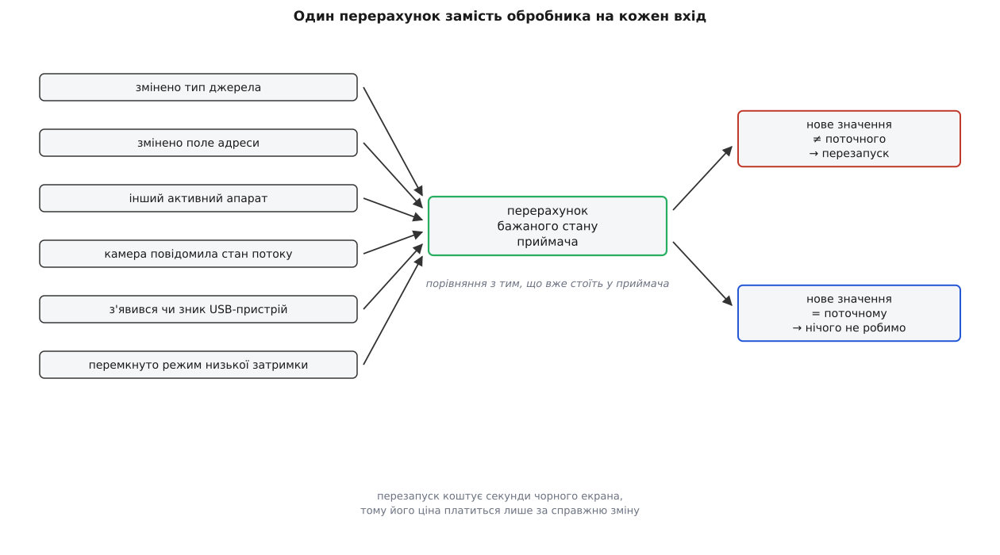
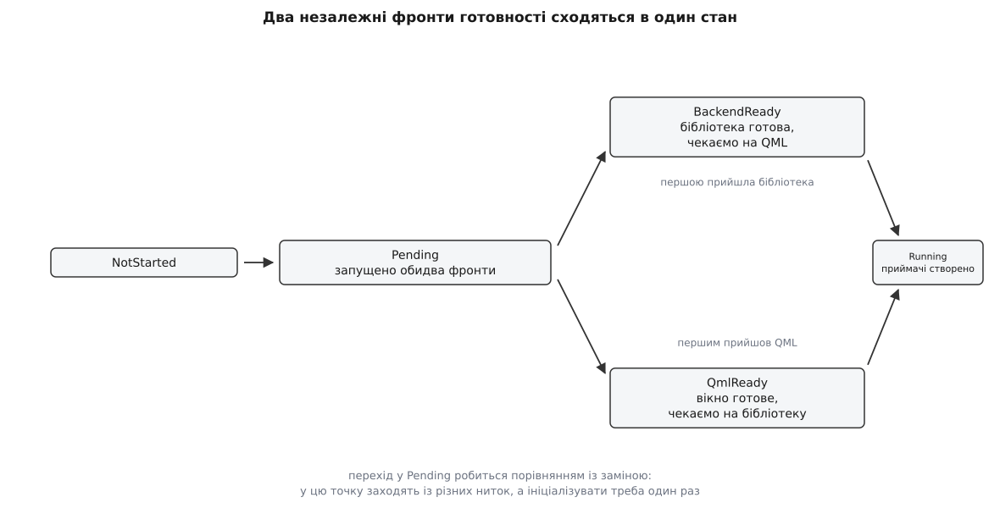
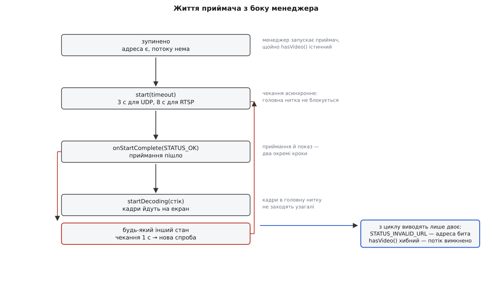

# Відеопідсистема: джерела, керування, запис

<preknowlist>
- [Передача відео](book:communications/video-transmission) — чим потік стисненого відео відрізняється від потоку чисел і чому він однобічний.
- [RTP і RTCP](book:communications/rtp-rtcp) — як шматки закодованого кадру їдуть окремими пакетами поверх UDP і що з ними стається при втратах.
- [RTSP і SDP](book:communications/rtsp-sdp) — окремий канал керування сеансом: клієнт питає опис потоку й просить його почати.
- [Протоколи камери й підвісу MAVLink](book:communications/mavlink-camera-gimbal) — повідомлення `VIDEO_STREAM_INFORMATION`, яким камера сама повідомляє свою адресу, тип і роздільність.
- [FactSystem](book:qgroundcontrol/fact-system) — налаштування в застосунку живуть як факти: значення з метаданими й сигналом зміни.
- [Vehicle: модель апарата](book:qgroundcontrol/vehicle-object) — що таке активний апарат і звідки в застосунку беруться його підсистеми.
- [Модель потоків](book:qgroundcontrol/threading-model) — правило «нитка володіє ресурсом» і чому кадри навмисно не заходять у головну нитку.
- [Конвеєр GStreamer](book:media-vision/pipeline-model) — ланцюг елементів, який приймає байти з мережі й видає декодовані кадри.
</preknowlist>

Телеметрію станція бере сама. Вона відкриває порт, вона надсилає запит на потік, вона знає, коли з'єднання відкрито й коли розірвано, — з боку станції це активна дія з передбачуваним початком.

З відео все навпаки. Станція нічого не відкриває: десь на борту працює кодувальник, який жене пакети на якусь адресу, і найкраще, що земля може зробити, — сісти на цю адресу й слухати. Ані «під'єднатися», ані «спитати», ані «дізнатися, чи все гаразд» тут здебільшого нема до кого: [потік поверх UDP](book:communications/tcp-vs-udp) не має ані рукостискання, ані розриву. Якщо картинка зникла, з боку сокета це виглядає точно так само, як якби її ніколи й не було.

З цієї однієї відмінности виростає вся підсистема. Раз станція не володіє джерелом, вона мусить його **вгадати**: узяти адресу або від людини в налаштуваннях, або від самого апарата, який про свою камеру розповів, або від локального пристрою, увімкненого в USB. Раз адреса може змінитися посеред польоту — коли оператор перемкнув апарат, коли камера повідомила новий потік, коли користувач виправив порт, — то це не одноразове рішення на старті, а величина, яку доводиться перераховувати. І раз ніхто не повідомить про поломку, життям потоку теж треба керувати ззовні: пробувати, чекати, і знову пробувати.

## Політика й механіка

Дві згадані роботи — «вирішити, що дивитися» і «зробити так, щоб це показувалося» — не мають нічого спільного за природою. Перша складається з налаштувань, метаданих, порівнянь і сигналів; друга — з мережевих сокетів, розбирачів формату, декодувальників і пам'яті графічного процесора. Тому вони й розділені на два об'єкти.

`VideoManager` — це політика. Він знає, які є джерела, звідки береться адреса, коли потік дозволено вмикати, куди складати файли й що показувати в інтерфейсі. Кадру він не бачить жодного.

`VideoReceiver` — це механіка. Він отримує рядок-адресу й накази «почни», «спинися», «декодуй у цей стік», «пиши у цей файл», а назад віддає лише повідомлення про стан. Це чистий інтерфейс: усі його робочі методи — абстрактні.

```cpp
virtual void start(uint32_t timeout) = 0;
virtual void stop() = 0;
virtual void startDecoding(VideoSinkHandle sink) = 0;
virtual void stopDecoding() = 0;
virtual void startRecording(const QString &videoFile, FILE_FORMAT format) = 0;
virtual void stopRecording() = 0;
virtual void takeScreenshot(const QString &imageFile) = 0;
```

Абстрактність тут не данина стилю, а вимога життя: реалізацій справді кілька. Основна стоїть на GStreamer, поруч є полегшена на Qt Multimedia (для збірок без GStreamer) і безекранна для тестів, а [вендорські форки](book:qgroundcontrol/project-and-forks) підставляють власну через [плагін ядра](book:qgroundcontrol/core-plugin) — приймачі створює не менеджер сам, а фабричний метод плагіна:

```cpp
VideoReceiver *receiver = QGCCorePlugin::instance()->createVideoReceiver(this);
```

Те, як усередині приймача байти з мережі стають кадром на екрані, — окрема справа [відеотракту](book:qgroundcontrol/video-pipeline); менеджер про неї не знає нічого, крім того, чи вона вдалася.

> Повний перелік того, що підсистема віддає назовні — властивості для QML, виклики з інтерфейсу, сигнали й факти налаштувань із типами й типовими значеннями, — зібрано в [контракті відеопідсистеми](book:qgroundcontrol/video-manager/api-videomanager.md). Це довідкова частина: підключаючи власний елемент інтерфейсу чи власний приймач, звіряються саме з нею.

## Звідки береться адреса

Вибір джерела в станції має вигляд простого списку: «RTSP», «UDP h.264», «UDP h.265», «TCP-MPEG2», «MPEG-TS», кілька готових апаратів на кшталт Herelink чи Parrot Discovery, плюс усі USB-камери, які система знайшла в цю мить. Насправді ці пункти неоднорідні, і різниця між ними — головна річ, яку варто зрозуміти в підсистемі.

Перші п'ять — це **правила побудови адреси**. Користувач окремо задає мережеву частину (поле «UDP URL», типове значення `0.0.0.0:5600`), а тип джерела вирішує, яку схему до неї приклеїти:

```cpp
const QString source = _videoSettings->videoSource()->rawValue().toString();
if (source == VideoSettings::videoSourceUDPH264) {
    settingsChanged |= _updateVideoUri(receiver, QStringLiteral("udp://%1").arg(_videoSettings->udpUrl()->rawValue().toString()));
} else if (source == VideoSettings::videoSourceUDPH265) {
    settingsChanged |= _updateVideoUri(receiver, QStringLiteral("udp265://%1").arg(_videoSettings->udpUrl()->rawValue().toString()));
} else if (source == VideoSettings::videoSourceMPEGTS) {
    settingsChanged |= _updateVideoUri(receiver, QStringLiteral("mpegts://%1").arg(_videoSettings->udpUrl()->rawValue().toString()));
} else if (source == VideoSettings::videoSourceRTSP) {
    settingsChanged |= _updateVideoUri(receiver, _videoSettings->rtspUrl()->rawValue().toString());
}
```

Схеми `udp265://` і `mpegts://` не існують у жодному стандарті — це власна мова застосунку. Друга з них означає, що всередині UDP їде не голий RTP, а [транспортний потік MPEG](book:communications/mpeg-ts) — формат, у якому кадри вже нарізані на дрібні пакети зі своїми заголовками й таблицями, тож розбирати його треба інакше. Причина проста: чистий [RTP поверх UDP](book:communications/rtp-rtcp) не несе в собі опису того, що всередині. У RTSP клієнт спершу отримує опис сеансу й з нього дізнається кодек; у голому UDP-потоці такого опису нема, тому хтось мусить сказати приймачеві, як цей потік розбирати. Цим «кимось» є користувач, а схема адреси — спосіб передати його вибір далі одним рядком.

Готові апарати в тому самому списку — це той самий механізм із зашитою відповіддю. `Herelink AirUnit` перетворюється на `rtsp://192.168.0.10:8554/H264Video`, `3DR Solo` — на `udp://0.0.0.0:5600`. Ніякої окремої логіки за ними немає: це рядок-константа замість поля, яке довелося б заповнювати вручну й у якому легко помилитися.

Перш ніж щось запускати, менеджер питає, чи взагалі є що запускати. Дві умови розділені навмисно:

```cpp
bool VideoManager::hasVideo() const
{
    return (_videoSettings->streamEnabled()->rawValue().toBool() && _videoSettings->streamConfigured());
}
```

Перша — «увімкнено», прапорець, яким користувач вимикає відео, не втрачаючи налаштувань. Друга — «налаштовано», і вона перевіряє змістовно: у кожного типу джерела своє поле адреси, і воно має бути непорожнє — своє для UDP і MPEG-TS, своє для RTSP, своє для TCP. Це розділення видно і на екрані: доки потік вимкнено, на місці картинки напис «VIDEO DISABLED», а щойно ввімкнено, але кадрів ще нема — «WAITING FOR VIDEO». Одна й та сама чорнота на екрані означає дві різні речі, і застосунок їх називає різними словами.

## Коли адресу диктує апарат

Ручне налаштування — це чесна праця, яку хочеться прибрати. Якщо на борту стоїть камера, що говорить [протоколом камери MAVLink](book:communications/mavlink-camera-gimbal), вона сама повідомляє про свій потік повідомленням `VIDEO_STREAM_INFORMATION`: тип потоку, адресу або порт, кодування, роздільність, кут огляду, ознаку теплового каналу. Тоді питати користувача нема потреби.

Менеджер камер апарата загортає це повідомлення в об'єкт `QGCVideoStreamInfo` і віддає його менеджеру відео, а той перекладає поля протоколу у свою внутрішню мову:

```cpp
switch (pInfo->type()) {
case VIDEO_STREAM_TYPE_RTSP:
    source = VideoSettings::videoSourceRTSP;
    url = pInfo->uri();
    break;
case VIDEO_STREAM_TYPE_RTPUDP:
    if (pInfo->encoding() == VIDEO_STREAM_ENCODING_H265) {
        source = VideoSettings::videoSourceUDPH265;
        url = pInfo->uri().contains("udp265://") ? pInfo->uri() : QStringLiteral("udp265://0.0.0.0:%1").arg(pInfo->uri());
    } else {
        source = VideoSettings::videoSourceUDPH264;
        url = pInfo->uri().contains("udp://") ? pInfo->uri() : QStringLiteral("udp://0.0.0.0:%1").arg(pInfo->uri());
    }
    break;
```

Тернарний оператор усередині — не прикраса, а поступка реальності. Стандарт дозволяє камері покласти в поле адреси або повний рядок, або самий лише номер порту, і зустрічаються обидва варіанти. Станція приймає обидва: якщо схеми в рядку нема, вона добудовує її сама, підставляючи `0.0.0.0` — «слухати на всіх інтерфейсах».

Тут ховається важливий наслідок, який дивує тих, хто вперше побачив, як налаштування змінилися самі. Автоматичне налаштування не лежить збоку: воно **записує результат назад у налаштування**.

```cpp
if (settingsChanged) {
    if (!receiver->isThermal()) {
        _videoSettings->videoSource()->setRawValue(source);
    }
    emit autoStreamConfiguredChanged();
}
```

Отже, вибір джерела, зроблений апаратом, стає таким самим значенням факту, як і вибір, зроблений людиною, — і переживе перезапуск станції разом із рештою [налаштувань](book:qgroundcontrol/settings-persistence). Щоб цей запис не виглядав як самоуправство, сторінка налаштувань відео відстежує ознаку `autoStreamConfigured` і, поки та істинна, вимикає вибір джерела, пояснюючи: потік камери MAVLink налаштовується автоматично. Пріоритет тут абсолютний: доки апарат каже, звідки брати відео, ручні поля не діють.

## Локальна камера: гілка повз усю машинерію

Третє походження картинки взагалі не потік. USB-камера, увімкнена в ноутбук оператора, — це локальний пристрій, який операційна система вже вміє показувати; тягнути його кадри через мережевий приймач не треба й не можна.

Тому для такого джерела менеджер робить рівно одну річ — публікує ідентифікатор пристрою:

```cpp
if (!UVCReceiver::enabled() || !hasVideo() || isStreamSource()) {
    _uvcVideoSourceID = QString();
} else {
    _uvcVideoSourceID = UVCReceiver::getSourceId();
}
```

Далі все відбувається у QML: елемент інтерфейсу бачить непорожній ідентифікатор, знаходить за ним камеру серед пристроїв системи й малює її звичайним засобом Qt Multimedia. Жоден приймач у цьому не бере участи, жодна адреса не будується, запис і знімок ідуть іншим шляхом. Умова `!isStreamSource()` у коді вище й тримає ці два світи нарізно: щойно вибрано мережеве джерело, локальна гілка гаситься.

Єдине, що менеджер бере на себе додатково, — дозвіл. На сучасних системах доступ до камери треба запитати в користувача, і робиться це саме тут, у момент, коли пристрій уперше стає вибраним.


*Дві верхні гілки сходяться в один рядок-адресу для приймача; нижня взагалі минає приймач і віддає в інтерфейс лише ідентифікатор пристрою.*

## Перерахунок замість подій

Тепер видно повний перелік того, від чого залежить адреса: тип джерела, три поля адрес, наявність активного апарата, метадані його камери, набір локальних пристроїв. До цього додаються налаштування, які адреси не змінюють, але змінюють поведінку приймача: режим низької затримки, глибина буфера вирівнювання, автоматичне перепід'єднання.

Кожна з цих величин змінюється незалежно від інших і в непередбачуваний момент. Спокуса написати на кожну свій обробник — «змінився тип джерела: перебудуй адресу й перезапусти; змінилася адреса UDP: перебудуй адресу, але тільки якщо тип UDP; змінився апарат: скинь метадані, потім перебудуй адресу…» — веде в те саме болото, що й будь-яка спроба тримати похідну величину узгодженою вручну: кількість гілок росте як добуток входів на наслідки, і кожна нова умова вимагає перечитати всі попередні.

Станція йде іншим шляхом. Є **одна** функція, яка з усіх входів наново обчислює бажаний стан приймача, і **всі** сигнали ведуть до неї:

```cpp
connect(_videoSettings->videoSource(), &Fact::rawValueChanged, this, &VideoManager::_videoSourceChanged);
connect(_videoSettings->udpUrl(),      &Fact::rawValueChanged, this, &VideoManager::_videoSourceChanged);
connect(_videoSettings->rtspUrl(),     &Fact::rawValueChanged, this, &VideoManager::_videoSourceChanged);
connect(_videoSettings->tcpUrl(),      &Fact::rawValueChanged, this, &VideoManager::_videoSourceChanged);
connect(MultiVehicleManager::instance(), &MultiVehicleManager::activeVehicleChanged, this, &VideoManager::_setActiveVehicle);
connect(this, &VideoManager::autoStreamConfiguredChanged, this, &VideoManager::_videoSourceChanged);
```

Така функція мусить бути ідемпотентною (лат. *idem* — той самий, *potens* — здатний): скільки разів її не поклич з тими самими входами, результат один і той самий, і зайвий виклик нічого не псує. Тоді питання «чи треба її кликати саме зараз» зникає — кличемо завжди, коли є найменша підозра.

Але тоді з'являється інше питання, і воно вирішальне. Перезапустити конвеєр — дорого: розібрати ланцюг, під'єднатися наново, дочекатися першого опорного кадру. Це секунди чорного екрана. А приводів покликати перерахунок багато, і більшість із них нічого не змінює: камера періодично надсилає стан свого потоку, і кожне таке повідомлення оновлює об'єкт метаданих; оператор перемкнувся на другий апарат і повернувся; користувач відкрив налаштування й закрив, нічого не змінивши. Якби кожен виклик тягнув за собою перезапуск, картинка не з'явилася б ніколи.

Тому перерахунок не просто обчислює нову адресу, а **порівнює її з тією, що вже стоїть у приймача**:

```cpp
bool VideoManager::_updateVideoUri(VideoReceiver *receiver, const QString &uri)
{
    if ((uri == receiver->uri()) && !receiver->uri().isNull()) {
        return false;
    }
    receiver->setUri(uri);
    return true;
}
```

Кожен крок перерахунку повертає «чи я щось змінив», і всі відповіді збираються в один прапорець:

```cpp
settingsChanged |= _updateUVC(receiver);
settingsChanged |= _updateAutoStream(receiver);
```

Оператор `|=` тут стоїть замість `||` навмисно. Логічне «або» обірвало б обчислення на першому ж істинному значенні, і другий крок просто не виконався б; побітове «або» присвоєнням виконує обидва виклики завжди й лише збирає їхні відповіді. Кожен крок мусить відпрацювати — питання лише в тому, чи хтось із них справді щось змінив.

Уже після цього приймається рішення про перезапуск:

```cpp
if (changed) {
    if (hasVideo()) {
        _restartAllVideos();
    } else {
        stopVideo();
    }
}
```

І тут же видно межу правила. Одне налаштування свідомо з нього виламується — автоматичне перепід'єднання:

```cpp
const bool autoReconnect = _videoSettings->rtspAutoReconnect()->rawValue().toBool();
if (autoReconnect != receiver->autoReconnect()) {
    receiver->setAutoReconnect(autoReconnect);
    // No settingsChanged: autoReconnect is live, doesn't require pipeline restart.
}
```

Значення приймачеві передається, а прапорець змін — ні. Причина змістовна: цей перемикач впливає не на побудову конвеєра, а на поведінку приймача під час невдачі, і читається щоразу, коли невдача стається. Більше того, вимкнути його корисно саме тоді, коли приймач зараз висить у паузі перед черговою спробою, — а перезапуск у цю мить якраз усе зіпсував би. Отже, критерій розділення такий: якщо величина потрапляє в конвеєр під час його побудови — потрібен перезапуск; якщо її читають на ходу — досить присвоєння.



*Без порівняння кожне періодичне повідомлення камери про стан потоку означало б новий перезапуск — і чорний екран замість відео.*

> Той самий перерахунок, витягнений в окремий код, який можна запустити й перевірити без застосунку, — у [розв'язанні джерела крок за кроком](book:qgroundcontrol/video-manager/proj-source-resolution.md): чиста функція «налаштування плюс метадані камери → адреса», прапорець змін, і набір перевірок на всі складні випадки, зокрема на порт замість адреси й на періодичне повідомлення камери, яке не має нічого перезапускати.

> 🔧 **Навіщо це.** Додаючи в підсистему власне налаштування, спершу дайте собі відповідь, коли його читають. Якщо під час побудови конвеєра — заведіть його в перерахунок і поверніть із нього `true` при зміні: приймач перезапуститься сам, окремого коду для цього писати не треба. Якщо на ходу — передайте значення й **не** позначайте зміну, інакше кожен рух повзунка коштуватиме користувачеві секунди чорного екрана. Помилка в цьому виборі не проявиться в тестах: обидва варіанти працюють, просто один із них щоразу гасить картинку.

## Два приймачі й один головний

Тепловізор на борту — це другий потік з іншої матриці, з іншою роздільністю й іншим кутом огляду. Показувати його треба разом зі звичайним: то накладкою в кутку, то на весь екран, то напівпрозорим шаром поверх. Отже, приймачів має бути два, і вони мають працювати незалежно.

Створюються вони однаково — з того самого фабричного методу, за списком імен:

```cpp
static const QStringList videoStreamList = {
    "videoContent",
    "thermalVideo"
};
```

Ім'я тут — не підпис, а ідентичність, і воно виконує аж чотири роботи. Воно ж вирішує, який із приймачів тепловий:

```cpp
bool isThermal() const { return (_name == QStringLiteral("thermalVideo")); }
```

Воно ж служить ключем пошуку елемента інтерфейсу, воно ж стає частиною імени файлу запису, воно ж підписує рядки журналу. Побічний наслідок такої економії: перейменувати потік однією правкою неможливо — рядок доводиться міняти узгоджено у трьох місцях, зокрема у QML.

Незалежні приймачі, проте, не рівноправні. Назовні підсистема віддає **одну** ознаку «йде потік», **одну** «йде декодування», **одну** «йде запис» і **один** розмір кадру — бо інтерфейс питає про відео взагалі, а не про конкретний канал. Тому сигнали теплового приймача до цих величин не доходять:

```cpp
connect(receiver, &VideoReceiver::videoSizeChanged, this, [this, receiver](QSize size) {
    if (!receiver->isThermal()) {
        _videoSize = size;
        emit videoSizeChanged();
        emit aspectRatioChanged();
    }
});
```

Ця перевірка повторюється в кожному обробнику й читається як механічна, але за нею стоїть чітке рішення: **тепловий канал підпорядкований**. Він має власні властивості — своє співвідношення сторін і свій кут огляду, окремі від головних, — а от загальний стан підсистеми визначає лише основний потік. Практично це означає, що записом і показом керує основний канал: якщо він не пішов, тепловий сам по собі підсистему «живою» не зробить.

## Куди приходить кадр

Приймач має віддати декодований кадр у щось, що вміє його намалювати. Це «щось» — елемент інтерфейсу, і зв'язок між ними встановлюється в мить створення приймача, за іменем:

```cpp
QQuickItem *widget = window->findChild<QQuickItem*>(receiver->name());
if (!widget) {
    qCCritical(VideoManagerLog) << "stream widget not found" << receiver->name();
    _videoReceivers.removeOne(receiver);
    receiver->deleteLater();
    return;
}
```

З боку QML контракт виконується двома рядками — статично для основного потоку й уже після завантаження для теплового, який створюється відкладено:

```qml
objectName: "videoContent"
```

```qml
onLoaded: { if (item) item.objectName = "thermalVideo" }
```

Далі плагін ядра створює для цього елемента **стік** — об'єкт, у який конвеєр складатиме готові кадри, — і приймач отримує його як непрозорий покажчик. Непрозорий свідомо: для GStreamer це одне, для Qt Multimedia геть інше, а менеджеру знати різницю не треба й не варто.

Кадри після цього не мають до менеджера жодного стосунку. Вони йдуть з нитки конвеєра просто в стік і далі на графічний процесор, оминаючи головну нитку — інакше [дані відео роздавили б чергу подій](book:qgroundcontrol/threading-model). Менеджер лишається з тим, чим і почав: рядком-адресою, кількома прапорцями й правом сказати «почни» чи «спинися».

## Два фронти запуску

Створити приймачі одразу під час запуску застосунку неможливо, і не з однієї причини, а з двох незалежних.

Перша: приймачеві потрібен елемент інтерфейсу, а його ще нема — вікно QML тільки будується. Друга: бібліотеці конвеєра потрібна власна ініціалізація, і вона довга (розбір реєстру втулків, пошук декодувальників). Робити її в головній нитці означало б показати користувачеві завмерле вікно на старті, тому вона виконується окремо, у пулі, і завершується тоді, коли завершиться.

Дві незалежні події, кожна з яких може статися першою. Прапорцем «уже готово» тут не обійтися — потрібен стан, який пам'ятає, **кого саме ще чекаємо**:

```cpp
enum class InitState : uint8_t {
    NotStarted, Pending, BackendReady, QmlReady, Running, Failed
};
```

Читається це просто. `Pending` — запущено, не готовий ніхто. `BackendReady` — бібліотека готова, чекаємо на QML. `QmlReady` — QML готовий, чекаємо на бібліотеку. `Running` — зійшлися обидва, приймачі створено. Обробники обох подій симетричні: кожен дивиться, чи другий уже прийшов, і або переходить у стан очікування, або одразу створює приймачі.

```cpp
switch (_initState.load()) {
case InitState::Pending:
    _initState.store(InitState::QmlReady);
    return;
case InitState::BackendReady:
    _initState.store(InitState::Running);
    break;
```

Окремо стоїть перехід у `Pending`, і він зроблений порівнянням із заміною:

```cpp
InitState expected = InitState::NotStarted;
if (!_initState.compare_exchange_strong(expected, InitState::Pending)) {
    qCWarning(VideoManagerLog) << "video init already started";
    return;
}
```

Причина названа в самому коді: у цю точку заходять із різних ниток — з головної під час запуску та з чужої, коли комусь терміново знадобилося відео (скажімо, тестові збірки чекають на готовність синхронно). Проста перевірка «якщо ще не почато — почни» тут не рятує: між перевіркою й записом друга нитка встигає зробити те саме, і бібліотека ініціалізується двічі, а це вже не гонка з дивною поведінкою, а негайне падіння. Порівняння із заміною робить перевірку й запис однією неподільною дією, тож із будь-якої кількости охочих переможе рівно один.

Момент готовности QML теж не вгадується, а замовляється — застосунок просить вікно виконати завдання після найближчої фази синхронізації сцени й лише звідти повертається в головну нитку.



*Порядок подій не гарантований, тому станів чекання два — по одному на кожен можливий порядок.*

## Життя потоку: старт, тайм-аут, перезапуск

Приймач створено, адресу він має. Тепер найцікавіше: як керувати тим, що будь-якої миті може мовчки зникнути.

Запуск асинхронний і з тайм-аутом (англ. *time out* — вичерпаний час), причому час дається різний:

```cpp
const uint32_t timeout = ((source == VideoSettings::videoSourceRTSP) ? _videoSettings->rtspTimeout()->rawValue().toUInt() : 3);
```

Три секунди для UDP і вісім (типово) для RTSP — не примха. У голому UDP-потоці «запуск» означає лише відкрити сокет і дочекатися перших пакетів; якщо за три секунди не прийшло нічого, чекати далі здебільшого нема сенсу. RTSP же перед першим байтом медіа проводить справжній діалог: опис сеансу, узгодження транспорту, команда відтворення — і кожен крок може загальмувати на повільній лінії.

Відповідь приходить сигналом зі станом, і на успіх менеджер робить другий крок — вмикає декодування:

```cpp
case VideoReceiver::STATUS_OK:
    receiver->setStarted(true);
    if (receiver->sink()) {
        receiver->startDecoding(receiver->sink());
    }
    break;
```

Розділення «прийом» і «декодування» тут не формальність: приймати потік і показувати його — різні речі, і друга може бути вимкнена (наприклад, коли вікно з відео сховане), а перша при цьому мусить тривати, бо запис іде саме з прийнятого потоку.

На невдачу — пауза й нова спроба:

```cpp
default:
    // Rate limit restarts on start failure.
    QTimer::singleShot(1000, receiver, [this, receiver]() { _restartVideo(receiver); });
    break;
```

Секунда потрібна не приймачеві, а системі. Без неї невдалий запуск повертався б негайно, і застосунок увійшов би в щільний цикл спроб, який з'їдає нитку й засмічує журнал тисячами рядків за хвилину.

Два стани з цього правила виведено, і обидва — навмисно:

```cpp
case VideoReceiver::STATUS_INVALID_URL:
case VideoReceiver::STATUS_INVALID_STATE:
    break;
```

Битий рядок адреси повторними спробами не полагодиться: скільки не пробуй, він битий, і повторювати означає лише марно палити ресурси. Так само `STATUS_INVALID_STATE` каже, що наказ прийшов недоречно — приймач уже робить те, що в нього просять. Обидва стани чекають на **зовнішню** подію: на те, що людина виправить адресу, або що камера надішле іншу.

Симетрична річ діється на зупинці. Оскільки перезапуск влаштований як «спинися, а далі продовжимо», обробник завершення зупинки сам запускає приймач наново:

```cpp
receiver->setStarted(false);
if (status == VideoReceiver::STATUS_INVALID_URL) {
    qCDebug(VideoManagerLog) << "Invalid video URL. Not restarting";
} else {
    QTimer::singleShot(1000, receiver, [this, receiver]() { _startReceiver(receiver); });
}
```

Ось звідки береться поведінка, яку добре знають ті, хто налаштовував станцію з неправильним портом: у журналі раз на секунду з'являється пара рядків про зупинку й запуск, а на екрані незмінне «WAITING FOR VIDEO». Це не помилка — це система, яка чесно пробує далі, бо джерело може з'явитися будь-якої миті. Свідома зупинка теж проходить цим самим шляхом, тому «вимкнути відео» означає не «спинити приймач», а «зробити так, щоб `hasVideo()` став хибним»: інакше обробник завершення зупинки просто запустить усе наново.



*Цикл розривають лише дві речі: битий рядок адреси й вимкнений потік. Усе інше веде на нову спробу за секунду.*

## Запис: що вирішує менеджер

Запис у станції — не перекодування. Гілка запису відводиться від потоку **до** декодувальника, і у файл лягають ті самі стиснені кадри, що прийшли з ефіру; докладно ця розв'язка розібрана у [відеотракті](book:qgroundcontrol/video-pipeline). З цього випливають дві речі, важливі для розуміння. По-перше, запис коштує майже нічого: ані процесора, ані якости — файл є точною копією того, що передав апарат. По-друге, якість запису неможливо покращити з землі: усе, що втратив [кодек](book:communications/h264-hardware-codec) на борту, втрачено назавжди.

Менеджерові лишаються три рішення: як назвати файл, у якому контейнері його зберігати й куди подіти старі.

Ім'я збирається з мітки часу з точністю до секунди, а розрізняє потоки та сама рядкова ідентичність приймача:

```cpp
const QString videoFileNameTemplate = savePath + "/" + videoFileUrl + ".%1" + ext;
const QString streamName = (receiver->name() == QStringLiteral("videoContent")) ? "" : (receiver->name() + ".");
const QString videoFileName = videoFileNameTemplate.arg(streamName);
```

Основний потік дає `2026-08-02_14.31.07.mp4`, тепловий — `2026-08-02_14.31.07.thermalVideo.mp4`. Обидва файли з однією міткою часу, тож пара впізнається з першого погляду.

[Контейнер](book:communications/media-container) (лат. *contineo* — вміщати) — це оболонка, яка складає стиснені кадри у файл разом із таблицею їхніх зміщень і міток часу, щоб програвач умів перемотувати. Вибирають його зі списку `mp4`, `mov`, `mkv`, і тут причаїлася пастка для того, хто збиратиме власну версію станції. Список у налаштуваннях і всередині перелічені в різному порядку: у переліку `FILE_FORMAT` нуль — це `mkv`, у списку інтерфейсу першим стоїть `mp4` зі значенням 2. Зберігається саме **число переліку**, і саме ним індексуються таблиці розширень і мультиплексорів. Отже, переставити пункти в інтерфейсі можна, а перенумерувати — ні: чужі налаштування після такої правки почнуть означати інший формат.

Вибір контейнера тягне за собою давню проблему запису «наживо». `mp4` і `mov` тримають таблицю зміщень кадрів (той самий *moov*) в окремому блоці, який класично дописують у кінці, коли запис завершено; обрив живлення посеред польоту лишав такий файл непрогравним. Станція цю проблему не обходить, а лікує: мультиплексорові наказано писати службовий блок наперед і освіжати його раз на секунду.

```cpp
GstStructure *muxerProps = gst_structure_new("properties",
    "faststart", G_TYPE_BOOLEAN, TRUE,
    "reserved-moov-update-period", G_TYPE_UINT64, G_GUINT64_CONSTANT(1000000000),
    nullptr);
```

Ціна — втрата щонайбільше останньої секунди при раптовому обриві. Матроска (`mkv`) такого лікування не потребує: вона за побудовою потокова й читається з обірваного файлу як є.

## Скільки місця це з'їдає

Обмеження на сховище — не перестраховка, а необхідність, і найкраще це видно з арифметики.

**Політ на 25 хвилин, потік 1080p із бітрейтом 6 Мбіт/с, типова стеля для настільної збірки — 10240 МБ.**

```
за секунду      = 6 000 000 / 8            = 750 000 байтів  ≈ 0.75 МБ
за хвилину      = 0.75 × 60                = 45 МБ
за політ        = 45 × 25                  ≈ 1125 МБ ≈ 1.1 ГБ
польотів до стелі = 10240 / 1125           ≈ 9
```

Дев'ять польотів — і диск під зав'язку. На мобільній платформі, де стеля типово 2048 МБ, стелю виберуть менш ніж за два. Тому й існує прибирання, і воно теж просте до брутальности:

```cpp
uint64_t total = 0;
for (const QFileInfo &video : std::as_const(vidList)) {
    total += video.size();
}

const uint64_t maxSize = SettingsManager::instance()->videoSettings()->maxVideoSize()->rawValue().toUInt() * qPow(1024, 2);
while ((total >= maxSize) && !vidList.isEmpty()) {
    const QFileInfo info = vidList.takeLast();
    total -= info.size();
    (void) QFile::remove(info.filePath());
}
```

Список відсортовано за часом, тож `takeLast()` бере найстарший файл. І тут варто назвати межу чесно: прибирання відбувається **один раз, перед початком запису**, і рахує лише те, що вже лежить на диску. Поточний запис у підсумок не входить і зупинити його стеля не може. Отже, стеля обмежує не «скільки місця займуть записи», а «скільки їх було на момент старту» — а розмір диска треба мати з запасом на один політ понад стелю. Ще одна деталь того ж штибу: фільтр за іменами ловить лише три відомі розширення, тому чужі файли в тій самій теці підсумок ігнорує — і не видаляє.

## Телеметрія поверх кадру

Записаний файл сам по собі німий: у ньому є картинка й нема жодного числа. Розбираючи політ, хочеться бачити на кадрі висоту, швидкість і заряд — але вкарбовувати їх у зображення означало б перекодувати весь потік, тобто втратити і якість, і ту дешевину, заради якої запис і зроблений копіюванням.

Станція обходить це збоку: разом із відеофайлом пишеться **окремий файл субтитрів** у форматі ASS, з тим самим іменем і розширенням `.ass`. Програвач підхоплює його автоматично, показує поверх картинки — і будь-якої миті вимикається одним рухом, бо саме зображення лишається недоторканим.

Запускається це не наказом, а сигналом від приймача про те, що файл справді відкрито:

```cpp
connect(receiver, &VideoReceiver::recordingStarted, this, [this, receiver](const QString &filename) {
    if (!receiver->isThermal()) {
        _subtitleWriter->startCapturingTelemetry(filename, videoSize());
    }
});
```

Порядок тут принциповий: ім'я файлу субтитрів походить від імени відеофайлу, а розмір кадру потрібен, щоб розкласти написи по кутах і підібрати кегль. Обидві величини відомі лише тоді, коли запис уже пішов, — тому це саме реакція на факт, а не частина команди.

Записуються ті самі показники, які оператор тримає на панелі телеметрії: беруться вони не з фіксованого списку, а з чинної розкладки панелі, тож субтитри показують те, що дивилася людина, а не те, що колись обрав програміст. Частота — один раз на секунду, і причина названа просто в коді: більшість програвачів починають дивно поводитися на швидших субтитрах. Кожен запис триває рівно до початку наступного, тож дірок у часі не буває.

> Формат ASS, розкладка написів по трьох колонках і повний код такого супутнього файлу — у [супутньому файлі субтитрів із телеметрією](book:qgroundcontrol/video-manager/proj-telemetry-subtitles.md): звідки беруться мітки часу, чому назви й значення пишуться двома різними рядками з різним вирівнюванням і як це перевірити без польоту.

## Знімок кадру

Знімок влаштований так само, як запис: менеджер вигадує ім'я з міткою часу — тут уже з мілісекундами, бо кадри йдуть частіше за секунду, — публікує його як властивість для інтерфейсу й переказує наказ приймачам.

І тут варто сказати правду, яку легко проґавити за стрункістю інтерфейсу: у головній реалізації на GStreamer цей наказ не виконується.

```cpp
// FIXME: record screenshot here
emit onTakeScreenshotComplete(STATUS_NOT_IMPLEMENTED);
```

Саме заради таких випадків у переліку станів є окреме значення `STATUS_NOT_IMPLEMENTED`. Воно каже те, чого не скажуть ані «добре», ані «помилка»: наказ коректний, стан коректний, просто цей бекенд такого не вміє. Це чесний спосіб мати спільний інтерфейс для реалізацій різної повноти — і водночас нагадування, що наявність методу в інтерфейсі ще не є обіцянкою поведінки.

## Що ламається і як це видно

Кілька несправностей відеотракту виглядають на екрані однаково — чорний прямокутник, — але розрізняються з боку менеджера легко, бо кожна лишає свій слід.

**«VIDEO DISABLED» замість картинки.** Це не поломка, а стан: `streamEnabled` хибний. Жодних спроб з'єднання не буде взагалі, у журналі тиша.

**«WAITING FOR VIDEO» і пара рядків про зупинку та запуск раз на секунду.** Адреса є, потоку нема. Причина майже завжди зовні: не той порт, апарат жене відео на іншу адресу, брандмауер не пускає UDP. Менеджер тут працює правильно — саме так і має поводитися підсистема, яка не володіє джерелом.

**«WAITING FOR VIDEO» і повна тиша в журналі.** Гірший випадок: приймач не запускали. Дивитися треба на `streamConfigured()` — найімовірніше, порожнє поле адреси для вибраного типу джерела.

**Налаштування джерела «самі змінилися», а поле вибору неактивне.** Спрацювало автоматичне налаштування від камери апарата. Це не збій: доки надходить `VIDEO_STREAM_INFORMATION`, ручний вибір не має сили за побудовою.

**Картинка є, а кнопка запису неактивна.** Запис пропускає приймачі, у яких `started()` хибний. Зазвичай це означає, що показане зображення прийшло від локальної USB-камери, а не з потоку, — а її гілка йде повз приймачі й запису не має.

**Тепловий канал не з'являється, хоча камера теплова.** Тепловий приймач створюється лише тоді, коли в дереві QML знайшовся елемент з іменем `thermalVideo`, і мовчки зникає, якщо його нема. Один рядок помилки в журналі про ненайдений елемент — єдиний слід цієї події.

## Межа підсистеми

Найкоротший опис відеопідсистеми такий: **вона володіє рішенням, а не даними**. Через її руки не проходить жоден кадр; усе, що вона тримає, — рядок-адреса, кілька прапорців стану й перелік приймачів. Тому її можна перечитати за годину, тоді як конвеєр під нею — окрема велика тема.

Звідси й практичне правило для того, хто дописує сюди код. Питання «де це має жити» розв'язується одним критерієм: чи торкається ця робота кадрів. Вибір джерела, права, шляхи, імена файлів, увімкнення й вимкнення, рішення про перезапуск — політика, місце для них тут. Формати, буфери, декодувальники, синхронізація, пам'ять — механіка, місце для них у приймачі. Кожного разу, коли цю межу переступали в один бік, у менеджері з'являлися прапорці, яких він не вміє перевірити; коли в інший — у приймачі з'являлися звертання до налаштувань, і його переставало бути можливо підмінити.
