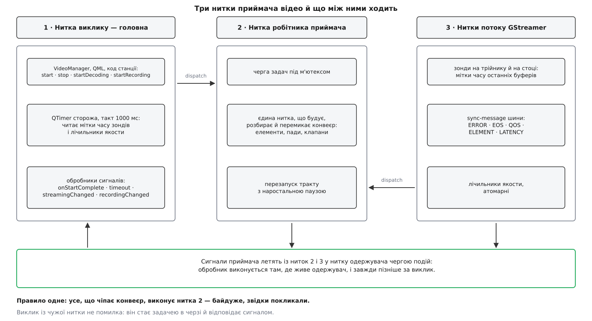

# 📋 Контракт приймача відео: методи, коди, сигнали, нитки

Жоден із семи методів керування приймачем відео нічого не повертає: усі вони оголошені як `void`, виконуються не в тій нитці, звідки їх покликали, а про успіх чи невдачу звітують окремим сигналом із кодом. Тут зібрано весь контракт — підписи й параметри, властивості, які приймач читає в мить запуску, повний перелік кодів завершення й сигналів, правило ниток (звідки що законно кликати) і мінімальний робочий виклик, з якого тракт піднімається.

Підписи звірені з деревом `mavlink/qgroundcontrol`, гілка `master`, станом на 2 серпня 2026 року — взяті із самих заголовків і реалізацій, не з переказів. Питання «а в якій версії?» тут доречне: у лінійці 4.x ті самі класи лежали в `src/VideoReceiver/`, а частина внутрішніх механізмів мала інший вигляд.

## Де що лежить

| Що | Файл |
| --- | --- |
| Абстрактний інтерфейс, переліки `STATUS` і `FILE_FORMAT`, властивості | `src/VideoManager/VideoReceiver/VideoReceiver.h` |
| Реалізація на GStreamer | `src/VideoManager/VideoReceiver/GStreamer/GstVideoReceiver.h` · `.cc` |
| Нитка-робітник і черга задач (`GstVideoWorker`) | там само, у заголовку приймача |
| Фабрика джерел за схемою адреси (`GStreamer::SourceFactory`) | сусідній файл того ж каталогу |

`VideoReceiver` — чистий інтерфейс: він тримає всі поля стану й усі сигнали, а сім методів керування оголошує суто віртуальними. `GstVideoReceiver` — єдина реалізація в дереві; описане нижче правило ниток належить саме їй, і на іншій реалізації воно б не діяло.

Одна деталь підпису, що спантеличує при першому читанні: описувач стоку оголошено як `using VideoSinkHandle = void *`. Це не недбалість, а межа: приймач не знає й не повинен знати, що саме стоїть на тому боці — елемент GStreamer, обгортка над текстурою чи заглушка для тестів.

## Три нитки і єдине правило

Все, що написано далі про виклики, випливає з однієї конструкції. Приймач має власну нитку-робітника — `GstVideoWorker`, звичайну чергу задач під м'ютексом і умовною змінною, тобто класичного [виробника-споживача](book:programming/producer-consumer): хто завгодно кладе замикання в чергу, одна нитка їх по черзі виконує. Кожен із семи методів починається з тієї самої перевірки:

```cpp
// у GstVideoReceiver: перше, що робить кожен метод керування
if (_needDispatch()) {
    _worker->dispatch([this, /* копії аргументів */]() { /* той самий метод */ });
    return;
}
// нижче — справжня робота, і сюди можна дійти лише в нитці робітника
```

А сама перевірка в робітнику — одне порівняння:

```cpp
bool GstVideoWorker::needDispatch() const { return (QThread::currentThread() != this); }
```

Наслідок прямий і приємний: **усі сім методів керування можна кликати з будь-якої нитки**. Виклик із чужої нитки не помилка й не гонка — він просто стає задачею в черзі, а відповідь прийде сигналом. Заборонених ниток у цього контракту немає взагалі.

Нитка третя — не одна, а скільки їх заведе конвеєр усередині себе. У ній працюють зонди на падах і, що важливіше, обробник шини: повідомлення підключено як `sync-message`, тобто обробник викликається **в тій нитці, яка поклала повідомлення на шину**, без жодного проміжного циклу подій. Про сам канал повідомлень — у темі [шина повідомлень конвеєра](book:media-vision/bus-and-messages): будь-який елемент може покласти в неї подію зі своєї нитки, а застосунок вибирає їх зі свого боку. Тому обробник шини не чіпає конвеєр напряму: він або оновлює атомарне поле, або кладе задачу в ту саму чергу робітника.



*Виклики стікаються в чергу однієї нитки, дані про стан ідуть назад атомарними полями й сигналами; конвеєр бачить рівно одна нитка.*

Сторожовий таймер — виняток, і він навмисний: `QTimer` живе в нитці самого об'єкта приймача (у застосунку це головна нитка), а заводять його з робітника через чергову доставку, бо запускати таймер з чужої нитки Qt не дозволяє. Раз на секунду він читає атомарні мітки часу, які пишуть зонди, і атомарні лічильники якости — читає без замків, бо [атомарні змінні](book:programming/std-atomic) дають узгоджене значення без взаємного блокування нитки-письменника й нитки-читача.

Сигнали приймач випромінює з ниток 2 і 3. Куди вони потраплять — визначає тип з'єднання на боці одержувача, а не приймач; за замовчуванням обробник виконається в нитці одержувача й **пізніше** за момент випромінювання. Це та сама механіка, що й в усьому застосунку — [модель ниток](book:qgroundcontrol/threading-model) описує її загалом, а таблиця типів з'єднань і пасток — у [контракті переходу між нитками](book:qgroundcontrol/threading-model/api-thread-crossing.md).

## Переліки

```cpp
enum STATUS {
    STATUS_OK = 0,
    STATUS_FAIL,
    STATUS_INVALID_STATE,
    STATUS_INVALID_URL,
    STATUS_NOT_IMPLEMENTED
};

enum FILE_FORMAT {
    FILE_FORMAT_MIN = 0,
    FILE_FORMAT_MKV = FILE_FORMAT_MIN,
    FILE_FORMAT_MOV,
    FILE_FORMAT_MP4,
    FILE_FORMAT_MAX = FILE_FORMAT_MP4
};
```

| Код | Що означає | Типова причина |
| --- | --- | --- |
| `STATUS_OK` | операцію прийнято й виконано | — |
| `STATUS_FAIL` | не вдалося зібрати або зчепити елементи | нема потрібного плагіна GStreamer, не створився пакувальник, не під'єднався пад |
| `STATUS_INVALID_STATE` | операція безглузда в поточному стані | другий `start()` без `stop()`; `startRecording()` без піднятого конвеєра; повторний `startDecoding()` |
| `STATUS_INVALID_URL` | адреса порожня або нерозбірна | `uri` не задано перед `start()` |
| `STATUS_NOT_IMPLEMENTED` | метод є в інтерфейсі, реалізації немає | `takeScreenshot()` — заглушка в реалізації на GStreamer |

Значення `FILE_FORMAT` — це індекс у таблиці пакувальників, оголошеній поруч:

```cpp
static constexpr const char *_kFileMux[FILE_FORMAT_MAX + 1] = {
    "matroskamux",   // FILE_FORMAT_MKV
    "qtmux",         // FILE_FORMAT_MOV
    "mp4mux"         // FILE_FORMAT_MP4
};
```

Тобто перелік і масив зв'язані порядком, а не іменем: додати формат означає доповнити обидва узгоджено.

## Сім операцій

Усі — публічні слоти, усі повертають `void`, усі звітують сигналом.

| Підпис | Сигнал завершення | Що робить |
| --- | --- | --- |
| `void start(uint32_t timeout)` | `onStartComplete(STATUS)` | збирає конвеєр за `uri` й переводить його у відтворення; `timeout` — секунди тиші джерела, після яких сторож ставить діагноз |
| `void stop()` | `onStopComplete(STATUS)` | згортає весь тракт разом із декодуванням і записом |
| `void startDecoding(VideoSinkHandle sink)` | `onStartDecodingComplete(STATUS)` | причіпляє гілку показу до переданого стоку й відкриває її клапан |
| `void stopDecoding()` | `onStopDecodingComplete(STATUS)` | закриває клапан показу й від'єднує гілку; джерело працює далі |
| `void startRecording(const QString &videoFile, FILE_FORMAT format)` | `onStartRecordingComplete(STATUS)` | будує гілку запису з відповідним пакувальником і відкриває її клапан |
| `void stopRecording()` | `onStopRecordingComplete(STATUS)` | коректно дописує індекс і закриває файл |
| `void takeScreenshot(const QString &imageFile)` | `onTakeScreenshotComplete(STATUS)` | **не реалізовано**: завжди `STATUS_NOT_IMPLEMENTED` |

Плюс один допоміжний метод, доступний і з декларативного шару:

| Підпис | Що робить |
| --- | --- |
| `Q_INVOKABLE void dumpPipelineGraph(const QString &tag = QStringLiteral("manual"))` | вивантажує поточну схему конвеєра у файл графа; пише лише тоді, коли задано змінну середовища `GST_DEBUG_DUMP_DOT_DIR` |

### Умови й коди по кожній операції

| Метод | Умова | Код |
| --- | --- | --- |
| `start` | конвеєр уже піднято | `STATUS_INVALID_STATE` |
| | `uri` порожній | `STATUS_INVALID_URL` |
| | конвеєр не зібрався | `STATUS_FAIL` |
| | зібрався й пішов у відтворення | `STATUS_OK` |
| `startDecoding` | переданий описувач стоку порожній | `STATUS_FAIL` |
| | `widget` не заданий | `STATUS_FAIL` |
| | декодування вже триває | `STATUS_INVALID_STATE` |
| | потоку ще немає — гілку відкладено до появи пада | `STATUS_OK` |
| | гілку зчеплено й відкрито | `STATUS_OK` |
| `startRecording` | конвеєра немає | `STATUS_INVALID_STATE` |
| | запис уже триває | `STATUS_INVALID_STATE` |
| | не створився файловий стік або не став зонд | `STATUS_FAIL` |
| | гілку зібрано, клапан відкрито | `STATUS_OK` (і `recordingChanged(true)`) |

У цій таблиці схована найпідступніша річ усього контракту. `startDecoding` віддає `STATUS_OK` **і тоді, коли ще нічого не декодує**: якщо потік від джерела не пішов, гілку показу нема до чого чіпляти, і приймач лише запам'ятовує намір, щоб зчепити її, коли з'явиться пад. Тобто `STATUS_OK` тут означає «замовлення прийнято», а не «на екрані є картинка». Єдине чесне підтвердження показу — сигнал `decodingChanged(true)`.

> 🔧 **Навіщо це.** Код, що малює в інтерфейсі напис «відео активне» по `onStartDecodingComplete(STATUS_OK)`, брехатиме рівно в тому випадку, заради якого напис і потрібен, — коли борт мовчить. Прив'язуватися треба до `streamingChanged` і `decodingChanged`, а коди завершення читати як відповідь на замовлення.

### Чому зупинка запису — окрема історія

`stopRecording()` не просто закриває клапан. Послідовність така: клапан гілки запису переводять у викидання, гілку від'єднують із надсиланням події кінця потоку **тільки в неї**, а тоді чекають на повідомлення пакувальника про закритий фрагмент — або на кінець потоку чи помилку. Чекання обмежене константою:

```cpp
constexpr GstClockTime kEosTimeoutNs = 3 * GST_SECOND;   // 3 000 000 000 нс
```

Три секунди — верхня межа, після якої гілку прибирають примусово. Важливо, **де** саме ця пауза відбувається: у нитці робітника, не в нитці того, хто покликав. Виклик `stopRecording()` із головної нитки повертається негайно; інтерфейс не завмирає, а результат прийде сигналом за мить чи за три секунди.

## Властивості: що приймач читає й коли

Усі властивості — прості поля з сеттерами, які лише порівнюють, записують і випромінюють свій сигнал зміни. Жоден сеттер нічого не запускає й не перебудовує.

| Властивість | Тип | Типове | Коли набирає чинности |
| --- | --- | --- | --- |
| `uri` | `QString` | порожній | при наступному `start()` |
| `name` | `QString` | порожній | тільки для журналу |
| `rtpJitterLatencyMs` | `int` | `80` | при наступному `start()` |
| `lowLatency` | `bool` | `false` | при наступному `start()` |
| `autoReconnect` | `std::atomic<bool>` | `true` | негайно — читає сторож |
| `sink` | `VideoSinkHandle` (`void *`) | `nullptr` | при `startDecoding()` |
| `widget` | `QQuickItem *` | `nullptr` | перевіряється в `startDecoding()` |
| `videoStreamInfo` | `QGCVideoStreamInfo *` | `nullptr` | опис потоку з борту |
| `started` | `bool` | `false` | **лише прапорець**, нічого не запускає |
| `recordingOutput` | `QString` | порожній | читається; заповнює приймач |

Рядок `started` — окрема пастка. Ім'я обіцяє дію, підпис `void setStarted(bool)` теж, а тіло сеттера в заголовку буквально таке:

```cpp
void setStarted(bool started) { if (started != _started) { _started = started; emit startedChanged(_started); } }
```

Тобто це поле, яке віддзеркалює стан, а не важіль. Запустити тракт можна лише викликом `start()`.

Два параметри буферизації перетворюються на налаштування джерела в мить запуску, і залежність між ними неочевидна:

```
lowLatency == true   →  внутрішній _buffer = -1  →  буфера вирівнювання немає взагалі
_buffer == 0                                     →  відкидати те, що не вклалося в бюджет
_buffer  > 0                                     →  тримати заданий запас
latencyMs            = rtpJitterLatencyMs                 (типово 80 мс)
doRetransmission     = (rtpJitterLatencyMs ≥ 40) && (буфер є)
```

Останній рядок — свідома оборона. Запит на повторне надсилання втраченого пакета має сенс, лише якщо є куди його дочекатися; при буфері 20 мс повторений пакет прийде після того, як кадр уже викинуто, а канал, що й так не впорався, дістане додаткові запити. Тому нижче сорока мілісекунд повтори просто вимикають.

## Сигнали

**Завершення операції** — по одному на кожен метод, усі з кодом:

```cpp
void onStartComplete(STATUS status);
void onStopComplete(STATUS status);
void onStartDecodingComplete(STATUS status);
void onStopDecodingComplete(STATUS status);
void onStartRecordingComplete(STATUS status);
void onStopRecordingComplete(STATUS status);
void onTakeScreenshotComplete(STATUS status);
```

**Зміна стану тракту** — те, на що варто прив'язувати інтерфейс:

| Сигнал | Коли |
| --- | --- |
| `streamingChanged(bool active)` | від джерела пішли (чи перестали йти) дані |
| `decodingChanged(bool active)` | гілка показу справді зчеплена й працює |
| `recordingChanged(bool active)` | гілка запису відкрита або закрита |
| `recordingStarted(const QString &filename)` | ім'я файлу, у який пішов запис |
| `videoSizeChanged(QSize size)` | конвеєр узгодив розмір кадру (і при зміні посеред потоку) |
| `timeout()` | сторож не дочекався ні даних, ні кадрів |

**Зміна властивости** — механічні сигнали сеттерів, потрібні прив'язкам інтерфейсу: `sinkChanged`, `nameChanged`, `uriChanged`, `startedChanged`, `lowLatencyChanged`, `rtpJitterLatencyMsChanged`, `autoReconnectChanged`, `videoStreamInfoChanged`, `widgetChanged`.

**Статистика** — один-єдиний сигнал `decoderStatsChanged()`, спільний на всі шість властивостей нижче.

### Сигналу «прийшов кадр» немає

Це навмисне рішення, і воно рахується в одну дію.

**Потік 1080p30, кожен кадр породжує один сигнал через межу ниток.**

```
кадрів на секунду                        =  30
подій у черзі нитки-одержувача           =  30 /с
корисної роботи на подію                 ≈  нуль (кадр уже намальовано)
```

Тридцять доставок на секунду в чергу подій головної нитки — заради повідомлення, яке нічого не змінює: кадр до цієї миті вже пройшов через стік у графічний процесор і головної нитки не торкався. Тому замість сигналу на кадр приймач тримає три речі: зонди на падах, що пишуть мітки часу в атомарні поля; атомарні лічильники, які набиває обробник повідомлень якости; і прапорець «є що показати». Раз на секунду, тим самим тактом сторожа, прапорець читають і скидають:

```cpp
if (_qosStatsDirty.exchange(false, std::memory_order_acq_rel)) {
    emit decoderStatsChanged();
}
```

Тридцять подій на секунду перетворюються на одну, а точність показників від цього не страждає — лічильники накопичуються в атомарних змінних безперервно, з якої б нитки конвеєр їх не чіпав.

| Властивість | Тип | Що показує |
| --- | --- | --- |
| `decoderName` | `QString` | ім'я елемента, який насправді взявся декодувати — головний свідок у суперечці «апаратний чи програмний» |
| `processedFrames` | `quint64` | скільки кадрів пройшло |
| `droppedFrames` | `quint64` | скільки викинуто |
| `currentJitterNs` | `qint64` | поточний розкид часу приходу, наносекунди |
| `qosProportion` | `double` | відношення справжньої швидкости обробки до потрібної; `1.0` — встигаємо рівно |
| `qosQuality` | `int` | оцінка якости від конвеєра, `1000000` — найкраща |

Читання цих властивостей безпечне з будь-якої нитки: п'ять із шести — атомарні поля, ім'я декодера захищене власним м'ютексом.

## Правило ниток одним поглядом

| Що | Звідки можна кликати | Де виконається |
| --- | --- | --- |
| `start` · `stop` · `startDecoding` · `stopDecoding` · `startRecording` · `stopRecording` · `takeScreenshot` | з **будь-якої** нитки | у нитці робітника |
| сеттери властивостей | з нитки об'єкта (сигнали зміни йдуть до прив'язок інтерфейсу) | там, звідки покликали |
| `decoderName` · `processedFrames` · `droppedFrames` · `currentJitterNs` · `qosProportion` · `qosQuality` | з будь-якої нитки | там, звідки покликали |
| `dumpPipelineGraph` | з будь-якої нитки | у нитці робітника |
| обробники сигналів приймача | випромінюються з ниток робітника й потоку | у нитці одержувача, за типом з'єднання |

Єдине справжнє обмеження стосується не приймача, а вас: обробник, приєднаний прямим з'єднанням, виконається **в нитці потоку** — і все, що в ньому написано, стане частиною гарячого шляху відео.

## Мінімальний робочий виклик

```cpp
auto *receiver = new GstVideoReceiver(this);

receiver->setUri(QStringLiteral("udp://0.0.0.0:5600"));
receiver->setRtpJitterLatencyMs(80);       // типове; 0 і lowLatency — крайності
receiver->setLowLatency(false);
receiver->setAutoReconnect(true);

// 1 · результат приходить сигналом, не поверненим значенням
connect(receiver, &VideoReceiver::onStartComplete, this,
        [this, receiver](VideoReceiver::STATUS status) {
    if (status != VideoReceiver::STATUS_OK) {
        qWarning() << "тракт не піднявся, код" << status;
        return;                            // при autoReconnect сторож спробує сам
    }
    receiver->startDecoding(_sinkHandle);  // стік уже створено й він живий
});

// 2 · показ увімкнено насправді — не за кодом, а за станом
connect(receiver, &VideoReceiver::decodingChanged, this, [](bool active) {
    qInfo() << (active ? "картинка йде" : "показ спинено");
});

connect(receiver, &VideoReceiver::recordingStarted, this, [](const QString &file) {
    qInfo() << "пишемо у" << file;
});

// 3 · виклик можна робити з будь-якої нитки
receiver->start(8);                        // 8 секунд тиші джерела = діагноз
```

Запис — окремою парою, у будь-який момент після того, як конвеєр піднявся:

```cpp
receiver->startRecording(QStringLiteral("/шлях/до/flight.mp4"),
                         VideoReceiver::FILE_FORMAT_MP4);
// ...
receiver->stopRecording();   // onStopRecordingComplete прийде після закриття файлу
```

## Пастки контракту

**Другий `start()` без `stop()` — не перезапуск.** Він поверне `STATUS_INVALID_STATE` і не змінить нічого. Щоб застосувати нову адресу чи новий розмір буфера, потрібна повна пара: `stop()`, дочекатися `onStopComplete`, тоді `start()`.

**Сеттер посеред роботи мовчки не діє.** `setUri()` чи `setRtpJitterLatencyMs()` під час роботи змінять поле й випромінять свій сигнал зміни — тракт лишиться такий, як був. Ці значення читає тільки `start()`.

**`stop()` вимикає все.** Не «паузу показу», а весь тракт: обриваються й декодування, і запис. Щоб прибрати лише картинку з екрана, є `stopDecoding()`.

**`setStarted(true)` нічого не запускає, `setSink()` нічого не показує.** Обидва — поля стану.

**Видалення приймача не миттєве.** Деструктор кличе `stop()`, а тоді глушить нитку робітника — тобто чекає, доки та добере чергу задач. Якщо в цю мить закривався файл запису, чекати доведеться до трьох секунд, і чекатиме та нитка, яка видаляє об'єкт.

**Перезапуск може статися сам.** При `autoReconnect == true` сторож замовляє перезапуск сам, із паузою, що подвоюється після кожної невдалої спроби — 1, 2, 4, 8, 16 секунд і далі зі стелею в 30. Це звичайна [наростальна пауза між повторами](book:programming/retries-backoff): перша спроба ловить коротке моргання каналу, а стеля не дає застосунку молотити з'єднаннями годинами. Успішний кадр скидає лічильник спроб, і наступна невдача знову почне з однієї секунди. Наслідок для коду: після `timeout()` не треба самому кликати `stop()` і `start()` — двоє претендентів на перезапуск дадуть перегони.

**`takeScreenshot()` — заглушка.** У реалізації на GStreamer вона лише пише рядок у журнал і випромінює `STATUS_NOT_IMPLEMENTED`. Знімок екрана в станції робиться не тут.

**Ім'я декодера з'являється не одразу.** Властивість `decoderName` порожня, доки конвеєр не вибрав елемент, — тобто до першого узгодження форматів. Питати її одразу після `onStartComplete` зарано; правильний момент — перше ж `decoderStatsChanged()`.

Хто саме тримає приймач, звідки в нього береться адреса потоку й хто вирішує, коли починати запис, — окрема тема: [відеопідсистема станції](book:qgroundcontrol/video-manager) добуває опис потоку з борту, складає адресу за налаштуваннями й керує життєвим циклом приймача.
