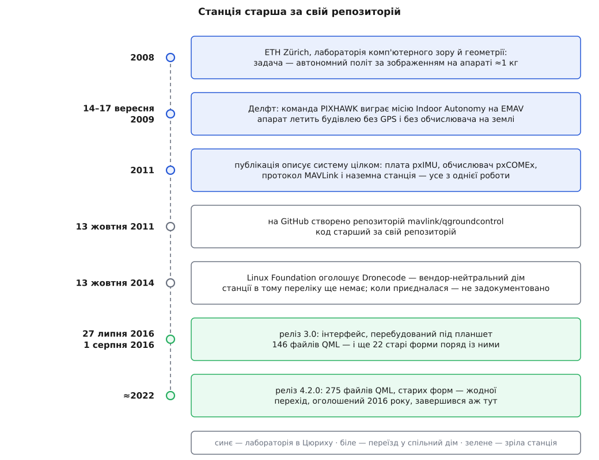
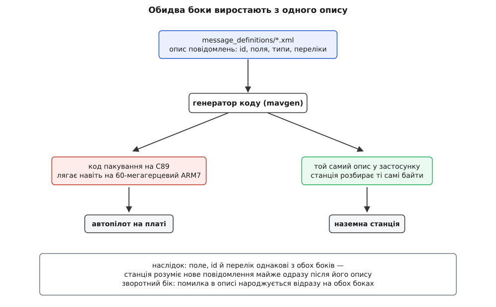

# 📜 Одна лабораторія, чотири артефакти: звідки взялася станція

Наземна станція, протокол, яким вона говорить, автопілот і плата, на якій той автопілот крутився, з'явилися в одному приміщенні майже одночасно — і саме це, а не пізніші домовленості між проєктами, пояснює, чому вони досі припасовані щільніше, ніж бувають припасовані незалежні продукти. Ця історія варта уваги з практичного боку: чимало дивних на перший погляд рішень у теперішньому застосунку — прямі спадкоємці тодішніх обставин.

## Задача, у якій станції не планували

2008 року в лабораторії комп'ютерного зору й геометрії (Computer Vision and Geometry Lab) Швейцарської вищої технічної школи Цюриха — ETH Zürich — почалася робота над апаратом, який літає сам. Не «літає за оператором», а тримає себе в повітрі, дивлячись на світ власними камерами, без GPS і без зовнішнього обчислювача. Лабораторію очолює Марк Поллефейс (нід. *Marc Pollefeys*), бельгійський дослідник комп'ютерного зору, професор ETH від 2007 року. Роботу вів Лоренц Маєр (нім. *Lorenz Meier*), на той час магістрант цієї ж лабораторії — у статті 2011 року він підписаний студентською адресою, а докторат про архітектуру програмного забезпечення дронів захистив аж 2017-го.

Мета була зухвалою кількісно. Автономну навігацію за зображенням доти показували на апаратах вагою 20–100 кг: там вистачало місця під повноцінний комп'ютер. Задача звучала так: перенести те саме на апарат близько кілограма злітної ваги. Це не «те саме, тільки менше» — це інша інженерія, бо кожен грам і кожен ват доводиться відвойовувати.

Важливо, що станції в цьому задумі не було зовсім. Її довелося зробити тому, що інакше не було видно, про що думає летючий комп'ютер.

Команда була не одноосібною: за спогадом самого Маєра, він зібрав чотирнадцятеро співстудентів; за описом ETH, це були магістранти й бакалаври інформатики, електротехніки й машинобудування. У вересні 2009 року — 14–17 вересня, Делфт, Нідерланди — команда PIXHAWK перемогла в місії Indoor Autonomy на європейських змаганнях мікроповітряних апаратів EMAV, випередивши команду EMAVERICK, теж із ETH. Апарат мав пролетіти будівлею й розпізнати зображення на стіні, і головним було саме те, що він робив це без GPS і без підказок ззовні.

**Доказовий статус.** Перемога й склад команди — задокументовані самим ETH і незалежно описані в науковій публікації; «чотирнадцятеро студентів» і «дев'ять місяців роботи вдень і вночі» походять із корпоративної історії Auterion, компанії Маєра, тобто це спогад учасника, а не документ. Що станція, протокол, плата й автопілот вийшли з однієї роботи — факт, зафіксований у публікації 2011 року, де всі чотири описані як частини однієї системи.



*Станція старша за свій репозиторій, а перебудова інтерфейсу тривала довше за реліз, який її оголосив.*

## Чому чотири речі не можна було зробити по черзі

Змагання мають дату. Перед командою стояло не одне завдання, а зчеплений вузол із чотирьох, де жодне не має сенсу без решти.

Потрібна була плата, що керує апаратом: pxIMU — інерційний блок і автопілот на 60-мегагерцевому мікроконтролері ARM7, який зчитує акселерометр, гіроскоп, магнітометр і барометр, зливає їх у оцінку стану, крутить регулятори положення на частоті до 200–500 Гц і віддає команди моторним контролерам по I²C. Потрібен був обчислювач зору: pxCOMEx із модулем на Intel Core 2 Duo 1.86 ГГц, чотирма камерами, 230 г ваги й 27 Вт пікового споживання. Потрібен був спосіб з'єднати ці дві дуже різні машини між собою. І потрібні були очі на землі — бо коли апарат падає, хтось мусить бачити, яку саме дурницю він думав за півсекунди до цього.

Готового набору під це не було. Тодішні робототехнічні набори писалися під наземних роботів і не масштабувалися вниз до серійних ліній: кожен пакет доводилося перекодовувати мостовими процесами, що додавало і роботи, і складності. Тому протокол зробили свій.

Тут і криється перше рішення, яке лишилося назавжди. Той самий протокол пустили і всередину апарата — між платою автопілота й обчислювачем зору, — і назовні, до наземної станції. Наземна станція від того перестала бути окремим видом співрозмовника: вона стала ще одним вузлом на тій самій шині, який говорить тими самими словами, що й борт сам із собою. Звідси ж ростуть [адреси відправника всередині повідомлення](book:qgroundcontrol/message-routing): якщо в одній мережі і плата, і обчислювач, і станція, кожне повідомлення мусить казати, від кого воно й кому.

## Спільний XML, з якого росте обидва боки

Щільність припасовування тримається не на спільному дусі колишніх однокурсників, а на спільному генераторі коду.

MAVLink описали як дуже дешевий кадр: вісім службових байтів на пакет, вбудоване виявлення втрачених пакетів і маршрутизація між системами й усередині системи. Дешевизна була не естетикою, а умовою — тільки за такої ціни один протокол міг однаково лягти і на UART усередині апарата, і на радіомодем униз, і на UDP по Wi-Fi.

**Скільки коштує кадр.** Візьмемо два типові повідомлення й порахуємо частку службових байтів у каналі (розміри корисних даних обчислено з чинного XML-опису протоколу):

```
службових байтів у кадрі MAVLink v1 = 8

HEARTBEAT — «я живий, ось мій тип і режим»
  корисних даних                    = 9 байтів
  у каналі                          = 9 + 8 = 17 байтів
  частка службових                  = 8 / 17 ≈ 0.47

ATTITUDE — крени, тангаж, курс і кутові швидкості
  корисних даних                    = 28 байтів
  у каналі                          = 28 + 8 = 36 байтів
  частка службових                  = 8 / 36 ≈ 0.22
```

Службові байти — фіксоване мито, тож дрібні повідомлення платять за проїзд майже половину своєї ваги, а великі — п'яту частину. Звідси й манера протоколу: краще одне ситне повідомлення на кілька величин, ніж п'ять худих на одну кожне.

Але головне не в економії. Повідомлення описані в XML-файлі, а з опису генератор виробляє код пакування й розпакування — на C89, щоб він компілювався навіть під той 60-мегагерцевий мікроконтролер. Один опис — обидва боки: борт і станція отримують своє розуміння повідомлення з одного джерела. Ось чому нове повідомлення з'являється в станції так легко: [її код теж вирощено з того самого файлу](book:communications/mavlink-xml-codegen).



*Припасованість станції до борту тримається на спільному генераторі коду, а не на домовленостях між командами.*

Наскільки глибоко станцію враховували в самому протоколі, видно з опису найпершого повідомлення. Ось поле з `HEARTBEAT`:

```xml
<message id="0" name="HEARTBEAT">
  <field type="uint8_t" name="autopilot" enum="MAV_AUTOPILOT">
    Autopilot type / class.
  </field>
</message>
```

В описі самого повідомлення сказано, для чого це поле потрібне приймачеві: «by laying out the user interface based on the autopilot» (XML-опис протоколу, файл `minimal.xml`) — тобто щоб той розклав інтерфейс під конкретний автопілот. У словнику протоколу є поле, яке існує заради зручності наземної станції. Це не випадковість: [сам кадр](book:communications/mavlink-packet) і програму, що його читає, писали ті самі люди в ті самі місяці. Як народжувався протокол і хто ще доклався до нього поза Цюрихом, [розказано окремо](book:communications/control-telemetry/hist-mavlink.md).

## Рішення 2011 року, яке досі визначає, чим станція не є

У публікації, що описала всю систему, є короткий розділ про наземну частину — і в ньому сформульовано принцип, вартий більше за весь інший опис інтерфейсу.

Оскільки апарат більше не є винесеною головою давача — він сам обробляє своє зображення на борту, — вниз не треба передавати сенсорні дані взагалі. Донизу має йти лише стисла системна інформація: залишок заряду, положення, стан. Автономність на борту й керування з землі свідомо розділені.

Це пояснює, чому станція виглядає саме так, як виглядає, і сьогодні. Вона показує стан і наміри апарата, а не сирий потік з його давачів; вона віддає завдання, а не крутить кермо. Її не проєктували як пульт — її проєктували як прилад спостереження за машиною, що ухвалює рішення сама. Хто відкриває її, чекаючи симулятора ручного пілотування, розчаровується не через недоробку, а через непорозуміння з проєктом, старше за нього самого.

> 🔧 **Навіщо це.** Коли доводиться вирішувати, чи тягнути в станцію ще один потік даних із борту, згадайте цю межу. Усе, що можна порахувати на борту й віддати вниз готовим числом, за задумом системи належить борту. Кожне порушення цієї межі коштує каналу й уваги оператора — і зазвичай означає, що бортовій частині бракує того, що ви намагаєтеся дорахувати на землі.

## Переїзд із лабораторії

Публікація 2011 року ще відсилає по відео на `pixhawk.ethz.ch` — університетський сайт проєкту. Репозиторій, який усі знають сьогодні, з'явився пізніше: організація `mavlink` на GitHub створила його **13 жовтня 2011 року** (дату повертає програмний інтерфейс самого GitHub). Код старший за свій репозиторій — і це типова доля лабораторної роботи, яка виживає: спершу вона живе на університетському сервері, а на публічний майданчик переїжджає тоді, коли з'являються сторонні дописувачі.

Наступний крок був не технічний, а організаційний. **13 жовтня 2014 року** Linux Foundation оголосила про створення проєкту Dronecode — некомерційного дому з нейтральним управлінням для відкритого дронного програмного забезпечення. Серед засновників були 3D Robotics, Baidu, Box, DroneDeploy, Intel, jDrones, Laser Navigation, Qualcomm Technologies, SkyWard, Squadrone System, Walkera і Yuneec — тобто виробники апаратів, виробники кремнію й розробники сервісів одночасно.

Тут варто бути точним. У тому оголошенні названо APM/ArduPilot, PX4, Mission Planner, MAVLink і DroidPlanner — QGroundControl у переліку немає. Сьогодні ж фундація представляє себе саме як нейтральний дім для PX4, MAVLink, QGroundControl і MAVSDK. Отже, станція опинилася під цим дахом не в момент заснування, а згодом; точну дату за публічними джерелами встановити не вдалося, тож правильний статус цього твердження — зміна складу проєктів задокументована, її момент — ні.

Чому це важить для станції більше, ніж для решти проєктів: саме нейтральність дому робить можливими вендорські збірки. Виробник апаратів може вкладатися в станцію, якою користуються його конкуренти, лише доти, доки нею не володіє конкурент.

## Зміна поколінь

Перше покоління писало станцію для власного апарата. Слід цього видно навіть у переліку авторів: у науковому реєстрі, куди проєкт складає свої релізи, серед тридцяти одного автора версії 3.0.0 стоїть обліковий запис із буквальною назвою `pixhawk-students`.

Люди, які пишуть інструмент для себе, роблять його точним і незручним для чужих: він знає рівно ті випадки, які трапилися з ними. Щоб застосунок став придатним для тисяч чужих апаратів, потрібні були інші руки — і, як сухо каже корпоративна історія Auterion, знадобилися роки й двоє нових розробників, які взяли на себе системну архітектуру. Друге покоління — це насамперед Дон Ґань (*Don Gagne*) і Ґас Ґруббa (*Gus Grubba*): обидва стоять серед авторів релізу 3.0.0 і всіх наступних, і саме Ґань підписав оголошення про реліз на сайті проєкту.

Третє покоління — вже не двоє людей, а група супровідників усередині фундації. Про те, що підгрупу супровідників станції нині співочолює Голден Ремзі (*Holden Ramsey*), повідомляє галузева публікація за листопад 2025 року; це не документ проєкту, тож статус — повідомлення преси, легко застаріває.

Спокуса приписати всю станцію одному імені тут особливо велика, бо одне ім'я справді стоїть біля витоків усіх чотирьох артефактів. Але код, який дожив до сьогодні, писали здебільшого не ті, хто його починав, — і це не применшення засновників, а звичайний спосіб життя довгих проєктів.

## Перебудова, яку продиктував планшет

Версію 3.0 зафіксовано в науковому реєстрі 27 липня 2016 року, а оголошено на сайті проєкту 1 серпня 2016-го. За нею стоїть перебудова інтерфейсу, і причина перебудови була цілком матеріальна.

Станцію треба було навчити працювати на планшеті. Старий інтерфейс складався з форм, намальованих у настільному редакторі; на пристрої з дотиком і слабким процесором вони не годилися. Побачити цей злам можна прямо у файлі збірки версії 3.0.0: форми там лежать усередині умови «не мобільна збірка».

```qmake
FORMS += \
    src/ui/MainWindow.ui \
    src/QGCQmlWidgetHolder.ui \

!MobileBuild {
FORMS += \
    src/ui/MAVLinkSettingsWidget.ui \
    src/ui/QGCMAVLinkInspector.ui \
    src/ui/SettingsDialog.ui \
    ...
}
```

Читається це однозначно: усе, що мусило працювати на планшеті, вже не могло бути старою формою. Мобільна ціль виявилася тим важелем, який перевернув інтерфейс, — не мода й не смак.

Цифри показують, що «нова версія» була не подією, а процесом. У релізі 3.0.0 перелік ресурсів налічує 146 файлів декларативного інтерфейсу — і поряд із ними досі живуть 22 старі форми. У релізі 4.2.0 файлів інтерфейсу вже 275, а форм — жодної. Тобто оголошений 2016 року перехід остаточно завершився ближче до 2022-го, через дві великі версії після тієї, що його оголосила. Цифри взято прямо з файлів проєкту на відповідних мітках, тож їх легко перерахувати самому.

> 🔧 **Навіщо це.** Ця розтяжка на роки — нормальний масштаб змін у станції, і його варто закладати у власні плани. Якщо ваша збірка тримається за підсистему, яку апстрим оголосив застарілою, у вас зазвичай не місяць, а кілька версій запасу — але й розраховувати, що старий шлях житиме вічно, підстав немає. Дивитися варто не на оголошення, а на те, що вже зникло з дерева коду.

## Що з цієї спорідненості лишилося

Спорідненість чотирьох артефактів дає станції те, чого немає в жодного стороннього клієнта: вона знає внутрішні угоди [автопілота](book:programming/px4-architecture) і [плати](book:boards/pixhawk-6c) не з документації, а з походження. Нове повідомлення в протоколі майже одразу має підтримку в станції; майстри калібрування знають послідовності, яких немає в жодному стандарті; параметри показуються з описами, які автопілот віддає сам.

Та сама спорідненість виставляє рахунок. Станція успадкувала припущення дослідницького квадрокоптера 2009 року — про те, хто на борту рахує, що саме має йти вниз і як виглядає нормальний апарат. Коли ці припущення не збігаються з вашою машиною, ви сперечаєтеся не з інтерфейсом, а з рішенням, ухваленим у цюрихській лабораторії задовго до появи вашого апарата — і сперечатися доводиться там, де воно закодоване: у [самій моделі роботи станції з апаратом](book:qgroundcontrol/vehicle-object).
