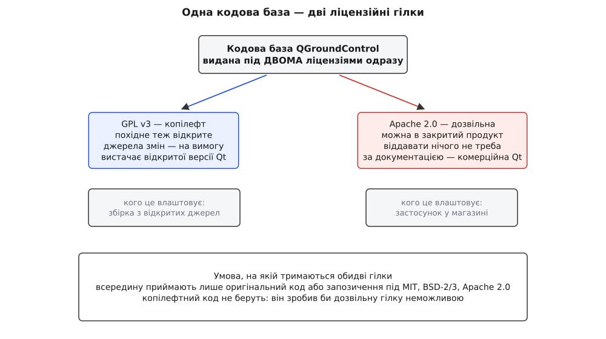
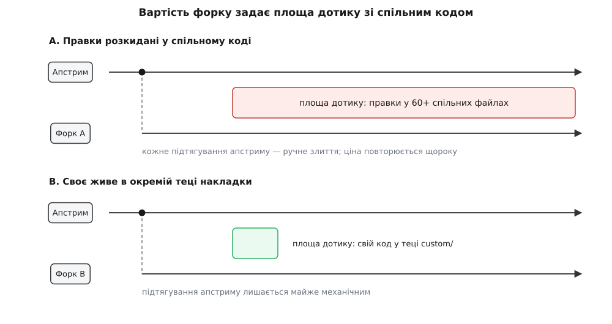
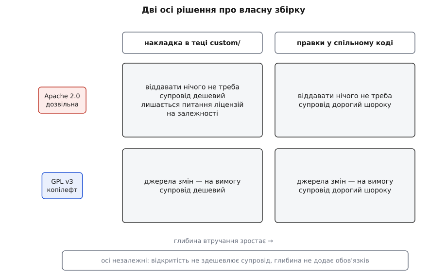

# Проєкт, ліцензія й вендорські форки

<preknowlist>
- [GCS як система](book:programming/gcs-as-system) — що робить наземна станція і чому вона окремий вузол системи, а не доважок до пульта.
- [Контроль версій і git](book:programming/version-control) — репозиторій, коміт, гілка, злиття: без цього розмова про форки не читається.
- [Ліцензії відкритого коду](book:programming/open-source-licenses) — чим дозвільна ліцензія відрізняється від копілефту й що означає сумісність ліцензій.
- [Форк і апстрим](book:programming/fork-and-upstream) — що таке похідний репозиторій і в якому напрямку між ним і джерелом ходять зміни.
- [Динамічне лінкування](book:programming/dynamic-linking) — різниця між бібліотекою, вшитою в застосунок під час збірки, і бібліотекою, підхопленою під час запуску.
</preknowlist>

Наприкінці липня 2026 року в репозиторію QGroundControl на GitHub 4956 форків проти 4809 зірок. Зірка — це «мені цікаво», форк — це «я взяв собі копію». Коли других більше, ніж перших, це не випадковість статистики, а портрет проєкту: цей код беруть, щоб переробити, частіше, ніж просто спостерігають. І саме тому людина, яка вперше бачить наземну станцію на пульті якогось виробника, часто дивиться на щось дуже схоже на [QGroundControl](book:qgroundcontrol/what-is-qgc), але з іншим ім'ям, іншими кольорами й без половини сторінок налаштування.

Ці похідні збірки існують не всупереч проєктові, а з його дозволу й за правилами, які він сам для них підготував. Правила ж пояснюють і решту: чому одні збірки майже не відрізняються від оригіналу, а інші розходяться з ним на роки.

## Проєкт без компанії

Коли застосунок поводиться дивно, перше практичне питання — кому це розповідати. Для комерційного продукту відповідь очевидна: є фірма, є підтримка. Тут відповідь неочевидна, бо фірми «QGroundControl» не існує.

Код лежить у GitHub-організації `mavlink`, поряд із самим протоколом. Торгові марки — QGROUNDCONTROL, PX4, MAVLINK, PIXHAWK — тримає Dronecode Foundation, яка входить до Linux Foundation і свідомо тримається вендор-нейтральною: спільним домом для цих проєктів, а не власником, що торгує залізом.

Нейтральність тут не жест доброї волі, а умова існування спільного коду. В екосистемі безпілотників конкурують виробники апаратів, і кожному з них потрібно, щоб станція вміла показувати саме його апарат, його камеру, його режими польоту. Якби проєктом володіла одна з цих компаній, решта не вкладали б інженерні години в код конкурента: будь-яка їхня робота підсилювала б чужий продукт і залишалася б заручником чужого рішення. Власник, який не продає апаратів, знімає цей конфлікт — вкладатися в спільну станцію стає безпечно.

Звідси випливає, хто насправді пише код. Це невелике ядро супровідників, які тримають архітектуру й приймають зміни, плюс інженери компаній-учасниць, які доводять до апстриму те, що потрібно їхнім власним продуктам. Пріоритети проєкту — рівнодійна цих потреб, а не план якогось відділу. Тому в станції чудово зроблено те, що комусь боліло, і слабко — те, що не боліло нікому з тих, хто платить інженерам.

Проєкт народився не як продукт і не як стандарт, а як побічний результат студентської роботи над автономним польотом — [ця історія](book:qgroundcontrol/project-and-forks/hist-qgc-origins.md) пояснює, чому станція, автопілот і протокол досі так щільно припасовані одне до одного: їх починали ті самі люди в тій самій лабораторії, а розділилися вони пізніше. Репозиторій у його теперішньому вигляді існує на GitHub з жовтня 2011 року.

## Дві ліцензії замість однієї

Проєкту потрібні дві речі, які одна ліцензія не дає разом.

Перша: щоб код лишався спільним. Якщо будь-хто може взяти станцію, доробити її й нікому нічого не показати, спільна робота перетворюється на односторонню — усі беруть, ніхто не повертає. Проти цього працює копілефт (англ. *copyleft* — гра слів проти *copyright*): ліцензія, яка вимагає, щоб похідне теж поширювалося під нею й із джерельним кодом. Класичний такий інструмент — GPL версії 3.

Друга: щоб застосунок можна було покласти в App Store і Google Play, зібрати всередину закритого продукту, дати виробникові апаратів. Копілефт тут заважає: він вимагає віддавати похідне, а комерційна станція виробника — це і є похідне. Для цього потрібна дозвільна ліцензія, яка дозволяє брати код у закритий продукт, вимагаючи натомість лише зберегти повідомлення про авторство й текст самої ліцензії. Такою є Apache 2.0.

Вибір «або одне, або друге» відрізав би проєкту половину користувачів, тому вибору не робили. У корені репозиторію лежать два файли, `LICENSE-APACHE` і `LICENSE-GPL`, і код видано під обома одночасно. Це подвійне ліцензування в диз'юнктивному сенсі: обидві ліцензії пропонують **вам**, а ви берете код **за однією з них** — тією, яка вам підходить. Не «мусиш виконувати обидві», а «вибирай гілку».



*Право споживача вибрати гілку тримається на тому, що всередину проєкту не потрапляє копілефтний код: інакше дозвільна гілка перестала б існувати.*

## Ціна права вибору

Право вибору не безкоштовне, і платить за нього не споживач, а той, хто пише код.

Логіка тут коротка й невблаганна. Щоб проєкт міг запропонувати комусь дозвільну гілку, він мусить мати право видати **весь** свій код на дозвільних умовах. Досить одного файлу, взятого з копілефтного проєкту, — і цей файл тягне свої вимоги на все, до чого приліплений. Дозвільна гілка тоді стає обіцянкою, яку проєкт не може виконати.

Тому власна документація проєкту забороняє вносити чужий копілефтний код у принципі. Приймають або оригінальний код автора, або запозичення з ліцензій, сумісних із дозвільною гілкою — BSD у дво- і трипунктовому варіантах, MIT, Apache 2.0. І кожен внесок робиться під **обидві** ліцензії одразу: автор віддає свою правку так, щоб вона потім розійшлася по обох гілках.

Практично це означає, що дуже спокуслива дія — «візьму готовий шматок з іншого проєкту, він же теж відкритий» — тут може виявитися недопустимою навіть тоді, коли з погляду самого GPL усе законно. Ліцензія джерела має бути сумісною не з тим, як ви збираєте станцію, а з тим, як проєкт роздає її далі.

> 🔧 **Навіщо це.** Якщо ви робите продукт на базі станції, ліцензійна гілка визначає не стиль, а те, що ви зобов'язані віддати. Пішли по GPLv3 — ваша похідна станція теж копілефтна, і користувачеві, який її отримав, ви винні джерельний код своїх змін. Пішли по Apache 2.0 — не винні нічого, крім збереження авторських повідомлень. Вибір робиться один раз і на роки вперед, бо переграти його заднім числом означає вимагати згоди всіх, кому ви вже роздали збірку.

## Ліцензія коду не покриває залежностей

Тут чекає найпоширеніша пастка, і вона логічно неминуча: ліцензія проєкту говорить лише про його власний код. Застосунок складається не тільки з нього.

Станція стоїть на великому наборі сторонніх бібліотек, і в кожної свої умови. Дозвіл узяти код QGroundControl у закритий продукт нічого не каже про право покласти туди чужу бібліотеку. Ці два питання незалежні, і відповідь на друге може перекреслити відповідь на перше.

Найважче тут із бібліотеками під LGPL — послабленим копілефтом, що дозволяє закритому застосункові користуватися бібліотекою, але вимагає натомість одного: користувач мусить мати змогу перезібрати ваш застосунок з іншою або зміненою версією цієї бібліотеки. Коли бібліотека підключена динамічно, вимога виконується майже задарма — досить підмінити файл бібліотеки поруч із застосунком. Коли її вшито статично всередину виконуваного файлу, підміна неможлива без ваших об'єктних файлів, а віддавати їх мало хто хоче. Мобільні платформи додають своє: пакет підписано, вміст замкнено, і саме поняття «користувач перезібрав застосунок» там ледве тримається.

Тому власна документація проєкту зводить це до простого правила: якщо ви йдете дозвільною гілкою — закритий продукт, магазини застосунків — беріть комерційну ліцензію на Qt, фреймворк, на якому станцію побудовано; якщо йдете копілефтною — вистачить його ж відкритої версії. Це позиція документації проєкту, а не юридичний висновок: конкретні зобов'язання залежать від того, як саме ви лінкуєте бібліотеку й що постачаєте разом зі збіркою. Але напрямок думки правильний, і його варто перенести на всі залежності, а не лише на фреймворк.

Окремо стоять малюнки, іконки й документація: вони видані під CC BY 4.0, тобто вживати їх можна вільно, але зі згадкою авторства. А от назва й логотип не покриваються авторським правом узагалі.

## Ім'я — це інша вісь

Авторське право відповідає на питання, що можна робити з кодом. Ім'я продукту й логотип живуть у праві торгових марок, і воно працює інакше: марка захищає не текст, а те, що покупець упізнає на полиці.

Обидві ліцензії дозволяють вам зібрати станцію й продавати її. Жодна з них не дозволяє назвати результат QGroundControl. Марки належать Dronecode, у фундації є політика їх вживання, і саме тому вендорські збірки завжди мають власне ім'я. Це не спроба замаскувати походження — це вимога, без якої в екосистемі перестало б працювати саме поняття «офіційна збірка».

Найцікавіше, що апстрим сам зробив перейменування штатною операцією. Ім'я застосунку, домен організації й ідентифікатор пакета — це звичайні змінні збірки:

```cmake
set(QGC_APP_NAME    "QGroundControl"           CACHE STRING "Application name")
set(QGC_ORG_NAME    "QGroundControl"           CACHE STRING "Organization name")
set(QGC_ORG_DOMAIN  "qgroundcontrol.com"       CACHE STRING "Organization domain")
set(QGC_PACKAGE_NAME "org.mavlink.qgroundcontrol" CACHE STRING "Package identifier")
```

Ключове слово `CACHE` означає, що значення можна перевизначити ззовні, не чіпаючи цього файлу. Ідентифікатор пакета важливий окремо: саме він розділяє встановлені застосунки на пристрої й теки з налаштуваннями, тож вендорська збірка стає поруч із оригіналом, а не замість нього. Проєкт не просто змирився з тим, що його перейменовуватимуть, — він підготував для цього місце.

## Форк як продукт і його щорічна ціна

Слово «форк» означає дві дуже різні речі, і плутанина між ними коштує грошей.

Перше значення — кнопка на GitHub. Ви робите копію, правите, надсилаєте зміни назад і копію викидаєте. Це робочий інструмент, він живе тижні, і ніякої ціни в нього немає.

Друге значення — продукт. Постійна похідна, що живе роками поруч з апстримом і має власних користувачів. Ось у неї ціна є, і вона повторюється щороку.

Механіка проста. Апстрим не стоїть: у станції щоденні коміти, кілька релізів на рік, час від часу міняється щось велике — у п'ятій версії, наприклад, збірку повністю перевели на CMake, а старий шлях прибрали. Щоразу, коли ви хочете підтягнути ці зміни до себе, ваші правки й правки апстриму мусять зустрітися в одних файлах. Якщо ви змінили десять рядків у файлі, який апстрим за рік переписав, злиття буде ручним; якщо ви змінили щось у сотні файлів — ручним буде все.

Звідси головний, зовсім не очевидний висновок: вартість форку визначає не **обсяг** ваших змін, а **площа дотику** — скільки спільних файлів ви зачепили. Тисяча рядків у власному файлі, якого апстрим не бачить, коштує майже нуль. Двадцять рядків, розкиданих по двадцятьох чужих файлах, коштуватимуть вам щорічного ремонту довіку. І оскільки цю площу видно в git, її не треба вгадувати — [її можна виміряти й тримати під контролем](book:qgroundcontrol/project-and-forks/proj-fork-divergence.md) так само, як тримають під контролем розмір бінарника.



*Борг злиття росте з площею дотику зі спільним кодом, а не з кількістю зміненого коду.*

> 🔧 **Навіщо це.** Плануючи власну збірку станції, рахуйте не «скільки нам треба переробити», а «скільки чужих файлів ми при цьому відкриємо». Ця друга цифра — і є ваш майбутній бюджет на супровід. Її варто зафіксувати як межу проєкту на самому початку, поки перша ж вимога замовника не розмазала правки по всьому дереву.

## Розетка, яку апстрим зробив сам

Проєкт бачив цю проблему з боку своїх же учасників — компаній, які роблять збірки, — і відповів на неї архітектурно. Замість «правте що завгодно» станція пропонує окреме місце, куди складати своє.

Виглядає це так. Поруч із деревом коду ви створюєте теку `custom`, а в ній — власний код, ресурси й правила збірки. Корінний файл збірки сам перевіряє, чи така тека є, і якщо є — вмикає режим накладки й підтягує ваші перевизначення:

```cmake
if(IS_DIRECTORY "${CMAKE_SOURCE_DIR}/${QGC_CUSTOM_DIR}")
    message(STATUS "QGC: Custom build directory detected: ${QGC_CUSTOM_DIR}")
    set(QGC_CUSTOM_BUILD ON)
    list(APPEND CMAKE_MODULE_PATH "${CMAKE_SOURCE_DIR}/${QGC_CUSTOM_DIR}/cmake")
    include(CustomOverrides)
endif()
```

Поведінку ви міняєте не правкою, а успадкуванням: у станції є класи-розширення, від яких ви успадковуєте свій і перевизначаєте потрібні методи — [ядрове розширення](book:qgroundcontrol/core-plugin) відповідає за застосунок загалом, окремі розширення — за прошивку й автопілот. Так можна прибрати сторінки налаштування, які власникові готового апарата ні до чого, підмінити набір кольорів і зображень, зафіксувати значення налаштувань, замінити елементи польотного екрана. У прикладі, що йде в комплекті, зайве ховається за режимом для просунутих, який вмикається п'ятикратним натисканням на кнопку польотного виду.

Виграш очевидний: усе ваше лежить у теці, якої апстрим ніколи не торкається, тож площа дотику прямує до нуля, а злиття залишається майже механічним. Сам механізм має власні деталі — повний перелік точок, порядок їх ініціалізації, спосіб підміни ресурсів; [їх розібрано окремо](book:qgroundcontrol/custom-build).

Важить тут його межа: розетка покриває тільки те, що в неї заклали. Щойно вам потрібне щось, чого наявні точки розширення не дають, вибір звужується до двох варіантів — залізти в спільний код і почати платити щороку, або домовитися з апстримом і [додати туди нову точку розширення](book:qgroundcontrol/contributing). Документація прямо радить друге, і рада ця не альтруїстична: вкладення в механізм розширень окупається тим, що ваш власний борг злиття не росте. Тому вибір «форк чи внесок» насправді не моральний, а бухгалтерський.

## Що з цього видно в полі

Ліцензія й механізм накладки разом задають те, що видно ззовні: похідних збірок багато, а публічного коду в них рівно стільки, скільки вендор зобов'язаний або схотів показати. Звідси й два типові випадки, які ви зустрінете.

Перший — публічний форк компанії Auterion на GitHub. Це справді форк основного репозиторію, і це легко перевірити: GitHub сам показує, від кого зроблено копію. Але останній публічний коміт у ньому — вересень 2020 року, тоді як в апстримі коміти щодня. Отже, ця копія — не місце, де живе продукт компанії; вона там просто лежить. Картина типова: вендор публікує рівно стільки, скільки вимагає обрана ним ліцензійна гілка й власна зручність, а робота йде деінде.

Другий — станція, яку виробник постачає під власним ім'ям разом із апаратом і яку в спільноті вважають похідною від QGroundControl, хоч сам виробник цього ніде не документує. Так, зокрема, стоїть питання з DataPilot від Yuneec: спорідненість очевидна на око й багато разів обговорена, але прямого підтвердження з боку компанії немає, тож чесний статус цього твердження — правдоподібне, не доведене.

Із цього випливає практичне правило: не вгадувати за виглядом, а шукати сліди. Ідентифікатор пакета показує, під яким іменем застосунок зареєстровано в системі. Сторінка «про застосунок» показує версію та її формат. Наявність публічного репозиторію показує, наскільки вендор узагалі відкритий. А найсильніший сигнал такий: якщо вендор постачає збірку копілефтною гілкою, він **зобов'язаний** дати вам джерельний код своїх змін на вимогу — і мовчання у відповідь на цю вимогу саме по собі багато говорить.

## Дві осі, які не можна плутати

Усе, що вирішує людина, беручи цю станцію за основу свого продукту, розкладається на дві незалежні осі.

Перша — **ліцензійна гілка**. Вона визначає, що ви зобов'язані віддати назовні: копілефтна вимагає віддати джерела своїх змін тим, кому ви дали збірку; дозвільна не вимагає нічого, але тягне за собою окреме питання ліцензій на залежності. Ця вісь юридична, вирішується один раз і майже не переглядається.

Друга — **глибина втручання**. Вона визначає, скільки ви платитимете щороку: накладка в окремій теці коштує близько нуля, правки у спільному коді коштують тим більше, чим більшої площі торкаються. Ця вісь інженерна, і на ній ви ходите постійно.



*Ліцензія й борг злиття не пов'язані між собою: закрита збірка може бути дешевою в супроводі, а повністю відкрита — дорогою.*

Плутають їх постійно, і плутанина буває дорога в обидва боки. Одні вважають, що відкритість збірки якось убезпечує від боргу злиття — не убезпечує: відкритий форк, який переписав пів дерева, ремонтується так само важко, як закритий. Інші вважають, що глибока переробка автоматично зобов'язує їх щось віддавати — теж ні: обов'язки задає обрана гілка, а не кількість змін.

Коли ви бачите чужу збірку, ці ж дві осі відповідають на питання, чого від неї чекати. Збірка з дрібною накладкою наздоганяє апстрим за тижні, тож її версія й номер версії апстриму значать приблизно одне й те саме. Збірка, що відійшла глибоко, живе у власному часі, і її «версія 4.2» може не мати нічого спільного з тим, що [під тим самим номером](book:qgroundcontrol/release-model) вийшло в апстримі два роки тому — включно з виправленими там помилками, яких у вас ніхто не виправляв.
