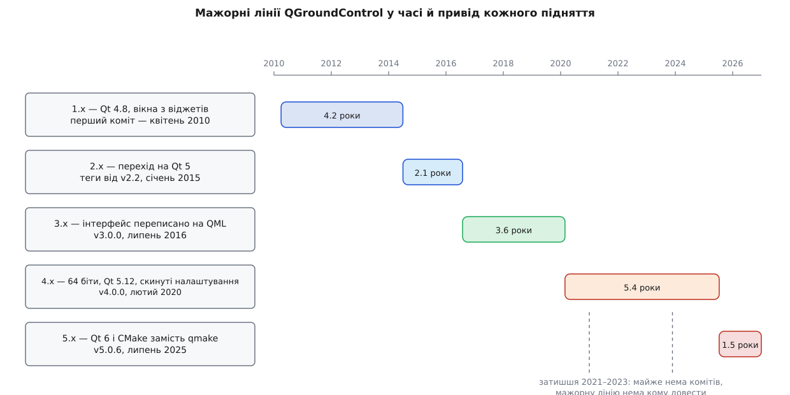
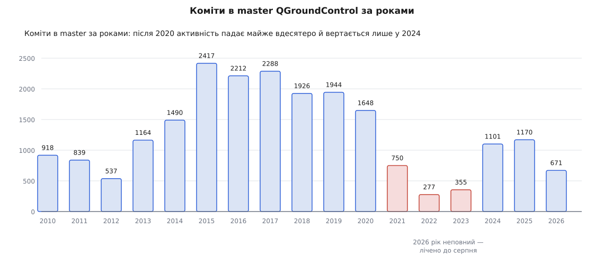
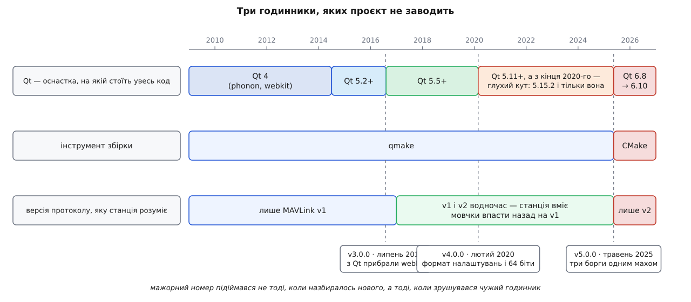

# 📜 Чому в QGroundControl уже п'ята лінія версій

Мажорний номер станції підіймався за п'ятнадцять років лічені рази, і жодного разу — тому, що «назбиралось нового». Щоразу під застосунком зрушувалось щось, чого сам проєкт не заводить: лінія оснастки, інструмент збірки, версія протоколу. Ось хто й коли їх зрушував, що саме через це ламалось у користувача — і чому кожен з тих зламів не міг поїхати мінорним номером.



*П'ять ліній за п'ятнадцять років, і жодні дві не однакової довжини: найкоротша — близько двох років, найдовша — понад п'ять.*

## Станція народилась як лабораторний прилад

Восени 2008-го студент ETH Zurich Лоренц Маєр (Lorenz Meier) почав біля свого магістерського проєкт під назвою PIXHAWK: змусити маленький апарат літати самостійно, орієнтуючись машинним зором. За розповіддю самого проєкту, довкола нього зібралось близько чотирнадцятьох студентів, і за дев'ять місяців роботи команда виграла категорію автономного польоту в приміщенні на європейських змаганнях мікроапаратів 2009 року. *(Статус: самоопис проєкту й пізніші тексти заснованої Маєром компанії; узгоджується з новинами ETH, але це не незалежна історіографія.)*

З тієї ж лабораторії й того ж року вийшов MAVLink — легкий формат повідомлень, яким плата мала розмовляти з наземним комп'ютером; його оприлюднили на початку 2009-го під ліцензією LGPL. *(Усталений факт: перша публікація протоколу датована 2009-м, автор — Лоренц Маєр.)* Наземна станція з'явилась як третя частина того самого стенда: щоб бачити, що саме апарат вважає своїм положенням, і щоб не перепрошивати плату заради зміни коефіцієнта. Це важливо для всієї подальшої історії: QGroundControl писали не як продукт для оператора, а як прилад для того, хто пише прошивку. Продуктом він ставав уже потім, і кожен мажорний перелом — це, серед іншого, черговий крок від приладу до продукту.

На GitHub репозиторій `mavlink/qgroundcontrol` заведено 13 жовтня 2011 року. *(Усталений факт: дата створення в метаданих репозиторію.)* Код у ньому старший за саму теку — його принесли з наробку PIXHAWK. *(Реконструкція: історія комітів починається раніше за дату створення репозиторію.)*

## 1.x і 2.x — станція на Qt 4, яку довелось покинути

Якщо взяти файл збірки станом на лютий 2012-го, там стоїть один рядок, який пояснює цілу епоху:

```
QT += network opengl svg xml phonon webkit sql declarative
```

*(Реконструкція за репозиторієм: рядок узято з `qgroundcontrol.pro` на коміті від 27 лютого 2012 року.)* `phonon` — це звук у Qt 4, `webkit` — вбудований браузерний рушій Qt 4, `declarative` — перше, ще не Quick, покоління QML. Жодного з цих трьох модулів у Qt 5 немає в тому вигляді, у якому вони тут ужиті. Тобто станція першої лінії була не «написана на Qt», а вросла в конкретне його покоління.

Перехід відбувся 2014 року й виглядав у репозиторії саме так, як виглядають такі переходи: десятки дрібних комітів на кшталт «`QString::toAscii()` у Qt 5 немає, беремо `toLatin1()`» і «`QDesktopWidget()` у Qt 5 не працює, беремо `QApplication::desktop()`» — за авторством Браянта Мерза (Bryant Mairs) і Дона Ґаньє (Don Gagne). *(Реконструкція за репозиторієм: обидва коміти датовані 24 червня 2014 року.)* Перший тег, який дожив до сьогодні, — `v2.2` від 1 січня 2015-го, і в ньому вже стоїть вимога Qt 5.2 і вище.

Чому це не могло бути мінорним підняттям? Бо мінорна версія обіцяє, що все, що працювало, працює далі — а тут не працює найпростіше: узяти той самий вихідний код і зібрати його тим самим способом, що місяць тому. Обіцянку про сумісність, яку кодують три числа версії, докладно розібрано в темі [семантичне версіонування](book:programming/semantic-versioning): коротко — мажорне число існує рівно для того, щоб чесно сказати «ваш попередній спосіб користуватись цим більше не діє». Заміна покоління оснастки — саме такий випадок, тільки б'є вона не по користувачеві застосунку, а по тому, хто його збирає.

## 3.x — коли з-під станції прибрали фундамент

Друга лінія прожила недовго: теги `v2.x` ідуть з січня 2015-го, а `v3.0.0` датовано 29 липня 2016 року. *(Усталений факт: дати тегів у репозиторії; оголошення про випуск 3.0 з'явилось на сайті проєкту на початку серпня 2016-го.)* Півтора року від першого тега другої лінії до наступного мажорного номера — найкоротший проміжок в усій історії, і причина зовнішня.

У Qt 5.5 модуль `webkit` оголосили застарілим, а в Qt 5.6, що вийшов у 2016-му, прибрали з поставки: вбудований WebKit був форком гілки, яку в самому WebKit давно покинули, і разом із можливостями він тягнув невиправлені діри в безпеці. *(Усталений факт: Qt задокументувала зняття модуля й причину.)* Станція, яка на нього спиралась, опинилась перед вибором: або лишатись на Qt 5.5 назавжди, або переробити ту свою частину, що трималась на браузерному рушії.

Порівняння списків модулів показує, чим це скінчилось. У `v2.2` збірка тягнула `webkit` поряд із `quick` і віджетами; у `v3.0.0` `webkit` немає взагалі, зате з'явились `qml`, `quick`, `quickwidgets`, `location` і `positioning`. *(Реконструкція за репозиторієм: обидва рядки — з файлів збірки відповідних тегів.)* Тобто мапу й інтерфейс переставили на власні механізми Qt Quick, а вимогу підняли з Qt 5.2 до Qt 5.5.

Для користувача це виглядало як «інша програма»: ті самі задачі, але інші екрани, інші жести, інша мапа. Саме тому 3.0, а не 2.10 — мажорний номер тут попереджає не про формат файлів, а про те, що звички доведеться переучувати.

## 4.x — мажор, у якому найважливіше не функції

`v4.0.0` позначено 26 лютого 2020 року, того самого дня його оголосили на форумі. *(Усталений факт: дата тега збігається з датою допису про випуск.)* Список нового там довгий — мови інтерфейсу, шаблони планів, H.265 у відео, інспектор MAVLink із графіками. Але мажорний номер тримається не на них, а на двох рядках оголошення:

- формат налаштувань довелось змінити, тому всі налаштування скидаються до типових;
- збірки для Windows відтепер лише 64-бітні.

Обидва — це «щось у вас перестане бути так, як було», і кожен б'є по своїй групі. Перший — по операторові, у якого в застосунку роками накопичувались параметри зв'язку, розкладка приладів і шляхи до журналів: після оновлення він вмикає знайому програму й бачить порожній стіл. Другий — по тому, у кого в полі стоїть старий 32-бітний ноутбук: для нього нових збірок просто немає.

Жодна нова функція такої обіцянки не порушує — додана можливість нічого не забирає. Забирає саме зміна формату й зняття платформи, і мажорне число існує, щоб цього не сталось тихо. Як робити такі зняття, не залишаючи людей без попередження, розібрано окремо — [політика виведення з ужитку](book:programming/deprecation-policy) про те, чому оголошення про майбутнє зняття має випереджати саме зняття на цілу лінію версій.

Оснастка при цьому підросла буденно: у файлі збірки `v4.0.0` стоїть вимога не нижче Qt 5.11, а посібник для розробника тієї пори велів ставити рівно 5.12.6. *(Усталений факт: рядок перевірки версії у файлі збірки й вказівка в посібнику.)* Ніхто тоді не міг знати, що на цій лінії Qt проєкт застрягне на роки.

## П'ять років паузи — і чому це не був спокій

Далі йде найдовший проміжок в історії проєкту: `v4.0.0` — лютий 2020-го, `v5.0.0` — травень 2025-го. Мінорні за цей час були: 4.1 оголошено 28 січня 2021-го, `v4.2.0` — 20 грудня 2021-го, `v4.3.0` — 21 листопада 2023-го, `v4.4.0` — 11 червня 2024 року. *(Усталений факт: дати тегів у репозиторії, дата 4.1 — за оголошенням.)* П'ять років і чотири мінорні лінії без жодного мажорного підняття.

Пояснення видно в документації для розробника тих версій. Для 4.3 і для 4.4 там стоїть однакове: «Qt version: 5.15.2 (only)» — не «5.15 і вище», а рівно ця збірка. *(Усталений факт: цитата з посібника відповідних версій.)*

Щоб зрозуміти, чому саме вона, треба глянути на календар Qt. Qt 5.15 — остання лінія п'ятого покоління, і 5.15.2 (листопад 2020-го) стала останнім її відкритим випуском: наступні виправлення 5.15.x виходили спершу лише для комерційних ліцензій. Qt 6.0 з'явився 8 грудня 2020 року. *(Усталений факт: обидві дати задокументовані самою Qt.)*

Тобто з кінця 2020-го проєкт стояв на замерзлій оснастці: старе покоління більше не отримувало відкритих виправлень, нове вимагало переписати все, що спиралось на зняті механізми. І тут перша половина пояснення: переклад на Qt 6 не буває наполовину — застосунок або зібрався новою оснасткою цілком, або не зібрався. Проміжного стану, який можна випустити людям, немає, тож і мінорною версією такого не віддаси.

Друга половина чесніша й менш приємна: у ті самі роки проєкт майже зупинився.



*До 2020-го — стабільно півтори–дві тисячі комітів на рік; 2022-й — 277; далі знову понад тисячу.*

Порахувати це може будь-хто: за 2022 рік у репозиторії 277 комітів проти 1926 за 2018-й. *(Усталений факт: підрахунок за самим репозиторієм.)* Тобто п'ятирічна пауза складається з двох дуже різних відрізків, які легко переплутати: 2021–2023, коли роботи майже не було, і 2024–2025, коли її було багато й вона була неподільна. Мажорний номер не з'явився ані в перші, ані в другі — але з протилежних причин.

## 5.x — три борги одним махом

`v5.0.0` позначено 15 травня 2025-го, стабільну збірку `v5.0.6` випущено 11 липня 2025 року. *(Усталений факт: дати тега й публікації випуску.)* Разом із нею закрились одразу три речі, кожна з яких сама по собі варта мажорного номера.

**Оснастка.** Джерела перевели на Qt 6.8.3; у поточній головній гілці стоїть уже 6.10.1, а бібліотеку графіків замінено з застарілої Qt Charts на новий модуль Qt Graphs. *(Усталений факт: формулювання з офіційного опису змін.)*

**Інструмент збірки.** Збірку повністю перевели на CMake, підтримку qmake прибрано. Цікава деталь: файл `CMakeLists.txt` лежав у дереві вже в `v4.4.0` — з `cmake_minimum_required(VERSION 3.10)` і пошуком компонентів Qt 5, — тоді як посібник тієї ж версії описував складання виключно через qmake. *(Реконструкція за репозиторієм: другий шлях збірки готували щонайменше за рік до того, як його оголосили єдиним.)* Для того, хто просто ставить готову збірку, тут не змінилось нічого; для того, хто збирає станцію сам або веде власне відгалуження, змінилось усе — його наробок описів збірки більше не читається. Чому заміна системи збірки зачіпає не тільки команду складання, а й усі описи залежностей і платформ, розібрано в темі [роль системи збірки](book:build-systems/build-system-role).

**Протокол.** Підтримку першої версії MAVLink прибрано: станція вимагає v2. *(Усталений факт: пряме формулювання в описі змін — підтримку застарілого MAVLink v1 знято.)* Тут варто зупинитись, бо це найцікавіший із трьох випадків.

Поки станція вміла обидві версії, вона мусила вміти й перемикатись між ними — і робила це сама, коли апарат відповідав, що не розуміє надісланої команди. На форумі проєкту цю поведінку описали ще в січні 2022-го: користувач скаржився, що станція мовчки падає на першу версію протоколу, бо стара прошивка не знає одного повідомлення, — а його канал зв'язку першої версії не переносить узагалі. *(Усталений факт: допис на форумі проєкту з описом саме такого автоматичного відкату.)* Ось справжня ціна подвійної підтримки: не зайві гілки в коді, а те, що застосунок має право тихо погіршити з'єднання й нічого людині не сказати. Чим саме різняться два формати пакета — довжиною заголовка, простором номерів повідомлень і місцем під підпис — розібрано в темі [пакет MAVLink](book:communications/mavlink-packet); достатньо знати, що v2 має поля, яких у v1 фізично нема, і що можливості на кшталт [підпису повідомлень](book:communications/mavlink-v2-signing), доданого в тій самій 5.0, у першій версії просто нікуди покласти.

Викинути v1 мінорною версією було б неможливо саме тому, що це не зникнення функції застосунку, а зникнення співрозмовника: у когось у полі досі літає апарат із прошивкою, яка іншої мови не знає. Для нього оновлення станції означає, що зв'язку не буде.

## Ритм, який задає не проєкт

Складемо паузи між мажорними лініями: близько півтора року між другою і третьою, три з половиною — між третьою і четвертою, понад п'ять — між четвертою і п'ятою. Ніякої закономірності на кшталт «раз на два роки» тут не проглядається, і шукати її не варто: жодну з цих дат не призначав проєкт.



*Кожен мажорний підйом припадає на зрушення чужого годинника: 3.0 — на зняття webkit із Qt, 4.0 — на зміну власного формату налаштувань і розрядності збірок, 5.0 — на кінець відкритої підтримки Qt 5, разом із яким закрили й борг зі збіркою та протоколом.*

Звідси й нерівність пауз. Мажорний номер підіймають не тоді, коли назбиралось достатньо нового, а тоді, коли назбиралось достатньо зламаного — і зламане приходить іззовні за власним розкладом. Чотири роки на замерзлій Qt 5.15.2 — це і затишшя в самому проєкті, і робота, яку неможливо показати частинами; але момент, коли відкладати стало нікуди, призначив не проєкт.

Тому за номером версії цієї станції читається не список функцій, а список сплачених боргів. І варто зважати, що частина такого штибу змін відбувається зовсім тихо: в оголошенні 4.0 (лютий 2020-го) збірки для iOS обіцяли «ще за тиждень», в оголошенні 4.1 — уже просто «згодом», а в переліку платформ поточної лінії — Windows 10 (1809 і новіші), macOS 13 і новіші, Ubuntu 22.04 і 24.04, Android 9 і новіший — iOS немає взагалі. *(Усталений факт: обидва переліки — з офіційних сторінок відповідних років; сама дата зняття iOS в оголошеннях не проговорена, тож момент — реконструкція.)* Мажорний номер попереджає про злам тільки тоді, коли хтось не полінувався записати, що саме зламано.
