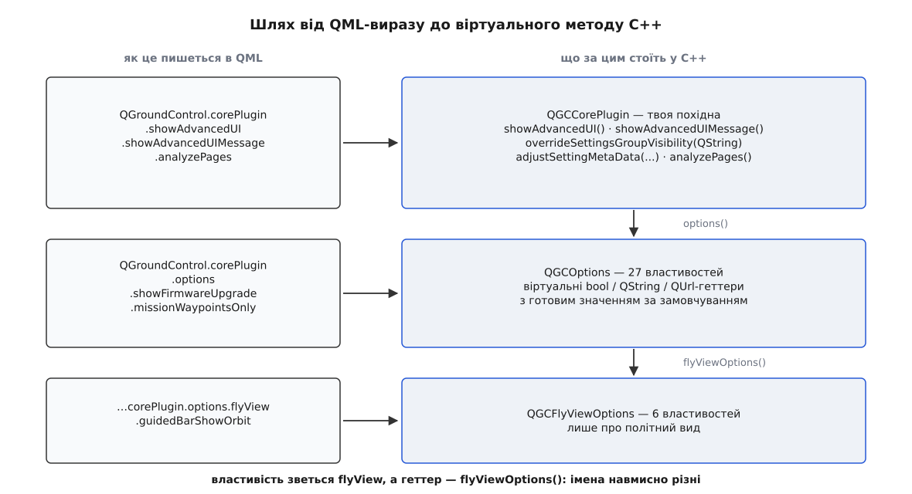
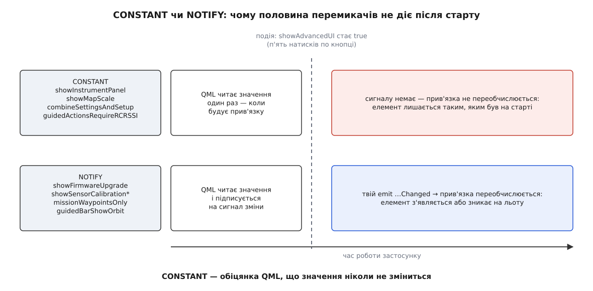

# 🔌 Перемикачі видимості: QGCOptions і ядрове розширення

Довідка по кожній точці, якою власна збірка QGroundControl вмикає й вимикає елементи інтерфейсу: сигнатура, значення за замовчуванням в апстримі, який саме елемент зникає — і чому половина перемикачів мовчки не діє після старту застосунку. Тут узято тільки зріз видимості; увесь контракт ядрового розширення — від фабрик підсистем до гачків плану — в [окремій довідці по ньому](topic:qgroundcontrol/core-plugin/api-core-plugin.md). Усе нижче звірено з `src/API/QGCOptions.h`, `src/API/QGCCorePlugin.h`, `src/API/QmlComponentInfo.h` і `custom-example/` гілки `master`; набір властивостей помітно змінюється між релізами, тож перед роботою звіряйся зі своєю гілкою.

## Де ці перемикачі живуть

Перемикачі складені у два класи в `src/API/QGCOptions.h`. `QGCOptions` описує застосунок цілком; `QGCFlyViewOptions` — тільки політний вид. Дістатися до них можна лише через [ядрове розширення](topic:qgroundcontrol/core-plugin) — це єдиний об'єкт, який застосунок питає про свої налаштування. Ані ввімкнути, ані вимкнути щось із готового застосунку неможливо: перемикачі — це віртуальні методи C++, тож змінити відповідь можна лише [власною збіркою](topic:qgroundcontrol/custom-build), яка підміняє базовий клас своєю похідною ще до створення вікна.

```cpp
QGCCorePlugin *plugin;                                  // QGroundControl.corePlugin
QGCOptions *opts = plugin->options();                   // QGroundControl.corePlugin.options
const QGCFlyViewOptions *fly = opts->flyViewOptions();  // QGroundControl.corePlugin.options.flyView
```

В останньому рядку — пара імен, що збиває з пантелику щоразу: властивість для QML зветься `flyView`, а геттер у C++ — `flyViewOptions()`.

```cpp
Q_PROPERTY(const QGCFlyViewOptions *flyView READ flyViewOptions CONSTANT)

virtual const QGCFlyViewOptions *flyViewOptions() const { return _defaultFlyViewOptions; }
```

Базовий `QGCOptions` створює собі стандартний набір політних опцій просто в конструкторі, тож геттер ніколи не повертає нуль:

```cpp
QGCOptions::QGCOptions(QObject *parent)
    : QObject(parent)
    , _defaultFlyViewOptions(new QGCFlyViewOptions(this))
{
}
```

Зверни увагу на сигнатуру конструктора політних опцій — `QGCFlyViewOptions(QGCOptions *options, QObject *parent = nullptr)`. Перший аргумент тут не батьківський об'єкт, а власник за змістом, який осідає в захищеному полі `const QGCOptions *_options`.


*Кожен рівень доступний із QML як ланка в ланцюжку властивостей; у C++ тому самому ланцюжку відповідають віртуальні геттери, які й перевизначає власна збірка.*

## QGCOptions: набір можливостей застосунку

Усі геттери публічні й віртуальні, усі мають робоче значення за замовчуванням. Колонка «зв'язок» — це те, як властивість оголошена для QML: `CONSTANT` або `NOTIFY <сигнал>`. Різниця між ними вирішальна, і про неї — окремий розділ нижче.

### Прошивка й сторінки налаштування

| Геттер | Тип | Апстрим | Зв'язок | Що змінюється |
|---|---|---|---|---|
| `showFirmwareUpgrade()` | `bool` | `true` | `showFirmwareUpgradeChanged` | `false` — зі сторінок налаштування зникає «Firmware» |
| `firmwareUpgradeSingleURL()` | `QString` | `QString()` | `CONSTANT` | непорожній рядок — прошивальник переходить у режим, де качає **один-єдиний файл** із цієї адреси; ручне встановлення свого файлу лишається доступним через поглиблені опції сторінки |
| `checkFirmwareVersion()` | `bool` | `true` | `CONSTANT` | звірка версії прошивки (коментаря в заголовку немає — перевір місце виклику у своїй гілці) |
| `combineSettingsAndSetup()` | `bool` | `false` | `CONSTANT` | `true` — «Settings» і «Vehicle Setup» зливаються в одне меню |

### Калібрування сенсорів

П'ять окремих перемикачів на п'ять кнопок сторінки «Sensors». Усі за замовчуванням `true`, усі мають свій сигнал зміни:

| Геттер | Сигнал | Кнопка, що зникає |
|---|---|---|
| `showSensorCalibrationAccel()` | `showSensorCalibrationAccelChanged` | калібрування акселерометра |
| `showSensorCalibrationGyro()` | `showSensorCalibrationGyroChanged` | калібрування гіроскопа |
| `showSensorCalibrationCompass()` | `showSensorCalibrationCompassChanged` | калібрування компаса |
| `showSensorCalibrationAirspeed()` | `showSensorCalibrationAirspeedChanged` | калібрування давача повітряної швидкості |
| `showSensorCalibrationLevel()` | `showSensorCalibrationLevelChanged` | вирівнювання горизонту |

Поруч стоїть шостий, іншої природи: `sensorsHaveFixedOrientation()`, `bool`, апстрим `false`, `CONSTANT`. Коментаря в заголовку немає; за іменем — заява збірки, що плата змонтована в наперед відомій орієнтації, тож вибирати її оператору не треба.

### План

| Геттер | Тип | Апстрим | Зв'язок | Що змінюється |
|---|---|---|---|---|
| `missionWaypointsOnly()` | `bool` | `false` | `missionWaypointsOnlyChanged` | `true` — у плані лишаються тільки маршрутні точки й комплексні елементи |
| `showSimpleMissionStart()` | `bool` | `false` | `showSimpleMissionStartChanged` | `true` — спрощений старт місії |
| `showMissionAbsoluteAltitude()` | `bool` | `true` | `showMissionAbsoluteAltitudeChanged` | `false` — ховає абсолютну висоту як режим висоти в плані |
| `showMissionStatus()` | `bool` | `true` | `CONSTANT` | `false` — зникає індикатор стану місії у виді плану |
| `surveyBuiltInPresetNames()` | `QStringList` | порожній | `CONSTANT` | імена вбудованих пресетів зйомки; вбудовані **не можна видалити** з інтерфейсу |

### Карти й журнали

| Геттер | Тип | Апстрим | Зв'язок | Що змінюється |
|---|---|---|---|---|
| `showOfflineMapImport()` | `bool` | `true` | `showOfflineMapImportChanged` | `false` — зникає завантаження набору [офлайн-тайлів](topic:qgroundcontrol/offline-maps) із файлу |
| `showOfflineMapExport()` | `bool` | `true` | `showOfflineMapExportChanged` | `false` — зникає вивантаження набору тайлів у файл |
| `showPX4LogTransferOptions()` | `bool` | `true` | `CONSTANT` | `false` — ховає налаштування передачі журналів PX4 |

### Політ, керування, оболонка

| Геттер | Тип | Апстрим | Зв'язок | Що змінюється |
|---|---|---|---|---|
| `multiVehicleEnabled()` | `bool` | `true` | `multiVehicleEnabledChanged` | `false` — [підтримка кількох апаратів](topic:qgroundcontrol/multi-vehicle) вимкнена |
| `allowJoystickSelection()` | `bool` | `true` | `allowJoystickSelectionChanged` | `false` — збірка сама ввімкнула конкретний джойстик, вибирати нема з чого |
| `guidedActionsRequireRCRSSI()` | `bool` | `false` | `CONSTANT` | `true` — керовані дії заблоковані, поки немає RSSI від пульта |
| `preFlightChecklistUrl()` | `QUrl` | `qrc:/qml/QGroundControl/FlyView/PreFlightCheckList.qml` | `CONSTANT` | адреса власного QML передпольотного чеклиста |
| `toolbarHeightMultiplier()` | `double` | `1.0` | `CONSTANT` | множник висоти головної смуги інструментів |
| `enableSaveMainWindowPosition()` | `bool` | `true` | `CONSTANT` | `false` — розмір і позиція вікна не зберігаються між запусками |
| `useMobileFileDialog()` | `bool` | `true` на Android/iOS, `false` інде | `CONSTANT` | вибір між мобільним і системним діалогом файлів |
| `devicePixelRatio()` | `float` | `0.0f` | `devicePixelRatioChanged` | ненульове — підміняє те, що Qt прочитав із заліза |
| `devicePixelDensity()` | `float` | `0.0f` | `devicePixelDensityChanged` | те саме для щільності пікселів |

Про `guidedActionsRequireRCRSSI` варто знати одне: [RSSI](topic:communications/rssi-signal-strength) — це число, яким приймач звітує про рівень прийнятого сигналу, і воно приходить на борт із пульта, а не зі станції. Тобто ворота питають не «чи є зв'язок у мене», а «чи є в апарата зв'язок із пультом, щоб людина могла перехопити керування руками». Апстрим лишає ці ворота відчиненими, бо апарат може летіти й без пульта взагалі.

Окремо стоять два геттери кольорів, які **не є** Q_PROPERTY і тому доступні лише з C++:

```cpp
virtual QColor toolbarBackgroundLight() const { return QColorConstants::White; }
virtual QColor toolbarBackgroundDark()  const { return QColorConstants::Black; }
```

## QGCFlyViewOptions: шість перемикачів політного виду

| Геттер | Апстрим | Зв'язок | Що зникає з політного екрана |
|---|---|---|---|
| `showInstrumentPanel()` | `true` | `CONSTANT` | панель приладів |
| `showMapScale()` | `true` | `CONSTANT` | масштабна лінійка на карті |
| `showMultiVehicleList()` | `true` | `CONSTANT` | список апаратів |
| `guidedBarShowEmergencyStop()` | `true` | `guidedBarShowEmergencyStopChanged` | аварійна зупинка моторів на смузі керованих дій |
| `guidedBarShowOrbit()` | `true` | `guidedBarShowOrbitChanged` | «кружляти тут» на тій самій смузі |
| `guidedBarShowROI()` | `true` | `guidedBarShowROIChanged` | «дивитися сюди» (region of interest) |

Одна пастка в оголошенні: у базовому класі всі шість геттерів стоять під `protected:`. Це не заважає QML читати їх — код доступу генерує moc, і він живе **всередині** класу, — але заважає покликати їх із чужого C++-коду. Своя похідна може без наслідків підняти їх у `public`, як це й робить `custom-example`.

### Як підставити свої політні опції

Об'єкт політних опцій не реєструється ніде окремо: застосунок бере той, який віддав `flyViewOptions()`. Тому підміна робиться не в самому `QGCFlyViewOptions`, а на поверх вище — у своєму `QGCOptions`:

```cpp
class CustomFlyViewOptions : public QGCFlyViewOptions
{
    Q_OBJECT

public:
    explicit CustomFlyViewOptions(CustomOptions *options, QObject *parent = nullptr);

    bool showInstrumentPanel() const final { return false; }   // у збірці своя панель приладів
    bool showMultiVehicleList() const final { return false; }
};

// у CustomOptions:
QGCFlyViewOptions *flyViewOptions() const final { return _flyViewOptions; }
```

Дві дрібниці, на яких спотикаються.

**Тип повернення не збігається з базовим — і так і треба.** Базовий геттер віддає `const QGCFlyViewOptions *`, похідний в апстримному прикладі — `QGCFlyViewOptions *` без `const`. Це законне перевизначення: коваріантність дозволяє похідній **прибрати** `const` із класу в типі повернення (додати — ні). Тож копіювати базову сигнатуру символ у символ не обов'язково, обидві форми зберуться.

**Два аргументи конструктора — про різні речі.** Перший іде в захищене поле `_options` (хто мій власник за змістом), другий — звичайний батьківський об'єкт, тобто хто мене видалить. Базовий клас пише `new QGCFlyViewOptions(this)` і другий лишає порожнім; `custom-example` пише `new CustomFlyViewOptions(this, this)` — обидва. Копіюй другу форму.

## CONSTANT чи NOTIFY — головна пастка

`CONSTANT` у Q_PROPERTY — це не оптимізація й не дрібниця оформлення. Це **обіцянка**, яку клас дає рушію QML: значення ніколи не зміниться. Прив'язка, що читає таку властивість, обчислюється один раз, коли будується елемент, і більше не переобчислюється — переобчислювати нема з чого, бо сигналу зміни просто не оголошено.

Звідси правило, яке коштує вечора налагодження: **перемикач із `CONSTANT` не можна прив'язувати до чогось, що змінюється в житті застосунку**. Написати `bool showMapScale() const override { return _plugin->showAdvancedUI(); }` компілятор дозволить, код виконається — і масштабна лінійка застигне в тому стані, у якому була на старті. Помилки не буде ніде: ні попередження, ні запису в журналі.


*Обидві прив'язки читають значення на старті однаково. Далі шляхи розходяться: без сигналу QML не має підстави спитати ще раз.*

Друга половина правила стосується `NOTIFY`-перемикачів, і вона теж не очевидна: **базовий клас не випромінює жодного з цих сигналів**. Увесь `QGCOptions.cc` — це два конструктори, два деструктори й дві категорії журналу; слова `emit` там немає жодного разу. Якщо твій геттер залежить від стану, випромінити сигнал — твій обов'язок. Апстримний `custom-example` показує обидві половини разом:

```cpp
class CustomOptions : public QGCOptions
{
    Q_OBJECT

public:
    explicit CustomOptions(CustomPlugin *plugin, QObject *parent = nullptr);

    // showFirmwareUpgrade оголошено з NOTIFY — його МОЖНА в'язати до стану
    bool showFirmwareUpgrade() const final { return _plugin->showAdvancedUI(); }

private:
    QGCCorePlugin *_plugin = nullptr;
};

CustomPlugin::CustomPlugin(QObject *parent)
    : QGCCorePlugin(parent)
    , _options(new CustomOptions(this, this))
{
    _showAdvancedUI = false;   // збірка стартує БЕЗ поглибленого шару
    (void) connect(this, &QGCCorePlugin::showAdvancedUIChanged,
                   this, &CustomPlugin::_advancedChanged);
}

void CustomPlugin::_advancedChanged(bool changed)
{
    // базовий QGCOptions цього не зробить за тебе
    emit _options->showFirmwareUpgradeChanged(changed);
}
```

Зверни увагу, звідки саме йде `emit`: сигнал належить об'єктові опцій, а випромінює його розширення — тобто чужий клас. Компілятор це пропускає, бо `signals:` розкривається в `public:`, і апстрим цим користується. Охайніша альтернатива, якщо не хочеш смикати чужі сигнали ззовні, — тримати слот у самих похідних опціях і підписувати на зміну вже його.

## Ядрове розширення: контракт у частині видимості

### showAdvancedUI

```cpp
Q_PROPERTY(bool showAdvancedUI READ showAdvancedUI WRITE _setShowAdvancedUI NOTIFY showAdvancedUIChanged)

public:
    bool showAdvancedUI() const { return _showAdvancedUI; }

signals:
    void showAdvancedUIChanged(bool showAdvancedUI);

protected:
    bool _showAdvancedUI = true;

private:
    void _setShowAdvancedUI(bool show);
```

```cpp
void QGCCorePlugin::_setShowAdvancedUI(bool show)
{
    if (show != _showAdvancedUI) {
        _showAdvancedUI = show;
        emit showAdvancedUIChanged(show);
    }
}
```

Три наслідки, кожен із яких видно прямо в цьому оголошенні.

**Апстрим стартує з `true`.** Ініціалізатор поля стоїть тут же — `bool _showAdvancedUI = true`. Тобто звичайний QGroundControl **завжди** в поглибленому режимі, і жодного «експертного шару», який треба відмикати, у ньому нема. Приховування вмикає власна збірка, зробивши те, що робить `custom-example`: присвоївши `_showAdvancedUI = false` у своєму конструкторі.

**Писати можна лише з QML.** Записувач `_setShowAdvancedUI` стоїть під `private:` — його не покличе ні чужий код, ні навіть похідний клас. Єдиний законний шлях запису — присвоєння QML-властивості, яке moc проведе до приватного методу:

```qml
QGroundControl.corePlugin.showAdvancedUI = true
```

**Початкове значення ставиться в обхід сигналу.** Саме поле `_showAdvancedUI` захищене, а не приватне, і це зроблено навмисно: похідний клас у конструкторі присвоює його напряму, без `emit`. У той момент інтерфейсу ще нема, повідомляти нема кого — а сигнал у конструкторі до того ж не дійшов би до жодного з майбутніх підписників.

Тим самим взірцем поруч живе `showTouchAreas` — налагоджувальне підсвічування зон дотику: те саме приватне `_setShowTouchAreas`, те саме захищене поле, той самий сигнал. Різниця одна, зате промовиста — початкове значення: `_showTouchAreas = false`. Налагоджувальний шар в апстримі треба вмикати, поглиблений — вимикати.

### showAdvancedUIMessage

```cpp
Q_PROPERTY(QString showAdvancedUIMessage READ showAdvancedUIMessage CONSTANT)

/// @return The message to show to the user when they are prompted to confirm turning on advanced ui.
virtual QString showAdvancedUIMessage() const;
```

Текст, який застосунок покаже перед вмиканням поглибленого режиму. Базова реалізація віддає чотири англійські речення: попередження, що неправильне користування може зіпсувати апарат і скасувати гарантію, порада робити це лише за вказівкою підтримки — і питання-підтвердження в кінці. Рядок проходить через `tr()`, тож перекладається штатним механізмом Qt. Вендорові варто переписати його не заради стилю, а заради змісту: у «гарантії» і «підтримці» в кожного своя правда.

### overrideSettingsGroupVisibility

```cpp
/// Allows the core plugin to override the visibility for a settings group
///     @param name - SettingsGroup name
/// @return true: Show settings ui, false: Hide settings ui
virtual bool overrideSettingsGroupVisibility(const QString &name) { Q_UNUSED(name); return true; }
```

Найгрубіший із важелів налаштувань: ховає цілу групу — тобто цілу сторінку [збережуваних налаштувань](topic:qgroundcontrol/settings-persistence) — за її рядковим іменем.

```cpp
bool CustomPlugin::overrideSettingsGroupVisibility(const QString &name)
{
    if (name == VideoSettings::settingsGroup) {
        return false;   // у цій збірці відео нема взагалі
    }
    return QGCCorePlugin::overrideSettingsGroupVisibility(name);
}
```

Дві речі, які легко проґавити. По-перше, звірка йде **за рядком**, а не за переліком: перейменували групу в апстримі — твоя умова тихо перестала збігатися, і сторінка повернулася на екран. Гілку `else` тут не напишеш, помилку компілятор не спіймає, а помітиш ти це вже у зібраному застосунку. По-друге, для всіх решти імен обов'язково повертай результат базового виклику, а не голе `true`: базова реалізація сьогодні завжди віддає `true`, але це її право змінитися.

### adjustSettingMetaData

```cpp
/// Allows the core plugin to override the meta data before the fact is created.
///     @param settingsGroup - QSettings group which contains this item
///     @param metaData - MetaData for setting fact
///     @param userVisible - true: Setting should be visible in ui,
///                          false: Setting should not be shown in ui (default value will be used as value)
/// If not overridden, metaData and userVisible are left unchanged.
virtual void adjustSettingMetaData(const QString &settingsGroup, FactMetaData &metaData, bool &userVisible);
```

Найтонший важіль: викликається один раз на кожне налаштування, **перед** тим як із метаданих народиться факт. У [системі фактів](topic:qgroundcontrol/fact-system) метадані — це все, що застосунок знає про величину, крім самого значення: ім'я, тип, межі, одиниці, перелік дозволених варіантів і значення за замовчуванням. Тут їх можна виправити до того, як інтерфейс їх побачить.

Аргумент `userVisible` — вхідно-вихідний: приходить із чинним значенням, і чіпати його треба лише тоді, коли справді хочеш його змінити. Зміст його не «сховати»: **`false` означає «прибрати з інтерфейсу й лишити діяти значення за замовчуванням»**. Тобто налаштування не просто зникає з очей — воно ще й примусово повертається до типового, хоч би що там колись зберіг користувач у попередній збірці. Разом із `setRawDefaultValue()` це дає пришпилювання: величина фіксується на потрібному числі й більше не редагується ніким.

```cpp
void CustomPlugin::adjustSettingMetaData(const QString &settingsGroup,
                                         FactMetaData &metaData, bool &userVisible)
{
    QGCCorePlugin::adjustSettingMetaData(settingsGroup, metaData, userVisible);  // не з'їдай базові правки

    if (settingsGroup == AppSettings::settingsGroup) {
        if (metaData.name() == AppSettings::offlineEditingFirmwareClassName) {
            metaData.setRawDefaultValue(QGCMAVLink::FirmwareClassPX4);
            userVisible = false;   // клас прошивки в цій збірці один і назавжди
            return;
        }
    }
}
```

Перший рядок тут не ввічливість. Базова реалізація сама щось править, і майже все, що вона править, — платформне. На Android вона ховає налаштування тривимірного оглядача (`Viewer3DSettings::enabled`) — а отже, за щойно описаним правилом, ще й примусово його вимикає: відмальовка 3D на тамтешніх драйверах ненадійна. На Android та iOS ставить `false` типовим для збереження телеметрії. Типову палітру — «в приміщенні» чи «надворі» — теж вибирає за платформою. Пропустиш виклик базової — тихо втратиш усе це, і збірка почне поводитись інакше рівно там, де ти цього не планував.

### analyzePages і requiresVehicle

```cpp
/// The list of pages/buttons under the Analyze Menu
/// @return A list of QmlPageInfo
virtual const QVariantList &analyzePages();

Q_PROPERTY(QVariantList analyzePages READ analyzePages CONSTANT)
```

Коментар згадує `QmlPageInfo` — такого класу в дереві немає взагалі; список складають із `QmlComponentInfo` (`src/API/QmlComponentInfo.h`):

```cpp
QmlComponentInfo(const QString &title, QUrl url, QUrl icon = QUrl(),
                 QObject *parent = nullptr, bool requiresVehicle = false);
```

Останній аргумент і є те, заради чого сюди варто заглянути. `requiresVehicle` — це не про людину й не про збірку, а про **стан світу**: сторінка недоступна, поки апарат не під'єднаний. Прапорець живе на самій сторінці, а не в перемикачах, і саме тому кожен елемент меню «Analyze» має власну відповідь на питання «чи є з чим працювати».

| Сторінка апстриму | `requiresVehicle` |
|---|---|
| Log Viewer (тільки настільні платформи) | `false` |
| Onboard Logs | `true` |
| GeoTag Images | `false` |
| MAVLink Console | `true` |
| MAVLink Inspector | `true` |
| Vibration | `true` |

Логіка розкладу проста: інструменти, що працюють із **файлом на диску**, доступні завжди, а ті, що розмовляють із бортом, — лише коли борт є. Свою сторінку додають, зібравши власний список і повернувши його з перевизначеного `analyzePages()`.

Властивість оголошена `CONSTANT`, а базова реалізація тримає список у `static const QVariantList` і віддає його за константним посиланням. Тобто меню «Analyze» будується один раз за весь запуск — сторінку не можна додати чи прибрати на льоту, лише замінити весь список у своїй похідній.

## Чого ці перемикачі не роблять

Жоден із них нічого не забороняє. Вони прибирають **елемент інтерфейсу** — код можливості лишається в застосунку, а сама можливість лишається досяжною іншими дверима: сирою таблицею параметрів, консоллю до борту, редагуванням файлу плану, зрештою — іншою наземною станцією на тому самому апараті.

Це задає межу застосовності. Прибрати сторінку прошивання, щоб оператор не заблукав, — правильне вживання цих перемикачів. Прибрати її, щоб оператор **не зміг** перепрошити апарат, — самообман: заборона такого штибу тримається тільки на борту, параметрами й політикою автопілота, а не набором можливостей станції.
