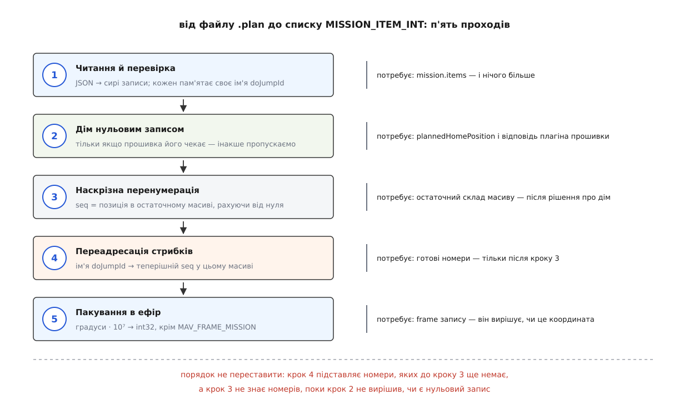

# ⚙️ Від файлу .plan до плаского списку MISSION_ITEM_INT

Ось повний робочий код, який бере збережений файл `.plan` і повертає масив записів `MISSION_ITEM_INT`, готових піти на борт — з проставленими наскрізними номерами й із переадресованими стрибками. Це доводиться писати кожному, хто вивантажує місію без графічного застосунку: скриптом на польовому ноутбуці, стендом автотестів, мостом між сервером завдань і апаратом.

## Задача

Дано файл, збережений станцією. Треба дістати з нього рівно те, що піде в ефір, — і нічого понад те. Ані більше (жодних режимів висоти, висот рельєфу, полігонів), ані менше (номери мусять бути проставлені, а стрибки — вказувати куди слід).

Всередині файлу — звичайний JSON:

```json
{
    "fileType":      "Plan",
    "version":       1,
    "groundStation": "QGroundControl",
    "mission": {
        "version":                2,
        "firmwareType":           12,
        "vehicleType":            2,
        "cruiseSpeed":            15,
        "hoverSpeed":             5,
        "globalPlanAltitudeMode": 1,
        "plannedHomePosition":    [47.3977419, 8.5455938, 488.0],
        "items":                  [ ... ]
    },
    "geoFence":    { "circles": [], "polygons": [], "version": 2 },
    "rallyPoints": { "points": [], "version": 2 }
}
```

Один елемент масиву `items` виглядає так:

```json
{
    "type":                "SimpleItem",
    "command":             16,
    "frame":               3,
    "params":              [0, 0, 0, null, 47.3977419, 8.5455938, 50],
    "doJumpId":            4,
    "autoContinue":        true,
    "Altitude":            50,
    "AltitudeMode":        1,
    "AMSLAltAboveTerrain": null
}
```

Специфікація формату описує ключ `params` дослівно як «`MISSION_ITEM`.param1,2,3,4,x,y,z» — сім комірок, де п'ята й шоста це широта й довгота **у градусах**, а сьома — висота. Три ключі з великої літери (`Altitude`, `AltitudeMode`, `AMSLAltAboveTerrain`) редакторські: вони потрібні, щоб при відкритті файлу відновити той самий вигляд полів, і в ефір не йдуть узагалі. У ефір іде `frame` і `params`.

Ключ `globalPlanAltitudeMode` у секції `mission` — теж редакторський: специфікація каже, що це «глобальний режим висоти на весь план, який беруть ті елементи, що не вказали власного `AltitudeMode`». Для нашої задачі він марний: висота, яка полетить на борт, уже лежить у `params[6]`, а система відліку — у `frame`. Про те, чому цих ключів у файлі аж чотири й чим вони різняться, є [окрема тема про рельєф і режими висоти](book:qgroundcontrol/terrain-and-altitude).

## Один елемент файлу — один запис

Логічно було б чекати, що галочка «знімати кожні 20 м», причеплена до точки, лежить у тому ж об'єкті `SimpleItem`, — і що її доведеться звідти витягати й перетворювати на окрему команду. Так не є, і причина в тому, як влаштоване збереження:

```cpp
void SimpleMissionItem::save(QJsonArray& missionItems)
{
    QList<MissionItem*> items;

    appendMissionItems(items, this);      // основний запис + камера + швидкість

    for (int i = 0; i < items.count(); i++) {
        MissionItem* item = items[i];
        QJsonObject saveObject;
        item->save(saveObject);
        if (i == 0) {
            // це головний елемент — тільки йому дописуємо дані про висоту
        }
        missionItems.append(saveObject);
        item->deleteLater();
    }
}
```

Розгортання відбувається **під час збереження**. У масиві `items` уже лежить плаский список: точка, за нею `DO_SET_CAM_TRIGG_DIST`, за нею `DO_CHANGE_SPEED` — кожна окремим об'єктом `"type": "SimpleItem"`. Задача від цього спрощується різко: кожен `SimpleItem` дає рівно один запис, і розгортати нема чого.

Виняток один, зате великий — `ComplexItem`. Полігон зйомки зберігається своїми параметрами: вершини, кут галсів, перекриття знімків. Щоб дістати з нього сотню точок, треба повторити всю геометрію розкрою, а це не «ще один прохід по масиву», а окремий підпроєкт (як саме будується розкрій — у [темі про патерни зйомки](book:qgroundcontrol/survey-patterns)). Чесна поведінка тут одна: зупинитися й сказати вголос.

## Чому номер у файлі не є номером

Кожен `SimpleItem` має ключ `doJumpId`. Пишеться він одним рядком:

```cpp
json[_jsonDoJumpIdKey] = _sequenceNumber;
```

Отже, **ім'я елемента — це номер, який елемент мав у мить збереження**. Звідси й формулювання специфікації, що `doJumpId` нумерується автоматично «починаючи з одиниці»: нуль у редакторі зайнято рядком налаштувань місії, тому першому справжньому елементові дістається одиниця.

А тепер найтонше місце всієї задачі. У записі `DO_JUMP` перший параметр — номер цілі. У мить збереження цей номер дорівнює номерові цільового елемента, а номер цільового елемента — це і є його `doJumpId`. Одне й те саме число опиняється у файлі двічі, у двох різних ролях: у `params[0]` стрибка воно виглядає як **позиція**, у `doJumpId` цілі — як **ім'я**.

Прочитати його треба як ім'я. Прочитати як позицію — спокуса, бо в мить збереження це було правдою. Але правдою воно бути перестає, щойно змінюється склад масиву, — а він змінюється прямо тут, усередині нашого конвертера.

> 🔧 **Навіщо це.** Якщо ваш скрипт вивантаження одного дня «стрибнув не туди», перевіряйте не файл і не автопілот, а саме цей рядок конвертера. Число в `params[0]` завжди виглядає правдоподібним номером, тому помилка не ловиться ні перевіркою формату, ні перевіркою місії на борту: список коректний, номери в межах, автопілот приймає. Ціна знаходиться в польоті.

## Дім, який зсуває все

Запланована домашня позиція лежить у файлі окремим ключем `plannedHomePosition` — масивом із широти, довготи й абсолютної висоти, — а не елементом масиву `items`. Чи піде вона в ефір нульовим записом місії, вирішує не файл, а [плагін прошивки](book:qgroundcontrol/firmware-plugin): одні автопілоти чекають, що елемент 0 — це дім, інші вважають нульовим елементом першу справжню команду.

Рішення бінарне, а наслідок — зсув усіх номерів на одиницю.

**Порахуймо: той самий файл, дві прошивки.**

```text
файл (імена doJumpId проставлено під час збереження)
  items[0]  ім'я 1   NAV_TAKEOFF
  items[1]  ім'я 2   NAV_WAYPOINT              ← ціль стрибка
  items[2]  ім'я 3   NAV_WAYPOINT
  items[3]  ім'я 4   DO_SET_CAM_TRIGG_DIST
  items[4]  ім'я 5   DO_JUMP,  params[0] = 2

без нульового дому                 з нульовим домом
  seq 0  NAV_TAKEOFF                 seq 0  дім
  seq 1  NAV_WAYPOINT   ← ім'я 2     seq 1  NAV_TAKEOFF
  seq 2  NAV_WAYPOINT                seq 2  NAV_WAYPOINT   ← ім'я 2
  seq 3  DO_SET_CAM_TRIGG_DIST       seq 3  NAV_WAYPOINT
  seq 4  DO_JUMP,  param1 = 1        seq 4  DO_SET_CAM_TRIGG_DIST
                                     seq 5  DO_JUMP,  param1 = 2

одне й те саме число 2 у файлі дає param1 = 1 або param1 = 2
```

Конвертер, який просто переписує `params[0]` у `param1`, відправить двійку в обох випадках. З нульовим домом він випадково має рацію; без нього — посилає апарат стрибати на зліт замість першої точки.

## П'ять проходів, і порядок не переставити



*Кожен наступний прохід потребує того, що дав попередній, — тому це саме конвеєр, а не набір незалежних правок.*

Залежності жорсткі, і саме вони диктують порядок. Переадресація стрибків підставляє теперішні номери — отже, номери на цей момент мусять бути готові. Перенумерація дає номер за позицією в остаточному масиві — отже, склад масиву мусить бути остаточним, а він залежить від рішення про дім. Пакування дивиться на `frame`, щоб вирішити, множити координати чи ні. Спроба зробити все за один прохід по масиву обов'язково зламає стрибки: коли ви читаєте `DO_JUMP`, ціль може бути ще попереду й номера не мати.

## Сім комірок, яких колись було чотири

Перш ніж писати читання, варто взяти будь-який старий файл — хоча б із тестових даних самого проєкту — і подивитися на елемент:

```json
{
    "autoContinue": true,
    "command":      22,
    "coordinate":   [47.63311996, -122.090763, 20],
    "doJumpId":     1,
    "frame":        3,
    "params":       [0, 0, 0, null],
    "type":         "SimpleItem"
}
```

Тут `params` має чотири комірки, а координата лежить окремим ключем `coordinate`. Це не зіпсований файл — це попередня версія форми елемента, і застосунок читає її й досі. Усередині `MissionItem::load()` стоять два послідовні перетворення, і тільки після них перевіряється, що параметрів рівно сім:

```cpp
if (!_convertJsonV1ToV2(json, convertedJson, errorString)) {
    return false;
}
if (!_convertJsonV2ToV3(convertedJson, errorString)) {
    return false;
}
```

Найдавніша форма тримала кожен параметр окремим ключем; наступна звела перші чотири в масив, лишивши координату збоку; теперішня склала всі сім в один масив. Перетворення з другої в третю саме й дописує до `params` широту, довготу й висоту з ключа `coordinate`, а сам ключ прибирає.

Конвертер, який цього не робить, спотикається на першому ж елементі будь-якого файлу зі старою формою запису — а плани зберігають роками й возять між машинами, тому такі файли трапляються постійно. Тож нормалізація форми — не витончена сумісність, а частина читання.

## Код

Перший прохід — читання й перевірка. Кожен запис забирає з файлу своє ім'я `doJumpId` і несе його далі; координати лишаються градусами аж до останнього кроку.

:::tabs
```cpp
#include <QFile>
#include <QHash>
#include <QJsonArray>
#include <QJsonDocument>
#include <QJsonObject>
#include <QJsonParseError>
#include <QString>
#include <QVector>
#include <QtGlobal>
#include <QtMath>

#include <mavlink/common/mavlink.h>

// Один запис місії: рівно ті поля, що є в MISSION_ITEM_INT, плюс ім'я з файлу.
struct Record {
    quint16 command      = 0;
    quint8  frame        = 0;
    quint8  autocontinue = 1;
    double  params[7]    {};    // param1..4, x, y, z — координати в ГРАДУСАХ
    int     doJumpId     = -1;  // ім'я з файлу; -1 = імені немає
    quint16 seq          = 0;   // проставить перенумерація
    quint8  current      = 0;
};

// NaN у файлі записано як null: JSON не має способу зобразити NaN числом, тому
// застосунок пише null і на завантаженні чекає саме null.
static double numberOrNaN(const QJsonValue& value)
{
    return (value.isNull() || value.isUndefined()) ? qQNaN() : value.toDouble();
}

// Старіша форма елемента клала в params лише param1..param4, а координату —
// окремим ключем "coordinate": [широта, довгота, висота]. Зводимо до теперішньої
// форми, інакше спіткнемося на першому ж елементі старого файлу.
static QJsonArray sevenParams(const QJsonObject& obj, QString& err)
{
    QJsonArray params = obj.value(QStringLiteral("params")).toArray();

    if (params.count() == 4 && obj.contains(QStringLiteral("coordinate"))) {
        const QJsonArray coordinate = obj.value(QStringLiteral("coordinate")).toArray();
        if (coordinate.count() != 3) {
            err = QStringLiteral("ключ coordinate має бути [широта, довгота, висота]");
            return {};
        }
        for (const QJsonValue& value : coordinate) {
            params.append(value);
        }
    }

    if (params.count() != 7) {
        err = QStringLiteral("очікується рівно 7 параметрів, знайдено %1").arg(params.count());
        return {};
    }
    return params;
}

static bool recordFromSimpleItem(const QJsonObject& obj, Record& rec, QString& err)
{
    const QJsonArray params = sevenParams(obj, err);
    if (params.isEmpty()) {
        return false;
    }

    rec.command      = static_cast<quint16>(obj.value(QStringLiteral("command")).toInt());
    rec.frame        = static_cast<quint8>(obj.value(QStringLiteral("frame")).toInt());
    rec.autocontinue = obj.value(QStringLiteral("autoContinue")).toBool(true) ? 1 : 0;
    rec.doJumpId     = obj.value(QStringLiteral("doJumpId")).toInt(-1);

    for (int i = 0; i < 7; i++) {
        rec.params[i] = numberOrNaN(params.at(i));
    }
    return true;
}

// Проходи 1 і 2: читання масиву items і — за потреби — дім нульовим записом.
static bool recordsFromPlan(const QJsonObject& plan, bool homeAsItemZero,
                            QVector<Record>& records, QString& err)
{
    const QJsonObject mission = plan.value(QStringLiteral("mission")).toObject();
    const QJsonArray  items   = mission.value(QStringLiteral("items")).toArray();

    if (items.isEmpty()) {
        err = QStringLiteral("масив items порожній: порожня місія і відсутня місія — різні речі");
        return false;
    }

    if (homeAsItemZero) {
        const QJsonArray home = mission.value(QStringLiteral("plannedHomePosition")).toArray();
        if (home.count() != 3) {
            err = QStringLiteral("plannedHomePosition має бути [широта, довгота, висота AMSL]");
            return false;
        }
        Record rec;
        rec.command   = MAV_CMD_NAV_WAYPOINT;
        rec.frame     = MAV_FRAME_GLOBAL;        // дім завжди в абсолютній висоті
        rec.params[4] = home.at(0).toDouble();
        rec.params[5] = home.at(1).toDouble();
        rec.params[6] = home.at(2).toDouble();
        records.append(rec);
    }

    for (int i = 0; i < items.count(); i++) {
        const QJsonObject obj  = items.at(i).toObject();
        const QString     kind = obj.value(QStringLiteral("type")).toString();

        if (kind == QLatin1String("SimpleItem")) {
            Record rec;
            if (!recordFromSimpleItem(obj, rec, err)) {
                err = QStringLiteral("items[%1]: %2").arg(i).arg(err);
                return false;
            }
            records.append(rec);
        } else if (kind == QLatin1String("ComplexItem")) {
            err = QStringLiteral("items[%1]: складений елемент «%2» зберігається параметрами "
                                 "й розгортається не тут")
                      .arg(i)
                      .arg(obj.value(QStringLiteral("complexItemType")).toString());
            return false;
        } else {
            err = QStringLiteral("items[%1]: невідомий тип елемента «%2»").arg(i).arg(kind);
            return false;
        }
    }
    return true;
}
```
```python
"""Складання плаского списку записів місії з файлу .plan."""
import json
import math
from dataclasses import dataclass, field

MAV_FRAME_GLOBAL     = 0
MAV_FRAME_MISSION    = 2
MAV_CMD_NAV_WAYPOINT = 16
MAV_CMD_DO_JUMP      = 177


class PlanError(Exception):
    """Файл прочитано, але зібрати з нього місію не можна."""


@dataclass
class Record:
    """Один запис місії: ті самі поля, що в MISSION_ITEM_INT, плюс ім'я з файлу."""
    command:      int
    frame:        int
    params:       list          # param1..4, x, y, z — координати в ГРАДУСАХ
    autocontinue: int = 1
    do_jump_id:   int = -1      # -1 = імені немає
    seq:          int = 0       # проставить перенумерація
    current:      int = 0


def _number(value):
    """NaN у файлі записано як null: JSON не має способу зобразити NaN числом."""
    return math.nan if value is None else float(value)


def _seven_params(obj):
    """Старіша форма елемента клала в params лише param1..param4, а координату —
    окремим ключем coordinate: [широта, довгота, висота]. Зводимо до теперішньої
    форми, інакше спіткнемося на першому ж елементі старого файлу."""
    params = list(obj["params"])

    if len(params) == 4 and "coordinate" in obj:
        coordinate = obj["coordinate"]
        if len(coordinate) != 3:
            raise PlanError("ключ coordinate має бути [широта, довгота, висота]")
        params += list(coordinate)

    if len(params) != 7:
        raise PlanError(f"очікується рівно 7 параметрів, знайдено {len(params)}")
    return params


def _record_from_simple_item(obj):
    return Record(
        command      = int(obj["command"]),
        frame        = int(obj["frame"]),
        params       = [_number(p) for p in _seven_params(obj)],
        autocontinue = 1 if obj.get("autoContinue", True) else 0,
        do_jump_id   = int(obj.get("doJumpId", -1)),
    )


def records_from_plan(plan, home_as_item_zero):
    """Проходи 1 і 2: читання масиву items і — за потреби — дім нульовим записом."""
    mission = plan["mission"]
    items = mission["items"]
    if not items:
        raise PlanError("масив items порожній: порожня місія і відсутня місія — різні речі")

    records = []

    if home_as_item_zero:
        home = mission["plannedHomePosition"]
        if len(home) != 3:
            raise PlanError("plannedHomePosition має бути [широта, довгота, висота AMSL]")
        records.append(Record(
            command = MAV_CMD_NAV_WAYPOINT,
            frame   = MAV_FRAME_GLOBAL,          # дім завжди в абсолютній висоті
            params  = [0.0, 0.0, 0.0, 0.0,
                       float(home[0]), float(home[1]), float(home[2])],
        ))

    for i, obj in enumerate(items):
        kind = obj.get("type")
        if kind == "SimpleItem":
            try:
                records.append(_record_from_simple_item(obj))
            except (PlanError, KeyError, TypeError) as exc:
                raise PlanError(f"items[{i}]: {exc}") from exc
        elif kind == "ComplexItem":
            raise PlanError(
                f"items[{i}]: складений елемент «{obj.get('complexItemType')}» "
                "зберігається параметрами й розгортається не тут")
        else:
            raise PlanError(f"items[{i}]: невідомий тип елемента «{kind}»")

    return records
```
:::

Проходи третій і четвертий — власне те, задля чого весь конвеєр і потрібен. Перенумерація тривіальна; переадресація будує словник «ім'я → теперішній номер» і підставляє з нього. Словник заразом ловить збіг імен: у файлі, збереженому станцією, імена унікальні за побудовою, але файл могли зліпити скриптом або склеїти вручну, і тоді стрибок став би двозначним.

:::tabs
```cpp
// Прохід 3: номер — це позиція в остаточному масиві, рахуючи від нуля.
static void renumber(QVector<Record>& records)
{
    for (int i = 0; i < records.count(); i++) {
        records[i].seq     = static_cast<quint16>(i);
        records[i].current = (i == 0) ? 1 : 0;
    }
}

// Прохід 4: ім'я doJumpId → теперішній номер. Тільки після перенумерації.
static bool retargetJumps(QVector<Record>& records, QString& err)
{
    QHash<int, quint16> seqByName;
    for (const Record& rec : records) {
        if (rec.doJumpId < 0) {
            continue;
        }
        if (seqByName.contains(rec.doJumpId)) {
            err = QStringLiteral("ім'я doJumpId %1 трапляється двічі — стрибок став би двозначним")
                      .arg(rec.doJumpId);
            return false;
        }
        seqByName.insert(rec.doJumpId, rec.seq);
    }

    for (Record& rec : records) {
        if (rec.command != MAV_CMD_DO_JUMP) {
            continue;
        }
        if (qIsNaN(rec.params[0])) {
            err = QStringLiteral("DO_JUMP без цілі: у param1 лежить NaN");
            return false;
        }

        const int name = static_cast<int>(rec.params[0]);
        const auto it  = seqByName.constFind(name);
        if (it == seqByName.constEnd()) {
            err = QStringLiteral("DO_JUMP посилається на ім'я %1, якого в плані немає").arg(name);
            return false;
        }
        rec.params[0] = *it;
    }
    return true;
}
```
```python
def renumber(records):
    """Прохід 3: номер — це позиція в остаточному масиві, рахуючи від нуля."""
    for i, rec in enumerate(records):
        rec.seq     = i
        rec.current = 1 if i == 0 else 0


def retarget_jumps(records):
    """Прохід 4: ім'я doJumpId → теперішній номер. Тільки після перенумерації."""
    seq_by_name = {}
    for rec in records:
        if rec.do_jump_id < 0:
            continue
        if rec.do_jump_id in seq_by_name:
            raise PlanError(
                f"ім'я doJumpId {rec.do_jump_id} трапляється двічі — "
                "стрибок став би двозначним")
        seq_by_name[rec.do_jump_id] = rec.seq

    for rec in records:
        if rec.command != MAV_CMD_DO_JUMP:
            continue
        if math.isnan(rec.params[0]):
            raise PlanError("DO_JUMP без цілі: у param1 лежить NaN")

        name = int(rec.params[0])
        if name not in seq_by_name:
            raise PlanError(f"DO_JUMP посилається на ім'я {name}, якого в плані немає")
        rec.params[0] = float(seq_by_name[name])
```
:::

Останній прохід — пакування. Тут і живуть множення на 10⁷ та виняток для `MAV_FRAME_MISSION` (значення 2), яке означає «ця команда взагалі не про місце»: у такому записі п'ята й шоста комірки — просто числа, і множити їх було б безглуздо.

:::tabs
```cpp
// Ціле поле int32 не має NaN і не має «майже нуля» — або число, або відмова.
static bool packInt32(double value, const char* field, qint32& out, QString& err)
{
    if (qIsNaN(value)) {
        err = QStringLiteral("поле %1 не може бути NaN: воно ціле, а нулем підміняти не можна")
                  .arg(QLatin1String(field));
        return false;
    }
    // Межі перевіряємо ДО округлення: qRound64 від нескінченності або від числа
    // поза діапазоном дає невизначену поведінку, а не «велике число».
    if (!(value >= -2147483648.0 && value <= 2147483647.0)) {
        err = QStringLiteral("поле %1 (%2) не влазить у int32")
                  .arg(QLatin1String(field)).arg(value);
        return false;
    }
    out = static_cast<qint32>(qRound64(value));
    return true;
}

// Прохід 5: градуси → десятимільйонні частки градуса, крім MAV_FRAME_MISSION.
static bool toMissionItemInt(const Record& rec, mavlink_mission_item_int_t& out, QString& err)
{
    out = {};
    out.seq          = rec.seq;
    out.frame        = rec.frame;
    out.command      = rec.command;
    out.current      = rec.current;
    out.autocontinue = rec.autocontinue;
    out.mission_type = MAV_MISSION_TYPE_MISSION;
    // target_system і target_component проставляє той, хто відправлятиме.

    // Ці п'ять полів — float: NaN тут легальний і значущий («лиши як є»).
    out.param1 = static_cast<float>(rec.params[0]);
    out.param2 = static_cast<float>(rec.params[1]);
    out.param3 = static_cast<float>(rec.params[2]);
    out.param4 = static_cast<float>(rec.params[3]);
    out.z      = static_cast<float>(rec.params[6]);

    const bool spatial = (rec.frame != MAV_FRAME_MISSION);
    return packInt32(spatial ? rec.params[4] * 1e7 : rec.params[4], "x", out.x, err)
        && packInt32(spatial ? rec.params[5] * 1e7 : rec.params[5], "y", out.y, err);
}

// Увесь конвеєр в одному місці.
bool missionFromPlanFile(const QString& path, bool homeAsItemZero,
                         QVector<mavlink_mission_item_int_t>& mission, QString& err)
{
    QFile file(path);
    if (!file.open(QIODevice::ReadOnly)) {
        err = QStringLiteral("не відкривається %1: %2").arg(path, file.errorString());
        return false;
    }

    QJsonParseError parseError {};
    const QJsonDocument doc = QJsonDocument::fromJson(file.readAll(), &parseError);
    if (parseError.error != QJsonParseError::NoError) {
        err = QStringLiteral("зіпсований JSON: %1").arg(parseError.errorString());
        return false;
    }

    const QJsonObject plan = doc.object();
    if (plan.value(QStringLiteral("fileType")).toString() != QLatin1String("Plan")) {
        err = QStringLiteral("це не файл плану: ключ fileType не «Plan»");
        return false;
    }

    QVector<Record> records;
    if (!recordsFromPlan(plan, homeAsItemZero, records, err)) {   // проходи 1 і 2
        return false;
    }
    renumber(records);                                            // прохід 3
    if (!retargetJumps(records, err)) {                           // прохід 4
        return false;
    }

    mission.clear();
    mission.reserve(records.count());
    for (const Record& rec : records) {                           // прохід 5
        mavlink_mission_item_int_t item {};
        if (!toMissionItemInt(rec, item, err)) {
            return false;
        }
        mission.append(item);
    }
    return true;
}
```
```python
INT32_MIN, INT32_MAX = -2**31, 2**31 - 1


def _pack_int32(value, field):
    """Ціле поле не має NaN і не має «майже нуля» — або число, або відмова."""
    if math.isnan(value):
        raise PlanError(f"поле {field} не може бути NaN: воно ціле, "
                        "а нулем підміняти не можна")
    if not math.isfinite(value):
        raise PlanError(f"поле {field} не є скінченним числом")
    scaled = round(value)
    if not INT32_MIN <= scaled <= INT32_MAX:
        raise PlanError(f"поле {field} ({scaled}) не влазить у int32")
    return scaled


def to_mission_item_int(rec):
    """Прохід 5: градуси → десятимільйонні частки, крім MAV_FRAME_MISSION."""
    spatial = rec.frame != MAV_FRAME_MISSION
    return {
        "seq":          rec.seq,
        "frame":        rec.frame,
        "command":      rec.command,
        "current":      rec.current,
        "autocontinue": rec.autocontinue,
        # Ці п'ять — float: NaN тут легальний і значущий («лиши як є»).
        "param1": rec.params[0],
        "param2": rec.params[1],
        "param3": rec.params[2],
        "param4": rec.params[3],
        "x": _pack_int32(rec.params[4] * 1e7 if spatial else rec.params[4], "x"),
        "y": _pack_int32(rec.params[5] * 1e7 if spatial else rec.params[5], "y"),
        "z": rec.params[6],
    }


def mission_from_plan_file(path, home_as_item_zero):
    """Увесь конвеєр в одному місці."""
    with open(path, encoding="utf-8") as handle:
        plan = json.load(handle)

    if plan.get("fileType") != "Plan":
        raise PlanError("це не файл плану: ключ fileType не «Plan»")

    records = records_from_plan(plan, home_as_item_zero)   # проходи 1 і 2
    renumber(records)                                      # прохід 3
    retarget_jumps(records)                                # прохід 4
    return [to_mission_item_int(rec) for rec in records]   # прохід 5
```
:::

Словники з `to_mission_item_int` лягають прямо в `mav.mission_item_int_send(**record)` бібліотеки pymavlink, якщо дописати `target_system` і `target_component`. Далі починається діалог із бортом — «ось скільки елементів → надішли мені №N → підтвердження», — розібраний у темі про [обмін планом із апаратом](book:qgroundcontrol/plan-exchange).

## Складність і точність

Кожен із п'яти проходів іде по масиву один раз, словник імен дає сталий пошук — разом O(n) за часом і O(n) за пам'яттю. Сам застосунок шукає ціль стрибка вкладеним циклом, тобто за O(n²); для планів на кілька тисяч записів це все одно мілісекунди, тож словник тут не заради швидкості, а заради того, що він безкоштовно ловить збіг імен.

Цікавіше з точністю. Множення на 10⁷ вибрано так, щоб цілого поля вистачило на весь глобус із запасом:

```text
широта    90.0000000° · 10⁷ =    900 000 000
довгота  180.0000000° · 10⁷ =  1 800 000 000
межа int32                  =  2 147 483 647   → переповнення неможливе

одиниця останнього розряду:
  10⁻⁷° · 111 320 м/°  ≈  0.0111 м  ≈  1.11 см по меридіану
```

Тобто перевірка на переповнення в коді ніколи не спрацює на справжніх координатах — вона спрацює тільки на зіпсованих даних, і саме тому її варто лишити. Чому взагалі знадобилися цілі числа замість дробових, розібрано в темі про [MAVLink-місію та її команди](book:communications/mavlink-mission-items).

## Пастки

**Складений елемент — не «пропустити мовчки».** Спокуса написати `continue` замість помилки велика: код стає коротшим, файли з полігонами перестають падати. Наслідок гірший за падіння — виходить коротша місія, яка проходить усі перевірки, вивантажується й летить. Апарат просто не зробить зйомку, і дізнаєтесь ви про це після посадки, коли на карті пам'яті нема знімків.

**NaN — не нуль, і не «щось незрозуміле».** У MAVLink домовлено, що `NaN` означає «не чіпай, лиши як є». Для параметра «Yaw» точки маршруту нуль наказав би апаратові розвернутися на північ, тоді як `NaN` каже «байдуже, лети як летиш». У словнику команд така комірка позначена ключем `nanUnchanged`, а типове значення в ній — `null`, а не `0`. Тому `params` не можна пропускати через щось на кшталт «якщо не число, то нуль»: чотири з семи комірок — числа з рухомою комою й несуть NaN без утрат. А от п'ята й шоста в `MISSION_ITEM_INT` цілі — тут NaN не існує в принципі, і єдина чесна реакція на нього — відмова. У C++ перетворення NaN до `qint32` до того ж має невизначену поведінку: без перевірки ви отримаєте не «якесь дивне число», а що завгодно.

**Порожній `items` — окремий випадок, а не крайній.** Специфікація формату вимагає щонайменше один елемент, і не випадково: у протоколі місій «список із нуля елементів» — це команда стерти місію на борту. Файл, який випадково перетворився на таку команду, — не помилка формату, а помилка дії.

**`frame` — не режим висоти.** Ключі `AltitudeMode` й `AMSLAltAboveTerrain` лишилися в редакторі, але одна їхня тінь падає й на наш конвеєр. Режим «порахувати абсолютну висоту з рельєфу» дає в ефір звичайний `MAV_FRAME_GLOBAL`, а обчислене значення застосунок кладе просто в сьомий параметр:

```cpp
case QGroundControlQmlGlobal::AltitudeFrameCalcAboveTerrain:
    _missionItem.setFrame(MAV_FRAME_GLOBAL);
    _missionItem._param7Fact.setRawValue(qQNaN());
    _amslAltAboveTerrainFact.setRawValue(qQNaN());
    break;
```

Поки дані рельєфу не прийшли з сервера, у сьомому параметрі лежить `NaN` — і саме таким він потрапить у файл (як `null`). Конвертер прочитає його чесно й віддасть висоту `NaN`, бо `z` у записі — число з рухомою комою й NaN приймає. Планові, збереженому без мережі, варто не довіряти на слово: перевірка «жоден `params[6]` у координатних командах не є NaN» коштує один прохід і рятує від вивантаження місії з невизначеною висотою.
