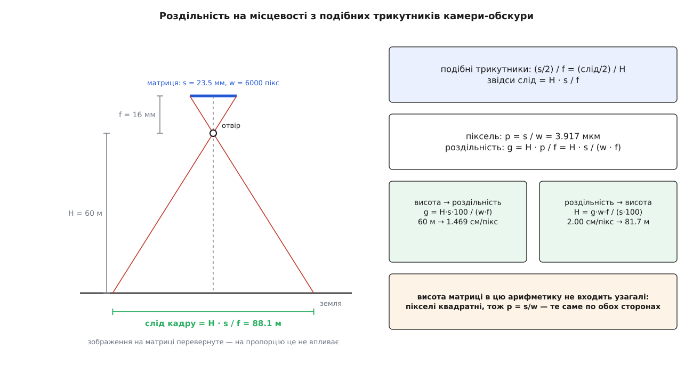
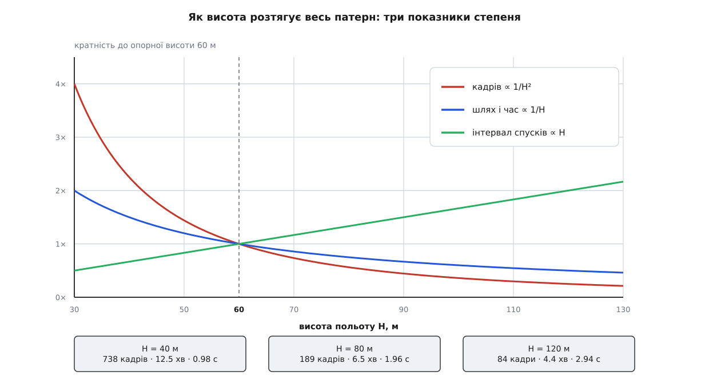
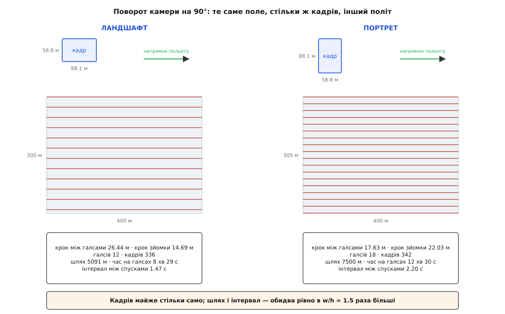

# 🧮 Арифметика сліду кадру: від подібних трикутників до інтервалу між спусками

Уся геометрія повітряної зйомки виводиться з однієї пропорції подібних трикутників і зводиться до п'яти чисел — роздільності на місцевості, двох кроків, кількості кадрів і часу між спусками; тут ця арифметика пройдена від виведення до повного числового прикладу й до відповіді на питання «що зміниться, якщо підняти висоту на двадцять метрів або додати п'ять відсотків перекриття».

## Пропорція, з якої все починається

Камера-обскура — це отвір і площинка за ним. Промінь від точки землі йде прямо крізь отвір і лягає на матрицю; жодних лінз у цій моделі немає, і саме тому вона така зручна для рахунку. Докладний розбір моделі з усіма внутрішніми параметрами — у [моделі камери-обскури](topic:algorithms/camera-model); тут потрібна лише її серцевина.

Візьмімо відрізок землі завдовжки `X`, що лежить рівно під отвором на відстані `H` від нього, і його зображення завдовжки `x` на матриці, віддаленій від отвору на `f`. Промінь із середини відрізка йде крізь отвір вертикально, промінь із його кінця — навскіс. Ці два промені відтинають знизу від отвору прямокутний трикутник із катетами `X/2` і `H`, а зверху — прямокутний трикутник із катетами `x/2` і `f`. Кути при вершині в них вертикальні, тобто рівні, тож трикутники подібні:

```
(x/2) / f = (X/2) / H     ⟹     X = H · x / f
```



*Ліворуч — геометрія, праворуч — та сама пропорція, розв'язана в обидва боки.*

Підставмо замість `x` усю ширину матриці `s` — і `X` стає **слідом кадру** на землі:

```
слід_поперек = H · s / f
```

Тепер поділімо слід на кількість пікселів у рядку `w`. Дістанемо, скільки землі припадає на один піксель, — **роздільність на місцевості**:

```
g = H · s / (w · f)
```

Відношення `s/w` — це фізичний розмір пікселя `p` (крок матриці). Підстановка робить формулу зовсім прозорою:

```
g = H · p / f
```

Роздільність — це висота, помножена на відношення «піксель до фокусної». Ані мегапікселі, ані фізичний розмір матриці окремо тут не важать: важить лише розмір одного пікселя й фокусна відстань.

**Числа для двадцятичотиримегапіксельної камери APS-C з об'єктивом 16 мм.**

```
s = 23.5 мм      w = 6000 пікс     f = 16 мм
p = 23.5 / 6000 = 0.0039167 мм = 3.9167 мкм

H = 60 м:
g = 60 · 0.0039167 / 16 = 0.0146875 м/пікс = 1.469 см/пікс
```

Рівність читається й у зворотний бік. Якщо замовник вимагає роздільність `g`, висота вже не вибирається — вона обчислюється:

```
H = g · w · f / (s · 100)          [g у см/пікс, H у метрах]

g = 2.00 см/пікс  →  H = 2.00 · 6000 · 16 / (23.5 · 100) = 81.7 м
g = 1.00 см/пікс  →  H = 1.00 · 6000 · 16 / (23.5 · 100) = 40.9 м
```

Сто в знаменнику — переведення сантиметрів у метри, більше нічого. І звідси одразу видно жорстку межу: якщо стеля польоту 120 метрів, найкраща досяжна роздільність із цим об'єктивом дорівнює `120 · 0.0039167 / 16 = 2.94 см/пікс`, і жодні налаштування її не покращать. Покращить лише довша фокусна: із `f = H · p / g` для `H = 120 м`, `p = 3.9167 мкм` і `g = 1 см/пікс` виходить `f = 47 мм`.

> 🔧 **Навіщо це.** У QGroundControl роздільність і висота — два стани одного поля вводу, і перемикач між ними не викликає окремого коду: та сама рівність розв'язується відносно різної невідомої. Тому висота, вписана вручну, і висота, отримана з вимоги «1 см на піксель», — це буквально одне число, здобуте з різних боків. У самому обчисленні бере участь **лише ширина** матриці: у джерелі застосунку висота матриці читається з паспорта камери й далі не використовується в жодній формулі, а слід уздовж польоту виводиться з кількості пікселів. Наслідок — прямокутник сліду має рівно пікселеве відношення сторін 6000:4000, а паспортні 23.5 × 15.6 мм у розрахунку поводяться як 23.5 × 15.667.

## Дві сторони сліду й два кроки

Слід кадру — прямокутник. Обидві його сторони — це та сама роздільність, помножена на кількість пікселів:

```
слід_поперек = w · g = 6000 · 0.0146875 = 88.125 м
слід_уздовж  = h · g = 4000 · 0.0146875 = 58.75 м
```

Перекриття перетворює сліди на кроки. Якщо сусідні кадри мають накладатися на `ov` відсотків, новою лишається частка `1 − ov`, і саме ця частка є відстанню між сусідніми положеннями камери:

```
крок між галсами = слід_поперек · (1 − поперечне) = 88.125 · 0.30 = 26.4375 м
крок зйомки      = слід_уздовж  · (1 − повздовжнє) = 58.75 · 0.25 = 14.6875 м
```

Одна перевірка варта того, щоб її зробити просто зараз. Скільки кадрів побачить довільну точку землі? Уздовж галса вона потрапляє в `слід_уздовж / крок_зйомки = 1/(1−повздовжнє)` кадрів, а таких галсів над нею проходить `1/(1−поперечне)`. Разом:

```
кадрів на точку = 1 / ((1 − поперечне)(1 − повздовжнє)) = 1 / (0.30 · 0.25) = 13.3
```

Фотограмметрії потрібно щонайменше три ракурси на точку, інакше [зіставляти ключові точки](topic:algorithms/feature-matching) немає між чим. Арифметична підлога для трьох ракурсів за рівних перекриттів виходить напрочуд низька: `(1−ov)² ≤ 1/3` дає `ov ≥ 42 %`. Практика вимагає 70–80 %, і розрив між 42 і 75 — це плата за припущення, яке щойно зроблено мовчки: підрахунок вважає весь слід однаково придатним, а насправді краї кадру спотворені, знято їх під кутом і зіставляються вони гірше за центр.

## Повний приклад: поле 400 × 300 метрів

Нехай галси йдуть уздовж довгої сторони, тож довжина галса `L = 400 м`, а поперечний розмір ділянки `B = 300 м`. Швидкість `v = 10 м/с`.

Кількість галсів. Лінії розгортки лягають від краю ділянки через `крок між галсами`; перша на нульовій відстані, остання — найдальша, що ще потрапляє в ділянку:

```
галсів = ⌊300 / 26.4375⌋ + 1 = ⌊11.348⌋ + 1 = 12
```

Кількість кадрів на галсі рахується так само: перший спуск відбувається на самому початку галса (у команді `DO_SET_CAM_TRIGG_DIST` третій параметр каже «зняти негайно»), далі через кожен крок зйомки:

```
кадрів на галс = ⌊400 / 14.6875⌋ + 1 = ⌊27.234⌋ + 1 = 28
усього кадрів  = 12 · 28 = 336
```

Формула `⌊x⌋ + 1` збігається зі звичним `⌈x⌉` завжди, крім випадку, коли `x` — ціле; сам застосунок у своєму лічильнику кадрів бере саме `⌈відстань / крок⌉` на кожен галс, тож розбіжність між обома підрахунками не перевищує одного кадру на галс. Хвіст, що лишається після останнього спуску (400 − 27 · 14.6875 = 3.4 м), непокритим не буває: слід кадру завдовжки 58.75 м перекриває його з великим запасом.

Довжина шляху — самі галси плюс переходи між ними:

```
шлях = 12 · 400 + 11 · 26.4375 = 4800 + 290.8 = 5090.8 м
час на галсах = 5090.8 / 10 = 509 с = 8 хв 29 с
інтервал між спусками = 14.6875 / 10 = 1.469 с
```

Ці 509 секунд — оцінка знизу, і застосунок дає саме її: він ділить пройдену відстань на швидкість, не знаючи нічого про прискорення. Мультикоптер, що гальмує й розганяється з `a = 2 м/с²`, витрачає на кожному розвороті приблизно `2v/a = 10 с` понад прямолінійний розрахунок. Одинадцять розворотів додають близько 110 секунд:

```
реальний час ≈ 509 + 110 = 619 с ≈ 10 хв 19 с
```

Ще дві перевірки, які коштують один рядок кожна. Пам'ять: 336 кадрів по 10 МБ у JPEG — 3.4 ГБ, у RAW по 24 МБ — 8.1 ГБ. Заряд: десять із гаком хвилин над ділянкою плюс переліт і резерв — для апарата з двадцятип'ятихвилинним ресурсом це один виліт, для п'ятнадцятихвилинного — два, і ділянку доведеться різати навпіл ще на етапі планування.

## Три показники степеня: чутливість до висоти

Тепер варто побачити не окремі числа, а те, як вони змінюються разом. Викиньмо крайові доданки й запишімо оцінки через площу `A = L · B = 120000 м²`:

```
шлях   ≈ A / крок_між_галсами
кадрів ≈ A / (крок_між_галсами · крок_зйомки)
```

Друга рівність — чиста бухгалтерія: площа ділиться на площу **нової** землі, яку приносить один кадр. Підставмо кроки через висоту:

```
крок_між_галсами = H · p · w · (1 − поперечне) / f
крок_зйомки      = H · p · h · (1 − повздовжнє) / f

кадрів ≈ A · f² / (H² · p² · w · h · (1−поперечне)(1−повздовжнє))
шлях   ≈ A · f  / (H  · p · w · (1−поперечне))
інтервал = H · p · h · (1 − повздовжнє) / (f · v)
```

Три показники степеня при `H`: **мінус два, мінус один, плюс один**.



*Одна зміна висоти рухає три величини в різні боки й з різною силою.*

Числа для того самого поля (перекриття 70/75, швидкість 10 м/с):

```
H, м    g, см/пікс   галсів   кадрів   шлях, м   час       інтервал, с
 40        0.979       18       738      7500    12 хв 30 с   0.979
 60        1.469       12       336      5091     8 хв 29 с   1.469
 80        1.958        9       189      3882     6 хв 28 с   1.958
120        2.938        6        84      2664     4 хв 26 с   2.938
```

Квадратичний закон видно неозброєним оком: 336 · (60/120)² = 84 — рівно стільки, скільки в таблиці. Подвоєння висоти забирає вчетверо менше кадрів, удвічі коротший політ і вдвічі просторіший інтервал, а платня одна — удвічі гірша роздільність. Це найдешевша ручка в усьому патерні, і крутити її треба першою.

Перекриття тягне за собою менше величин, зате нелінійно. Кадрів обернено пропорційно до добутку `(1−поперечне)(1−повздовжнє)`, тож приріст на один відсотковий пункт коштує `0.01/(1−ov)` частки:

```
з 70 % → +1 п.п. дає +3.3 % кадрів
з 85 % → +1 п.п. дає +6.7 % кадрів
```

Чим вище перекриття вже стоїть, тим дорожчий кожен наступний пункт. У числах:

```
перекриття    галсів   кадрів   шлях, м   час        інтервал, с   ракурсів
 60 / 70         9       207      3882     6 хв 28 с     1.763         8.3
 70 / 75        12       336      5091     8 хв 29 с     1.469        13.3
 80 / 80        18       630      7500    12 хв 30 с     1.175        25.0
 80 / 85        18       828      7500    12 хв 30 с     0.881        33.3
```

Останній рядок вартий уваги: перехід від 80/80 до 80/85 не додав ані метра шляху, ані секунди польоту — але додав двісті кадрів і забрав чверть інтервалу між спусками. Повздовжнє перекриття не коштує польоту, воно коштує камери.

Окремо — кут галсів. Головний доданок довжини шляху `A / крок_між_галсами` від кута не залежить узагалі; від кута залежить кількість розворотів, а з нею й крайові доданки. Галсів рівно стільки, скільки кроків укладається в розмір ділянки, виміряний **упоперек напрямку галсів**; для прямокутника 400 × 300 це `400·|sin α| + 300·|cos α|`. Повернувши сітку на 90°, дістанемо 16 галсів по 300 метрів:

```
α = 0°:   12 галсів по 400 м, шлях 5091 м, 11 розворотів
α = 90°:  16 галсів по 300 м, шлях 5197 м, 15 розворотів
```

Кадрів в обох випадках 336. Різниця в шляху — сто метрів, тобто десять секунд, плюс чотири зайві розвороти по десять секунд кожен: разом близько п'ятдесяти секунд із нічого. Правило звідси одне: галси кладуть уздовж **найдовшого** розміру ділянки.

## Інтервал між спусками — справжня межа

```
інтервал = крок_зйомки / v
```

Це все, що застосунок про нього знає: він ділить крок зйомки на швидкість і показує результат серед статистики патерна поряд із площею, відстанню між кадрами й кількістю знімків. Паспортний мінімальний інтервал камери теж зберігається — окремим полем поруч із фокусною відстанню й розміром матриці, і воно навіть переїжджає у файл плану, — але в жодну формулу не входить. Звірити обчислений інтервал із паспортним мусить людина.

Звідки взагалі береться паспортна межа. Між двома спусками камера повинна встигнути закрити затвор, зчитати матрицю, стиснути кадр, дописати службові поля й вивільнити буфер. Це не пропускна здатність картки — середній потік тут смішний, 10 МБ за 1.5 секунди дає 7 МБ/с, — це **затримка одного циклу**. Коли буфер переповнюється, камера просто перестає реагувати на спуск, і в місії з'являється діра, про яку ніхто не дізнається до вивантаження карти.

Нехай камера вимагає `інтервал ≥ 2.0 с`, а розрахунок дає 1.469. Важелів рівно чотири, і кожен має ціну.

**Перший: летіти повільніше.**

```
v ≤ крок_зйомки / інтервал_min = 14.6875 / 2.0 = 7.34 м/с
час = 5090.8 / 7.34 = 694 с = 11 хв 34 с      (+36 % до 8 хв 29 с)
```

Роздільність і кількість кадрів не змінюються взагалі — платимо самим часом.

**Другий: піднятися вище.** Розв'язуємо рівність інтервалу відносно `H`:

```
h · p = 4000 · 0.0039167 = 15.667 мм        (висота кадру в міліметрах матриці)

H = інтервал_min · v · f / (h · p · (1 − повздовжнє))
  = 2.0 · 10 · 16 / (15.667 · 0.25) = 81.7 м
```

На цій висоті `g = 2.00 см/пікс`, крок між галсами 36.0 м, галсів 9, кадрів 189, шлях 3888 м, час 6 хв 29 с. Політ став **коротшим** за початковий, кадрів майже вдвічі менше — але роздільність упала з 1.47 до 2.00 см/пікс. Це чесний обмін якості на все інше.

**Третій: зменшити повздовжнє перекриття.**

```
крок_зйомки ≥ v · інтервал_min = 20.0 м
1 − повздовжнє ≥ 20.0 / 58.75 = 0.340   ⟹   повздовжнє ≤ 66 %
```

Падіння з 75 до 66 % ріже кількість ракурсів на точку з 13.3 до 9.8 — реконструкція це переживе, але запас на невдалі кадри зникає.

**Четвертий: повернути камеру в портрет.** Крок зйомки стає `88.125 · 0.25 = 22.03 м`, інтервал — 2.20 с, вимога виконана без жодної втрати роздільності; ціна — політ 7500 метрів замість 5091, тобто 12 хв 30 с.

І тут арифметика дає коротку й точну відповідь на питання «що обрати». Порівняймо перший важіль із четвертим у безкрайовому наближенні. Уповільнення дає `T = шлях / (крок_зйомки/інтервал_min)`, портрет дає `T′ = шлях · w/h / v`, а інтервал у портреті дорівнює `інтервал · w/h`. Ділимо одне на друге:

```
T_уповільнення / T_портрет = інтервал_min / інтервал_портрет
```

Отже щоразу, коли портрет узагалі розв'язує задачу (тобто `інтервал_портрет ≥ інтервал_min`), просте вповільнення розв'язує її **швидше**. У числах: 11 хв 34 с проти 12 хв 30 с. Портрет лишається відповіддю для літака, який не може летіти повільніше за швидкість звалювання, — і саме для нього, а не для мультикоптера.

Поруч із інтервалом стоїть друге обмеження камери — **витримка**. Апарат рухається, і за час відкритого затвора зображення точки проповзає матрицею:

```
розмиття [пікселів] = v · витримка / g
```

Вимога «не більше пікселя» дає граничну витримку `витримка ≤ g / v`:

```
H = 60 м, v = 10 м/с:  0.0146875 / 10 = 1.47 мс ≈ 1/680 с
H = 60 м, v = 7.34:    0.0146875 / 7.34 = 2.0 мс = 1/500 с
H = 120 м, v = 10:     0.029375 / 10 = 2.94 мс ≈ 1/340 с
```

На 1/250 секунди при десяти метрах за секунду розмиття становить 2.7 пікселя, і жодна різкість об'єктива цього не врятує. Обидві межі камери зручно бачити разом через їх відношення:

```
інтервал / гранична_витримка = h · (1 − повздовжнє) = 4000 · 0.25 = 1000
```

Тобто камері дається на весь цикл запису рівно тисяча тих проміжків, за які апарат пролітає один піксель землі. Коли світла мало й тисячної частки не вистачає, лишається зйомка із зависанням: нерухомий апарат знімає з будь-якою витримкою, а замість п'яти кілометрів рівного польоту виходять триста зупинок.

## Ландшафт і портрет: що саме міняється

Роздільність не міняється **взагалі** — вона рахується з ширини матриці й ширини кадру незалежно від орієнтації. Міняються місцями лише сторони сліду:

```
ландшафт:  слід_поперек = w·g = 88.125    слід_уздовж = h·g = 58.75
портрет:   слід_поперек = h·g = 58.75     слід_уздовж = w·g = 88.125
```



*Портрет купує інтервал між спусками довжиною польоту — рівно в w/h раза й того, й того.*

Добуток двох кроків при цьому лишається незмінним: `w·h` симетричне до перестановки, тож `крок_між_галсами · крок_зйомки = 26.4375 · 14.6875 = 17.625 · 22.03125 = 388.30 м²` в обох випадках. А кадрів — це приблизно площа `A`, поділена на цей добуток; отже **кількість кадрів від орієнтації не залежить**:

```
                галсів   кадрів   шлях, м   час        інтервал, с
ландшафт          12       336      5091     8 хв 29 с    1.469
портрет           18       342      7500    12 хв 30 с    2.203
```

Різниця 336 проти 342 — то крайові доданки, не суть. А шлях і інтервал змінилися обидва в один бік і майже в однакове число разів: інтервал — рівно в `w/h = 1.5`, шлях — у 1.47 (те саме `w/h`, зіпсоване краями). Довший політ куплено просторішим інтервалом. Портрет не «ефективніший» і не «гірший» — це чистий обмін часу на терпимість камери за фіксованим курсом.

## Де ця арифметика перестає бути правдою

**Рельєф.** Усе вище припускає, що `H` — це відстань до поверхні. Якщо апарат тримає сталу висоту над точкою зльоту, а земля піднімається, справжня висота падає, слід стискається, а перекриття зменшується:

```
перекриття_справжнє = 1 − (1 − перекриття_план) · H_план / H_справжнє
```

Пагорб заввишки 20 м під шістдесятиметровим польотом (`H_справжнє = 40`):

```
поперечне:  1 − 0.30 · 60/40 = 0.55   →  55 % замість 70 %
повздовжнє: 1 − 0.25 · 60/40 = 0.625  →  62.5 % замість 75 %
```

Щоб над таким пагорбом поперечне не впало нижче 60 %, планувати треба з `1 − ov ≤ 0.40 · 40/60 = 0.267`, тобто **73.3 %**. Це і є ціна перепаду висот, порахована наперед; звідки застосунок бере профіль землі й що робить із ним — у темі про [рельєф і режими висоти в плані](topic:qgroundcontrol/terrain-and-altitude).

**Нахил камери.** Пропорція виведена для погляду точно вниз. Для точки, яку видно під кутом `θ` від надира, відстань до неї `H/cos θ`, а сама площинка землі ще й нахилена до променя. Роздільність псується несиметрично:

```
упоперек нахилу: g / cos θ
уздовж нахилу:   g / cos²θ

θ = 15°:  +3.5 % упоперек,  +7 % уздовж
θ = 30°:  +15 % упоперек,  +33 % уздовж
```

**Дифракція.** Роздільність на місцевості — це крок дискретизації, а не здатність розрізняти деталі. Об'єктив розмазує точку в пляму, діаметр якої за [дифракцією](topic:physics/diffraction) дорівнює приблизно `2.44 · λ · N`, де `N` — число діафрагми:

```
λ = 0.55 мкм,  N = 8:   2.44 · 0.55 · 8 = 10.7 мкм = 2.7 пікселя
λ = 0.55 мкм,  N = 4:                     5.4 мкм = 1.4 пікселя
пляма розміром у піксель:  N = 3.92 / (2.44 · 0.55) = 2.9
```

На f/8 із цією камерою справжня деталь коштує близько чотирьох сантиметрів, хоч у полі «роздільність» стоятиме 1.47. Число в застосунку чесне щодо геометрії й мовчазне щодо оптики.

**Точність висоти моделі.** Перекриття задає не лише кількість ракурсів, а й базу — відстань між двома точками зйомки. Класична стереопара дає похибку глибини (виведення — у [стереозорі](root:embedded/stereo-vision)), яку для повітряної зйомки зручно записати через уже відомі величини:

```
σ_висоти = (H / база) · g · σ_зіставлення        σ_зіставлення — у пікселях
H / база_уздовж = f / (h · p · (1 − повздовжнє))  — від висоти не залежить
```

При `σ_зіставлення = 0.3 пікселя`:

```
повздовжнє 75 %:  H/база = 16 / (15.667·0.25) = 4.09  →  σ = 4.09 · 1.469 · 0.3 = 1.80 см
повздовжнє 85 %:  H/база = 16 / (15.667·0.15) = 6.81  →  σ = 6.81 · 1.469 · 0.3 = 3.00 см
```

Ось де арифметика каже щось несподіване. Підняти повздовжнє перекриття з 75 до 85 % — це **погіршити** геометрію кожної окремої пари в 1.67 раза. Кількість ракурсів на точку при цьому росте з 4.0 до 6.7, і якщо вважати похибки зіставлення незалежними, усереднення дає `1.80/√4 = 0.90 см` проти `3.00/√6.7 = 1.16 см` — тобто високе повздовжнє перекриття не окупає себе точністю **за цим припущенням**. Окупає воно себе іншим: надлишковістю зіставлень, стійкістю до затінених і безфактурних клаптів, можливістю викинути невдалий кадр і не втратити ділянку.

А найкращу геометрію по висоті дає, як не дивно, не повздовжня, а поперечна пара: база між сусідніми галсами тут 26.44 метра проти 14.69 уздовж, тож `H/база = 60/26.44 = 2.27` і `σ = 2.27 · 1.469 · 0.3 = 1.00 см` — майже вдвічі краще. Саме тому поперечне перекриття ріжуть неохоче навіть тоді, коли ракурсів формально вистачає.
