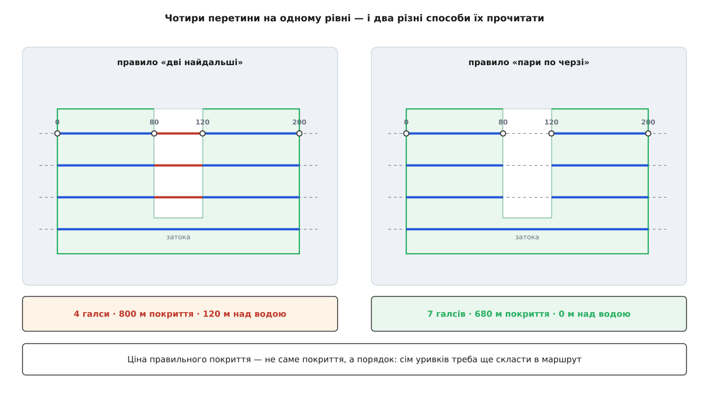

# ⚙️ Генератор галсів: від списку вершин до впорядкованого маршруту

Ось програма на C++, яка бере список вершин у місцевих метрах, кут і крок, а віддає впорядкований список галсів — той самий обчислювальний хребет, що в застосунку перемальовує сітку на кожен порух миші. Писати її варто не заради коду: три речі в цій задачі видно тільки в надрукованих числах — як невипуклий контур мовчки жене апарат над водою, чому фазу розгортки треба чіпляти за центр фігури, а не за її край, і чому один рядок-запобіжник **перед** циклом важить більше за все, що всередині нього.

### Задача

На вході чотири речі.

**Фігура** — список вершин замкненого простого контуру (сторони не перетинаються) у місцевій прямокутній системі: `x` на північ, `y` на схід, метри. Звідки така система береться й чому на масштабі кількох кілометрів кривина Землі в ній не заважає — у темі про [місцеву дотичну площину](topic:math/local-tangent-plane).

**Кут** `α` — напрямок галсів відносно півночі, у градусах. **Крок** `d` — відстань між сусідніми галсами, метри. **Розворотна ділянка** — на скільки метрів продовжити кінці кожного галса назовні, щоб літак устиг розвернутися поза ділянкою.

На виході — впорядкований список галсів. Кожен галс має початок і кінець, порядок у списку є порядком обльоту, а перша точка першого галса — місце, де апарат заходить на ділянку. Куди саме, вибирає п'ятий вхід — **кут входу**, один із чотирьох. Ніяких залежностей, ніякої геодезії всередині, лише арифметика над кількома десятками точок.

І одна вимога, яка тут неочевидна, але визначає всю форму коду: програма мусить бути **швидкою настільки, щоб її можна було ганяти на кожен кадр перемальовування**. Користувач тягне вершину мишею — сітка має повзти за курсором без затримки.

### Задум: один поворот робить задачу одновимірною

Провести під кутом `α` паралельні прямі й перетнути кожну з контуром можна й напряму. Але тоді кожна операція має справу з двома нетривіальними напрямками одразу: сторона контуру дивиться кудись, пряма дивиться кудись, і перетин доводиться шукати в загальному вигляді.

Уся хитрість у тому, щоб цього не робити. Повернімо **фігуру** на `−α` навколо якоїсь сталої точки. Галси в новій системі стають горизонтальними, і задача розсипається на одновимірні шматки: рівні розгортки — це просто числа `y`; перетин сторони з рівнем — це одна пропорція; галс — це пара чисел `x` на спільному `y`; порядок галсів — це порядок їхніх `y`. Наприкінці все повертається назад поворотом на `+α`, і жоден із проміжних кроків про кут уже не знає.

Поворот навколо точки — афінне перетворення, і воно зберігає все, що нас цікавить: прямі лишаються прямими, паралельність — паралельністю, довжини — довжинами. Тому результат, порахований у поверненій системі, після зворотного повороту є правильним відповіддям у вихідній; про клас таких перетворень — тема про [афінні перетворення](topic:math/affine-transform).

Далі — самі кроки, кожен на кілька рядків.

### Точка, поворот, рамка

```cpp
// збірка: g++ -std=c++17 -O2 transects.cpp -o transects
#include <algorithm>
#include <cmath>
#include <cstdio>
#include <utility>
#include <vector>

struct Vec2     { double x{}; double y{}; };            // x — на північ, y — на схід, метри
struct Transect { Vec2 a{}; Vec2 b{}; };                // галс: початок і кінець
struct Box      { double xLo{}, xHi{}, yLo{}, yHi{}; };

using Polygon = std::vector<Vec2>;

constexpr int    kMaxTransects = 1000;                  // стеля кількості галсів
constexpr double kMinLength    = 1e-6;                  // коротше — це дотик, а не галс
constexpr double kDegToRad     = 0.017453292519943295;  // π / 180

Vec2 rotate(const Vec2 &p, const Vec2 &c, double rad) {
    const double dx = p.x - c.x, dy = p.y - c.y;
    const double s = std::sin(rad), k = std::cos(rad);
    return { c.x + dx * k - dy * s, c.y + dx * s + dy * k };
}

Box bounds(const Polygon &poly) {
    Box b{ poly[0].x, poly[0].x, poly[0].y, poly[0].y };
    for (const Vec2 &p : poly) {
        b.xLo = std::min(b.xLo, p.x);  b.xHi = std::max(b.xHi, p.x);
        b.yLo = std::min(b.yLo, p.y);  b.yHi = std::max(b.yHi, p.y);
    }
    return b;
}

double clampAngle90(double deg) {
    while (deg >  90.0) deg -= 180.0;
    while (deg < -90.0) deg += 180.0;
    return deg;
}
```

Обмеження кута діапазоном `−90…90` виглядає косметикою, але воно змінює не набір ліній, а їхній **порядок**. Кути `α` і `α + 180°` дають ту саму сітку прямих — а от розгортка йде по ній у протилежні боки, тож перший галс стає останнім. Користувач, який поставив вхід у лівий нижній кут, отримав би його в правому верхньому, нічого для цього не зробивши. Перевіряється це в один рядок: кут `210°` після обмеження стає `30°`, і обидва дають той самий вивід. Цикл `while` замість одного віднімання потрібен лише для того, щоб функція не залежала від того, у якому діапазоні їй дали число.

### Півтори діагоналі: звідки береться запас

У QGroundControl поруч із рамкою стоїть число, яке спантеличує: довжина ліній розгортки береться як **півтори діагоналі** охопного прямокутника. Звідки півтори?

Причина в тому, що там повертають не фігуру, а самі лінії: охопна рамка рахується по **невернутій** фігурі, а лінія кладеться поверх неї вже під кутом. Найгірший випадок — коли лінія розвернута до рамки на сорок п'ять градусів; тоді щоб дістати від краю до краю, їй треба довжини в половину діагоналі. Півтори діагоналі — це той найгірший випадок із запасом у півсотні відсотків.

Головне тут не саме число, а його **розмірність**. У коді довго стояла стала «плюс дві тисячі метрів», і вона працювала — доти, доки не траплялася ділянка більша за десяток кілометрів: тоді найдовші галси просто обрізалися посередині. Запас, який має накривати фігуру, не може бути сталою в метрах, бо величина, яку він накриває, росте разом із фігурою. Діагональ росте разом — стала ні.

У формулюванні з поворотом фігури це число майже зникає. Рамку ми беремо вже по **поверненому** контуру, тож вона щільна. Перетинати ми будемо не відрізок, а **рівень** — нескінченну горизонталь, — тож ніякої довжини лінії взагалі не існує. Від діагоналі лишається одна робота, зате найважливіша: вона задає масштаб, від якого рахується запобіжник кроку.

### Перетин рівня з контуром

```cpp
// Усі x, у яких контур перетинає горизонталь y = yLine, за зростанням.
std::vector<double> crossings(const Polygon &poly, double yLine) {
    std::vector<double> xs;
    const size_t n = poly.size();
    for (size_t i = 0; i < n; ++i) {
        const Vec2 &p = poly[i];
        const Vec2 &q = poly[(i + 1) % n];
        if ((p.y > yLine) == (q.y > yLine)) continue;   // сторона не переходить рівень
        const double t = (yLine - p.y) / (q.y - p.y);   // знаменник тут не нуль
        xs.push_back(p.x + t * (q.x - p.x));
    }
    std::sort(xs.begin(), xs.end());
    return xs;
}
```

Умова `(p.y > yLine) == (q.y > yLine)` виглядає як звичайна перевірка «по різні боки», але вона напівзамкнена: кінець, що лежить **точно** на рівні, зараховується до нижніх. Це не дрібниця, і ламається все саме там, де рівень проходить рівно крізь вершину. Строга перевірка на різні знаки, `(p.y − y)·(q.y − y) < 0`, дає в цьому місці нуль замість добутку від'ємного числа — і жодна з двох сторін не зараховується, хоча контур рівень таки перетнув. Нестрога, з `≤`, кидається в протилежну крайність: вершину рахують обидві суміжні сторони, виходить двійка замість одиниці, та ще й горизонтальна сторона проходить у ділення на нуль.

З напівзамкненим правилом усе стає на місце само. Вершина, крізь яку контур **проходить** знизу вгору, дає рівно один перетин. Вершина-шпиль, від якої обидві сторони йдуть **униз**, не дає жодного — і правильно, бо рівень фігуру там лише торкає. Вершина-западина, від якої обидві сторони йдуть **угору**, дає два в одній точці — тобто галс нульової довжини, який ми потім відсіємо за довжиною. Це та сама парність, на якій стоїть [перевірка належності точки багатокутнику](topic:math/point-in-polygon): для простого контуру перетини завжди чергуються «увійшли — вийшли», і саме тому їх завжди парна кількість.

Друга дрібниця з великими наслідками — ділення на `q.y − p.y`. Воно ніколи не ділить на нуль, і не завдяки перевірці, а завдяки порядку: якщо `p.y == q.y`, обидва порівняння з `yLine` дають однаковий результат, і рядок з діленням просто недосяжний. Горизонтальні сторони контуру відсіюються тією ж умовою, що й усі інші, — окремої гілки для них не потрібно.

Третя — сортування. Воно тут не для краси. Відсортований список перетинів одразу дає і крайні точки, і пари «увійшли — вийшли», і напрямок галса. У QGroundControl перетини лишаються в порядку обходу сторін, і щоб знайти дві найдальші, код ганяє подвійний цикл — квадрат від кількости перетинів. На випуклій фігурі перетинів два, і квадрат непомітний; на гребінці з двохсот зубців їх чотириста, і квадрат уже видно.

### Розгортка

```cpp
std::vector<Transect> sweep(const Polygon &rotated, const Vec2 &centre,
                            double step, bool pairRule) {
    const Box b = bounds(rotated);
    const double diagonal = std::hypot(b.xHi - b.xLo, b.yHi - b.yLo);
    if (!(diagonal > 0.0)) return {};                   // усі вершини злилися в точку

    if (!(step > diagonal / kMaxTransects))              // ловить 0, від'ємне і NaN
        step = diagonal / kMaxTransects;

    const long kLo = static_cast<long>(std::ceil ((b.yLo - centre.y) / step - 0.5));
    const long kHi = static_cast<long>(std::floor((b.yHi - centre.y) / step - 0.5));

    std::vector<Transect> out;
    for (long k = kLo; k <= kHi; ++k) {
        const double yLine = centre.y + (static_cast<double>(k) + 0.5) * step;
        const std::vector<double> xs = crossings(rotated, yLine);
        if (xs.size() < 2) continue;

        if (pairRule) {
            for (size_t i = 0; i + 1 < xs.size(); i += 2)
                if (xs[i + 1] - xs[i] > kMinLength)
                    out.push_back({ { xs[i], yLine }, { xs[i + 1], yLine } });
        } else if (xs.back() - xs.front() > kMinLength) {
            out.push_back({ { xs.front(), yLine }, { xs.back(), yLine } });
        }
    }

    if (out.empty()) {                                   // крок ширший за всю фігуру
        const std::vector<double> xs = crossings(rotated, centre.y);
        if (xs.size() >= 2 && xs.back() - xs.front() > kMinLength)
            out.push_back({ { xs.front(), centre.y }, { xs.back(), centre.y } });
    }
    return out;
}
```

Тут три рішення варті окремої розмови.

**Запобіжник кроку.** Крок приходить із розрахунку камери, а той — з чисел, які набирає людина: фокусна відстань, розмір матриці, перекриття. Нуль у фокусній дає нуль у кроці, а нуль у кроці дає цикл, який не закінчується ніколи. Тому крок піднімають до `діагональ / 1000` — і саме звідси береться стеля: розгортка йде по відрізку, не довшому за діагональ, а отже галсів не може вийти більше за тисячу. Цикл стає **доказово скінченним ще до того, як почався**, і саме тому запобіжник стоїть перед ним, а не всередині.

Форма перевірки теж не випадкова. Написати `if (step < lo) step = lo;` було б природніше — і воно пропустило б `NaN`, бо **будь-яке** порівняння з `NaN` хибне (це, як і решта поведінки таких значень, закладено в [стандарт IEEE 754](topic:math/ieee754)). Заперечення `!(step > lo)` хибне лише тоді, коли `step` справді більший; `NaN` через нього не проходить. Різниця не теоретична: у нашій програмі крок `0`, від'ємний крок і `NaN` дають однаковий безпечний результат — 668 галсів по 0.4468 м.

**Фаза розгортки.** Рівні беруться не від нижнього краю рамки, а від центра: `centre.y + (k + 0.5)·step`. Центр — це центр охопної рамки **вихідної**, ще не поверненої фігури, тож він не залежить від кута. Якби фазу відлічували від краю рамки, то щойно користувач ворухнув повзунок кута, край поїхав би, а за ним поїхали б усі галси — сітка не оберталася б, а повзла. З центральною фазою поворот дає рівно поворот. Півкроку `+ 0.5` теж має причину: галс накриває смугу шириною в крок, тож класти його треба посередині своєї смуги, а не по краю.

**Запасний хід.** Якщо крок більший за фігуру, `kLo` виявляється більшим за `kHi`, цикл не виконується жодного разу — і користувач бачить порожнечу замість сітки. Замість порожнечі кладемо один галс через центр. На нашому полі з кроком у кілометр це дає один галс завдовжки 276.22 м — очевидно замало для зйомки, зате видимо на екрані, і зрозуміло, що крутити.

### Назад у вихідну систему, напрямок, змійка, вхід

```cpp
enum class Entry { BottomLeft, BottomRight, TopLeft, TopRight };

void alignDirections(std::vector<Transect> &t) {
    if (t.empty()) return;
    const double fx = t.front().b.x - t.front().a.x;
    const double fy = t.front().b.y - t.front().a.y;
    for (Transect &s : t)
        if ((s.b.x - s.a.x) * fx + (s.b.y - s.a.y) * fy < 0.0) std::swap(s.a, s.b);
}

void setEntry(std::vector<Transect> &t, Entry e) {
    const bool flipAlong  = (e == Entry::BottomRight || e == Entry::TopRight);
    const bool flipAcross = (e == Entry::TopLeft     || e == Entry::TopRight);
    if (flipAlong)  for (Transect &s : t) std::swap(s.a, s.b);
    if (flipAcross) std::reverse(t.begin(), t.end());
}

void makeSnake(std::vector<Transect> &t) {
    for (size_t i = 1; i < t.size(); i += 2) std::swap(t[i].a, t[i].b);
}

void extendEnds(std::vector<Transect> &t, double turnaround) {
    if (!(turnaround > 0.0)) return;
    for (Transect &s : t) {
        const double dx = s.b.x - s.a.x, dy = s.b.y - s.a.y;
        const double len = std::hypot(dx, dy);
        if (!(len > 0.0)) continue;
        const double ux = dx / len * turnaround, uy = dy / len * turnaround;
        s.a = { s.a.x - ux, s.a.y - uy };
        s.b = { s.b.x + ux, s.b.y + uy };
    }
}
```

`alignDirections` розвертає всі галси в один бік — і в нашій програмі вона не робить нічого, бо перетини вже відсортовані й кожен галс уже дивиться в бік зростання `x`. Функція лишається як **записаний інваріант**: вона коштує один скалярний добуток на галс і падає в очі тому, хто колись прибере сортування. Спосіб вирівнювання теж вибрано не навмання: знак скалярного добутку з першим галсом не має шва на межі `0°/360°`, який має порівняння кутів.

`setEntry` — найкоротша й найцікавіша функція. Обхід має чотири можливі початки, і всі чотири дістаються двома незалежними перевертаннями: перевернути точки **всередині** кожного галса (лівий кут міняється на правий) і перевернути **порядок** галсів (нижній міняється на верхній). Два булевих значення дають чотири кути — окремих гілок коду на кожен варіант не потрібно. У QGroundControl це два прапорці з тими самими іменами: `reversePoints` і `reverseTransects`.

`makeSnake` перевертає кожен другий галс. Після цього кінець одного галса є найближчою точкою до початку наступного — це і є «косильний» обхід. Тільки «найближча» не означає «близька»: на рваному краї фігури стрибок дорівнює `√(крок² + Δx²)`, де `Δx` — розбіжність кінців сусідніх галсів. У нашому прогоні при кроці 26.44 м найкоротший перескок вийшов 26.78 м, а найдовший — 68.91 м.

А тепер те, через що обидві ці функції довелося поставити саме в такому порядку: **вхід вибирають до змійки, а не після неї.**

Причина — у парності. `makeSnake` не чіпає нульовий галс: він перевертає лише непарні. Отже, якщо вхід виставлено **раніше**, перший галс списку йде в той бік, у який його поставили, і кут входу виходить такий, як обіцяно, — завжди. Якщо ж змійку побудувати першою, а вхід виставляти по готовому, перевертання порядку виносить наперед **останній** галс, а той перевернутий чи ні залежно від того, парна кількість галсів чи ні.

Це не умоглядне міркування, воно вимірюється. На нашому полі з кроком 26.44 м галсів одинадцять, і обидва порядки дають однаковісінький результат в усіх чотирьох кутах. Змініть крок на 24.00 м — галсів стає дванадцять, і «лівий верхній» зі «правим верхнім» міняються місцями: вхід зістрибує в протилежний кут ділянки від найменшого поруху повзунка перекриття. У QGroundControl вибір входу теж стоїть **перед** побудовою змійки — і тепер видно, що це не випадковість розкладки коду.

`extendEnds` подовжує кінці на розворотну ділянку вздовж власного напрямку галса. Робиться це одиничним вектором, а не додаванням до `x`, — і завдяки цьому функції байдуже, у якій системі її викликали й у який бік галс уже розвернутий.

### Складання

```cpp
std::vector<Transect> buildTransects(const Polygon &field, double angleDeg, double step,
                                     double turnaround, Entry entry, bool pairRule) {
    if (field.size() < 3) return {};

    const Box  fb = bounds(field);
    const Vec2 centre{ (fb.xLo + fb.xHi) / 2.0, (fb.yLo + fb.yHi) / 2.0 };
    const double alpha = clampAngle90(angleDeg) * kDegToRad;

    Polygon rotated;
    rotated.reserve(field.size());
    for (const Vec2 &p : field) rotated.push_back(rotate(p, centre, -alpha));

    std::vector<Transect> t = sweep(rotated, centre, step, pairRule);
    for (Transect &s : t) {
        s.a = rotate(s.a, centre, alpha);
        s.b = rotate(s.b, centre, alpha);
    }

    alignDirections(t);
    setEntry(t, entry);          // порядок важить: вхід — до змійки
    makeSnake(t);
    extendEnds(t, turnaround);
    return t;
}

double routeLength(const std::vector<Transect> &t) {
    double total = 0.0;
    for (size_t i = 0; i < t.size(); ++i) {
        total += std::hypot(t[i].b.x - t[i].a.x, t[i].b.y - t[i].a.y);
        if (i > 0) total += std::hypot(t[i].a.x - t[i - 1].b.x, t[i].a.y - t[i - 1].b.y);
    }
    return total;
}
```

Кожна вершина повертається **один раз із вихідних координат**, а не покроково від попередньої. Це не стиль, а точність: у нарощуваному повороті похибка накопичується від точки до точки, у прямому — ні.

### Що друкує програма

```cpp
int main() {
    const Polygon field{ {0.0, 0.0}, {50.0, 240.0}, {225.0, 275.0}, {275.0, 50.0}, {145.0, -50.0} };
    const double angle = 30.0, step = 26.44, turn = 30.0;

    const std::vector<Transect> bare = buildTransects(field, angle, step, 0.0,  Entry::BottomLeft, false);
    const std::vector<Transect> full = buildTransects(field, angle, step, turn, Entry::BottomLeft, false);

    double covered = 0.0;
    for (const Transect &s : bare) covered += std::hypot(s.b.x - s.a.x, s.b.y - s.a.y);

    std::printf("поле %zu вершин, кут %.1f, крок %.2f м, розворот %.1f м\n",
                field.size(), angle, step, turn);
    std::printf("галсів %zu, покриття %.2f м, маршрут %.2f м\n\n",
                bare.size(), covered, routeLength(full));

    for (size_t i = 0; i < bare.size(); ++i)
        std::printf("  %2zu  %7.2f м   (%8.2f,%8.2f) -> (%8.2f,%8.2f)\n", i,
                    std::hypot(bare[i].b.x - bare[i].a.x, bare[i].b.y - bare[i].a.y),
                    bare[i].a.x, bare[i].a.y, bare[i].b.x, bare[i].b.y);

    const char *corner[] = { "лівий нижній", "правий нижній", "лівий верхній", "правий верхній" };
    for (int e = 0; e < 4; ++e) {
        const std::vector<Transect> v =
            buildTransects(field, angle, step, turn, static_cast<Entry>(e), false);
        std::printf("\nвхід %s: (%.2f, %.2f)", corner[e], v.front().a.x, v.front().a.y);
    }
    std::printf("\n");
    return 0;
}
```

```
поле 5 вершин, кут 30.0, крок 26.44 м, розворот 30.0 м
галсів 11, покриття 2367.06 м, маршрут 3375.00 м

   0   185.96 м   (  113.07,  -38.99) -> (  274.11,   53.99)
   1   217.24 м   (  268.10,   81.05) -> (   79.96,  -27.57)
   2   248.53 м   (   46.86,  -16.16) -> (  262.09,  108.11)
   3   279.81 м   (  256.07,  135.16) -> (   13.75,   -4.74)
   4   283.87 м   (    4.23,   20.29) -> (  250.06,  162.22)
   5   268.57 м   (  244.05,  189.28) -> (   11.46,   54.99)
   6   253.28 м   (   18.69,   89.70) -> (  238.04,  216.34)
   7   237.99 м   (  232.02,  243.40) -> (   25.92,  124.40)
   8   222.70 м   (   33.15,  159.11) -> (  226.01,  270.46)
   9   135.45 м   (  157.68,  261.54) -> (   40.38,  193.81)
  10    33.67 м   (   47.61,  228.52) -> (   76.77,  245.35)

вхід лівий нижній: (87.09, -53.99)
вхід правий нижній: (300.09, 68.99)
вхід лівий верхній: (21.63, 213.52)
вхід правий верхній: (102.75, 260.35)
```

Маршрут 3375.00 м розкладається на три частини, і розклад повчальний: 2367.06 м корисного покриття, 347.94 м перескоків між галсами й 660.00 м розворотних ділянок — по 60 м на кожен з одинадцяти галсів. Тобто майже **третина** шляху не є зйомкою взагалі. Розворотна ділянка коштує тим дорожче, чим більше галсів, і саме тому в зйомці витягнутих ділянок кут галсів ставлять уздовж довгої сторони, а не впоперек: галсів менше — розворотів менше.

### Пастка невипуклого контуру на числах

Тепер увімкнімо друге правило й подивімося, за що воно.

Візьмімо поле 200 × 120 м, у північний край якого врізається затока ставка: смуга завширшки 40 м від `x = 80` до `x = 120`, завглибшки до `y = 30`. Це простий контур із восьми вершин, ніде себе не перетинає — і водночас невипуклий.

Розгортка з кроком 26.44 м кладе на нього чотири рівні, і ось що дають перетини:

```
y =  20.34   x = 0.00, 200.00
y =  46.78   x = 0.00, 80.00, 120.00, 200.00
y =  73.22   x = 0.00, 80.00, 120.00, 200.00
y =  99.66   x = 0.00, 80.00, 120.00, 200.00
```

Найнижчий рівень проходить під затокою і дає два перетини. Три верхні дають **чотири**: увійшли в поле на `x = 0`, вийшли в затоку на `80`, знову ввійшли на `120`, вийшли на `200`.

Правило «дві найдальші» бере з цієї четвірки крайні: `0` і `200`. Галс іде **навпростець через воду** — сорок метрів над затокою на кожному з трьох рівнів.



*Ті самі чотири числа на рівні читаються або як «від найлівішого до найправішого», або як «нульове з першим, друге з третім».*

Правило пар читає ту саму четвірку інакше: `0–80` усередині, `80–120` зовні, `120–200` усередині. Дописуємо в `main` десяток рядків, які проганяють обидва правила по одній фігурі:

```cpp
    const Polygon bay{ {0.0, 0.0}, {200.0, 0.0}, {200.0, 120.0}, {120.0, 120.0},
                       {120.0, 30.0}, {80.0, 30.0}, {80.0, 120.0}, {0.0, 120.0} };

    for (int pass = 0; pass < 2; ++pass) {
        const bool pairRule = (pass == 1);
        const std::vector<Transect> t = buildTransects(bay, 0.0, step, 0.0,  Entry::BottomLeft, pairRule);
        const std::vector<Transect> r = buildTransects(bay, 0.0, step, turn, Entry::BottomLeft, pairRule);

        double len = 0.0;
        for (const Transect &s : t) len += std::hypot(s.b.x - s.a.x, s.b.y - s.a.y);

        std::printf("%s: галсів %zu, покриття %.2f м, маршрут %.2f м\n",
                    pairRule ? "пари по черзі" : "дві найдальші", t.size(), len, routeLength(r));
    }
```

```
дві найдальші: галсів 4, покриття 800.00 м, маршрут 1119.32 м
пари по черзі: галсів 7, покриття 680.00 м, маршрут 1828.63 м
```

Різниця в покритті — рівно 120 метрів, тобто три прольоти по сорок. При кроці зйомки 14.69 м це вісім кадрів води: на воді немає за що зачепитися, спільних деталей між сусідніми знімками не знайдеться, і склеювання на цій ділянці просто розсиплеться.

А тепер найцікавіше. **Правильне покриття вийшло дорожчим за неправильне на сімсот метрів.** Причина не в покритті — воно, навпаки, менше. Причина в **порядку**: замість чотирьох галсів стало сім, кожен додатковий приніс свої шістдесят метрів розвороту, а змійка, яка йде просто за списком, після лівого уривка стрибає на правий і назад, ганяючи апарат через затоку туди-сюди.

Порядок і є справжня задача. Якщо ті самі сім уривків обійти не рядками, а **колонками** — спершу вся ліва частина знизу вгору, потім уся права згори вниз, — маршрут виходить 1448.64 м. Це вже розумно: 329 зайвих метрів проти «двох найдальших» за те, щоб не знімати воду.

Але «обійти колонками» — це вже не правило вибору пар, а окремий алгоритм: фігуру ріжуть на шматки, у кожному з яких розгортка дає рівно один суцільний галс на рівень, і обходять ці шматки як самостійні ділянки. Саме тому розбиття невипуклих полігонів у застосунку винесене в окремий перемикач, а не вбудоване в генератор: на випуклих ділянках, яких більшість, воно коштує зайвої роботи й не дає нічого. Загальна постановка — накрити площу смугами, не лишивши клаптів і не намотавши зайвого, — розібрана в темі про [покриття полігону галсами](topic:algorithms/survey-grid-coverage).

> 🔧 **Навіщо це.** Побачивши на карті галс, що йде через ставок, кар'єр чи чужу ділянку, не треба шукати збій — так поводиться правило «дві найдальші» на невипуклій фігурі. Виходів два: увімкнути розбиття або перекроїти фігуру так, щоб виріз зник, — зазвичай двома полігонами замість одного. Другий часто кращий, бо тоді ви самі вирішуєте, у якому порядку обходити частини.

### Складність і на чому спотикаються

Робота розгортки — `N` рівнів на `M` сторін контуру, плюс сортування перетинів на кожному рівні: `O(N·M + N·k·log k)`, де `k` — кількість перетинів на рівні, для випуклої фігури рівно два. Запобіжник тримає `N ≤ 1000`, тож для двадцятивершинного контуру це двадцять тисяч арифметичних дій — мікросекунди. Ось чому ця частина може виконуватися на кожен порух миші, а та частина, що йде по мережу за висотами рельєфу, — ні.

Пам'ять — `O(N)` на галси і `O(k)` на перетини одного рівня, який щоразу починається з нуля.

Сім місць, де ця задача найчастіше кусає:

**Порівняння з `NaN`.** Одне зіпсоване число на вході — і `if (step < lo)` пропускає його далі. Заперечена форма `!(step > lo)` не пропускає. Це стосується будь-якої перевірки діапазону над величиною, що прийшла з розрахунку, а не з константи.

**Рівень крізь вершину.** Напівзамкнене правило `(p.y > y) == (q.y > y)` — не мікрооптимізація, а єдине, що робить кількість перетинів послідовною. Порівняння на різні знаки та відсіювання дублікатів за точною рівністю чисел із рухомою комою обидва хибують: перше рахує вершину двічі, друге не зловить дубль, який розійшовся в останньому знаку.

**Обмеження кута.** Воно не про кут, а про порядок галсів і, отже, про те, у який кут потрапить вхід.

**Черговість перетворень.** Вибір входу й побудова змійки не переставні: перше має йти перед другим, інакше кут входу починає залежати від парності кількости галсів.

**Кінці за межами ділянки.** Розворотні точки лежать **поза** контуром — на них апарат може вийти за геозону, зачепити сусіднє поле або злетіти з дозволеної зони. Перша точка місії теж не на полі, і це нормально.

**Найближче ≠ близьке.** Змійка мінімізує перескок між сусідніми галсами, але на рваному краї він однаково буває втричі більшим за крок. Якщо радіус розвороту літака перевищує крок, «сусідній» галс узагалі не пролетіти — тоді галси обходять через один, і сусідом стає той, що за два кроки.

**Порядок уривків.** Щойно фігура перестала бути випуклою, задача перестала бути «де провести лінії» й стала «у якому порядку обходити шматки». Вибір пар — арифметика на п'ять рядків; порядок — окремий алгоритм із власною ціною.
