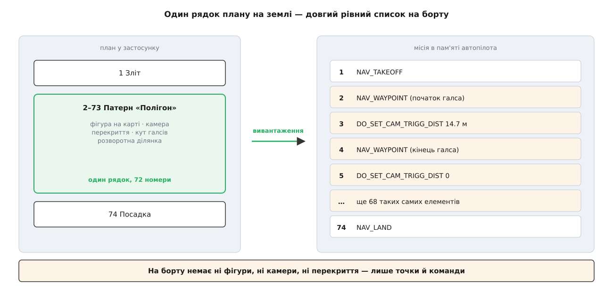
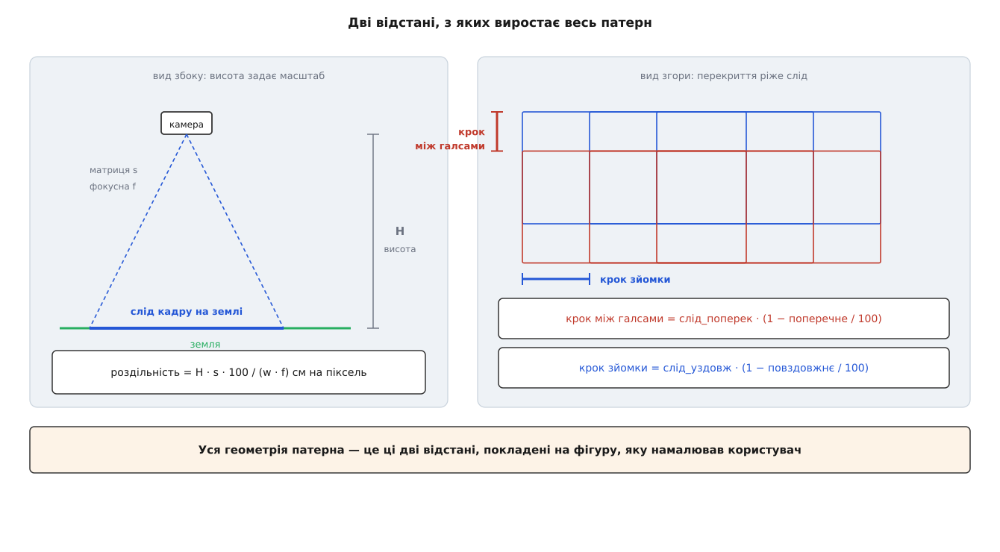
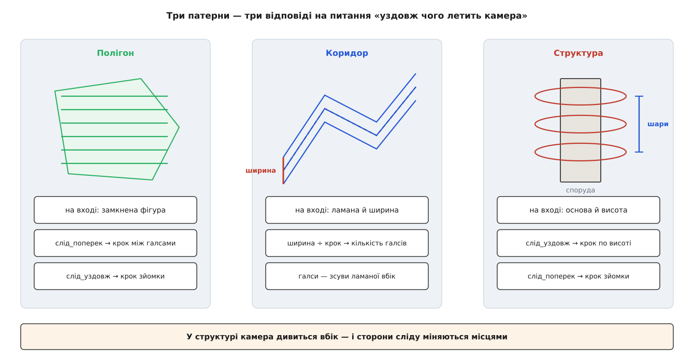
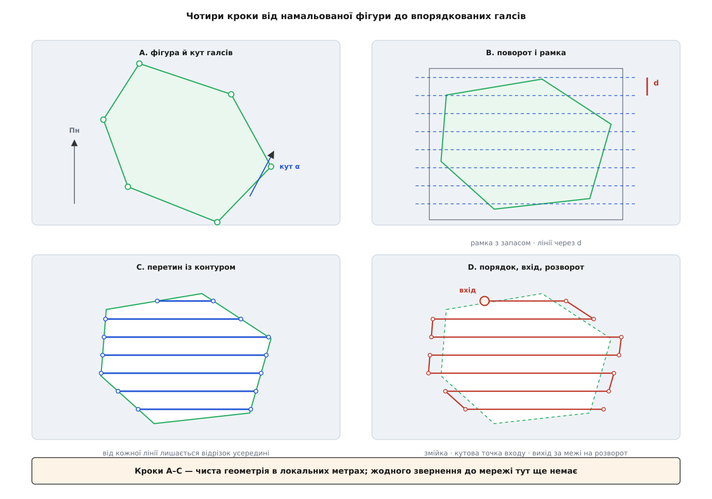

# Патерни зйомки: полігон, коридор, структура

<preknowlist>
- [Модель плану](book:qgroundcontrol/plan-model) — план складається з місії, геозони й точок збору, а місія — це впорядкований список елементів.
- [Елементи місії й команди](book:qgroundcontrol/mission-items) — елемент місії є командою MAVLink із порядковим номером і сімома числовими параметрами.
- [Протокол місії](book:communications/mission-protocol) — як список елементів переїжджає на борт: спершу оголошується кількість, далі апарат запитує елементи за номерами.
- [Модель камери-обскури](book:algorithms/camera-model) — фокусна відстань, розмір матриці й те, як точка простору лягає на пікселі.
- [ECEF, NED і ENU](book:math/ecef-ned-enu) — місцева прямокутна система координат у метрах, побудована навколо точки на поверхні Землі.
- [Покриття полігону галсами](book:algorithms/survey-grid-coverage) — загальна задача: накрити площу смугами так, щоб не лишилося непокритих клаптів.
</preknowlist>

Нехай треба відзняти поле чотириста метрів на триста так, щоб зі знімків потім склалася тривимірна модель. Камера має бачити кожну точку землі щонайменше з трьох різних місць, інакше зіставити знімки між собою буде нічим. Для звичайної камери на шістдесятиметровій висоті це означає близько трьохсот знімків і дванадцять паралельних проходів над полем. Кожен прохід — це дві точки маршруту плюс дві команди камері, та ще по точці з кожного боку на розворот.

Сімдесят із гаком елементів місії. Клацнути їх мишею по одному теоретично можливо — раз. Далі власник поля каже, що південний кут не його, і межу треба посунути на двадцять метрів. Усі сімдесят елементів змінюються.

Звідси й береться вся конструкція. План не може зберігати **результат** — точки. Він мусить зберігати **намір**: фігуру на карті, камеру, потрібне перекриття, — і вміти щоразу відтворювати з наміру точки заново. Об'єкт, який це робить, у QGroundControl зветься **складеним елементом місії** (`ComplexMissionItem`), а три його різновиди для зйомки — полігон, коридор і структура — і є предметом цієї теми.

## Один рядок нагорі, діапазон номерів унизу

Складений елемент займає в списку плану **один рядок**, як і звичайна точка маршруту. Але на відміну від звичайної точки він володіє не одним порядковим номером, а цілим **діапазоном**. Кожен елемент списку відповідає на питання `lastSequenceNumber()` — «яким номером я закінчуюсь»; для точки маршруту це той самий номер, з якого вона почалася, а для патерна — номер плюс усе, що він згенерує.

Звідси випливає перша практична річ. Коли користувач вставляє нову точку **вище** патерна, номери всередині патерна зсуваються всі одразу, і елемент, що йде після нього, теж. Тому список плану перенумеровується від початку щоразу, коли в ньому щось змінюється: кожен елемент питає в попереднього його останній номер і починає з наступного.

А тепер головне. У момент вивантаження вся ця структура **зникає**.



*Складений елемент існує лише в застосунку; на борт їде плаский список точок і команд камері.*

Протокол місії не має поняття «патерн». Він переносить рівний список елементів із номерами від нуля й далі — і жодного способу сказати автопілотові «оці сімдесят точок насправді є полігоном зі стороною перекриття сімдесят відсотків» у ньому немає. Автопілот отримує точки й летить по них. Він не знає ні про фігуру, ні про камеру, ні про те, що номери 2–73 колись були одним об'єктом.

> 🔧 **Навіщо це.** Звідси єдина найчастіша несподіванка планування: якщо завантажити місію **з апарата**, патернів у ній не буде. Буде сімдесят окремих точок, які неможливо ні посунути разом, ні перерахувати під іншу висоту. Намір лишився на землі — у файлі плану; на борту лишився тільки результат. Тому файл `.plan` і не є копією того, що в апараті, і чому саме — розібрано в темі про [обмін планом із апаратом](book:qgroundcontrol/plan-exchange).

Отже, патерн — це **генератор, який живе на землі**. А будь-який генератор визначається тим, з чого він виробляє свій вихід, і найпершим його входом є не фігура на карті, а камера.

## Звідки беруться числа: камера диктує дві відстані

Користувач ніде не вводить «крок між проходами». Він вводить перекриття у відсотках і або висоту польоту, або потрібну роздільність знімка на місцевості. Усе решта рахує об'єкт `CameraCalc` — маленький, але центральний блок, який є в кожному патерні зйомки.

В основі — та сама пропорція камери-обскури: скільки метрів землі вміщується в кадр, залежить від того, у скільки разів висота польоту більша за фокусну відстань. Якщо ширина матриці `s` міліметрів, фокусна `f` міліметрів, а висота польоту `H` метрів, то ширина сліду кадру на землі дорівнює `H · s / f` метрів. Поділивши це на ширину кадру в пікселях, дістаємо, скільки землі припадає на один піксель:

```
роздільність = H · s · 100 / (w · f)        [см на піксель]
```

Сто тут — лише переведення метрів у сантиметри, бо в сантиметрах на піксель говорять про якість аерознімка. У коді ця величина зветься `imageDensity`, і рівність читається в обидва боки: задав висоту — отримав роздільність; задав потрібну роздільність — отримав висоту, на якій треба летіти. У застосунку це два перемикачі одного поля, і працюють вони через одну й ту саму формулу, розв'язану відносно різних невідомих.

Знаючи роздільність, слід кадру на землі рахується тривіально — це просто кількість пікселів, помножена на розмір пікселя:

```
слід_поперек = w_пікс · роздільність / 100     [м]
слід_уздовж  = h_пікс · роздільність / 100     [м]
```

Яка сторона матриці стане поперечною, а яка повздовжньою, вирішує орієнтація камери на підвісі: у ландшафтній ширша сторона кадру лежить упоперек напрямку польоту, у портретній — уздовж. Перемикач «ландшафт/портрет» просто міняє ці два рядки місцями, і від цього змінюється весь патерн.

Далі до сліду прикладається перекриття. Якщо сусідні знімки мають перекриватися на 70 %, то між ними лишається тільки 30 % нового — і саме ця частка сліду і є кроком:

```
крок між галсами = слід_поперек · (100 − поперечне) / 100
крок зйомки      = слід_уздовж  · (100 − повздовжнє) / 100
```



*Уся геометрія патерна виростає з двох чисел: відстані між сусідніми проходами і відстані між кадрами вздовж проходу.*

Це дві-єдині відстані, які камера віддає геометрії. Перша каже, як часто класти паралельні проходи. Друга — через скільки метрів шляху натискати спуск. Усе інше в патерні — це та чи та спроба покласти ці дві відстані на фігуру, яку намалював користувач.

**Робочий приклад: поле 400 × 300 м, камера 24 Мп із об'єктивом 16 мм.**

```
матриця        s = 23.5 мм,  кадр w = 6000 пікс, h = 4000 пікс
фокусна        f = 16 мм
висота         H = 60 м
перекриття     поперечне 70 %,  повздовжнє 75 %

роздільність     = 60 · 23.5 · 100 / (6000 · 16)  = 1.469 см/пікс
слід_поперек     = 6000 · 1.469 / 100             = 88.13 м
слід_уздовж      = 4000 · 1.469 / 100             = 58.75 м

крок між галсами = 88.13 · 0.30                   = 26.44 м
крок зйомки      = 58.75 · 0.25                   = 14.69 м

галсів           = ceil(300 / 26.44)              = 12
кадрів на галс   = ceil(400 / 14.69) + 1          = 29
усього кадрів    ≈ 12 · 29                        = 348
довжина шляху    ≈ 12 · 400 + 11 · 26.44          ≈ 5091 м
```

Число 14.69 варто затримати в голові окремо. На швидкості 10 м/с воно означає кадр раз на 1.47 секунди — а це вже питання до самої камери: чи встигає вона записати попередній знімок. Застосунок показує цей інтервал поруч зі статистикою патерна саме тому, що він найчастіше й стає обмеженням: не акумулятор і не пам'ять, а витримка й швидкість запису. Ширший розбір цієї арифметики — як роздільність тягне за собою висоту, час і кількість кадрів, і що робити, коли камера не встигає, — у [підрахунку сліду кадру](book:qgroundcontrol/survey-patterns/math-footprint-arithmetic.md).

Окремо варто сказати, чому перекриття взагалі мусить бути таким великим. Знімки склеюються не по координатах, а по спільних деталях на землі: кожну точку поверхні алгоритм має впізнати щонайменше на двох, а краще на трьох-чотирьох кадрах, щоб порахувати її положення в просторі. Це та сама задача [зіставлення ключових точок](book:algorithms/feature-matching), і сімдесят відсотків перекриття — не запас на всяк випадок, а мінімум, за яким реконструкція просто розсипається на клапті.

Є й режим, у якому камери «немає» зовсім: користувач сам задає висоту, крок сітки й інтервал спуску. Тоді `CameraCalc` не рахує нічого, а лише переносить введені числа далі. Це потрібно там, де камера не описується моделлю обскури — наприклад, для лідара або мультиспектрального сканера з власною логікою.

## Спільна машинерія трьох патернів

Три патерни зйомки — полігон (`SurveyComplexItem`), коридор (`CorridorScanComplexItem`) і структура (`StructureScanComplexItem`) — з'явилися в застосунку не разом і не в одному стилі: полігон у версії 3.1, структура в 3.3, коридор у 3.4. Досить швидко стало видно, що після побудови ліній усі троє роблять те саме: додають розворотні ділянки, вирівнюють висоти під рельєф, рахують кадри, породжують команди камері. Спільна частина виїхала в базовий клас `TransectStyleComplexItem`, і сьогодні на нього спираються полігон і коридор; структура успадкована окремо, бо в неї геометрія тривимірна.

Слово, навколо якого все крутиться, — **галс** (нід. `hals`, у вітрильному судноплавстві — курс судна відносно вітру; «ходити галсами» означає рухатися зиґзаґом). У коді той самий об'єкт зветься `transect` (лат. `trans` — через, `secare` — різати): пряма, що перетинає ділянку наскрізь. Галс — це список координат, а патерн — список галсів, `_transects`.

Розподіл обов'язків між базовим класом і нащадками простий і вартий того, щоб його побачити:

- нащадок реалізує **єдиний** метод `_rebuildTransectsPhase1()` — «побудуй мені масив галсів із своєї фігури»;
- базовий клас робить із цим масивом **усе решта**, однаково для всіх.

Тобто різниця між полігоном і коридором — це рівно різниця в тому, як провести лінії. Ані команди камері, ані розвороти, ані рельєф про цю різницю нічого не знають.



*Полігон бере площу, коридор — лінію з шириною, структура — основу й висоту; спільним лишається все, що відбувається з галсами далі.*

## Полігон: як із фігури постають паралельні лінії

Користувач малює на карті замкнену фігуру з довільною кількістю вершин і задає кут галсів відносно півночі. Далі працює геометрія — і працює вона не на глобусі, а на площині.

Перший крок — **вихід у метри**. Координати вершин географічні, а всі відстані в патерні метричні, тож фігура переводиться в місцеву прямокутну систему: за початок береться перша вершина, решта перераховуються в північ-схід у метрах відносно неї. На масштабах кількох кілометрів кривина Землі дає похибку, меншу за точність супутникового приймача, тож далі можна чесно рахувати як на площині. Про побудову такої системи — тема про [місцеву дотичну площину](book:math/local-tangent-plane).

Другий крок — **поворот**. Проводити похилі паралельні лінії й перетинати їх із контуром можна й напряму, але кожна така операція має справу з двома нетривіальними напрямками одразу. Тому фігуру повертають на мінус заданий кут навколо центра: тепер галси горизонтальні, і всі подальші дії стають одновимірними. Кут при цьому обмежують діапазоном від −90° до +90°, бо поза ним поворот дає ту саму сітку ліній, але з протилежним порядком галсів — і точка входу, яку користувач обрав, опиняється не там, де він її ставив.

Третій крок — **лінії розгортки**. Навколо поверненої фігури будується охопна прямокутна рамка, і від її нижнього краю через `крок між галсами` проводяться горизонтальні прямі. Довжина цих прямих береться із запасом — півтори діагоналі рамки; запас тут не декоративний: до нього в коді стояла стала «плюс дві тисячі метрів», якої не вистачало полігонам, більшим за десяток кілометрів, і найдовші галси в таких місіях обрізалися.



*Кроки A–C — чиста локальна геометрія в метрах, без жодного звернення до мережі.*

Четвертий крок — **перетин**. Кожна пряма перетинається зі сторонами контуру, і з усіх знайдених точок беруться дві **найдальші одна від одної**. Відрізок між ними і є галсом.

Правило «дві найдальші» просте, швидке — і має рівно одну ваду, яку варто знати, бо вона видима на екрані. Якщо фігура **невипукла**, тобто має вирізаний усередину «кут», горизонтальна пряма може перетнути контур чотири рази: увійти, вийти в проріз, знову ввійти, вийти. Дві найдальші точки при цьому — крайні, а отже галс піде **навпростець через проріз**, поза межами ділянки. Для зйомки поля з ставком посередині це означає, що апарат літатиме над ставком і знімками, які нікому не потрібні. Саме для цього в патерні є перемикач «розбивати невипуклі полігони»: він спершу ріже фігуру на випуклі шматки, будує галси в кожному окремо, а потім зшиває результат. Вимкнений він за замовчуванням, бо на випуклих фігурах, яких більшість, коштує зайвої роботи й іноді дає інший — не гірший, але незвичний — порядок обльоту.

П'ятий крок — **напрямок і порядок**. Відрізки після перетину дивляться в різні боки: напрямок кожного залежить від того, у якому порядку пряма зачепила сторони контуру. Спершу всі галси розвертають в один бік, а потім кожен другий перевертають — виходить змійка, у якій кінець одного галса є найближчою точкою до початку наступного. Це і є той «косильний» обхід, який економить перельоти між проходами.

Шостий крок — **точка входу**. Готова змійка має чотири можливі початки: чотири кути ділянки. Користувач перемикає їх кнопкою, а код реалізує це двома дзеркальними відображеннями: «низ» перевертає точки всередині кожного галса, «право» перевертає порядок самих галсів. Комбінація двох перевертів і дає чотири варіанти. Обирають вхід не з естетики: він визначає, з якого боку апарат заходить на ділянку після зльоту, і чи не доведеться йому перед першим галсом перетнути пів поля.

Сьомий крок — **розворотна ділянка**. Мультикоптер здатен зупинитися в точці й розвернутися на місці, літак — ні: йому потрібен простір, щоб розвернутися по дузі й вийти на наступний галс уже вирівняним. Тому кінці кожного галса продовжують назовні на задану відстань, і на цих продовженнях з'являються додаткові точки маршруту. Ці точки лежать **поза** ділянкою — саме там, де апарат кренить і втрачає горизонт, і саме тому зйомку в розворотах за замовчуванням вимикають: кадри звідти або порожні, або зняті під кутом, і фотограмметрії від них більше шкоди, ніж користі.

Два перемикачі цю картину дещо міняють. **Повторний проліт під 90°** будує другу сітку галсів, повернуту на прямий кут до першої, і додає її після першої: подвійне покриття з двох напрямків суттєво покращує реконструкцію вертикальних поверхонь — стін, дерев, паркану, — які з одного напрямку видно погано. **Чергування галсів** натомість переставляє проходи так, щоб апарат летів спершу парними, а потім непарними у зворотному порядку: сусідній галс тоді не поруч, а через один, і розворот виходить удвічі ширшим — це рятує літак, чий радіус розвороту більший за крок сітки.

Повний робочий генератор галсів для полігона — поворот, рамка, розгортка, перетин, змійка — розібраний кодом у [проєкті «генератор галсів»](book:qgroundcontrol/survey-patterns/proj-transect-generator.md).

## Коридор: осьова лінія замість площі

Дорога, річка, лінія електропередачі, берег — усе це витягнуті об'єкти, у яких площа є, але описувати її полігоном безглуздо: полігон навколо звивистої дороги захопить у десять разів більше землі, ніж треба.

Коридорний патерн бере на вхід **незамкнену ламану** — вісь об'єкта — і **ширину** смуги навколо неї. Кількість галсів звідси випливає одразу:

```
галсів = ceil(ширина / крок між галсами)
```

Далі кожен галс — це та сама ламана, **зсунута вбік** на свою відстань. Зсуви розкладаються симетрично навколо осі: якщо галсів три, вони лягають на −ширина/2, на вісь і на +ширина/2; якщо два — обидва по боках, а на самій осі апарат не летить узагалі. Це не помилка, а прямий наслідок того, що смуги кладуться по краях смуги покриття, а не по центру.

Порядок і точку входу коридор трактує так само, як полігон: галси перевертають через один, отримуючи змійку, а вибір входу перевертає або точки всередині галсів, або порядок галсів. Розворотна ділянка так само подовжує кінці — тільки тут це подовження ламаної вздовж її крайніх сегментів.

Одна річ у коридорі суттєво складніша, ніж здається. **Зсув ламаної вбік — не те саме, що зсув прямої.** На згині ламаної зсунуті сегменти або розходяться (на зовнішньому боці повороту), або перетинаються один з одним (на внутрішньому). Обидві ситуації треба залагодити: у першому випадку — продовжити сегменти до їх перетину, у другому — викинути ділянку, яка вивернулася навиворіт. Застосунок робить це впритул, без сторонніх бібліотек: перпендикулярно зсуває кожен сегмент, а потім шукає перетини сусідніх зсунутих сегментів і бере їх за нові вершини. Загальна геометрія цієї операції з усіма її пастками — окрема тема про [зсув многокутника](book:algorithms/polygon-offset); тут важливо лише, що на гострих поворотах дороги внутрішні галси можуть вироджуватися, і тоді патерн виглядає на карті інакше, ніж очікується.

## Структура: вертикаль замість площини

Третій патерн знімає не землю, а **бічну поверхню**: вежу, опору мосту, будівлю, вітряк. Камера тут дивиться не вниз, а вбік, і це змінює майже все.

На вході — замкнена фігура, що описує **основу** споруди на землі, плюс висота споруди, плюс висота, з якої починати зйомку (щоб не зачепити огорожу й кущі внизу), плюс відстань, з якої знімати. Останнє число `CameraCalc` дає у своєму звичайному вигляді, тільки тепер це не висота польоту, а **дистанція до поверхні**: для похилої камери саме вона стоїть у формулі роздільности замість `H`.

Траєкторія будується у два прийоми. По горизонталі — контур основи, **розсунутий назовні** на дистанцію до поверхні: апарат обходить споруду по замкненому колу, тримаючись від стіни на потрібному віддаленні. По вертикалі — стос таких кіл, і їх кількість береться з тієї самої арифметики перекриття:

```
поверхня = висота споруди − нижня висота зйомки
шарів    = ceil(поверхня / слід_уздовж)
```

Ось тут стається річ, яку легко пропустити й важко потім пояснити. У полігоні `слід_уздовж` був **кроком зйомки** — відстанню між кадрами вздовж польоту. У структурі він став **кроком по висоті**, а кроком зйомки вздовж кола стала `слід_поперек`. Сторони сліду помінялися місцями.

Причина не в коді, а в геометрії. Слід кадру — прямокутник, прив'язаний до самої камери: одна його сторона йде по «ширині» матриці, друга по «висоті». У знімку вниз ця площинка лежить на землі, і напрямок польоту йде вздовж однієї з її сторін. Коли ж камера повертається на дев'яносто градусів і дивиться в стіну, слід залишається на стіні тим самим прямокутником — але тепер уздовж польоту йде **інша** його сторона, а перша дивиться вгору-вниз. Отже, вертикальне перекриття між шарами задає та сторона, яка в полігоні відповідала за поздовжнє, і навпаки.

Команди тут теж інші. Перед першим шаром іде команда, що вішає підвіс на споруду: `MAV_CMD_DO_SET_ROI_WPNEXT_OFFSET` із кутом рискання, зміщеним на 90° відносно напрямку руху, — тобто «дивись убік, у той бік, де стіна». Спуск вмикається на початку кожного шару і **вимикається наприкінці шару**: перехід між шарами — це підйом уздовж стіни, знімки з якого нікуди не годяться. Наприкінці всієї структури підвіс відпускають командою `MAV_CMD_DO_SET_ROI_NONE`. Вхід і вихід зроблено в одній точці — над обраною вершиною обльотного контуру, на висоті входу, — щоб апарат заходив і виходив зі структури передбачувано, а не з випадкового боку.

## Від галсів до елементів місії

Тепер у патерна є впорядкований список координат, у кожної з яких є **тип**: початок галса, кінець галса, внутрішня точка, розворотна точка, точка зависання. Перетворення цього списку на команди робить базовий клас, і робить однаково для полігона й коридора.

Основний випадок — зйомка на ходу. На **початку** галса ставиться точка й одразу за нею команда

```
MAV_CMD_DO_SET_CAM_TRIGG_DIST( крок_зйомки, 0, 1 )
```

Третій параметр — одиниця — означає «зняти один кадр негайно»; без нього перший кадр стався б аж через `крок_зйомки` метрів після початку галса, і смуга лишилася б із непокритим початком. На **кінці** галса ставиться точка й та сама команда з нулем: нуль вимикає зйомку за відстанню. Так спуск працює рівно вздовж галса й мовчить на розвороті.

Тонкість ховається в тому, **чим саме** позначено початок галса. Звичайна точка маршруту вважається досягнутою, коли апарат увійшов у сферу прийняття навколо неї, а перед нею він за замовчуванням гальмує. Для зйомки це погано вдвічі: кадр почнеться раніше або пізніше за лінію, і апарат щоразу втратить швидкість там, де мав би йти рівно. Тому, якщо прошивка підтримує таку команду й зйомка не в режимі зависання, застосунок ставить замість точки **ворота**:

```
MAV_CMD_CONDITION_GATE( 0, 1, 0, 0, широта, довгота, висота )
```

Перший параметр `0` означає «площина, перпендикулярна до відрізка шляху». Ворота — не сфера, а площина: вони вважаються пройденими в мить, коли апарат її перетнув, і не змушують ні гальмувати, ні цілитися в точку. Кадр стартує рівно там, де починається галс.

Умова, за якої ворота застосовуються, у коді записана прямо і варта того, щоб її прочитати: прошивка мусить підтримувати команду **і** зйомка має бути ввімкнена **і** режим зависання має бути вимкнений. Не виконалася хоч одна — ставиться звичайна точка.

Режим **зависання зі зйомкою** — це протилежна стратегія, доступна тільки мультикоптеру. Апарат зупиняється в кожній точці зйомки, і кожна така точка перетворюється на пару: точка маршруту з часом очікування плюс `MAV_CMD_IMAGE_START_CAPTURE`. Знімок робиться нерухомим апаратом, тож розмиття від руху немає зовсім — ціною того, що замість п'яти кілометрів рівного польоту виходить триста зупинок. Це для випадків, коли витримка довга: сутінки, слабке освітлення, вузька діафрагма.

Порядкові номери при всьому цьому проставляються наскрізно, простим лічильником, що починається з номера самого патерна й збільшується після кожного доданого елемента. Цей же лічильник наприкінці й дає той `lastSequenceNumber`, з якого починається наступний елемент плану. Повний перелік команд, які породжують патерни, з усіма сімома параметрами кожної — у [довідці команд патерна](book:qgroundcontrol/survey-patterns/api-transect-commands.md).

## Рельєф: чому один галс стає багатьма точками

Досі галс був відрізком із двома кінцями. Це правда рівно доти, доки під ним пласка земля.

Якщо ввімкнено слідування рельєфу, апарат має триматися сталої висоти **над поверхнею**, а не над рівнем моря. Але точка маршруту задає одну висоту, і між двома точками апарат летить по прямій — виходить, на схилі відстань до землі поїде. Єдиний спосіб це виправити — **додати точок усередину галса**, стільки, щоб ламана між ними повторювала профіль землі з потрібною точністю.

Саме це й відбувається: застосунок запитує профіль висот уздовж кожного галса, а потім вставляє між кінцями проміжні точки — у коді вони мають окремий тип `CoordTypeInteriorTerrainAdded`. Скільки їх буде, вирішує **допуск**: чим менший допустимий відхил від справжнього профілю, тим густіше треба ставити точки. Допуск у півметра над рівним полем не додасть жодної; над кар'єром він може перетворити один галс на два десятки точок.

Є й друге обмеження — **максимальна швидкість набору й зниження**. Рельєф здатен вимагати від апарата такого підйому, якого той фізично не витягне: вертикальна стінка означала б нескінченну швидкість набору. Тому згенерований профіль додатково згладжується так, щоб нахил ніде не перевищував заданих меж, — а це означає, що над обривом апарат пройде **вище** розрахункової висоти, і роздільність там буде гірша. Звідки застосунок бере самі висоти й наскільки їм можна вірити — тема про [рельєф і режими висоти в плані](book:qgroundcontrol/terrain-and-altitude) та про [цифрову модель рельєфу](book:programming/terrain-elevation-model).

## Чому перерахунок розділений на дві фази

Тепер видно, чому побудова галсів у коді розламана надвоє.

**Перша фаза** — та, що описана вище до рельєфу: поворот, рамка, розгортка, перетин, змійка, розвороти. Вона повністю локальна: жодних звернень назовні, лише арифметика над кількома десятками точок. Мілісекунди.

**Друга фаза** — рельєф. Вона мусить піти по мережу за профілем висот, і це вже сотні мілісекунд у найкращому разі, а на поганому зв'язку — секунди.

Якби вони були одним викликом, перетягування вершини полігона мишею означало б запит по мережу на кожен піксель руху. Тому перша фаза виконується щоразу негайно й одразу оновлює лінії на карті — користувач бачить сітку, що живо повзе за курсором, — а друга запускається окремо й дописує висоти, коли відповідь прийде. Проміжок між ними видно неозброєним оком: сітка вже стоїть, а статистика ще перераховується.

## Що переживає збереження

Файл плану зберігає патерн **двічі**. Спершу — намір: тип патерна в полі `complexItemType` (`"survey"`, `"CorridorScan"`, `"StructureScan"`), сама фігура, налаштування камери в блоці `CameraCalc`, перекриття, кут, розворотна ділянка, прапорці зависання й повторного прольоту. Потім — результат: згенеровані елементи місії та точки галсів для показу на карті.

Здається зайвим: намір же однозначно задає результат, досить було б перерахувати при відкритті. Але однозначність тут тримається тільки в межах однієї версії застосунку. Алгоритм побудови галсів змінювався — виправляли перетин невипуклих фігур, міняли запас розгортки, додавали розбиття, — і план, збережений торік, перерахований сьогоднішнім кодом дав би інакші точки. Для місії, яку вже налітали й перевірили, це неприйнятно. Тому в файлі є ключі версій формату, і збережений результат дає застосункові право відкрити старий план **точно таким, яким його зберегли**, навіть якщо генератор відтоді змінився.

На борт із усього цього їде, як і на початку, тільки середня частина: рівний список точок і команд. Патерн лишається файлом на диску — генератором, який пам'ятає, з чого виріс політ, і вміє виростити його заново, коли межа поля посунеться на двадцять метрів.
