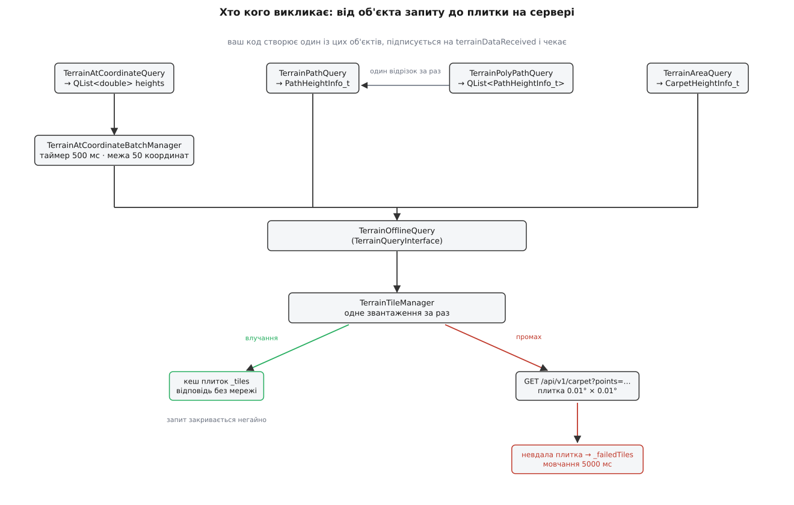

# 📋 Рельєф із коду: п'ять класів запиту, їхні сигнали й сталі плитки

Висоту землі під координатою в QGroundControl не питають функцією — створюють об'єкт-запит, підписуються на його єдиний сигнал і чекають. Тут зібрано весь контракт цього обміну: чотири публічні класи запиту й два менеджери під ними, повні сигнатури, що саме приходить у сигналі, як у відповіді позначено «даних немає», скільки живе об'єкт запиту, які сталі описують плитку Copernicus і що станеться, коли плитку не вдалося звантажити.

## Де це лежить

| Файл | Що оголошує |
|---|---|
| `src/Terrain/TerrainQuery.h` / `.cc` | `TerrainAtCoordinateQuery`, `TerrainPathQuery`, `TerrainPolyPathQuery`, `TerrainAreaQuery`, `TerrainAtCoordinateBatchManager` |
| `src/Terrain/TerrainPathHeightInfo.h` | структура `TerrainPathHeightInfo` — вона ж `TerrainPathQuery::PathHeightInfo_t` |
| `src/Terrain/TerrainQueryInterface.h` / `.cc` | простір імен `TerrainQuery` (`QueryMode`, `State`), базовий `TerrainQueryInterface`, реалізації `TerrainOfflineQuery` й `TerrainOnlineQuery` |
| `src/Terrain/TerrainTileManager.h` / `.cc` | `TerrainTileManager` — кеш плиток і звантаження |
| `src/Terrain/Providers/TerrainTileCopernicus.h` | сталі плитки й розбір її двійкового вмісту |
| `src/Terrain/Providers/TerrainQueryCopernicus.h` / `.cc` | прямі звернення до REST-інтерфейсу сервера висот |
| `src/QtLocationPlugin/Providers/ElevationMapProvider.h` / `.cpp` | `ElevationProvider`, `CopernicusElevationProvider` — адреса, ключ провайдера, нарізання на плитки |

Усе, крім розбору плитки, працює в головному потоці — і об'єкти запиту, і обидва менеджери створюються та сигналять там само. Викликати їх з робочого потоку не можна: [модель потоків станції](book:qgroundcontrol/threading-model) кладе всю модельну частину застосунку в головний потік, а обмін між потоками веде окремими механізмами.

## Спільна форма всіх чотирьох класів запиту

Чотири публічні класи побудовані за однією схемою, і різняться лише тим, що передають у `requestData()` та що несе сигнал.

```cpp
explicit XxxQuery(bool autoDelete, QObject *parent = nullptr);
void requestData(/* залежить від класу */);
signals:
    void terrainDataReceived(bool success, /* корисне навантаження */);
```

| Клас | `requestData()` | Що несе `terrainDataReceived` | Скільки значень |
|---|---|---|---|
| `TerrainAtCoordinateQuery` | `const QList<QGeoCoordinate> &coordinates` | `const QList<double> &heights` | стільки ж, скільки координат |
| `TerrainPathQuery` | `const QGeoCoordinate &fromCoord, const QGeoCoordinate &toCoord` | `const TerrainPathQuery::PathHeightInfo_t &` | одна структура на відрізок |
| `TerrainPolyPathQuery` | `const QList<QGeoCoordinate> &polyPath` або `const QVariantList &polyPath` | `const QList<TerrainPathQuery::PathHeightInfo_t> &` | на одну менше, ніж вершин |
| `TerrainAreaQuery` | `const QGeoCoordinate &swCoord, const QGeoCoordinate &neCoord` | `const TerrainAreaQuery::CarpetHeightInfo_t &` | двовимірний килим |

Друге перевантаження `TerrainPolyPathQuery::requestData()` бере `QVariantList` — це вхід для виклику з QML, де список координат приїжджає саме в такому вигляді.

**Найкоротший робочий виклик: висота під однією точкою**

```cpp
// у класі-замовнику
QPointer<TerrainAtCoordinateQuery> _query;

void MyItem::_requestTerrain()
{
    // 1. Попередній запит НЕ видаляємо — лише відчіпляємо його від себе.
    if (_query) {
        disconnect(_query, &TerrainAtCoordinateQuery::terrainDataReceived,
                   this,   &MyItem::_terrainDataReceived);
        _query = nullptr;
    }

    // 2. autoDelete = true: об'єкт знищить себе сам після того, як просигналить.
    _query = new TerrainAtCoordinateQuery(true /* autoDelete */);
    connect(_query, &TerrainAtCoordinateQuery::terrainDataReceived,
            this,   &MyItem::_terrainDataReceived);

    // 3. Запит завжди списком — навіть коли координата одна.
    _query->requestData({ _coordinate });
}

void MyItem::_terrainDataReceived(bool success, QList<double> heights)
{
    _terrainAltitude = (success && !heights.isEmpty()) ? heights[0] : qQNaN();
    _query = nullptr;                  // об'єкт уже приречений на deleteLater()
    emit terrainAltitudeChanged(_terrainAltitude);
}
```

Перевірка `!heights.isEmpty()` тут не перестраховка. Успіх і кількість — дві незалежні речі: батчер ріже спільну відповідь підсписками наперед відомої довжини, і якщо сервер повернув коротший список, ніж сумарно замовили, останній замовник дістане `success == true` з порожнім або урізаним зрізом. Кількість значень перевіряйте самі.

## Час життя об'єкта запиту

Це найгостріше місце всього інтерфейсу, і воно прописане в заголовку окремим коментарем: об'єкт запиту мусить дожити до моменту, коли підсистема рельєфу просигналить крізь нього назад. Відповідь може прийти й через кілька секунд — а замовник тим часом устигне передумати.

Прапорець `autoDelete` конструктора вирішує, хто прибирає об'єкт:

| `autoDelete` | Що робить об'єкт після сигналу | Коли брати |
|---|---|---|
| `true` | викликає `deleteLater()` на собі | запит-одноразівка: спитали, дістали відповідь, забули |
| `false` | лишається жити, готовий до наступного `requestData()` | об'єкт-член довгоживучого класу |

Звідси й правило, яке видно в прикладі вище: **стару чергу відчіпляють, а не видаляють**. Коли координата змінилася, поки попередній запит іще в дорозі, видалити його не можна — на нього посилаються всередині черг батчера й менеджера плиток. Тому старий об'єкт лишають доживати наодинці, а `disconnect()` гарантує, що його застаріла відповідь до вас не дійде.

Що станеться, коли замовник помре раніше за відповідь, вирішено на боці менеджерів: і батчер, і менеджер плиток тримають замовника через `QPointer` — [слабке посилання](book:programming/weak-references), тобто вказівник, який рушій сам обнуляє при знищенні об'єкта, замість того щоб перетворитися на висячий. Перед кожним сигналом іде перевірка на нуль, і зниклий замовник просто пропускається.

Одна діра в цій схемі є, і про неї варто знати наперед. `TerrainPolyPathQuery`, отримавши невдачу від чергового відрізка, чистить накопичене, шле `terrainDataReceived(false, …)` — і на цьому виході `deleteLater()` **не викликає**, хоч би яким був `autoDelete`. Об'єкт, створений як одноразівка, після невдалого ланцюжка лишається живим. Якщо ви створюєте такі запити в циклі перепланування, прибирайте їх на невдачі самі.

## `TerrainAtCoordinateQuery` — висоти в точках

```cpp
explicit TerrainAtCoordinateQuery(bool autoDelete, QObject *parent = nullptr);

void requestData(const QList<QGeoCoordinate> &coordinates);

static bool getAltitudesForCoordinates(const QList<QGeoCoordinate> &coordinates,
                                       QList<double> &altitudes,
                                       bool &error);

void signalTerrainData(bool success, const QList<double> &heights);

signals:
    void terrainDataReceived(bool success, const QList<double> &heights);
```

`requestData()` з порожнім списком нічого не робить і нічого не сигналить — тиша замість відмови. Далі запит іде не в мережу, а в чергу батчера.

`signalTerrainData()` публічний тому, що його викликає батчер ззовні; вашому кодові він не потрібен.

### Синхронний варіант і його три відповіді

`getAltitudesForCoordinates()` — статичний метод, який віддає висоти **негайно й лише з кешу**, без жодного сигналу. Він переадресує виклик менеджерові плиток, і його результат читається не одним значенням, а трьома одразу:

| Повернуло | `error` | `altitudes` | Що сталося |
|---|---|---|---|
| `true` | `false` | заповнено повністю | усі координати лягли на плитки, які вже в пам'яті |
| `true` | `true` | заповнено, але містить `NaN` | частина координат — на плитці, яку нещодавно не вдалося звантажити |
| `false` | дивитися не варто | неповно | у кеші даних немає; звантаження або щойно почалося, або вже йде |

Три речі, які легко проґавити.

Перше: метод не такий безневинний, як «прочитати з кешу». Не знайшовши потрібної плитки, він **сам починає її звантажувати** — і аж потім повертає `false`. Виклик читання має побічний ефект.

Друге: відповіді на це звантаження ви не отримаєте ніколи. Сигналів метод не шле, а черга менеджера, яку той розбирає після приходу плитки, поповнюється лише через `addCoordinateQuery()` — тобто через асинхронний шлях. Синхронний виклик треба повторити пізніше самому.

Третє: `error` виставляється в `false` на вході й може стати істинним по дорозі, ще до того, як метод натрапить на відсутню плитку й поверне `false`. Тож `error` осмислений тільки в парі з `true`.

> 🔧 **Навіщо це.** Синхронний виклик годиться рівно для одного: домалювати щось на екрані даними, які вже точно є, і не миготіти, коли їх нема. Будувати на ньому логіку плану — пастка: перший прохід поверне `false`, а другого ніхто не спричинить, бо сигналу немає.

## `TerrainPathQuery` — профіль уздовж відрізка

```cpp
explicit TerrainPathQuery(bool autoDelete, QObject *parent = nullptr);
void requestData(const QGeoCoordinate &fromCoord, const QGeoCoordinate &toCoord);

using PathHeightInfo_t = TerrainPathHeightInfo;

signals:
    void terrainDataReceived(bool success,
                             const TerrainPathQuery::PathHeightInfo_t &pathHeightInfo);
```

```cpp
struct TerrainPathHeightInfo {
    double        distanceBetween;       ///< відстань між сусідніми значеннями, м
    double        finalDistanceBetween;  ///< відстань між двома останніми, м
    QList<double> heights;               ///< висоти вздовж відрізка
};
```

Кількість точок не задається — вона виводиться з довжини відрізка й кроку сітки даних:

```
numPoints = max(2, ceil(totalDistance ÷ kTileValueSpacingMeters) + 1)
```

де `totalDistance` — [геодезична відстань](book:math/great-circle-distance) між кінцями, тобто довжина дуги по поверхні, а не пряма в просторі. Точки розкладаються по цій самій дузі рівномірно, включно з обома кінцями.

**Приклад: відрізок завдовжки 1000 метрів**

```
numPoints = max(2, ceil(1000 ÷ 30) + 1) = max(2, 34 + 1) = 35
проміжків  = 35 − 1 = 34
distanceBetween ≈ 1000 ÷ 34 ≈ 29.4 м
```

Обидва поля відстані рахуються з фактичних координат: `distanceBetween` — між першою й другою точкою, `finalDistanceBetween` — між передостанньою й останньою. Різняться вони мало, але для інтегрування профілю по довжині брати треба саме обидва: останній крок — окремий доданок.

На невдачі приходить `success == false`, а `distanceBetween` і `finalDistanceBetween` — обидва `NaN`. Це [значення-ознака](book:programming/sentinel-values), а не число: будь-яка арифметика з ним лишається `NaN`, тож зіпсована відстань не просочиться мовчки в довжину чи площу.

Профіль замовляється **без злиття з іншими запитами** — на відміну від точкових. Кожен `TerrainPathQuery` тримає власний `TerrainOfflineQuery` і йде просто в менеджер плиток.

## `TerrainPolyPathQuery` — ланцюжок відрізків

```cpp
explicit TerrainPolyPathQuery(bool autoDelete, QObject *parent = nullptr);
void requestData(const QVariantList &polyPath);
void requestData(const QList<QGeoCoordinate> &polyPath);

signals:
    void terrainDataReceived(bool success,
                             const QList<TerrainPathQuery::PathHeightInfo_t> &rgPathHeightInfo);
```

Усередині це один-єдиний `TerrainPathQuery`, який запускають знову й знову: відрізок `[0,1]`, дочекатися, відрізок `[1,2]`, дочекатися, і так далі. Паралельних запитів немає, тож час відповіді зростає з кількістю вершин лінійно.

| Ситуація | Що приходить |
|---|---|
| менше двох координат | `terrainDataReceived(false, порожній список)` — **негайно, ще з самого `requestData()`** |
| невдача на будь-якому відрізку | накопичене чиститься, приходить `(false, порожній список)`; часткової відповіді немає |
| успіх | `(true, список із `polyPath.count() − 1` структур)` у порядку відрізків |

Негайний сигнал на короткому списку — окрема пастка: він вилітає **із самого виклику `requestData()`**, тобто ще до того, як ви встигли повернутися з функції, що його викликала. Якщо ви підписалися після виклику — сигнал уже минув.

## `TerrainAreaQuery` — килим висот над прямокутником

```cpp
explicit TerrainAreaQuery(bool autoDelete, QObject *parent = nullptr);
void requestData(const QGeoCoordinate &swCoord, const QGeoCoordinate &neCoord);

struct CarpetHeightInfo_t {
    double                minHeight;
    double                maxHeight;
    QList<QList<double>>  carpet;
};

signals:
    void terrainDataReceived(bool success,
                             const TerrainAreaQuery::CarpetHeightInfo_t &carpetHeightInfo);
```

Прямокутник задається двома протилежними кутами — південно-західним і північно-східним. Сітка килима не задається зовсім: вона береться з кроку даних.

```
gridSizeLat = ceil((neLat − swLat) ÷ kTileValueSpacingDegrees)
gridSizeLon = ceil((neLon − swLon) ÷ kTileValueSpacingDegrees)
рядків   = gridSizeLat + 1
стовпців = gridSizeLon + 1
```

**Приклад: квадрат 0.01° × 0.01°, тобто рівно одна плитка**

```
gridSizeLat = ceil(0.01 ÷ (1/3600)) = ceil(36.0) = 36
рядків = стовпців = 37
координат у запиті = 37 × 37 = 1369
```

Індексація килима йде від південно-західного кута: `carpet[i][j]` — рядок `i` рахується на північ, стовпець `j` — на схід.

Дві межі, про які треба знати наперед:

- **`kMaxCarpetGridSize = 10000`** на кожен вимір. Запит, ширший приблизно за `10000 ÷ 3600 ≈ 2.78°` по широті чи довготі, відхиляється одразу сигналом `(false, NaN, NaN, порожній килим)`.
- `TerrainAreaQuery::requestData()` завжди просить **повний** килим: `statsOnly` там зашито в `false`. Полегшений режим «лише мінімум і максимум» існує рівнем нижче, у `TerrainQueryInterface::requestCarpetHeights()`, але через `TerrainAreaQuery` до нього не дістатися. Квадратний градус у повному режимі — це понад тринадцять мільйонів координат.

## `TerrainAtCoordinateBatchManager` — той, хто склеює точкові запити

Єдиний на застосунок об'єкт, [сінглтон](book:programming/singleton) із доступом через `instance()`. Прямо ви його не викликаєте — це робить `TerrainAtCoordinateQuery::requestData()`.

```cpp
static TerrainAtCoordinateBatchManager *instance();
void addQuery(TerrainAtCoordinateQuery *terrainAtCoordinateQuery,
              const QList<QGeoCoordinate> &coordinates);
```

| Стала / поведінка | Значення | Наслідок для замовника |
|---|---|---|
| `_batchTimeout` | `500` мс, таймер одноразовий | між першим запитом у пачці й зверненням до даних мине до півсекунди |
| межа координат у пачці | `50` | перевірка стоїть **після** додавання цілого замовника |
| одночасних пачок | одна | поки пачка в дорозі, нові запити просто накопичуються |
| хвіст черги | таймер перезапускається | якщо після пачки в черзі щось лишилося, наступна піде ще через 500 мс |

Межа в 50 координат працює не так, як здається з числа. Цикл дістає з черги **цілого замовника**, додає всі його координати й лише потім перевіряє, чи не перевалило за 50. Замовник зі списком на двісті точок піде в мережу двомастами точками в одному зверненні; межа лише зупиняє набирання **наступних** замовників.

Відповідь приходить одним пласким списком і ріжеться назад по запам'ятованих довжинах:

```cpp
int currentIndex = 0;
for (const SentRequestInfo_t &sentRequestInfo: _sentRequests) {
    if (!sentRequestInfo.terrainAtCoordinateQuery.isNull()) {
        const QList<double> requestAltitudes = heights.mid(currentIndex, sentRequestInfo.cCoord);
        sentRequestInfo.terrainAtCoordinateQuery->signalTerrainData(true, requestAltitudes);
    }
    currentIndex += sentRequestInfo.cCoord;
}
```

Зверніть увагу на останній рядок: індекс зсувається **поза** перевіркою на нуль. Замовник, який устиг померти, свою частку не отримує, але вона нікуди не зникає — решта списку лишається вирівняною правильно. Це і є [злиття запитів](book:programming/request-coalescing) у чистому вигляді: багато незалежних замовників, одне звернення, розрізання відповіді за довжинами.

Невдача роздається всім однаково: кожен замовник із поточної пачки дістає `terrainDataReceived(false, порожній список)`. Часткового успіху всередині пачки не буває.



*Точкові запити проходять крізь батчер і склеюються; профіль, ламана й килим ідуть у менеджер плиток кожен своїм шляхом.*

## `TerrainTileManager` — плитки, кеш і мережа

Другий сінглтон, спільна підлога під усіма запитами.

```cpp
static TerrainTileManager *instance();

bool getAltitudesForCoordinates(const QList<QGeoCoordinate> &coordinates,
                                QList<double> &altitudes, bool &error);

void addCoordinateQuery(TerrainQueryInterface *iface, const QList<QGeoCoordinate> &coordinates);
void addPathQuery      (TerrainQueryInterface *iface, const QGeoCoordinate &startPoint,
                                                      const QGeoCoordinate &endPoint);
void addCarpetQuery    (TerrainQueryInterface *iface, const QGeoCoordinate &swCoord,
                                                      const QGeoCoordinate &neCoord, bool statsOnly);
```

Кожен `add…Query()` спершу пробує відповісти з кешу тим самим `getAltitudesForCoordinates()`. Вийшло — сигнал іде негайно, ще з виклику. Не вийшло — запит стає в чергу `_requestQueue` разом зі своїм режимом (`QueryModeCoordinates`, `QueryModePath`, `QueryModeCarpet`) і чекає плитки.

Звантаження йде **по одній плитці за раз**: поле `_state` перемикається в `Downloading`, і поки воно там, нові плитки не замовляються. Після приходу кожної плитки менеджер проходить чергу від кінця до початку й віддає все, що тепер збирається з кешу.

Плитка адресується хешем, у який входить ім'я провайдера й номери плитки на **першому** рівні масштабу:

```cpp
const QString tileHash = UrlFactory::getTileHash(
    provider->getMapName(),
    provider->long2tileX(coordinate.longitude(), 1),
    provider->lat2tileY(coordinate.latitude(), 1),
    1);
```

Рівень масштабу тут завжди `1` і в розрахунку номерів ігнорується — сітка рельєфу пласка, без пірамідки рівнів, якою живе [рушій карти](book:qgroundcontrol/map-engine): там тайл існує на кожному з двох десятків рівнів наближення, тут плитка одна.

## Сталі плитки Copernicus

Оголошені в `TerrainTileCopernicus`, і на них спираються всі розрахунки вище.

| Стала | Значення | Що означає |
|---|---|---|
| `kTileSizeDegrees` | `0.01` | сторона плитки в градусах — і по широті, і по довготі |
| `kTileValueSpacingDegrees` | `1.0 / 3600` | крок сітки висот усередині плитки — одна кутова секунда |
| `kTileValueSpacingMeters` | `30.0` | той самий крок, огрублений до метрів |
| `CopernicusElevationProvider::kProviderKey` | `"Copernicus"` | ім'я провайдера в налаштуваннях і в хеші плитки |
| `CopernicusElevationProvider::kProviderURL` | `"https://terrain-ce.suite.auterion.com"` | адреса сервера висот |
| `CopernicusElevationProvider::kAvgElevSize` | `2786` | середній розмір плитки в байтах — лише для оцінки обсягу звантаження |
| `TerrainTileManager::kFailedTileBackoffMs` | `5000` | скільки мовчати після невдалої спроби взяти плитку |

Три перші сталі узгоджені між собою простою арифметикою:

```
0.01° ÷ (1/3600)° = 36              інтервалів по стороні плитки
36 + 1 = 37                         значень висоти по стороні
0.01° × 111 320 м/° ≈ 1113 м        сторона плитки по широті
1113 м ÷ 36 ≈ 30.9 м                крок сітки — звідси kTileValueSpacingMeters = 30
```

По довготі сторона коротшає з широтою множником `cos φ`: на 50-й паралелі `1113 · cos 50° ≈ 716 м`, тобто крок сітки там уже близько 20 метрів, а не 30. `kTileValueSpacingMeters` — навмисне огрублення в бік більшого кроку, і саме воно задає густину точок у профілі; про природу самої сітки — [цифрова модель рельєфу](book:programming/terrain-elevation-model), правильна сітка висот із фіксованим кроком.

Адреса плитки будується з її номерів назад у градуси:

```cpp
lat1 = y     · 0.01 − 90;   lon1 = x     · 0.01 − 180;
lat2 = (y+1) · 0.01 − 90;   lon2 = (x+1) · 0.01 − 180;
// GET https://terrain-ce.suite.auterion.com/api/v1/carpet?points=lat1,lon1,lat2,lon2
```

Той самий сервер має ще два шляхи, якими користується `TerrainQueryCopernicus` в обхід плиток: базовий (`?points=` списком координат) для точок і `/path` для профілю. Стандартний шлях застосунку веде не туди, а крізь `TerrainOfflineQuery` — а «offline» у цій назві означає «через кеш плиток», а не «без мережі».

## Заміна провайдера висот

Провайдер береться з налаштувань **на кожен виклик**, а не запам'ятовується при старті:

```cpp
const QString elevationProviderName =
    SettingsManager::instance()->flightMapSettings()->elevationMapProvider()->rawValue().toString();
const SharedMapProvider provider = UrlFactory::getMapProviderFromProviderType(elevationProviderName);
```

| Властивість налаштування | Значення |
|---|---|
| група | `FlightMap` |
| ім'я | `elevationMapProvider` |
| тип | `string` (не перелік — рядок звіряється з іменами провайдерів) |
| значення за замовчуванням | `"Copernicus"` |

Це звичайний [факт](book:qgroundcontrol/fact-system) — величина з метаданими й сигналом зміни, — тож він читається й пишеться так само, як будь-яке інше [налаштування, що переживає перезапуск](book:qgroundcontrol/settings-persistence). Оскільки читання відбувається на кожен запит, зміна діє з наступного запиту, без перезапуску застосунку. Кеш при цьому не чиститься й не плутається: ім'я провайдера входить у хеш плитки, тож старі плитки просто перестають знаходитися за новими хешами.

Щоб додати власний сервер висот, успадковують `ElevationProvider` і реалізують п'ять методів:

```cpp
int       long2tileX(double lon, int z) const final;   // довгота → номер плитки
int       lat2tileY (double lat, int z) const final;   // широта  → номер плитки
QGCTileSet getTileCount(int zoom, double topleftLon, double topleftLat,
                        double bottomRightLon, double bottomRightLat) const final;
QString   _getURL(int x, int y, int zoom) const final; // номери плитки → адреса
QByteArray serialize(const QByteArray &image) const final;
```

Головний із них — `serialize()`: він мусить перетворити відповідь вашого сервера рівно в той двійковий вигляд, який очікує `TerrainTile` — межі плитки, мінімум, максимум, середнє, розміри сітки й далі суцільний масив `int16_t`. Якщо розібрати не вдалося, плитка виходить із `isValid() == false`, і менеджер її просто викидає, залишаючи запит без відповіді.

## Що буває, коли плитка не приїхала

Тут зосереджена більшість несподіванок, тому розкладемо по шарах.

| Шар | Що робить |
|---|---|
| мережевий запит | помилка або порожня відповідь → хеш плитки лягає в `_failedTiles` з міткою часу |
| журнал | **перша** невдача на цю плитку йде як `warning`, наступні — як `debug` |
| `_isFailedTile()` | наступні `kFailedTileBackoffMs = 5000` мс запити на цю плитку не йдуть у мережу зовсім |
| `getAltitudesForCoordinates()` | для координати на «поганій» плитці кладе `qQNaN()` і піднімає `error` |
| `_tileFailed()` | сигналить невдачу **всім** запитам у черзі й **чистить чергу цілком** |
| успішне звантаження | `_clearFailedTile()` знімає позначку — наступний запит піде в мережу знову |

Останній рядок таблиці — той, через який діагностика найчастіше йде хибним шляхом. Черга менеджера спільна для всіх замовників, і невдача **однієї** плитки валить **усі** запити, що чекали в цю мить, — навіть ті, чиї плитки давно лежать у кеші. Коли в плані одночасно провалилися і далекий галс, і сусідній елемент місії, це не означає, що бракує обох плиток: бракує однієї, а другий просто стояв поруч у черзі.

П'ятисекундне мовчання після невдачі теж не декоративне. Апарат без супутникової позиції здатний надіслати запит рельєфу з нульовими координатами, а сервер на перетині нульового меридіана й екватора відповідає помилкою — без затримки станція перепитувала б ту саму порожнечу циклом.

## Категорії журналювання

Вмикаються звичайним фільтром `QT_LOGGING_RULES` або сторінкою налаштувань застосунку.

| Категорія | Що показує |
|---|---|
| `Terrain.TerrainQuery` | створення запитів, черга батчера, розміри пачок, невдачі |
| `Terrain.TerrainQuery:verbose` | ще й розрізання відповіді по замовниках — кому скільки значень пішло |
| `Terrain.TerrainTileManager` | хеші плиток, влучання в кеш, звантаження, невдалі плитки |
| `Terrain.TerrainQueryInterface` | межа між шаром запитів і шаром плиток, стан SSL |

Порядок розбору при мовчазному рельєфі майже завжди той самий: `Terrain.TerrainTileManager` показує, чи взагалі пішло звантаження й чим воно скінчилося; `Terrain.TerrainQuery` — чи дійшов ваш запит до пачки; `:verbose` — чи дістався зріз саме вашому об'єктові, чи той устиг померти раніше за відповідь.
