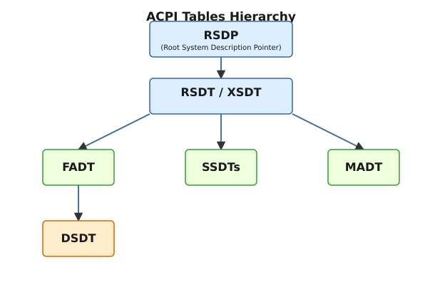
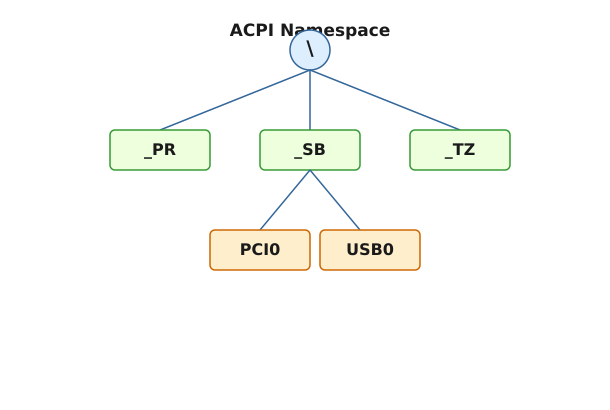

# Таблиці та простір імен ACPI: DSDT, SSDT, AML та їхнє виконання в ядрі

<preknowlist>
- [Концепції ядра Linux](book:unix-linux/kernel-and-userspace) — базові поняття системних викликів та VFS.
</preknowlist>

Advanced Configuration and Power Interface (ACPI) є одним з найважливіших стандартів в сучасних комп'ютерних системах, який забезпечує операційну систему детальною інформацією про апаратне забезпечення та надає механізми для управління його конфігурацією і живленням. На відміну від старих стандартів, таких як APM (Advanced Power Management) або PnP BIOS, де більшість логіки управління знаходилась всередині прошивки (BIOS), ACPI переносить цю відповідальність на операційну систему (OS-directed configuration and Power Management, OSPM).

У цій статті ми детально розглянемо архітектуру ACPI з точки зору операційної системи (на прикладі ядра Linux), заглибимося в структуру таблиць ACPI, розберемо простір імен (ACPI Namespace) та зрозуміємо, як інтерпретатор ACPICA виконує байт-код AML для взаємодії з апаратним забезпеченням.

## 1. Архітектура ACPI: Огляд

ACPI надає абстрактний інтерфейс між операційною системою та апаратною платформою. Замість того, щоб операційна система містила жорстко закодовані драйвери для специфічних материнських плат та їхніх компонентів, прошивка системи (UEFI/BIOS) передає ядру набір таблиць, які описують ці компоненти, а також машинно-незалежний байт-код (AML), який визначає, як саме взаємодіяти з ними.

Ядро Linux містить вбудований інтерпретатор для цього байт-коду, відомий як ACPICA (ACPI Component Architecture). ACPICA є референсною реалізацією, яка розробляється спільно з Intel і використовується в багатьох операційних системах (Linux, FreeBSD, Windows та ін.).

### Компоненти ACPI

1. **ACPI Tables (Таблиці ACPI):** Структури даних, що містять статичну конфігурацію системи (наприклад, інформацію про процесори, переривання, пам'ять).
2. **ACPI Namespace (Простір імен):** Ієрархічне дерево об'єктів, яке будується операційною системою на основі DSDT та SSDT таблиць.
3. **AML (ACPI Machine Language):** Байт-код, написаний виробником платформи та скомпільований з ASL (ACPI Source Language). Він містить методи управління живленням, ініціалізацією пристроїв та обробкою подій (наприклад, натискання кнопки живлення або зміна температури).
4. **ACPI Registers:** Специфічні апаратні регістри, визначені стандартом ACPI для управління станами сну (S-states) та подіями.

## 2. Ієрархія таблиць ACPI

Під час завантаження ядра, однією з перших задач є знаходження та парсинг таблиць ACPI. Вони структуровані у вигляді ієрархії, де коренева таблиця містить вказівники на інші таблиці.

*Рис. 1. Ієрархія таблиць ACPI*

### RSDP (Root System Description Pointer)

Знаходження ACPI починається з RSDP. У традиційних системах з Legacy BIOS ядро сканує область пам'яті (від 0x0E0000 до 0x0FFFFF) у пошуках спеціальної сигнатури `RSD PTR `. У сучасних системах UEFI вказівник на RSDP передається безпосередньо через конфігураційні таблиці UEFI (через змінні середовища).

RSDP є дуже маленькою структурою, яка містить фізичну адресу наступної важливої таблиці — RSDT (або XSDT у новіших версіях).

### RSDT (Root System Description Table) та XSDT (Extended System Description Table)

RSDT містить масив 32-бітних фізичних адрес, які вказують на інші системні таблиці. Оскільки сучасні системи мають більше ніж 4 ГБ оперативної пам'яті, таблиці ACPI можуть бути розташовані вище цієї межі. Тому у версії ACPI 2.0 було представлено XSDT, яка виконує ту ж функцію, але використовує 64-бітні адреси. Ядро завжди надає перевагу XSDT, якщо вона присутня.

### Основні статичні таблиці

RSDT/XSDT вказують на безліч інших таблиць. Кожна таблиця має 4-символьну сигнатуру. Ось кілька ключових:

*   **FADT (Fixed ACPI Description Table):** Найважливіша статична таблиця. Вона містить адреси регістрів ACPI, інформацію про таймер управління живленням, порти подій, а головне — містить вказівники на DSDT (через 32-бітне поле DSDT або 64-бітне X_DSDT) та FACS (Firmware ACPI Control Structure).
*   **MADT (Multiple APIC Description Table):** Описує конфігурацію контролерів переривань (Local APIC та I/O APIC) і використовується ядром для налаштування маршрутизації переривань у багатопроцесорних системах.
*   **MCFG (Memory Mapped Configuration Space Access Table):** Вказує базу пам'яті для доступу до розширеного конфігураційного простору PCI Express.
*   **SRAT (System Resource Affinity Table) / SLIT:** Використовуються для опису топології NUMA (Non-Uniform Memory Access).

### DSDT (Differentiated System Description Table)

DSDT є серцем ACPI з точки зору динамічного управління. На відміну від попередніх таблиць, які в основному містять статичні дані у фіксованому форматі, DSDT містить великий блок байт-коду (AML). Цей код описує базову конфігурацію материнської плати, її внутрішні пристрої, шини (наприклад, PCI, I2C, SPI), а також методи для управління ними.

Оскільки DSDT міститься у прошивці і компілюється виробником, вона часто містить помилки або розрахована виключно на роботу з Windows. Ядро Linux дозволяє перевизначати DSDT під час завантаження через initrd (механізм `ACPI Table Override`), що дозволяє розробникам та користувачам виправляти проблеми ACPI без оновлення BIOS.

### SSDT (Secondary System Description Table)

SSDT — це додаткові таблиці, які є продовженням DSDT. Вони також містять AML-код і логічно додаються до простору імен, створеного DSDT. Виробники використовують SSDT для розбиття коду на модулі (наприклад, один SSDT для процесорів, інший для відеокарти). Також SSDT часто завантажуються динамічно, наприклад, при підключенні пристроїв Thunderbolt, які мають власний опис ACPI.

## 3. ACPI Namespace (Простір імен)

Коли ACPICA інтерпретатор у ядрі читає DSDT та SSDT таблиці, він не просто виконує код зверху вниз. Натомість він парсить AML-код для побудови ієрархічного дерева, яке називається ACPI Namespace.

*Рис. 2. Фрагмент дерева простору імен ACPI*

Простір імен ACPI нагадує файлову систему, де коренем є `\`. Вузлами в цьому дереві можуть бути пристрої (Devices), теплові зони (Thermal Zones), процесори (Processors), події (Events), змінні (Integers/Strings) та методи (Methods).

### Стандартні кореневі вузли

Специфікація ACPI визначає кілька зарезервованих вузлів на верхньому рівні:

*   **`\_SB` (System Bus):** Тут містяться майже всі пристрої системи — PCI контролери, USB контролери, вбудована периферія. Це найважливіша гілка для драйверів.
*   **`\_PR` (Processors):** Традиційне місце для об'єктів процесорів. У нових системах їх часто переносять до `\_SB`.
*   **`\_TZ` (Thermal Zones):** Містить об'єкти для моніторингу температури та управління вентиляторами.
*   **`\_GPE` (General Purpose Events):** Об'єкти для обробки апаратних подій (наприклад, від кришки ноутбука або кнопки живлення).
*   **`\_SI` (System Indicators):** Для управління системними індикаторами/світлодіодами.

### Ідентифікація пристроїв (PNP IDs / ACPI IDs)

Кожен пристрій у просторі імен ACPI ідентифікується за допомогою `_HID` (Hardware ID) та `_CID` (Compatible ID). Ці ID дозволяють ядру знайти відповідний драйвер, подібно до того, як це працює з PCI (Vendor/Device ID).

Наприклад, `PNP0A08` означає PCI Express Root Bridge, а `INT33A1` — Intel Power Engine Plug-in. Ядро використовує шину `acpi` (або `platform`), щоб зіставити ці ідентифікатори з драйверами.

### Об'єкти методів

Багато об'єктів у просторі імен є методами (функціями). Вони зазвичай починаються з підкреслення (зарезервовані імена) або мають довільні назви, які викликаються іншими методами.

Ключові стандартні методи:
*   `_STA` (Status): Повертає статус пристрою (чи присутній він, чи увімкнений, чи нормально функціонує). Ядро постійно викликає `_STA` при скануванні шин.
*   `_INI` (Initialize): Викликається ядром один раз при завантаженні для ініціалізації пристрою.
*   `_DSM` (Device Specific Method): Загальний інтерфейс для виклику специфічних функцій пристрою (часто використовується для GPU, I2C HID тощо).
*   `_PS0`, `_PS3`: Методи для управління живленням. Виклик `_PS0` виводить пристрій з енергозберігаючого режиму (D0), а `_PS3` — вимикає його (D3).

## 4. AML та його виконання в ядрі (ACPICA)

ACPI Source Language (ASL) — це мова програмування, схожа на C, якою виробники BIOS пишуть конфігурацію системи. За допомогою компілятора (зазвичай iASL від Intel) цей код перетворюється на ACPI Machine Language (AML) — компактний байт-код.

### Чому байт-код?

Використання байт-коду дозволяє операційній системі взаємодіяти з апаратними регістрами (часто недокументованими або специфічними для конкретної плати) без необхідності мати драйвер для кожного чіпсета. Ядро просто викликає метод ACPI (наприклад, `_PS3`), а інтерпретатор ACPICA виконує AML-інструкції, які читають і пишуть у відповідні фізичні адреси або I/O порти. Це забезпечує неймовірну гнучкість, але водночас є джерелом багатьох проблем через складність і баги в AML-коді виробників.

### Інтерпретатор ACPICA

ACPICA (Advanced Configuration and Power Interface Component Architecture) — це велика і складна підсистема в ядрі Linux (розташована в `drivers/acpi/acpica`).

Вона виконує кілька критичних ролей:
1. **Парсинг таблиць:** Читання DSDT/SSDT та створення ієрархії вузлів у пам'яті.
2. **Виконання AML (Інтерпретація):** ACPICA містить віртуальну машину (stack-based/operand-based), яка розуміє опкоди AML.
3. **Обробка регіонів (Operation Regions):** Це фундаментальний механізм ACPI. AML-код сам по собі не може безпосередньо звертатися до пам'яті. Замість цього він оголошує `OperationRegion`, наприклад, в SystemMemory (RAM), SystemIO (порти вводу-виводу), PCI_Config (конфігураційний простір PCI) або EmbeddedControl (доступ до мікроконтролера EC). Коли AML намагається прочитати або записати дані в цей регіон, інтерпретатор ACPICA перехоплює це звернення і викликає відповідний обробник ядра Linux (region handler), який виконує фізичний доступ. Це гарантує, що ACPI не порушує механізми ізоляції ядра.

### Події GPE та переривання

ACPI обробляє апаратні події через General Purpose Events (GPE). Апаратура генерує системне переривання управління (SCI - System Control Interrupt). Це переривання ловиться ядром, яке потім звертається до ACPICA.

ACPICA зчитує регістри статусу GPE (адреси яких вказані у таблиці FADT), визначає, яка подія сталася, і шукає відповідний метод у просторі імен, який зазвичай має назву `_Lxx` або `_Exx` (де `xx` — номер GPE). Наприклад, якщо відбулося GPE 0x1A (може означати закриття кришки ноутбука), інтерпретатор виконує метод `_L1A`. Цей метод, своєю чергою, може надіслати повідомлення (через опкод `Notify`) до певного пристрою в просторі імен. Драйвер ядра, який підписався на ці події для даного пристрою, отримає нотифікацію і відреагує відповідно (наприклад, ініціює перехід системи у режим сну).

## 5. Практичний аналіз ACPI в Linux

Розуміння ACPI є критичним для розробників драйверів та системних адміністраторів, які вирішують проблеми зі сплячим режимом, управлінням частотою процесора або непрацюючою периферією (тачпади, Wi-Fi модулі).

Для дослідження ACPI на живій системі Linux доступні кілька інструментів:

*   **/sys/firmware/acpi/tables:** Тут ядро експортує сирі таблиці, зчитані з прошивки.
*   **acpidump / acpixtract:** Утиліти командного рядка для збереження таблиць у файл та їх розпакування.
*   **iasl -d (декомпіляція):** Компілятор Intel iASL також може працювати як декомпілятор, перетворюючи сильні AML-файли (наприклад, `DSDT.dat`) назад у читабельний вихідний код ASL (`DSDT.dsl`).
*   **acpiexec:** Утиліта, яка дозволяє запустити інтерпретатор ACPICA в просторі користувача, завантажити вилучені таблиці та покроково виконувати AML-методи для дебагінгу.
*   **Dynamic Debug:** Ядро Linux дозволяє увімкнути динамічний дебаг для підсистеми ACPI (`dyndbg="file drivers/acpi/* +p"`), щоб детально бачити, які методи викликаються та як обробляються події.

## Висновок

ACPI — це надзвичайно гнучкий, але складний механізм, який діє як міст між апаратним забезпеченням та ядром операційної системи. Завдяки ієрархічному простору імен, що будується на основі таблиць DSDT та SSDT, і віртуальній машині для виконання AML, ACPI дозволяє ОС абстрагуватися від тонкощів конкретних материнських плат. Розуміння структури таблиць, принципів простору імен та роботи інтерпретатора ACPICA є необхідним для глибокого вивчення архітектури управління живленням та ініціалізації в ядрах типу Unix та Linux.

(На цьому ми завершуємо огляд базової архітектури ACPI. У наступних розділах ми перейдемо до детального розбору підсистеми управління живленням ядра та станів сну S0-S5.)
