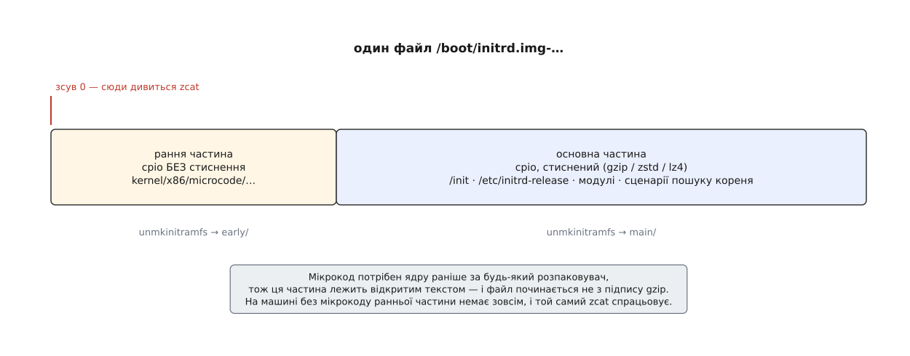
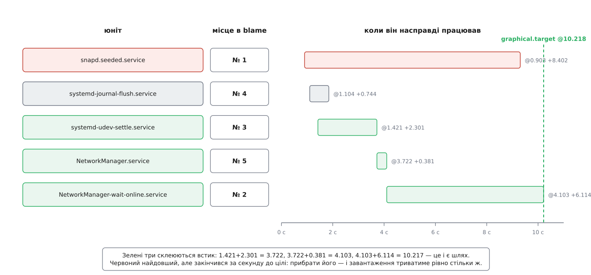

# ⚙️ Пройти ланцюг на власній машині: шість доказів

Ланцюг завантаження незручний для вивчення тим, що до миті, коли можна набрати першу команду, від нього нічого не лишилося: прошивка замовкла, завантажувач стерто з пам'яті, розпаковувач ядра зник разом зі стиснутим образом, а програма з initramfs замінила себе іншою. Дивитися нема на що — можна лише читати сліди. Тож задача тут така: для кожної ланки знайти на власній працюючій машині один конкретний доказ і чітко знати, що саме він доводить, а чого не доводить.

## Три сховища, у яких лежать сліди

Сліди лежать у трьох різних місцях, і плутанина між ними родить більшість хибних діагнозів.

Перше сховище — енергонезалежна пам'ять прошивки. Вона переживає не лише перезавантаження, а й заміну диска, і саме тому тримає єдиний запис про те, кого прошивка обрала.

Друге — пам'ять ядра: рядок параметрів, кільцевий буфер повідомлень, лічильники процесів. Це живе рівно до вимкнення й описує саме цей запуск.

Третє — файли на диску: образ initramfs, конфігурація завантажувача. І тут головна засторога: третє сховище єдине, яке можна змінити вже після завантаження. Воно описує не той запуск, що стався, а той, що станеться наступного разу. Половина плутанини в діагностиці — це висновок про минуле, зроблений із файлу, який відтоді переписали.

## Ланка перша: чим нас запустили

```sh
$ [ -d /sys/firmware/efi ] && echo UEFI || echo "BIOS або CSM"
UEFI
```

Цей каталог створює саме ядро — і лише тоді, коли прошивка передала йому системну таблицю EFI. Отже, доказ говорить про спосіб входу, а не про можливості плати: машина з [прошивкою UEFI](book:unix-linux/uefi-firmware), запущена в режимі сумісності зі старою схемою, каталогу не матиме.

Далі — кого саме обрала прошивка:

```sh
$ efibootmgr
BootCurrent: 0004
Timeout: 1 seconds
BootOrder: 0004,0000,0002
Boot0000* Windows Boot Manager
Boot0002* UEFI: PXE IPv4
Boot0004* ubuntu
```

Ключовий тут — `BootCurrent`: запис, яким справді запущено систему, що зараз працює. `BootOrder` — лише намір, порядок перебору. Коли ці два числа розходяться, це вже діагноз: прошивка провалилася повз перші записи до наступного, бо не знайшла за ними файлу.

Сам `efibootmgr` нічого не знає — він форматує файли, які ядро показує через [файлову систему, що цілком живе в пам'яті](book:unix-linux/pseudo-filesystems):

```sh
$ od -An -tx1 /sys/firmware/efi/efivars/BootCurrent-8be4df61-93ca-11d2-aa0d-00e098032b8c
 06 00 00 00 04 00
```

Перші чотири байти — маска атрибутів змінної, далі йдуть її дані. Два байти даних, `04 00` у порядку від молодшого, — це число 4, той самий `BootCurrent`. Одна відповідь двома незалежними шляхами: спершу з програми, потім із сирих байтів прошивки. Маска теж промовиста: молодший біт, який означає «пережити вимкнення», не виставлений — цю змінну прошивка створює наново на кожному запуску, і питати її про попередній запуск марно.

Читати ці файли безпечно, писати — ні: це жива пам'ять прошивки, і на частині плат невдалий запис лишає машину без завантаження назавжди.

## Ланка друга: рядок, з яким стартувало ядро

```sh
$ cat /proc/cmdline
BOOT_IMAGE=/vmlinuz-6.8.0-45-generic root=UUID=6f1e2b7a-9c40-4f11-a2d3-0b7c81e5a9f2 ro quiet splash
```

Це копія рядка, який ядро отримало на вході, — [вікно в стан самого ядра](book:unix-linux/proc-filesystem), а не в конфігурацію. Рядок є фактом, а файли налаштувань — лише наміром; звіряти треба саме в цьому напрямку.

Читають його на двох рівнях. Перший: `root=UUID=…` означає, що завантажувач передав не пристрій, а ідентифікатор тому — отже, перекладати його на пристрій мусить хтось у просторі користувача. Уже цього досить, щоб стверджувати, що в цьому запуску була проміжна ланка.

Другий рівень — хто рядок склав. `BOOT_IMAGE=` дописує GRUB, і ця добавка вказує на нього не гірше за підпис. Тоді джерело — `/etc/default/grub`, з якого генерують `/boot/grub/grub.cfg`, і звіряти треба з другим файлом, бо перший до перегенерації не діє. Без `BOOT_IMAGE=` варіантів кілька: запис systemd-boot у `/boot/loader/entries/`, або [рядок, вшитий усередину єдиного підписаного образу](book:unix-linux/bootloader-and-cmdline/proj-uki-by-hand.md), — і тоді правка конфігурації не міняє геть нічого, бо рядок їде разом із ядром. [Звідки береться цей рядок](book:unix-linux/bootloader-and-cmdline) — окрема тема; для розбору важливо, що розбіжність між `/proc/cmdline` і конфігурацією не є похибкою виводу. Вона і є діагноз.

## Ланка третя: що лежало в initramfs

Тут перша серйозна пастка: імені завантаженого образу в `/proc/cmdline` немає. Завантажувач передав ядру не назву файлу, а адресу вже прочитаного шматка пам'яті, тож ім'я доводиться відновлювати за версією ядра — а файл на диску міг бути перегенерований після запуску.

```sh
$ uname -r
6.8.0-45-generic
$ ls -l --time-style=long-iso /boot/initrd.img-$(uname -r)
-rw-r--r-- 1 root root 78412391 2026-07-30 11:04 /boot/initrd.img-6.8.0-45-generic
$ uptime -s
2026-08-06 09:12:03
```

Файл старший за запуск — отже, дивимося справді на той образ. Молодший означав би, що перед нами вже наступний запуск, і всі висновки нижче стосуються майбутнього, а не минулого.

Заглянути всередину й розпакувати:

```sh
$ lsinitramfs /boot/initrd.img-$(uname -r) | head      # Debian, Ubuntu
$ lsinitrd /boot/initramfs-$(uname -r).img | head      # Fedora, RHEL, SUSE

$ mkdir /tmp/ini && unmkinitramfs /boot/initrd.img-$(uname -r) /tmp/ini
$ ls /tmp/ini
early  early2  main
```

Три теки замість однієї — прямий наслідок будови файлу: [образ](book:unix-linux/initramfs) буває склейкою кількох архівів, де перші лежать без стиснення, а останній стиснений.



*Ранню частину ядро читає раніше, ніж підіймає розпаковувач, — тому вона й лежить відкритим текстом.*

Причина проста: мікрокод процесора треба застосувати найпершим, ще до всього іншого, тож ця частина мусить читатися без розпакування. Наслідок — пастка, на якій горять: звичне `zcat образ | cpio -idmv` тут падає, бо файл починається не з підпису gzip. А на машині без мікрокоду рання частина відсутня, і та сама команда відпрацьовує бездоганно. Саме тому користуються інструментами, які вміють різати склейку.

Тепер найцікавіше — чому туди потрапило саме це:

```sh
$ find /tmp/ini/main -name '*.ko*' | sed 's|.*/kernel/||' | cut -d/ -f1-2 | sort -u
drivers/ata
drivers/md
drivers/nvme
fs/ext4
$ ls /tmp/ini/main/usr/lib/systemd/system/ | grep -E 'crypt|lvm'
systemd-cryptsetup@.service
```

Кожен рядок — відповідь на питання «як дійти до кореня саме цієї машини». [Модулі](book:unix-linux/kernel-modules) тут не всі, які є в системі, а лише ті, без яких не прочитати носія; юніт розблокування з'явився тому, що корінь лежить [під шифруванням](book:unix-linux/dm-crypt). Звідси й корисна перевірка на цілісність: усе, чого вимагає `root=` із `/proc/cmdline`, мусить мати всередині образу і свій драйвер, і свій сценарій. Розбіжність означає машину, яка завантажується сьогодні й перестане після заміни диска чи переходу на інший контролер.

Є там і порожній файл `etc/initrd-release` — маркер, за яким systemd упізнає, що працює всередині тимчасового кореня. Він знадобиться далі.

## Ланка четверта: мить пересадки

```sh
$ dmesg | grep -E 'as init process|Freeing unused'
[    1.284431] Run /init as init process
[    1.302880] Freeing unused kernel memory: 2696K
```

Ядро друкує ім'я програми, яку зробило першим процесом. Це найпряміший доказ того, що PID 1 стартував саме з тимчасового кореня: якби образу не було, у рядку стояв би `/sbin/init`.

Сам перехід видно в журналі:

```sh
$ journalctl -b -o short-monotonic | grep -E 'Switching root|running in system mode'
[    3.204118] host systemd[1]: Switching root.
[    3.418902] host systemd[1]: systemd 255 running in system mode.
```

Два повідомлення від того самого PID 1, розділені двома десятими секунди: перше написала копія systemd з initramfs, друге — та, що лежить на справжньому корені. Один номер, різні образи — [заміна образу](book:unix-linux/exec-semantics) прямо в журналі. Монотонні позначки [часу від завантаження](book:unix-linux/kernel-timekeeping) тут доречніші за календарні: у цю мить годинник ще може стрибнути на кілька років, коли його щойно звірили з мережею.

Пастка: там, де initramfs зібрано класичними інструментами Debian, усередині працює не systemd, а маленька оболонка, і [журналу](book:unix-linux/journald-logging) з тієї фази немає взагалі. Відсутність рядка `Switching root` там нічого не спростовує — перехід був, просто нікому було його записати.

## Ланка п'ята: PID 1 — уже не /init

```sh
$ readlink /proc/1/exe
/usr/lib/systemd/systemd
$ tr '\0' ' ' < /proc/1/cmdline; echo
/sbin/init splash
```

Ці два виводи не суперечать один одному, і різниця між ними варта уваги. `cmdline` показує те, що написав викликач: `/sbin/init` там стоїть просто тому, що таким ім'ям програму запустили, а сам цей шлях зазвичай ще й символьне посилання. Доказом є лише `exe` — це посилання ядро тримає на справжній файл виконуваного образу, і підробити його з простору користувача нема як.

Що корінь замінено:

```sh
$ [ -e /etc/initrd-release ] && echo "усе ще initramfs" || echo "справжній корінь"
справжній корінь
$ findmnt -no SOURCE,FSTYPE /
/dev/mapper/vg0-root ext4
```

Найпереконливіший же доказ — час народження процесу:

```sh
$ sed 's/.*) //' /proc/1/stat | awk '{print $20}'
7
$ getconf CLK_TCK
100
```

```
7 тиків ÷ 100 тиків на секунду = 0.07 с від завантаження
```

Двадцять друге поле в `/proc/<pid>/stat` — момент народження процесу, у тиках від завантаження системи. Для PID 1 це сім сотих секунди: процес виник тоді, коли справжнього кореня ще фізично не існувало, а файл `/usr/lib/systemd/systemd` був недосяжний. Якби systemd запустили як нову програму, лічильник показав би мить пересадки — тут три з гаком секунди. Він показує початок завантаження, а отже, процес не створювали: у ньому замінили вміст. Для порівняння — звичайна служба:

```sh
$ sed 's/.*) //' /proc/$(pgrep -n NetworkManager)/stat | awk '{print $20}'
412
```

Чому перед `awk` стоїть `sed`: друге поле цього рядка — ім'я програми в дужках, а воно може містити і пробіли, і самі дужки, бо програма вільна перейменувати себе. Тому рахувати поля зліва не можна взагалі: спершу відрізають усе до останньої `) `, і потрібне поле стає двадцятим.

> 🔧 **Навіщо це.** Коли завантаження впало в аварійну оболонку, ці ж три перевірки одразу розводять дві геть різні поломки. `exe` показує `/init`, `/etc/initrd-release` на місці, корінь у пам'яті — пересадка не відбулася, справжнього кореня не знайшли, шукати треба серед драйверів і розблокування. `exe` показує systemd, корінь справжній — пересадка минула, і винен уже перший процес системи або те, що він намагався запустити. Одна команда відрізає половину простору пошуку.

## Ланка шоста: розкладка часу й де вона мовчить

```sh
$ systemd-analyze time
Startup finished in 4.812s (kernel) + 3.204s (initrd) + 10.218s (userspace) = 18.234s
graphical.target reached after 10.218s in userspace
```

Перше, що спантеличує, — відсутність рядків про прошивку й завантажувач. Це не поломка виводу: systemd бере ці числа з двох змінних, які завантажувач сам записує в пам'ять прошивки, — мітки своєї ініціалізації та миті, коли він передає керування ядру. Перша мітка і є часом прошивки, різниця між ними — часом завантажувача. Пише їх systemd-boot; GRUB не пише. Перевірити, чи буде що показувати, можна заздалегідь:

```sh
$ ls /sys/firmware/efi/efivars | grep LoaderTime
LoaderTimeExecUSec-4a67b082-0a4c-41cf-b6c7-440b29bb8c4f
LoaderTimeInitUSec-4a67b082-0a4c-41cf-b6c7-440b29bb8c4f
```

Порожнє місце в розкладці, отже, свідчить про вибір завантажувача, а не про швидкість прошивки.

Далі спокуса, на яку ловляться майже всі:

```sh
$ systemd-analyze blame | head -5
8.402s snapd.seeded.service
6.114s NetworkManager-wait-online.service
2.301s systemd-udev-settle.service
 744ms systemd-journal-flush.service
 381ms NetworkManager.service
```

Список відсортовано за тим, скільки юніт піднімався сам. Це не те саме, що внесок у тривалість завантаження, і документація systemd каже про це прямо: показано час старту юнітів, а не час, який їхні завдання простояли в черзі; до того ж служби найпростішого типу вважаються запущеними миттєво й у списку майже не видно. Тобто `blame` — перелік довгих, а не винних.

Винних показує інша команда:

```sh
$ systemd-analyze critical-chain
graphical.target @10.218s
└─multi-user.target @10.217s
  └─NetworkManager-wait-online.service @4.103s +6.114s
    └─NetworkManager.service @3.722s +381ms
      └─systemd-udev-settle.service @1.421s +2.301s
```

Символ `@` — мить, коли юніт став активним, `+` — скільки він піднімався. З цих двох чисел правило читання випливає само собою: юніт лежить на шляху тоді, коли його `@` плюс його `+` дає `@` того, хто стоїть вище. Де сума не сходиться, ланцюжок чекав чогось іще, і саме туди варто дивитися.



*Той самий запуск двома поглядами: перша колонка — місце в blame, смуга — справжнє розташування в часі.*

У самої команди теж є застереження в документації: вивід буває оманливим через паралельне виконання і через те, що частину служб піднімають [за зверненням до сокета](book:unix-linux/socket-activation) — залежність тоді існує, але часу не з'їдає, бо сокет створено наперед. Тому [опис залежностей](book:unix-linux/systemd-model) читають як опис порядку, а не як опис витрат.

> 🔧 **Навіщо це.** Найпоширеніша марна робота під час прискорення старту — вимкнути перший рядок `blame`. У виводі вище це нічого не дасть: `snapd.seeded.service` працював паралельно й закінчився раніше, ніж систему було піднято, тож його зникнення не зрушить загальні десять секунд ані на десяту. Виграш дає лише скорочення того ланцюжка, де сума сходиться, — а там на першому місці служба, яка просто чекає мережі, і питання насправді в тому, чи потрібне комусь це очікування.

## Один прохід одним сценарієм

Усі шість перевірок читають те, що вже є в системі, і нічого не міняють, тож їх зручно звести в один сценарій — щоб знімати стан однією командою.

```sh
#!/bin/sh
# walk-the-chain.sh — по одному доказу на кожну ланку ланцюга завантаження.
# Нічого не змінює. Частину виводу може приховати kernel.dmesg_restrict.

say() { printf '\n== %s ==\n' "$1"; }
cmdline=$(cat /proc/cmdline)

say "1. прошивка"
if [ -d /sys/firmware/efi ]; then
    echo "ядро дістало таблицю EFI → вхід через UEFI"
    efibootmgr 2>/dev/null | grep -E '^BootCurrent|^BootOrder' \
        || echo "efibootmgr не встановлено"
else
    echo "каталогу /sys/firmware/efi немає → вхід через BIOS або режим сумісності"
fi

say "2. рядок параметрів"
echo "$cmdline"
case " $cmdline " in
    *" BOOT_IMAGE="*) echo "→ рядок складав GRUB: звіряти з /boot/grub/grub.cfg" ;;
    *) echo "→ BOOT_IMAGE немає: systemd-boot, вшитий у образ рядок або ядро прямо з ESP" ;;
esac
case "$cmdline" in
    *root=UUID=*|*root=LABEL=*) echo "→ корінь заданий міткою: без initramfs не обійтися" ;;
esac

say "3. образ initramfs"
img=/boot/initrd.img-$(uname -r)
[ -f "$img" ] || img=/boot/initramfs-$(uname -r).img
if [ -f "$img" ]; then
    printf '%s\n  розмір %s Б, змінений %s\n' \
        "$img" "$(stat -c %s "$img")" "$(stat -c %y "$img")"
    boot=$(awk -v now="$(date +%s)" '{ printf "%d", now - $1 }' /proc/uptime)
    if [ "$(stat -c %Y "$img")" -gt "$boot" ]; then
        echo "  ⚠ файл молодший за поточний запуск — його перегенерували вже після завантаження"
    else
        echo "  файл старший за запуск — завантажувався саме він"
    fi
else
    echo "образу немає — ядро монтувало корінь власними драйверами"
fi

say "4. перехід switch_root"
dmesg 2>/dev/null | grep -m1 'as init process' \
    || echo "рядок недоступний (закритий dmesg або переповнений буфер)"
journalctl -b -o short-monotonic 2>/dev/null | grep -m1 'Switching root' \
    || echo "переходу в журналі немає — в initramfs працював не systemd, а оболонка"

say "5. хто такий PID 1"
printf 'exe:     %s\n' "$(readlink /proc/1/exe)"
printf 'argv[0]: %s\n' "$(tr '\0' ' ' < /proc/1/cmdline)"
printf 'корінь:  %s\n' "$(findmnt -no SOURCE,FSTYPE /)"
ticks=$(sed 's/.*) //' /proc/1/stat | awk '{print $20}')
awk -v t="$ticks" -v hz="$(getconf CLK_TCK)" \
    'BEGIN { printf "старт:   %.2f с від завантаження\n", t / hz }'
[ -e /etc/initrd-release ] && echo "⚠ /etc/initrd-release на місці — це ще тимчасовий корінь"

say "6. розкладка часу"
if command -v systemd-analyze >/dev/null; then
    systemd-analyze time
    ls /sys/firmware/efi/efivars 2>/dev/null | grep -q LoaderTimeInitUSec \
        && echo "→ завантажувач веде облік: рядки firmware і loader будуть" \
        || echo "→ завантажувач не пише LoaderTime*: цих рядків не буде, і це нормально"
else
    echo "systemd немає — розкладку показати нічим"
fi
```

Один рядок у ньому варто розібрати окремо — той, що обчислює мить запуску системи. Готового лічильника з такою величиною немає, зате `/proc/uptime` каже, скільки секунд машина працює, а `date +%s` — котра зараз година в секундах від початку епохи. Різниця дає шукане:

```
мить запуску = поточний час (епоха) − uptime
1754467923 с − 87 240 с = 1754380683 с
```

Перше число `/proc/uptime` рахує і час, проведений у сні, тож після пробудження арифметика не з'їжджає. Далі лишається порівняти з ним час зміни файлу — і питання «чи той це образ, що завантажувався» стає порівнянням двох цілих чисел.

Цінність сценарію не в одноразовому запуску, а в порівнянні. Зняти вивід на здоровій машині й зберегти — а коли після оновлення ядра, заміни диска чи ввімкнення шифрування вона перестане завантажуватися, дістати ті самі рядки з аварійної оболонки й покласти поруч. Ланка, на якій два стовпчики розійшлися, і є та, яку зламали; решта відпадає без здогадок.
