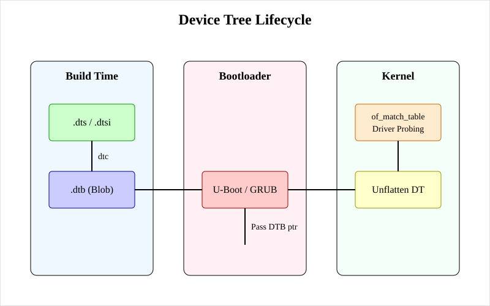

# Дерево пристроїв (Device Tree, DTB)

<preknowlist>
- [Концепції ядра Linux](book:unix-linux/kernel-and-userspace) — базові поняття системних викликів та VFS.
</preknowlist>

## 1. Вступ до концепції Device Tree

У світі вбудованих систем і сучасних архітектур, таких як ARM та RISC-V, існує величезна кількість різноманітних апаратних платформ. Раніше операційні системи, зокрема Linux, мали жорстко закодований опис апаратури (так звані board-файли у C) для кожної конкретної плати. Зі зростанням кількості плат це стало некерованим, спричинивши відому проблему "ARM churn" у ядрі Linux. Для вирішення цієї проблеми було адаптовано концепцію **Device Tree (дерево пристроїв)**, яка спочатку використовувалась в архітектурі PowerPC (Open Firmware).

Device Tree — це структура даних, яка описує апаратні компоненти системи таким чином, щоб ядро операційної системи могло прочитати цей опис під час завантаження й автоматично налаштувати необхідні драйвери, без потреби перекомпіляції самого ядра для кожної нової плати. Це дозволило відокремити опис апаратури від коду ядра.



## 2. Device Tree Source (.dts) та інклюди (.dtsi)

Опис апаратури створюється людьми у вигляді текстових файлів, які називаються **Device Tree Source (DTS)**. Ці файли мають розширення `.dts`. Вони використовують C-подібний синтаксис (хоча насправді це структура вузлів і властивостей, що нагадує JSON або XML) та підтримують препроцесор C, що дозволяє використовувати макроси, `#include` та `#define`.

### 2.1. Структура DTS

Дерево пристроїв складається з вузлів (nodes) та властивостей (properties). Кожен вузол може містити дочірні вузли. Вузол визначає пристрій або шину, а властивості визначають його характеристики.

Приклад простого вузла:

```dts
/dts-v1/;

/ {
    model = "My Custom Board";
    compatible = "vendor,my-board", "simple-bus";
    #address-cells = <1>;
    #size-cells = <1>;

    cpus {
        #address-cells = <1>;
        #size-cells = <0>;

        cpu@0 {
            device_type = "cpu";
            compatible = "arm,cortex-a53";
            reg = <0>;
        };
    };

    serial@101f1000 {
        compatible = "arm,pl011";
        reg = <0x101f1000 0x1000>;
        interrupts = <1 14>;
    };
};
```

### 2.2. Файли .dtsi

Щоб уникнути дублювання, загальні описи (наприклад, система на кристалі — SoC, яка використовується на багатьох платах) виносяться у файли з розширенням `.dtsi` (Device Tree Source Include). Файл конкретної плати (`.dts`) включає `.dtsi` файл SoC і просто додає або перевизначає властивості, специфічні для цієї плати (наприклад, увімкнення конкретних портів, периферії, визначення статусів "okay" чи "disabled").

## 3. dtc (Device Tree Compiler) і DTB (Device Tree Blob)

Оскільки текстовий формат DTS неефективний для парсингу ядром під час завантаження системи, текстовий файл компілюється в бінарний формат. Інструмент, який це виконує, називається **Device Tree Compiler (dtc)**.

### 3.1. Використання dtc

Компілятор `dtc` приймає на вхід файл `.dts` і генерує файл **Device Tree Blob (DTB)** з розширенням `.dtb`. DTB — це компактне, flattened (сплющене) бінарне представлення дерева, оптимізоване для швидкого читання завантажувачем та ядром.

Команда для компіляції:
```bash
dtc -I dts -O dtb -o my-board.dtb my-board.dts
```

Можна також виконати зворотну декомпіляцію для аналізу наявного DTB:
```bash
dtc -I dtb -O dts -o decompiled.dts my-board.dtb
```

### 3.2. Flattened Device Tree

У бінарному форматі (DTB) дерево пристроїв називається **Flattened Device Tree (FDT)**. Воно має заголовок із магічним числом (`0xd00dfeed`), після якого йдуть блоки структур даних і рядків. Ядро безпосередньо зчитує ці структури і "розгортає" (unflatten) їх у динамічну структуру в оперативній пам'яті під час раннього завантаження (early boot phase).

## 4. Завантажувачі та прошивки (ARM, RISC-V)

У сучасних системах на базі ARM (U-Boot, TF-A, UEFI) або RISC-V (OpenSBI, U-Boot) завантажувач відіграє ключову роль у передачі DTB до ядра операційної системи.

### 4.1. Процес в ARM

На ARM платах завантажувач (наприклад, U-Boot) зазвичай завантажує ядро (`zImage` або `Image`) і файл `DTB` в оперативну пам'ять за різними адресами. Потім він переходить на стартову адресу ядра, передаючи адресу DTB у спеціальному регістрі (наприклад, у регістрі `x0` для ARM64, або `r2` для ARM32).

U-Boot також може динамічно змінювати (fixup) DTB перед передачею його ядру. Наприклад, він може додати інформацію про реальний обсяг оперативної пам'яті або MAC-адреси мережевих інтерфейсів, які зберігаються у NVRAM.

### 4.2. Процес у RISC-V

Для RISC-V процес схожий. Специфікація RISC-V (зокрема, SBI - Supervisor Binary Interface) вимагає, щоб покажчик на Flattened Device Tree передавався в регістрі `a1` при переході від прошивки (наприклад, OpenSBI) до Supervisor Mode (де працює Linux). OpenSBI часто приймає DTB від попередньої стадії завантажувача (coreboot, U-Boot SPL), може доповнити його своїми даними і передає далі.

## 5. Взаємодія з драйверами: of_match_table

Коли ядро отримує DTB і розгортає його, воно створює абстрактні платформні пристрої (`platform_device`) для кожного сумісного вузла. Потім ядро шукає відповідний драйвер для кожного пристрою. Це робиться за допомогою властивості `compatible`.

У коді драйвера Linux використовується структура `of_match_table` (Open Firmware match table), яка містить список рядків "сумісності" (compatible strings), які цей драйвер підтримує.

Приклад у драйвері:
```c
static const struct of_device_id my_driver_dt_ids[] = {
    { .compatible = "vendor,my-device", },
    { .compatible = "vendor,my-old-device", },
    { /* sentinel */ }
};
MODULE_DEVICE_TABLE(of, my_driver_dt_ids);

static struct platform_driver my_driver = {
    .probe      = my_driver_probe,
    .remove     = my_driver_remove,
    .driver     = {
        .name   = "my_driver",
        .of_match_table = my_driver_dt_ids,
    },
};
```

Коли підсистема пристроїв ядра знаходить вузол у Device Tree, у якого властивість `compatible` збігається з одним із записів у `of_match_table` драйвера, вона викликає функцію `.probe()` цього драйвера, передаючи йому об'єкт пристрою. Драйвер тоді може зчитувати інші властивості з вузла (наприклад, адреси регістрів `reg`, номери переривань `interrupts`) за допомогою спеціального API ядра, що починається з префікса `of_` (наприклад, `of_property_read_u32`).

## 6. /proc/device-tree та /sys/firmware/devicetree

Користувацький простір (userspace) також може досліджувати дерево пристроїв, яке завантажило ядро. Це корисно для діагностики та налаштування системи.

У Linux ядро експортує розгорнуте дерево пристроїв через віртуальну файлову систему `sysfs`. Воно доступне за шляхом:
`/sys/firmware/devicetree/base/`

Для зворотної сумісності також існує символічне посилання:
`/proc/device-tree` -> `/sys/firmware/devicetree/base`

Вузли дерева представлені як директорії, а властивості — як файли. Оскільки значення властивостей є бінарними даними, їх слід читати обережно (наприклад, за допомогою `hexdump` або `cat` для рядків).

Приклад дослідження:
```bash
$ cat /proc/device-tree/model
My Custom Board

$ hexdump -C /proc/device-tree/#address-cells
00000000  00 00 00 01                                       |....|
```
Також існує команда `dtc`, за допомогою якої можна витягнути DTB безпосередньо з працюючої системи:
```bash
dtc -I fs -O dts /sys/firmware/devicetree/base
```

## Висновок

Концепція Device Tree революціонізувала підтримку апаратних платформ у Linux (та інших ОС). Вона розділила апаратну специфікацію (.dts/.dtb) та логіку роботи драйверів (kernel drivers), значно спростивши перенесення ОС на нові плати ARM, RISC-V та інші. Завдяки компілятору dtc, завантажувачам, які передають dtb, і структурам of_match_table, ядро динамічно адаптується до заліза, на якому воно завантажене.
