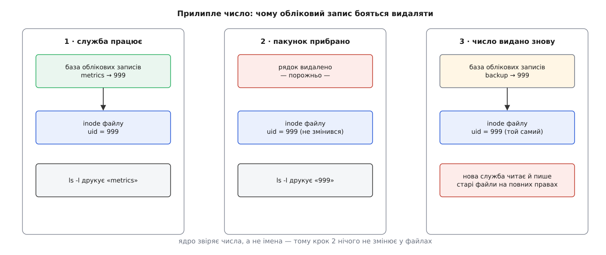
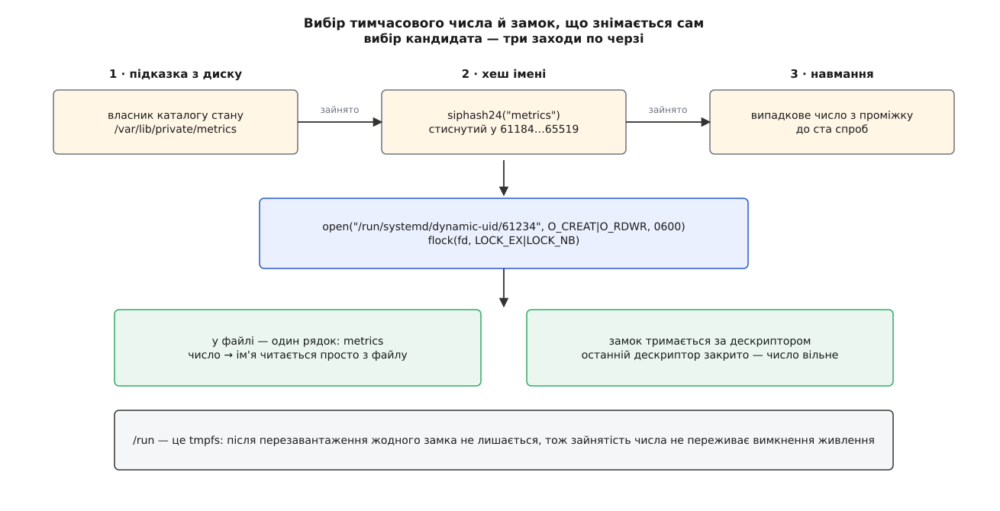
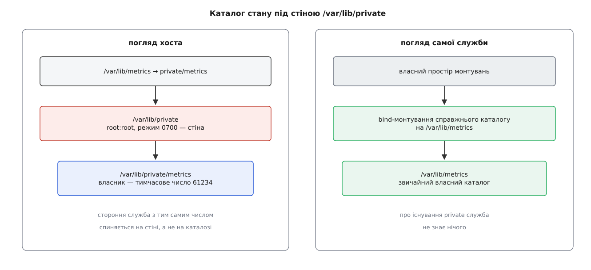

# DynamicUser: обліковий запис, що живе рівно стільки, скільки служба

<preknowlist>
- [Користувачі, групи й ідентичність процесу](book:unix-linux/uid-gid-model) — процес несе числову ідентичність (UID і GID), і саме за цими числами ядро вирішує, що йому дозволено.
- [База облікових записів: passwd, group, shadow і шар NSS](book:unix-linux/user-database-nss) — імена облікових записів живуть у базі, а перетворення «ім'я ↔ число» робить окремий шар підключних модулів (NSS).
- [Inode: файл без імені](book:unix-linux/inode-model) — власника файлу зберігає inode, і зберігає його числом, а не рядком.
- [systemd: юніти, залежності, цілі](book:unix-linux/systemd-model) — служба описана текстовим юнітом, а запускає її менеджер служб, він же PID 1.
- [Простори імен: ізоляція погляду на систему](book:unix-linux/namespaces) — процесові можна дати власний простір монтувань, у якому дерево каталогів виглядає інакше, ніж на хості.
- [Монтування й дерево монтувань](book:unix-linux/mount-model) — bind-монтування підставляє один каталог на місце іншого, не копіюючи вміст.
- [Блокування файлів: flock, POSIX-замки й замки на опис відкритого файлу](book:unix-linux/file-locking) — замок `flock` тримається за відкритим дескриптором і зникає разом з ним.
- [Огляд засобів взаємодії: що коли обирати](book:unix-linux/ipc-landscape) — об'єкти IPC (спільна пам'ять, семафори, черги) належать UID і переживають процес, що їх створив.
- [Біти прав і як їх перевіряють](book:unix-linux/permission-bits) — режим `0700` на каталозі означає, що всередину не зайде ніхто, крім власника.
</preknowlist>

Поставте на щойно встановлену систему вебсервер, базу даних і збирач метрик — у `/etc/passwd` з'являться три нові рядки. Приберіть усі три пакунки — рядки, найімовірніше, лишаться на місці. Через рік роботи машини таких рядків набереться кілька десятків, і жоден із них не належить людині: це імена, під якими працюють або колись працювали служби.

Саме накопичення не страшне: файл текстовий, рядок коштує сотню байтів. Страшне те, **чому** пакувальники бояться ці рядки прибирати.

## Число, що прилипає до файлів

Власника файлу файлова система зберігає числом. У inode лежить `uid = 999`, і більше нічого — жодного рядка, жодного посилання на базу облікових записів. Ім'я `metrics` існує в іншому місці й окремим життям: у базі, до якої програма звертається через шар NSS. Коли `ls -l` друкує ім'я власника, він бере з inode число й окремим запитом питає базу, як це число звати.

Звідси наслідок, який і зв'язує пакувальникам руки: видалити рядок з `/etc/passwd` — це не видалити власника, а лише позбавити його імені. Файли лишаються позначені числом `999`, і `ls -l` чесно показує голе `999`, бо перекласти його вже нема на що.

Поки число нічийне, це просто негарно. Але простір системних номерів невеликий — за звичною домовленістю дистрибутивів це 1…999 — і рано чи пізно наступний пакунок отримає той самий 999 для своєї служби. Тієї ж миті новий обліковий запис безкоштовно успадкує все, що лишила по собі попередня: її каталог у `/var/lib`, її тимчасові файли, її сегменти спільної пам'яті, її сокети. Не через помилку в ядрі, а точно за правилами: ядро звіряє числа, і числа збігаються.



*Ім'я живе в базі, а число — в inode; видалення рядка розриває пару, але не змінює жодного файлу, тож наступний власник того самого числа успадковує чужі права.*

Виходить глухий кут із двома однаково поганими виходами. Не видаляти записи — вони копичаться, простір номерів вичерпується, а машина роками носить імена служб, яких на ній давно немає. Видаляти — щоразу ставити на те, що після служби не лишилося нічого, що переживе її на диску.

## Умова, за якої обліковий запис можна відпустити

Переверніть задачу. Досі ми питали, коли запис **безпечно видалити**, і відповідь щоразу залежала від того, що встигла нарозкидати служба за роки роботи. Спитаймо натомість, за якої умови видалення взагалі перестає бути ризиком.

Умова точна й перевірна: обліковий запис можна відпустити тієї миті, коли в системі не лишилося **жодного досяжного об'єкта, позначеного його числом**. Ні файлу, ні каталогу, ні сегмента спільної пам'яті, ні семафора.

Для звичайної системної служби така умова не виконується ніколи — та й ніхто її не ставив. Але якщо зробити її вимогою від самого початку, тобто будувати службу так, щоб вона фізично не могла лишити по собі позначених слідів, то ідентичність перестає бути коштовним ресурсом, який шкода викидати. Вона стає такою ж витратною дрібницею, як номер процесу: видали й забудь.

Задача «зробити тимчасовий обліковий запис» розкладається тоді на три окремі, і кожна має власну відповідь:

1. звідки взяти число й чим утримати його за собою рівно на час роботи служби;
2. як дати цьому числу ім'я, не записавши його в жоден файл на диску;
3. як не дати службі лишити по собі нічого, що переживе зупинку.

`systemd` відповідає на всі три одним рядком у юніті:

```ini
[Service]
ExecStart=/usr/bin/metrics-collector
DynamicUser=yes
```

Ім'я облікового запису за замовчуванням береться з імені юніта (`metrics.service` → `metrics`); його можна задати явно через `User=`. Далі — що саме стається на кожному з трьох питань.

## Звідки береться число

Числа для тимчасових записів беруть із власного проміжку — **61184…65519**. Це 4336 номерів, свідомо винесених геть від системного проміжку 1…999 і від номерів живих людей; верхню межу лишили з запасом, бо `65534` традиційно займає `nobody`, а `65535` — це `(uid_t) -1`, тобто «жодного користувача». Дистрибутиви зобов'язані не роздавати номери з цього проміжку статично: інакше два світи зіткнуться.

Всередині проміжку номер шукають у три заходи, і порядок заходів має сенс.

**Перший — підказка з диску.** Якщо в службі вже є каталог стану, менеджер дивиться, кому той каталог належить, і пробує взяти саме це число. Так служба, яку перезапустили, отримує свій попередній номер, і нікому не доводиться рекурсивно переписувати власника гігабайтів даних.

**Другий — хеш імені.** Каталогу немає (перший запуск) або підказка не спрацювала: тоді число виводять з імені служби — `siphash24` від рядка імені, стиснутий у проміжок остачею від ділення. Хеш детермінований, тож `metrics` на цій машині щоразу цілитиме в те саме число, а різні служби майже завжди цілитимуть у різні.

**Третій — випадковий вибір.** Хеш привів у зайняте число: далі номери просто тягнуть навмання, доки не знайдеться вільний. Спроб рівно сто; не вийшло за сто — запуск служби провалюється з помилкою «зайнято», і це чесніше, ніж крутити цикл далі.

Кандидат ще не означає «моє». Перш ніж узяти число, менеджер перевіряє, чи не займає його статичний обліковий запис (`getpwuid`, `getgrgid`) і чи не висить на ньому якийсь об'єкт IPC. Група отримує те саме число, що й користувач: пара `UID = GID` з однаковим іменем.

## Замок, який неможливо забути зняти

Тепер найцікавіше — чим число утримують. Напрошується реєстр: файл зі списком зайнятих номерів, запис при старті, викреслення при зупинці. Реєстр має рівно ту саму ваду, що й `/etc/passwd`: він переживає того, хто в ньому записаний. Служба впала, менеджер перезавантажили, машину вимкнули посеред роботи — рядок лишився, номер назавжди зайнятий привидом.

Тому реєстру немає. Замість нього — **замок на дескрипторі**. Менеджер відкриває файл `/run/systemd/dynamic-uid/61234` з режимом `0600` і бере на ньому `flock(LOCK_EX|LOCK_NB)`. Замок `flock` тримається не за процесом і не за записом на диску, а за **відкритим описом файлу**: доки живий хоч один дескриптор, замок стоїть; закрився останній — замок зник тієї ж миті, і зник силами ядра, без жодної прибиральної дії з боку програми. Служба впала, її вбили сигналом, менеджер перезапустили — номер звільнився сам.

Другий здобуток такий самий безкоштовний: `/run` — це `tmpfs`, тобто пам'ять. Після перезавантаження там порожньо, і жодне число не переносить свою зайнятість через вимкнення живлення.

У самому файлі-замку лежить один рядок — ім'я служби. Це не примха, а зворотний бік довідника: за числом `61234` завжди можна прочитати, як його звати, просто прочитавши файл. Прямий бік (ім'я → число) менеджер тримає в пам'яті, у власній таблиці живих тимчасових записів.

Лишається дрібниця, яка насправді не дрібниця. Вибрати номер — означає зазирнути в базу облікових записів, а робити такі запити з PID 1 не можна: модуль NSS може виявитися мережевим і заблокуватися надовго, а PID 1, який чекає, зупиняє всю систему. Тому вибором займається породжений процес — і мусить якось віддати результат назад. Віддає він його через **сокет-сховище**: анонімну пару `AF_UNIX`/`SOCK_DGRAM`, у якій лежить щонайбільше одна дейтаграма — число, а разом з нею, допоміжним повідомленням, **сам дескриптор замка**. Дескриптор, переданий через сокет домену Unix, лишається тим самим відкритим описом файлу, тож замок мандрує між процесами, не перериваючись ні на мить. PID 1 і всі його нащадки бачать одне сховище просто тому, що успадкували ці два дескриптори.



*Зайнятість номера ніде не записана як факт — вона існує лише як живий замок на живому дескрипторі, тому не буває «застряглих» номерів.*

> ⚙️ Усю цю механіку легко відтворити руками й побачити на власні очі: хеш імені, спроба взяти замок, поведінка другого претендента на те саме число, передача дескриптора замка через сокет. Невелика програма на C і кілька команд спостереження за живою службою — у вставці [«Тимчасовий UID своїми руками»](book:unix-linux/dynamic-service-users/proj-uid-lock-by-hand.md).

## Ім'я без рядка в базі

Число є, тепер йому потрібне ім'я — і потрібне по-справжньому, не для краси. Служба всередині може викликати `getpwnam("metrics")`, щоб дізнатися свій домашній каталог; адміністратор дивиться `ps` і `ls -l`; журнал показує, від чийого імені прийшов запис. Усе це проходить через ту саму базу облікових записів, у яку тимчасовому запису дороги немає — бо будь-який запис на диск повертає нас до початкової проблеми.

Вихід дає сам устрій NSS: база — не файл, а набір джерел, і `/etc/passwd` лише одне з них. Модуль `nss-systemd`, прописаний у `/etc/nsswitch.conf`, додає ще одне джерело — те, що живе в пам'яті менеджера служб.

Питає він його не власним самопальним способом, а через спільний інтерфейс: у каталозі `/run/systemd/userdb/` кожне джерело облікових записів виставляє свій сокет, і клієнт розсилає запит по всіх одразу. Тимчасові записи віддає служба `io.systemd.DynamicUser`, реалізована безпосередньо в PID 1 — бо саме він єдиний знає, які числа зараз зайняті й чиї вони.

> 🔧 **Навіщо це.** Практичний наслідок простий: якщо `nss-systemd` не ввімкнено в `/etc/nsswitch.conf` (а в мінімальному образі контейнера його часто немає), імена тимчасових записів нізвідки взятися — `ls -l` покаже голі числа, а `getpwnam` усередині служби поверне «немає такого користувача». Служба при цьому працюватиме: ядру числа досить. Ламатиметься лише те, що покладається на ім'я — і саме так виглядає ця несправність, коли на неї натрапляють уперше.

Ця ж механіка дає зручний спосіб подивитися на все живцем, не пишучи юніта:

```sh
systemd-run --pty -p DynamicUser=yes id
```

## Обмеження, яких ніхто не просив

Лишилося третє питання — і саме воно перетворює `DynamicUser=` з дрібної зручності на серйозну вимогу до служби. Число повертається в обіг; отже, треба гарантувати, що після зупинки його ніде не лишилося. Гарантія не може бути порадою в документації: її треба вбудувати.

Тому один рядок `DynamicUser=yes` мовчки вмикає цілий набір обмежень, і жодне з них **не можна вимкнути**. Усі вони — звичайні директиви [пісочниці служби](book:unix-linux/service-sandboxing), доступні будь-якому юніту й окремо; новина тут лише в тому, що тут їх не пропонують, а нав'язують. Кожна закриває конкретну дірку, крізь яку число могло б утекти назовні.

`ProtectSystem=strict` робить усю ієрархію файлової системи доступною лише для читання, `ProtectHome=read-only` — те саме з домівками. Разом вони прибирають головний спосіб лишити слід: просто щось десь записати. Дозволені для запису місця треба назвати явно.

`PrivateTmp=yes` дає службі власні `/tmp` і `/var/tmp`, які зникають разом з нею. Це не про акуратність, а про арифметику: у типовій системі це чи не єдині каталоги, доступні на запис усім, тож без цієї підстановки попередній абзац не мав би сенсу.

`RemoveIPC=yes` після зупинки видаляє всі об'єкти IPC — сегменти спільної пам'яті, семафори, черги повідомлень, — що належать цьому числу. Об'єкт IPC не лежить у файловій системі й переживає свого творця, тож жодні права на каталоги його не стосуються; його треба прибирати окремо й адресно.

`NoNewPrivileges=yes` і `RestrictSUIDSGID=yes` закривають найгірший з можливих слідів. Без них служба могла б лишити по собі виконуваний файл із бітом setuid, що належить її числу, — а це вже не «чужий файл прочитали», а «чужий запис виконав код від імені майбутнього власника номера».

Разом ці обмеження і є та сама умова, з якої ми починали, записана мовою юніта. Тимчасова ідентичність можлива не тому, що хтось акуратно прибирає за службою, а тому, що службі просто нема де насмітити.

Повний перелік того, що саме вмикається, які директиви з ним поєднуються й що з них можна доналаштувати, зібрано таблицями у вставці [«Що саме вмикає один рядок DynamicUser»](book:unix-linux/dynamic-service-users/api-dynamic-user-surface.md) — там же межі проміжку номерів, поведінка `User=`/`Group=` і директиви керованих каталогів.

## Стан, який мусить пережити зупинку

Але служби бувають із даними. Збирач метрик хоче зберігати накопичене, база даних — свої таблиці. Каталог для цього дає окрема директива — одна з родини [керованих каталогів служби](book:unix-linux/service-directories), які менеджер створює на старті й прибирає за правилами юніта:

```ini
[Service]
ExecStart=/usr/bin/metrics-collector
DynamicUser=yes
StateDirectory=metrics
```

Наївне рішення — створити `/var/lib/metrics` і призначити йому власником поточне тимчасове число. Воно ламається рівно об ту саму стіну: служба зупинилася, число пішло в обіг, каталог лишився з числом на inode — і ми повернулися рівно до тієї ситуації, з якої починали: чужі дані чекають на наступного власника числа.

Рішення тримається на тому, що недосяжне краще за незаписане. Справжній каталог створюють не в `/var/lib/metrics`, а в **`/var/lib/private/metrics`**, а `/var/lib/private` — це каталог `root:root` з режимом `0700`. Через таку стіну не пройде ніхто, крім суперкористувача: навіть якщо процес отримав те саме число, що торік мала інша служба, він не зможе навіть увійти в `/var/lib/private`, щоб дістатися каталогу з тим числом усередині. Захищає не власник цільового каталогу, а батько, повз якого не пройти.

Незручність такої схеми очевидна — шлях змінився, і всі, хто чекає дані в `/var/lib/metrics`, помиляться. Її прибирають двома підстановками. На хості `/var/lib/metrics` — це символьне посилання на `private/metrics`, тож суперкористувач і резервне копіювання ходять звичним шляхом. А самій службі, яка живе у власному просторі монтувань, справжній каталог bind-монтують просто на `/var/lib/metrics` — вона бачить звичайний каталог, який їй належить, і ніколи не дізнається про існування стіни.



*Стіною є батьківський каталог: сам каталог стану належить тимчасовому числу, але дійти до нього ззовні неможливо, тож повторна видача числа нічого не відкриває.*

Той самий устрій мають `/run/private`, `/var/cache/private` і `/var/log/private` — для `RuntimeDirectory=`, `CacheDirectory=` і `LogsDirectory=`. І саме власник цього каталогу стає першою підказкою при наступному виборі числа: коло замикається, служба отримує свій попередній номер, а дані лишаються на місці без жодного `chown`.

Директиви `StateDirectory=` і сусідні з'явилися на рік пізніше за сам `DynamicUser=` — у випуску 235 проти 232, — і саме вони зробили механізм придатним для служб із даними, а не лише для тих, що нічого не зберігають. Обидва боки схеми враховані й на перемиканні: якщо в юніті прибрати `DynamicUser=yes`, менеджер перенесе каталог назад із `private/` у звичайне місце.

> 📜 Той рік між двома випусками — не випадковість, а рівно та відстань, за яку ідея «одноразового облікового запису» доросла від зручності для служб без стану до придатної для всіх решти. Звідки взявся сам звичай заводити службі постійний запис, чим його намагалися впорядкувати до того й що з цього залишилось — у вставці [«Як службам роздавали імена»](book:unix-linux/dynamic-service-users/hist-service-accounts.md).

## Де це не працює

Чесна межа механізму випливає з тієї самої умови й тому окреслюється легко.

Служба, якій потрібне **стале число за межами керованих каталогів**, під `DynamicUser=` не піде: файл на мережевій файловій системі, спільне сховище, каталог, куди пише ще хтось, — усе це слід, який переживе службу й дістанеться наступному власникові числа. Формально дозвіл на запис туди можна виписати через `ReadWritePaths=`, і саме тут найлегше звести нанівець усю схему, тож така виписка вимагає окремої відповіді на питання «а хто успадкує ці файли за рік».

Служба, яка **сама роздає ідентичності** — приймає пошту для десятків локальних користувачів, перемикається на UID того, хто увійшов, — має справу з чужими числами, і тимчасове власне їй не допомагає. Служба, якій потрібні **права суперкористувача**, теж очевидно поза грою: `DynamicUser=` існує саме для того, щоб їх не було.

І останнє, суто практичне: якщо обліковий запис із таким іменем уже існує **статично**, менеджер бере його й нічого не виділяє. Це не збій, а навмисний місток: пакунок може лишити старий запис для машин, де він уже нажив дані, і водночас увімкнути `DynamicUser=` для нових установок — поведінка розійдеться сама, за наявністю рядка в базі.
