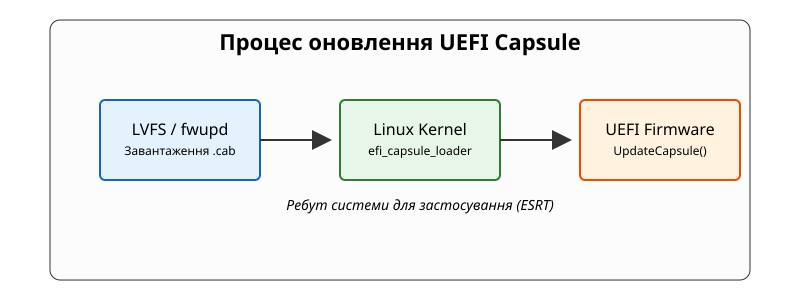
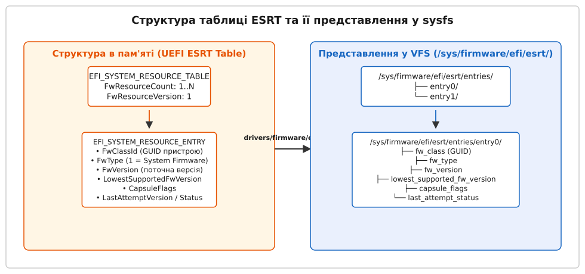

# Оновлення прошивки з-під системи: капсули UEFI, таблиця ESRT і fwupd

<preknowlist>
- [UEFI-прошивка та NVRAM-змінні](topic:unix-linux/uefi-firmware) — архітектура Runtime Services, структури NVRAM та взаємодія ядра з прошивкою.
- [Secure Boot та ланцюжок довіри](topic:unix-linux/secure-boot) — механізм валідації підписів, бази даних db/dbx та публічні ключі виробника.
- [Ланцюжок завантаження Linux](topic:unix-linux/boot-chain) — послідовність етапів завантаження від фізичного скидання до передачі керування ядру.
</preknowlist>

Коли в мікрокоді процесора або контролері SMM (System Management Mode) виявляють вразливість рівня High/Critical (на кшталт BootHole або LogoFAIL), для її усунення потрібно переписати вміст мікросхеми SPI flash на материнській платі. У традиційних системах це вимагало перезавантаження у DOS або Windows PE зі спеціальними закритими утилітами флешування, оскільки ядро Linux у захищеному режимі (Long Mode) не має прямого безпечного доступу до регістрів флеш-контролера, а випадкове вимкнення живлення під час стирання секторів незворотно пошкоджує початковий завантажувач. Для автоматизованого оновлення тисяч серверів у дата-центрі без фізичної присутності оператора специфікація UEFI встановила стандарт оновлень через капсули (Capsule Updates), а операційна система Linux вибудувала над ним систему обліку пристроїв ESRT та демон `fwupd`.

## 1. Причинно-наслідковий бар'єр: чому прошивку не можна переписати як звичайний файл

Фундаментальна складна проблема прошивання з-під операційної системи розбивається на два залізні обмеження безпеки та архітектури чипсета:

1. **Апаратний блокувальник SPI BIOS Lock (SMM BIOS_CNTL)**: Чипсет материнської плати (Platform Controller Hub, PCH) під час початкового завантаження встановлює біт `BIOS_CNTL.BIOSLE` (SMM BIOS Write Protect Enable) у конфігураційному просторі PCI флеш-контролера. Після встановлення цього біта будь-яка спроба ядра ОС або драйвера записати байти у регістри SPI Flash генерує апаратне системне переривання SMI (System Management Interrupt). Це переривання миттєво переключає усі ядра процесора у привілейований режим SMM (System Management Mode), де виконується ізольована прошивка SMRAM. Код SMM-хендлера перевіряє, чи було встановлено спеціальний дозвільний біт оновлення, і відхиляє прямий запис з ядра. Це залізно захищає BIOS від зловмисних драйверів та шкідливого коду простору користувача.
2. **Конфлікт шини SPI та системна конкурентність**: Фізична мікросхема SPI Flash на материнській платі обслуговує не лише системний BIOS, а й контролер управління платою (Management Engine / EC / BMC). Спроба стирання сектору flash-пам'яті (яка триває від сотень мілісекунд до кількох секунд) під час виконання операційної системи повністю блокує шину SPI. Якщо в цей момент ядро Linux або системна служба спробує звернутися до прошивки через UEFI Runtime Services або прочитати конфігурацію чипсета, система зазнає незворотного краху ядра (Kernel Panic) або блокування шини (Bus Deadlock).

Глибинний режим SMM використовує відокремлену область пам'яті SMRAM (закодовану за адресами TSEG або Base SMRAM), захищену бітами `SMM_CODE_CHK` та `D_LCK` у контролері оперативної пам'яті. Операційна система у захищеному 64-бітному Long Mode не має фізичної змоги зчитати чи модифікувати код SMM-хендлерів.

Отже, прошивку неможливо записати "на льоту" з-під працюючого ядра без спеціального стандартизованого протоколу узгодження. Потрібен механізм, який дозволить ОС підготувати новий образ прошивки в оперативній пам'яті, передати його через межу скидання (Reset Boundary) і змусити саму прошивку переписати свій SPI Flash на найранніших фазах ініціалізації, коли жодна операційна система ще не працює і залізо перебуває у контрольованому монопольному стані.

## 2. Анатомія та лінійний життєвий цикл UEFI Capsule

Концептуально UEFI Capsule (капсула) — це стандартизований бінарний контейнер, який складається з самоо описового заголовка та корисного навантаження (payload), призначеного для прошивки.

### Формат заголовка EFI_CAPSULE_HEADER

Будь-який файл капсули починається зі структури `EFI_CAPSULE_HEADER`, визначеної специфікацією UEFI:

```text
+-------------------------------------------------------+
| CapsuleGuid (128-бітний GUID пристрою або цілі)       |
+-------------------------------------------------------+
| HeaderSize (розмір заголовка в байтах)                |
+-------------------------------------------------------+
| Flags (бітні прапорці поведінки капсули)              |
+-------------------------------------------------------+
| CapsuleImageSize (загальний розмір капсули з payload) |
+-------------------------------------------------------+
| Payload (байти бінарного образу прошивки)             |
| ...                                                   |
+-------------------------------------------------------+
```

Ключовими є бітні прапорці в полі `Flags`:
- `CAPSULE_FLAGS_PERSIST_ACROSS_RESET` (`0x00010000`): повідомляє прошивці, що капсула мусить залишатися в RAM під час теплого перезавантаження (Warm Reset).
- `CAPSULE_FLAGS_POPULATE_SYSTEM_TABLE` (`0x00020000`): вказує прошивці розпакувати вміст капсули у системну конфігураційну таблицю UEFI System Table під час виконання Runtime.
- `CAPSULE_FLAGS_INITIATE_RESET` (`0x00040000`): вимагає від прошивки негайно ініціювати перезавантаження системи одразу після валідації капсули.

### Передача через фізичну пам'ять: Scatter-Gather Block Lists

Типовий розмір капсули BIOS становить від 8 до 32 Мегабайт. Виділити суцільний безперервний блок фізичної пам'яті такого розміру у працюючій ОС з високим ступенем фрагментації RAM майже неможливо. Для розв'язання цієї проблеми специфікація UEFI використовує дескриптори списків розкиду-збору (Scatter-Gather List).

Ядро Linux розбиває капсулу на окремі фізичні сторінки (по 4 Кілобайти або більше) і створює масив структур `EFI_CAPSULE_BLOCK_DESCRIPTOR`:

```text
+---------------------------------------------------------+
| Length (розмір блоку даних в байтах)                   |
+---------------------------------------------------------+
| Union:                                                  |
|   DataBlock (фізична адреса сторінки пам'яті з payload) |
|   ContinuationPointer (фізична адреса наступного списку)|
+---------------------------------------------------------+
```

Ядро передає UEFI не самий масив байтів прошивки, а фізичну адресу першого елемента Scatter-Gather списку.

### Альтернативний варіант: Capsule-on-Disk

Якщо операційна система вимагає повного вимкнення живлення (Cold Reset) або на системі недостатньо вільної RAM для утримання Scatter-Gather списків, специфікація UEFI підтримує механізм Capsule-on-Disk. Демон `fwupd` або завантажувач записує файл капсули безпосередньо у спеціальний каталог системного розділу ESP:

```text
/boot/efi/EFI/UpdateCapsule/GPNP_Capsule.cap
```

Під час наступного старту UEFI драйвер файлової системи FAT32 сканує каталог `\EFI\UpdateCapsule\`, зчитує файл в RAM перед ініціалізацією основних драйверів, проводить автентифікацію та видаляє файл з диска після завершення флешування.

### Криптографічна будова payload та структури PKCS#7

Усередині корисного навантаження (payload) капсула містить не лише чисті байти мікрокоду, а й криптографічний підписи. Одразу за `EFI_CAPSULE_HEADER` розміщується заголовок аутентифікованого сертифіката `WIN_CERTIFICATE_UEFI_GUID`:

```text
+---------------------------------------------------------+
| dwLength (загальна довжина сертифіката та підпису)     |
+---------------------------------------------------------+
| wRevision (0x0200) / wCertificateType (0x0EF1)          |
+---------------------------------------------------------+
| CertType GUID (EFI_CERT_TYPE_PKCS7_GUID)                |
+---------------------------------------------------------+
| CertData (контейнер PKCS#7 із цифровим підписом)       |
+---------------------------------------------------------+
| Firmware Microcode Payload (бінарний образ BIOS)        |
+---------------------------------------------------------+
```

Під час верифікації прошивка обчислює криптографічний хеш SHA-256 від усього бінарного образу прошивки і звіряє його з цифровим підписом PKCS#7, використовуючи публічний ключ розробника (OEM Root Key), зашитий у захищеній пам'яті SPI Flash.

### Повний пайплайн руху капсули


*Схема 1. Послідовність передачі даних та керування від простору користувача до UEFI під час оновлення.*

Покрокова послідовність етапів оновлення системного BIOS через капсулу:

1. **Етап користувача**: Демон `fwupd` завантажує підписаний `.cab` архів з сервісу LVFS, розпаковує капсулу `firmware.cap` і відкриває вузол символьного пристрою ядра `/dev/efi_capsule_loader`.
2. **Етап ядра**: Драйвер `efi_capsule_loader` виділяє фізичні сторінки RAM, копіює туди payload, вибудовує масив `EFI_CAPSULE_BLOCK_DESCRIPTOR` і викликає UEFI Runtime Service `UpdateCapsule()`. Одночасно ядро встановлює біт `EFI_OS_INDICATIONS_FILE_CAPSULE_DELIVERY_SUPPORTED` у NVRAM змінній `OsIndications`.
3. **Етап Warm Reset**: Операційна система викликає перезавантаження. Чипсет зберігає живлення модулів RAM (Warm Reset), завдяки чому вміст сторінок з капсулою залишається недоторканим.
4. **Етап PEI / DXE (UEFI POST)**: Під час початкової ініціалізації прошивка перевіряє змінні `OsIndications` та `CapsuleUpdateData`. Прошивка знаходить Scatter-Gather списки в RAM, збирає капсулу в єдиний буфер і проводить криптографічну аутентифікацію.
5. **Аутентифікація та запис SPI Flash**: Прошивка перевіряє цифровий підпис капсули (за допомогою вшитого в BIOS публічного ключа виробника). Якщо підпис збігається і версія капсули не нижча за дозволений поріг, драйвер DXE прошиває SPI Flash.
6. **Звітування статусу та Capsule Result Variable**: Результат оновлення прошивка записує у спеціальну NVRAM змінну звітності `CapsuleXXXX` (структура `EFI_CAPSULE_RESULT_VARIABLE_HEADER`) під GUID `EFI_CAPSULE_REPORT_GUID`. Ядро Linux при наступному старті читає цей звіт і оновлює таблицю ESRT.

> 🔧 **Навіщо це.** Впровадження Scatter-Gather списків та Warm Reset дозволяє оновлювати складну прошивку без використання пропрієтарних завантажувальних накопичувачів і без ризику пошкодження системи під час роботи ОС.

## 3. Паспорт прошивок: Таблиця ESRT (EFI System Resource Table)

Для того щоб операційна система та користувацькі утиліти могли дізнатися, які пристрої в системі підтримують оновлення через капсули, їхні поточні версії та стан попередніх спроб оновлення, специфікація UEFI ввела таблицю ESRT.

### Структура ESRT у пам'яті

Під час завантаження прошивка будує в RAM таблицю ESRT і реєструє її адресу у системній конфігураційній таблиці UEFI System Table (під GUID `EFI_SYSTEM_RESOURCE_TABLE_GUID`).


*Схема 2. Мапінг бінарних структур ESRT у пам'яті системи до файлового дерева sysfs.*

Таблиця складається з заголовка `EFI_SYSTEM_RESOURCE_TABLE` та масиву структур `EFI_SYSTEM_RESOURCE_ENTRY`:

:::tabs
```c
/* Визначення структур ESRT специфікації UEFI мовою C */
typedef struct {
    UINT32 FwResourceCount;       // Кількість записів у таблиці
    UINT32 FwResourceCountMax;    // Максимальна можлива кількість записів
    UINT64 FwResourceVersion;     // Версія структури ESRT (наразі 1)
} EFI_SYSTEM_RESOURCE_TABLE;

typedef struct {
    EFI_GUID FwClass;                     // GUID класу пристрою (унікальний ID)
    UINT32   FwType;                      // Тип ресурсу (1=System, 2=Device, 3=UEFI Driver)
    UINT32   FwVersion;                   // Поточна встановлена версія прошивки
    UINT32   LowestSupportedFwVersion;    // Мінімальна дозволена версія (захист від Anti-Rollback)
    UINT32   CapsuleFlags;                // Прапорці оновлення
    UINT32   LastAttemptVersion;          // Версія останнього спробованого оновлення
    UINT32   LastAttemptStatus;           // Код результату останньої спроби (0=Success)
} EFI_SYSTEM_RESOURCE_ENTRY;
```
```cpp
// Ті самі структури ESRT у C++20 з фіксованими типами stdint
#include <cstdint>
#include <array>

struct alignas(8) EfiGuid {
    std::uint32_t data1;
    std::uint16_t data2;
    std::uint16_t data3;
    std::array<std::uint8_t, 8> data4;
};

struct alignas(8) EfiSystemResourceTable {
    std::uint32_t fw_resource_count;
    std::uint32_t fw_resource_count_max;
    std::uint64_t fw_resource_version;
};

struct alignas(8) EfiSystemResourceEntry {
    EfiGuid       fw_class;
    std::uint32_t fw_type;
    std::uint32_t fw_version;
    std::uint32_t lowest_supported_fw_version;
    std::uint32_t capsule_flags;
    std::uint32_t last_attempt_version;
    std::uint32_t last_attempt_status;
};
```
:::

### Експорт у sysfs: `drivers/firmware/efi/esrt.c`

Під час старту ядро Linux (модуль `esrt.c`) знаходить таблицю в пам'яті, валідує її цілісність і створює віртуальну файлову систему в VFS за шляхом:

```text
/sys/firmware/efi/esrt/
├── entries/
│   ├── entry0/
│   │   ├── capsule_flags
│   │   ├── fw_class
│   │   ├── fw_type
│   │   ├── fw_version
│   │   ├── last_attempt_status
│   │   ├── last_attempt_version
│   │   └── lowest_supported_fw_version
│   └── entry1/
│       └── ...
```

Кожен текстовий файл у теці `entryX` експортує відповідне числове або GUID значення. Наприклад, прочитати поточну версію системного BIOS можна прямо з консолі:

```bash
cat /sys/firmware/efi/esrt/entries/entry0/fw_version
cat /sys/firmware/efi/esrt/entries/entry0/fw_class
```

Поле `fw_class` містить унікальний GUID (наприклад `8b4c2b9a-12ef-4d30-9b48-18e400b84d9f`), який є ключем для пошуку відповідного оновлення прошивки у базі даних LVFS.

### Захист від атак зниження версії (Anti-Rollback)

Важливим полем у структурі `EFI_SYSTEM_RESOURCE_ENTRY` є `LowestSupportedFwVersion`. Зловмисник може спробувати записати старішу версію BIOS, яка містить відому вразливість, щоб обійти захист Secure Boot або викрасти ключі з TPM 2.0.

Для протидії цьому прошивка зберігає номер версії безпеки (Security Version Number, SVN) у захищених eFuse-перемичках чи одноразово програмованій пам'яті (OTP Flash). Якщо файл капсули містить `FwVersion` нижчу за `LowestSupportedFwVersion`, прошивка під час DXE фази негайно скасовує оновлення і повертає статус `LAST_ATTEMPT_STATUS_ERROR_INCORRECT_VERSION` (`0x00000003`).

## 4. Шлях капсули крізь ядро: `/dev/efi_capsule_loader`

Коли простір користувача хоче передати капсулу прошивці, він спілкується з ядром через вузол пристрою `/dev/efi_capsule_loader`. Цей символьний пристрій керується драйвером `drivers/firmware/efi/capsule-loader.c`.

### Механізм запису та валідації

Процес передачі капсули з користувацького простору в ядро підпорядковується чіткій послідовності:

1. **Відкриття пристрою**: `fwupd` відкриває `/dev/efi_capsule_loader` у режимі запису (`O_WRONLY`). Драйвер ядра виділяє внутрішній контекст завантаження `struct capsule_loader`.
2. **Передача заголовка**: Перший виклик `write()` передає перші байти, що містять `EFI_CAPSULE_HEADER`. Драйвер ядра валідує заголовок: розмір `HeaderSize`, загальну довжину `CapsuleImageSize` та прапорці.
3. **Виділення сторінок пам'яті**: Драйвер викликає `alloc_page(GFP_KERNEL)` для кожної сторінки розміром 4 Кілобайти і копіює туди дані payload з простору користувача. Одночасно будується масив фізичних сторінок та сторінок Scatter-Gather списку.
4. **Закриття файлу (Close/Release)**: Після того як `fwupd` записав усі байти і викликав `close(fd)`, драйвер ядра передає сформований список фізичних сторінок функції `efi_capsule_update()`.
5. **Виклик Runtime Service**: Драйвер викликає UEFI Runtime Service `UpdateCapsule()`, якщо прошивка підтримує оновлення під час виконання, або зберігає вказівник у NVRAM змінні і встановлює прапорець у `OsIndications` для обробки під час перезавантаження.

Якщо під час виділення пам'яті або валідації заголовка виникає помилка, системний виклик `write()` повертає `-EINVAL` або `-ENOMEM`, запобігаючи передачі пошкоджених даних до прошивки.

## 5. Демон `fwupd` та екосистема LVFS

Низькорівневі механізми ядра та UEFI дають змогу передати капсулу, але вони не вирішують питань: звідки взяти капсулу, як дізнатися про сумісність і як безпечно провести користувача через процес оновлення. Для цього створено проект **fwupd** та сервіс **LVFS (Linux Vendor Firmware Service)**.

### Архітектура та плагіни fwupd

Демон `fwupd` (працює як фонова служба systemd `fwupd.service`) надає системну шину D-Bus (`org.freedesktop.fwupd`). Архітектура демона повністю модульна і базується на плагінах:

```text
               +----------------------------------+
               |        fwupd.service (D-Bus)     |
               +----------------------------------+
                                |
        +-----------------------+-----------------------+
        |                       |                       |
+---------------+       +---------------+       +---------------+
| uefi_capsule  |       |     nvme      |       |   thunderbolt |
|    plugin     |       |    plugin     |       |    plugin     |
+---------------+       +---------------+       +---------------+
        |                       |                       |
  /dev/efi_capsule     /dev/nvmeX (ioctl)       /sys/bus/tb/
```

- **`uefi_capsule`**: Взаємодіє з `/sys/firmware/efi/esrt/` та `/dev/efi_capsule_loader` для оновлення системного BIOS та прошивок системної плати.
- **`nvme`**: Використовує прямолінійні адміністративні команди NVMe через `ioctl()` для оновлення прошивок SSD-накопичувачів.
- **`thunderbolt`**: Оновлює контролери шини Thunderbolt/USB4 через спец-інтерфейси sysfs.
- **`uefi_dbx`**: Автоматично завантажує та оновлює базу відкликаних підписів Secure Boot.
- **`redfish`**: Взаємодіє з серверними контролерами управління BMC (Dell iDRAC, HPE iLO) через мережевий інтерфейс Host Interface для позасистемного (Out-of-Band) оновлення прошивок.

### LVFS (Linux Vendor Firmware Service) та архіви `.cab`

LVFS — це глобальний портал, куди виробники апаратного забезпечення (Dell, Lenovo, HP, Logitech, Intel тощо) завантажують підписані пакунки прошивок. 

Пакунок випускається у стандартному архіві Microsoft Cabinet (`.cab`), який містить:
1. `firmware.bin` / `firmware.cap` — бінарний payload прошивки.
2. `firmware.metainfo.xml` — метадані у форматі AppStream, що містять GUID пристроїв (`FwClassId`), ченджлог, рівень терміновості та вимоги до версій.
3. `firmware.jcat` — файл криптографічних підписів JSON Catalog (JCAT), який підтверджує, що архів не підроблено після завантаження виробником на LVFS.

Команда `fwupdmgr refresh` завантажує каталог метаданих з LVFS, а `fwupdmgr update` порівнює `FwClassId` GUID пристроїв з ESRT проти каталогу LVFS і за потреби завантажує потрібний `.cab` архів.

### Автоматизація, інспектування JSON та аудит безпеки HSI

У корпоративних дистрибутивах Linux демон `fwupd` інтегрується з таймерами systemd через службові юніти `fwupd-refresh.timer` та `fwupd-refresh.service`. Таймер періодично виконує фонову перевірку оновлень каталогу LVFS без втручання користувача та надсилає сповіщення системному адміністратору.

Для систем автоматизації та скриптів управління конфігураціями (Ansible, SaltStack) утиліта `fwupdmgr` підтримує машинно-орієнтований вивід у форматі JSON:

```bash
fwupdmgr get-devices --json
```

Цей виклик повертає повну ієрархію пристроїв, їхні GUID, поточні версії та стан Secure Boot. Крім того, для дотримання корпоративних стандартів відповідності (SOC2, FedRAMP) `fwupd` інтегрується з підсистемою `auditd` ядра Linux, фіксуючи кожне підготовлене оновлення у системному журналі аудиту з точним хешем та ідентифікатором оператора.

Окрім доставки прошивок, `fwupd` виконує аудит безпеки обладнання через систему атрибутів HSI (Host Security ID). Команда `fwupdmgr security` опитує стан SPI Lock, наявність розграничення пам'яті IOMMU, роботу TPM 2.0, активацію Secure Boot та захист від атак LogoFAIL. Кожен фактор оцінюється за рівнями від HSI-1 до HSI-4, надаючи адміністраторові цілісну картину апаратної захищеності сервера.

### fwupdmgr проти fwupdtool

В інфраструктурі fwupd є два ключових інструменти командного рядка:
- **`fwupdmgr`**: Високорівневий D-Bus клієнт. Він спілкується виключно з фоновим демоном `fwupd.service`. Його слід використовувати в усіх сценаріях адміністрування, оскільки демон арбітрує доступ до заліза і запобігає race conditions.
- **`fwupdtool`**: Низькорівневий інструмент розробника та відновлення. Він зупиняє `fwupd.service` і самостійно завантажує плагіни прямо у свій процес. Використовується для зчитування відлагоджувальної інформації, примусового прошивання в разі аварій або аналізу пристроїв.

## 6. Оновлення периферії та NVMe SSD "на льоту"

Не всі оновлення прошивок вимагають перезавантаження системи через UEFI Capsule. Сучасні периферійні пристрої та NVMe накопичувачі підтримують оновлення в режимі онлайн (Runtime Firmware Update).

### Протокол NVMe Firmware Commit

Специфікація NVMe передбачає можливість завантаження та активації прошивки контролера SSD без перезавантаження операційної системи. 

Плагін `nvme` у `fwupd` виконує два послідовних кроки через системний виклик `ioctl(fd, NVME_IOCTL_ADMIN_CMD, &cmd)`:

1. **Firmware Image Download (Opcode `0x10`)**: Прошивка розбивається на фрагменти, які передаються в буфер контролера SSD із зазначенням зсуву (`NUMD` та `OFA`).
2. **Firmware Commit (Opcode `0x11`)**: Контролеру передається команда вибору слота прошивки (Firmware Slot) та дії активації (Commit Action):
   - `Action 0`: Записати образ у слот, але не вибирати його для завантаження.
   - `Action 1`: Записати образ у слот і зробити його активним після наступного скидання контролера (Power Cycle).
   - `Action 2`: Записати образ у слот і негайно активувати його **без скидання системи** (Firmware Activation Without Reset).

Якщо контролер підтримує `Action 2`, накопичувач миттєво переключається на новий мікрокод без зупинки роботи файлової системи Linux.

### Оновлення Secure Boot dbx (`uefi_dbx`)

Окремою критичною функцією `fwupd` є доставка оновлень для бази відкликаних ключів Secure Boot — `dbx`. Коли у завантажувачах GRUB чи shim знаходять уразливості (на кшталт BootHole), Microsoft випускає новий хеш-список відкликань.

Плагін `uefi_dbx` отримує двонарний файл `dbxupdate.bin`, підписаний ключем KEK (Key Exchange Key), і передає його прошивці через виклик аутентифікованих зміних `SetVariable()`. UEFI перевіряє підпис KEK і мержить нові відкликані хеші у змінну `dbx` в NVRAM, унеможливлюючи запуск вразливих версій завантажувачів під час наступного старту.

## 7. Практична взаємодія з ESRT із програмного коду (C та C++)

Нижче наведено приклад коду, який сканує віртуальну файлову систему `/sys/firmware/efi/esrt/entries/`, зчитує всі присутні пристрої ESRT, розпаковує їхні атрибути (`fw_class`, `fw_version`, `last_attempt_status`) та виводить інформацію користувачеві з розшифровкою кодів помилок.

:::tabs
```c
/* esrt_reader.c — Читання атрибутів ESRT мовою C */
#include <stdio.h>
#include <stdlib.h>
#include <string.h>
#include <dirent.h>
#include <unistd.h>
#include <fcntl.h>

#define ESRT_PATH "/sys/firmware/efi/esrt/entries"

static void read_sysfs_string(const char *dir_path, const char *file_name, char *buffer, size_t max_len) {
    char full_path[512];
    snprintf(full_path, sizeof(full_path), "%s/%s", dir_path, file_name);
    
    int fd = open(full_path, O_RDONLY);
    if (fd < 0) {
        strncpy(buffer, "N/A", max_len);
        return;
    }
    
    ssize_t bytes_read = read(fd, buffer, max_len - 1);
    close(fd);
    
    if (bytes_read > 0) {
        buffer[bytes_read] = '\0';
        char *newline = strchr(buffer, '\n');
        if (newline) *newline = '\0';
    } else {
        strncpy(buffer, "N/A", max_len);
    }
}

static unsigned int read_sysfs_uint(const char *dir_path, const char *file_name) {
    char buf[64];
    read_sysfs_string(dir_path, file_name, buf, sizeof(buf));
    return (unsigned int)strtoul(buf, NULL, 0);
}

const char* decode_esrt_status(unsigned int status) {
    switch (status) {
        case 0: return "Успішно (Success)";
        case 1: return "Помилка (Unsuccessful)";
        case 2: return "Недостатньо ресурсів (Insufficient Resources)";
        case 3: return "Некоректна версія / Anti-Rollback (Incorrect Version)";
        case 4: return "Невірний формат капсули (Invalid Format)";
        case 5: return "Помилка автентифікації підпису (Auth Error)";
        case 6: return "Відсутнє живлення від мережі AC (Power Event)";
        default: return "Невідомий код помилки";
    }
}

int main(void) {
    DIR *dir = opendir(ESRT_PATH);
    if (!dir) {
        perror("Не вдалося відкрити " ESRT_PATH " (UEFI ESRT не підтримується або відсутній)");
        return EXIT_FAILURE;
    }

    struct dirent *entry;
    printf("%-38s | %-10s | %-10s | %s\n", "GUID пристрою (FwClass)", "Версія", "Остання", "Статус останньої спроби");
    printf("--------------------------------------------------------------------------------------------------------\n");

    while ((entry = readdir(dir)) != NULL) {
        if (entry->d_name[0] == '.') continue;

        char entry_dir[512];
        snprintf(entry_dir, sizeof(entry_dir), "%s/%s", ESRT_PATH, entry->d_name);

        char fw_class[64];
        read_sysfs_string(entry_dir, "fw_class", fw_class, sizeof(fw_class));

        unsigned int fw_version = read_sysfs_uint(entry_dir, "fw_version");
        unsigned int last_version = read_sysfs_uint(entry_dir, "last_attempt_version");
        unsigned int last_status = read_sysfs_uint(entry_dir, "last_attempt_status");

        printf("%-38s | 0x%-8X | 0x%-8X | %s\n",
               fw_class, fw_version, last_version, decode_esrt_status(last_status));
    }

    closedir(dir);
    return EXIT_SUCCESS;
}
```
```cpp
// esrt_reader.cpp — Ідіоматичний C++20 варіант парсера ESRT
#include <iostream>
#include <fstream>
#include <filesystem>
#include <vector>
#include <string>
#include <string_view>
#include <optional>
#include <format>

namespace fs = std::filesystem;

struct EsrtEntry {
    std::string fw_class;
    uint32_t fw_version{0};
    uint32_t last_attempt_version{0};
    uint32_t last_attempt_status{0};

    [[nodiscard]] std::string_view status_description() const noexcept {
        switch (last_attempt_status) {
            case 0: return "Успішно (Success)";
            case 1: return "Помилка (Unsuccessful)";
            case 2: return "Недостатньо ресурсів (Insufficient Resources)";
            case 3: return "Некоректна версія / Anti-Rollback (Incorrect Version)";
            case 4: return "Невірний формат капсули (Invalid Format)";
            case 5: return "Помилка автентифікації підпису (Auth Error)";
            case 6: return "Відсутнє живлення від мережі AC (Power Event)";
            default: return "Невідомий код помилки";
        }
    }
};

class EsrtScanner {
    static constexpr std::string_view kEsrtSysfsPath = "/sys/firmware/efi/esrt/entries";

    static std::optional<std::string> read_file_string(const fs::path& path) {
        if (!fs::exists(path)) return std::nullopt;
        std::ifstream file(path);
        if (!file.is_open()) return std::nullopt;
        std::string line;
        if (std::getline(file, line)) {
            return line;
        }
        return std::nullopt;
    }

    static uint32_t read_file_uint(const fs::path& path) {
        auto str = read_file_string(path);
        if (!str) return 0;
        try {
            return static_cast<uint32_t>(std::stoul(*str, nullptr, 0));
        } catch (...) {
            return 0;
        }
    }

public:
    [[nodiscard]] static std::vector<EsrtEntry> scan() {
        std::vector<EsrtEntry> result;
        const fs::path base_path{kEsrtSysfsPath};

        if (!fs::exists(base_path) || !fs::is_directory(base_path)) {
            return result;
        }

        for (const auto& entry : fs::directory_iterator(base_path)) {
            if (!entry.is_directory()) continue;

            const auto p = entry.path();
            EsrtEntry item;
            item.fw_class = read_file_string(p / "fw_class").value_or("N/A");
            item.fw_version = read_file_uint(p / "fw_version");
            item.last_attempt_version = read_file_uint(p / "last_attempt_version");
            item.last_attempt_status = read_file_uint(p / "last_attempt_status");

            result.push_back(std::move(item));
        }
        return result;
    }
};

int main() {
    const auto entries = EsrtScanner::scan();

    if (entries.empty()) {
        std::cerr << "Записи ESRT не знайдено (перевірте наявність UEFI системи та монтирування sysfs).\n";
        return 1;
    }

    std::cout << std::format("{:<38} | {:<10} | {:<10} | {}\n", 
                             "GUID пристрою (FwClass)", "Версія", "Остання", "Статус останньої спроби");
    std::cout << std::string(104, '-') << '\n';

    for (const auto& entry : entries) {
        std::cout << std::format("{:<38} | {:#010x} | {:#010x} | {}\n",
                                 entry.fw_class, entry.fw_version,
                                 entry.last_attempt_version, entry.status_description());
    }

    return 0;
}
```
:::

## 8. Простеження, діагностика збоїв та крайові випадки

Навіть за строгої відповідності специфікації оновлення через капсули можуть завершуватися помилками. Розберемо інструменти простеження процесу та методи діагностики.

### Простеження подій капсул в ядрі та D-Bus

Інженер або системний адміністратор може дослідити процес завантаження капсули в реальному часі за допомогою підсистеми `ftrace` та моніторингу D-Bus:

1. **Моніторинг точок простеження ядра (ftrace)**:
   Для запису подій роботи драйвера `efi_capsule_loader` використовується інтерфейс `tracefs`:
   ```bash
   echo 1 > /sys/kernel/tracing/events/efi/enable
   cat /sys/kernel/tracing/trace_pipe
   ```
   Під час виклику `UpdateCapsule()` ядро генерує події з вказуванням адреси фізичного списку Scatter-Gather та розміру виділених сторінок.

2. **Моніторинг сигналів D-Bus демона fwupd**:
   Для відстеження стану завантаження `.cab` архіву та передачі даних у плагін використовується `dbus-monitor`:
   ```bash
   dbus-monitor --system "type='signal',interface='org.freedesktop.fwupd'"
   ```

### Розшифровка `last_attempt_status`

Після перезавантаження прошивка записує код виконання у таблицю ESRT. Основні коди специфікації UEFI:

| Код (UINT32) | Символьна назва UEFI | Причина виникнення та аналіз |
| :--- | :--- | :--- |
| `0x00000000` | `LAST_ATTEMPT_STATUS_SUCCESS` | Оновлення пройшло успішно, прошивку переписано. |
| `0x00000001` | `LAST_ATTEMPT_STATUS_ERROR_UNSUCCESSFUL` | Загальний збій запису у SPI Flash без деталізації. |
| `0x00000002` | `LAST_ATTEMPT_STATUS_ERROR_INSUFFICIENT_RESOURCES` | Прошивці не вистачило RAM в SMM для розгортання капсули. |
| `0x00000003` | `LAST_ATTEMPT_STATUS_ERROR_INCORRECT_VERSION` | Спроба знову встановити заблоковану старішу версію (Anti-Rollback). |
| `0x00000004` | `LAST_ATTEMPT_STATUS_ERROR_INVALID_FORMAT` | Заголовок капсули пошкоджено або GUID не відповідає пристрою. |
| `0x00000005` | `LAST_ATTEMPT_STATUS_ERROR_AUTH_ERROR` | Цифровий підпис капсули не пройшов верифікацію ключем BIOS. |
| `0x00000006` | `LAST_ATTEMPT_STATUS_ERROR_POWER_EVENT_AC_NOT_CONNECTED` | Ноутбук працює від батареї, прошивання скасовано для безпеки. |
| `0x00000007` | `LAST_ATTEMPT_STATUS_ERROR_POWER_EVENT_BATTERY_LOW` | Рівень заряду акумулятора нижче безпечного порогу (зазвичай <25%). |

### Типові крайові випадки та їх подолання

1. **Фрагментація оперативної пам'яті в довгопрацюючій системі**:
   - *Проблема*: Сервер працює без перезавантаження місяцями. Під час виклику `UpdateCapsule()` ядро не може виділити потрібні фізичні сторінки для Scatter-Gather списків.
   - *Рішення*: Застосувати `fwupdmgr update` і відразу ініціювати перезавантаження. У разі невдачі — виконати свіже перезавантаження системи для дефрагментації RAM і повторити оновлення.

2. **Необхідність проміжних оновлень (Bridge Updates)**:
   - *Проблема*: Виробник змінив структури даних прошивки або оновив публічні ключі підпису в BIOS (наприклад, перехід з RSA-2048 на RSA-4048). Безпосередній стрибок зі старої версії v1.0 на v4.0 повертає помилку `AUTH_ERROR` (`5`).
   - *Рішення*: Метадані LVFS визначають вимоги `requires`. `fwupd` автоматично будує покроковий ланцюжок оновлень (v1.0 -> v2.5 -> v4.0).

3. **Dual-Bank SPI Flash та відновлення після збоїв**:
   - *Проблема*: Вимкнення живлення під час фактичного стирання сектору SPI Flash на фазі PEI/DXE.
   - *Рішення*: Сучасні серверні та корпоративні материнські плати використовують двобанкову структуру чипів (Primary та Backup SPI Flash). Якщо після ребуту контролер виявляє пошкодження контрольної суми в Primary банці, апаратний мультиплексор автоматично відкочує завантаження на Backup чип.

## Підсумок

Стандарт UEFI Capsule Updates у поєднанні з таблицею ESRT та екосистемою `fwupd` змінили підхід до обслуговування низькорівневого програмного забезпечення систем. Завдяки ізоляції фази запису у ранньому середовищі UEFI, використанню підписаних контейнерів та прозорій журналізації у VFS через `/sys/firmware/efi/esrt/`, операційні системи Linux отримали безпечний, повністю автоматизований механізм оновлення прошивок без потреби в пропрієтарних утилітах чи DOS-сесіях.
