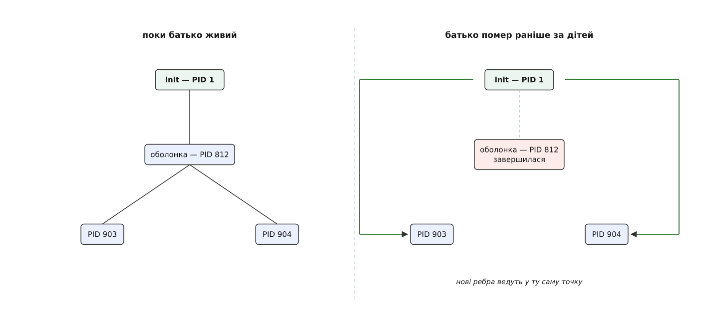
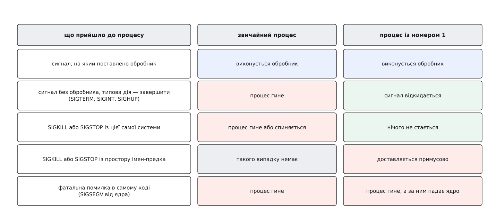
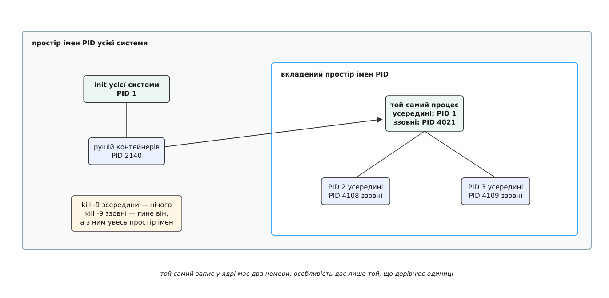

# Роль init і особливість PID 1

<preknowlist>
- [Процес: що це насправді](topic:unix-linux/process-model) — процес є записом усередині ядра: адресний простір, таблиця дескрипторів, обліковий запис і номер.
- [PID і дерево процесів](topic:unix-linux/pid-and-hierarchy) — кожен процес пам'ятає, хто його породив, тож усі процеси системи шикуються в дерево.
- [fork: розмноження процесу](topic:unix-linux/fork-semantics) — новий процес постає лише як копія наявного; створити його на порожньому місці неможливо.
- [exec: заміна образу](topic:unix-linux/exec-semantics) — виклик підміняє код усередині вже наявного процесу, а номер лишається тим самим.
- [Завершення, wait і зомбі](topic:unix-linux/exit-wait-zombies) — код виходу мертвого процесу лежить у ядрі доти, доки батько його не забере.
- [Сироти й перепідпорядкування](topic:unix-linux/orphan-reparenting) — коли батько помирає раніше за дитину, ядро призначає дитині нового батька.
- [Диспозиція сигналу](topic:unix-linux/signal-disposition) — на кожен сигнал у процесу є одна з трьох реакцій: власний обробник, ігнорування або типова дія.
</preknowlist>

Ви запустили з оболонки програму, та запустила свою — і закрили вікно термінала. Оболонка загинула. А запущена нею програма працює далі, і тепер у системі є процес, чий батько більше не існує.

Це не аварія й не рідкість. Ніхто ніде не обіцяв, що процеси помиратимуть у порядку, зворотному до народження; батько цілком може завершитися першим, і робиться це навіть навмисно — саме так програма [йде у фон](topic:unix-linux/daemonize). Отже, стан «у процесу немає батька» виникає в системі постійно, і питання лише в тому, що з ним робити.

Здавалося б, нічого. Хай запис про батька просто буде порожнім — процес же працює. Але тут виявляється, що батько в Unix потрібен не для краси родоводу, а для цілком конкретної роботи, і без нього щось ламається.

## Чому процесові взагалі потрібен батько

Смерть процесу відбувається у два кроки, а не в один. Спершу процес припиняє виконуватися: його пам'ять звільняють, дескриптори закривають, з планувальника він зникає. Але одна річ по ньому лишається — **код виходу**, число, яким він сказав, чим усе скінчилося. Ядро мусить його зберегти, бо віддати нема кому: той, кого це число цікавить, зараз може бути зайнятий чимось іншим і спитає пізніше.

Отже, ядро тримає маленький залишковий запис — ім'я, номер, код виходу, витрачений час, — і тримає доти, доки хтось по нього не прийде. Той «хтось» визначений однозначно: це батько, і забирає він запис викликом `wait`. Забрав — запис зникає, номер звільняється й може бути виданий комусь новому.

Тепер видно, чого коштує порожнє поле «батько». Прийти по залишковий запис нема кому, тож він лежатиме, поки жива система. Мертвий процес, від якого лишився самий запис, звуть **зомбі**, і головна його шкода не в пам'яті — запис крихітний, — а в тому, що він утримує **номер**. Номерів у системі скінченна кількість, і коли вони вичерпаються, жоден процес більше не зможе породити дитину.

**Скільки коштує невиконаний обов'язок.** Візьмімо службу, яка щосекунди перевіряє власне здоров'я, форкаючи для цього маленьку програмку, і нікого не ховає:

```
стеля номерів у ядрі за замовчуванням  = 32768
смертей за годину (одна на секунду)    = 3600
годин до вичерпання номерів            = 32768 / 3600 ≈ 9.1
```

За робочий день така система перестає вміти запускати програми — при тому, що пам'яті вільно скільки завгодно, а процесор нудьгує.

Звідси й вимога: у **кожного** процесу мусить бути живий батько, здатний забрати залишковий запис. Порожнє поле неприпустиме не з міркувань стрункості, а тому, що воно означає витік. Ядро розв'язує це просто: коли батько помирає, всіх його живих дітей воно **переприписує** комусь іншому. Лишається відповісти, кому саме.

Відповідь мусить бути такою, щоб задача не почалася спочатку. Якщо новим батьком призначати діда, то за мить може померти й дід, і сироти шукатимуть батька знову. Потрібен процес, про якого **достеменно відомо, що він живий** — і живий завжди. Такий процес у системі один, і це той, що має номер 1.



*Перепідпорядкування не шукає найближчого вцілілого предка — воно веде в одну наперед відому точку, і саме через це закінчується за один крок.*

## Чому цей процес узагалі існує в однині

Особливість номера 1 виглядала б домовленістю, якби не спосіб, у який процеси з'являються. Звичайний процес постає **копіюванням** уже наявного: нового робить `fork`, а `exec` лише міняє в ньому вміст. Отже, кожен процес системи має того, від кого його скопійовано, — і ланцюжок цих «від кого» неминуче впирається в когось першого, кого не копіювали ні з кого.

Цього першого робить саме ядро, і робить рівно раз за все життя системи. Закінчивши власну ініціалізацію, воно створює задачу, [переводить її в режим користувача](topic:unix-linux/kernel-and-userspace) і виконує в ній програму — ту, яку знайшло на [тимчасовому корені](topic:unix-linux/initramfs) або на справжньому. Ця задача дістає номер 1, і більше жодного процесу ядро для простору користувача не створює: усе інше система вирощує з нього сама.

Тому дерево процесів має рівно один корінь **за побудовою**, а не за угодою. І тому номер 1 не можна ні звільнити, ні перевидати: ядро не вміє створювати процес із наперед заданим номером, а `fork` завжди дає наступний вільний. Померлого носія одиниці замінити нема ким.

Ця арифметика й пояснює все решта. Усі особливі правила, які ядро має для PID 1, захищають одну з двох речей: або те, що ця точка **завжди на місці**, або те, що вона **єдина**.

## Перший обов'язок: ховати

Раз усі сироти системи рано чи пізно опиняються дітьми PID 1, то саме PID 1 мусить забирати їхні залишкові записи. Обов'язок цей не декоративний: якщо його не виконувати, зомбі накопичуються — з тим самим наслідком, що порахований вище.

Робиться це так. Про смерть дитини ядро сповіщає батька сигналом `SIGCHLD`, а забирає запис виклик `waitpid`. Тонкість у тому, що на одне сповіщення може припасти кілька смертей: звичайні сигнали не мають черги, тож два `SIGCHLD`, що прийшли впритул, зіллються в один. Тому ховати треба **в циклі**, аж поки ховати стане нікого:

```c
/* Найменший обов'язок процесу з номером 1: забирати коди виходу всіх,
   кого до нього приписали, — і своїх дітей, і чужих сиріт. */
#include <sys/wait.h>
#include <signal.h>

int main(void)
{
    sigset_t mask;
    sigemptyset(&mask);
    sigaddset(&mask, SIGCHLD);
    sigprocmask(SIG_BLOCK, &mask, NULL);   /* чекатимемо явно, а не в обробнику */

    /* ... тут PID 1 запускає все, що має працювати ... */

    for (;;) {
        int sig;
        sigwait(&mask, &sig);              /* прокинулися: хтось із нащадків помер */

        while (waitpid(-1, NULL, WNOHANG) > 0)
            ;                              /* смертей могло бути кілька на одне сповіщення */
    }
}
```

Сигнал тут навмисно заблоковано й вичитано явно замість обробника: усередині обробника можна робити дуже мало, і `waitpid` там — джерело тонких помилок. Чому саме мало й чому це не примха — [окрема тема](topic:unix-linux/async-signal-safety).

> 🔧 **Навіщо це.** Побачивши в `ps` стовпчик станів із літерою `Z`, дивіться не на самих зомбі, а на їхнього батька: зомбі — це не хвороба, а симптом того, що хтось не викликає `wait`. Якщо батьком виявився PID 1 і зомбі не зникають — значить, роль першого процесу виконує програма, яка на цю роль не розрахована. Найчастіше це буває в контейнерах, де номером 1 стає звичайний застосунок.

## Другий обов'язок: не вмирати

Якщо PID 1 завершиться, у системі не лишиться нікого, кому приписувати сиріт, — і зробити нового першого процесу нема як. Ядро не намагається з цього викрутитися: воно **зупиняє систему панікою** з повідомленням «Attempted to kill init!» і кодом, з яким процес пішов. У цьому коді, до речі, читається причина: `exitcode=0x0000000b` — це одинадцятка, сигнал `SIGSEGV`, тобто init упав на власній помилці роботи з пам'яттю.

Реакція здається надмірною: чому не перевести систему в якийсь урізаний режим? Тому що переводити нема кому. Зупинити служби, розмонтувати файлові системи, попередити користувача — усе це роблять програми, а запустити програму без живого предка ядро не вміє: `fork` існує лише як копіювання когось наявного. Система без PID 1 — не система з поламаною функцією, а система, яка втратила здатність будь-що починати. Паніка тут чесніша за вдавану роботу; що вона таке й чим відрізняється від Oops — [окремо](topic:unix-linux/kernel-oops-panic).

## Третій обов'язок ядра: не дати вбити випадково

Коли процес не має права вмирати, звичайна семантика сигналів стає для нього зброєю. Типова дія майже всіх сигналів — завершити процес; отже, будь-який `kill 1`, зроблений спросоння або сценарієм, що вибрав номери за надто широким шаблоном, поклав би машину.

Ядро закриває це не порадою, а правилом: **сигнал із типовою дією, посланий процесові з номером 1, просто відкидається**. Не ігнорується процесом — не доходить до нього взагалі. Але щойно PID 1 сам поставить на цей сигнал обробник, сигнал доставляється як усім.

Тут звична модель сигналів вивертається навиворіт. Для звичайного процесу обробник означає «я хочу зреагувати інакше, ніж типово». Для PID 1 обробник означає «я взагалі дозволяю цьому сигналові до мене прийти». Немає обробника — немає й сигналу.



*Захист стосується лише сигналів із типовою дією. Помилка в самому коді проходить крізь нього, бо там нема чого відкидати: процес уже впав.*

Особливий випадок — `SIGKILL`. Його не можна ні перехопити, ні заблокувати, і саме тому багато хто вважає, що `kill -9 1` спрацює. Не спрацює: обробника на `SIGKILL` поставити неможливо, отже, для PID 1 виконується та сама умова — обробника немає, сигнал відкидається. Головний процес системи не вбити нічим із самої системи. Виняток існує рівно один, і приходить він не зсередини — а звідки саме, стане видно, коли з'ясується, що сама одиниця не така вже й однозначна.

Захист має чітку межу, і її варто бачити. Він рятує від сигналу, **надісланого** ззовні. Він не рятує від помилки всередині: якщо PID 1 звернеться за неправильною адресою, ядро надішле `SIGSEGV` як наслідок апаратної пастки, і цей шлях захисту не має. Процес загине — і система впаде тією самою панікою «Attempted to kill init!». Тому надійність init тримається не на привілеї від ядра, а на простоті власного коду.

## init — це роль, а не програма

Усе описане ядро робить, дивлячись **на номер**, і більше ні на що. Воно не перевіряє, який саме файл виконується, не звіряється зі списком дозволених програм, не має вбудованого поняття «системний менеджер». Перший процес особливий тому, що він перший, а не тому, що він чиясь конкретна програма.

Перевіряється це однією дією. Ядро бере шлях до першої програми з [рядка параметрів](topic:unix-linux/bootloader-and-cmdline), і туди можна написати що завгодно:

```
init=/bin/sh
```

Машина завантажиться в порожню оболонку без жодної служби — і ця оболонка отримає всі властивості PID 1 разом із обов'язками: сироти приписуватимуться до неї, `kill` на неї не подіє, а вихід із неї через `exit` покладе систему панікою. Це, до речі, найкоротший шлях лагодити систему, у якій зламався штатний init.

Але звідси й зворотний висновок, набагато практичніший: **звичайна програма, поставлена на номер 1, властивості дістає, а обов'язки — ні**. Нікуди не дінеться перепідпорядкування сиріт, і нікуди не дінеться відкидання сигналів. Просто ховати нікому й реагувати нікому.

## Другий бік ролі: тримати служби

Досі йшлося про те, чого від першого процесу вимагає **ядро**. Але сам собою реєстратор смертей нікому не потрібен: систему все одно хтось мусить підняти. І оскільки процес, який гарантовано живий від початку до кінця роботи машини, у системі рівно один, роль розпорядника служб історично дісталася йому ж.

Так у init з'явився другий, значно більший бік: запустити те, що має працювати, у правильному порядку, і **тримати** його — помічати падіння, перезапускати, зупиняти при вимкненні. Ці два боки не пов'язані логічно: ховати сиріт міг би й окремий процес. Пов'язані вони вимогою бути живим завжди — а таких місць у системі одне. Як міняли форму цієї другої ролі за півстоліття — від одного сценарію в дописуваному файлі до опису залежностей — [окрема розповідь](topic:unix-linux/init-and-pid1/hist-shapes-of-init.md).

Сучасна відповідь на «тримати» будується на тому, що служба майже ніколи не є одним процесом. Слідкувати за номером головного процесу марно: він форкає, гине, перезапускається. Тому служби окреслюють [групою обліку ресурсів](topic:unix-linux/cgroups) — усе породжене лишається в тій самій групі, і група дає надійну відповідь на «хто саме належить цій службі». На цьому тримаються і [опис служб через залежності](topic:unix-linux/systemd-model), і [політика перезапуску](topic:unix-linux/service-lifecycle). Окремої відповіді потребує й протилежний край роботи: як систему [впорядковано зупинити](topic:unix-linux/orderly-shutdown), коли жоден процес не має права лишитися.

## Номер 1 — величина відносна

Усе сказане мовчки припускало, що номер у процесу один. Це перестало бути правдою, коли в Linux з'явилися [простори імен](topic:unix-linux/namespaces).

Простір імен PID — це окрема нумерація процесів. Той самий запис у ядрі видно з різних просторів під різними номерами: ззовні він, скажімо, 4021, а всередині свого простору — 1. І ядро дивиться не на «глобальну одиницю», а на те, чи є процес першим **у своєму** просторі імен. Якщо є — він дістає весь набір: сироти цього простору приписуються до нього, сигнали з типовою дією від сусідів по простору до нього не доходять.



*Особливість дає не сам процес і не програма в ньому, а те, що в певній нумерації його номер дорівнює одиниці.*

Ізоляція тут навмисно однобока. `SIGKILL` і `SIGSTOP`, послані **з простору-предка**, доставляються примусово, попри всі описані правила: інакше створення вкладеного простору імен було б способом зробити процес, якого не вбиває навіть власник машини. Це і є той виняток, обіцяний вище.

А смерть такого процесу тягне за собою весь простір. Ядро вбиває `SIGKILL`'ом усі процеси всередині, і надалі спроба народити там процес повертає помилку `ENOMEM`: простір імен без свого першого процесу непридатний, бо приписувати сиріт у ньому нема до кого.

З цього виростає найчастіша сьогодні пастка. Контейнер — це і є вкладений простір імен, а номером 1 у ньому стає той застосунок, який попросили запустити. Він не писався як init: він не ховає сиріт і не має обробника на `SIGTERM`. Наслідків двоє й обидва неприємні. Перший — зомбі накопичуються, як пораховано на початку. Другий — команда зупинки контейнера надсилає `SIGTERM`, той відкидається як сигнал без обробника, застосунок не отримує нічого, і за десяток секунд його добивають `SIGKILL`'ом ззовні: без збереження стану, без закриття з'єднань. Саме тому в контейнери кладуть крихітну програму-init, єдина робота якої — ховати сиріт і пересилати сигнали справжньому застосунку. Написати таку — [окрема вправа](topic:unix-linux/init-and-pid1/proj-minimal-init.md). Чим контейнер відрізняється від інших способів доставки програм — [окремо](topic:unix-linux/containers-vs-packages).

## Коли ховати хоче не корінь

Лишилася одна незручність. Перепідпорядкування завжди веде в корінь простору імен — а це не завжди те, чого хочуть. Менеджер сеансу чи наглядач за службою хоче знати, коли помер **його** нащадок, у тому числі онук, породжений подвійним форком. Але подвійний форк саме для того й робиться, щоб проміжний процес помер і онук поїхав до PID 1 — тобто зникнув із поля зору наглядача разом зі своїм кодом виходу.

Ядро дає на це точковий засіб: процес може оголосити себе **підбирачем** сиріт. Прапорець ставлять викликом `prctl(PR_SET_CHILD_SUBREAPER, 1)` (з'явився у версії 3.4, 2012 рік), і після цього сироти з-під нього приписуються не до першого процесу простору імен, а до **найближчого живого предка з таким прапорцем**.

Ось чому це не порушує нічого зі сказаного раніше. Правило «сирота дістає нового батька за один крок» лишилося: пошук зупиняється на першому ж підбирачі, а якщо жодного немає — на корені, який є завжди. Змінилося тільки те, куди ця точка призначення потрапляє: вона стала налаштовною, і завдяки цьому наглядач може виконувати роль init для власного піддерева, не будучи ним для всієї системи.

## Що з цього випливає

Про PID 1 зручно думати як про привілейований процес, і це — рівно навпаки. Ядро не додає йому можливостей: воно **забирає** їх. Він не може бути завершений — навіть коли б хотів. Він не може отримати сигнал, на який не підписався явно. Він не може піти, не поклавши систему. І він не може перекласти на когось поховання чужих сиріт.

Усі ці обмеження — плата за одну властивість, якої більше ні в кого немає: бути точкою, про яку відомо наперед, що вона на місці. Ядру така точка потрібна щоразу, коли дерево процесів лишається без вузла; і оскільки вона одна, її доводиться захищати від усього, включно з людиною за клавіатурою. Роль init — не «керувати системою», а **бути тим, на кого можна показати не перевіряючи**. Усе інше, чим займається перший процес, доклали пізніше — тому що місце виявилося зручним.
