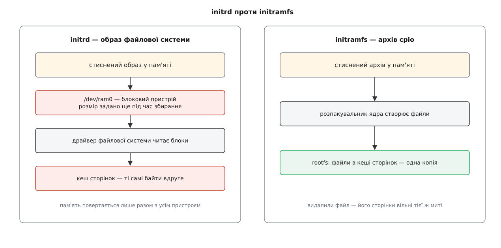
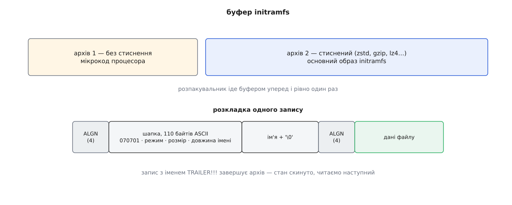
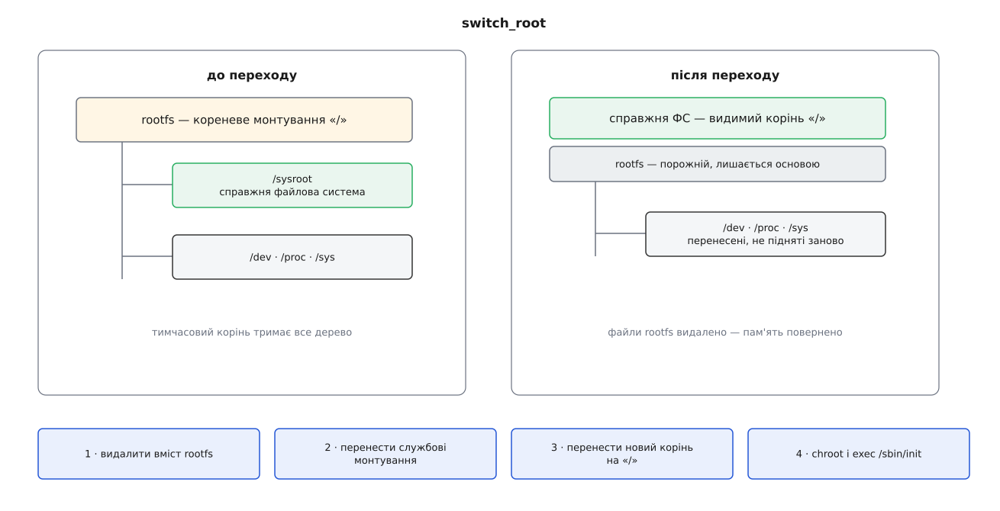

# initramfs: тимчасовий корінь

<preknowlist>
- [Ланцюг завантаження](topic:unix-linux/boot-chain) — прошивка передає керування завантажувачеві, а той кладе ядро в пам'ять і запускає його.
- [Завантажувач і командний рядок ядра](topic:unix-linux/bootloader-and-cmdline) — окрім самого ядра завантажувач передає йому рядок параметрів і може покласти поряд ще один файл-образ.
- [Монтування й дерево монтувань](topic:unix-linux/mount-model) — монтування є окремим об'єктом у пам'яті ядра; усі вони шикуються в дерево, і корінь цього дерева — єдине монтування без точки.
- [Псевдо-ФС: procfs, sysfs, tmpfs, devtmpfs](topic:unix-linux/pseudo-filesystems) — ramfs і tmpfs тримають файли просто в кеші сторінок, без жодного носія під ними.
- [Модулі ядра](topic:unix-linux/kernel-modules) — драйвер може бути не частиною образу ядра, а окремим файлом, який довантажують на ходу.
- [Роль init і особливість PID 1](topic:unix-linux/init-and-pid1) — перший процес ядро запускає саме, і його завершення для ядра фатальне.
- [exec: заміна образу](topic:unix-linux/exec-semantics) — процес міняє свій виконуваний образ, лишаючись тим самим процесом.
- [Статичне й динамічне лінкування](topic:unix-linux/static-and-dynamic-linking) — програма або несе весь потрібний код у власному файлі, або вимагає бібліотек ззовні.
</preknowlist>

Машину щойно ввімкнули. Ядро вже розпаковане в пам'яті, воно керує процесором, сторінками й перериваннями — і не має жодного уявлення про диск, з якого його щойно прочитали. Драйвер контролера NVMe, без якого до цього диска не достукатися, лежить окремим файлом `nvme.ko`. На тому самому диску.

Найпростіший вихід із цього кола — вбудувати драйвер у ядро. Для однієї конкретної машини так і роблять. Для дистрибутива, який має завестися на будь-якому залізі, це означає вбудувати драйвери всіх контролерів усіх виробників: образ на десятки мегабайтів, що на кожній машині цілком лягає в пам'ять — заради сотої своєї частини.

Але навіть такий образ не розв'язує другої половини задачі. Корінь на звичайному настільному комп'ютері — це не «розділ на диску». Це файлова система всередині логічного тому, том — усередині групи томів, група — на зашифрованому контейнері. Щоб дійти до файлів, треба спитати в людини пароль, перевірити його, дати ще дві спроби, зібрати групу томів і аж тоді монтувати. Корінь по мережі вимагає підняти інтерфейс, отримати адресу й дочекатися відповіді сервера. Корінь, заданий не іменем пристрою, а міткою тому, вимагає дочекатися, доки потрібний пристрій узагалі з'явиться — а USB-накопичувач з'являється на секунду пізніше за решту.

Спільне в цих випадках одне: діалог, очікування, повторна спроба, вибір за обставинами. Це рішення про те, **як саме** чинити, а ядро навмисно тримає в собі механізми, а не рішення. У ядрі просто немає місця, де показати запит пароля, і немає кому переказати, що пароль не підійшов.

Отже, цю роботу має зробити звичайна програма — запущена до того, як з'явився корінь. А будь-яка програма запускається з файлу, файл лежить у файловій системі, і починається все з кореня. Потрібен корінь до кореня. Взятися він може лише з пам'яті — і покласти його туди має той самий, хто поклав у пам'ять ядро.

## Корінь, який є завжди

Ядру корінь потрібен від першої хвилини: без нього шлях від «/» нема від чого відлічувати. Тому ядро створює його беззастережно й дуже рано — окремий екземпляр `ramfs` (або `tmpfs`, якщо той увімкнений у конфігурації) на ім'я **rootfs**, змонтований як корінь дерева монтувань ще до того, як існує хоч один пристрій. На звичайній машині його ніколи не видно: він порожній, а згодом його накривають справжнім коренем.

Саме сюди й лягає initramfs. Це не окремий тип файлової системи й не пристрій — це **вміст**: архів, чиї файли ядро розпаковує в уже наявний rootfs. Звідси й назва — *initial RAM filesystem*, на противагу старішому *initial RAM disk*.

## Чому архів, а не образ файлової системи

Старіший спосіб — initrd — виглядає природнішим: завантажувач кладе в пам'ять стиснений образ справжньої файлової системи, ядро віддає його драйверові рамдиска як блоковий пристрій `/dev/ram0` і монтує звідти корінь. Ціна такого рішення розкладається на чотири окремі витрати.

Розмір пристрою доводиться назвати наперед, під час збирання образу: замалий — вміст не влізе, завеликий — машина назавжди втратила цю пам'ять. Файлову систему образу ядро мусить уміти читати вбудованим драйвером. Кожне читання файлу копіює байти зі сторінок рамдиска у кеш сторінок — ті самі дані лежать у пам'яті двічі. А звільнити пам'ять можна лише разом із усім пристроєм і лише цілком.

Архів прибирає всі чотири витрати одним ходом. Ядро йде записами архіву послідовно й для кожного викликає ту саму внутрішню операцію, якою створюють файл, каталог, символьне посилання чи вузол пристрою — просто в rootfs. Результат — файли одразу в кеші сторінок: без блокового пристрою, без драйвера файлової системи, без наперед заданого розміру. Видалили файл — його сторінки звільнилися тієї ж миті.



*Відмінність не в тому, що зручніше пакувати, а в тому, скільки разів ті самі байти лежать у пам'яті і чи можна віддати її частинами.*

Формат архіву — cpio, і не будь-який, а `newc`. Кожен запис у ньому має шапку зі 110 байтів шістнадцяткового ASCII: сигнатура `070701`, номер inode, режим, власник, розмір даних, довжина імені, старший і молодший номери пристрою. За шапкою — ім'я з нульовим байтом, за іменем — дані; і шапка, і дані вирівняні на межу чотирьох байтів. Кінець архіву позначає запис з іменем `TRAILER!!!`.

```
запис = ALGN(4) + шапка(110 Б) + ім'я + '\0' + ALGN(4) + дані
архів = запис · запис · … · запис «TRAILER!!!»
```

У цьому описі немає ні змісту, ні таблиці зміщень — читати можна лише вперед і рівно один раз. Саме тому розпакувальник у ядрі вміщується в кількасот рядків і працює просто на потоці байтів, що виходить із розтискання.

Шапка несе не лише розмір і ім'я — у ній є режим, власник і, для вузлів пристроїв, пара номерів. Розпакувальник відтворює все це буквально, тож архів описує права й вузли так само повно, як справжня файлова система. Звідси суто практичний наслідок: зібрати образ звичайним `cpio` від імені простого користувача не вийде — власником усього стане він, а `mknod` йому взагалі не дозволений. Тому пакують або з-під суперкористувача, або утилітою `gen_init_cpio` з дерева ядра, яка бере права й вузли з текстового опису й нікого не питає про повноваження. Сьогодні вузлів в образі майже не тримають: `/dev` наповнює `devtmpfs`, і ядро створює файли пристроїв саме.

Із потокової природи випливають дві речі, якими користуються щодня. Перша: архіви можна **склеювати** — дійшовши до `TRAILER!!!`, розпакувальник скидає стан і читає далі, а кожен склеєний шматок має власне стиснення або не має жодного. Саме так доставляють мікрокод процесора: попереду нестиснений архів з одним файлом `kernel/x86/microcode/GenuineIntel.bin`, за ним — стиснений основний образ. Оновлення мікрокоду треба прикласти якомога раніше, і воно готове ще до того, як почалося довге розпакування. Друга: пізніший запис просто перекриває раніший файл із тим самим іменем, тож образ можна виправити дописуванням у хвіст, не перепаковуючи його.



*Розпакувальник читає буфер наскрізь: `TRAILER!!!` не завершує роботу, а лише скидає стан перед наступним архівом.*

> 📜 Обидва механізми — і рамдиск, і архів — з'явилися як відповідь на ту саму проблему, з різницею у шість років і з двома різними уявленнями про те, чим має бути тимчасовий корінь. Хто й чому обрав cpio, чим не влаштував tar і що сталося зі старим `/linuxrc` — у вставці [«initrd і його спадкоємець»](topic:unix-linux/initramfs/hist-initrd-to-initramfs.md).

## Дорога образу в пам'ять

Завантажувач читає файл образу з того ж носія, звідки взяв ядро, кладе його в пам'ять і повідомляє ядру адресу й довжину — окремими полями протоколу завантаження, а не через командний рядок. Ядро розпаковує буфер у rootfs під час [ініціалізації підсистем](topic:unix-linux/kernel-initcalls), ще до запуску першого процесу користувача, а сторінки самого буфера після цього звільняє: стиснена копія більше не потрібна.

Якщо буфер не починається з сигнатури cpio, ядро вважає його старим образом initrd і йде дорогою рамдиска. Тому одне й те саме поле завантажувача — історично назване `initrd` — досі обслуговує обидва формати, і плутанина в назвах живе саме звідси.

Є й варіант без завантажувача взагалі: архів можна вказати під час збирання ядра (`CONFIG_INITRAMFS_SOURCE`), і тоді він потрапляє просто в образ ядра. Виходить один файл, який несе і ядро, і простір користувача — так роблять вбудовані системи й рятувальні образи, де другого файлу нема куди покласти.

## Перший процес

Розпакувавши архів, ядро шукає в rootfs файл `/init`. Знайшло — запускає його як **PID 1** (параметр `rdinit=` дозволяє назвати інший шлях). Це не помічник і не проміжна ланка: це вже той самий перший процес, з усіма його особливостями, і повертати керування ядру він не має. Якщо `/init` завершиться, ядро зупиниться з панікою — вбити перший процес нікому не дозволено.

Не знайшло — ядро йде старою дорогою: саме монтує те, що назване в `root=`, і запускає `/sbin/init` звідти.

Звідси випливає наслідок, який часто дивує. **За наявності initramfs ядро `root=` не використовує.** Воно передає командний рядок далі — у `/proc/cmdline` — а розбирає його вже `/init`. Це його параметр, а не ядерний. Так само й уся родина `rd.*` — домовленість між генератором образу і його ж скриптами, про яку ядро нічого не знає.

Друга вимога до цієї програми — самодостатність. У rootfs немає нічого, крім розпакованого архіву: ні `/lib`, ні `/usr`. Тому `/init` або зібраний статично, або образ мусить нести і його інтерпретатор, і кожну потрібну бібліотеку. Звідси й вигляд типового образу: `busybox` чи інша збірка «все в одному файлі», копія динамічного завантажувача й рівно ті бібліотеки, які знадобляться.

> 🔧 **Навіщо це.** Коли машина не завантажується, ви майже завжди опиняєтеся саме тут — в аварійній оболонці initramfs (її дає параметр `rd.break` або збій монтування кореня). Розуміння, що це окремий простір користувача в пам'яті, одразу пояснює, чому там немає ваших звичних утиліт, чому `journalctl` не показує нічого й чому `mount /dev/sda2 /mnt` може відмовити: модуля файлової системи в образі просто немає. Діагностика починається з питання «що взагалі поклали в цей архів», а не «що зламалося в системі».

## Робота, заради якої все це

У машині тепер є повноцінний простір користувача — і починається робота, заради якої його підняли. `/init` монтує `/proc`, `/sys` і `/dev`, бо без них не працює нічого далі. Потім він запускає [udev](topic:unix-linux/udev-rules) або власний завантажувач модулів і робить «холодний обхід»: читає з sysfs рядки-ідентифікатори наявних пристроїв і підвантажує модулі, що їм відповідають. Драйвер контролера з'явився — з'явилися й блокові пристрої.

Далі починається очікування. Пристрій із потрібною міткою може ще не з'явитися, тож `/init` чекає подій від ядра, з тайм-аутом і повідомленням, якщо тайм-аут вичерпано. Коли пристрій є, над ним шар за шаром піднімають те, що між ним і файловою системою: масив, [зашифрований контейнер](topic:unix-linux/dm-crypt) — з запитом пароля на `/dev/console` і повторними спробами, — [логічні томи](topic:unix-linux/lvm-and-snapshots). Окремим кроком перевіряють, чи немає на розділі підкачки образу [сплячого режиму](topic:unix-linux/suspend-and-resume): якщо є, повертатися треба в нього, а не завантажуватися далі. І аж наприкінці знайдену файлову систему монтують — зазвичай лише для читання, під `/sysroot`.

> ⚙️ Найшвидший спосіб побачити механізм цілком — зібрати initramfs власноруч: статичний `/init` на C, пакування в `newc`, запуск під QEMU й перехід у справжній корінь. Розбір із робочим кодом і типовими помилками — у вставці [«Найменший робочий initramfs»](topic:unix-linux/initramfs/proj-tiny-initramfs.md).

## Передача кореня

Справжня файлова система змонтована. Тимчасовий корінь відпрацював, і його треба прибрати — не сховати, а саме прибрати, бо він займає пам'ять.

Природним інструментом тут виглядає [`pivot_root`](topic:unix-linux/pivot-root), який переставляє кореневе монтування простору. Але на rootfs він відмовляє з `EINVAL`, і причина структурна: `pivot_root` **переносить** старий корінь у каталог усередині нового, а rootfs — основа дерева монтувань, і ядро не має куди його подіти. Дерево не може лишитися без підмурівка.

Тому перехід роблять інакше. Утиліта `switch_root` (з `util-linux` або з `busybox`) виконує чотири дії. Перша — рекурсивно видалити вміст rootfs, не переходячи меж монтувань; її утиліта робить власним обходом дерева. Решта три зводяться до кількох звичайних викликів:

```sh
# 2. перенести вже підняті службові монтування в новий корінь
mount --move /dev  /sysroot/dev
mount --move /proc /sysroot/proc
mount --move /sys  /sysroot/sys
# 3. стати в новий корінь і зробити його коренем дерева
cd /sysroot
mount --move . /
# 4. перевести точку відліку процесу й віддати керування
chroot .
exec /sbin/init
```

Перший крок і є тим, заради чого все це: саме видалення файлів повертає машині пам'ять, бо сторінки `ramfs` більше нічим не тримаються. Другий крок зберігає зроблену роботу — переносити монтування дешевше, ніж піднімати їх заново вже в новому корені. Третій підміняє корінь у дереві монтувань, четвертий — у самому процесі.



*rootfs не відмонтовують ніколи: він лишається порожньою основою дерева, накритою справжнім коренем.*

У першому кроці є тонкість, яка бентежить при першому погляді: `switch_root` видаляє й той файл, який зараз виконується. Нічого не ламається — зникає лише ім'я, а сам inode тримає живим процес, що з нього запущений. Останні сторінки повертаються рівно на `exec`, коли старий образ у процесі заміщується новим. Це також пояснює, чому крок із видаленням і крок із `exec` мусить виконати **та сама** програма: розірвати їх нема кому.

## Ціна й пастки

Пам'ять. Сторінки `ramfs` не витісняються у підкачку й не звільняються під тиском — під ними немає носія, звідки їх можна було б перечитати. Розпакований універсальний образ на сотню-другу мегабайтів — це стільки ж зайнятої пам'яті, і тримається вона до `switch_root`.

Час. Розпакування — це розтискання всього образу одним потоком до того, як у системі почалося бодай щось паралельне. Тому дистрибутиви пішли від `gzip` до `zstd` і `lz4`: більший файл, який розтискається в кілька разів швидше, виграє загалом, навіть якщо читається з диска довше.

**Образ, який у розпакованому вигляді займає 90 МБ; носій віддає 500 МБ/с; швидкості розтискання взято як типові порядки для одного ядра процесора.**

```
gzip   стиснений 32 МБ   читання 32/500 = 0.064 с   розтискання 90/150  = 0.600 с   разом 0.664 с
zstd   стиснений 38 МБ   читання 38/500 = 0.076 с   розтискання 90/900  = 0.100 с   разом 0.176 с
lz4    стиснений 47 МБ   читання 47/500 = 0.094 с   розтискання 90/2500 = 0.036 с   разом 0.130 с
```

Вузьке місце — не читання, а той єдиний потік, що розтискає. Тому шість зайвих мегабайтів файлу в `zstd` скорочують час майже вчетверо, а п'ятнадцять у `lz4` — уп'ятеро.

Універсальний образ проти образу «під цю машину». Генератори (`dracut`, `mkinitcpio`, `initramfs-tools`) уміють і те, і те. Універсальний несе модулі на будь-яке залізо — без нього не обійтися інсталяторові й диску, який переставлять в іншу машину. Образ «під цю машину» — кілька мегабайтів і помітно швидший старт, але він перестає працювати, щойно змінилося залізо чи розкладка томів.

Звідси й найчастіша поломка. Шляхи модулів усередині образу містять версію ядра. Оновили ядро, а образ не перезібрався — або перезбирання тихо впало, бо на `/boot` скінчилося місце — і модулі зі старого образу до нового ядра не пасують. Наслідок видно вже після перезавантаження: корінь не знайдено, паніка. Практичне правило звідси просте: initramfs — це **продукт збирання** для конкретної версії ядра, а не файл налаштувань. Його перегенеровують, а не правлять.

Безпека. Файл образу лежить на `/boot` відкритим текстом, тож усе покладене всередину читає кожен, хто дістався до розділу — ключ для відмикання другого зашифрованого диска зокрема. Тому генератори ставлять на образ права лише для власника. І окремо: у ланцюгу довіреного завантаження підпис накриває ядро, а initramfs завантажувач читає окремим файлом — поза цим підписом. Відповідь на це — єдиний образ, у якому ядро, командний рядок і initramfs склеєні в один підписаний файл ([довірене завантаження](topic:programming/firmware-secure-boot)).

Слово «тимчасовий» у назві — властивість універсального дистрибутива, а не механізму. Якщо образ уже несе все, що машині треба, переходити нема куди: `/init` просто запускає служби, і rootfs лишається коренем на весь час роботи. Так живуть маршрутизатори, інсталятори, рятувальні образи й машини без власного диска. У такої системи є неочікувана властивість: вона не здатна зіпсувати свій корінь, бо кореня на носії в неї немає — він щоразу збирається наново з одного файлу.
