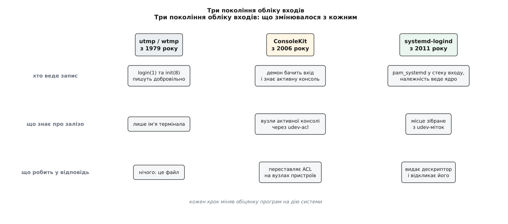

# 📜 Від utmp до logind: як система вчилася знати, хто за комп'ютером

Понад тридцять років відповідь на питання «хто зараз працює на цій машині» трималася на чемності програм: був файл, і кожна програма входу дописувала в нього рядок про себе — якщо не забувала. Тут показано, як із того файла виріс окремий демон, чому проміжна спроба протрималася лише кілька років і в якому місці ланцюжок урешті довелося доводити до ядра.

## Файл, у який дописували з чемности

Сьоме видання Unix (1979) уже мало пару файлів для цього обліку. Тодішня сторінка `utmp(5)` описує `/etc/utmp` словами «дозволяє з'ясувати, хто зараз користується UNIX», а `/usr/adm/wtmp` — як файл, що «записує всі входи й виходи»; там-таки прямо сказано, ким він ведеться: `login(1)` та `init(8)`. Запис був короткий — ім'я користувача, ім'я термінала, час; порожнє ім'я означало вихід, а термінал `~` — перезавантаження. Команди `who`, `w` і `last` живуть із цього досі, просто читаючи файл.

Слабких місць тут відразу три, і всі вони ростуть із самої природи файла.

Перше — **пасивність**. Рядок у файлі є даними, а не механізмом: коли він змінюється, не відбувається нічого. Кожен, кому цікаво, мусить сам перечитувати файл і сам вирішувати, що з цим робити; жодна дія в системі з появи запису не випливає.

Друге — **необов'язковість**. Ніхто не змушує програму входу дописати рядок, і та, що забула, нічого не порушила. Ба більше: щоб дописати, треба мати право писати у файл, а право писати у файл означає й право написати неправду. Обидва боки цієї вилки погані — або запис неповний, або йому не можна довіряти.

Третє — **сліпота до заліза**. У записі є ім'я термінала, і більше нічого. Немає ані відеокарти, ані клавіатури, ані навіть відомості про те, чи це місцевий вхід, чи людина під'єдналася мережею. Термінал у цьому обліку — не робоче місце, а лише вузол, і той самий `/dev/tty3` завтра належатиме комусь іншому. Сеанс у розумінні POSIX ([сеанси, групи процесів і керуючий термінал](book:unix-linux/sessions-and-process-groups) — про доставку сигналів і про те, який термінал вважати керуючим) відповіді теж не давав: його заводить собі й демон, за яким не сидить ніхто.

Доки за комп'ютером сидів один адміністратор, а решта заходила телетайпами, цього вистачало. Питання стало руба, коли на екрані з'явився графічний робочий стіл із кількома людьми одночасно.



*Кожне покоління міняло обіцянку програм на дію системи*

## ConsoleKit: демон замість файла

2006 року в GNOME і Fedora розв'язували цілком побутову задачу — швидке перемикання користувачів. Робочий стіл мусив знати те, чого у файлі не було: чи мій сеанс зараз на передньому плані, чи вже треба замикати екран, кому з двох присутніх дозволено чіпати звукову плату. Так з'явився **ConsoleKit** — демон, який тримав перелік сеансів у себе, а не в текстовому файлі, і віддавав його по шині повідомлень ([D-Bus](book:unix-linux/dbus) — виклик методу на іменованій службі).

Про авторство варто сказати точно, бо його часто переказують неправильно. Історія репозиторію показує первісний імпорт коду 25 жовтня 2006 року за підписом **Вільяма Джона Мак-Канна** (William Jon McCann, Red Hat/GNOME); він же зробив основну масу ранньої роботи. **Девід Зойтен** (David Zeuthen, Red Hat) — автор сусідніх речей тієї самої епохи, HAL і PolicyKit — до ConsoleKit долучився теж, і його ранні внески саме ті, що потім найбільше важили: вивантаження бази сеансів у файл для програм, які не хочуть говорити по шині, і механізм синхронно запускати сторонню програму на додання/вилучення сеансу чи зміну активности. Отже, статус доказовости такий: історія репозиторію — первинне й надійне джерело, і за нею основний автор ConsoleKit — Мак-Канн, тоді як приписування задуму одному Зойтенові точним не є.

Саме той механізм «запусти програму на зміну активности» став містком до заліза. Права на вузли пристроїв переставляв помічник `udev-acl`: правила [udev](book:unix-linux/udev-rules) позначали вузли, які треба віддавати активному користувачеві, а помічник дописував тому користувачеві [ACL](book:unix-linux/acl-and-xattr) — запис «цьому UID — читання й запис» понад звичайні дев'ять бітів. Це вже було краще за статичні групи `video` й `audio` ([групи доступу до пристроїв](book:unix-linux/device-access-groups) роздають права всім членам групи назавжди), бо право приходило й ішло разом із людиною.

Багатомісности ConsoleKit не витягнув, і причини знову структурні. Місця він фактично мав статичні: зібрати друге робоче місце з щойно ввімкненого USB-концентратора з монітором і клавіатурою було нічим — це робилося вручну й накладними латками, а не з появи заліза. Належність процесів до сеансу трималася на тому, що програма входу зареєструвалася сама, — тобто на тій самій необов'язковості, лише перенесеній із файла в демон. І найголовніше: **ACL перевіряється в момент `open()`**. Переставити список прав назад можна, а от закрити дескриптор, який чужий процес відкрив, доки право було, — ні. Людина, чий сеанс пішов на задній план, і далі чула мікрофон.

Згодом на сторінці проєкту у freedesktop з'явилася коротка й недвозначна заява: ConsoleKit активно не супроводжується, а увага перейшла до вбудованого керування місцями, користувачами й сеансами в systemd — тобто до logind.

## 13 липня 2011

Робота над новим демоном видна в історії systemd з 23 травня 2011 року — комітом Леннарта Пьоттерінга з характерною назвою «перша версія, що взагалі компілюється». Уже наступного дня туди лягло керування ACL: logind від початку забирав собі не тільки облік сеансів від ConsoleKit, а й роботу `udev-acl`. Червневі коміти показують зміну підходу ще виразніше — сеанс знімається, коли зникла його [cgroup](book:unix-linux/cgroups), і живість сеансу стежиться через дескриптор каналу, а не через чиюсь обіцянку відзвітувати. Реліз, у якому це вийшло до людей, — **systemd 30**, позначений тим-таки Пьоттерінгом 13 липня 2011 року.

Два принципові зрушення проти попередників варто назвати прямо. По-перше, зачіпку поставили в стек PAM — програмам входу більше нічого не треба знати про демон, бо вони й так усі проходять через автентифікацію. По-друге, належність процесу до сеансу стала контрольною групою, тобто фактом, який веде ядро й з якого не можна вийти самовільно. Обидві вади utmp — необов'язковість і пасивність — зникли не тому, що всіх умовили, а тому, що місце зберігання правди змінилося.

Багатомісність доклалася трохи згодом. У травні 2012 року Пьоттерінг описав її на прикладі Fedora 17 і сформулював різницю без обиняків: попередній логіці ConsoleKit бракувало підтримки *автоматичної* багатомісности. Тепер USB-станцію з монітором, клавіатурою й мишею можна було просто ввімкнути в будь-який момент — вікна входу самі з'являлися на ній, без жодного налаштування; місце, зібране з розрізненого заліза, складалося вручну кількома командами `loginctl attach`, а далі трималося udev-мітками на пристроях.

## Дві гілки для тих, хто без systemd

Відмова від ConsoleKit поставила незручне питання перед тими, хто systemd не вживає. Відповідей вийшло дві. **ConsoleKit2** — форк, який із 2014 року веде Ерік Кегель (Eric Koegel) з оточення Xfce; він зберігає стару шинну назву й потрібен передусім BSD та дистрибутивам з іншим init. **elogind** — навпаки, сам logind, витягнутий із systemd окремим демоном; він відповідає під тим самим іменем `org.freedesktop.login1`, що й оригінал.

Різниця між цими двома шляхами повчальна: для програм робочого столу важить не те, чий код працює, а яке ім'я відповідає на шині. Саме тому другий шлях виявився життєздатнішим — він не вимагає від жодного клієнта писати другу гілку коду.

## Дірка, яку закрили 2013 року

Лишалася та сама вада, яку ACL закрити не може за побудовою: право перевіряють на вході, а віддавати вже відкритий дескриптор ніхто не зобов'язаний. Її взяв на себе **Давид Германн** (David Herrmann). Ідея — перевернути порядок: хай пристрій відкриває logind і передає готовий дескриптор сеансові, а на перемиканні відбирає його назад.

Для відеокарт половина відповіді вже була: [DRM/KMS](book:unix-linux/drm-kms) має поняття «майстра», і майстерство можна відібрати. Для пристроїв уведення не було нічого — тож у ядрі з'явився новий виклик. Коміт «Input: evdev — add EVIOCREVOKE ioctl» за підписом Германна датований 7 вересня 2013 року й описує дію просто: викликаний на дескрипторі evdev, він **безповоротно** відбирає доступ до пристрою для цього одного відкритого файла. Мотив у повідомленні названо теж прямо — щоб сеанс на задньому плані не міг читати уведення, зокрема паролі. У випущеному ядрі це вже 3.12, де заголовок уведення містить рядок:

```
#define EVIOCREVOKE  _IOW('E', 0x91, int)   /* Revoke device access */
```

З боку systemd відповідна пара з'явилася у версії 208, у чиїх примітках сказано, що logind навчився забезпечувати привілейований доступ до пристроїв уведення та DRM для непривілейованих клієнтів. Тоді ж Германн вичистив із цієї підсистеми зайве — приміром, восени 2013 року прибрав підтримку `fbdev` як сеансового пристрою.

Саме тут історія доходить до своєї суті. Файл `utmp` міг лише свідчити; ConsoleKit міг свідчити й переставляти права; і тільки система, яка сама роздає дескриптори й сама їх відкликає, здатна відповідати за своє твердження про те, хто зараз за комп'ютером, — бо відкликання доступу є дією, а не записом.
