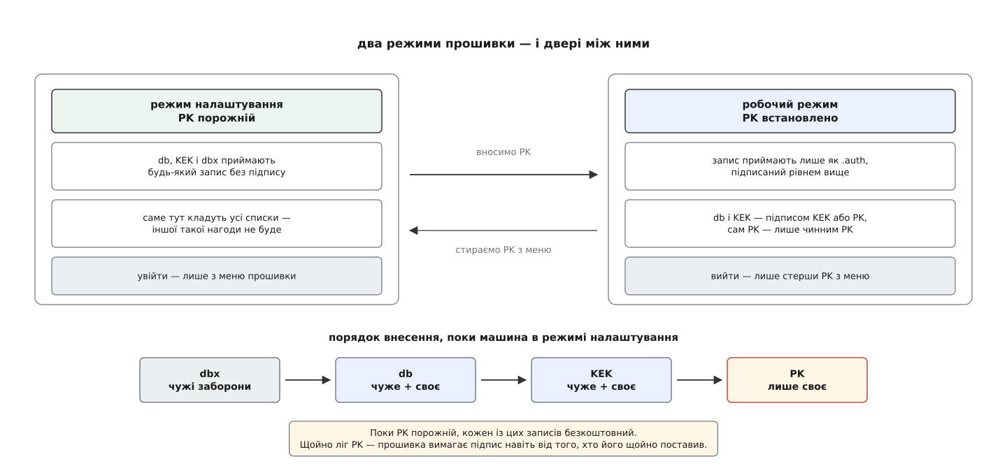

# ⚙️ Свої ключі: власна ієрархія довіри від нуля

Тут ми знімемо з машини чужий порядок довіри й поставимо свій: згенеруємо три пари ключів, внесемо їх у прошивку й підпишемо ними ядро — після чого машина стартуватиме лише з того, що підписали особисто ви, і жодного стороннього засвідчувача в ланцюзі не лишиться.

Право на це дає сама будова сховищ: незмінних ключів у прошивці немає взагалі. Є PK, і належить він тому, хто поставив його першим. Виробник скористався цим правом на заводі — ми скористаємося ним удруге.

## Спершу — у віртуальній машині

Помилка тут не схожа на помилку в конфігураційному файлі. Внесіть PK, від якого загубили таємну половину, — і жодного списку ви більше не зміните: машина вимагатиме підпис, якого вам немає чим поставити. Виріжте з db зайве — і зникне картинка ще до меню, тобто зникне й спосіб щось виправити. Обидва випадки закінчуються не «перевстановити систему», а «шукати програматор для мікросхеми».

Тому першу спробу роблять там, де сховище змінних — звичайний файл. [Віртуальна машина](book:programming/hardware-virtualization) виконує гостьовий код на справжньому процесорі, а залізо їй підставляє гіпервізор; прошивкою в ній працює OVMF — та сама збірка UEFI, що й на платах, лише зібрана під QEMU. Її енергонезалежна пам'ять лежить у файлі поруч, і будь-який глухий кут коштує одного `cp`.

```bash
# копія змінних — саме її ми й будемо псувати
cp /usr/share/OVMF/OVMF_VARS_4M.ms.fd ./VARS.fd

qemu-system-x86_64 \
  -machine q35,smm=on \
  -global driver=cfi.pflash01,property=secure,value=on \
  -drive if=pflash,format=raw,unit=0,file=/usr/share/OVMF/OVMF_CODE_4M.ms.fd,readonly=on \
  -drive if=pflash,format=raw,unit=1,file=./VARS.fd \
  -m 2048 -drive file=disk.qcow2,if=virtio
```

Два перші рядки не косметичні. Без `smm=on` і без `property=secure,value=on` сховище змінних лишається для гостя звичайною флеш-пам'яттю, у яку той пише самотужки, — і весь захист перетворюється на виставу: гостьовий код просто допише свій ключ у db. Файли з часткою `.ms` у назві — це збірка із заводськими ключами Microsoft усередині, тобто рівно те становище, у якому приїжджає магазинна машина. Саме з нього й треба вчитися виходити. (У Fedora та Arch файли звуться інакше — шукайте в `/usr/share/edk2/`.)

## Три пари ключів, а не одна

```bash
GUID=$(uuidgen)

openssl req -new -x509 -newkey rsa:2048 -sha256 -days 3650 -noenc \
  -subj "/CN=my platform key/"      -keyout PK.key  -out PK.crt
openssl req -new -x509 -newkey rsa:2048 -sha256 -days 3650 -noenc \
  -subj "/CN=my key exchange key/"  -keyout KEK.key -out KEK.crt
openssl req -new -x509 -newkey rsa:2048 -sha256 -days 3650 -noenc \
  -subj "/CN=my kernel signing key/" -keyout db.key  -out db.crt
```

`-noenc` (давніше написання — `-nodes`) кладе таємний ключ на диск без пароля: підписувати доведеться зі сценаріїв, без людини за клавіатурою. RSA-2048 із SHA-256 — не архаїзм, а єдине поєднання, яке специфікація UEFI зобов'язує підтримувати всіх; довші ключі приймає більшість прошивок, але саме тут «сильніше» іноді означає «мовчки не працює».

Виходить [сертифікат](book:communications/public-key-crypto) — відкритий ключ разом з іменем власника, підписаний сам собою. Прошивці потрібне саме таке поєднання, а не голий ключ: у дампі db має бути видно, чиє це і навіщо.

Спокуса зробити один ключ на всі три ролі велика, і технічно так можна. Але ролі різні не за назвою, а за способом життя. `db.key` лежить на складальній машині й працює щотижня, бо ядро оновлюється. `PK.key` дістають раз на кілька років і тримають на флешці в шухляді.

> 🔧 **Навіщо це.** Уявіть, що складальну машину зламали. З окремими ключами зловмисник отримав `db.key`: він підпише ядро, але не перепише списки довіри — ви дістаєте `KEK.key`, замінюєте db на новий і викидаєте скомпрометований сертифікат. З одним ключем на все він отримав ще й PK — тобто саме право господаря. Забрати його назад ви не зможете нічим, крім входу в меню прошивки на кожній машині руками. Розділення ролей не робить систему стійкішою до злому; воно робить наслідки злому оборотними.

## Від сертифіката до підписаного оновлення

Прошивка не їсть `.crt`. Дорога до змінної йде у два перетворення, і кожне відповідає на своє питання.

Перше — **чим** заповнити змінну. `cert-to-efi-sig-list` перекладає X.509 у формат `EFI_SIGNATURE_LIST`, у якому db і зберігається. Тут і придається GUID: він нічого не перевіряє, а лише позначає, хто вніс запис, — і саме за ним ви потім у дампі відрізните свої рядки від заводських.

Друге — **чому прошивка має цей запис узагалі прийняти**. `sign-efi-sig-list` загортає список у засвідчене оновлення: до вмісту додається мітка часу й підпис ключем поверхом вище.

```bash
cert-to-efi-sig-list -g "$GUID" PK.crt  PK.esl
cert-to-efi-sig-list -g "$GUID" KEK.crt KEK.esl
cert-to-efi-sig-list -g "$GUID" db.crt  db.esl

sign-efi-sig-list -k PK.key  -c PK.crt  PK  PK.esl  PK.auth   # PK підписує сам себе
sign-efi-sig-list -k PK.key  -c PK.crt  KEK KEK.esl KEK.auth
sign-efi-sig-list -k KEK.key -c KEK.crt db  db.esl  db.auth
```

Придивіться: ім'я змінної стоїть окремим аргументом. Воно не для зручності — воно **входить у підписані байти** разом із міткою часу. Тому готове оновлення для db не можна підсунути в dbx, а вчорашній законний `.auth` не можна повторно застосувати, щоб відкотити список до старого стану. Обидві дірки закрито тим самим одним рішенням: підписують не вміст, а вміст разом із адресою й часом.

Ці `.auth` знадобляться пізніше, у робочому режимі, коли додати ключ у db можна буде лише підписаним оновленням. Зберігайте їх разом із ключами.

## Зберегти чуже, перш ніж ставити своє

```bash
efi-readvar -v db  -o old_db.esl
efi-readvar -v KEK -o old_KEK.esl
efi-readvar -v dbx -o old_dbx.esl
```

Тепер найдорожче питання практикуму: чи викидати сертифікати Microsoft із db. Двічі подумайте, якщо справджується бодай одне.

**На машині є Windows.** Її завантажувач підписано заводським сертифікатом Microsoft (зазвичай `Microsoft Windows Production PCA 2011`); заберете його — Windows перестане стартувати того ж дня.

**У машині є дискретна відеокарта чи інша плата розширення з власним ПЗП.** Прошивка виконує цей ПЗП **до** будь-якої операційної системи, а підписано його стороннім засвідчувачем `Microsoft Corporation UEFI CA 2011`. Заберете його — прошивка відмовиться виконувати ПЗП карти, і найімовірніший наслідок — чорний екран: ви не побачите навіть меню, у якому це можна виправити. Небезпека настільки буденна, що `sbctl` тримає для неї окремий прапорець із промовистою назвою `--yes-this-might-brick-my-machine`.

Назви не переписуйте з посібників — дивіться, що лежить саме у вашій db: на машинах від 2024 року там може стояти вже `Windows UEFI CA 2023` замість давнього сертифіката. Заводські списки поволі переходять на покоління 2023 року, бо сертифікати 2011-го добігають кінця.

Якщо чуже лишаємо — списки просто зчіплюють один за одним, бо формат і є послідовністю списків:

```bash
cat old_db.esl  db.esl  > compound_db.esl
cat old_KEK.esl KEK.esl > compound_KEK.esl
```

## Внесення: чому PK останнім

Режим налаштування — це стан, у якому PK порожній, і прошивка приймає у db, KEK і dbx будь-який запис без жодного підпису. Увійти в нього можна лише з меню прошивки (шукайте «Clear Secure Boot keys» або перемикач `Custom` замість `Standard`) — за фізичної присутності людини.



*Двері односторонні: запис у PK зачиняє їх сам, тому все, що треба покласти безкоштовно, кладуть до нього.*

```bash
# з-під root, машина в режимі налаштування
chattr -i /sys/firmware/efi/efivars/{PK,KEK,db,dbx}-*

efi-updatevar -e -f old_dbx.esl      dbx
efi-updatevar -e -f compound_db.esl  db
efi-updatevar -e -f compound_KEK.esl KEK
efi-updatevar    -f PK.auth          PK    # ← двері зачиняються тут
```

`-e` означає «це голий список підписів, не засвідчене оновлення» — і працює рівно доти, доки машина в режимі налаштування. PK кладуть уже в підписаній формі: саме цей запис переводить машину в робочий режим, і прошивка хоче бачити його правильно оформленим.

`chattr -i` потрібен тому, що ядро позначає ці файли в `efivars` незмінними — щоб випадковий запис не зніс вміст сховища. Прапорець знімають перед записом, і це нормальна частина процедури, а не обхід захисту.

Якщо система з якоїсь причини не може писати в `efivars`, лишається другий шлях: майже всі прошивки вміють читати `.auth` і `.esl` з розділу EFI власним пунктом меню. Для цього ми ці файли й зробили.

## Підписати ядро — і переконатися, що непідписане не йде

```bash
sbsign --key db.key --cert db.crt \
       --output /boot/vmlinuz-linux.signed /boot/vmlinuz-linux
sbverify --list /boot/vmlinuz-linux.signed
```

Тепер найважливіший крок, який пропускають найчастіше: **перевірка на відмову**. Лишіть непідписану копію, вкажіть на неї запис завантаження й переконайтеся, що прошивка відповіла `Access Denied` або `Security Violation`. Без цієї спроби ви довели лише те, що ваш файл вантажиться, — а він вантажився й до всієї роботи.

Далі вас чекає та сама пастка, на якій спотикаються всі: оновлення ядра перезаписує `vmlinuz`, і підпис зникає разом зі старим файлом. Або підписуйте гачком пакетного менеджера після кожного оновлення, або складайте єдиний образ ядра — він до того ж закриває щілину, у якій [початковий образ пам'яті](book:unix-linux/initramfs) і рядок параметрів лишаються непідписаними, бо їх збирають на цій самій машині.

## Дорога назад

Заводські ключі нікуди не зникли: прошивка тримає їх в окремих змінних `PKDefault`, `KEKDefault`, `dbDefault`, а в меню є пункт «Restore Factory Keys» (або «Restore Default Secure Boot Keys»), який переписує ними ваші. Знайдіть цей пункт **до** того, як стирати PK, а не після. На частині дешевих плат його немає зовсім — і це головна причина, чому перша спроба живе у віртуальній машині.

`sbctl reset` робить менше: стирає PK й повертає машину в режим налаштування. Заводських списків він не відновлює, але дає почати спочатку.

## Той самий шлях у чотири команди

```bash
sbctl status
sbctl create-keys
sbctl enroll-keys --microsoft
sbctl sign -s /boot/vmlinuz-linux
```

`--microsoft` — це і є `cat old_db.esl db.esl` без ручної роботи. Прапорець `-s` записує файл у власну базу `sbctl`, і після оновлення ядра `sbctl sign-all` перепідписує все з неї — саме те, що рятує від «учора вантажилося, сьогодні ні».

Довгий шлях варто пройти руками бодай раз — не заради складності, а тому що `sbctl` ховає рівно три місця, де все й ламається: порядок внесення, доля чужого сертифіката в db і те, де лежать ваші таємні ключі. Останнє варто побачити на власні очі: типово вони опиняються в `/var/lib/sbctl/keys` — на тій самій машині, яку вони й захищають. Для ноутбука вдома це прийнятна ціна за зручність. Для машини, чий ключ підписує ядра ще комусь, — ні.
