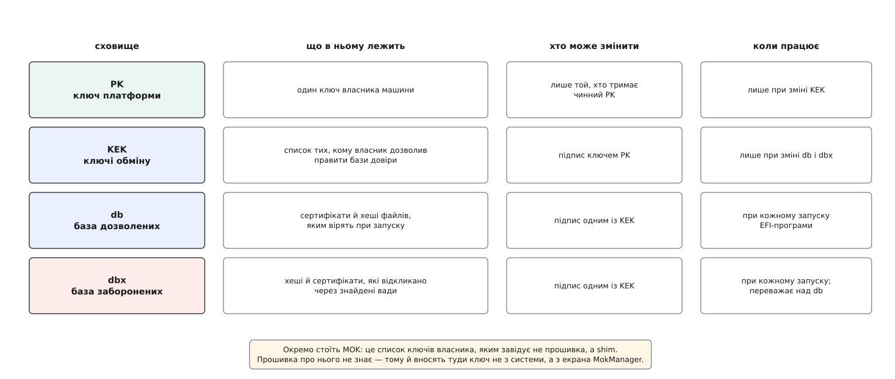
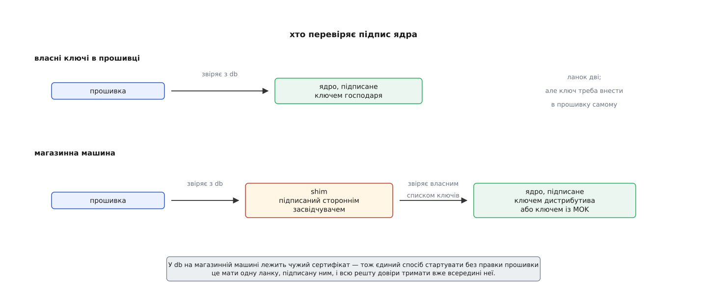
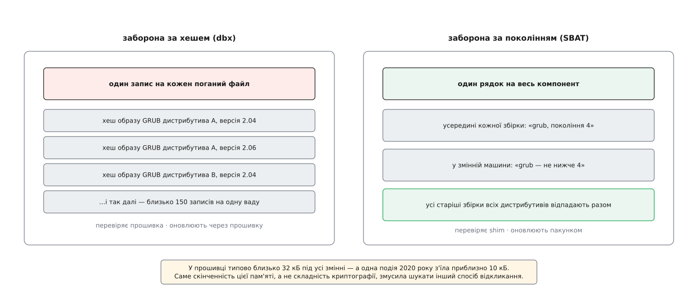

# Secure Boot: перевірений ланцюг завантаження

<preknowlist>
- [Ланцюг завантаження: від прошивки до init](topic:unix-linux/boot-chain) — керування послідовно переходить від прошивки до завантажувача, від нього до ядра, і кожна ланка сама знаходить наступну.
- [UEFI: прошивка як середовище виконання](topic:unix-linux/uefi-firmware) — прошивка читає файлову систему FAT, виконує програми узгодженого формату й тримає власну енергонезалежну пам'ять зі змінними.
- [Завантажувач і командний рядок ядра](topic:unix-linux/bootloader-and-cmdline) — рядок параметрів визначає, що ядро вважатиме коренем і що виконає першим у просторі користувача; складає цей рядок завантажувач.
- [initramfs: тимчасовий корінь](topic:unix-linux/initramfs) — образ початкової файлової системи збирають на самій машині з тутешніх модулів і сценаріїв.
- [Модулі ядра](topic:unix-linux/kernel-modules) — частина коду ядра лежить окремими файлами й довантажується під час роботи з повними правами.
- [Хеш і цифровий підпис](topic:math/hash-and-digital-signature) — підпис ставлять таємним ключем, а перевіряють відкритим; підробити його без таємного ключа неможливо.
- [Кільця ключів ядра](topic:unix-linux/kernel-keyrings) — ядро тримає довірені сертифікати у власних кільцях і саме ними перевіряє підписи того, що завантажує.
</preknowlist>

Диск можна переписати. Це його призначення — і саме тому той, хто дістався до диска, визначає, чим машина буде наступного разу, коли її ввімкнуть. Він не мусить ламати ні пароль, ні шифрування: досить підмінити те, що виконується найпершим, і всі подальші перевірки робитиме вже його код. Захисна програма, запущена всередині такої системи, перевіряє рівно нічого — вона питає підмінене ядро про підмінене ядро.

Отже, шукати треба не кращу перевірку всередині системи, а момент, коли машина ще може сказати «ні». Такий момент у ній рівно один: мить, коли керування переходить від прошивки до першого коду з диска. Прошивка живе в мікросхемі на платі, а не на носії; той, хто переписав диск, її не переписав. Це єдина сторона в машині, яка ще не залежить від зловмисника — і водночас єдина, що вирішує, чи виконувати те, що лежить на диску.

Звідси й уся конструкція. Прошивка мусить вирішити долю файлу, якого не існувало, коли її писали, — і вирішити без жодної допомоги ззовні, без мережі, без людини. Єдиний спосіб — щоб файл сам приніс докази свого походження, а прошивка тримала при собі те, чим ці докази звіряють.

## Підпис живе всередині файлу, який перевіряють

Спершу — про доказ. Прошивка виконує програми у форматі PE (англ. Portable Executable — переносний виконуваний), тому й спосіб підписування взяли готовий, той самий, яким підписують програми Windows: Authenticode. Підпис не лежить окремим файлом поруч — він **усередині** того самого `.efi`, у власній секції наприкінці, а в заголовку є поле, яке вказує на неї.

Це здається дрібницею, але саме вона робить схему працездатною. Прошивка отримує від свого меню один шлях до одного файлу; якби підпис жив окремо, треба було б домовлятися ще й про його ім'я, місце й про те, що робити, коли він загубився. Файл, що несе свій підпис у собі, або цілий, або ні — третього стану немає.

Тепер тонкість, без якої підпис узагалі не рахувався б. Хеш беруть не з усього файлу підряд: із підрахунку викидають поле контрольної суми в заголовку, запис про таблицю сертифікатів і саму цю таблицю. Причина проста — ці байти міняються від самого факту накладання підпису. Порахуйте хеш усього файлу, допишіть підпис — і хеш файлу вже інший, а отже, підпис не сходиться з першої ж секунди. Тому підписом накривають той вміст, що не залежить від наявності підпису.

Наслідок практичний: підписати вже зібраний файл можна, не перезбираючи його, і той самий двійковий образ можна підписати кількома ключами по черзі. На цьому тримається чи не вся практика Linux — те саме ядро роздають підписаним для одних машин і переписують іншим ключем для інших.

## Чотири сховища й питання власності

Тепер друга половина: чим прошивка звіряє підпис. Зберігати один-єдиний вшитий ключ не годиться — тоді на машині могла б працювати рівно одна система від рівно одного постачальника, і назавжди. Потрібен **список** довірених ключів, який можна змінювати. А щойно з'являється змінюваний список, з'являється й головне питання: хто має право його змінювати. Якби список правив будь-хто, зловмисник просто дописав би туди свій ключ — і перевірка перетворилася б на формальність.

Відповідь UEFI — чотири сховища в енергонезалежній пам'яті плати, зв'язані правом підпису одне над одним.

**PK** (англ. Platform Key — ключ платформи) — один-єдиний ключ власника машини. Він нічого не перевіряє під час завантаження; його справа — засвідчувати зміни наступного сховища. Поки PK встановлено, машина «має господаря».

**KEK** (англ. Key Exchange Key — ключ обміну ключами) — список ключів тих, кому господар дозволив правити бази довіри. Зміну самого KEK мусить підписати PK.

**db** — власне список того, чому вірять при запуску: сертифікати й хеші окремих файлів. Прошивка перебирає його, шукаючи, чим засвідчено підпис у файлі. Зміну db мусить підписати щось із KEK.

**dbx** — список заборон, і він **сильніший** за db. Якщо файл або сертифікат згадано в dbx, машина відмовиться його виконувати, навіть коли підпис бездоганний і ключ лежить у db. Це і є механізм відкликання: не «прибрати ключ», а «заборонити конкретне».

*Право змінити сховище засвідчує ключ поверхом вище; тому весь порядок тримається на PK, а PK не може змінити ніхто, крім того, хто його поставив.*

Зверніть увагу на форму цієї конструкції. Кожне сховище захищене підписом із сусіднього рівня, а найвищий рівень — PK — захищений тим, що змінити його без чинного PK неможливо. Виняток один і зроблений навмисно: коли PK видалено, машина переходить у **режим налаштування**, у якому бази приймають без підписів. Це єдиний спосіб для власника поставити в машину власний порядок довіри з нуля — і саме тому вхід у цей режим доступний лише з меню прошивки, за фізичної присутності людини за клавіатурою. Що саме лежить у цих змінних, як їх читати з працюючої системи й якими інструментами складають списки підписів, зібрано в [довіднику змінних і команд](topic:unix-linux/secure-boot/api-secure-boot-variables.md).

> 🔧 **Навіщо це.** Коли машина відмовляється завантажувати щойно зібране ядро з `Access Denied` або `Security Violation`, питання не в тому, «чи ввімкнено Secure Boot», а в тому, **на якому із чотирьох сховищ** обірвалося. Ключа немає в db — підпишіть іншим ключем або внесіть свій. Ключ у db, але файл усе одно відкинуто — шукайте його хеш у dbx (типово після оновлення прошивки, яке принесло свіжий список заборон). Прошивка каже «підпис не потрібен» — машина взагалі не в режимі перевірки. Три різні причини, три різні дії, і жодну не видно, поки не знаєш, що сховищ чотири.

Господар машини має повне право очистити PK, скласти власну ієрархію і не мати справи з жодним стороннім засвідчувачем: як згенерувати ключі, перетворити сертифікати на списки підписів, внести їх у прошивку й підписати ними своє ядро — [окремий практикум](topic:unix-linux/secure-boot/proj-own-keys.md). Так роблять на машинах, де господар відомий і один. Але масова машина приїжджає до користувача з уже заповненими сховищами — і ось із цього починається вся історія Linux у цьому механізмі.

## Одна база на всіх, і що з цього вийшло для Linux

У db на звичайному ноутбуці лежать сертифікати Microsoft — не тому, що так велить стандарт, а тому, що з 2012 року вимоги до сертифікації Windows 8 зобов'язали виробників плат постачати машини з увімкненою перевіркою й довіреним ключем Microsoft. Ключів там фактично два, і різниця між ними суттєва: одним підписані завантажувачі самої Windows, а другий — окремий засвідчувач для стороннього коду, той самий, яким підписують усе інше, зокрема й компоненти Linux.

Складається становище, у якому технічно вільна конструкція має одну комерційну точку входу. Дистрибутивів десятки, кожен випускає нові ядра щотижня, і посилати кожен образ на підпис до чужої компанії неможливо ні за швидкістю, ні за здоровим глуздом. А переконати мільйони користувачів вручну вносити ключі дистрибутива в прошивку — тим паче.

Вихід знайшли не в тому, щоб підписувати більше, а в тому, щоб підписувати **менше**: одну крихітну програму, яка міняється рідко й уся робота якої — перевіряти наступну ланку власними ключами.

## shim: чужий підпис, свій вирок

Ця програма зветься shim (англ. shim — прокладка, тонка вставка). Прошивка бачить її як звичайний підписаний `.efi` і виконує без питань. А всередині shim носить **вшитий сертифікат дистрибутива** — і саме ним перевіряє те, що завантажує далі: завантажувач, ядро, а на вимогу і решту. Довіра ніби переламується: підпис, який відкриває двері, поставив сторонній засвідчувач, а рішення про конкретне ядро ухвалює ключ дистрибутива.

Виграш очевидний. На підпис до сторонньої сторони їде один невеликий файл, що змінюється кілька разів на рік; ядра підписує сам дистрибутив своїм ключем, скільки завгодно часто. Ціна теж очевидна: shim стає ланкою, вада в якій відчиняє двері всім машинам світу, а не одному дистрибутиву.

Лишалося питання того, хто зібрав ядро сам. Його ядро не підписане ні Microsoft, ні дистрибутивом — і воно так само має право працювати на машині свого господаря. Для цього shim тримає **другий** список ключів, власний, і зветься він MOK (англ. Machine Owner Key — ключ власника машини). Це не сховище прошивки, а змінна, якою завідує сам shim; довіряти їй має право лише він.

Внесення ключа в MOK зроблено підкреслено незручно, і це не недогляд. Ви подаєте заявку з працюючої системи командою `mokutil --import`, придумуєте одноразовий пароль — і жодного ключа при цьому ще не внесено. Заявка спрацює лише при наступному завантаженні: shim побачить її, запустить окремий екран MokManager, попросить набрати цей пароль на клавіатурі й лише тоді допише ключ. Причина в тому, що атакуючий код зазвичай уміє все, що вміє root на працюючій машині, але не вміє натиснути клавіші на фізичній клавіатурі під час перезавантаження. Незручність тут і є перевіркою.

*Прямий шлях коротший, але вимагає внести свій ключ у прошивку; обхідний працює на будь-якій магазинній машині, бо перевіряльник підписаний тим, кому вона вже вірить.*

Як shim з'явився в 2012 році, чому ідею окремого списку ключів власника принесла SUSE, а не автор першої версії, і чим ця конструкція відрізняється від інших спроб того часу — [окрема розповідь](topic:unix-linux/secure-boot/hist-shim-and-mok.md).

Довго лишався розрив між тим, чому вірить прошивка, і тим, чому вірить ядро: ключі з MOK ядро тримало осторонь і **не** вважало придатними для перевірки підписів модулів. У ядрі 5.18 (2022) з'явилося окреме кільце `.machine`, куди ці ключі потрапляють як повноцінно довірені — тобто те, що господар машини засвідчив на рівні завантаження, нарешті стало важити й усередині ядра.

## Де ланцюг рветься всередині

Перевірка транзитивна лише вперед: якщо якась ланка виконала наступну без перевірки, усе, що йде далі, нічим не засвідчене — і зловмиснику досить дістатися саме до цієї щілини.

У типовій системі щілина видима неозброєним оком. Ядро приїжджає з дистрибутива підписаним. А [початковий образ пам'яті](topic:unix-linux/initramfs) збирають **на цій машині** з тутешніх модулів і сценаріїв — його ніхто ззовні підписати не міг. [Рядок параметрів](topic:unix-linux/bootloader-and-cmdline) завантажувач так само складає з локального текстового файлу. Виходить, що перевірений ланцюг обривається рівно перед тими двома речами, які визначають, що ядро вважатиме коренем і який код виконає першим у просторі користувача. Підмінити `init=/bin/sh` у конфігу завантажувача — і ви отримали оболонку з правами root, не зачепивши жодного підпису.

Відповідь на це — не додати ще одну перевірку, а прибрати саме ребро: скласти ядро, рядок параметрів і початковий образ пам'яті в **один файл** і підписати їх разом. Такий файл звуть єдиним образом ядра; прошивка виконує його як звичайну програму, а спроба передати ззовні інший рядок параметрів при ввімкненій перевірці просто ігнорується — вбудований рядок переважає. Ланка, що лишалася неперевіреною, зникає разом із файлом, у якому вона жила.

## Ланцюг мусить триматися й після старту

Ядро запустилося перевіреним — і на цьому історія не закінчується, бо працююче ядро можна переписати зсередини. Root може завантажити модуль, записати в фізичну пам'ять через `/dev/mem`, запустити інше ядро через `kexec`. Якби це лишалося дозволеним, увесь ланцюг був би церемонією: навіщо підміняти файл на диску, коли можна дочекатися завантаження й підмінити код у пам'яті.

Тому перевірене завантаження тягне за собою обмеження на саме працююче ядро. Модулі мусять нести підпис, і перевіряє його ядро своїми кільцями ключів — тими самими вбудованими сертифікатами дистрибутива й `.machine`. Звідси й знайоме `Key was rejected by service` при спробі вставити щойно зібраний модуль: жоден `sudo` тут не рятує, бо перевіряють не права, а походження коду.

Ширше цю межу проводить [режим блокування ядра](topic:unix-linux/kernel-lockdown) — окремий модуль безпеки, що з'явився у версії 5.4 (2019) і в ядрах дистрибутивів вмикається сам, коли машина завантажилася в режимі перевірки. Він має два ступені: перший забороняє все, чим простір користувача міг би **змінити** працююче ядро, другий — ще й те, чим із нього можна **вичитати** таємниці. Під заборону потрапляють прямий доступ до пам'яті й портів вводу-виводу, непідписані модулі, `kexec` без підпису, а також засинання на диск: образ пам'яті лягає на носій без підпису, і відновлення з нього було б готовим способом підсунути ядру довільний стан.

Спостерігати це найлегше за повідомленнями в журналі виду `Lockdown: ...is restricted`. Вони не є ознакою поламаної системи — це та сама політика, що перетворює перевірене завантаження з обряду на дію.

## Відкликати легко, місця мало

Тепер найцікавіше — те, що ламає наївне уявлення про підписи. Знайшли ваду в завантажувачі: він, наприклад, дозволяє прочитати з конфігураційного файлу занадто довгий рядок і виконати чужий код. Випустили виправлену версію. Стара нікуди не поділася: вона підписана, підпис дійсний назавжди, і зловмисник може принести стару вразливу версію на будь-яку машину й пройти перевірку легально. Виправити ваду недостатньо — треба **відкликати** те, що було до виправлення.

Для цього і є dbx: у нього дописують хеші заборонених файлів чи сертифікати, якими їх підписано. І тут виявляється фізичне обмеження, про яке в теорії підписів не згадують ніколи: dbx лежить в енергонезалежній пам'яті плати, а її типово близько 32 кілобайтів на всі змінні. Кожен заборонений двійковий файл — це запис на кілька десятків байтів, і кожен дистрибутив має власну збірку кожної версії.

Скільки це коштує, показала вада в GRUB, оприлюднена в липні 2020 року під назвою BootHole: щоб закрити її, у dbx на x86-64 довелося внести три сертифікати й близько ста п'ятдесяти хешів образів. Одна подія з'їла приблизно десять кілобайтів — третину всього доступного місця. Стало ясно, що спосіб «один хеш на кожен поганий файл» не масштабується: кілька таких історій — і місце скінчиться, а машину, у якій dbx переповнився, оновити вже нічим.

*Заборона за хешем зростає з кількістю збірок; заборона за поколінням не залежить від неї зовсім, бо називає не файли, а рубіж, нижче якого компонент більше не приймають.*

Вихід придумали такий: забороняти не файли, а **покоління**. Кожен підписаний компонент несе всередині себе табличку SBAT (англ. Secure Boot Advanced Targeting — точніше націлювання захищеного завантаження) з рядками виду «назва компонента, номер покоління». Номер збільшують тоді й лише тоді, коли закривають ваду безпеки. Машина ж тримає окрему змінну зі своїм списком «мінімально прийнятних поколінь», і shim перед запуском наступної ланки звіряє її табличку з цим списком: покоління менше за потрібне — відмова, хай навіть підпис бездоганний.

Так один рядок «grub, покоління 4» закриває всі старі збірки GRUB усіх дистрибутивів разом — замість сотні хешів. І перевіряє це вже не прошивка, а shim, тож оновлення політики їде до машин звичайним оновленням пакунків, а не оновленням прошивки від виробника плати.

## Чого Secure Boot не обіцяє

Найкорисніше знання про цей механізм — межі його обіцянки, бо саме їх регулярно перебільшують.

Він **нічого не каже про кореневу файлову систему**. Перевірено те, що виконувалося до передачі керування простору користувача; усе, що лежить на кореневому томі, — за межею. Підміна бінарника служби на диску не порушує жодного підпису. Закривають це вже іншими засобами: незмінний корінь під [деревом хешів dm-verity](topic:unix-linux/dm-verity) або [перевірка цілісності файлів на відкритті через IMA](topic:unix-linux/ima-appraisal).

Він **нічого не запам'ятовує**. Рішення двійкове й миттєве: виконати або відмовити. Після успішного старту в системі не лишається доказу, **що саме** завантажилося, тож ані віддалена сторона, ані сама машина не можуть пізніше на цю подію послатися. Записом того, що відбулося, займається інший механізм — [виміряне завантаження з регістрами PCR](topic:unix-linux/measured-boot-pcr), де кожна ланка перед запуском наступної домішує її хеш у регістр, який неможливо відкотити. Це не заміна, а доповнення: перевірене завантаження вирішує, виміряне — свідчить.

І він **тримається рівно на тому, що PK справді таємний**. У липні 2024 року дослідники Binarly показали, наскільки це припущення буває безпідставним: у прошивках сотень моделей ноутбуків і серверів роками стояли **тестові** ключі платформи від виробника прошивок AMI — з підписом на кшталт «DO NOT TRUST», тобто явно призначені для заміни, — а таємна половина такої пари ще й потрапила в загальнодоступне сховище коду. Господар машини на цих моделях формально є, а фактично ним може стати будь-хто, хто ту половину скачав. Найстаріші прошивки з цією вадою випущені 2012 року, найновіші — 2024-го.

Ця історія добре показує, чим насправді є весь механізм. Він не робить машину неламкою — він **переносить питання**: замість «хто має фізичний доступ до диска» тепер важить «хто має ключ, названий у сховищах прошивки». Це чесний обмін, і виграш реальний, бо ключем керувати можна, а доступом до заліза — ні. Але й уся крихкість переїхала туди ж: у те, як цими ключами розпорядилися.
