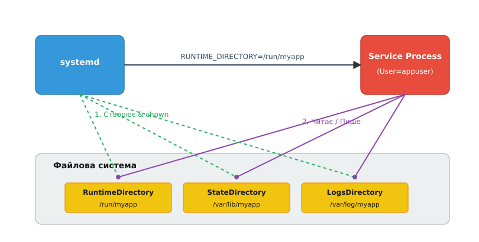

# Керовані каталоги служби: RuntimeDirectory, StateDirectory і хто їх прибирає

<details><summary>Що треба знати перед читанням</summary>

- Базове розуміння юнітів systemd (тип `Service`).
- Знання стандартної ієрархії файлової системи Linux (FHS): призначення `/run`, `/var/lib`, `/var/log`, `/etc`.
- Розуміння прав доступу до файлів і користувачів у Linux (що таке `chown`, `chmod`).

</details>

Будь-яка складна служба не висить у вакуумі. Демону бази даних потрібно зберігати самі дані, вебсерверу потрібне місце для запису логів, а проксі-серверу — сокет для IPC (міжпроцесної взаємодії) та PID-файл. Історично це означало, що адміністратор або інсталятор пакета (`.deb`/`.rpm`) мав попередньо створити купу каталогів в `/var/lib/myapp`, `/var/log/myapp` та `/run/myapp`, ретельно виставити їм правильного власника (`chown myapp:myapp`) і сподіватися, що ніхто випадково ці права не зламає. Особливо проблемним був каталог `/run`, який монтується як `tmpfs` (у пам'яті) і повністю зникає після кожного перезавантаження. Якщо служба просто спробує створити `/run/myapp` під час запуску як непривілейований користувач `myapp`, вона отримає `Permission denied`, бо в корінь `/run` має право писати лише `root`. Традиційно це вирішувалося шел-скриптами-обгортками або окремими програмами, що запускалися від рута, створювали каталоги, змінювали власника, а потім знижували привілеї (drop privileges) і запускали сам демон. Це вносило хаос, помилки безпеки та сміття у файловій системі.

Сьогодні systemd бере на себе всі ці обов'язки завдяки концепції **керованих каталогів (Managed Directories)**. Це директиви в блоці `[Service]`, які наказують системному менеджеру створити певні каталоги безпосередньо перед запуском служби, автоматично передати їх у власність користувачу служби (через `User=`) і, опціонально, автоматично прибрати їх, коли служба зупиняється.

## Директиви керування каталогами

Systemd надає п'ять основних директив для керування каталогами, які відображають стандартні шляхи FHS (Filesystem Hierarchy Standard). Синтаксис для всіх однаковий: ви вказуєте ім'я підкаталогу (або кількох через пробіл), який має бути створений у відповідному базовому каталозі.

1. **`RuntimeDirectory=`**
   - **Базовий шлях:** `/run`
   - **Призначення:** Тимчасові файли часу виконання (PID-файли, UNIX-сокети, тимчасові кеші, що не переживають ребут).
   - **Приклад:** `RuntimeDirectory=foo` створить `/run/foo`.

2. **`StateDirectory=`**
   - **Базовий шлях:** `/var/lib`
   - **Призначення:** Постійні дані та стан служби (бази даних, завантажені файли). Ці дані зберігаються між перезавантаженнями.
   - **Приклад:** `StateDirectory=foo` створить `/var/lib/foo`.

3. **`CacheDirectory=`**
   - **Базовий шлях:** `/var/cache`
   - **Призначення:** Тимчасові дані, які можуть зберігатися між перезавантаженнями, але їх втрата не є критичною (служба може їх перегенерувати).
   - **Приклад:** `CacheDirectory=foo` створить `/var/cache/foo`.

4. **`LogsDirectory=`**
   - **Базовий шлях:** `/var/log`
   - **Призначення:** Постійні текстові або структуровані логи служби (якщо ви не використовуєте journald безпосередньо, хоча journald завжди рекомендований).
   - **Приклад:** `LogsDirectory=foo` створить `/var/log/foo`.

5. **`ConfigurationDirectory=`**
   - **Базовий шлях:** `/etc`
   - **Призначення:** Зберігання конфігурації. Особливість цієї директиви в тому, що створений каталог — єдиний із п'яти, який **не передається у власність** користувачу служби: він лишається за `root` із правами 0755 (`ConfigurationDirectoryMode=`), бо конфігурацію демон має читати, а не переписувати.
   - **Приклад:** `ConfigurationDirectory=foo` створить `/etc/foo`.



*systemd створює каталоги й віддає їх у власність користувачу служби (зелені пунктирні лінії), а потім передає їхні шляхи в процес через змінні середовища; сам демон уже тільки читає й пише в готове (фіолетові лінії).*

## Життєвий цикл та автовласність

Коли ви використовуєте `RuntimeDirectory=myapp`, systemd робить під час запуску служби таке (наприклад, `systemctl start myapp.service`):

1. **Створення:** Перевіряє, чи існує `/run/myapp`. Якщо ні — створює його.
2. **Автовласність (`chown`):** Якщо в юніті вказано `User=appuser` та `Group=appgroup`, systemd рекурсивно змінює власника `/run/myapp` на `appuser:appgroup`. Це гарантує, що демон, який запускається без привілеїв root, зможе туди писати.
3. **Змінні середовища:** Systemd передає в процес демона відповідну змінну середовища, наприклад `RUNTIME_DIRECTORY=/run/myapp`. Це дозволяє програмі не хардкодити шлях в конфігурації, а читати його з оточення.

### Хто і коли прибирає сміття?

Очищення каталогів залежить від їхнього типу.

- Для **`RuntimeDirectory=`**: за замовчуванням, як тільки служба зупиняється (незалежно від того, успішно чи через краш), systemd **повністю видаляє** `RuntimeDirectory`. Це неймовірно корисно: ніяких забутих PID-файлів чи застарілих сокетів.
  - Якщо вам потрібно, щоб каталог вижив після зупинки служби (наприклад, якщо сокет потрібен для активації через socket, або якщо це `RemainAfterExit=yes`), ви використовуєте директиву `RuntimeDirectoryPreserve=`. Вона може приймати значення `yes` (ніколи не видаляти), `no` (стандартна поведінка) або `restart` (видаляти лише при повній зупинці, але залишати при перезапуску служби).

- Для **`StateDirectory=`, `CacheDirectory=`, `LogsDirectory=`**: ці каталоги **не видаляються** при зупинці служби. Вони містять стійкі дані. Однак, якщо ви використовуєте команду `systemctl clean myapp.service --what=state` (або `cache`, `logs`), systemd акуратно знищить вміст цих каталогів.

## Симбіоз з DynamicUser=yes

Справжня суперсила керованих каталогів розкривається в поєднанні з `DynamicUser=yes`.
Динамічні користувачі — це концепція, де systemd виділяє UID/GID для служби динамічно під час її запуску. Такого користувача немає в `/etc/passwd`.

Якби ми просто сказали `User=myapp` (де `myapp` — динамічний), виникла б проблема: як зберегти стан в `/var/lib/myapp`, якщо після перезапуску служби UID зміниться, і файли залишаться з чужим UID?

Systemd вирішує це елегантно: якщо ви комбінуєте `DynamicUser=yes` зі `StateDirectory=myapp`, systemd під капотом створює `/var/lib/private/myapp` (власник root), змінює його власника на поточний динамічний UID і за допомогою простору імен монтування (mount namespace) підставляє його процесу як `/var/lib/myapp`. Якщо UID при наступному запуску зміниться, systemd просто рекурсивно зробить новий `chown` для цього каталогу перед запуском демона.

Таким чином, ви отримуєте повністю безпривілейовану службу, яка не залишає після себе постійних користувачів у системі, але при цьому може безпечно і надійно зберігати стійкий стан між ребутами.

## Приклад конфігурації

Розглянемо практичний приклад. Припустімо, ми пишемо веб-сервер на C/Python/Go, який:
- Запускається від безпривілейованого користувача `www-app`.
- Слухає на UNIX-сокеті.
- Зберігає завантажені картинки.

```ini
[Unit]
Description=My Awesome App

[Service]
Type=simple
User=www-app
Group=www-app
ExecStart=/usr/local/bin/myapp

# Керовані каталоги
RuntimeDirectory=myapp
StateDirectory=myapp/uploads
CacheDirectory=myapp/thumbnails

# (Опційно) можна задати права для створених каталогів (за замовчуванням 0755)
RuntimeDirectoryMode=0750
StateDirectoryMode=0700
```

У самому коді програми (наприклад, на C) ви можете прочитати ці шляхи через змінні оточення:

```c
#include <stdio.h>
#include <stdlib.h>

int main() {
    // Systemd автоматично передасть ці змінні
    const char *runtime_dir = getenv("RUNTIME_DIRECTORY");
    const char *state_dir = getenv("STATE_DIRECTORY");

    if (runtime_dir) {
        printf("Creating UNIX socket at %s/app.sock\n", runtime_dir);
    } else {
        printf("RUNTIME_DIRECTORY is not set. Falling back to /tmp...\n");
    }

    if (state_dir) {
        printf("Saving uploads to %s\n", state_dir);
    }

    // Основний цикл демона...
    return 0;
}
```

## tmpfiles.d як альтернатива

Що робити, якщо вам потрібно створити складну ієрархію тек або керувати правами доступу, коли каталог має бути доступний кільком службам одночасно? Або якщо вам потрібно створити іменовані пайпи (FIFO)?

Для складних сценаріїв, що виходять за межі директив `RuntimeDirectory=`, використовується механізм `tmpfiles.d`.
Ви створюєте конфігураційний файл, наприклад `/usr/lib/tmpfiles.d/myapp.conf`:

```text
# Type Path               Mode UID     GID     Age Argument
d      /run/myapp/sockets 0750 www-app www-app -   -
d      /var/lib/myapp/db  0700 www-app www-app -   -
```

Ці файли обробляються системою `systemd-tmpfiles` під час завантаження системи. Вона створює ці каталоги з вказаними правами ще до того, як ваш сервіс спробує запуститися. `tmpfiles.d` набагато потужніший: він може створювати символічні посилання, FIFO-файли, керувати атрибутами btrfs, очищати старі файли (параметр Age) тощо.

Однак, для 95% звичайних демонів, використання вбудованих `RuntimeDirectory=` та `StateDirectory=` є кращим і чистішим рішенням, оскільки воно локалізує всю конфігурацію служби безпосередньо в одному файлі `.service` і прив'язує життєвий цикл файлів (як-от видалення `/run` під час зупинки) до життєвого циклу самої служби.
