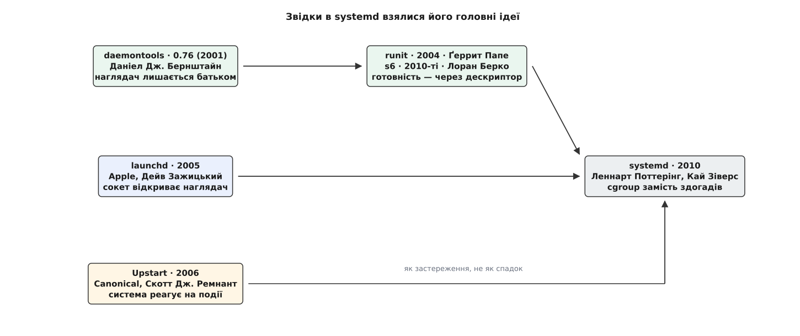

# 📜 Двадцять років по дорозі до нагляду батьківством

Найпростіша відповідь на питання «чи жива служба» — та, до якої йшли найдовше: нехай наглядач буде їй батьком, і ядро саме скаже йому про смерть. Ця історія про те, чому очевидне довелося винаходити двічі, і які саме ідеї зійшлися в сьогоднішньому менеджері служб.

## Сценарій, який стріляє в темряву

Ранній Unix не мав менеджера служб — він мав [init і таблицю в `/etc/inittab`](topic:unix-linux/init-and-pid1), а все інше робили сценарії оболонки. У схемі System V кожна служба діставала файл у `/etc/init.d/` з обов'язковими словами `start`, `stop`, `restart`. Сценарій запускав програму, програма [йшла у фон подвійним fork](topic:unix-linux/daemonize) і лишала по собі число у файлі на кшталт `/var/run/sshd.pid`. Сценарій закінчувався, повертав нуль — і на цьому знання системи про службу вичерпувалося.

Ключова хиба тут не в оболонці й не в кількості рядків. Вона в тому, **де жило знання**. Код виходу сценарію означав «сценарій відпрацював», а не «служба працює»: процес міг померти через півсекунди після запуску, і ніхто б не дізнався. Правду про службу зберігав звичайний текстовий файл, який ніхто не оновлював, коли процес падав.

Debian у 1990-х спробував зробити цю схему охайнішою — з'явився `start-stop-daemon`, невелика програма замість розсипу рядків, де `kill` шле сигнал числу, яке щойно вичитав `cat` із pid-файла. Вона вміла шукати процес за pid-файлом, за іменем, за користувачем, уміла сама записати pid-файл (`--make-pidfile`) і сама відправити процес у фон (`--background`). Але кожна з цих можливостей — це спроба вгадати. Записати pid-файл самотужки менеджер може лише для того процесу, який породив; якщо служба потім форкнеться сама, у файлі лишиться номер небіжчика. Пошук за іменем ловить чужі процеси з таким самим `argv[0]`. А головне — **між перевіркою й дією завжди є щілина**: програма читає число, переконується, що такий процес існує, шле йому `SIGTERM` — і потрапляє в чужу програму, бо у проміжку служба померла, а [номер система видала повторно](topic:unix-linux/pid-and-hierarchy). Це не рідкісний збіг: у момент масової зупинки система якраз і створює багато нових процесів.

## Бернштайн: не вгадувати, а не втрачати

У другій половині 1990-х Даніел Дж. Бернштайн (Daniel J. Bernstein), автор qmail і djbdns, випустив `daemontools` — набір із кількох крихітних програм. Задокументована стабільна версія 0.76 датована 12 липня 2001 року, а сам набір ходив мережею вже з кінця 1990-х; точної дати першого випуску автор не публікував, тож ранню межу варто вважати приблизною. У 2007-му Бернштайн віддав свій код у суспільне надбання.

Ідея була в одному реченні, і це речення перевернуло тему. **Служба не демонізується — і тому наглядач лишається її батьком.** Програма `svscan` переглядає теку `/service`, на кожен підкаталог запускає окремий примірник `supervise`, а той запускає сценарій `./run`, який мусить завершуватися словом `exec`:

```sh
#!/bin/sh
exec 2>&1
exec /usr/local/bin/myservice --foreground
```

`exec` не породжує нового процесу — він заміщає образ у тому самому. Тому дитина `supervise` **і є** служба, без жодного посередника.

Наслідки сипляться далі самі. Про смерть дитини ядро повідомляє батька сигналом [`SIGCHLD`](topic:unix-linux/signal-model), і батько [забирає код виходу](topic:unix-linux/exit-wait-zombies) — pid-файл стає непотрібним, бо непотрібне саме вгадування. Перезапуск перестає бути рішенням і стає циклом: `supervise` просто запускає `run` знову. Зупинка перестає бути гонкою: сигнал шлють конкретній дитині, а не числу з файла. Навіть журнал змінюється — служба пише у власний стандартний вивід, а `supervise` веде цей вивід каналом у `multilog`, тож ротація не потребує ні `SIGHUP`, ні перевідкриття файлів.

Ціна теж була очевидна: схема вимагала, щоб служби вміли **не** йти у фон. Тодішні демони цього здебільшого не вміли, а `daemontools` не мав ані пакунків у дистрибутивах, ані звичного вигляду. Тому ідея жила довго — але майже виключно в руках тих, хто ставив її свідомо.



*Три незалежні лінії й те, що з кожної залишилося*

## Продовження лінії: runit і s6

Ґеррит Папе (Gerrit Pape) випустив `runit` 10 лютого 2004 року — переписаний з нуля `daemontools`, який додав до нагляду ще й роль [PID 1](topic:unix-linux/init-and-pid1): завантаження ділиться на три стадії, і друга з них — це просто дерево наглядачів. Тобто «наглядач — батько» перестало бути надбудовою над init і стало самим init.

Лоран Берко (Laurent Bercot, skarnet.org) у 2010-х написав `s6` — знову оригінальний код у тій самій архітектурі, але з важливим доповненням. Батьківство чесно розв'язує питання смерті й нічого не каже про **готовність**: процес живий із першої мілісекунди, а приймати запити починає значно пізніше. `s6` дав службі спосіб сказати про це прямо — записати байт у наперед домовлений дескриптор, який їй передав наглядач. Дескриптор тут не примха: він, на відміну від файлу-прапорця, зникає разом із процесом і не бреше.

## Apple: сокет відкриває наглядач

`launchd`, який спроєктував і написав Дейв Зажицький (Dave Zarzycki), вийшов 29 квітня 2005 року разом із Mac OS X 10.4 Tiger — спочатку під ліцензією APSL, у серпні 2006-го його перевипустили під Apache 2.0. Він теж наглядав за процесами, але вніс ідею з зовсім іншого боку.

`launchd` **сам відкриває слухавчий сокет** і передає службі готовий дескриптор через середовище. Порядок запуску після цього значною мірою розчиняється: клієнт з'єднується з сокетом, який уже існує, ядро складає з'єднання в чергу, а служба тим часом стартує — і не має значення, хто з двох устиг раніше. Це спорідненість із `inetd`, але з ключовою різницею: `inetd` породжував процес на кожне з'єднання, а `launchd` віддає сокет одному довгоживучому демонові. Про механізм детальніше — в [активації за сокетом](topic:unix-linux/socket-activation).

## Canonical: події замість порядку

Скотт Джеймс Ремнант (Scott James Remnant) у Canonical випустив Upstart 24 серпня 2006 року; уперше він поїхав в Ubuntu 6.10, згодом його взяли Fedora 9 і RHEL 6. Питання, на яке відповідав Upstart, було справжнє: статичний порядок «спершу мережа, потім сервер» ламається, коли залізо з'являється під час роботи — USB встромили, кабель увімкнули, диск примонтували. Тож Upstart зробив основою **подію**: завдання оголошує, на що воно відгукується, і система розсилає повідомлення.

Слабке місце цієї моделі вголос назвав Леннарт Поттерінг у квітні 2010-го: залежності від подієвої моделі нікуди не зникають, їх просто доводиться перекладати вручну авторові кожного файла-завдання — і система замість мінімальної роботи виконує максимальну, бо запускає все, що могло б відгукнутися.

## systemd: зведення трьох ліній

30 квітня 2010 року Поттерінг опублікував допис «Rethinking PID 1», а сам проєкт systemd він і Кай Зіверс (Kay Sievers) розпочали в Red Hat того ж року. Fedora 15 (травень 2011) стала першим великим дистрибутивом із systemd за умовчанням; Debian 8 і Ubuntu 15.04 дійшли туди у квітні 2015-го.

Цінне тут не хронологія, а те, **що звідки взяли**. Нагляд батьківством і заборона демонізуватися (`Type=simple`, `Type=exec`) — пряма лінія від `daemontools`. Активацію за сокетом Поттерінг у тому ж дописі відкрито приписує `launchd`, називаючи його підхід винахідливим. Явне сповіщення про готовність (`Type=notify`, `sd_notify`) повторює хід `s6`, хоч і через сокет-датаграму, а не через дескриптор-канал. Від Upstart лишився радше урок: динаміку системи описують залежностями й активацією, а не розсиланням подій.

Одну річ systemd таки додав свою. Батьківство ламається, щойно служба сама розгалужується або лишає по собі допоміжні процеси — батько бачить смерть лише свого прямого нащадка. Тому службу тут поміщають у власну [контрольну групу](topic:unix-linux/cgroups): дитина успадковує групу батька, і **вийти з неї процес не може** — це рішення ядра, а не домовленість. Так менеджер уперше отримав не здогад про склад служби, а її точну межу.
