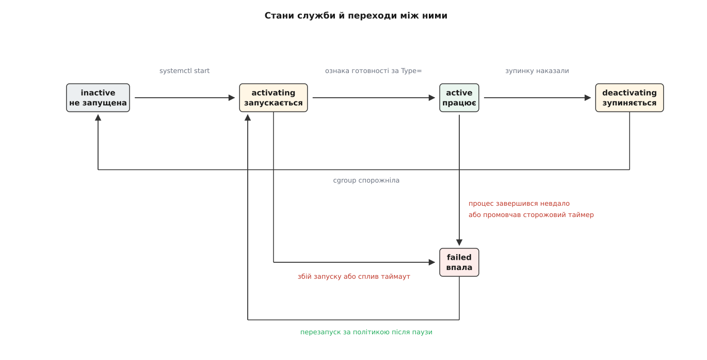
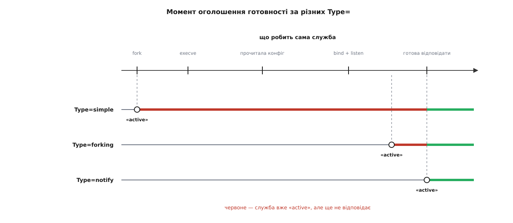
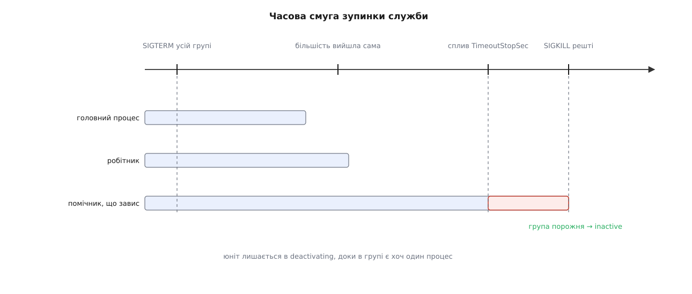
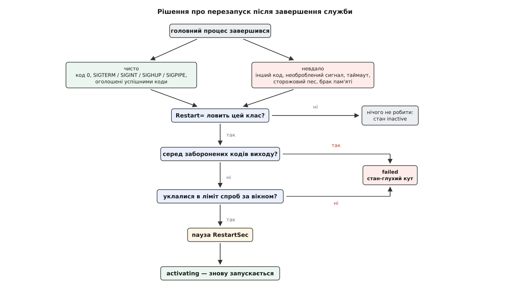

# Життєвий цикл служби й політика перезапуску

<preknowlist>
- [Процес: що це насправді](topic:unix-linux/process-model) — процес є набором ресурсів ядра з номером-ідентифікатором, і цей номер система з часом видає повторно.
- [Завершення, wait і зомбі](topic:unix-linux/exit-wait-zombies) — про смерть процесу ядро повідомляє його батька, і саме батько забирає код виходу.
- [Сигнал: асинхронне сповіщення](topic:unix-linux/signal-model) — сигнал приходить у довільну мить, частину сигналів програма може перехопити, частину — ні.
- [cgroups: облік і обмеження ресурсів](topic:unix-linux/cgroups) — процеси зібрані в іменовані групи, діти успадковують групу батька, і сам себе процес переставити в іншу групу не може.
- [Демонізація: відхід у фон](topic:unix-linux/daemonize) — класичний спосіб піти у фон подвійним fork, після якого процес стає сиротою.
- [Роль init і особливість PID 1](topic:unix-linux/init-and-pid1) — процес із номером 1 усиновлює сиріт і живе стільки ж, скільки система.
- [systemd: юніти, залежності, цілі](topic:unix-linux/systemd-model) — службу описує файл-юніт, а між юнітами оголошують порядок і залежності.
</preknowlist>

Машина в стійці працює місяцями, і ніхто на неї не дивиться. О третій ночі процес бази даних отримує запит, який зачіпає давню помилку в коді, і падає. Через хвилину користувач бачить відмову — або не бачить нічого, бо база вже знову приймає з'єднання. Різниця між цими двома світами не в якості бази: вона в тому, чи є в системі щось, що помітило смерть і підняло службу наново.

Це «щось» мусить уміти три речі, і жодна з них не дається задарма. Знати, що служба вже працює. Знати, що вона перестала. Вирішити, підіймати її наново чи облишити. Кожна з трьох має неочевидну відповідь, і саме з них виростає все інше — стани служби, типи запуску, таймаути, лічильники спроб.

## Хто взагалі може помітити смерть

Коли процес завершується, ядро повідомляє про це рівно одного адресата — його батька. Батько отримує сигнал `SIGCHLD` і може забрати статус: код, з яким процес вийшов, або номер сигналу, що його вбив. Ця інформація існує в одному екземплярі й тільки для батька; щойно він її забрав, запис про мертвий процес зникає.

Класичний спосіб піти у фон навмисно руйнує цей зв'язок. Демон робив `fork`, батько одразу виходив, дитина відв'язувалася від сеансу й термінала, а щоб не мати змоги випадково захопити термінал назад — робила `fork` ще раз. Наприкінці процес виявлявся сиротою й прилипав до `PID 1`. Робилося це не зі зла: демон позбувався термінала, який усе одно колись закриють. Але побічний наслідок був фатальний для нагляду — батьком служби ставав init, який про неї нічого не знає і статус її виходу просто викидає.

Далі доводилося будувати нагляд на непрямих ознаках. Служба записувала свій номер у pid-файл, сценарій зупинки читав звідти число й слав туди сигнал. Кожна ланка цієї схеми ненадійна. Файл лишається після аварійного падіння й показує номер, якого вже немає. Номери процесів система видає повторно, тож за старим числом може виявитися чужа програма — і сигнал зупинки прилетить їй. Навіть чесна перевірка «чи живий такий процес» — це гонка: між перевіркою й сигналом процес устигає померти, а номер — дістатися новому. Саме через цю дірку в ядро згодом додали [дескриптор процесу](topic:unix-linux/pidfd), який посилається на конкретний процес, а не на число.

Правильна відповідь виявилася не хитрішим способом вгадувати, а знищенням причини здогадів: **служба не має відв'язуватися**. Менеджер служб сам робить `fork` і `exec`, лишається батьком і нікуди дитину не відпускає. Тоді смерть — не висновок із непрямих ознак, а подія з точним статусом, яку ядро приносить саме. Ця зміна кута — головна в усій темі; як до неї дійшли за двадцять років спроб, від сценаріїв ініціалізації до наглядачів, розказано [окремо](topic:unix-linux/service-lifecycle/hist-supervision.md).

## Служба — це не процес, а група

Батьківство розв'язує половину задачі. Друга половина в тому, що служба рідко буває одним процесом: веб-сервер тримає робітників, база — фонові потоки запису, поштовий сервер запускає окремий процес на кожне з'єднання. Головний процес може вийти, а десяток його нащадків лишиться в пам'яті, тримаючи порт і файли. Служба формально «завершилася», а фактично працює.

Гірше, що дитина може втекти з-під нагляду тим самим подвійним `fork`. Батьківство — зв'язок, який процес розриває власними силами.

Із cgroup так не вийде. Група — це не властивість процесу, а запис у файловій ієрархії ядра: щоб перенести задачу в іншу групу, треба записати її номер у службовий файл тієї групи, а на це потрібні права, яких у службі немає. Діти успадковують групу батька автоматично й нікуди з неї не дінуться, скільки б разів не розмножувалися. Тому менеджер створює для кожної служби окрему cgroup і запускає її туди.

Звідси два різні поняття, які легко сплутати. **Головний процес** — той, чий статус виходу є вироком: за ним визначають, служба відпрацювала чи впала. **Група** — межа служби: доки в ній лишається хоч один процес, служба ще не зупинилася. Перше відповідає на питання «як воно скінчилося», друге — на питання «чи скінчилося взагалі».

Маючи ці дві речі, менеджер тримає про кожну службу точний стан і знає, що саме перевести його може.



*Стан `failed` вирізняється з-поміж усіх: у нього ведуть три різні події, а виходить із нього служба тільки за політикою перезапуску або втручанням людини.*

## Коли служба вважається запущеною

Здавалося б, це питання без загадки: запустили програму — вона працює. Загадка з'являється, щойно від служби залежить хтось інший. Юніт, який оголошено «після» бази даних, стартує тієї миті, коли база перейшла в стан `active`. Якщо ця мить настає раніше, ніж база почала приймати з'єднання, залежна програма отримає відмову й упаде — на порожньому місці, бо порядок формально дотримано.

Отже, `active` мусить означати «нею вже можна користуватися». А між запуском програми й цим моментом лежить робота: прочитати конфігурацію, відкрити файли, відкрити й прив'язати сокет, прогріти кеш. Скільки вона триває, ззовні не видно.

Знає це тільки сама служба. Тому «ознака готовности» — не властивість системи, а **домовленість між службою та менеджером**, і домовленостей цих кілька. Кожна відповідає своєму поколінню програм, і задає її поле `Type=` в юніті.

Найпростіша — `simple`: менеджер вважає службу запущеною одразу, щойно зробив `fork`. Він не знає нічого: ані чи знайшовся файл програми, ані чи вона взагалі почала працювати. Трохи чесніша `exec` (з'явилася у версії 240): менеджер чекає, доки в дитині успішно виконається `execve`, — так помилки на кшталт «немає файлу» або «немає права на виконання» видно одразу, а не через хвилину в журналі. Про готовність вона все одно не каже нічого.

`forking` — це та сама стара демонізація, обернена на користь: батько виходить тоді, коли дитина вже готова, тож **вихід батька і є сигналом готовності**. Домовленість робоча, але платня за неї відома — менеджеру треба серед нащадків упізнати головного, а для цього повернутися до pid-файлів із усіма їхніми гонками.

`dbus` вважає службу готовою тоді, коли на [шині повідомлень](topic:unix-linux/dbus) з'явилося обумовлене ім'я: служба реєструє його останнім кроком, уже готова відповідати.

`notify` прибирає посередників: служба сама каже «готово». Менеджер кладе в її оточення змінну `NOTIFY_SOCKET` з іменем [сокета домену Unix](topic:unix-linux/unix-domain-sockets) і чекає на датаграму з текстовим рядком `READY=1`. Тим самим каналом служба передає й інше: рядок стану для `systemctl status`, номер головного процесу, прохання продовжити таймаут. Хто саме має право слати ці повідомлення, обмежують окремо, бо сокет доступний усій групі.

Осібно стоїть `oneshot` — юніт, який не тримається в пам'яті, а щось робить і закінчує: створює каталог, накочує міграцію, налаштовує мережевий інтерфейс. Для нього `active` настає, коли процес **завершився успішно**, тож усе, що йде «після», справді дочекається результату. А щоб такий юніт не зник зі стану `active` одразу після виходу, є `RemainAfterExit=yes`: процесів немає, а система пам'ятає, що робота зроблена.



*Червоний відтинок — час, коли система вже вважає службу робочою, а вона ще не відповідає. Залежні юніти стартують саме на його початку.*

Стан `activating` не може тривати вічно: якщо служба зависла, не дійшовши до готовності, менеджер мусить це якось закінчити. Тому запуск обмежено таймаутом (типово півтори хвилини), після якого юніт вважається невдалим і зупиняється. Для довгої, але чесної роботи — скажімо, перевірки великої файлової системи — служба може каналом сповіщень попросити продовження, підтверджуючи, що вона рухається, а не зависла.

> 🔧 **Навіщо це.** Спокуса, у яку впадають майже всі: залишити `Type=simple` і вставити в залежну службу паузу на кілька секунд. На тестовій машині це працює, а на завантаженій під час одночасного старту двадцяти юнітів — ні, бо пауза прив'язана до часу, а готовність — до події. Правильна пара — це `Type=notify` з боку служби (або [активація за сокетом](topic:unix-linux/socket-activation), коли сокет відкриває сам менеджер ще до старту служби, і тоді питання готовності просто зникає) і звичайне оголошення залежності з боку того, хто чекає.

## «Живий» не означає «працює»

Процес може бути цілком живим і при цьому не робити нічого корисного: два потоки взяли блокування у зворотному порядку, цикл обробки зациклився на битих даних, запит до сховища не повертається. З погляду ядра все гаразд — процес існує, нікуди не вийшов. З погляду користувача служба мертва.

Ззовні ці два стани не відрізнити, і знову єдиний, хто може відрізнити, — сама служба, точніше її головний цикл роботи. Тому домовленість роблять зустрічною: менеджер оголошує термін (`WatchdogSec=`), а служба зобов'язується подавати ознаку життя частіше за нього — тією самою датаграмою, рядком `WATCHDOG=1`. Термін вона дізнається з оточення, тож жорстко зашивати число в код не треба. Прострочила — менеджер вважає це збоєм і б'є `SIGABRT`, щоб від зависання лишився [аварійний дамп](topic:unix-linux/core-dump) із зупиненими потоками, а не самий лише запис у журналі.

Тонкість, на якій ця схема ламається найчастіше: пінг має йти **з того самого циклу, що робить роботу**. Винесете його в окремий потік із таймером — сторожовий пес перевірятиме справність цього потоку, а не служби, і зависла обробка запитів лишиться непоміченою. Це рівно та сама ідея, що й [апаратний сторожовий таймер](topic:programming/watchdog) у мікроконтролері, з тією ж пасткою: годувати його треба там, де робота, а не там, де зручно. До речі, systemd вміє й зворотний бік — сам годувати апаратний таймер плати, щоб зависання всієї системи закінчилося перезавантаженням.

Як виглядає служба, яка чесно оголошує готовність і годує сторожовий таймер, — з кодом, юнітом і пастками — розібрано в [окремому прикладі](topic:unix-linux/service-lifecycle/proj-notify-watchdog.md).

## Зупинка — це не одна дія

Зупинити службу здається простим: послати сигнал. Але `SIGTERM` — це **прохання**, а не наказ. Програма має право його перехопити й дописати транзакцію, має право проігнорувати, а може взагалі його не отримати найближчим часом, бо сидить у [непереривному очікуванні](topic:unix-linux/process-states) відповіді від мережевого диска.

Тому зупинка розкладається на послідовність із запасним виходом. Спершу виконується команда зупинки, якщо служба її має. Далі йде сигнал завершення — типово всій групі, а не самому головному процесу, бо робітники теж мусять піти. Потім менеджер чекає, доки cgroup спорожніє; поки в ній хоч хтось є, юніт лишається в стані `deactivating`. Якщо за відведений час (типово півтори хвилини) група не спорожніла, у все, що лишилося, летить `SIGKILL` — сигнал, який не перехоплюють і не блокують.

Навіть він не миттєвий: задача, що спить непереривно, помре тільки тоді, коли вийде з очікування. Саме тому в системі бувають служби, які «зупиняються» хвилинами, і це не помилка менеджера, а стан, у якому застряг драйвер.



*Момент переходу в `inactive` визначає не смерть головного процесу, а спорожніння групи — останній процес, що вийшов, і закриває зупинку.*

Режим убивства можна звузити до самого головного процесу — це потрібно рідко й лише тоді, коли служба сама відповідає за долю нащадків. Ціна такого вибору: робітники переживуть зупинку служби, осиротіють і лишаться триматися за її файли й порти.

## Вирок: чисто чи невдало

Тепер у менеджера є все, щоб винести присуд про закінчений епізод життя служби. Він поділяє всі варіанти на два класи.

**Чисто** — код виходу нуль. Крім нього, до чистих зараховують кілька сигналів: `SIGTERM`, `SIGINT`, `SIGHUP` і `SIGPIPE` (для типу `oneshot` — ні). Перші три в цьому списку тому, що ними службу зупиняють ззовні: якби смерть від `SIGTERM` вважалася аварією, то кожна нормальна зупинка виглядала б як збій. `SIGPIPE` — давня домовленість Unix: програмі конвеєра, у якої закрився читач, нема для кого працювати, і її смерть нормальна. Крім того, служба може оголосити в юніті власний список кодів, які для неї означають успіх, — бо [код виходу є її інтерфейсом](topic:unix-linux/exit-status), і значення 2 у одній програмі означає катастрофу, а в іншій — «немає чого робити».

**Невдало** — усе інше: ненульовий код, необроблений сигнал (падіння за помилкою пам'яті), сплив таймаут запуску чи зупинки, промовчав сторожовий таймер, [ядро вбило процес за нестачею пам'яті](topic:unix-linux/overcommit-and-oom).

Класифікація важлива не сама собою: вона є входом для рішення. Причому одне рішення ухвалює не менеджер, а сама служба — окремим списком у юніті можна перелічити коди, після яких перезапускати **не треба нізащо**. Типовий випадок — зіпсована конфігурація: скільки не піднімай, файл від цього не полагодиться, і чесніше зупинитися відразу.

І ще одне правило, яке рятує від несподіванок: політика перезапуску не діє, коли зупинку наказала людина. `systemctl stop` зупиняє службу остаточно — рішення людини сильніше за автомат.

## Політика: які саме класи ловити

Директива `Restart=` не «вмикає перезапуск», а вибирає, **на які події з класифікації реагувати**. Типове значення — не робити нічого. `on-failure` ловить увесь клас невдач і саме тому підходить майже завжди. `always` додає до нього чисті виходи — це для служб, які взагалі не мають права закінчуватися, хай навіть із кодом нуль. `on-watchdog` звужує реакцію до єдиної події — мовчання сторожового таймера. Є й дзеркальний `on-success`: він потрібен тим службам, які **мусять** перезапускатися після нормального завершення — обробила порцію даних, вийшла, почала наново.

Перезапуск при цьому означає рівно те, що написано: зупинка й запуск того самого юніта. Ті, хто від служби залежав, при цьому не перезапускаються — вони й не помітять, що з'єднання під ними на секунду зникло, якщо їх не зв'язали з нею явно.

## Чому машина мусить уміти здаватися

Спробуймо тепер найпростішу політику: упало — підняти негайно. Служба з битою конфігурацією падає за сорок мілісекунд. За секунду менеджер підніме її двадцять п'ять разів, за годину — сотні тисяч, кожна спроба залишить у [журналі](topic:unix-linux/journald-logging) свій запис, і журнал зжере диск швидше, ніж хтось помітить проблему. Пауза між спробами (типово сота частка секунди) трохи знижує оберти, але суті не міняє.

Суть така: **тимчасовий збій і постійний в одній точці часу не відрізняються ніяк**. Мережа моргнула — впала; файлу немає — теж упала. Автомат не має способу зазирнути всередину причини. Єдине, чим вони справді різняться, — це частота: тимчасове трапляється зрідка, постійне повторюється щоразу.

Звідси рішення, яке виглядає грубим, а насправді єдино можливе: лічильник. Менеджер рахує спроби запуску у ковзному вікні — типово п'ять спроб за десять секунд. Уклалися — служба живе далі. Перевищили — юніт переходить у `failed` і **лишається там**, доки людина не скине цей стан або не запустить його руками.

Ця відмова навмисна. Автомат, що нескінченно піднімає безнадійну службу, не рятує систему — він приховує аварію й спалює ресурси. Стан `failed` — це спосіб сказати: «я вичерпав те, що вмію».

Між «підіймати миттєво» і «здатися після п'ятої спроби» є середина, і вона з'явилася у версії 254: пауза може рости геометрично від початкової до стелі. Крок росту система рахує сама, з простої умови — за задану кількість кроків дійти від початкової паузи до максимальної:

**Початкова пауза 10 с, стеля 160 с, чотири кроки росту:**

```
множник = (160 / 10)^(1/4) = 16^0.25 = 2

спроба 1 → пауза 10 с
спроба 2 → пауза 20 с
спроба 3 → пауза 40 с
спроба 4 → пауза 80 с
спроба 5 → пауза 160 с
далі     → 160 с щоразу
```

За перші півтори хвилини служба спробує піднятися чотири рази — цього досить, щоб пережити коротку недоступність бази чи мережі. Далі вона переходить на одну спробу за дві з половиною хвилини й може так чекати добу, не заважаючи нікому. Це та сама ідея, що й у мережевих протоколах: не здаватися, але питати дедалі рідше.



*Дві різні події ведуть до `failed`: невдача, яку політика не ловить, і вичерпаний ліміт спроб. Перша — рішення про цю службу, друга — рішення про безнадійність.*

> 🔧 **Навіщо це.** Найчастіше питання під час чергування звучить так: «служба не піднімається, а в журналі порожньо». Майже завжди це вичерпаний ліміт спроб — юніт уже в `failed`, і менеджер більше нічого не робить, тому нових записів і немає. Ліки: подивитися стан юніта, скинути лічильник і запустити наново. Друге за частотою — служба «стартувала», але залежні від неї падають: це `Type=simple` там, де мала бути ознака готовності.

Точний перелік директив, їхніх типових значень і рядків протоколу сповіщень зібрано [окремо](topic:unix-linux/service-lifecycle/api-service-unit.md) — тримати його в голові не треба, треба розуміти, з чого він складається.

Коли й лічильник вичерпано, лишається останнє: сповістити. Юніт може вказати, що саме запустити в разі своєї невдачі — надіслати лист, поставити позначку в системі моніторингу, а в найсуворішому випадку перезавантажити машину. Це вже не спроба полагодити, а передача справи далі.

І в цьому головна межа всієї конструкції. Наглядач уміє рівно одне — підняти те, що впало, і зробити це стільки разів, скільки має сенс. Він не полагодить биту конфігурацію, не поверне зниклий диск і не виправить помилку в коді. Тому будь-яка політика перезапуску корисна рівно настільки, наскільки служба вміє чесно вмирати: правильним кодом виходу, вчасним мовчанням сторожового таймера, відмовою підійматися там, де підійматися марно. Та сама пара обов'язків — наглядач тримає, підопічний чесно звітує — лежить в основі [дерев нагляду](topic:programming/supervision-trees) у мовах, де це вбудовано в саму мову виконання.
