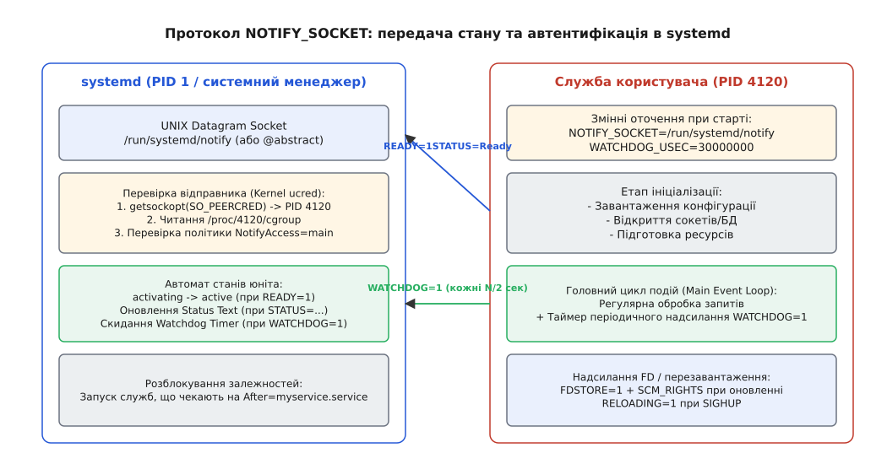

# Протокол сповіщення менеджера: NOTIFY_SOCKET, READY=1 і Type=notify

<preknowlist>
- [init і PID 1](book:unix-linux/init-and-pid1) — функція першого процесу в ініціалізації системи та проблема вгадування готовності фонових демонів.
- [Дерево cgroups](book:unix-linux/cgroupfs-v1-v2-resource-management-tree) — ізоляція процесів у контрольних групах та перевірка приналежності відправника датаграм.
- [Системний виклик](book:unix-linux/syscall-mechanics) — механіка викликів ядра, локальних сокетів AF_UNIX та передачі файлових дескрипторів.
</preknowlist>

Коли менеджер системних служб запускає фоновий процес (демон), він стикається з фундаментальною асиметрією інформації: ядро Linux знає факт створення процесу через системний виклик `execve()`, але менеджер ініціалізації не має жодного уявлення про те, коли цей процес всередині дійсно завершить свої підготовчі операції. Служба може зчитувати гігабайтні конфігураційні файли, розгортати великі структури даних у пам'яті, підключатися до віддалених баз даних або відкривати мережеві сокети. У традиційних системах SysVinit демони сигналізували про «старт» шляхом подвійного форку (`fork() -> fork() -> exit()`), після чого батьківський процес повертав управління оболонці з нульовим кодом завершення. Це створювало важку проблему перегонів (race condition): залежні служби починали виконуватися негайно, зверталися до ще не готових сокетів або пам'яті першої служби, зазнавали краху й входили в нескінченні цикли перезапуску. Системним адміністраторам доводилося вставляти ненадійні затримки `sleep` у сценарії запуску. Механізм `Type=notify` у `systemd` та протокол `NOTIFY_SOCKET` розв'язують цю проблему, повертаючи вектор ініціалізації: не менеджер вгадує стан процесу, а сам процес явно сповіщає менеджер про досягнення фази повної операційної готовності.

## 1. Проблема синхронізації запуску: ілюзія готовності в класичних системах

У класичній архітектурі Unix створення нового процесу є двоетапною операцією: виклик `fork()` створює дублікат поточного процесу, а виклик `execve()` замінює образ пам'яті процесу новою програмою. З точки зору ядра Linux та системного менеджера, на цьому етапі процес уже існує — він дістав власний ідентифікатор PID та був поміщений у чергу планувальника задач.

Однак виконання першої інструкції `main()` у програмі є лише початком її тривалого внутрішнього життя. Розглянемо приклад сервера бази даних або високонавантаженого веб-проксі. Для досягнення стану, у якому демон здатний обробляти користувацькі запити, програма повинна виконати суворий послідовний ланцюжок дій:

1. Прочитати та розпарсити конфігураційні файли на диску.
2. Виділити та ініціалізувати буфери оперативної пам'яті (наприклад, shared memory або page cache).
3. Перевірити цілісність локальних файлів даних або виконати міграцію схеми.
4. Встановити мережеві з'єднання з зовнішніми сервісами авторизації чи кешування.
5. Створити та прив'язати (системні виклики `socket()`, `bind()`, `listen()`) мережеві сокети для прийому вхідних клієнтських з'єднань.

У системі SysVinit менеджер запуску виконував shell-скрипт `/etc/init.d/myservice start`. Скрипт викликав виконуваний файл демона, який відгалужував дочірній процес у фоновий режим і відразу завершував батьківський процес. Скрипт ініціалізації вважав роботу виконаною успішно в момент виходу батьківського процесу. Як наслідок, наступний скрипт у черзі (наприклад, `/etc/init.d/web-app start`) запускався негайно. Програма `web-app` намагалася підключитися до сокета сервера бази даних, який ще 5 секунд перебував на етапі зчитування конфігурації. Виклик `connect()` повертав помилку `ECONNREFUSED` (Connection Refused), і веб-застосунок завершувався з аварією.

Спроби відстеження стану демонів через створення файлів ідентифікаторів процесів (`/var/run/daemon.pid`) лише погіршували ситуацію. Демон створював PID-файл на самому початку своєї ініціалізації — ще до викликів `bind()` та `listen()`. Залежний процес бачив наявність PID-файла, перевіряв існування процесу викликом `kill(pid, 0)` і робив хибний висновок про готовність служби. Більш того, при перезавантаженні або аварійному виході демона PID-файл залишався на диску з застарілим ідентифікатором (stale PID file). Якщо ядро Linux пізніше виділяло цей самий PID зовсім іншому процесу (PID rollover), менеджер ініціалізації помилково вважав збійний демон працюючим.

Адміністратори намагалися вирішувати цю проблему за допомогою утиліт перевірки стану на кшталт `netstat`, `curl` чи простих затримок `sleep 5` у скриптах. Це створювало дві суттєві проблеми: невиправдане уповільнення завантаження всієї системи (бо затримка береться з запасом) та ненадійність на повільному апаратному забезпеченні або під час високого навантаження на диск. Менеджер `systemd` відмовився від вгадування стану ззовні й запровадив модель явного зворотного зв'язку.

## 2. Архітектура сокета NOTIFY_SOCKET: локальні датаграми AF_UNIX

В основі протоколу сповіщення `systemd` покладено використання локальних датаграмних сокетів `AF_UNIX` з типом `SOCK_DGRAM`.

Коли у файлі конфігурації юніта (у секції `[Service]`) встановлено прапорець `Type=notify`, системний менеджер перед створенням процесу служби створює новий сокет `AF_UNIX` і передає шлях до нього через змінну оточення `NOTIFY_SOCKET`.

Вибір датаграмних сокетів `SOCK_DGRAM` замість потокових `SOCK_STREAM` (подібних до TCP) є фундаментальним архітектурним рішенням.


*Протокол NOTIFY_SOCKET: створення сокета в systemd, передача змінних оточення, ізоляція cgroup та двосторонній автомат станів.*

Датаграмні сокети UNIX не потребують процедури рукостискання та встановлення стійкого з'єднання (`connect()`). Вони працюють за принципом «відправив і забув»: процес створює сокет, викликає `sendto()` з текстовою датаграмою та може одразу закрити дескриптор. Якщо системний менеджер `systemd` у цей конкретний момент часу зайнятий обробкою інших подій ядра, ядро Linux зберігає надісланий пакет у буфері прийому сокета (`SO_RCVBUF`). Процес служби не блокується і продовжує виконання коду. На відміну от потокових сокетів `SOCK_STREAM`, надсилання датаграм не викликає аварійного сигналу `SIGPIPE` у разі тимчасової відсутності зчитувача.

Змінна оточення `NOTIFY_SOCKET` може містити один із двох типів шляхів:

1. **Файловий шлях у файловій системі:** Наприклад, `NOTIFY_SOCKET=/run/systemd/notify`. Для з'єднання з таким сокетом програма заповнює структуру `struct sockaddr_un`, де в поле `sun_path` записується вказаний шлях.
2. **Абстрактний простір імен сокетів Linux (Abstract Socket Namespace):** У цьому випадку шлях у змінній починається з префіксного символу `@` (наприклад, `@/org/freedesktop/systemd/notify/control`). На рівні системних викликів ядра перший байт масиву `sun_path` має містити null-байт `\0`. Абстрактні сокети реалізовані безпосередньо у мережевому стеку ядра (`net/unix/af_unix.c`), не залишають файлових вузлів на диску, не вимагають прав запису в каталоги файлової системи та автоматично знищуються ядром при закритті сокета менеджером.

Формат текстової датаграми є максимально простим і мовно-агностичним. Це текстовий блок у кодуванні UTF-8, що складається з параграфів вида `КЛЮЧ=значення`, розділених символом нового рядка `\n`. Один пакет датаграми може містити один або декілька ключів одночасно. Повний канонічний опис усіх ключів протоколу наведено у [Специфікації ключів протоколу](book:unix-linux/service-notify-protocol/api-notify-protocol.md).

> 🔧 **Навіщо це.**
> Завдяки текстовому формату та стандартним системним викликам `AF_UNIX`, розробникам не потрібно лінкувати зовнішню бібліотеку `libsystemd`. Будь-яка програма на мові C, C++, Rust, Go, Python чи Shell може інтегруватися з автоматом станів системи, зробивши лише один виклик `sendto()`.

## 3. Ядерна автентифікація відправника: ucred, SO_PEERCRED та фільтрація cgroups

Використання єдиного або загальновідомого шляху сокета створює потенційний вектор атаки: шкідливий або збійний процес у системі може надіслати у сокет сповіщення `READY=1` від імені чужій служби, змусивши `systemd` запустити залежні юніти передчасно.

Щоб унеможливити підробку станів, `systemd` застосовує механізм перевірки облікових даних ядра (Kernel Credentials Verification). При отриманні будь-якої датаграми на сокет `NOTIFY_SOCKET` системний менеджер не довіряє вмісту текстового пакета, а запитує у ядра підтверджені метадані про процес, який здійснив відправку.

Механізм автентифікації працює за наступним ланцюжком:

1. Під час виконання виклику `sendto()` ядро Linux автоматично прив'язує до датаграми структуру `struct ucred` (або надає її через допоміжні дані `SCM_CREDENTIALS`), яка містить реальний ідентифікатор процесу `ucred.pid`, ефективний UID `ucred.uid` та GID `ucred.gid`.
2. Отримавши датаграму, `systemd` запитує ці дані за допомогою системного виклику `getsockopt(fd, SOL_SOCKET, SO_PEERCRED, &ucred, &len)` або зчитує їх із виклику `recvmsg()`.
3. За отриманим `ucred.pid` системний менеджер відкриває та аналізує псевдофайл `/proc/<pid>/cgroup` для визначення точного шляху в ієрархії контрольних груп cgroups v2. У cgroups v2 кожному юніту відповідає єдине унікальне піддерево у файловій системі `cgroupfs` (наприклад, `/sys/fs/cgroup/system.slice/myservice.service`). `systemd` перевіряє наявність `ucred.pid` у списку процесів `/sys/fs/cgroup/system.slice/myservice.service/cgroup.procs`. Якщо процес виконується у власному просторі імен процесів (PID namespace), ядро Linux автоматично транслює PID відправника у первинний простір імен PID 1.
4. `systemd` порівнює контрольну групу відправника з cgroup, виділеною для конкретної служби. Якщо PID відправника не належить до контрольної групи юніта, сповіщення повністю ігнорується, а у системний журнал `journald` вноситься запис про спробу неавторизованого сповіщення.

Правила авторизації додатково контролюються параметром `NotifyAccess=` у секції `[Service]` конфігурації юніта:

- `NotifyAccess=main` *(значення за замовчуванням)*: Системний менеджер приймає датаграми виключно від головного процесу служби (чий PID дорівнює `MAINPID` або первинному `ExecStart=`). Сповіщення від дочірніх процесів ігноруються.
- `NotifyAccess=exec`: Дозволяє надсилати сповіщення будь-якому процесу, створеному безпосередньо `systemd` у межах юніта (включаючи підготовчі скрипти `ExecStartPre=` та `ExecStartPost=`).
- `NotifyAccess=all`: Дозволяє приймати сповіщення від будь-якого процесу всередині cgroup служби (необхідно для демонів з майстер-воркер архітектурою).
- `NotifyAccess=none`: Системний менеджер повністю ігнорує всі сповіщення на сокеті.

## 4. Автомат станів юніта: READY=1, RELOADING=1, STOPPING=1 та STATUS

Головне призначення протоколу — управління автоматом станів служби (Service State Machine) всередині PID 1.

```
 [ activating ] ─── READY=1 ───> [ active ] ─── RELOADING=1 ───> [ reloading ]
       │                             │                                 │
       │ (тайм-аут)                  │ STOPPING=1                      │ READY=1
       ▼                             ▼                                 ▼
   [ failed ] <──────────────── [ deactivating ] <─────────────────────┘
```

### Подія готовності: READY=1

Коли процес служби завершує всі етапи внутрішньої ініціалізації, він надсилає у сокет текстовий рядок `READY=1`. Отримавши це повідомлення, `systemd` переводить юніт зі стану `activating` у стан `active`. У цей же момент розблоковується виконання всіх залежних юнітів, які мають конфігураційний параметр `After=ваша_служба.service`.

Якщо служба має тип `Type=notify`, але не надсилає `READY=1` протягом часу, визначеного параметром `TimeoutStartSec=` (за замовчуванням 90 секунд), системний менеджер фіксує аварійний тайм-аут. `systemd` надсилає процесу сигнал `SIGTERM`, чекає `TimeoutStopSec=`, після чого примусово зупиняє його сигналом `SIGKILL` і маркує юніт як `failed`.

### Інформативний статус: STATUS=...

Ключ `STATUS=` дозволяє службі передавати короткий текстовий рядок з описом поточного внутрішнього стану (наприклад, `STATUS=Processing 120 req/sec, active threads: 8`). `systemd` зберігає цей рядок у пам'яті й відображає його при виконанні команди `systemctl status`, а також транслює у властивості `StatusText` шини D-Bus. Надсилання `STATUS=` не змінює основний стан юніта і може виконуватися довільну кількість разів.

### Перезавантаження конфігурації: RELOADING=1

Під час отримання сигналу `SIGHUP` або запуску `systemctl reload` служба надсилає `RELOADING=1`. `systemd` змінює стан юніта на `reloading`. Служба може також надіслати ключ `MONOTONIC_USEC=...` зі значенням годинника `CLOCK_MONOTONIC` для точної синхронізації часу перезавантаження та запобігання перегонам при повторних сигналах. Після завершення оновлення конфігурації служба надсилає `READY=1`, повертаючись у стан `active`.

### Планова зупинка: STOPPING=1

Перед початком процедури плавного завершення (Graceful Shutdown) служба надсилає `STOPPING=1`. Це дозволяє `systemd` негайно перевести юніт у стан `deactivating` і почати зупинку залежних служб, не чекаючи виходу основного процесу.

## 5. Механізм моніторингу надійності Watchdog: серцебиття main loop

Механізм сторожового моніторингу (Watchdog) призначений для виявлення взаємних блокувань (deadlocks), зациклень та безкінечних очікувань у службових процесах.

Якщо у конфігурації юніта вказано `WatchdogSec=30s`, `systemd` при запуску передає службі змінні оточення `WATCHDOG_USEC=30000000` (інтервал у мікросекундах) та `WATCHDOG_PID`. Служба повинна налаштувати внутрішній таймер і надсилати у сокет повідомлення `WATCHDOG=1`.

За правилами `systemd`, надсилання `WATCHDOG=1` має відбуватися з інтервалом не рідше ніж `WATCHDOG_USEC / 2` (у даному випадку — кожні 15 секунд). Отримавши це повідомлення, `systemd` скидає внутрішній таймер моніторингу.

```
   Головний цикл подій (epoll_wait / event loop)
                     │
         [ Таймер: 15 секунд ]
                     │
                     ▼
          sendto("WATCHDOG=1") ───> NOTIFY_SOCKET ───> systemd
                                                         │
                                               [ Таймер: 30 секунд ]
                                               (скидається при отриманні)
```

**Золоте правило сторожового таймера:** Надсилання `WATCHDOG=1` має виконуватися **виключно з головного циклу обробки подій** (`epoll_wait`, `select`, `uv_run` або `sd_event`), а не з окремого допоміжного потоку. Якщо розробник створить окремий потік, який у циклі робить `sleep(15)` і надсилає `WATCHDOG=1`, цей потік продовжуватиме звітувати про «здоров'я» навіть тоді, коли головний робочий потік повністю завис на м'ютексі. Надсилання з головного циклу гарантує, що процес не лише живий фізично, але й здатний обробляти користувацькі події.

Якщо `systemd` не отримує `WATCHDOG=1` протягом часу `WatchdogSec`, він вважає службу завислою. Менеджер надсилає процесу сигнал `SIGABRT`. Сигнал `SIGABRT` примушує ядро згенерувати аварійний дамп пам'яті (coredump). За наявності служб `systemd-coredumpd` дамп зберігається за правилами `/proc/sys/kernel/core_pattern` і може бути легко проаналізований у системному інспектувачі `coredumpctl info`. Після цього `systemd` перезапускає службу відповідно до налаштувань `Restart=`.

## 6. Збереження сокетів при оновленні: FDSTORE=1 та SCM_RIGHTS

При стандартному перезапуску програми для оновлення бінарного коду відбувається закриття всіх відкритих сокетів, що призводить до відмови клієнтських з'єднань.

Використовуючи ключ `FDSTORE=1`, служба може передати відкриті файлові дескриптори (мережеві сокети, файли) на зберігання системному менеджеру `systemd` безпосередньо перед виходом.

```
Служба V1                                systemd FD Store                         Служба V2
   │                                            │                                     │
   ├── sendmsg(FDSTORE=1, SCM_RIGHTS, fd) ─────>│ (зберігає дескриптор у пам'яті)      │
   │                                            │                                     │
   └── exit(0)                                  │                                     │
                                                ├── sd_listen_fds() / SCM_RIGHTS ────>│ (отримує відкритий сокет)
                                                │                                     │
                                                │                                     └── обробляє з'єднання
```

Процес передачі файлових дескрипторів спирається на низькорівневі структури ядра `struct msghdr` та `struct cmsghdr`:

1. Служба формує датаграму у `NOTIFY_SOCKET` з текстовим ключем `FDSTORE=1\nFDNAME=http-socket`.
2. За допомогою системного виклику `sendmsg()` служба додає до датаграми структуровані допоміжні дані (Ancillary Data) типу `SCM_RIGHTS`, які містять масив відкритих файлових дескрипторів.
3. Ядро Linux дублює посилання на файлові таблиці в простір процесів `systemd` (PID 1).
4. Стара версія службы завершує роботу. Оскільки `systemd` тримає дубльований дескриптор у своєму сховищі, мережевий сокет не закривається, а TCP-черга продовжує накопичувати з'єднання.
5. `systemd` запускає нову версію служби. Новий процес отримує збережені дескриптори через механізм Socket Activation (`sd_listen_fds()`) і продовжує обробку запитів без розриву TCP-з'єднань (Zero Downtime Restart).

Детальний контракт усіх параметрів сховища файлових дескрипторів наведено у [Специфікації ключів протоколу](book:unix-linux/service-notify-protocol/api-notify-protocol.md).

## 7. Порівняння Type=notify з іншими типами запуску

Для чіткого розуміння архітектурних переваг `Type=notify` порівняємо його з іншими варіантами параметра `Type=` у системі `systemd`:

1. **`Type=simple` (за замовчуванням):** `systemd` вважає службу успішно запущеною негайно після системного виклику `execve()`. Системний менеджер не чекає ініціалізації програми. Це підходить для простих скриптів, але створює проблеми перегонів для складних демонів.
2. **`Type=exec`:** Нагадує `simple`, але `systemd` чекає, поки ядро повністю завершить виклик `execve()` і підтвердить відсутність помилок виконання (наприклад, відсутність динамічних бібліотек або файлу). Проте стан готовності все одно наступає до початку виконання `main()`.
3. **`Type=forking`:** Класична модель SysVinit. `systemd` очікує, поки первинний процес відгалузить дочірній і завершиться сам. Вимагає зчитування `PIDFile=` і створює ризики застарілих PID-файлів.
4. **`Type=dbus`:** Служба вважається готовою після того, як вона зареєструє своє унікальне ім'я на системній шині D-Bus (параметр `BusName=`). Це чудово працює для системних служб десктопа чи мережі (наприклад, `NetworkManager`), але створює циклічну залежність під час раннього завантаження системи, коли сама шина D-Bus ще не функціонує.
5. **`Type=notify`:** Найнадійніший механізм. Служба сама контролює момент готовності, не залежить від D-Bus демона і працює на найраніших етапах завантаження Linux (включаючи `initramfs` та легкі контейнери).

## 8. Еталонна конфігурація systemd-юніта

Для повноцінної інтеграції розробленого демона з менеджером `systemd` у конфігураційному файлі юніта необхідно правильно поєднати директиви `Type=notify`, `WatchdogSec=` та правила перезапуску.

Нижче наведено еталонний файл конфігурації `/etc/systemd/system/myservice.service`:

```ini
[Unit]
Description=High-Performance Custom Application Daemon
Documentation=man:myservice(8) https://example.com/docs
After=network.target remote-fs.target
Wants=network.target

[Service]
Type=notify
NotifyAccess=main
ExecStart=/usr/local/bin/myservice --config /etc/myservice.conf
ExecReload=/bin/kill -HUP $MAINPID

# Моніторинг надійності
WatchdogSec=30s
Restart=on-failure
RestartSec=5s

# Обмеження ресурсів та безпека
LimitNOFILE=65536
FileDescriptorStoreMax=10
PrivateTmp=true
ProtectSystem=full

[Install]
WantedBy=multi-user.target
```

При такому налаштуванні `systemd` буде очікувати `READY=1` протягом 90 секунд після старту `ExecStart=`. Після отримання готовності юніт вважається активним, і кожні 15 секунд програма має надсилати `WATCHDOG=1`. У разі збою програма буде автоматично перезапущена через 5 секунд із збереженням до 10 дескрипторів у сховищі `FileDescriptorStoreMax=`.

## 9. Практичні приклади реалізації: C, ідіоматичний C++ та Shell

Розглянемо практичні приклади реалізації протоколу `sd_notify` у програмах на C, C++ та в скриптах командної оболонки.

### 1. Використання системної бібліотеки libsystemd

Офіційна бібліотека `libsystemd` надає функцію `sd_notify()`. Вона автоматично перевіряє наявність `NOTIFY_SOCKET`, створює сокет та надсилає датаграму.

:::tabs
```c
#include <stdio.h>
#include <stdlib.h>
#include <unistd.h>
#include <systemd/sd-daemon.h>

int main(void) {
    printf("Starting worker initialization...\n");

    // Імітація тривалої підготовки (завантаження даних, прив'язка до портів)
    sleep(2);

    // Сповіщаємо systemd про готовність та передаємо початковий статус
    int res = sd_notify(0, "READY=1\nSTATUS=Worker initialized, awaiting jobs.");
    if (res < 0) {
        fprintf(stderr, "Failed to send notification: %d\n", res);
    } else if (res == 0) {
        printf("NOTIFY_SOCKET is not set. Running standalone.\n");
    } else {
        printf("Notification successfully sent to systemd.\n");
    }

    // Головний цикл програми
    for (int i = 0; i < 5; ++i) {
        sleep(1);
        sd_notify(0, "WATCHDOG=1");
    }

    sd_notify(0, "STOPPING=1\nSTATUS=Shutting down gracefully.");
    return 0;
}
```
```cpp
#include <iostream>
#include <string_view>
#include <chrono>
#include <thread>
#include <systemd/sd-daemon.h>

class SystemdNotifier {
public:
    static bool notify(std::string_view message) noexcept {
        int res = sd_notify(0, message.data());
        return res > 0;
    }

    static bool notify_ready(std::string_view status = "") noexcept {
        if (status.empty()) {
            return notify("READY=1");
        }
        std::string payload = "READY=1\nSTATUS=";
        payload.append(status);
        return notify(payload);
    }

    static bool watchdog_ping() noexcept {
        return notify("WATCHDOG=1");
    }
};

int main() {
    std::cout << "[C++] Starting service setup...\n";
    std::this_thread::sleep_for(std::chrono::seconds(2));

    if (SystemdNotifier::notify_ready("C++ Service ready and serving traffic.")) {
        std::cout << "[C++] Systemd readiness acknowledged.\n";
    }

    for (int i = 0; i < 5; ++i) {
        std::this_thread::sleep_for(std::chrono::seconds(1));
        SystemdNotifier::watchdog_ping();
    }

    SystemdNotifier::notify("STOPPING=1\nSTATUS=Terminating process.");
    return 0;
}
```
:::

### 2. Реалізація автономного протоколу без зовнішніх залежностей

У статично скомпільованих програмах або мінімальних контейнерах лінкування `libsystemd` небажане. Оскільки протокол є відкритим специфікованим стандартом UNIX-сокетів, його можна реалізувати з нуля.

:::tabs
```c
#include <stdio.h>
#include <stdlib.h>
#include <string.h>
#include <unistd.h>
#include <sys/socket.h>
#include <sys/un.h>

int custom_sd_notify(const char *state) {
    if (!state) return -1;

    const char *socket_path = getenv("NOTIFY_SOCKET");
    if (!socket_path) return 0; // NOTIFY_SOCKET не задано

    int fd = socket(AF_UNIX, SOCK_DGRAM | SOCK_CLOEXEC, 0);
    if (fd < 0) return -1;

    struct sockaddr_un addr;
    memset(&addr, 0, sizeof(addr));
    addr.sun_family = AF_UNIX;

    size_t path_len = strlen(socket_path);
    if (socket_path[0] == '@') {
        // Абстрактний простір імен: перший байт \0
        addr.sun_path[0] = '\0';
        if (path_len >= sizeof(addr.sun_path)) path_len = sizeof(addr.sun_path) - 1;
        memcpy(addr.sun_path + 1, socket_path + 1, path_len - 1);
    } else {
        if (path_len >= sizeof(addr.sun_path)) path_len = sizeof(addr.sun_path) - 1;
        memcpy(addr.sun_path, socket_path, path_len);
    }

    socklen_t addr_len = sizeof(sa_family_t) + path_len;
    ssize_t sent = sendto(fd, state, strlen(state), MSG_NOSIGNAL,
                          (struct sockaddr *)&addr, addr_len);

    close(fd);
    return (sent > 0) ? 1 : -1;
}

int main(void) {
    sleep(1);
    custom_sd_notify("READY=1\nSTATUS=Zero-dependency C notifier online.");
    return 0;
}
```
```cpp
#include <iostream>
#include <string_view>
#include <optional>
#include <system_error>
#include <cstdlib>
#include <cstring>
#include <unistd.h>
#include <sys/socket.h>
#include <sys/un.h>

class CustomNotifier {
public:
    static std::optional<std::error_code> notify(std::string_view state) noexcept {
        const char* socket_path = std::getenv("NOTIFY_SOCKET");
        if (!socket_path || *socket_path == '\0') {
            return std::nullopt; // Сокет не налаштовано
        }

        int fd = ::socket(AF_UNIX, SOCK_DGRAM | SOCK_CLOEXEC, 0);
        if (fd < 0) {
            return std::error_code(errno, std::generic_category());
        }

        // RAII обгортка для автоматичного закриття дескриптора сокета
        struct SocketCloser {
            int sock_fd;
            ~SocketCloser() { if (sock_fd >= 0) ::close(sock_fd); }
        } guard{fd};

        struct sockaddr_un addr{};
        addr.sun_family = AF_UNIX;

        size_t path_len = std::strlen(socket_path);
        if (socket_path[0] == '@') {
            addr.sun_path[0] = '\0';
            if (path_len >= sizeof(addr.sun_path)) path_len = sizeof(addr.sun_path) - 1;
            std::memcpy(addr.sun_path + 1, socket_path + 1, path_len - 1);
        } else {
            if (path_len >= sizeof(addr.sun_path)) path_len = sizeof(addr.sun_path) - 1;
            std::memcpy(addr.sun_path, socket_path, path_len);
        }

        socklen_t addr_len = static_cast<socklen_t>(sizeof(sa_family_t) + path_len);
        ssize_t bytes_sent = ::sendto(fd, state.data(), state.size(), MSG_NOSIGNAL,
                                      reinterpret_cast<struct sockaddr*>(&addr), addr_len);

        if (bytes_sent < 0) {
            return std::error_code(errno, std::generic_category());
        }

        return std::nullopt;
    }
};

int main() {
    auto err = CustomNotifier::notify("READY=1\nSTATUS=Idiomatic C++20 Zero-dep notifier.");
    if (err) {
        std::cerr << "Notification error: " << err->message() << "\n";
    } else {
        std::cout << "Notification sent successfully.\n";
    }
    return 0;
}
```
:::

### 3. Сповіщення зі сценаріїв Bash

Для скриптів командної оболонки `systemd` надає утиліту `systemd-notify`. Вона зчитує `NOTIFY_SOCKET` з оточення і формує необхідні датаграми.

```bash
#!/usr/bin/env bash
set -euo pipefail

echo "Executing heavy shell initialization..."
sleep 3

# Сповіщаємо systemd через стандартну утиліту
if command -v systemd-notify &>/dev/null; then
    systemd-notify --ready --status="Shell script initialized successfully."
else
    # Резервний варіант через socat, якщо systemd-notify відсутній
    if [ -n "${NOTIFY_SOCKET:-}" ]; then
        if [[ "$NOTIFY_SOCKET" == @* ]]; then
            TARGET="abstract-sendto:${NOTIFY_SOCKET:1}"
        else
            TARGET="unix-sendto:$NOTIFY_SOCKET"
        fi
        echo -e "READY=1\nSTATUS=Socat fallback ready." | socat -u STDIN "$TARGET"
    fi
fi

# Головний цикл скрипта з надсиланням watchdog
while true; do
    sleep 10
    if command -v systemd-notify &>/dev/null; then
        systemd-notify --watchdog
    fi
done
```

## 10. Діагностика та трасування протоколу у живій системі

Для перевірки коректності роботи механізму `NOTIFY_SOCKET` системний адміністратор та розробник мають у своєму розпорядженні декілька інструментів відлагодження у живій Linux-системі.

По-перше, поточний стан сокета та статусної строки юніта можна перевірити через команду `systemctl`:

```bash
systemctl status myservice.service
```

У виводі цієї команди рядок `Status:` відображає останній оновлений рядок, переданий через `STATUS=...`. Також можна витягнути значення безпосередньо через системну шину D-Bus за допомогою утиліти `busctl`:

```bash
busctl get-property org.freedesktop.systemd1 /org/freedesktop/systemd1/unit/myservice_2eservice org.freedesktop.systemd1.Service StatusText
```

Для відстеження фактів відправки датаграм у реальному часі використовується утиліта трасування системних викликів `strace`:

```bash
strace -p <PID_служби> -e trace=sendto,sendmsg
```

При виконанні `strace` у консолі відобразяться системні виклики відправки у сокет `AF_UNIX`, включно з точним текстовим вмістом датаграми (`READY=1`, `WATCHDOG=1`) та результатами передачі.

Нарешті, стан самого сокета `NOTIFY_SOCKET` у просторі ядра можна перевірити за допомогою команди `ss`:

```bash
ss -x -a | grep notify
```

Це дозволяє пересвідчитися, що сокет перебуває у стані прийому датаграм `UNCONN` і відкритий процесом `systemd` (PID 1).

Протокол `NOTIFY_SOCKET` є фундаментом оркестрації сучасних системних служб у Linux. Завдяки поєднанню швидкості локальних датаграм `SOCK_DGRAM`, надійності ядерної перевірки облікових даних через `ucred` та гнучкості файлового сховища `FDSTORE=1`, розробники отримують повний контроль над життєвим циклом, моніторингом надійності та оновленнями з нульовим часом простою.
