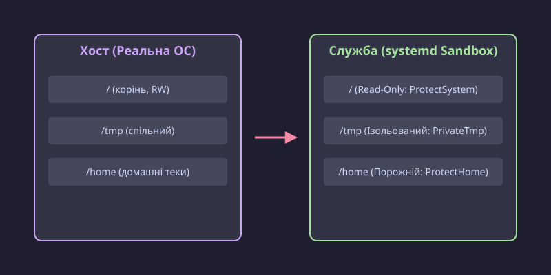

# Пісочниця служби: ProtectSystem, PrivateTmp і решта обмежень юніта

<preknowlist>
- [systemd: юніти, залежності, цілі](book:unix-linux/systemd-model) — служба описана текстовим юнітом, а запускає її менеджер служб, він же PID 1.
- [Життєвий цикл служби й політика перезапуску](book:unix-linux/service-lifecycle) — що робить `systemctl start` і як юніт проходить шлях від запуску до зупинки.
- [Користувачі, групи й ідентичність процесу](book:unix-linux/uid-gid-model) — процес несе числову ідентичність (UID і GID), і саме за цими числами ядро вирішує, що йому дозволено.
- [Біти прав і як їх перевіряють](book:unix-linux/permission-bits) — режим `rwx` на файлі й каталозі та порядок перевірки доступу.
- [Простори імен: ізоляція погляду на систему](book:unix-linux/namespaces) — процесові можна дати власний простір монтувань, мережі чи IPC, у якому система виглядає інакше, ніж на хості.
</preknowlist>

Злам фонової веб-служби чи демона зазвичай надає зловмиснику доступ до всієї файлової системи та процесів, що працюють під тим самим користувачем (часто `root`). Якщо ваша база даних, вебсервер або власна утиліта стає жертвою експлойту віддаленого виконання коду (RCE), зловмисник отримує права цього процесу і може читати конфігурації, паролі або змінювати системні файли. Як ізолювати службу, мінімізувати поверхню атаки й обмежити шкоду, не використовуючи важких контейнерів на кшталт Docker чи Podman?

Systemd надає вбудовані механізми ізоляції та створення «пісочниць» (sandboxing) для будь-якої служби. Ці механізми спираються на ті самі технології ядра Linux (cgroups, namespaces, seccomp), що й Docker, але налаштовуються кількома рядками у файлі юніта.

## Проблема: надмірні привілеї за замовчуванням

Традиційно в Linux служби запускалися від імені користувача `root`. Пізніше стало стандартом створювати окремого користувача (наприклад, `nginx`, `postgres`), щоб обмежити доступ до файлів. Проте навіть непривілейований користувач бачить усю структуру файлової системи `/`, може читати багато загальносистемних файлів, має доступ до мережевих інтерфейсів, спільних каталогів `/tmp` та може використовувати системні виклики (syscalls), які йому насправді не потрібні.

Якщо експлойт використовує вразливість у ядрі, зловмисник може підвищити привілеї. Тому процес служби повинен працювати в середовищі, де він «не бачить і не може» нічого зайвого.

## Ізоляція файлової системи: Mount Namespaces

Найпростіший і найефективніший спосіб захисту — ізоляція файлової системи. Systemd створює для служби окремий простір імен монтування (mount namespace).


*Порівняння файлової системи хоста та ізольованого простору монтувань служби.*

### `ProtectSystem=`

Директива `ProtectSystem=` монтує важливі системні каталоги в режимі «лише для читання» (read-only) для служби.

- `ProtectSystem=yes`: `/usr` і `/boot` стають read-only.
- `ProtectSystem=full`: Додається `/etc` як read-only.
- `ProtectSystem=strict`: **Уся файлова система** стає read-only, за винятком `/dev`, `/proc` та `/sys`. Це найкращий вибір для більшості служб.

Якщо службі потрібно записувати дані в певні каталоги (наприклад, логи в `/var/log/myservice` або дані в `/var/lib/myservice`), ви можете дозволити це за допомогою директиви `ReadWritePaths=`:

```ini
[Service]
ProtectSystem=strict
ReadWritePaths=/var/lib/myservice /var/log/myservice
```

### `ProtectHome=`

Домашні каталоги користувачів часто містять чутливі дані: SSH-ключі, токени, історію команд. Системним службам зазвичай не потрібно туди заглядати.

- `ProtectHome=yes`: Каталоги `/home`, `/root` та `/run/user` стають порожніми і недоступними (змонтовані як `tmpfs`).
- `ProtectHome=read-only`: Робить ці каталоги read-only.

### `PrivateTmp=`

Каталоги `/tmp` і `/var/tmp` є спільними для всієї системи. Це часто призводить до атак типу «symlink attack» або витоку даних.

- `PrivateTmp=yes`: Створює окремий, невидимий для інших процесів простір `/tmp` і `/var/tmp` для цієї служби. Після зупинки служби цей простір автоматично очищується. Це одна з найкорисніших опцій, яку варто вмикати майже завжди.

### `PrivateDevices=`

Каталог `/dev` містить пристрої, які можуть надати прямий доступ до оперативної пам'яті (`/dev/mem`) або дисків (`/dev/sda`).

- `PrivateDevices=yes`: Надає службі лише базові псевдопристрої (такі як `/dev/null`, `/dev/zero`, `/dev/random`), повністю ховаючи фізичні пристрої.

## Обмеження мережі та користувачів

### `PrivateNetwork=`

Якщо ваша служба не потребує доступу до мережі (наприклад, це локальний обробник зображень або фоновий воркер для бази даних через сокет), вимкніть мережу.

- `PrivateNetwork=yes`: Служба бачить лише інтерфейс loopback (`lo`), ізольований від реального.

### `DynamicUser=`

Керування UID/GID для служб завжди було проблемою (треба створювати користувачів, стежити за їхніми ідентифікаторами).

- `DynamicUser=yes`: Systemd динамічно виділяє унікальний UID/GID під час запуску служби і звільняє його після зупинки. Служба не має постійного запису в `/etc/passwd`. Разом із `StateDirectory=` systemd автоматично керуватиме правами доступу до файлів стану, навіть якщо UID змінюється між перезапусками.

## Обмеження системних викликів: Seccomp

Навіть якщо файлова система ізольована, процес усе ще може взаємодіяти з ядром через системні виклики (syscalls). З понад 300 системних викликів у Linux типова служба використовує лише кілька десятків.

За допомогою `SystemCallFilter=` systemd використовує механізм BPF/Seccomp для блокування або дозволу конкретних системних викликів.

```ini
[Service]
# Блокуємо небезпечні групи викликів
SystemCallFilter=~@clock @module @mount @obsolete @raw-io @reboot @swap @privileged
```
Символ `~` означає «заборонити» (чорний список). Групи викликів починаються з `@` (наприклад, `@mount` блокує виклики `mount`, `umount`, `chroot`).

## Приклад захищеного юніта

Розглянемо, як виглядає комплексно захищений сервіс для уявної утиліти `/usr/bin/my_worker`:

```ini
[Unit]
Description=My Secure Background Worker

[Service]
ExecStart=/usr/bin/my_worker
Restart=on-failure

# 1. Ізоляція користувача
DynamicUser=yes
StateDirectory=my_worker

# 2. Ізоляція файлової системи
ProtectSystem=strict
ProtectHome=yes
PrivateTmp=yes
PrivateDevices=yes
ProtectKernelTunables=yes
ProtectKernelModules=yes
ProtectControlGroups=yes

# 3. Обмеження мережі та привілеїв
NoNewPrivileges=yes
RestrictNamespaces=yes
RestrictRealtime=yes

# 4. Фільтрація системних викликів
SystemCallFilter=~@clock @module @mount @obsolete @raw-io @reboot @swap @privileged
SystemCallArchitectures=native

[Install]
WantedBy=multi-user.target
```

## Як перевірити рівень безпеки?

Systemd надає чудову утиліту для аналізу безпеки ваших юнітів:

```bash
systemd-analyze security my_worker.service
```

Вона проаналізує юніт і видасть «оцінку небезпеки» (Exposure). Чим нижча оцінка (від 0.0 до 10.0), тим безпечніший сервіс; поруч із числом друкується словесний рівень — від `DANGEROUS`, `UNSAFE` та `EXPOSED` через `MEDIUM` до `OK`, `SAFE` і `PERFECT`. Утиліта також підкаже, які ще директиви варто додати для покращення ізоляції. Захищений юніт, наведений вище, отримає оцінку «OK» або «SAFE».

Використання вбудованої пісочниці systemd — це потужний спосіб застосувати принцип найменших привілеїв (PoLP) без необхідності впроваджувати складні контейнерні технології.
